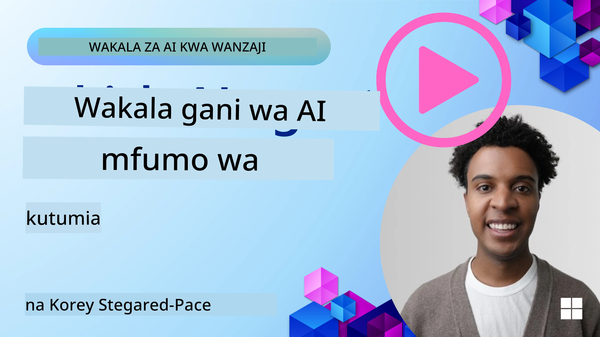

<!--
CO_OP_TRANSLATOR_METADATA:
{
  "original_hash": "7120197753abacc827b64ac2d5d6966f",
  "translation_date": "2025-11-13T13:32:33+00:00",
  "source_file": "02-explore-agentic-frameworks/README.md",
  "language_code": "sw"
}
-->
[](https://youtu.be/ODwF-EZo_O8?si=1xoy_B9RNQfrYdF7)

> _(Bofya picha hapo juu kutazama video ya somo hili)_

# Kuchunguza Mfumo wa Mawakala wa AI

Mifumo ya mawakala wa AI ni majukwaa ya programu yaliyoundwa ili kurahisisha uundaji, usambazaji, na usimamizi wa mawakala wa AI. Mifumo hii huwapa watengenezaji vipengele vilivyotengenezwa tayari, dhana za juu, na zana zinazorahisisha maendeleo ya mifumo changamano ya AI.

Mifumo hii husaidia watengenezaji kuzingatia vipengele vya kipekee vya programu zao kwa kutoa mbinu zilizo sanifu kwa changamoto za kawaida katika maendeleo ya mawakala wa AI. Inaboresha uwezo wa kupanuka, upatikanaji, na ufanisi katika kujenga mifumo ya AI.

## Utangulizi 

Somo hili litashughulikia:

- Mifumo ya Mawakala wa AI ni nini na inawawezesha watengenezaji kufanikisha nini?
- Timu zinawezaje kutumia mifumo hii kuunda haraka, kuboresha, na kuongeza uwezo wa wakala wao?
- Tofauti ni zipi kati ya mifumo na zana zilizoundwa na Microsoft <a href="https://aka.ms/ai-agents/autogen" target="_blank">AutoGen</a>, <a href="https://aka.ms/ai-agents-beginners/semantic-kernel" target="_blank">Semantic Kernel</a>, na <a href="https://aka.ms/ai-agents-beginners/ai-agent-service" target="_blank">Azure AI Agent Service</a>?
- Je, ninaweza kuunganisha zana zangu zilizopo za mfumo wa Azure moja kwa moja, au ninahitaji suluhisho za pekee?
- Huduma ya Mawakala wa Azure AI ni nini na inasaidiaje?

## Malengo ya Kujifunza

Malengo ya somo hili ni kukusaidia kuelewa:

- Jukumu la Mifumo ya Mawakala wa AI katika maendeleo ya AI.
- Jinsi ya kutumia Mifumo ya Mawakala wa AI kujenga mawakala wenye akili.
- Uwezo muhimu unaowezeshwa na Mifumo ya Mawakala wa AI.
- Tofauti kati ya AutoGen, Semantic Kernel, na Azure AI Agent Service.

## Mifumo ya Mawakala wa AI ni nini na inawawezesha watengenezaji kufanya nini?

Mifumo ya AI ya jadi inaweza kusaidia kuunganisha AI katika programu zako na kuzifanya programu hizi kuwa bora kwa njia zifuatazo:

- **Ubinafsishaji**: AI inaweza kuchambua tabia na mapendeleo ya mtumiaji ili kutoa mapendekezo, maudhui, na uzoefu wa kibinafsi.
Mfano: Huduma za utiririshaji kama Netflix hutumia AI kupendekeza filamu na vipindi kulingana na historia ya kutazama, kuboresha ushirikiano wa mtumiaji na kuridhika.

- **Ufanisi na Uendeshaji wa Kiotomatiki**: AI inaweza kuendesha kazi za kurudia, kurahisisha mtiririko wa kazi, na kuboresha ufanisi wa kiutendaji.
Mfano: Programu za huduma kwa wateja hutumia chatbots zinazoendeshwa na AI kushughulikia maswali ya kawaida, kupunguza muda wa kujibu na kuwaachia mawakala wa binadamu masuala magumu zaidi.

- **Uzoefu Bora wa Mtumiaji**: AI inaweza kuboresha uzoefu wa mtumiaji kwa kutoa vipengele vya akili kama utambuzi wa sauti, usindikaji wa lugha asilia, na maandishi ya utabiri.
Mfano: Wasaidizi wa mtandaoni kama Siri na Google Assistant hutumia AI kuelewa na kujibu amri za sauti, kurahisisha watumiaji kuingiliana na vifaa vyao.

### Hiyo yote inasikika vizuri, sivyo? Kwa nini tunahitaji Mfumo wa Mawakala wa AI?

Mifumo ya Mawakala wa AI inawakilisha kitu zaidi ya mifumo ya AI ya kawaida. Imeundwa kuwezesha uundaji wa mawakala wenye akili wanaoweza kuingiliana na watumiaji, mawakala wengine, na mazingira ili kufanikisha malengo maalum. Mawakala hawa wanaweza kuonyesha tabia ya kujitegemea, kufanya maamuzi, na kubadilika kulingana na hali zinazobadilika. Hebu tuangalie uwezo muhimu unaowezeshwa na Mifumo ya Mawakala wa AI:

- **Ushirikiano na Uratibu wa Mawakala**: Kuwezesha uundaji wa mawakala wengi wa AI wanaoweza kufanya kazi pamoja, kuwasiliana, na kuratibu kutatua kazi changamano.
- **Uendeshaji na Usimamizi wa Kazi**: Kutoa mifumo ya kuendesha mtiririko wa kazi wa hatua nyingi, ugawaji wa kazi, na usimamizi wa kazi wa kiotomatiki kati ya mawakala.
- **Uelewa wa Muktadha na Ubadilishaji**: Kuwapa mawakala uwezo wa kuelewa muktadha, kubadilika kwa mazingira yanayobadilika, na kufanya maamuzi kulingana na taarifa za wakati halisi.

Kwa muhtasari, mawakala wanakuwezesha kufanya zaidi, kuchukua uendeshaji wa kiotomatiki hadi kiwango cha juu, na kuunda mifumo yenye akili zaidi inayoweza kubadilika na kujifunza kutoka kwa mazingira yao.

## Jinsi ya kuunda haraka, kuboresha, na kuongeza uwezo wa wakala?

Hili ni eneo linalobadilika haraka, lakini kuna mambo fulani ya kawaida katika Mifumo mingi ya Mawakala wa AI ambayo yanaweza kukusaidia kuunda haraka na kuboresha, yaani vipengele vya moduli, zana za ushirikiano, na kujifunza kwa wakati halisi. Hebu tuingie ndani ya haya:

- **Tumia Vipengele vya Moduli**: SDK za AI hutoa vipengele vilivyotengenezwa tayari kama viunganishi vya AI na Kumbukumbu, kupiga kazi kwa kutumia lugha asilia au programu za nyongeza, templeti za maelekezo, na zaidi.
- **Tumia Zana za Ushirikiano**: Unda mawakala wenye majukumu na kazi maalum, kuwawezesha kujaribu na kuboresha mtiririko wa kazi wa ushirikiano.
- **Jifunze kwa Wakati Halisi**: Tekeleza mizunguko ya maoni ambapo mawakala hujifunza kutoka kwa mwingiliano na kurekebisha tabia zao kwa nguvu.

### Tumia Vipengele vya Moduli

SDK kama Microsoft Semantic Kernel na LangChain hutoa vipengele vilivyotengenezwa tayari kama viunganishi vya AI, templeti za maelekezo, na usimamizi wa kumbukumbu.

**Jinsi timu zinaweza kutumia hizi**: Timu zinaweza kuunganisha haraka vipengele hivi kuunda mfano wa kazi bila kuanza kutoka mwanzo, kuruhusu majaribio ya haraka na maboresho.

**Jinsi inavyofanya kazi kwa vitendo**: Unaweza kutumia parser iliyotengenezwa tayari kutoa taarifa kutoka kwa pembejeo ya mtumiaji, moduli ya kumbukumbu kuhifadhi na kupata data, na jenereta ya maelekezo kuingiliana na watumiaji, yote bila kujenga vipengele hivi kutoka mwanzo.

**Mfano wa programu**. Hebu tuangalie mifano ya jinsi unavyoweza kutumia Kiunganishi cha AI kilichotengenezwa tayari na Semantic Kernel Python na .Net kinachotumia kupiga kazi kiotomatiki ili kuwa na modeli inayojibu pembejeo ya mtumiaji:

``` python
# Semantic Kernel Python Example

import asyncio
from typing import Annotated

from semantic_kernel.connectors.ai import FunctionChoiceBehavior
from semantic_kernel.connectors.ai.open_ai import AzureChatCompletion, AzureChatPromptExecutionSettings
from semantic_kernel.contents import ChatHistory
from semantic_kernel.functions import kernel_function
from semantic_kernel.kernel import Kernel

# Define a ChatHistory object to hold the conversation's context
chat_history = ChatHistory()
chat_history.add_user_message("I'd like to go to New York on January 1, 2025")


# Define a sample plugin that contains the function to book travel
class BookTravelPlugin:
    """A Sample Book Travel Plugin"""

    @kernel_function(name="book_flight", description="Book travel given location and date")
    async def book_flight(
        self, date: Annotated[str, "The date of travel"], location: Annotated[str, "The location to travel to"]
    ) -> str:
        return f"Travel was booked to {location} on {date}"

# Create the Kernel
kernel = Kernel()

# Add the sample plugin to the Kernel object
kernel.add_plugin(BookTravelPlugin(), plugin_name="book_travel")

# Define the Azure OpenAI AI Connector
chat_service = AzureChatCompletion(
    deployment_name="YOUR_DEPLOYMENT_NAME", 
    api_key="YOUR_API_KEY", 
    endpoint="https://<your-resource>.azure.openai.com/",
)

# Define the request settings to configure the model with auto-function calling
request_settings = AzureChatPromptExecutionSettings(function_choice_behavior=FunctionChoiceBehavior.Auto())


async def main():
    # Make the request to the model for the given chat history and request settings
    # The Kernel contains the sample that the model will request to invoke
    response = await chat_service.get_chat_message_content(
        chat_history=chat_history, settings=request_settings, kernel=kernel
    )
    assert response is not None

    """
    Note: In the auto function calling process, the model determines it can invoke the 
    `BookTravelPlugin` using the `book_flight` function, supplying the necessary arguments. 
    
    For example:

    "tool_calls": [
        {
            "id": "call_abc123",
            "type": "function",
            "function": {
                "name": "BookTravelPlugin-book_flight",
                "arguments": "{'location': 'New York', 'date': '2025-01-01'}"
            }
        }
    ]

    Since the location and date arguments are required (as defined by the kernel function), if the 
    model lacks either, it will prompt the user to provide them. For instance:

    User: Book me a flight to New York.
    Model: Sure, I'd love to help you book a flight. Could you please specify the date?
    User: I want to travel on January 1, 2025.
    Model: Your flight to New York on January 1, 2025, has been successfully booked. Safe travels!
    """

    print(f"`{response}`")
    # Example AI Model Response: `Your flight to New York on January 1, 2025, has been successfully booked. Safe travels! ✈️🗽`

    # Add the model's response to our chat history context
    chat_history.add_assistant_message(response.content)


if __name__ == "__main__":
    asyncio.run(main())
```
```csharp
// Semantic Kernel C# example

using Microsoft.SemanticKernel;
using Microsoft.SemanticKernel.ChatCompletion;
using System.ComponentModel;
using Microsoft.SemanticKernel.Connectors.AzureOpenAI;

ChatHistory chatHistory = [];
chatHistory.AddUserMessage("I'd like to go to New York on January 1, 2025");

var kernelBuilder = Kernel.CreateBuilder();
kernelBuilder.AddAzureOpenAIChatCompletion(
    deploymentName: "NAME_OF_YOUR_DEPLOYMENT",
    apiKey: "YOUR_API_KEY",
    endpoint: "YOUR_AZURE_ENDPOINT"
);
kernelBuilder.Plugins.AddFromType<BookTravelPlugin>("BookTravel"); 
var kernel = kernelBuilder.Build();

var settings = new AzureOpenAIPromptExecutionSettings()
{
    FunctionChoiceBehavior = FunctionChoiceBehavior.Auto()
};

var chatCompletion = kernel.GetRequiredService<IChatCompletionService>();

var response = await chatCompletion.GetChatMessageContentAsync(chatHistory, settings, kernel);

/*
Behind the scenes, the model recognizes the tool to call, what arguments it already has (location) and (date)
{

"tool_calls": [
    {
        "id": "call_abc123",
        "type": "function",
        "function": {
            "name": "BookTravelPlugin-book_flight",
            "arguments": "{'location': 'New York', 'date': '2025-01-01'}"
        }
    }
]
*/

Console.WriteLine(response.Content);
chatHistory.AddMessage(response!.Role, response!.Content!);

// Example AI Model Response: Your flight to New York on January 1, 2025, has been successfully booked. Safe travels! ✈️🗽

// Define a plugin that contains the function to book travel
public class BookTravelPlugin
{
    [KernelFunction("book_flight")]
    [Description("Book travel given location and date")]
    public async Task<string> BookFlight(DateTime date, string location)
    {
        return await Task.FromResult( $"Travel was booked to {location} on {date}");
    }
}
```

Unachoweza kuona kutoka kwa mfano huu ni jinsi unavyoweza kutumia parser iliyotengenezwa tayari kutoa taarifa muhimu kutoka kwa pembejeo ya mtumiaji, kama asili, marudio, na tarehe ya ombi la uhifadhi wa ndege. Mbinu hii ya moduli inakuwezesha kuzingatia mantiki ya kiwango cha juu.

### Tumia Zana za Ushirikiano

Mifumo kama CrewAI, Microsoft AutoGen, na Semantic Kernel hufanikisha uundaji wa mawakala wengi wanaoweza kufanya kazi pamoja.

**Jinsi timu zinaweza kutumia hizi**: Timu zinaweza kuunda mawakala wenye majukumu na kazi maalum, kuwawezesha kujaribu na kuboresha mtiririko wa kazi wa ushirikiano na kuboresha ufanisi wa mfumo kwa ujumla.

**Jinsi inavyofanya kazi kwa vitendo**: Unaweza kuunda timu ya mawakala ambapo kila wakala ana kazi maalum, kama vile kupata data, kuchambua, au kufanya maamuzi. Mawakala hawa wanaweza kuwasiliana na kushiriki taarifa kufanikisha lengo la pamoja, kama kujibu swali la mtumiaji au kukamilisha kazi.

**Mfano wa programu (AutoGen)**:

```python
# creating agents, then create a round robin schedule where they can work together, in this case in order

# Data Retrieval Agent
# Data Analysis Agent
# Decision Making Agent

agent_retrieve = AssistantAgent(
    name="dataretrieval",
    model_client=model_client,
    tools=[retrieve_tool],
    system_message="Use tools to solve tasks."
)

agent_analyze = AssistantAgent(
    name="dataanalysis",
    model_client=model_client,
    tools=[analyze_tool],
    system_message="Use tools to solve tasks."
)

# conversation ends when user says "APPROVE"
termination = TextMentionTermination("APPROVE")

user_proxy = UserProxyAgent("user_proxy", input_func=input)

team = RoundRobinGroupChat([agent_retrieve, agent_analyze, user_proxy], termination_condition=termination)

stream = team.run_stream(task="Analyze data", max_turns=10)
# Use asyncio.run(...) when running in a script.
await Console(stream)
```

Unachokiona katika programu ya awali ni jinsi unavyoweza kuunda kazi inayohusisha mawakala wengi wanaofanya kazi pamoja kuchambua data. Kila wakala hufanya kazi maalum, na kazi inatekelezwa kwa kuratibu mawakala kufanikisha matokeo yanayotarajiwa. Kwa kuunda mawakala maalum wenye majukumu maalum, unaweza kuboresha ufanisi wa kazi na utendaji.

### Jifunze kwa Wakati Halisi

Mifumo ya hali ya juu hutoa uwezo wa kuelewa muktadha wa wakati halisi na kubadilika.

**Jinsi timu zinaweza kutumia hizi**: Timu zinaweza kutekeleza mizunguko ya maoni ambapo mawakala hujifunza kutoka kwa mwingiliano na kurekebisha tabia zao kwa nguvu, na kusababisha maboresho ya kuendelea na uboreshaji wa uwezo.

**Jinsi inavyofanya kazi kwa vitendo**: Mawakala wanaweza kuchambua maoni ya mtumiaji, data ya mazingira, na matokeo ya kazi ili kusasisha hifadhidata yao ya maarifa, kurekebisha algorithmu za kufanya maamuzi, na kuboresha utendaji kwa muda. Mchakato huu wa kujifunza kwa kurudia unawawezesha mawakala kubadilika kulingana na hali zinazobadilika na mapendeleo ya mtumiaji, kuboresha ufanisi wa mfumo kwa ujumla.

## Tofauti ni zipi kati ya mifumo AutoGen, Semantic Kernel na Azure AI Agent Service?

Kuna njia nyingi za kulinganisha mifumo hii, lakini hebu tuangalie tofauti muhimu kwa mujibu wa muundo wao, uwezo, na matumizi yanayolengwa:

## AutoGen

AutoGen ni mfumo wa chanzo huria uliotengenezwa na Maabara ya AI Frontiers ya Microsoft Research. Unalenga programu za wakala wa *kijumuishi* zinazoendeshwa na matukio, zinazowezesha LLMs na SLMs nyingi, zana, na mifumo ya hali ya juu ya muundo wa mawakala wengi.

AutoGen umejengwa kuzunguka dhana ya msingi ya mawakala, ambao ni vyombo vya kujitegemea vinavyoweza kutambua mazingira yao, kufanya maamuzi, na kuchukua hatua kufanikisha malengo maalum. Mawakala huwasiliana kupitia ujumbe usio wa moja kwa moja, kuwawezesha kufanya kazi kwa kujitegemea na kwa sambamba, kuboresha uwezo wa kupanuka na kujibu wa mfumo.

<a href="https://en.wikipedia.org/wiki/Actor_model" target="_blank">Mawakala wanategemea mfano wa mwigizaji</a>. Kulingana na Wikipedia, mwigizaji ni _sehemu ya msingi ya hesabu ya pamoja. Kwa kujibu ujumbe unaopokelewa, mwigizaji anaweza: kufanya maamuzi ya ndani, kuunda waigizaji zaidi, kutuma ujumbe zaidi, na kuamua jinsi ya kujibu ujumbe unaofuata unaopokelewa_.

**Matumizi**: Kuendesha kizazi cha programu kiotomatiki, kazi za uchambuzi wa data, na kujenga mawakala maalum kwa kazi za kupanga na utafiti.

Hapa kuna dhana muhimu za msingi za AutoGen:

- **Mawakala**. Wakala ni chombo cha programu ambacho:
  - **Huwasiliana kupitia ujumbe**, ujumbe huu unaweza kuwa wa moja kwa moja au usio wa moja kwa moja.
  - **Hudumisha hali yake mwenyewe**, ambayo inaweza kubadilishwa na ujumbe unaoingia.
  - **Hufanya vitendo** kujibu ujumbe uliopokelewa au mabadiliko katika hali yake. Vitendo hivi vinaweza kubadilisha hali ya wakala na kutoa athari za nje, kama kusasisha kumbukumbu za ujumbe, kutuma ujumbe mpya, kutekeleza programu, au kufanya miito ya API.

  Hapa kuna kipande kifupi cha programu ambacho unaunda wakala wako mwenyewe mwenye uwezo wa mazungumzo:

    ```python
    from autogen_agentchat.agents import AssistantAgent
    from autogen_agentchat.messages import TextMessage
    from autogen_ext.models.openai import OpenAIChatCompletionClient


    class MyAgent(RoutedAgent):
        def __init__(self, name: str) -> None:
            super().__init__(name)
            model_client = OpenAIChatCompletionClient(model="gpt-4o")
            self._delegate = AssistantAgent(name, model_client=model_client)
    
        @message_handler
        async def handle_my_message_type(self, message: MyMessageType, ctx: MessageContext) -> None:
            print(f"{self.id.type} received message: {message.content}")
            response = await self._delegate.on_messages(
                [TextMessage(content=message.content, source="user")], ctx.cancellation_token
            )
            print(f"{self.id.type} responded: {response.chat_message.content}")
    ```
    
Katika programu ya awali, `MyAgent` imeundwa na kurithi kutoka kwa `RoutedAgent`. Ina mshughulikiaji wa ujumbe unaochapisha maudhui ya ujumbe na kisha kutuma jibu kwa kutumia wakala wa `AssistantAgent`. Kumbuka hasa jinsi tunavyoweka kwa `self._delegate` mfano wa `AssistantAgent` ambayo ni wakala uliotengenezwa tayari anayeshughulikia mazungumzo.

Hebu tujulisha AutoGen kuhusu aina hii ya wakala na kuanzisha programu:

    ```python
    
    # main.py
    runtime = SingleThreadedAgentRuntime()
    await MyAgent.register(runtime, "my_agent", lambda: MyAgent())

    runtime.start()  # Start processing messages in the background.
    await runtime.send_message(MyMessageType("Hello, World!"), AgentId("my_agent", "default"))
    ```

Katika programu ya awali mawakala wamesajiliwa na runtime na kisha ujumbe unatumwa kwa wakala na kusababisha matokeo yafuatayo:

    ```text
    # Output from the console:
    my_agent received message: Hello, World!
    my_assistant received message: Hello, World!
    my_assistant responded: Hello! How can I assist you today?
    ```

- **Mawakala Wengi**. AutoGen inaunga mkono uundaji wa mawakala wengi wanaoweza kufanya kazi pamoja kufanikisha kazi changamano. Mawakala wanaweza kuwasiliana, kushiriki taarifa, na kuratibu vitendo vyao kutatua matatizo kwa ufanisi zaidi. Ili kuunda mfumo wa mawakala wengi, unaweza kufafanua aina tofauti za mawakala wenye kazi na majukumu maalum, kama vile kupata data, kuchambua, kufanya maamuzi, na kuingiliana na mtumiaji. Hebu tuone jinsi uundaji kama huo unavyoonekana ili tupate hisia ya hilo:

    ```python
    editor_description = "Editor for planning and reviewing the content."

    # Example of declaring an Agent
    editor_agent_type = await EditorAgent.register(
    runtime,
    editor_topic_type,  # Using topic type as the agent type.
    lambda: EditorAgent(
        description=editor_description,
        group_chat_topic_type=group_chat_topic_type,
        model_client=OpenAIChatCompletionClient(
            model="gpt-4o-2024-08-06",
            # api_key="YOUR_API_KEY",
        ),
        ),
    )

    # remaining declarations shortened for brevity

    # Group chat
    group_chat_manager_type = await GroupChatManager.register(
    runtime,
    "group_chat_manager",
    lambda: GroupChatManager(
        participant_topic_types=[writer_topic_type, illustrator_topic_type, editor_topic_type, user_topic_type],
        model_client=OpenAIChatCompletionClient(
            model="gpt-4o-2024-08-06",
            # api_key="YOUR_API_KEY",
        ),
        participant_descriptions=[
            writer_description, 
            illustrator_description, 
            editor_description, 
            user_description
        ],
        ),
    )
    ```

Katika programu ya awali tuna `GroupChatManager` ambayo imesajiliwa na runtime. Meneja huyu anahusika na kuratibu mwingiliano kati ya aina tofauti za mawakala, kama waandishi, wachoraji, wahariri, na watumiaji.

- **Runtime ya Mawakala**. Mfumo hutoa mazingira ya runtime, kuwezesha mawasiliano kati ya mawakala, kusimamia utambulisho wao na mizunguko ya maisha, na kutekeleza mipaka ya usalama na faragha. Hii inamaanisha kuwa unaweza kuendesha mawakala wako katika mazingira salama na yanayodhibitiwa, kuhakikisha kuwa wanaweza kuingiliana kwa usalama na ufanisi. Kuna runtime mbili za kuvutia:
  - **Runtime ya pekee**. Hii ni chaguo nzuri kwa programu za mchakato mmoja ambapo mawakala wote wanatekelezwa kwa lugha moja ya programu na kuendeshwa katika mchakato mmoja. Hapa kuna mfano wa jinsi inavyofanya kazi:
  
    <a href="https://microsoft.github.io/autogen/stable/_images/architecture-standalone.svg" target="_blank">Runtime ya pekee</a>   
Stack ya programu

    *mawakala huwasiliana kupitia ujumbe kupitia runtime, na runtime inasimamia mzunguko wa maisha ya mawakala*

  - **Runtime ya mawakala wa kusambazwa**, inafaa kwa programu za mchakato mwingi ambapo mawakala wanaweza kutekelezwa kwa lugha tofauti za programu na kuendeshwa kwenye mashine tofauti. Hapa kuna mfano wa jinsi inavyofanya kazi:
  
    <a href="https://microsoft.github.io/autogen/stable/_images/architecture-distributed.svg" target="_blank">Runtime ya kusambazwa</a>

## Semantic Kernel + Mfumo wa Mawakala

Semantic Kernel ni SDK ya Orchestration ya AI inayofaa kwa biashara. Inajumuisha viunganishi vya AI na kumbukumbu, pamoja na Mfumo wa Mawakala.

Hebu kwanza tuangalie vipengele vya msingi:

- **Viunganishi vya AI**: Hii ni kiunganishi na huduma za AI za nje na vyanzo vya data kwa matumizi katika Python na C#.

  ```python
  # Semantic Kernel Python
  from semantic_kernel.connectors.ai.open_ai import AzureChatCompletion
  from semantic_kernel.kernel import Kernel

  kernel = Kernel()
  kernel.add_service(
    AzureChatCompletion(
        deployment_name="your-deployment-name",
        api_key="your-api-key",
        endpoint="your-endpoint",
    )
  )
  ```  

    ```csharp
    // Semantic Kernel C#
    using Microsoft.SemanticKernel;

    // Create kernel
    var builder = Kernel.CreateBuilder();
    
    // Add a chat completion service:
    builder.Services.AddAzureOpenAIChatCompletion(
        "your-resource-name",
        "your-endpoint",
        "your-resource-key",
        "deployment-model");
    var kernel = builder.Build();
    ```

Hapa kuna mfano rahisi wa jinsi unavyoweza kuunda kernel na kuongeza huduma ya mazungumzo ya kukamilisha. Semantic Kernel huunda kiunganishi na huduma ya AI ya nje, katika kesi hii, Azure OpenAI Chat Completion.

- **Plugins**: Hizi hufungasha kazi ambazo programu inaweza kutumia. Kuna plugins zilizotengenezwa tayari na za kawaida unazoweza kuunda. Dhana inayohusiana ni "kazi za maelekezo." Badala ya kutoa maelekezo ya lugha asilia kwa ajili ya kupiga kazi, unatangaza kazi fulani kwa modeli. Kulingana na muktadha wa mazungumzo ya sasa, modeli inaweza kuchagua kupiga moja ya kazi hizi kukamilisha ombi au swali. Hapa kuna mfano:

  ```python
  from semantic_kernel.connectors.ai.open_ai.services.azure_chat_completion import AzureChatCompletion


  async def main():
      from semantic_kernel.functions import KernelFunctionFromPrompt
      from semantic_kernel.kernel import Kernel

      kernel = Kernel()
      kernel.add_service(AzureChatCompletion())

      user_input = input("User Input:> ")

      kernel_function = KernelFunctionFromPrompt(
          function_name="SummarizeText",
          prompt="""
          Summarize the provided unstructured text in a sentence that is easy to understand.
          Text to summarize: {{$user_input}}
          """,
      )

      response = await kernel_function.invoke(kernel=kernel, user_input=user_input)
      print(f"Model Response: {response}")

      """
      Sample Console Output:

      User Input:> I like dogs
      Model Response: The text expresses a preference for dogs.
      """


  if __name__ == "__main__":
    import asyncio
    asyncio.run(main())
  ```

    ```csharp
    var userInput = Console.ReadLine();

    // Define semantic function inline.
    string skPrompt = @"Summarize the provided unstructured text in a sentence that is easy to understand.
                        Text to summarize: {{$userInput}}";
    
    // create the function from the prompt
    KernelFunction summarizeFunc = kernel.CreateFunctionFromPrompt(
        promptTemplate: skPrompt,
        functionName: "SummarizeText"
    );

    //then import into the current kernel
    kernel.ImportPluginFromFunctions("SemanticFunctions", [summarizeFunc]);

    ```

Hapa, kwanza una template ya maelekezo `skPrompt` inayotoa nafasi kwa mtumiaji kuingiza maandishi, `$userInput`. Kisha unaunda kazi ya kernel `SummarizeText` na kisha kuiingiza kwenye kernel na jina la plugin `SemanticFunctions`. Kumbuka jina la kazi ambalo husaidia Semantic Kernel kuelewa kazi hiyo inafanya nini na wakati inapaswa kuitwa.

- **Kazi Asilia**: Pia kuna kazi asilia ambazo mfumo unaweza kupiga moja kwa moja kutekeleza kazi. Hapa kuna mfano wa kazi kama hiyo inayopata maudhui kutoka kwa faili:

    ```csharp
    public class NativeFunctions {

        [SKFunction, Description("Retrieve content from local file")]
        public async Task<string> RetrieveLocalFile(string fileName, int maxSize = 5000)
        {
            string content = await File.ReadAllTextAsync(fileName);
            if (content.Length <= maxSize) return content;
            return content.Substring(0, maxSize);
        }
    }
    
    //Import native function
    string plugInName = "NativeFunction";
    string functionName = "RetrieveLocalFile";

   //To add the functions to a kernel use the following function
    kernel.ImportPluginFromType<NativeFunctions>();

    ```

- **Kumbukumbu
Haya maelezo basi huhifadhiwa katika mkusanyiko wa kumbukumbu `SummarizedAzureDocs`. Hii ni mfano rahisi sana, lakini unaweza kuona jinsi ya kuhifadhi taarifa katika kumbukumbu kwa matumizi ya LLM.

Hivyo ndivyo msingi wa mfumo wa Semantic Kernel, vipi kuhusu Agent Framework?

## Huduma ya Azure AI Agent

Huduma ya Azure AI Agent ni nyongeza ya hivi karibuni, iliyotangazwa katika Microsoft Ignite 2024. Inaruhusu maendeleo na utekelezaji wa mawakala wa AI kwa kutumia mifano inayobadilika zaidi, kama vile kupiga simu moja kwa moja kwa LLMs za wazi kama Llama 3, Mistral, na Cohere.

Huduma ya Azure AI Agent inatoa mifumo ya usalama wa biashara yenye nguvu na mbinu za kuhifadhi data, ikifanya iwe bora kwa matumizi ya biashara.

Inafanya kazi moja kwa moja na mifumo ya uratibu wa mawakala kama AutoGen na Semantic Kernel.

Huduma hii kwa sasa ipo katika Public Preview na inasaidia Python na C# kwa ajili ya kujenga mawakala.

Kwa kutumia Semantic Kernel Python, tunaweza kuunda Azure AI Agent na programu-jalizi iliyofafanuliwa na mtumiaji:

```python
import asyncio
from typing import Annotated

from azure.identity.aio import DefaultAzureCredential

from semantic_kernel.agents import AzureAIAgent, AzureAIAgentSettings, AzureAIAgentThread
from semantic_kernel.contents import ChatMessageContent
from semantic_kernel.contents import AuthorRole
from semantic_kernel.functions import kernel_function


# Define a sample plugin for the sample
class MenuPlugin:
    """A sample Menu Plugin used for the concept sample."""

    @kernel_function(description="Provides a list of specials from the menu.")
    def get_specials(self) -> Annotated[str, "Returns the specials from the menu."]:
        return """
        Special Soup: Clam Chowder
        Special Salad: Cobb Salad
        Special Drink: Chai Tea
        """

    @kernel_function(description="Provides the price of the requested menu item.")
    def get_item_price(
        self, menu_item: Annotated[str, "The name of the menu item."]
    ) -> Annotated[str, "Returns the price of the menu item."]:
        return "$9.99"


async def main() -> None:
    ai_agent_settings = AzureAIAgentSettings.create()

    async with (
        DefaultAzureCredential() as creds,
        AzureAIAgent.create_client(
            credential=creds,
            conn_str=ai_agent_settings.project_connection_string.get_secret_value(),
        ) as client,
    ):
        # Create agent definition
        agent_definition = await client.agents.create_agent(
            model=ai_agent_settings.model_deployment_name,
            name="Host",
            instructions="Answer questions about the menu.",
        )

        # Create the AzureAI Agent using the defined client and agent definition
        agent = AzureAIAgent(
            client=client,
            definition=agent_definition,
            plugins=[MenuPlugin()],
        )

        # Create a thread to hold the conversation
        # If no thread is provided, a new thread will be
        # created and returned with the initial response
        thread: AzureAIAgentThread | None = None

        user_inputs = [
            "Hello",
            "What is the special soup?",
            "How much does that cost?",
            "Thank you",
        ]

        try:
            for user_input in user_inputs:
                print(f"# User: '{user_input}'")
                # Invoke the agent for the specified thread
                response = await agent.get_response(
                    messages=user_input,
                    thread_id=thread,
                )
                print(f"# {response.name}: {response.content}")
                thread = response.thread
        finally:
            await thread.delete() if thread else None
            await client.agents.delete_agent(agent.id)


if __name__ == "__main__":
    asyncio.run(main())
```

### Dhana za Msingi

Huduma ya Azure AI Agent ina dhana zifuatazo za msingi:

- **Agent**. Huduma ya Azure AI Agent inaunganishwa na Azure AI Foundry. Ndani ya AI Foundry, AI Agent hufanya kazi kama huduma ndogo "smart" inayoweza kutumika kujibu maswali (RAG), kutekeleza vitendo, au kuendesha kabisa mtiririko wa kazi. Inafanikisha hili kwa kuchanganya nguvu za mifano ya AI ya kizazi na zana zinazoiwezesha kufikia na kuingiliana na vyanzo vya data halisi. Hapa kuna mfano wa wakala:

    ```python
    agent = project_client.agents.create_agent(
        model="gpt-4o-mini",
        name="my-agent",
        instructions="You are helpful agent",
        tools=code_interpreter.definitions,
        tool_resources=code_interpreter.resources,
    )
    ```

    Katika mfano huu, wakala ameundwa na mfano `gpt-4o-mini`, jina `my-agent`, na maelekezo `You are helpful agent`. Wakala amepewa zana na rasilimali za kutekeleza kazi za tafsiri ya msimbo.

- **Thread na ujumbe**. Thread ni dhana nyingine muhimu. Inawakilisha mazungumzo au mwingiliano kati ya wakala na mtumiaji. Thread zinaweza kutumika kufuatilia maendeleo ya mazungumzo, kuhifadhi taarifa za muktadha, na kusimamia hali ya mwingiliano. Hapa kuna mfano wa thread:

    ```python
    thread = project_client.agents.create_thread()
    message = project_client.agents.create_message(
        thread_id=thread.id,
        role="user",
        content="Could you please create a bar chart for the operating profit using the following data and provide the file to me? Company A: $1.2 million, Company B: $2.5 million, Company C: $3.0 million, Company D: $1.8 million",
    )
    
    # Ask the agent to perform work on the thread
    run = project_client.agents.create_and_process_run(thread_id=thread.id, agent_id=agent.id)
    
    # Fetch and log all messages to see the agent's response
    messages = project_client.agents.list_messages(thread_id=thread.id)
    print(f"Messages: {messages}")
    ```

    Katika msimbo uliopita, thread imeundwa. Baada ya hapo, ujumbe umetumwa kwa thread. Kwa kupiga `create_and_process_run`, wakala ameombwa kufanya kazi kwenye thread. Hatimaye, ujumbe unapatikana na kuandikwa ili kuona majibu ya wakala. Ujumbe unaonyesha maendeleo ya mazungumzo kati ya mtumiaji na wakala. Pia ni muhimu kuelewa kwamba ujumbe unaweza kuwa wa aina tofauti kama vile maandishi, picha, au faili, yaani kazi ya wakala imesababisha kwa mfano picha au jibu la maandishi. Kama msanidi programu, unaweza kutumia taarifa hii kuendelea kuchakata jibu au kulionesha kwa mtumiaji.

- **Inaunganishwa na mifumo mingine ya AI**. Huduma ya Azure AI Agent inaweza kuingiliana na mifumo mingine kama AutoGen na Semantic Kernel, ambayo inamaanisha unaweza kujenga sehemu ya programu yako katika mojawapo ya mifumo hii na kwa mfano kutumia Huduma ya Agent kama mratibu au unaweza kujenga kila kitu katika Huduma ya Agent.

**Matumizi**: Huduma ya Azure AI Agent imeundwa kwa matumizi ya biashara yanayohitaji utekelezaji wa mawakala wa AI salama, unaoweza kupanuka, na unaobadilika.

## Tofauti ni ipi kati ya mifumo hii?

Inaonekana kuna mwingiliano mwingi kati ya mifumo hii, lakini kuna tofauti muhimu katika muundo, uwezo, na matumizi yanayolengwa:

- **AutoGen**: Ni mfumo wa majaribio unaolenga utafiti wa kisasa juu ya mifumo ya mawakala wengi. Ni mahali bora pa kujaribu na kuunda mifumo ya mawakala wengi yenye ustadi.
- **Semantic Kernel**: Ni maktaba ya wakala inayoweza kutumika kwa ajili ya kujenga programu za mawakala wa biashara. Inalenga programu za mawakala wa tukio, zilizogawanyika, ikiruhusu LLMs na SLMs nyingi, zana, na miundo ya mawakala mmoja/wengi.
- **Huduma ya Azure AI Agent**: Ni jukwaa na huduma ya utekelezaji katika Azure Foundry kwa mawakala. Inatoa uunganishaji wa huduma zinazosaidiwa na Azure kama Azure OpenAI, Azure AI Search, Bing Search na utekelezaji wa msimbo.

Bado hujui ni ipi ya kuchagua?

### Matumizi

Hebu tujaribu kukusaidia kwa kupitia baadhi ya matumizi ya kawaida:

> Q: Ninajaribu, kujifunza na kujenga programu za mawakala wa dhana, na ninataka kuwa na uwezo wa kujenga na kujaribu haraka
>

>A: AutoGen itakuwa chaguo nzuri kwa hali hii, kwani inalenga programu za mawakala wa tukio, zilizogawanyika na inasaidia miundo ya mawakala wengi yenye ustadi.

> Q: Nini kinachofanya AutoGen kuwa chaguo bora kuliko Semantic Kernel na Huduma ya Azure AI Agent kwa matumizi haya?
>
> A: AutoGen imeundwa mahsusi kwa programu za mawakala wa tukio, zilizogawanyika, ikifanya iwe bora kwa kazi za kizazi cha msimbo na uchambuzi wa data. Inatoa zana na uwezo unaohitajika kujenga mifumo ya mawakala wengi yenye ustadi kwa ufanisi.

>Q: Inaonekana kama Huduma ya Azure AI Agent inaweza kufanya kazi hapa pia, ina zana za kizazi cha msimbo na zaidi?

>
> A: Ndiyo, Huduma ya Azure AI Agent ni huduma ya jukwaa kwa mawakala na inaongeza uwezo wa kujengwa kwa mifano mingi, Azure AI Search, Bing Search na Azure Functions. Inafanya iwe rahisi kujenga mawakala wako katika Foundry Portal na kuwatekeleza kwa kiwango kikubwa.

> Q: Bado siko wazi, nipe chaguo moja tu
>
> A: Chaguo bora ni kujenga programu yako katika Semantic Kernel kwanza na kisha kutumia Huduma ya Azure AI Agent kutekeleza wakala wako. Njia hii inakuruhusu kuhifadhi mawakala wako kwa urahisi huku ukitumia nguvu ya kujenga mifumo ya mawakala wengi katika Semantic Kernel. Zaidi ya hayo, Semantic Kernel ina kiunganishi katika AutoGen, ikifanya iwe rahisi kutumia mifumo yote miwili pamoja.

Hebu tuweke tofauti muhimu katika jedwali:

| Mfumo | Lengo | Dhana za Msingi | Matumizi |
| --- | --- | --- | --- |
| AutoGen | Programu za mawakala wa tukio, zilizogawanyika | Mawakala, Personas, Functions, Data | Kizazi cha msimbo, kazi za uchambuzi wa data |
| Semantic Kernel | Kuelewa na kuzalisha maudhui ya maandishi yanayofanana na binadamu | Mawakala, Vipengele vya Modular, Ushirikiano | Kuelewa lugha ya asili, kizazi cha maudhui |
| Huduma ya Azure AI Agent | Mifano inayobadilika, usalama wa biashara, Kizazi cha msimbo, Kuita zana | Modularity, Ushirikiano, Uratibu wa Mchakato | Utekelezaji wa mawakala wa AI salama, unaoweza kupanuka, na unaobadilika |

Matumizi bora ya kila mfumo ni yapi?

## Je, ninaweza kuunganisha zana zangu zilizopo za mfumo wa Azure moja kwa moja, au ninahitaji suluhisho za pekee?

Jibu ni ndiyo, unaweza kuunganisha zana zako zilizopo za mfumo wa Azure moja kwa moja na Huduma ya Azure AI Agent hasa, kwa sababu imejengwa kufanya kazi bila matatizo na huduma nyingine za Azure. Kwa mfano, unaweza kuunganisha Bing, Azure AI Search, na Azure Functions. Pia kuna muunganisho wa kina na Azure AI Foundry.

Kwa AutoGen na Semantic Kernel, unaweza pia kuunganisha na huduma za Azure, lakini inaweza kuhitaji kupiga huduma za Azure kutoka kwa msimbo wako. Njia nyingine ya kuunganisha ni kutumia SDKs za Azure kuingiliana na huduma za Azure kutoka kwa mawakala wako. Zaidi ya hayo, kama ilivyotajwa, unaweza kutumia Huduma ya Azure AI Agent kama mratibu wa mawakala wako walioundwa katika AutoGen au Semantic Kernel ambayo ingetoa ufikiaji rahisi kwa mfumo wa Azure.

## Mifano ya Msimbo

- Python: [Agent Framework](./code_samples/02-python-agent-framework.ipynb)
- .NET: [Agent Framework](./code_samples/02-dotnet-agent-framework.md)

## Una Maswali Zaidi kuhusu Mifumo ya Mawakala wa AI?

Jiunge na [Azure AI Foundry Discord](https://aka.ms/ai-agents/discord) ili kukutana na wanafunzi wengine, kuhudhuria masaa ya ofisi na kupata majibu ya maswali yako kuhusu Mawakala wa AI.

## Marejeleo

- <a href="https://techcommunity.microsoft.com/blog/azure-ai-services-blog/introducing-azure-ai-agent-service/4298357" target="_blank">Huduma ya Azure Agent</a>
- <a href="https://devblogs.microsoft.com/semantic-kernel/microsofts-agentic-ai-frameworks-autogen-and-semantic-kernel/" target="_blank">Semantic Kernel na AutoGen</a>
- <a href="https://learn.microsoft.com/semantic-kernel/frameworks/agent/?pivots=programming-language-python" target="_blank">Semantic Kernel Python Agent Framework</a>
- <a href="https://learn.microsoft.com/semantic-kernel/frameworks/agent/?pivots=programming-language-csharp" target="_blank">Semantic Kernel .Net Agent Framework</a>
- <a href="https://learn.microsoft.com/azure/ai-services/agents/overview" target="_blank">Huduma ya Azure AI Agent</a>
- <a href="https://techcommunity.microsoft.com/blog/educatordeveloperblog/using-azure-ai-agent-service-with-autogen--semantic-kernel-to-build-a-multi-agen/4363121" target="_blank">Kutumia Huduma ya Azure AI Agent na AutoGen / Semantic Kernel kujenga suluhisho la mawakala wengi</a>

## Somo la Awali

[Utangulizi wa Mawakala wa AI na Matumizi ya Mawakala](../01-intro-to-ai-agents/README.md)

## Somo Linalofuata

[Kuelewa Miundo ya Mawakala](../03-agentic-design-patterns/README.md)

---

<!-- CO-OP TRANSLATOR DISCLAIMER START -->
**Kanusho**:  
Hati hii imetafsiriwa kwa kutumia huduma ya tafsiri ya AI [Co-op Translator](https://github.com/Azure/co-op-translator). Ingawa tunajitahidi kwa usahihi, tafadhali fahamu kuwa tafsiri za kiotomatiki zinaweza kuwa na makosa au kutokuwa sahihi. Hati ya asili katika lugha yake ya awali inapaswa kuzingatiwa kama chanzo cha mamlaka. Kwa taarifa muhimu, tafsiri ya kitaalamu ya binadamu inapendekezwa. Hatutawajibika kwa kutoelewana au tafsiri zisizo sahihi zinazotokana na matumizi ya tafsiri hii.
<!-- CO-OP TRANSLATOR DISCLAIMER END -->