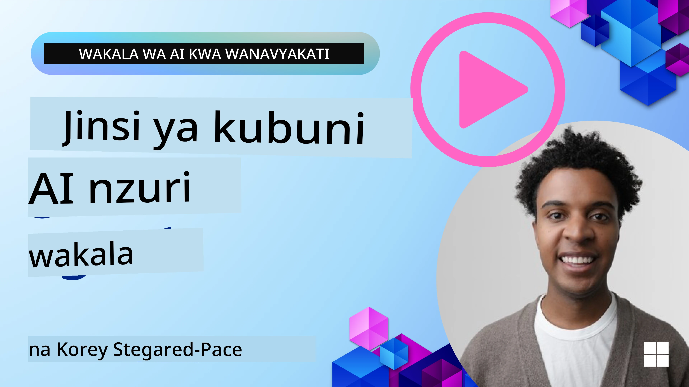
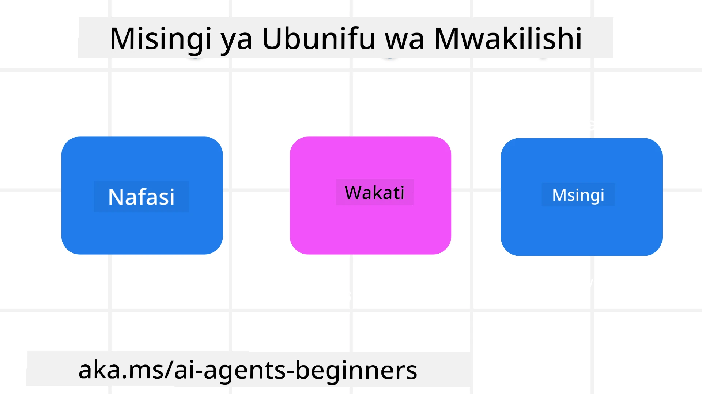

<!--
CO_OP_TRANSLATOR_METADATA:
{
  "original_hash": "d71524fe83a23829ae7a23b4031aaac8",
  "translation_date": "2025-11-13T13:35:21+00:00",
  "source_file": "03-agentic-design-patterns/README.md",
  "language_code": "sw"
}
-->

> _(Bonyeza picha hapo juu kutazama video ya somo hili)_
# Kanuni za Ubunifu wa Mawakala wa AI

## Utangulizi

Kuna njia nyingi za kufikiria kuhusu kujenga Mifumo ya Mawakala wa AI. Kwa kuwa kutokuwa na uhakika ni kipengele na si kasoro katika ubunifu wa Generative AI, mara nyingine ni vigumu kwa wahandisi kujua wapi pa kuanzia. Tumetengeneza seti ya Kanuni za Ubunifu wa UX zinazozingatia binadamu ili kuwezesha watengenezaji kujenga mifumo ya mawakala inayozingatia wateja ili kutatua mahitaji yao ya kibiashara. Kanuni hizi za ubunifu si muundo wa lazima bali ni sehemu ya kuanzia kwa timu zinazofafanua na kujenga uzoefu wa mawakala.

Kwa ujumla, mawakala wanapaswa:

- Kuongeza na kupanua uwezo wa binadamu (kufikiria kwa pamoja, kutatua matatizo, otomatiki, nk.)
- Kujaza mapengo ya maarifa (kunipa maarifa ya haraka kuhusu nyanja za maarifa, tafsiri, nk.)
- Kuwezesha na kusaidia ushirikiano kwa njia tunazopendelea kufanya kazi na wengine
- Kutufanya tuwe toleo bora zaidi la sisi wenyewe (mfano, kocha wa maisha/msimamizi wa kazi, kutusaidia kujifunza ustahimilivu wa kihisia na ujuzi wa kutafakari, kujenga ustahimilivu, nk.)

## Somo Hili Litashughulikia

- Kanuni za Ubunifu wa Mawakala ni nini
- Miongozo ya kufuata wakati wa kutekeleza kanuni hizi za ubunifu
- Mifano ya kutumia kanuni za ubunifu

## Malengo ya Kujifunza

Baada ya kukamilisha somo hili, utaweza:

1. Kuelezea Kanuni za Ubunifu wa Mawakala ni nini
2. Kuelezea miongozo ya kutumia Kanuni za Ubunifu wa Mawakala
3. Kuelewa jinsi ya kujenga wakala kwa kutumia Kanuni za Ubunifu wa Mawakala

## Kanuni za Ubunifu wa Mawakala

### Wakala (Eneo)

Hii ni mazingira ambayo wakala hufanya kazi. Kanuni hizi zinaelekeza jinsi tunavyobuni mawakala kwa kushiriki katika ulimwengu wa kimwili na wa kidijitali.

- **Kuunganisha, si kupunguza** – kusaidia kuunganisha watu na watu wengine, matukio, na maarifa yanayoweza kutekelezwa ili kuwezesha ushirikiano na muunganisho.
- Mawakala husaidia kuunganisha matukio, maarifa, na watu.
- Mawakala huleta watu karibu zaidi. Hawajabuniwa kuchukua nafasi au kudharau watu.
- **Kupatikana kwa urahisi lakini mara nyingine kuwa wasioonekana** – wakala hufanya kazi kwa kiasi kikubwa nyuma ya pazia na hutusukuma tu inapofaa na inafaa.
  - Wakala ni rahisi kupatikana na kufikiwa na watumiaji walioidhinishwa kwenye kifaa chochote au jukwaa lolote.
  - Wakala huunga mkono pembejeo na matokeo ya njia nyingi (sauti, maandishi, nk.).
  - Wakala anaweza kubadilika kwa urahisi kati ya mbele na nyuma; kati ya kuwa proaktif na reaktif, kulingana na hisia zake za mahitaji ya mtumiaji.
  - Wakala anaweza kufanya kazi kwa njia isiyoonekana, lakini mchakato wake wa nyuma na ushirikiano na Mawakala wengine ni wazi na unadhibitiwa na mtumiaji.

### Wakala (Wakati)

Hii ni jinsi wakala hufanya kazi kwa muda. Kanuni hizi zinaelekeza jinsi tunavyobuni mawakala wanaoshirikiana katika historia, sasa, na siku zijazo.

- **Zamani**: Kutafakari historia inayojumuisha hali na muktadha.
  - Wakala hutoa matokeo yanayofaa zaidi kwa msingi wa uchambuzi wa data tajiri ya kihistoria zaidi ya tukio, watu, au hali pekee.
  - Wakala huunda muunganisho kutoka kwa matukio ya zamani na kutafakari kikamilifu kumbukumbu ili kushiriki katika hali za sasa.
- **Sasa**: Kusukuma zaidi kuliko kutoa taarifa.
  - Wakala hujumuisha mbinu kamili ya kushirikiana na watu. Wakati tukio linatokea, Wakala huenda zaidi ya taarifa ya kawaida au fomu nyingine ya kawaida. Wakala anaweza kurahisisha mtiririko au kutoa vidokezo vya kidinamik ili kuelekeza umakini wa mtumiaji kwa wakati sahihi.
  - Wakala hutoa taarifa kulingana na muktadha wa mazingira, mabadiliko ya kijamii na kitamaduni, na inayolingana na nia ya mtumiaji.
  - Ushirikiano wa wakala unaweza kuwa wa hatua kwa hatua, ukibadilika/kukua kwa ugumu ili kuwawezesha watumiaji kwa muda mrefu.
- **Siku zijazo**: Kubadilika na kuendelea.
  - Wakala hubadilika kwa vifaa, majukwaa, na njia mbalimbali.
  - Wakala hubadilika kulingana na tabia ya mtumiaji, mahitaji ya ufikivu, na ni rahisi kubinafsishwa.
  - Wakala huundwa na hubadilika kupitia ushirikiano wa mtumiaji unaoendelea.

### Wakala (Msingi)

Hizi ni vipengele muhimu katika msingi wa muundo wa wakala.

- **Kubali kutokuwa na uhakika lakini jenga uaminifu**.
  - Kiwango fulani cha kutokuwa na uhakika wa Wakala kinatarajiwa. Kutokuwa na uhakika ni kipengele muhimu cha muundo wa wakala.
  - Uaminifu na uwazi ni tabaka za msingi za muundo wa Wakala.
  - Binadamu wanadhibiti wakati Wakala uko wazi/kufungwa na hali ya Wakala inaonekana wazi wakati wote.

## Miongozo ya Kutekeleza Kanuni Hizi

Unapotumia kanuni za ubunifu zilizotangulia, tumia miongozo ifuatayo:

1. **Uwazi**: Mjulishe mtumiaji kwamba AI inahusika, jinsi inavyofanya kazi (ikiwemo matendo ya zamani), na jinsi ya kutoa maoni na kurekebisha mfumo.
2. **Udhibiti**: Mruhusu mtumiaji kubinafsisha, kubainisha mapendeleo na kubinafsisha, na kuwa na udhibiti wa mfumo na sifa zake (ikiwemo uwezo wa kusahau).
3. **Uthabiti**: Lenga uzoefu thabiti, wa njia nyingi kwenye vifaa na sehemu za mwisho. Tumia vipengele vya UI/UX vinavyofahamika inapowezekana (mfano, ikoni ya kipaza sauti kwa ushirikiano wa sauti) na punguza mzigo wa kiakili wa mteja kadri inavyowezekana (mfano, lengo la majibu mafupi, msaada wa kuona, na maudhui ya 'Jifunze Zaidi').

## Jinsi ya Kubuni Wakala wa Kusafiri kwa Kutumia Kanuni na Miongozo Hii

Fikiria unabuni Wakala wa Kusafiri, hapa kuna jinsi unavyoweza kufikiria kutumia Kanuni za Ubunifu na Miongozo:

1. **Uwazi** – Mjulishe mtumiaji kwamba Wakala wa Kusafiri ni Wakala unaotumia AI. Toa maelekezo ya msingi kuhusu jinsi ya kuanza (mfano, ujumbe wa "Habari", mifano ya maelekezo). Andika wazi hili kwenye ukurasa wa bidhaa. Onyesha orodha ya maelekezo ambayo mtumiaji ameuliza hapo awali. Eleza wazi jinsi ya kutoa maoni (alama ya juu na chini, kitufe cha Tuma Maoni, nk.). Eleza wazi ikiwa Wakala ana vizuizi vya matumizi au mada.
2. **Udhibiti** – Hakikisha ni wazi jinsi mtumiaji anavyoweza kurekebisha Wakala baada ya kuundwa na vitu kama Maelekezo ya Mfumo. Mruhusu mtumiaji kuchagua jinsi Wakala anavyotoa maelezo, mtindo wake wa uandishi, na maelezo yoyote kuhusu mada ambazo Wakala hapaswi kuzungumzia. Ruhusu mtumiaji kutazama na kufuta faili au data yoyote inayohusiana, maelekezo, na mazungumzo ya zamani.
3. **Uthabiti** – Hakikisha ikoni za Shiriki Maelekezo, ongeza faili au picha, na tag mtu au kitu ni za kawaida na zinazotambulika. Tumia ikoni ya kipande cha karatasi kuonyesha kupakia/kushiriki faili na Wakala, na ikoni ya picha kuonyesha kupakia michoro.

## Sampuli za Nambari

- Python: [Muundo wa Wakala](./code_samples/03-python-agent-framework.ipynb)
- .NET: [Muundo wa Wakala](./code_samples/03-dotnet-agent-framework.md)

## Una Maswali Zaidi Kuhusu Mifumo ya Ubunifu wa Mawakala wa AI?

Jiunge na [Azure AI Foundry Discord](https://aka.ms/ai-agents/discord) ili kukutana na wanafunzi wengine, kuhudhuria masaa ya ofisi, na kupata majibu ya maswali yako kuhusu Mawakala wa AI.

## Rasilimali za Ziada

- <a href="https://openai.com" target="_blank">Mbinu za Kusimamia Mifumo ya AI ya Mawakala | OpenAI</a>
- <a href="https://microsoft.com" target="_blank">Mradi wa HAX Toolkit - Microsoft Research</a>
- <a href="https://responsibleaitoolbox.ai" target="_blank">Responsible AI Toolbox</a>

## Somo la Awali

[Kuchunguza Mifumo ya Mawakala](../02-explore-agentic-frameworks/README.md)

## Somo Lijalo

[Muundo wa Matumizi ya Zana](../04-tool-use/README.md)

---

<!-- CO-OP TRANSLATOR DISCLAIMER START -->
**Kanusho**:  
Hati hii imetafsiriwa kwa kutumia huduma ya tafsiri ya AI [Co-op Translator](https://github.com/Azure/co-op-translator). Ingawa tunajitahidi kwa usahihi, tafadhali fahamu kuwa tafsiri za kiotomatiki zinaweza kuwa na makosa au kutokuwa sahihi. Hati ya asili katika lugha yake ya awali inapaswa kuzingatiwa kama chanzo cha mamlaka. Kwa taarifa muhimu, tafsiri ya kitaalamu ya binadamu inapendekezwa. Hatutawajibika kwa kutoelewana au tafsiri zisizo sahihi zinazotokana na matumizi ya tafsiri hii.
<!-- CO-OP TRANSLATOR DISCLAIMER END -->