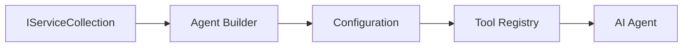

<!--
CO_OP_TRANSLATOR_METADATA:
{
  "original_hash": "bcc874e190347bd6a095aed56dc16de8",
  "translation_date": "2025-11-13T13:36:31+00:00",
  "source_file": "03-agentic-design-patterns/code_samples/03-dotnet-agent-framework.md",
  "language_code": "sw"
}
-->
# 🎨 Miundo ya Ubunifu wa Wakala na GitHub Models (.NET)

## 📋 Malengo ya Kujifunza

Mfano huu unaonyesha miundo ya ubunifu ya kiwango cha biashara kwa ajili ya kujenga mawakala wenye akili kwa kutumia Microsoft Agent Framework katika .NET na ujumuishaji wa GitHub Models. Utajifunza miundo ya kitaalamu na mbinu za usanifu zinazofanya mawakala kuwa tayari kwa uzalishaji, rahisi kudumisha, na kupanuka.

### Miundo ya Ubunifu ya Biashara

- 🏭 **Factory Pattern**: Uundaji wa wakala uliosanifishwa kwa kutumia dependency injection
- 🔧 **Builder Pattern**: Usanidi wa wakala kwa mtiririko wa hatua
- 🧵 **Thread-Safe Patterns**: Usimamizi wa mazungumzo ya wakati mmoja
- 📋 **Repository Pattern**: Usimamizi uliopangwa wa zana na uwezo

## 🎯 Faida za Usanifu wa .NET

### Vipengele vya Biashara

- **Strong Typing**: Uthibitishaji wa wakati wa kuandaa na msaada wa IntelliSense
- **Dependency Injection**: Ujumuishaji wa kontena la DI lililojengwa ndani
- **Configuration Management**: Mifumo ya IConfiguration na Options
- **Async/Await**: Msaada wa programu ya wakati mmoja ya daraja la kwanza

### Miundo Tayari kwa Uzalishaji

- **Logging Integration**: Msaada wa ILogger na ufuatiliaji wa muundo
- **Health Checks**: Ufuatiliaji na uchunguzi vilivyojengwa ndani
- **Configuration Validation**: Uthibitishaji wa aina kali na data annotations
- **Error Handling**: Usimamizi wa makosa uliosanifishwa

## 🔧 Usanifu wa Kiufundi

### Vipengele vya Msingi vya .NET

- **Microsoft.Extensions.AI**: Abstraksi za huduma za AI zilizounganishwa
- **Microsoft.Agents.AI**: Mfumo wa uratibu wa wakala wa biashara
- **GitHub Models Integration**: Miundo ya mteja wa API yenye utendaji wa juu
- **Configuration System**: Ujumuishaji wa appsettings.json na mazingira

### Utekelezaji wa Miundo ya Ubunifu



## 🏗️ Miundo ya Biashara Iliyodhihirishwa

### 1. **Miundo ya Uundaji**

- **Agent Factory**: Uundaji wa wakala uliosentralishwa na usanidi thabiti
- **Builder Pattern**: API ya mtiririko kwa usanidi wa wakala wa hali ngumu
- **Singleton Pattern**: Usimamizi wa rasilimali na usanidi wa pamoja
- **Dependency Injection**: Uunganishaji huru na uwezo wa kupimika

### 2. **Miundo ya Tabia**

- **Strategy Pattern**: Mikakati ya utekelezaji wa zana inayoweza kubadilishwa
- **Command Pattern**: Operesheni za wakala zilizofungashwa na undo/redo
- **Observer Pattern**: Usimamizi wa mzunguko wa maisha wa wakala unaotegemea matukio
- **Template Method**: Mtiririko wa utekelezaji wa wakala uliosanifishwa

### 3. **Miundo ya Kimuundo**

- **Adapter Pattern**: Safu ya ujumuishaji wa API ya GitHub Models
- **Decorator Pattern**: Uboreshaji wa uwezo wa wakala
- **Facade Pattern**: Mienzi rahisi ya mwingiliano wa wakala
- **Proxy Pattern**: Upakiaji wa polepole na kuhifadhi kwa utendaji

## 📚 Kanuni za Usanifu wa .NET

### Kanuni za SOLID

- **Single Responsibility**: Kila kipengele kina kusudi moja wazi
- **Open/Closed**: Kinapanuka bila mabadiliko
- **Liskov Substitution**: Utekelezaji wa zana unaotegemea interface
- **Interface Segregation**: Interface zilizolenga na zenye mshikamano
- **Dependency Inversion**: Kutegemea abstraksi, si utekelezaji wa moja kwa moja

### Usanifu Safi

- **Domain Layer**: Abstraksi za msingi za wakala na zana
- **Application Layer**: Uratibu wa wakala na mtiririko wa kazi
- **Infrastructure Layer**: Ujumuishaji wa GitHub Models na huduma za nje
- **Presentation Layer**: Mwingiliano wa mtumiaji na muundo wa majibu

## 🔒 Mazingatio ya Biashara

### Usalama

- **Credential Management**: Ushughulikiaji salama wa funguo za API kwa kutumia IConfiguration
- **Input Validation**: Uthibitishaji wa aina kali na data annotations
- **Output Sanitization**: Usindikaji salama wa majibu na uchujaji
- **Audit Logging**: Ufuatiliaji wa operesheni kwa kina

### Utendaji

- **Async Patterns**: Operesheni za I/O zisizozuia
- **Connection Pooling**: Usimamizi mzuri wa mteja wa HTTP
- **Caching**: Kuhifadhi majibu kwa utendaji bora
- **Resource Management**: Mifumo sahihi ya usafishaji na usimamizi

### Uwezo wa Kupanuka

- **Thread Safety**: Msaada wa utekelezaji wa wakala wa wakati mmoja
- **Resource Pooling**: Matumizi bora ya rasilimali
- **Load Management**: Kuweka mipaka ya kiwango na kushughulikia shinikizo
- **Monitoring**: Vipimo vya utendaji na ukaguzi wa afya

## 🚀 Utekelezaji wa Uzalishaji

- **Configuration Management**: Mipangilio maalum ya mazingira
- **Logging Strategy**: Ufuatiliaji wa muundo na vitambulisho vya uhusiano
- **Error Handling**: Ushughulikiaji wa makosa ya kimataifa na urejeshaji sahihi
- **Monitoring**: Uelewa wa programu na vipimo vya utendaji
- **Testing**: Mifumo ya majaribio ya vitengo, ujumuishaji, na mzigo

Tayari kujenga mawakala wenye akili wa kiwango cha biashara kwa kutumia .NET? Hebu tusanifu kitu thabiti! 🏢✨

## 🚀 Kuanza

### Mahitaji ya Awali

- [.NET 10 SDK](https://dotnet.microsoft.com/download/dotnet/10.0) au zaidi
- [GitHub Models API access token](https://docs.github.com/github-models/github-models-at-scale/using-your-own-api-keys-in-github-models)

### Mabadiliko Yanayohitajika ya Mazingira

```bash
# zsh/bash
export GH_TOKEN=<your_github_token>
export GH_ENDPOINT=https://models.github.ai/inference
export GH_MODEL_ID=openai/gpt-5-mini
```

```powershell
# PowerShell
$env:GH_TOKEN = "<your_github_token>"
$env:GH_ENDPOINT = "https://models.github.ai/inference"
$env:GH_MODEL_ID = "openai/gpt-5-mini"
```

### Mfano wa Msimbo

Ili kuendesha mfano wa msimbo,

```bash
# zsh/bash
chmod +x ./03-dotnet-agent-framework.cs
./03-dotnet-agent-framework.cs
```

Au kwa kutumia dotnet CLI:

```bash
dotnet run ./03-dotnet-agent-framework.cs
```

Tazama [`03-dotnet-agent-framework.cs`](../../../../03-agentic-design-patterns/code_samples/03-dotnet-agent-framework.cs) kwa msimbo kamili.

```csharp
#!/usr/bin/dotnet run

#:package Microsoft.Extensions.AI@10.*
#:package Microsoft.Agents.AI.OpenAI@1.*-*

using System.ClientModel;
using System.ComponentModel;

using Microsoft.Agents.AI;
using Microsoft.Extensions.AI;

using OpenAI;

// Tool Function: Random Destination Generator
// This static method will be available to the agent as a callable tool
// The [Description] attribute helps the AI understand when to use this function
// This demonstrates how to create custom tools for AI agents
[Description("Provides a random vacation destination.")]
static string GetRandomDestination()
{
    // List of popular vacation destinations around the world
    // The agent will randomly select from these options
    var destinations = new List<string>
    {
        "Paris, France",
        "Tokyo, Japan",
        "New York City, USA",
        "Sydney, Australia",
        "Rome, Italy",
        "Barcelona, Spain",
        "Cape Town, South Africa",
        "Rio de Janeiro, Brazil",
        "Bangkok, Thailand",
        "Vancouver, Canada"
    };

    // Generate random index and return selected destination
    // Uses System.Random for simple random selection
    var random = new Random();
    int index = random.Next(destinations.Count);
    return destinations[index];
}

// Extract configuration from environment variables
// Retrieve the GitHub Models API endpoint, defaults to https://models.github.ai/inference if not specified
// Retrieve the model ID, defaults to openai/gpt-5-mini if not specified
// Retrieve the GitHub token for authentication, throws exception if not specified
var github_endpoint = Environment.GetEnvironmentVariable("GH_ENDPOINT") ?? "https://models.github.ai/inference";
var github_model_id = Environment.GetEnvironmentVariable("GH_MODEL_ID") ?? "openai/gpt-5-mini";
var github_token = Environment.GetEnvironmentVariable("GH_TOKEN") ?? throw new InvalidOperationException("GH_TOKEN is not set.");

// Configure OpenAI Client Options
// Create configuration options to point to GitHub Models endpoint
// This redirects OpenAI client calls to GitHub's model inference service
var openAIOptions = new OpenAIClientOptions()
{
    Endpoint = new Uri(github_endpoint)
};

// Initialize OpenAI Client with GitHub Models Configuration
// Create OpenAI client using GitHub token for authentication
// Configure it to use GitHub Models endpoint instead of OpenAI directly
var openAIClient = new OpenAIClient(new ApiKeyCredential(github_token), openAIOptions);

// Define Agent Identity and Comprehensive Instructions
// Agent name for identification and logging purposes
var AGENT_NAME = "TravelAgent";

// Detailed instructions that define the agent's personality, capabilities, and behavior
// This system prompt shapes how the agent responds and interacts with users
var AGENT_INSTRUCTIONS = """
You are a helpful AI Agent that can help plan vacations for customers.

Important: When users specify a destination, always plan for that location. Only suggest random destinations when the user hasn't specified a preference.

When the conversation begins, introduce yourself with this message:
"Hello! I'm your TravelAgent assistant. I can help plan vacations and suggest interesting destinations for you. Here are some things you can ask me:
1. Plan a day trip to a specific location
2. Suggest a random vacation destination
3. Find destinations with specific features (beaches, mountains, historical sites, etc.)
4. Plan an alternative trip if you don't like my first suggestion

What kind of trip would you like me to help you plan today?"

Always prioritize user preferences. If they mention a specific destination like "Bali" or "Paris," focus your planning on that location rather than suggesting alternatives.
""";

// Create AI Agent with Advanced Travel Planning Capabilities
// Initialize complete agent pipeline: OpenAI client → Chat client → AI agent
// Configure agent with name, detailed instructions, and available tools
// This demonstrates the .NET agent creation pattern with full configuration
AIAgent agent = openAIClient
    .GetChatClient(github_model_id)
    .CreateAIAgent(
        name: AGENT_NAME,
        instructions: AGENT_INSTRUCTIONS,
        tools: [AIFunctionFactory.Create(GetRandomDestination)]
    );

// Create New Conversation Thread for Context Management
// Initialize a new conversation thread to maintain context across multiple interactions
// Threads enable the agent to remember previous exchanges and maintain conversational state
// This is essential for multi-turn conversations and contextual understanding
AgentThread thread = agent.GetNewThread();

// Execute Agent: First Travel Planning Request
// Run the agent with an initial request that will likely trigger the random destination tool
// The agent will analyze the request, use the GetRandomDestination tool, and create an itinerary
// Using the thread parameter maintains conversation context for subsequent interactions
await foreach (var update in agent.RunStreamingAsync("Plan me a day trip", thread))
{
    await Task.Delay(10);
    Console.Write(update);
}

Console.WriteLine();

// Execute Agent: Follow-up Request with Context Awareness
// Demonstrate contextual conversation by referencing the previous response
// The agent remembers the previous destination suggestion and will provide an alternative
// This showcases the power of conversation threads and contextual understanding in .NET agents
await foreach (var update in agent.RunStreamingAsync("I don't like that destination. Plan me another vacation.", thread))
{
    await Task.Delay(10);
    Console.Write(update);
}
```

---

<!-- CO-OP TRANSLATOR DISCLAIMER START -->
**Kanusho**:  
Hati hii imetafsiriwa kwa kutumia huduma ya tafsiri ya AI [Co-op Translator](https://github.com/Azure/co-op-translator). Ingawa tunajitahidi kwa usahihi, tafadhali fahamu kuwa tafsiri za kiotomatiki zinaweza kuwa na makosa au kutokuwa sahihi. Hati ya asili katika lugha yake ya awali inapaswa kuzingatiwa kama chanzo cha mamlaka. Kwa taarifa muhimu, tafsiri ya kitaalamu ya binadamu inapendekezwa. Hatutawajibika kwa kutoelewana au tafsiri zisizo sahihi zinazotokana na matumizi ya tafsiri hii.
<!-- CO-OP TRANSLATOR DISCLAIMER END -->