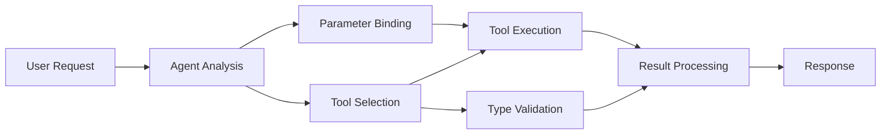

<!--
CO_OP_TRANSLATOR_METADATA:
{
  "original_hash": "91d6061e402489603f2ec8b528cae59b",
  "translation_date": "2025-11-18T18:05:44+00:00",
  "source_file": "04-tool-use/code_samples/04-dotnet-agent-framework.md",
  "language_code": "sw"
}
-->
# 🛠️ Matumizi ya Zana za Juu na Miundo ya GitHub (.NET)

## 📋 Malengo ya Kujifunza

Notebook hii inaonyesha mifumo ya ujumuishaji wa zana za kiwango cha biashara kwa kutumia Microsoft Agent Framework katika .NET na Miundo ya GitHub. Utajifunza jinsi ya kujenga mawakala wa hali ya juu wenye zana nyingi maalum, ukitumia nguvu ya C# na vipengele vya biashara vya .NET.

### Uwezo wa Zana za Juu Utakaomasteri

- 🔧 **Usanifu wa Zana Nyingi**: Kujenga mawakala wenye uwezo maalum mbalimbali
- 🎯 **Utekelezaji wa Zana Salama kwa Aina**: Kutumia uthibitishaji wa wakati wa kuandaa wa C#
- 📊 **Mifumo ya Zana za Biashara**: Ubunifu wa zana tayari kwa uzalishaji na usimamizi wa makosa
- 🔗 **Muundo wa Zana**: Kuchanganya zana kwa mtiririko wa kazi wa biashara wenye changamoto

## 🎯 Faida za Usanifu wa Zana za .NET

### Vipengele vya Zana za Biashara

- **Uthibitishaji wa Wakati wa Kuandaa**: Uandishi wenye nguvu unahakikisha usahihi wa vigezo vya zana
- **Uingizaji wa Utegemezi**: Ujumuishaji wa kontena la IoC kwa usimamizi wa zana
- **Mifumo ya Async/Await**: Utekelezaji wa zana bila kuzuia na usimamizi sahihi wa rasilimali
- **Ufuatiliaji wa Kumbukumbu**: Ujumuishaji wa kumbukumbu uliojengwa ndani kwa ufuatiliaji wa utekelezaji wa zana

### Mifumo Tayari kwa Uzalishaji

- **Usimamizi wa Makosa**: Usimamizi wa makosa wa kina na makosa yaliyoainishwa
- **Usimamizi wa Rasilimali**: Mifumo sahihi ya utupaji na usimamizi wa kumbukumbu
- **Ufuatiliaji wa Utendaji**: Vipimo vilivyojengwa ndani na kaunta za utendaji
- **Usimamizi wa Usanidi**: Usanidi salama kwa aina na uthibitishaji

## 🔧 Usanifu wa Kiufundi

### Vipengele vya Msingi vya Zana za .NET

- **Microsoft.Extensions.AI**: Safu ya muhtasari wa zana iliyounganishwa
- **Microsoft.Agents.AI**: Usanifu wa zana za kiwango cha biashara
- **Ujumuishaji wa Miundo ya GitHub**: Mteja wa API wa utendaji wa juu na ujumuishaji wa hifadhi ya muunganisho

### Mtiririko wa Utekelezaji wa Zana



## 🛠️ Aina za Zana & Mifumo

### 1. **Zana za Usindikaji wa Data**

- **Uthibitishaji wa Ingizo**: Uandishi wenye nguvu na maelezo ya data
- **Operesheni za Kubadilisha**: Ubadilishaji wa data salama kwa aina na uundaji
- **Mantiki ya Biashara**: Zana za hesabu na uchambuzi maalum wa kikoa
- **Uundaji wa Matokeo**: Uzalishaji wa majibu yaliyojengwa

### 2. **Zana za Ujumuishaji**

- **Viunganishi vya API**: Ujumuishaji wa huduma za RESTful na HttpClient
- **Zana za Hifadhidata**: Ujumuishaji wa Entity Framework kwa ufikiaji wa data
- **Operesheni za Faili**: Operesheni salama za mfumo wa faili na uthibitishaji
- **Huduma za Nje**: Mifumo ya ujumuishaji wa huduma za wahusika wa tatu

### 3. **Zana za Kusaidia**

- **Usindikaji wa Maandishi**: Huduma za uundaji na urekebishaji wa maandishi
- **Operesheni za Tarehe/Muda**: Hesabu za tarehe/muda zinazojali utamaduni
- **Zana za Hisabati**: Hesabu za usahihi na operesheni za takwimu
- **Zana za Uthibitishaji**: Uthibitishaji wa sheria za biashara na uhakiki wa data

Uko tayari kujenga mawakala wa kiwango cha biashara wenye uwezo wa zana salama kwa aina katika .NET? Hebu tuunde suluhisho za kiwango cha kitaalamu! 🏢⚡

## 🚀 Kuanza

### Mahitaji ya Awali

- [.NET 10 SDK](https://dotnet.microsoft.com/download/dotnet/10.0) au zaidi
- [Tokeni ya ufikiaji wa API ya Miundo ya GitHub](https://docs.github.com/github-models/github-models-at-scale/using-your-own-api-keys-in-github-models)

### Vigezo vya Mazingira Vinavyohitajika

```bash
# zsh/bash
export GH_TOKEN=<your_github_token>
export GH_ENDPOINT=https://models.github.ai/inference
export GH_MODEL_ID=openai/gpt-5-mini
```

```powershell
# PowerShell
$env:GH_TOKEN = "<your_github_token>"
$env:GH_ENDPOINT = "https://models.github.ai/inference"
$env:GH_MODEL_ID = "openai/gpt-5-mini"
```

### Mfano wa Msimbo

Ili kuendesha mfano wa msimbo,

```bash
# zsh/bash
chmod +x ./04-dotnet-agent-framework.cs
./04-dotnet-agent-framework.cs
```

Au kwa kutumia dotnet CLI:

```bash
dotnet run ./04-dotnet-agent-framework.cs
```

Tazama [`04-dotnet-agent-framework.cs`](../../../../04-tool-use/code_samples/04-dotnet-agent-framework.cs) kwa msimbo kamili.

```csharp
#!/usr/bin/dotnet run

#:package Microsoft.Extensions.AI@10.*
#:package Microsoft.Agents.AI.OpenAI@1.*-*

using System.ClientModel;
using System.ComponentModel;

using Microsoft.Agents.AI;
using Microsoft.Extensions.AI;

using OpenAI;

// Tool Function: Random Destination Generator
// This static method will be available to the agent as a callable tool
// The [Description] attribute helps the AI understand when to use this function
// This demonstrates how to create custom tools for AI agents
[Description("Provides a random vacation destination.")]
static string GetRandomDestination()
{
    // List of popular vacation destinations around the world
    // The agent will randomly select from these options
    var destinations = new List<string>
    {
        "Paris, France",
        "Tokyo, Japan",
        "New York City, USA",
        "Sydney, Australia",
        "Rome, Italy",
        "Barcelona, Spain",
        "Cape Town, South Africa",
        "Rio de Janeiro, Brazil",
        "Bangkok, Thailand",
        "Vancouver, Canada"
    };

    // Generate random index and return selected destination
    // Uses System.Random for simple random selection
    var random = new Random();
    int index = random.Next(destinations.Count);
    return destinations[index];
}

// Extract configuration from environment variables
// Retrieve the GitHub Models API endpoint, defaults to https://models.github.ai/inference if not specified
// Retrieve the model ID, defaults to openai/gpt-5-mini if not specified
// Retrieve the GitHub token for authentication, throws exception if not specified
var github_endpoint = Environment.GetEnvironmentVariable("GH_ENDPOINT") ?? "https://models.github.ai/inference";
var github_model_id = Environment.GetEnvironmentVariable("GH_MODEL_ID") ?? "openai/gpt-5-mini";
var github_token = Environment.GetEnvironmentVariable("GH_TOKEN") ?? throw new InvalidOperationException("GH_TOKEN is not set.");

// Configure OpenAI Client Options
// Create configuration options to point to GitHub Models endpoint
// This redirects OpenAI client calls to GitHub's model inference service
var openAIOptions = new OpenAIClientOptions()
{
    Endpoint = new Uri(github_endpoint)
};

// Initialize OpenAI Client with GitHub Models Configuration
// Create OpenAI client using GitHub token for authentication
// Configure it to use GitHub Models endpoint instead of OpenAI directly
var openAIClient = new OpenAIClient(new ApiKeyCredential(github_token), openAIOptions);

// Define Agent Identity and Comprehensive Instructions
// Agent name for identification and logging purposes
var AGENT_NAME = "TravelAgent";

// Detailed instructions that define the agent's personality, capabilities, and behavior
// This system prompt shapes how the agent responds and interacts with users
var AGENT_INSTRUCTIONS = """
You are a helpful AI Agent that can help plan vacations for customers.

Important: When users specify a destination, always plan for that location. Only suggest random destinations when the user hasn't specified a preference.

When the conversation begins, introduce yourself with this message:
"Hello! I'm your TravelAgent assistant. I can help plan vacations and suggest interesting destinations for you. Here are some things you can ask me:
1. Plan a day trip to a specific location
2. Suggest a random vacation destination
3. Find destinations with specific features (beaches, mountains, historical sites, etc.)
4. Plan an alternative trip if you don't like my first suggestion

What kind of trip would you like me to help you plan today?"

Always prioritize user preferences. If they mention a specific destination like "Bali" or "Paris," focus your planning on that location rather than suggesting alternatives.
""";

// Create AI Agent with Advanced Travel Planning Capabilities
// Initialize complete agent pipeline: OpenAI client → Chat client → AI agent
// Configure agent with name, detailed instructions, and available tools
// This demonstrates the .NET agent creation pattern with full configuration
AIAgent agent = openAIClient
    .GetChatClient(github_model_id)
    .CreateAIAgent(
        name: AGENT_NAME,
        instructions: AGENT_INSTRUCTIONS,
        tools: [AIFunctionFactory.Create(GetRandomDestination)]
    );

// Create New Conversation Thread for Context Management
// Initialize a new conversation thread to maintain context across multiple interactions
// Threads enable the agent to remember previous exchanges and maintain conversational state
// This is essential for multi-turn conversations and contextual understanding
AgentThread thread = agent.GetNewThread();

// Execute Agent: First Travel Planning Request
// Run the agent with an initial request that will likely trigger the random destination tool
// The agent will analyze the request, use the GetRandomDestination tool, and create an itinerary
// Using the thread parameter maintains conversation context for subsequent interactions
await foreach (var update in agent.RunStreamingAsync("Plan me a day trip", thread))
{
    await Task.Delay(10);
    Console.Write(update);
}

Console.WriteLine();

// Execute Agent: Follow-up Request with Context Awareness
// Demonstrate contextual conversation by referencing the previous response
// The agent remembers the previous destination suggestion and will provide an alternative
// This showcases the power of conversation threads and contextual understanding in .NET agents
await foreach (var update in agent.RunStreamingAsync("I don't like that destination. Plan me another vacation.", thread))
{
    await Task.Delay(10);
    Console.Write(update);
}
```

---

<!-- CO-OP TRANSLATOR DISCLAIMER START -->
**Kanusho**:  
Hati hii imetafsiriwa kwa kutumia huduma ya tafsiri ya AI [Co-op Translator](https://github.com/Azure/co-op-translator). Ingawa tunajitahidi kwa usahihi, tafadhali fahamu kuwa tafsiri za kiotomatiki zinaweza kuwa na makosa au kutokuwa sahihi. Hati ya asili katika lugha yake ya awali inapaswa kuzingatiwa kama chanzo cha mamlaka. Kwa taarifa muhimu, tafsiri ya kitaalamu ya binadamu inapendekezwa. Hatutawajibika kwa kutoelewana au tafsiri zisizo sahihi zinazotokana na matumizi ya tafsiri hii.
<!-- CO-OP TRANSLATOR DISCLAIMER END -->