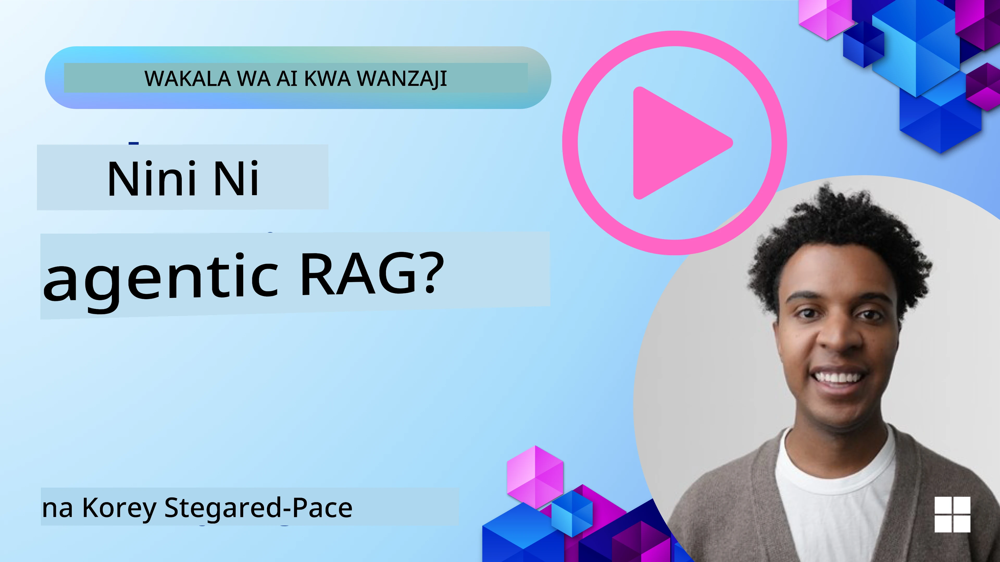
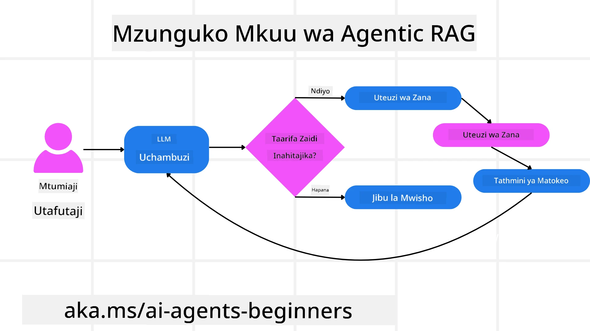
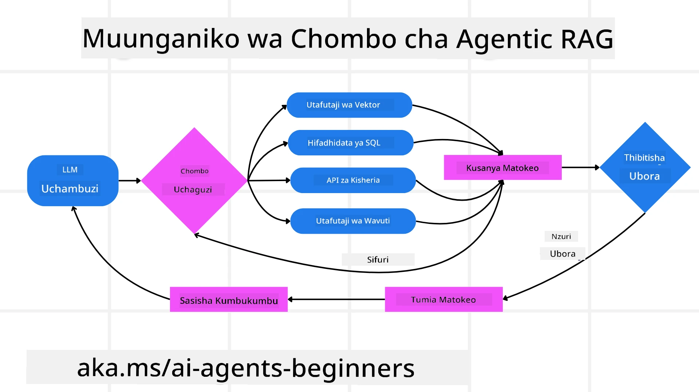
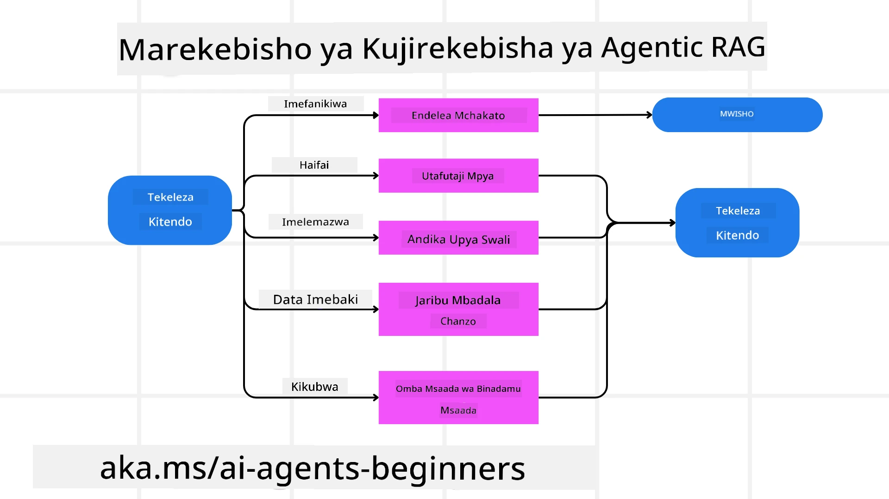
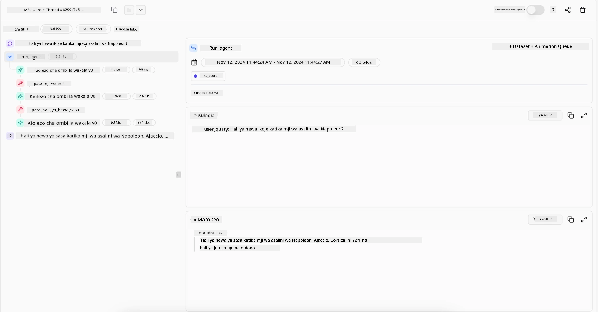

<!--
CO_OP_TRANSLATOR_METADATA:
{
  "original_hash": "0ebf6b2290db55dbf2d10cc49655523b",
  "translation_date": "2025-09-30T07:35:49+00:00",
  "source_file": "05-agentic-rag/README.md",
  "language_code": "sw"
}
-->

> _(Bonyeza picha hapo juu kutazama video ya somo hili)_

# Agentic RAG

Somo hili linatoa muhtasari wa kina kuhusu Agentic Retrieval-Augmented Generation (Agentic RAG), dhana mpya ya AI ambapo mifano mikubwa ya lugha (LLMs) hupanga hatua zao kwa uhuru huku ikichukua taarifa kutoka vyanzo vya nje. Tofauti na mifumo ya kawaida ya "retrieval-then-read", Agentic RAG inahusisha miito ya mara kwa mara kwa LLM, ikichanganywa na matumizi ya zana au kazi na matokeo yaliyojengwa. Mfumo huu hupima matokeo, hurekebisha maswali, hutumia zana za ziada inapohitajika, na kuendelea na mzunguko huu hadi suluhisho la kuridhisha lipatikane.

## Utangulizi

Somo hili litashughulikia:

- **Kuelewa Agentic RAG:** Jifunze kuhusu dhana mpya ya AI ambapo mifano mikubwa ya lugha (LLMs) hupanga hatua zao kwa uhuru huku ikichukua taarifa kutoka vyanzo vya data vya nje.
- **Kuelewa Mtindo wa Iterative Maker-Checker:** Fahamu mzunguko wa miito ya mara kwa mara kwa LLM, ikichanganywa na matumizi ya zana au kazi na matokeo yaliyojengwa, iliyoundwa kuboresha usahihi na kushughulikia maswali yaliyokosewa.
- **Kuchunguza Matumizi ya Kivitendo:** Tambua hali ambapo Agentic RAG inang'aa, kama mazingira yanayozingatia usahihi, mwingiliano tata wa hifadhidata, na mtiririko wa kazi wa muda mrefu.

## Malengo ya Kujifunza

Baada ya kukamilisha somo hili, utaweza kuelewa/kufanya:

- **Kuelewa Agentic RAG:** Jifunze kuhusu dhana mpya ya AI ambapo mifano mikubwa ya lugha (LLMs) hupanga hatua zao kwa uhuru huku ikichukua taarifa kutoka vyanzo vya data vya nje.
- **Mtindo wa Iterative Maker-Checker:** Fahamu dhana ya mzunguko wa miito ya mara kwa mara kwa LLM, ikichanganywa na matumizi ya zana au kazi na matokeo yaliyojengwa, iliyoundwa kuboresha usahihi na kushughulikia maswali yaliyokosewa.
- **Kumiliki Mchakato wa Uamuzi:** Elewa uwezo wa mfumo wa kumiliki mchakato wake wa uamuzi, kufanya maamuzi kuhusu jinsi ya kushughulikia matatizo bila kutegemea njia zilizowekwa awali.
- **Mtiririko wa Kazi:** Elewa jinsi mfano wa agentic unavyoamua kwa uhuru kuchukua ripoti za mwenendo wa soko, kutambua data ya washindani, kuhusisha vipimo vya mauzo ya ndani, kuunganisha matokeo, na kutathmini mkakati.
- **Mizunguko ya Iterative, Ujumuishaji wa Zana, na Kumbukumbu:** Jifunze kuhusu utegemezi wa mfumo kwenye muundo wa mwingiliano wa mzunguko, ukihifadhi hali na kumbukumbu katika hatua ili kuepuka mizunguko ya kurudia na kufanya maamuzi sahihi.
- **Kushughulikia Njia za Kushindwa na Kujirekebisha:** Chunguza mifumo thabiti ya kujirekebisha ya mfumo, ikiwa ni pamoja na kurudia na kuuliza tena, kutumia zana za uchunguzi, na kutegemea usimamizi wa binadamu inapohitajika.
- **Mipaka ya Uamuzi:** Elewa mapungufu ya Agentic RAG, ukizingatia uhuru maalum wa kikoa, utegemezi wa miundombinu, na kuheshimu vizuizi.
- **Matumizi ya Kivitendo na Thamani:** Tambua hali ambapo Agentic RAG inang'aa, kama mazingira yanayozingatia usahihi, mwingiliano tata wa hifadhidata, na mtiririko wa kazi wa muda mrefu.
- **Usimamizi, Uwazi, na Uaminifu:** Jifunze kuhusu umuhimu wa usimamizi na uwazi, ikiwa ni pamoja na uamuzi unaoelezeka, udhibiti wa upendeleo, na usimamizi wa binadamu.

## Agentic RAG ni Nini?

Agentic Retrieval-Augmented Generation (Agentic RAG) ni dhana mpya ya AI ambapo mifano mikubwa ya lugha (LLMs) hupanga hatua zao kwa uhuru huku ikichukua taarifa kutoka vyanzo vya nje. Tofauti na mifumo ya kawaida ya "retrieval-then-read", Agentic RAG inahusisha miito ya mara kwa mara kwa LLM, ikichanganywa na matumizi ya zana au kazi na matokeo yaliyojengwa. Mfumo huu hupima matokeo, hurekebisha maswali, hutumia zana za ziada inapohitajika, na kuendelea na mzunguko huu hadi suluhisho la kuridhisha lipatikane. Mtindo huu wa "maker-checker" wa kurudia unaboresha usahihi, hushughulikia maswali yaliyokosewa, na kuhakikisha matokeo ya hali ya juu.

Mfumo huu unamiliki mchakato wake wa uamuzi kwa bidii, huandika upya maswali yaliyoshindwa, huchagua mbinu tofauti za kuchukua taarifa, na hujumuisha zana mbalimbali—kama utafutaji wa vector katika Azure AI Search, hifadhidata za SQL, au API maalum—kabla ya kukamilisha jibu lake. Sifa ya kipekee ya mfumo wa agentic ni uwezo wake wa kumiliki mchakato wake wa uamuzi. Utekelezaji wa RAG wa jadi hutegemea njia zilizowekwa awali, lakini mfumo wa agentic huamua kwa uhuru mlolongo wa hatua kulingana na ubora wa taarifa inayopatikana.

## Kufafanua Agentic Retrieval-Augmented Generation (Agentic RAG)

Agentic Retrieval-Augmented Generation (Agentic RAG) ni dhana mpya katika maendeleo ya AI ambapo LLMs si tu huchukua taarifa kutoka vyanzo vya data vya nje bali pia hupanga hatua zao kwa uhuru. Tofauti na mifumo ya kawaida ya "retrieval-then-read" au mlolongo wa maelekezo yaliyopangwa kwa uangalifu, Agentic RAG inahusisha mzunguko wa miito ya mara kwa mara kwa LLM, ikichanganywa na matumizi ya zana au kazi na matokeo yaliyojengwa. Kila hatua, mfumo hupima matokeo yaliyopatikana, huamua kama kurekebisha maswali, hutumia zana za ziada inapohitajika, na kuendelea na mzunguko huu hadi suluhisho la kuridhisha lipatikane.

Mtindo huu wa "maker-checker" wa kurudia umeundwa kuboresha usahihi, kushughulikia maswali yaliyokosewa kwa hifadhidata zilizojengwa (mfano NL2SQL), na kuhakikisha matokeo ya hali ya juu na yenye usawa. Badala ya kutegemea tu mlolongo wa maelekezo yaliyoundwa kwa uangalifu, mfumo unamiliki mchakato wake wa uamuzi kwa bidii. Unaweza kuandika upya maswali yaliyoshindwa, kuchagua mbinu tofauti za kuchukua taarifa, na kujumuisha zana mbalimbali—kama utafutaji wa vector katika Azure AI Search, hifadhidata za SQL, au API maalum—kabla ya kukamilisha jibu lake. Hii huondoa hitaji la mifumo tata ya uratibu. Badala yake, mzunguko rahisi wa "miito ya LLM → matumizi ya zana → miito ya LLM → …" unaweza kutoa matokeo ya hali ya juu na yenye msingi mzuri.

## Kumiliki Mchakato wa Uamuzi

Sifa ya kipekee inayofanya mfumo kuwa "agentic" ni uwezo wake wa kumiliki mchakato wake wa uamuzi. Utekelezaji wa RAG wa jadi mara nyingi hutegemea binadamu kuweka njia kwa mfano: mlolongo wa mawazo unaoeleza nini cha kuchukua na lini. Lakini mfumo unapokuwa kweli agentic, huamua ndani jinsi ya kushughulikia tatizo. Hauendeshi tu script; unajiamulia mlolongo wa hatua kulingana na ubora wa taarifa inayopatikana.

Kwa mfano, ikiwa umeulizwa kuunda mkakati wa uzinduzi wa bidhaa, hautegemei tu maelekezo yanayoeleza mtiririko mzima wa utafiti na uamuzi. Badala yake, mfano wa agentic huamua kwa uhuru:

1. Kuchukua ripoti za mwenendo wa soko za sasa kwa kutumia Bing Web Grounding.
2. Kutambua data muhimu ya washindani kwa kutumia Azure AI Search.
3. Kuhusisha vipimo vya mauzo ya ndani vya kihistoria kwa kutumia Azure SQL Database.
4. Kuunganisha matokeo katika mkakati wa pamoja unaoratibiwa kupitia Azure OpenAI Service.
5. Kutathmini mkakati kwa mapungufu au kutokuwepo kwa usawa, na kuanzisha mzunguko mwingine wa kuchukua taarifa inapohitajika.

Hatua hizi zote—kurekebisha maswali, kuchagua vyanzo, kurudia hadi "kuridhika" na jibu—zinaamuliwa na mfano, si kuandikwa awali na binadamu.

## Mizunguko ya Iterative, Ujumuishaji wa Zana, na Kumbukumbu

Mfumo wa agentic hutegemea muundo wa mwingiliano wa mzunguko:

- **Mwito wa Awali:** Lengo la mtumiaji (yaani, maelekezo ya mtumiaji) huwasilishwa kwa LLM.
- **Matumizi ya Zana:** Ikiwa mfano unagundua taarifa inayokosekana au maelekezo yasiyoeleweka, huchagua zana au mbinu ya kuchukua taarifa—kama utafutaji wa hifadhidata ya vector (mfano Azure AI Search Hybrid search juu ya data ya kibinafsi) au mwito wa SQL ulioundwa—kukusanya muktadha zaidi.
- **Tathmini na Marekebisho:** Baada ya kupitia data iliyorejeshwa, mfano huamua kama taarifa inatosha. Ikiwa hapana, hurekebisha swali, hujaribu zana tofauti, au hubadilisha mbinu yake.
- **Rudia Hadi Kuridhika:** Mzunguko huu huendelea hadi mfano uamue kuwa una uwazi wa kutosha na ushahidi wa kutoa jibu la mwisho, lenye msingi mzuri.
- **Kumbukumbu na Hali:** Kwa sababu mfumo unahifadhi hali na kumbukumbu katika hatua, unaweza kukumbuka majaribio ya awali na matokeo yake, kuepuka mizunguko ya kurudia na kufanya maamuzi sahihi zaidi kadri unavyoendelea.

Kwa muda, hii huunda hisia ya uelewa unaoendelea, ikiruhusu mfano kuendesha kazi ngumu, za hatua nyingi bila hitaji la binadamu kuingilia mara kwa mara au kubadilisha maelekezo.

## Kushughulikia Njia za Kushindwa na Kujirekebisha

Uhuru wa Agentic RAG pia unahusisha mifumo thabiti ya kujirekebisha. Wakati mfumo unakutana na vikwazo—kama kuchukua nyaraka zisizohusiana au kukutana na maswali yaliyokosewa—unaweza:

- **Kurudia na Kuuliza Tena:** Badala ya kutoa majibu ya thamani ya chini, mfano hujaribu mbinu mpya za utafutaji, huandika upya maswali ya hifadhidata, au huangalia seti za data mbadala.
- **Kutumia Zana za Uchunguzi:** Mfumo unaweza kutumia kazi za ziada zilizoundwa kusaidia kuangalia hatua za uamuzi au kuthibitisha usahihi wa data iliyochukuliwa. Zana kama Azure AI Tracing zitakuwa muhimu kuwezesha ufuatiliaji thabiti.
- **Kutegemea Usimamizi wa Binadamu:** Kwa hali za hatari kubwa au zinazoshindwa mara kwa mara, mfano unaweza kuonyesha kutokuwa na uhakika na kuomba mwongozo wa binadamu. Mara binadamu anapotoa maoni ya kurekebisha, mfano unaweza kujumuisha somo hilo kwa siku zijazo.

Mbinu hii ya kurudia na yenye nguvu inaruhusu mfano kuboresha kila mara, kuhakikisha kuwa si mfumo wa "jaribio moja" bali ni mfumo unaojifunza kutokana na makosa yake wakati wa kikao fulani.

## Mipaka ya Uamuzi

Licha ya uhuru wake ndani ya kazi, Agentic RAG si sawa na Akili ya Kijumla ya Kifaa (AGI). Uwezo wake wa "agentic" unafungika kwa zana, vyanzo vya data, na sera zinazotolewa na watengenezaji wa binadamu. Haiwezi kuunda zana zake au kuvuka mipaka ya kikoa iliyowekwa. Badala yake, inang'aa katika kuratibu kwa nguvu rasilimali zilizopo.

Tofauti kuu na aina za AI zilizoendelea zaidi ni:

1. **Uhuru Maalum wa Kikoa:** Mifumo ya Agentic RAG inalenga kufanikisha malengo yaliyofafanuliwa na mtumiaji ndani ya kikoa kinachojulikana, ikitumia mikakati kama kuandika upya maswali au kuchagua zana kuboresha matokeo.
2. **Utegemezi wa Miundombinu:** Uwezo wa mfumo unategemea zana na data zilizojumuishwa na watengenezaji. Haiwezi kuzidi mipaka hii bila kuingilia binadamu.
3. **Kuheshimu Vizuizi:** Miongozo ya kimaadili, sheria za kufuata, na sera za biashara zinabaki kuwa muhimu sana. Uhuru wa mfumo daima unafungika na hatua za usalama na mifumo ya usimamizi (labda?).

## Matumizi ya Kivitendo na Thamani

Agentic RAG inang'aa katika hali zinazohitaji marekebisho ya mara kwa mara na usahihi:

1. **Mazingira Yanayozingatia Usahihi:** Katika ukaguzi wa kufuata, uchambuzi wa kanuni, au utafiti wa kisheria, mfano wa agentic unaweza kuthibitisha ukweli mara kwa mara, kushauriana na vyanzo vingi, na kuandika upya maswali hadi kutoa jibu lililothibitishwa kikamilifu.
2. **Mwingiliano Tata wa Hifadhidata:** Wakati wa kushughulika na data iliyojengwa ambapo maswali yanaweza mara nyingi kushindwa au kuhitaji marekebisho, mfumo unaweza kurekebisha maswali yake kwa uhuru kwa kutumia Azure SQL au Microsoft Fabric OneLake, kuhakikisha uchukuaji wa mwisho unalingana na nia ya mtumiaji.
3. **Mtiririko wa Kazi wa Muda Mrefu:** Vikao vya muda mrefu vinaweza kubadilika kadri taarifa mpya zinavyopatikana. Agentic RAG inaweza kuendelea kujumuisha data mpya, kubadilisha mikakati kadri inavyojifunza zaidi kuhusu eneo la tatizo.

## Usimamizi, Uwazi, na Uaminifu

Kadri mifumo hii inavyokuwa huru zaidi katika uamuzi wake, usimamizi na uwazi ni muhimu:

- **Uamuzi Unaoweza Kuelezeka:** Mfano unaweza kutoa rekodi ya maswali iliyofanya, vyanzo ilivyoshauriana, na hatua za uamuzi zilizochukua kufikia hitimisho lake. Zana kama Azure AI Content Safety na Azure AI Tracing / GenAIOps zinaweza kusaidia kudumisha uwazi na kupunguza hatari.
- **Udhibiti wa Upendeleo na Uchukuaji wa Usawa:** Watengenezaji wanaweza kurekebisha mikakati ya uchukuaji kuhakikisha vyanzo vya data vilivyowakilishwa kwa usawa vinazingatiwa, na kukagua matokeo mara kwa mara ili kugundua upendeleo au mifumo iliyopotoshwa kwa kutumia mifano maalum kwa mashirika ya hali ya juu ya sayansi ya data yanayotumia Azure Machine Learning.
- **Usimamizi wa Binadamu na Ufuataji:** Kwa kazi nyeti, ukaguzi wa binadamu unabaki kuwa muhimu. Agentic RAG haibadilishi uamuzi wa binadamu katika maamuzi ya hatari kubwa—inaongeza kwa kutoa chaguo zilizothibitishwa kikamilifu.

Kuwa na zana zinazotoa rekodi wazi ya hatua ni muhimu. Bila zana hizo, kurekebisha mchakato wa hatua nyingi inaweza kuwa ngumu sana. Tazama mfano ufuatao kutoka Literal AI (kampuni nyuma ya Chainlit) kwa mwendo wa Agent:

## Hitimisho

Agentic RAG inawakilisha mageuzi ya asili katika jinsi mifumo ya AI inavyoshughulikia kazi ngumu, zinazohitaji data nyingi. Kwa kupitisha muundo wa mwingiliano wa mzunguko, kuchagua zana kwa uhuru, na kurekebisha maswali hadi kufikia matokeo ya hali ya juu, mfumo unazidi kufuata maelekezo ya kawaida na kuwa mtoaji wa maamuzi unaojua muktadha. Ingawa bado unafungika na miundombinu iliyofafanuliwa na binadamu na miongozo ya kimaadili, uwezo huu wa agentic unaruhusu mwingiliano tajiri zaidi, wa nguvu zaidi, na hatimaye wa manufaa zaidi wa AI kwa mashirika na watumiaji wa mwisho.

### Una Maswali Zaidi Kuhusu Agentic RAG?

Jiunge na [Azure AI Foundry Discord](https://aka.ms/ai-agents/discord) ili kukutana na wanafunzi wengine, kuhudhuria masaa ya ofisi, na kupata majibu ya maswali yako kuhusu AI Agents.

## Rasilimali za Ziada

- <a href="https://learn.microsoft.com/training/modules/use-own-data-azure-openai" target="_blank">Tekeleza Retrieval Augmented Generation (RAG) na Azure OpenAI Service: Jifunze jinsi ya kutumia data yako mwenyewe na Azure OpenAI Service. Mod
- <a href="https://ragaboutit.com/agentic-rag-a-complete-guide-to-agent-based-retrieval-augmented-generation/" target="_blank">Agentic RAG: Mwongozo Kamili wa Utoaji wa Taarifa Ulioimarishwa kwa Kutumia Mawakala – Habari kutoka kwa kizazi cha RAG</a>
- <a href="https://huggingface.co/learn/cookbook/agent_rag" target="_blank">Agentic RAG: ongeza kasi ya RAG yako kwa uundaji upya wa maswali na kujijibu! Hugging Face Open-Source AI Cookbook</a>
- <a href="https://youtu.be/aQ4yQXeB1Ss?si=2HUqBzHoeB5tR04U" target="_blank">Kuongeza Tabaka za Mawakala kwa RAG</a>
- <a href="https://www.youtube.com/watch?v=zeAyuLc_f3Q&t=244s" target="_blank">Mustakabali wa Wasaidizi wa Maarifa: Jerry Liu</a>
- <a href="https://www.youtube.com/watch?v=AOSjiXP1jmQ" target="_blank">Jinsi ya Kujenga Mifumo ya Agentic RAG</a>
- <a href="https://ignite.microsoft.com/sessions/BRK102?source=sessions" target="_blank">Kutumia Huduma ya Mawakala ya Azure AI Foundry kuongeza kiwango cha mawakala wako wa AI</a>

### Karatasi za Kitaaluma

- <a href="https://arxiv.org/abs/2303.17651" target="_blank">2303.17651 Self-Refine: Uboreshaji wa Mara kwa Mara kwa Kujipatia Maoni</a>
- <a href="https://arxiv.org/abs/2303.11366" target="_blank">2303.11366 Reflexion: Mawakala wa Lugha na Kujifunza kwa Kuimarisha kwa Maneno</a>
- <a href="https://arxiv.org/abs/2305.11738" target="_blank">2305.11738 CRITIC: Miundo Mikubwa ya Lugha Inaweza Kujikosoa kwa Kutumia Zana za Ukosoaji</a>
- <a href="https://arxiv.org/abs/2501.09136" target="_blank">2501.09136 Agentic Retrieval-Augmented Generation: Utafiti kuhusu Agentic RAG</a>

## Somo Lililopita

[Muundo wa Matumizi ya Zana](../04-tool-use/README.md)

## Somo Lijalo

[Kujenga Mawakala wa AI Wenye Kuaminika](../06-building-trustworthy-agents/README.md)

---

**Kanusho**:  
Hati hii imetafsiriwa kwa kutumia huduma ya tafsiri ya AI [Co-op Translator](https://github.com/Azure/co-op-translator). Ingawa tunajitahidi kwa usahihi, tafadhali fahamu kuwa tafsiri za kiotomatiki zinaweza kuwa na makosa au kutokuwa sahihi. Hati ya asili katika lugha yake ya awali inapaswa kuzingatiwa kama chanzo cha mamlaka. Kwa taarifa muhimu, tafsiri ya kitaalamu ya binadamu inapendekezwa. Hatutawajibika kwa kutoelewana au tafsiri zisizo sahihi zinazotokana na matumizi ya tafsiri hii.