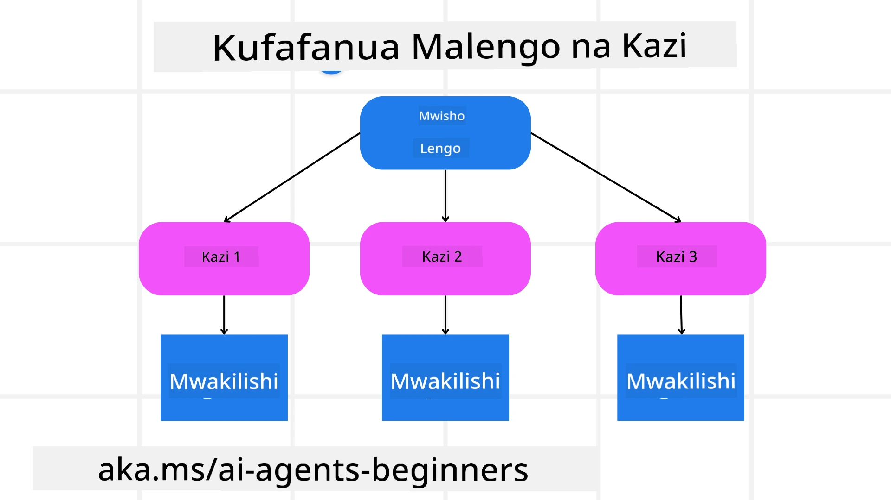

<!--
CO_OP_TRANSLATOR_METADATA:
{
  "original_hash": "43069833a0412210ad5c3cc93d9c2146",
  "translation_date": "2025-09-18T15:25:41+00:00",
  "source_file": "07-planning-design/README.md",
  "language_code": "sw"
}
-->
[](https://youtu.be/kPfJ2BrBCMY?si=9pYpPXp0sSbK91Dr)

> _(Bofya picha hapo juu kutazama video ya somo hili)_

# Mpangilio wa Mipango

## Utangulizi

Somo hili litashughulikia:

* Kufafanua lengo kuu na kugawanya kazi ngumu kuwa kazi ndogo zinazoweza kudhibitiwa.
* Kutumia matokeo yaliyojengwa kwa muundo ili kupata majibu yanayoaminika na yanayoweza kusomeka na mashine.
* Kutumia mbinu inayotegemea matukio kushughulikia kazi za mabadiliko na pembejeo zisizotarajiwa.

## Malengo ya Kujifunza

Baada ya kukamilisha somo hili, utakuwa na uelewa kuhusu:

* Kutambua na kuweka lengo kuu kwa wakala wa AI, kuhakikisha anajua wazi kinachohitajika kufanikishwa.
* Kugawanya kazi ngumu kuwa kazi ndogo zinazoweza kudhibitiwa na kuzipanga kwa mpangilio wa kimantiki.
* Kuwawezesha mawakala na zana sahihi (mfano, zana za utafutaji au uchambuzi wa data), kuamua ni lini na jinsi ya kuzitumia, na kushughulikia hali zisizotarajiwa zinazojitokeza.
* Kutathmini matokeo ya kazi ndogo, kupima utendaji, na kurudia hatua ili kuboresha matokeo ya mwisho.

## Kufafanua Lengo Kuu na Kugawanya Kazi



Kazi nyingi za ulimwengu halisi ni ngumu sana kushughulikiwa kwa hatua moja. Wakala wa AI anahitaji lengo fupi ili kuongoza mipango na hatua zake. Kwa mfano, fikiria lengo:

    "Tengeneza ratiba ya safari ya siku 3."

Ingawa ni rahisi kusema, bado inahitaji kufafanuliwa zaidi. Kadri lengo linavyokuwa wazi, ndivyo wakala (na washirika wa binadamu) wanavyoweza kuzingatia kufanikisha matokeo sahihi, kama vile kuunda ratiba kamili yenye chaguo za ndege, mapendekezo ya hoteli, na mapendekezo ya shughuli.

### Kugawanya Kazi

Kazi kubwa au ngumu zinakuwa rahisi kudhibitiwa zinapogawanywa kuwa kazi ndogo zinazolenga malengo maalum. Kwa mfano wa ratiba ya safari, unaweza kugawanya lengo kuwa:

* Kuhifadhi Ndege
* Kuhifadhi Hoteli
* Kukodisha Gari
* Kubinafsisha

Kila kazi ndogo inaweza kushughulikiwa na mawakala au michakato maalum. Wakala mmoja anaweza kubobea katika kutafuta ofa bora za ndege, mwingine anaweza kuzingatia uhifadhi wa hoteli, na kadhalika. Wakala wa kuratibu au “wakala wa mto” anaweza kisha kukusanya matokeo haya kuwa ratiba moja ya pamoja kwa mtumiaji wa mwisho.

Mbinu hii ya kimoduli pia inaruhusu maboresho ya hatua kwa hatua. Kwa mfano, unaweza kuongeza mawakala maalum kwa Mapendekezo ya Chakula au Mapendekezo ya Shughuli za Kijijini na kuboresha ratiba kwa muda.

### Matokeo Yaliyojengwa kwa Muundo

Mifano Mikubwa ya Lugha (LLMs) inaweza kutoa matokeo yaliyojengwa kwa muundo (mfano, JSON) ambayo ni rahisi kwa mawakala au huduma za mto kusoma na kuchakata. Hii ni muhimu hasa katika muktadha wa mawakala wengi, ambapo tunaweza kuchukua hatua kwa kazi hizi baada ya matokeo ya mipango kupokelewa. Rejelea hili kwa muhtasari wa haraka.

Snippet ya Python ifuatayo inaonyesha wakala rahisi wa mipango anayegawanya lengo kuwa kazi ndogo na kutoa mpango uliopangwa:

```python
from pydantic import BaseModel
from enum import Enum
from typing import List, Optional, Union
import json
import os
from typing import Optional
from pprint import pprint
from autogen_core.models import UserMessage, SystemMessage, AssistantMessage
from autogen_ext.models.azure import AzureAIChatCompletionClient
from azure.core.credentials import AzureKeyCredential

class AgentEnum(str, Enum):
    FlightBooking = "flight_booking"
    HotelBooking = "hotel_booking"
    CarRental = "car_rental"
    ActivitiesBooking = "activities_booking"
    DestinationInfo = "destination_info"
    DefaultAgent = "default_agent"
    GroupChatManager = "group_chat_manager"

# Travel SubTask Model
class TravelSubTask(BaseModel):
    task_details: str
    assigned_agent: AgentEnum  # we want to assign the task to the agent

class TravelPlan(BaseModel):
    main_task: str
    subtasks: List[TravelSubTask]
    is_greeting: bool

client = AzureAIChatCompletionClient(
    model="gpt-4o-mini",
    endpoint="https://models.inference.ai.azure.com",
    # To authenticate with the model you will need to generate a personal access token (PAT) in your GitHub settings.
    # Create your PAT token by following instructions here: https://docs.github.com/en/authentication/keeping-your-account-and-data-secure/managing-your-personal-access-tokens
    credential=AzureKeyCredential(os.environ["GITHUB_TOKEN"]),
    model_info={
        "json_output": False,
        "function_calling": True,
        "vision": True,
        "family": "unknown",
    },
)

# Define the user message
messages = [
    SystemMessage(content="""You are an planner agent.
    Your job is to decide which agents to run based on the user's request.
                      Provide your response in JSON format with the following structure:
{'main_task': 'Plan a family trip from Singapore to Melbourne.',
 'subtasks': [{'assigned_agent': 'flight_booking',
               'task_details': 'Book round-trip flights from Singapore to '
                               'Melbourne.'}
    Below are the available agents specialised in different tasks:
    - FlightBooking: For booking flights and providing flight information
    - HotelBooking: For booking hotels and providing hotel information
    - CarRental: For booking cars and providing car rental information
    - ActivitiesBooking: For booking activities and providing activity information
    - DestinationInfo: For providing information about destinations
    - DefaultAgent: For handling general requests""", source="system"),
    UserMessage(
        content="Create a travel plan for a family of 2 kids from Singapore to Melboune", source="user"),
]

response = await client.create(messages=messages, extra_create_args={"response_format": 'json_object'})

response_content: Optional[str] = response.content if isinstance(
    response.content, str) else None
if response_content is None:
    raise ValueError("Response content is not a valid JSON string" )

pprint(json.loads(response_content))

# # Ensure the response content is a valid JSON string before loading it
# response_content: Optional[str] = response.content if isinstance(
#     response.content, str) else None
# if response_content is None:
#     raise ValueError("Response content is not a valid JSON string")

# # Print the response content after loading it as JSON
# pprint(json.loads(response_content))

# Validate the response content with the MathReasoning model
# TravelPlan.model_validate(json.loads(response_content))
```

### Wakala wa Mipango na Uratibu wa Mawakala Wengi

Katika mfano huu, Wakala wa Router ya Semantic hupokea ombi la mtumiaji (mfano, "Nahitaji mpango wa hoteli kwa safari yangu.").

Mpangaji kisha:

* Kupokea Mpango wa Hoteli: Mpangaji huchukua ujumbe wa mtumiaji na, kulingana na maelezo ya mfumo (ikiwemo maelezo ya mawakala waliopo), hutoa mpango wa safari uliopangwa.
* Orodhesha Mawakala na Zana Zao: Usajili wa wakala unashikilia orodha ya mawakala (mfano, kwa ndege, hoteli, kukodisha gari, na shughuli) pamoja na kazi au zana wanazotoa.
* Kusambaza Mpango kwa Mawakala Husika: Kulingana na idadi ya kazi ndogo, mpangaji ama hutuma ujumbe moja kwa moja kwa wakala maalum (kwa hali za kazi moja) au kuratibu kupitia msimamizi wa mazungumzo ya kikundi kwa ushirikiano wa mawakala wengi.
* Kufupisha Matokeo: Hatimaye, mpangaji hufupisha mpango uliotolewa kwa uwazi.

Snippet ya Python ifuatayo inaonyesha hatua hizi:

```python

from pydantic import BaseModel

from enum import Enum
from typing import List, Optional, Union

class AgentEnum(str, Enum):
    FlightBooking = "flight_booking"
    HotelBooking = "hotel_booking"
    CarRental = "car_rental"
    ActivitiesBooking = "activities_booking"
    DestinationInfo = "destination_info"
    DefaultAgent = "default_agent"
    GroupChatManager = "group_chat_manager"

# Travel SubTask Model

class TravelSubTask(BaseModel):
    task_details: str
    assigned_agent: AgentEnum # we want to assign the task to the agent

class TravelPlan(BaseModel):
    main_task: str
    subtasks: List[TravelSubTask]
    is_greeting: bool
import json
import os
from typing import Optional

from autogen_core.models import UserMessage, SystemMessage, AssistantMessage
from autogen_ext.models.openai import AzureOpenAIChatCompletionClient

# Create the client with type-checked environment variables

client = AzureOpenAIChatCompletionClient(
    azure_deployment=os.getenv("AZURE_OPENAI_DEPLOYMENT_NAME"),
    model=os.getenv("AZURE_OPENAI_DEPLOYMENT_NAME"),
    api_version=os.getenv("AZURE_OPENAI_API_VERSION"),
    azure_endpoint=os.getenv("AZURE_OPENAI_ENDPOINT"),
    api_key=os.getenv("AZURE_OPENAI_API_KEY"),
)

from pprint import pprint

# Define the user message

messages = [
    SystemMessage(content="""You are an planner agent.
    Your job is to decide which agents to run based on the user's request.
    Below are the available agents specialized in different tasks:
    - FlightBooking: For booking flights and providing flight information
    - HotelBooking: For booking hotels and providing hotel information
    - CarRental: For booking cars and providing car rental information
    - ActivitiesBooking: For booking activities and providing activity information
    - DestinationInfo: For providing information about destinations
    - DefaultAgent: For handling general requests""", source="system"),
    UserMessage(content="Create a travel plan for a family of 2 kids from Singapore to Melbourne", source="user"),
]

response = await client.create(messages=messages, extra_create_args={"response_format": TravelPlan})

# Ensure the response content is a valid JSON string before loading it

response_content: Optional[str] = response.content if isinstance(response.content, str) else None
if response_content is None:
    raise ValueError("Response content is not a valid JSON string")

# Print the response content after loading it as JSON

pprint(json.loads(response_content))
```

Kinachofuata ni matokeo kutoka kwa msimbo wa awali na unaweza kutumia matokeo haya yaliyojengwa kwa muundo kupeleka kwa `assigned_agent` na kufupisha mpango wa safari kwa mtumiaji wa mwisho.

```json
{
    "is_greeting": "False",
    "main_task": "Plan a family trip from Singapore to Melbourne.",
    "subtasks": [
        {
            "assigned_agent": "flight_booking",
            "task_details": "Book round-trip flights from Singapore to Melbourne."
        },
        {
            "assigned_agent": "hotel_booking",
            "task_details": "Find family-friendly hotels in Melbourne."
        },
        {
            "assigned_agent": "car_rental",
            "task_details": "Arrange a car rental suitable for a family of four in Melbourne."
        },
        {
            "assigned_agent": "activities_booking",
            "task_details": "List family-friendly activities in Melbourne."
        },
        {
            "assigned_agent": "destination_info",
            "task_details": "Provide information about Melbourne as a travel destination."
        }
    ]
}
```

Notebook ya mfano yenye msimbo wa awali inapatikana [hapa](07-autogen.ipynb).

### Mipango ya Kurudia

Baadhi ya kazi zinahitaji mazungumzo ya kurudi nyuma au mipango upya, ambapo matokeo ya kazi moja ndogo yanaathiri inayofuata. Kwa mfano, ikiwa wakala atagundua muundo wa data usiotarajiwa wakati wa kuhifadhi ndege, huenda akahitaji kubadilisha mkakati wake kabla ya kuendelea na uhifadhi wa hoteli.

Aidha, maoni ya mtumiaji (mfano, binadamu kuamua wanapendelea ndege ya mapema) yanaweza kusababisha mipango upya ya sehemu. Mbinu hii ya mabadiliko na kurudia inahakikisha kuwa suluhisho la mwisho linakubaliana na vikwazo vya ulimwengu halisi na mapendeleo yanayobadilika ya mtumiaji.

Mfano wa msimbo:

```python
from autogen_core.models import UserMessage, SystemMessage, AssistantMessage
#.. same as previous code and pass on the user history, current plan
messages = [
    SystemMessage(content="""You are a planner agent to optimize the
    Your job is to decide which agents to run based on the user's request.
    Below are the available agents specialized in different tasks:
    - FlightBooking: For booking flights and providing flight information
    - HotelBooking: For booking hotels and providing hotel information
    - CarRental: For booking cars and providing car rental information
    - ActivitiesBooking: For booking activities and providing activity information
    - DestinationInfo: For providing information about destinations
    - DefaultAgent: For handling general requests""", source="system"),
    UserMessage(content="Create a travel plan for a family of 2 kids from Singapore to Melbourne", source="user"),
    AssistantMessage(content=f"Previous travel plan - {TravelPlan}", source="assistant")
]
# .. re-plan and send the tasks to respective agents
```

Kwa mipango ya kina zaidi angalia Magnetic One kwa kutatua kazi ngumu.

## Muhtasari

Katika makala hii tumeangalia mfano wa jinsi tunavyoweza kuunda mpangaji ambaye anaweza kuchagua mawakala waliopo kwa kazi maalum. Matokeo ya Mpangaji hugawanya kazi na kuwapa mawakala ili waweze kutekelezwa. Inadhaniwa kuwa mawakala wana ufikiaji wa kazi/zana zinazohitajika kutekeleza kazi. Mbali na mawakala unaweza kujumuisha mifumo mingine kama tafakari, muhtasari, na mazungumzo ya mzunguko ili kubinafsisha zaidi.

## Rasilimali za Ziada

AutoGen Magnetic One - Mfumo wa mawakala wengi wa jumla kwa kutatua kazi ngumu na umefikia matokeo ya kuvutia kwenye viwango vingi vya changamoto za mawakala. Rejea:

. Katika utekelezaji huu, mratibu huunda mpango maalum wa kazi na kugawa kazi hizi kwa mawakala waliopo. Mbali na mipango, mratibu pia hutumia mfumo wa ufuatiliaji kufuatilia maendeleo ya kazi na kupanga upya inapohitajika.

### Una Maswali Zaidi Kuhusu Mpangilio wa Muundo wa Mipango?

Jiunge na [Azure AI Foundry Discord](https://aka.ms/ai-agents/discord) ili kukutana na wanafunzi wengine, kuhudhuria masaa ya ofisi, na kupata majibu ya maswali yako kuhusu Mawakala wa AI.

## Somo la Awali

[Kuunda Mawakala wa AI Wanaoaminika](../06-building-trustworthy-agents/README.md)

## Somo Lijalo

[Muundo wa Mawakala Wengi](../08-multi-agent/README.md)

---

**Kanusho**:  
Hati hii imetafsiriwa kwa kutumia huduma ya tafsiri ya AI [Co-op Translator](https://github.com/Azure/co-op-translator). Ingawa tunajitahidi kuhakikisha usahihi, tafsiri za kiotomatiki zinaweza kuwa na makosa au kutokuwa sahihi. Hati ya asili katika lugha yake ya awali inapaswa kuchukuliwa kama chanzo cha mamlaka. Kwa taarifa muhimu, tafsiri ya kitaalamu ya binadamu inapendekezwa. Hatutawajibika kwa kutoelewana au tafsiri zisizo sahihi zinazotokana na matumizi ya tafsiri hii.