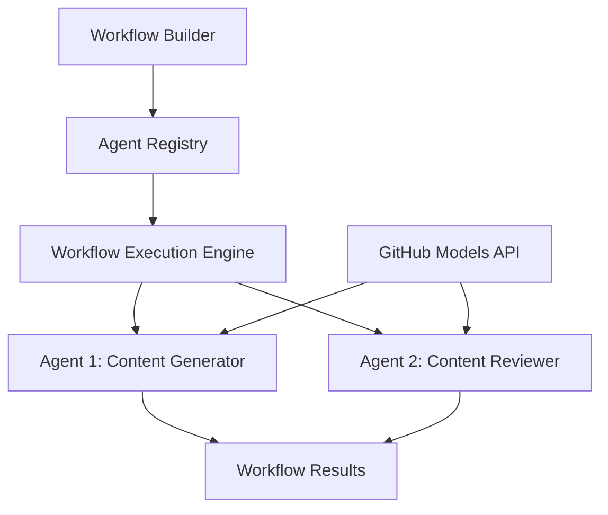

<!--
CO_OP_TRANSLATOR_METADATA:
{
  "original_hash": "034158688d0a45aae06dcbb21b0da5ae",
  "translation_date": "2025-11-11T12:55:57+00:00",
  "source_file": "08-multi-agent/code_samples/workflows-agent-framework/dotNET/01.dotnet-agent-framework-workflow-ghmodel-basic.md",
  "language_code": "sw"
}
-->
# 🔄 Misingi ya Mchakato wa Mawakala na Miundo ya GitHub (.NET)

## 📋 Mafunzo ya Uratibu wa Mchakato

Notebook hii inaonyesha jinsi ya kujenga **mchakato wa mawakala** wa hali ya juu kwa kutumia Mfumo wa Mawakala wa Microsoft kwa .NET na Miundo ya GitHub. Utajifunza kuunda michakato ya biashara ya hatua nyingi ambapo mawakala wa AI hushirikiana kutekeleza majukumu magumu kupitia mifumo ya uratibu iliyopangwa.

## 🎯 Malengo ya Kujifunza

### 🏗️ **Misingi ya Usanifu wa Mchakato**
- **Mjenzi wa Mchakato**: Buni na ratibu michakato ya AI ya hatua nyingi
- **Uratibu wa Mawakala**: Ratibu mawakala maalum wengi ndani ya michakato
- **Ujumuishaji wa Miundo ya GitHub**: Tumia huduma ya utabiri wa miundo ya AI ya GitHub katika michakato
- **Ubunifu wa Mchakato wa Kielelezo**: Unda na elewa muundo wa michakato kwa urahisi zaidi

### 🔄 **Mifumo ya Uratibu wa Mchakato**
- **Usindikaji wa Mfululizo**: Unganisha majukumu ya mawakala kwa mpangilio wa kimantiki
- **Usimamizi wa Hali**: Dumisha muktadha na mtiririko wa data katika hatua za mchakato
- **Ushughulikiaji wa Makosa**: Tekeleza urejeshaji wa makosa na uimara wa mchakato
- **Uboreshaji wa Utendaji**: Buni michakato yenye ufanisi kwa operesheni za kiwango cha biashara

### 🏢 **Matumizi ya Mchakato wa Biashara**
- **Uendeshaji wa Michakato ya Biashara**: Endesha michakato ya biashara ngumu
- **Mchakato wa Uzalishaji wa Maudhui**: Michakato ya uhariri yenye hatua za ukaguzi na idhini
- **Uendeshaji wa Huduma kwa Wateja**: Utatuzi wa maswali ya wateja kwa hatua nyingi
- **Michakato ya Usindikaji wa Data**: Michakato ya ETL yenye mabadiliko yanayotumia AI

## ⚙️ Mahitaji na Usanidi

### 📦 **Paket Muhimu za NuGet**

Mchakato huu wa maonyesho unatumia paket kadhaa muhimu za .NET:

```xml
<!-- Core AI Framework -->
<PackageReference Include="Microsoft.Extensions.AI" Version="9.9.0" />

<!-- Agent Framework (Local Development) -->
<!-- Microsoft.Agents.AI.dll - Core agent abstractions -->
<!-- Microsoft.Agents.AI.OpenAI.dll - OpenAI/GitHub Models integration -->

<!-- Configuration and Environment -->
<PackageReference Include="DotNetEnv" Version="3.1.1" />
```

### 🔑 **Usanidi wa Miundo ya GitHub**

**Usanidi wa Mazingira (Faili ya .env):**
```env
GITHUB_TOKEN=your_github_personal_access_token
GITHUB_ENDPOINT=https://models.inference.ai.azure.com
GITHUB_MODEL_ID=gpt-4o-mini
```

**Ufikiaji wa Miundo ya GitHub:**
1. Jisajili kwa Miundo ya GitHub (kwa sasa katika majaribio)
2. Tengeneza tokeni ya ufikiaji wa kibinafsi yenye ruhusa za ufikiaji wa miundo
3. Sanidi vigezo vya mazingira kama inavyoonyeshwa hapo juu

### 🏗️ **Muhtasari wa Usanifu wa Mchakato**



**Vipengele Muhimu:**
- **WorkflowBuilder**: Injini kuu ya uratibu wa kubuni michakato
- **AIAgent**: Mawakala maalum wenye uwezo maalum
- **GitHub Models Client**: Ujumuishaji wa huduma ya utabiri wa miundo ya AI
- **Execution Context**: Husimamia hali na mtiririko wa data kati ya hatua za mchakato

## 🎨 **Mifumo ya Ubunifu wa Michakato ya Biashara**

### 📝 **Mchakato wa Uzalishaji wa Maudhui**
```
User Request → Content Generation → Quality Review → Final Output
```

### 🔍 **Mchakato wa Usindikaji wa Nyaraka**
```
Document Input → Analysis → Extraction → Validation → Structured Output
```

### 💼 **Mchakato wa Ujasusi wa Biashara**
```
Data Collection → Processing → Analysis → Report Generation → Distribution
```

### 🤝 **Uendeshaji wa Huduma kwa Wateja**
```
Customer Inquiry → Classification → Processing → Response Generation → Follow-up
```

## 🏢 **Faida za Biashara**

### 🎯 **Uaminifu na Uwezo wa Kupanuka**
- **Utekelezaji wa Kiamua**: Matokeo ya mchakato yanayorudiwa na thabiti
- **Urejeshaji wa Makosa**: Ushughulikiaji mzuri wa kushindwa kwa hatua yoyote ya mchakato
- **Ufuatiliaji wa Utendaji**: Fuatilia vipimo vya utekelezaji na fursa za uboreshaji
- **Usimamizi wa Rasilimali**: Ugawaji na matumizi bora ya rasilimali za miundo ya AI

### 🔒 **Usalama na Uzingatiaji**
- **Uthibitishaji Salama**: Uthibitishaji wa msingi wa tokeni ya GitHub kwa ufikiaji wa API
- **Kumbukumbu za Ukaguzi**: Kumbukumbu kamili za utekelezaji wa mchakato na sehemu za maamuzi
- **Udhibiti wa Ufikiaji**: Ruhusa za kina kwa utekelezaji wa mchakato na ufuatiliaji
- **Faragha ya Data**: Ushughulikiaji salama wa taarifa nyeti katika michakato yote

### 📊 **Ufuatiliaji na Usimamizi**
- **Ubunifu wa Mchakato wa Kielelezo**: Uwakilishi wazi wa mtiririko wa michakato na utegemezi
- **Ufuatiliaji wa Utekelezaji**: Ufuatiliaji wa wakati halisi wa maendeleo ya mchakato na utendaji
- **Ripoti za Makosa**: Uchambuzi wa kina wa makosa na uwezo wa kurekebisha
- **Takwimu za Utendaji**: Vipimo vya uboreshaji na upangaji wa uwezo

Hebu tujenge mchakato wako wa AI tayari kwa biashara! 🚀

## 💻 Kuendesha Msimbo

Utekelezaji kamili unapatikana katika `01.dotnet-agent-framework-workflow-ghmodel-basic.cs`. Faili hii inaonyesha:

1. **Usanidi wa Mazingira** - Kupakia hati za GitHub Models kutoka faili ya `.env`
2. **Usanidi wa Mteja wa OpenAI** - Kuseti mteja kutumia endpoint ya GitHub Models
3. **Uundaji wa Mawakala** - Kufafanua mawakala maalum (Front Desk na Concierge)
4. **Mjenzi wa Mchakato** - Kuunda mchakato wa mawakala wengi wenye usindikaji wa mfululizo
5. **Utekelezaji wa Mchakato** - Kuendesha mchakato na matokeo ya mtiririko

### 🚀 Kuendesha Mfano

```bash
# Make the script executable (Unix/Linux/macOS)
chmod +x 01.dotnet-agent-framework-workflow-ghmodel-basic.cs

# Run the workflow
./01.dotnet-agent-framework-workflow-ghmodel-basic.cs
```

Au kwenye Windows:
```powershell
dotnet run 01.dotnet-agent-framework-workflow-ghmodel-basic.cs
```

### 📝 Matokeo Yanayotarajiwa

Mchakato uta:
1. Kupokea ombi lako la marudio ya safari ("Ningependa kwenda Paris")
2. Wakala wa Front Desk atatoa pendekezo la awali
3. Wakala wa Concierge atapitia na kuboresha pendekezo
4. Matokeo ya mwisho yataonyesha mtiririko kamili wa mazungumzo

### 🔧 Kubinafsisha

Unaweza kubinafsisha mchakato kwa:
- Kubadilisha maelekezo ya mawakala ili kubadilisha tabia zao
- Kuongeza mawakala zaidi ili kuunda michakato ya hatua nyingi ngumu
- Kubadilisha ujumbe wa mtumiaji ili kujaribu hali tofauti
- Kurekebisha mipaka ya mchakato ili kuunda mifumo tofauti ya utekelezaji

---

<!-- CO-OP TRANSLATOR DISCLAIMER START -->
**Kanusho**:  
Hati hii imetafsiriwa kwa kutumia huduma ya tafsiri ya AI [Co-op Translator](https://github.com/Azure/co-op-translator). Ingawa tunajitahidi kwa usahihi, tafadhali fahamu kuwa tafsiri za kiotomatiki zinaweza kuwa na makosa au kutokuwa sahihi. Hati ya asili katika lugha yake ya awali inapaswa kuzingatiwa kama chanzo cha mamlaka. Kwa taarifa muhimu, tafsiri ya kitaalamu ya binadamu inapendekezwa. Hatutawajibika kwa kutoelewana au tafsiri zisizo sahihi zinazotokana na matumizi ya tafsiri hii.
<!-- CO-OP TRANSLATOR DISCLAIMER END -->