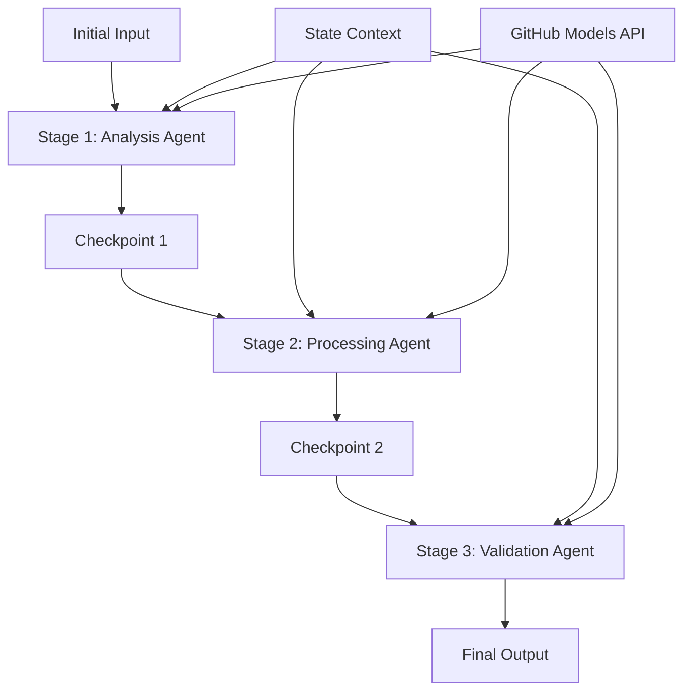

<!--
CO_OP_TRANSLATOR_METADATA:
{
  "original_hash": "1be9c8dcbd79a02d33d2c138684c1394",
  "translation_date": "2025-11-11T14:00:16+00:00",
  "source_file": "08-multi-agent/code_samples/workflows-agent-framework/dotNET/02.dotnet-agent-framework-workflow-ghmodel-sequential.md",
  "language_code": "sw"
}
-->
# ⏩ Mifumo ya Kazi ya Wakala wa Mfululizo na Miundo ya GitHub (.NET)

## 📋 Mafunzo ya Juu ya Usindikaji wa Mfululizo

Notebook hii inaonyesha **mifumo ya kazi ya mfululizo** kwa kutumia Mfumo wa Wakala wa Microsoft kwa .NET na Miundo ya GitHub. Utajifunza jinsi ya kujenga mifumo ya usindikaji ya hatua kwa hatua ambapo mawakala hufanya kazi kwa mpangilio maalum, kila hatua ikijenga juu ya matokeo ya hatua iliyopita.

## 🎯 Malengo ya Kujifunza

### 🔄 **Muundo wa Usindikaji wa Mfululizo**
- **Muundo wa Kazi ya Mfululizo**: Unda mifumo ya usindikaji ya hatua kwa hatua yenye utegemezi wazi
- **Usimamizi wa Hali**: Dumisha muktadha na mtiririko wa data katika hatua za kazi za mfululizo
- **Ujumuishaji wa Miundo ya GitHub**: Tumia miundo ya AI ya GitHub katika kazi za mfululizo za .NET
- **Mifumo ya Kiwanda**: Jenga mifumo ya usindikaji ya mfululizo inayofaa kwa uzalishaji

### 🏗️ **Mifumo ya Juu ya Mfululizo**
- **Usindikaji wa Hatua-Gate**: Tekeleza vituo vya uthibitishaji kati ya hatua za kazi
- **Uhifadhi wa Muktadha**: Dumisha hali na maarifa yaliyokusanywa katika hatua zote
- **Ueneaji wa Makosa**: Shughulikia kushindwa kwa uangalifu katika minyororo ya usindikaji wa mfululizo
- **Uboreshaji wa Utendaji**: Utekelezaji wa mfululizo wenye ufanisi na mzigo mdogo

### 🏢 **Matumizi ya Mfululizo ya Kiwanda**
- **Mfumo wa Usindikaji wa Nyaraka**: Uchambuzi wa nyaraka wa hatua nyingi, mabadiliko, na uthibitishaji
- **Mifumo ya Uhakikisho wa Ubora**: Mapitio ya mfululizo, uthibitishaji, na michakato ya idhini
- **Mfumo wa Uzalishaji wa Maudhui**: Utafiti → Kuandika → Kuhariri → Mapitio → Kuchapisha
- **Uendeshaji wa Mchakato wa Biashara**: Michakato ya biashara ya hatua nyingi yenye utegemezi wazi wa hatua

## ⚙️ Mahitaji & Usanidi

### 📦 **Paket Muhimu za NuGet**

Paket muhimu kwa kazi za mfululizo za .NET:

```xml
<!-- Core AI Framework -->
<PackageReference Include="Microsoft.Extensions.AI" Version="9.9.0" />

<!-- Client Model Abstractions -->
<PackageReference Include="System.ClientModel" Version="1.6.1.0" />

<!-- Azure Identity and Async LINQ Support -->
<PackageReference Include="Azure.Identity" Version="1.15.0" />
<PackageReference Include="System.Linq.Async" Version="6.0.3" />

<!-- Local Agent Framework References -->
<!-- Microsoft.Agents.AI.dll - Core agent abstractions -->
<!-- Microsoft.Agents.AI.OpenAI.dll - GitHub Models integration -->
```

### 🔑 **Usanidi wa Miundo ya GitHub**

**Usanidi wa Mazingira (.env file):**
```env
GITHUB_TOKEN=your_github_personal_access_token
GITHUB_ENDPOINT=https://models.inference.ai.azure.com
GITHUB_MODEL_ID=gpt-4o-mini
```

**Usimamizi wa Usanidi:**
```csharp
// Load environment variables securely
Env.Load("../../../.env");
var githubToken = Environment.GetEnvironmentVariable("GITHUB_TOKEN");
var githubEndpoint = Environment.GetEnvironmentVariable("GITHUB_ENDPOINT");
var modelId = Environment.GetEnvironmentVariable("GITHUB_MODEL_ID");
```

### 🏗️ **Muundo wa Kazi ya Mfululizo**



**Vipengele Muhimu:**
- **Mawakala wa Mfululizo**: Mawakala maalum kwa kila hatua ya usindikaji
- **Muktadha wa Hali**: Hudumisha data na maamuzi yaliyokusanywa katika hatua zote
- **Vituo vya Uthibitishaji**: Sehemu za uthibitishaji kati ya hatua ili kuhakikisha ubora na uthabiti
- **Mteja wa Miundo ya GitHub**: Ufikiaji wa miundo ya AI kwa hatua zote za kazi

## 🎨 **Mifumo ya Muundo wa Kazi ya Mfululizo**

### 📝 **Mfumo wa Usindikaji wa Nyaraka**
```
Raw Document → Content Extraction → Analysis → Validation → Structured Output
```

### 🎯 **Mfumo wa Uzalishaji wa Maudhui**
```
Brief/Requirements → Research → Content Creation → Review → Final Polish
```

### 🔍 **Mfumo wa Uhakikisho wa Ubora**
```
Initial Review → Technical Validation → Compliance Check → Final Approval
```

### 💼 **Mfumo wa Ujasusi wa Biashara**
```
Data Collection → Processing → Analysis → Report Generation → Distribution
```

## 🏢 **Faida za Mfululizo wa Kiwanda**

### 🎯 **Uaminifu & Ubora**
- **Usindikaji wa Kiamua**: Matokeo thabiti na yanayoweza kurudiwa kupitia hatua zilizopangwa
- **Vituo vya Ubora**: Vituo vya uthibitishaji vinahakikisha ubora katika kila hatua
- **Kutengwa kwa Makosa**: Matatizo katika hatua moja hayaathiri hatua zinazofuata
- **Kumbukumbu za Ukaguzi**: Ufuatiliaji kamili wa maamuzi na mabadiliko katika kila hatua

### 📈 **Uwezo wa Kupanuka & Utendaji**
- **Muundo wa Moduli**: Kila hatua inaweza kuboreshwa kwa uhuru
- **Usimamizi wa Rasilimali**: Ugawaji wa rasilimali za miundo ya AI kwa ufanisi katika hatua
- **Uboreshaji wa Hali**: Uhamisho wa hali ndogo kati ya hatua kwa utendaji bora
- **Makundi ya Hatua Sambamba**: Kazi nyingi za mfululizo zinaweza kuendeshwa sambamba

### 🔒 **Usalama & Uzingatiaji**
- **Usalama wa Kiwango cha Hatua**: Sera tofauti za usalama kwa hatua tofauti za usindikaji
- **Uthibitishaji wa Data**: Hakikisha uadilifu wa data na uzingatiaji katika kila kituo
- **Udhibiti wa Ufikiaji**: Ruhusa za kina kwa hatua tofauti za kazi
- **Uzingatiaji wa Kanuni**: Kufuata mahitaji ya kanuni kupitia usindikaji uliopangwa

### 📊 **Ufuatiliaji & Uchambuzi**
- **Vipimo vya Kiwango cha Hatua**: Ufuatiliaji wa utendaji kwa kila hatua ya kazi
- **Utambuzi wa Vikwazo**: Tambua na boresha hatua za polepole
- **Vipimo vya Ubora**: Fuatilia ubora na viwango vya mafanikio katika kila hatua
- **Uboreshaji wa Mchakato**: Uboreshaji endelevu kulingana na uchambuzi wa kiwango cha hatua

Tujenge mifumo thabiti ya usindikaji wa AI ya mfululizo! 🚀

## 💻 Kuendesha Msimbo

Utekelezaji kamili unapatikana katika `02.dotnet-agent-framework-workflow-ghmodel-sequential.cs`. Faili hii inaonyesha **mfumo wa uchambuzi wa fanicha wa hatua tatu**:

1. **Hatua ya 1 - Wakala wa Mauzo**: Huchambua picha za fanicha na kutoa mapendekezo ya ununuzi
2. **Hatua ya 2 - Wakala wa Bei**: Hutoa uchambuzi wa kina wa bei na chaguo za bajeti
3. **Hatua ya 3 - Wakala wa Nukuu**: Hutengeneza hati ya nukuu ya kitaalamu katika muundo wa Markdown

### 🏗️ **Muundo wa Kazi**

```
Image Input → Sales Analysis → Price Estimation → Quote Generation → Final Output
```

Kila wakala:
- Hupokea matokeo kutoka hatua iliyopita kama muktadha
- Hujenga juu ya uchambuzi wa awali kwa utaalamu maalum
- Hudumisha mwendelezo wa kazi kupitia usimamizi wa hali

### 🚀 Kuendesha Mfano

**Mahitaji:**
- Weka picha ya fanicha katika `../imgs/home.png` (au sasisha kigezo cha `imgPath`)
- Sanidi faili yako ya `.env` na hati za miundo ya GitHub

```bash
# Make the script executable (Unix/Linux/macOS)
chmod +x 02.dotnet-agent-framework-workflow-ghmodel-sequential.cs

# Run the sequential workflow
./02.dotnet-agent-framework-workflow-ghmodel-sequential.cs
```

Au kwenye Windows:
```powershell
dotnet run 02.dotnet-agent-framework-workflow-ghmodel-sequential.cs
```

### 📝 Matokeo Yanayotarajiwa

Mfumo uta:
1. **Wakala wa Mauzo**: Tambua vitu vya fanicha kutoka kwenye picha na kutoa mapendekezo
2. **Wakala wa Bei**: Ongeza uchambuzi wa kina wa bei na viwango vya bajeti na mapendekezo ya ununuzi
3. **Wakala wa Nukuu**: Tengeneza hati ya nukuu iliyopangwa na taarifa zote zilizojumuishwa

Matokeo ya mwisho yatakuwa nukuu ya fanicha ya kitaalamu na kamili kulingana na uchambuzi wa picha.

### 🔧 Chaguo za Kubadilisha

**Badilisha Tabia ya Wakala:**
```csharp
// Adjust agent instructions to change their focus
const string SalesAgentInstructions = "Your custom instructions...";
```

**Badilisha Mtiririko wa Mfululizo:**
```csharp
// Add or reorder workflow stages
var workflow = new WorkflowBuilder(salesagent)
    .AddEdge(salesagent, priceagent)
    .AddEdge(priceagent, quoteagent)
    .AddEdge(quoteagent, newAgent)  // Add another stage
    .Build();
```

**Tumia Ingizo Tofauti:**
```csharp
// Process text instead of images
ChatMessage userMessage = new ChatMessage(ChatRole.User, [
    new TextContent("Analyze pricing for a modern living room set")
]);
```

### 🎯 Matumizi ya Kiwanda ya Kawaida

Mfumo huu wa mfululizo unafaa kwa:
- **E-commerce**: Uchambuzi wa bidhaa → Bei → Utengenezaji wa nukuu
- **Mali isiyohamishika**: Uchambuzi wa mali → Thamani → Utengenezaji wa orodha
- **Bima**: Uchambuzi wa madai → Tathmini → Utengenezaji wa nukuu
- **Uzalishaji wa Maudhui**: Utafiti → Kuandika → Kuhariri → Kuchapisha

### 🔍 Kuelewa Mtiririko wa Hali

Kila wakala katika mfululizo hupokea:
- **Ingizo la Awali**: Ujumbe wa awali wa mtumiaji (picha + maandishi)
- **Matokeo ya Mawakala wa Awali**: Majibu yote ya mawakala wa awali katika historia ya mazungumzo
- **Muktadha Uliokusanywa**: Hali kamili iliyohifadhiwa katika mfululizo wote wa kazi

Hii inawezesha usindikaji wa hatua nyingi wa hali ya juu ambapo kila wakala hujenga juu ya muktadha kamili kutoka hatua zote za awali.

---

<!-- CO-OP TRANSLATOR DISCLAIMER START -->
**Kanusho**:  
Hati hii imetafsiriwa kwa kutumia huduma ya kutafsiri ya AI [Co-op Translator](https://github.com/Azure/co-op-translator). Ingawa tunajitahidi kwa usahihi, tafadhali fahamu kuwa tafsiri za kiotomatiki zinaweza kuwa na makosa au kutokuwa sahihi. Hati ya asili katika lugha yake ya asili inapaswa kuzingatiwa kama chanzo cha mamlaka. Kwa taarifa muhimu, tafsiri ya kitaalamu ya binadamu inapendekezwa. Hatutawajibika kwa kutoelewana au tafsiri zisizo sahihi zinazotokana na matumizi ya tafsiri hii.
<!-- CO-OP TRANSLATOR DISCLAIMER END -->