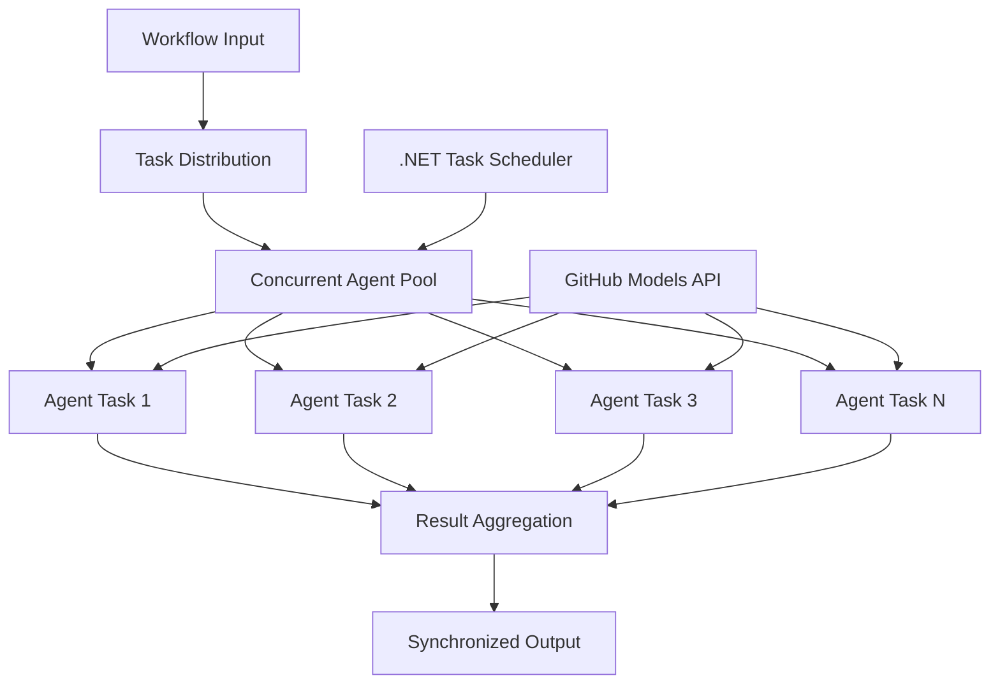

<!--
CO_OP_TRANSLATOR_METADATA:
{
  "original_hash": "b9c6e32c9b5f2fed20b6916984440d88",
  "translation_date": "2025-11-11T13:27:42+00:00",
  "source_file": "08-multi-agent/code_samples/workflows-agent-framework/dotNET/03.dotnet-agent-framework-workflow-ghmodel-concurrent.md",
  "language_code": "sw"
}
-->
# ⚡ Mifumo ya Kazi ya Wakala Sambamba na GitHub Models (.NET)

## 📋 Mafunzo ya Usindikaji Sambamba wa Utendaji wa Juu

Notebook hii inaonyesha **mifumo ya kazi sambamba** kwa kutumia Mfumo wa Wakala wa Microsoft kwa .NET na GitHub Models. Utajifunza jinsi ya kujenga mifumo ya kazi ya usindikaji wa utendaji wa juu, sambamba ambayo huongeza kasi kwa kutekeleza mawakala wa AI wengi kwa wakati mmoja huku ukidumisha uratibu na uthabiti wa data.

## 🎯 Malengo ya Kujifunza

### 🚀 **Misingi ya Usindikaji Sambamba**
- **Utekelezaji wa Mawakala Sambamba**: Endesha mawakala wa AI wengi kwa wakati mmoja kwa utendaji wa juu zaidi
- **Mifumo ya Async/Await**: Tumia mfano wa programu ya async wa .NET kwa usindikaji bora sambamba
- **Ujumuishaji wa GitHub Models**: Ratibu miito mingi sambamba kwa huduma ya utambuzi wa modeli ya AI ya GitHub
- **Usimamizi wa Rasilimali**: Simamia rasilimali za modeli ya AI kwa ufanisi katika operesheni sambamba

### 🏗️ **Usanifu wa Juu wa Sambamba**
- **Ulinganifu wa Kazi**: Tumia Maktaba ya Kazi Sambamba ya .NET kwa utekelezaji bora sambamba
- **Mifumo ya Usawazishaji**: Ratibu mawakala sambamba huku ukiepuka hali za mbio
- **Usawazishaji wa Mzigo**: Sambaza kazi kwa ufanisi katika uwezo wa usindikaji sambamba uliopo
- **Uvumilivu wa Hitilafu**: Shughulikia kushindwa kwa wakala mmoja bila kusimamisha mfumo mzima wa kazi

### 🏢 **Programu za Sambamba za Biashara**
- **Usindikaji wa Nyaraka za Kiasi Kikubwa**: Usindikaji wa nyaraka nyingi kwa wakati mmoja
- **Uchambuzi wa Maudhui ya Wakati Halisi**: Uchambuzi sambamba wa mitiririko ya data inayoingia
- **Uboreshaji wa Usindikaji wa Kundi**: Ongeza kasi kwa operesheni za usindikaji wa data kwa kiwango kikubwa
- **Uchambuzi wa Aina Nyingi**: Usindikaji sambamba wa aina tofauti za maudhui na fomati

## ⚙️ Mahitaji & Usanidi

### 📦 **Paket Muhimu za NuGet**

Paket muhimu kwa mifumo ya kazi sambamba ya utendaji wa juu:

```xml
<!-- Core AI Framework with Async Support -->
<PackageReference Include="Microsoft.Extensions.AI" Version="9.9.0" />

<!-- Client Model Abstractions for API Communication -->
<PackageReference Include="System.ClientModel" Version="1.6.1.0" />

<!-- Azure Identity and Async LINQ for Advanced Operations -->
<PackageReference Include="Azure.Identity" Version="1.15.0" />
<PackageReference Include="System.Linq.Async" Version="6.0.3" />

<!-- Local Agent Framework References -->
<!-- Microsoft.Agents.AI.dll - Core agent abstractions with async support -->
<!-- Microsoft.Agents.AI.OpenAI.dll - GitHub Models integration with concurrency -->
```

### 🔑 **Usanidi wa GitHub Models**

**Usanidi wa Mazingira (.env file):**
```env
GITHUB_TOKEN=your_github_personal_access_token
GITHUB_ENDPOINT=https://models.inference.ai.azure.com
GITHUB_MODEL_ID=gpt-4o-mini
```

**Mambo ya Kuzingatia kwa Usindikaji Sambamba:**
```csharp
// Configure for concurrent operations
var clientOptions = new OpenAIClientOptions()
{
    Endpoint = new Uri(githubEndpoint),
    // Configure connection pooling for concurrent requests
    NetworkTimeout = TimeSpan.FromMinutes(5)
};
```

### 🏗️ **Usanifu wa Mfumo wa Kazi Sambamba**



**Vipengele Muhimu:**
- **Maktaba ya Kazi Sambamba**: Msaada wa ndani wa .NET kwa operesheni sambamba
- **Pool ya Mawakala**: Nakala nyingi za wakala kwa usindikaji sambamba
- **Muunganiko wa Matokeo**: Uratibu na kuunganisha matokeo ya mawakala sambamba
- **Pointi za Usawazishaji**: Hakikisha uthabiti wa data katika operesheni sambamba

## 🎨 **Mifumo ya Ubunifu ya Kazi Sambamba**

### 🔍 **Utafiti Sambamba & Uchambuzi**
```
Research Topic → Concurrent Research Agents → Result Synthesis → Final Report
```

### 📊 **Usindikaji wa Data kutoka Vyanzo Vingi**
```
Data Sources → Parallel Processing Agents → Data Integration → Unified Output
```

### 🎭 **Mfumo wa Uzalishaji wa Maudhui**
```
Content Requirements → Concurrent Content Generators → Quality Review → Final Content
```

### 🔄 **Usindikaji wa Fan-Out/Fan-In**
```
Single Input → Multiple Concurrent Processors → Result Aggregation → Single Output
```

## 🏢 **Faida za Utendaji wa Biashara**

### ⚡ **Kasi & Uwezo wa Kupanuka**
- **Upanuzi wa Utendaji wa Mstari**: Ongeza mawakala sambamba zaidi ili kuongeza kasi
- **Matumizi ya Rasilimali**: Ufanisi wa juu wa uwezo wa modeli ya AI uliopo
- **Kupunguza Muda wa Usindikaji**: Kupunguza muda kwa kiasi kikubwa kupitia utekelezaji sambamba
- **Upanuzi wa Elastic**: Rekebisha idadi ya mawakala sambamba kwa nguvu kulingana na mzigo wa kazi

### 🛡️ **Uaminifu & Ustahimilivu**
- **Kutengwa kwa Hitilafu**: Kushindwa kwa wakala mmoja hakuharibu operesheni nyingine sambamba
- **Kupungua kwa Neema**: Mfumo unaendelea kufanya kazi na uwezo wa wakala uliopunguzwa
- **Urejeshaji wa Hitilafu**: Mifumo ya kurudia kiotomatiki kwa operesheni sambamba zilizoshindwa
- **Usambazaji wa Mzigo**: Usambazaji sawa wa kazi kwa mawakala waliopo

### 📊 **Ufuatiliaji wa Utendaji**
- **Vipimo vya Utekelezaji Sambamba**: Fuatilia utendaji wa operesheni zote sambamba
- **Takwimu za Matumizi ya Rasilimali**: Fuatilia matumizi ya CPU, kumbukumbu, na mtandao
- **Uchambuzi wa Kasi**: Pima faida za ufanisi kutoka kwa usindikaji sambamba
- **Utambuzi wa Vikwazo**: Tambua na suluhisha vikwazo vya utendaji

### 🔧 **Maendeleo & Operesheni**
- **Mfumo wa Programu ya Async**: Tumia mifumo ya async/await ya .NET iliyokomaa
- **Uratibu wa Kazi**: Uwezo wa usimamizi wa kazi na uratibu uliojengwa ndani
- **Ushughulikiaji wa Isipokuwa**: Ushughulikiaji wa hitilafu wa kina kwa operesheni sambamba
- **Msaada wa Ufuatiliaji**: Zana za ufuatiliaji za Visual Studio kwa mifumo ya kazi sambamba

Tujenge mifumo ya kazi ya AI sambamba ya utendaji wa juu kwa .NET! 🚀

## 💻 Kuendesha Msimbo

Utekelezaji kamili unapatikana katika `03.dotnet-agent-framework-workflow-ghmodel-concurrent.cs`. Faili hii inaonyesha **Mfumo wa Kazi Sambamba wa Fan-Out/Fan-In** kwa upangaji wa safari:

### 🏗️ **Usanifu wa Mfumo wa Kazi**

```
User Request → ConcurrentStartExecutor → [Researcher Agent || Planner Agent] → ConcurrentAggregationExecutor → Final Output
```

**Vipengele Muhimu:**

1. **ConcurrentStartExecutor**: Inatangaza ombi la mtumiaji kwa mawakala wote kwa wakati mmoja
2. **Researcher Agent**: Inachambua maeneo na vivutio sambamba
3. **Planner Agent**: Inaunda mipango ya safari kwa undani sambamba
4. **ConcurrentAggregationExecutor**: Inakusanya na kuunganisha matokeo kutoka kwa mawakala wote

### 🎯 **Mfumo wa Fan-Out/Fan-In**

Mfumo huu unaonyesha mfumo wa kawaida wa **Fan-Out/Fan-In**:
- **Fan-Out**: Ujumbe mmoja wa pembejeo unatolewa kwa mawakala wengi kwa wakati mmoja
- **Usindikaji Sambamba**: Mawakala wengi hufanya kazi sambamba kwenye kazi moja
- **Fan-In**: Matokeo kutoka kwa mawakala wote yanakusanywa na kuunganishwa kuwa pato moja

### 🚀 Kuendesha Mfano

```bash
# Make the script executable (Unix/Linux/macOS)
chmod +x 03.dotnet-agent-framework-workflow-ghmodel-concurrent.cs

# Run the concurrent workflow
./03.dotnet-agent-framework-workflow-ghmodel-concurrent.cs
```

Au kwenye Windows:
```powershell
dotnet run 03.dotnet-agent-framework-workflow-ghmodel-concurrent.cs
```

### 📝 Matokeo Yanayotarajiwa

Mfumo wa kazi utafanya:
1. **Kutangaza Ombi**: Tuma "Panga safari kwenda Seattle mwezi wa Desemba" kwa mawakala wote
2. **Usindikaji Sambamba**: Mawakala wote hufanya kazi kwa wakati mmoja:
   - Mtafiti anatambua vivutio na maelezo
   - Mpangaji anaunda ratiba na mipango ya usafiri
3. **Muunganiko**: Unganisha majibu yote kuwa pato kamili
4. **Onyesha Matokeo**: Onyesha mpango wa safari uliounganishwa na taarifa zote

### 🔧 Chaguo za Kubinafsisha

**Ongeza Mawakala Sambamba Zaidi:**
```csharp
// Create additional specialized agents
AIAgent budgetAgent = openAIClient.GetChatClient(github_model_id).CreateAIAgent(
    name: "Budget-Agent", instructions: "Calculate travel costs...");

// Add to fan-out
var workflow = new WorkflowBuilder(startExecutor)
    .AddFanOutEdge(startExecutor, targets: [researcherAgent, plannerAgent, budgetAgent])
    .AddFanInEdge(aggregationExecutor, sources: [researcherAgent, plannerAgent, budgetAgent])
    .WithOutputFrom(aggregationExecutor)
    .Build();

// Update aggregation count
if (this._messages.Count == 3) { ... }
```

**Badilisha Maelekezo ya Wakala:**
```csharp
const string ResearcherAgentInstructions = "Your custom instructions for research...";
const string PlanAgentInstructions = "Your custom instructions for planning...";
```

**Badilisha Kazi:**
```csharp
StreamingRun run = await InProcessExecution.StreamAsync(
    workflow, 
    "Plan a European vacation for 2 weeks in summer"
);
```

### 🎯 Matumizi ya Kawaida

Mfumo huu sambamba unafaa kwa:
- **Uundaji wa Maudhui**: Waandishi wengi wakitengeneza sehemu tofauti kwa wakati mmoja
- **Ukaguzi wa Msimbo**: Wakaguzi wengi wakichambua msimbo kutoka mitazamo tofauti
- **Utafiti wa Soko**: Uchambuzi sambamba wa sehemu tofauti za soko
- **Usindikaji wa Nyaraka**: Uchimbaji, uchambuzi, na uthibitishaji sambamba
- **Uchambuzi wa Mitazamo Mingi**: Kupata mitazamo tofauti juu ya pembejeo moja

### 🔍 Kuelewa Watekelezaji Maalum

**ConcurrentStartExecutor:**
- Hutekeleza `IMessageHandler<string>` kupokea pembejeo ya maandishi
- Hutangaza ujumbe kwa mawakala wote waliounganishwa
- Hutuma `TurnToken` kuanzisha usindikaji sambamba

**ConcurrentAggregationExecutor:**
- Hutekeleza `IMessageHandler<ChatMessage>` kupokea majibu ya wakala
- Hukusanya ujumbe kwa njia salama kwa nyuzi
- Huunganisha wakati majibu yote yanayotarajiwa yanapofika
- Hutoa pato la mwisho kwa kutumia `context.YieldOutputAsync()`

### ⚡ Faida za Utendaji

**Sambamba vs Mfululizo:**
- Mfululizo: Wakala1 (30s) → Wakala2 (30s) = **Jumla ya sekunde 60**
- Sambamba: Wakala1 (30s) || Wakala2 (30s) = **Jumla ya sekunde 30**

**Uboreshaji wa Kasi**: Hadi N× haraka kwa mawakala N sambamba (kulingana na mzigo wa kazi na rasilimali)

### 🛡️ Ushughulikiaji wa Hitilafu

Mfumo wa kazi hushughulikia kushindwa kwa wakala mmoja kwa neema:
- Ikiwa wakala mmoja atashindwa, wengine wanaendelea kusindika
- Muunganiko unaweza kutekeleza mantiki ya muda wa kusubiri
- Matokeo ya sehemu yanaweza kurudishwa ikiwa inahitajika

### 📊 Vipengele vya Juu

**Idadi ya Mawakala Inayobadilika:**
Badilisha mantiki ya muunganiko ili kusaidia idadi ya mawakala inayobadilika:

```csharp
private int _expectedAgentCount;
private readonly List<ChatMessage> _messages = [];

public async ValueTask HandleAsync(ChatMessage message, IWorkflowContext context)
{
    this._messages.Add(message);
    if (this._messages.Count == _expectedAgentCount)
    {
        // Process aggregation
    }
}
```

Mfumo huu wa kazi sambamba ni muhimu kwa kujenga mifumo ya wakala wa AI yenye utendaji wa juu na inayoweza kupanuka!

---

<!-- CO-OP TRANSLATOR DISCLAIMER START -->
**Kanusho**:  
Hati hii imetafsiriwa kwa kutumia huduma ya tafsiri ya AI [Co-op Translator](https://github.com/Azure/co-op-translator). Ingawa tunajitahidi kwa usahihi, tafadhali fahamu kuwa tafsiri za kiotomatiki zinaweza kuwa na makosa au kutokuwa sahihi. Hati ya asili katika lugha yake ya awali inapaswa kuzingatiwa kama chanzo cha mamlaka. Kwa taarifa muhimu, tafsiri ya kitaalamu ya binadamu inapendekezwa. Hatutawajibika kwa kutoelewana au tafsiri zisizo sahihi zinazotokana na matumizi ya tafsiri hii.
<!-- CO-OP TRANSLATOR DISCLAIMER END -->