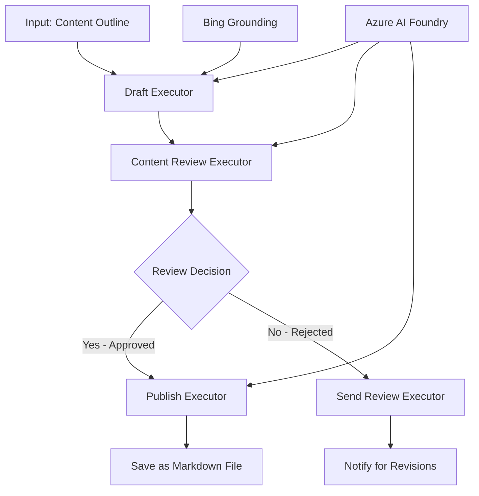

<!--
CO_OP_TRANSLATOR_METADATA:
{
  "original_hash": "8abd335151cee553293b637ee3d80d10",
  "translation_date": "2025-11-11T12:26:04+00:00",
  "source_file": "08-multi-agent/code_samples/workflows-agent-framework/dotNET/04.dotnet-agent-framework-workflow-aifoundry-condition.md",
  "language_code": "sw"
}
-->
# 🔀 Mtiririko wa Kazi wa Wakala wa Masharti na Azure AI Foundry (.NET)

## 📋 Mafunzo ya Mtiririko wa Kazi wa Maamuzi ya Akili

Notebook hii inaonyesha **mifumo ya mtiririko wa kazi wa masharti** kwa kutumia Azure AI Foundry na Microsoft Agent Framework kwa .NET. Utajifunza jinsi ya kujenga mtiririko wa kazi wa hali ya juu unaoendeshwa na maamuzi, ambao unaratibu kwa akili usindikaji kulingana na uchambuzi wa AI, sheria za biashara, na hali zinazobadilika kwa ajili ya otomatiki ya kiwango cha biashara.

## 🎯 Malengo ya Kujifunza

### 🧠 **Usanifu wa Maamuzi ya Akili**
- **Utekelezaji wa Mantiki ya Masharti**: Jenga miti ya maamuzi yenye matawi mengi
- **Uratibu unaotegemea AI**: Tumia mifano ya Azure AI Foundry kufanya maamuzi ya uratibu kwa akili
- **Mabadiliko ya Mtiririko wa Kazi**: Badilisha tabia ya mtiririko wa kazi kulingana na uchambuzi wa wakati wa kukimbia na hali
- **Ujumuishaji wa Sheria za Biashara**: Jumuisha mantiki ya biashara na mahitaji ya kufuata katika mtiririko wa kazi

### 🔀 **Mifumo ya Masharti ya Juu**
- **Uamuzi wa Vigezo Vingi**: Tathmini mambo mengi kwa maamuzi ya uratibu
- **Usindikaji unaojali muktadha**: Fanya maamuzi kulingana na muktadha wa mtiririko wa kazi uliokusanywa na historia
- **Marekebisho ya Mtiririko wa Kazi**: Rekebisha njia za usindikaji kwa wakati halisi kulingana na hali
- **Ujumuishaji wa Injini ya Sheria**: Tekeleza injini za sheria za biashara za hali ya juu ndani ya mtiririko wa kazi

### 🏢 **Matumizi ya Masharti ya Biashara**
- **Uainishaji na Uratibu wa Nyaraka**: Uainishe na uratibu nyaraka kwa mtiririko wa kazi unaofaa
- **Triage ya Huduma kwa Wateja**: Uratibu wa akili wa maswali ya wateja kwa timu maalum za kushughulikia
- **Usindikaji wa Ufuatiliaji na Hatari**: Tumia michakato tofauti ya uthibitishaji na ukaguzi kulingana na tathmini ya hatari
- **Mtiririko wa Kazi wa Udhibiti wa Ubora**: Elekeza maudhui kupitia michakato ya ukaguzi inayofaa kulingana na viwango vya ubora

## ⚙️ Mahitaji ya Awali na Usanidi

### 📦 **Paket Zinazohitajika za NuGet**

Paket za hali ya juu kwa usindikaji wa mtiririko wa kazi wa masharti:

```xml
<!-- Core AI Framework -->
<PackageReference Include="Microsoft.Extensions.AI" Version="9.9.0" />

<!-- Azure AI Agents with Persistent State -->
<PackageReference Include="Azure.AI.Agents.Persistent" Version="1.2.0-beta.5" />

<!-- Azure Identity and Utilities -->
<PackageReference Include="Azure.Identity" Version="1.15.0" />
<PackageReference Include="System.Linq.Async" Version="6.0.3" />
<PackageReference Include="DotNetEnv" Version="3.1.1" />

<!-- Local Workflow Framework References -->
<!-- Microsoft.Agents.Workflows.dll - Advanced workflow orchestration -->
<!-- Microsoft.Agents.AI.AzureAI.dll - Azure AI Foundry integration -->
<!-- Microsoft.Agents.AI.dll - Core agent abstractions -->
```

### 🔑 **Usanidi wa Azure AI Foundry**

**Rasilimali Zinazohitajika za Azure:**
- Workspace ya Azure AI Foundry yenye mifano ya usindikaji wa masharti
- Usajili wa Azure wenye upendeleo wa hesabu na ruhusa zinazofaa
- Mifano ya AI iliyowekwa kwa ajili ya kufanya maamuzi na uchambuzi wa maudhui
- (Hiari) Muunganisho wa Bing Search API kwa uwezo wa msingi

**Usanidi wa Mazingira (.env file):**
```env
# Azure AI Foundry Configuration
AZURE_AI_PROJECT_ENDPOINT=https://your-project.cognitiveservices.azure.com/
BING_CONNECTION_ID=your-bing-connection-id
```

**Usanidi wa Uthibitishaji:**
```csharp
// Azure CLI or Managed Identity authentication
using Azure.Identity;
var credential = new AzureCliCredential();

// Load environment configuration
DotNetEnv.Env.Load("../../../.env");
```

### 🏗️ **Usanifu wa Mtiririko wa Kazi wa Masharti**



**Vipengele Muhimu:**
- **Draft Executor**: Wakala wa AI anayezalisha rasimu za maudhui kutoka kwa muhtasari
- **Content Review Executor**: Wakala wa AI anayepima ubora wa rasimu na kufuata sheria
- **Uratibu wa Masharti**: Mantiki ya maamuzi inayoratibu kulingana na matokeo ya ukaguzi
- **Njia za Kuchapisha/Ukaguzi**: Njia tofauti za usindikaji kwa maudhui yaliyokubaliwa dhidi ya yaliyokataliwa
- **Usimamizi wa Hali**: Hudumisha muktadha wa maudhui na ukaguzi katika mtiririko wa kazi

## 🎨 **Mifumo ya Ubunifu ya Mtiririko wa Kazi wa Masharti**

### 📋 **Uzalishaji wa Maudhui na Milango ya Ubora**
```
Outline → Draft Creation → Quality Review → {Approve: Publish | Reject: Revise}
```

### 🎯 **Usindikaji wa Nyaraka Kulingana na Hatari**
```
Document → Risk Assessment → {Low: Standard | High: Enhanced Review}
```

### 🔍 **Uratibu wa Huduma kwa Wateja kwa Akili**
```
Customer Query → Analysis → {Simple: FAQ Bot | Complex: Human Agent}
```

### 💼 **Mtiririko wa Kazi Unaotegemea Ufuatiliaji**
```
Content → Compliance Check → {Pass: Publish | Fail: Legal Review}
```

## 🏢 **Faida za Masharti ya Biashara**

### 🎯 **Otomatiki ya Akili**
- **Maamuzi ya Akili**: Maamuzi ya uratibu yanayotegemea AI kulingana na uchambuzi wa maudhui na muktadha
- **Usindikaji Unaobadilika**: Mtiririko wa kazi unaojirekebisha kiotomatiki kulingana na hali zinazobadilika
- **Utekelezaji wa Sheria za Biashara**: Utumiaji wa kiotomatiki wa mantiki ya biashara na sera ngumu
- **Uratibu Unaotegemea Muktadha**: Maamuzi yanayotegemea historia kamili ya mtiririko wa kazi na muktadha uliokusanywa

### 📈 **Ubora wa Uendeshaji**
- **Ugawaji wa Rasilimali Ulioimarishwa**: Elekeza kazi kwa wataalamu na michakato inayofaa zaidi
- **Kupunguza Uingiliaji wa Mwongozo**: Maamuzi ya kiotomatiki yanapunguza hitaji la uratibu wa binadamu
- **Nyakati za Utatuzi Haraka**: Uratibu wa moja kwa moja kwa utaalamu na uwezo wa usindikaji unaofaa
- **Utumiaji Thabiti**: Utumiaji wa sare wa sheria za biashara na vigezo vya maamuzi

### 🛡️ **Usimamizi wa Hatari na Ufuatiliaji**
- **Tathmini ya Hatari Kiotomatiki**: Tathmini inayotegemea AI ya maudhui na viwango vya hatari vya hali
- **Utekelezaji wa Ufuatiliaji**: Uratibu wa kiotomatiki kupitia michakato ya udhibiti inayohitajika
- **Utumiaji wa Itifaki za Usalama**: Hatua za usalama zilizoboreshwa zinazotumika kulingana na tathmini ya hatari
- **Uhifadhi wa Kumbukumbu za Ukaguzi**: Hati kamili ya maamuzi ya uratibu na mantiki

### 📊 **Takwimu na Uboreshaji Endelevu**
- **Takwimu za Maamuzi**: Fuatilia ufanisi na usahihi wa maamuzi ya uratibu
- **Utambuzi wa Mifumo**: Tambua mitindo na mifumo katika maamuzi ya uratibu kwa muda
- **Uboreshaji wa Utendaji**: Uboreshaji endelevu wa vigezo vya maamuzi na ufanisi wa uratibu
- **Ujasusi wa Biashara**: Maarifa kuhusu sifa za maudhui na mahitaji ya usindikaji

### 🔧 **Ubora wa Kiufundi**
- **Usimamizi wa Hali Endelevu**: Hudumisha hali ngumu katika utekelezaji wa mtiririko wa kazi
- **Usanifu Unaoweza Kupimika**: Shughulikia mahitaji ya usindikaji wa masharti ya kiwango cha juu
- **Uwezo wa Ujumuishaji**: Ujumuishaji usio na mshono na mifumo na michakato ya biashara iliyopo
- **Ufuatiliaji na Uangalizi**: Ufuatiliaji wa kina wa utendaji wa mtiririko wa kazi na maamuzi

Tujenge mtiririko wa kazi wa biashara wenye akili unaoendeshwa na maamuzi kwa kutumia .NET! 🚀

## 💻 Kuendesha Msimbo

Utekelezaji kamili unapatikana katika `04.dotnet-agent-framework-workflow-aifoundry-condition.cs`. Hii inaonyesha **mtiririko wa kazi wa uzalishaji wa maudhui na milango ya ubora**:

### 🏗️ **Usanifu wa Mtiririko wa Kazi**

```
Content Outline → Draft Creation → Quality Review → Conditional Routing:
                                                      ├─ Approved (>200 words) → Publish
                                                      └─ Rejected (<200 words) → Review Notification
```

**Wakala katika Mtiririko wa Kazi:**
1. **Evangelist Agent**: Hutengeneza rasimu za mafunzo kutoka kwa muhtasari kwa kutumia Bing grounding
2. **Content Reviewer Agent**: Hupima ubora wa rasimu (idadi ya maneno, ukamilifu)
3. **Publisher Agent**: Huokoa maudhui yaliyokubaliwa kama faili za Markdown zenye alama ya muda

**Watekelezaji Maalum:**
1. **DraftExecutor**: Husimamia utengenezaji wa rasimu
2. **ContentReviewExecutor**: Hufanya tathmini ya ubora
3. **PublishExecutor**: Hushughulikia uchapishaji wa maudhui yaliyokubaliwa
4. **SendReviewExecutor**: Husimamia arifa za maudhui yaliyokataliwa

### 🚀 Kuendesha Mfano

**Mahitaji ya Awali:**
- Workspace ya Azure AI Foundry imewekwa
- Uthibitishaji wa Azure CLI (`az login`)
- (Hiari) Muunganisho wa Bing Search kwa msingi

```bash
# Make the script executable (Unix/Linux/macOS)
chmod +x 04.dotnet-agent-framework-workflow-aifoundry-condition.cs

# Run the conditional workflow
./04.dotnet-agent-framework-workflow-aifoundry-condition.cs
```

Au kwenye Windows:
```powershell
dotnet run 04.dotnet-agent-framework-workflow-aifoundry-condition.cs
```

### 📝 Matokeo Yanayotarajiwa

Mtiririko wa kazi uta:
1. **Unda Wakala**: Anzisha wakala watatu maalum wa Azure AI Foundry
2. **Zalisha Rasimu**: Wakala wa Evangelist hutengeneza rasimu ya mafunzo kutoka kwa muhtasari
3. **Kagua Maudhui**: Mhakiki wa Maudhui hupima ubora wa rasimu
4. **Uratibu wa Masharti**:
   - **Ikiwa imekubaliwa (>maneno 200)**: Mchapishaji huokoa kama faili ya Markdown
   - **Ikiwa imekataliwa (<maneno 200)**: Tuma arifa ya ukaguzi
5. **Onyesha Matokeo**: Onyesha matokeo ya mwisho ya mtiririko wa kazi

### 🔧 Chaguo za Kubinafsisha

**Badilisha Vigezo vya Ukaguzi:**
```csharp
const string ContentReviewerInstructions = @"
You are a content reviewer...
1. Check if content is more than 500 words (instead of 200)
2. Verify technical accuracy
3. Ensure proper formatting
...";
```

**Ongeza Njia Zaidi za Masharti:**
```csharp
var workflow = new WorkflowBuilder(draftExecutor)
    .AddEdge(draftExecutor, contentReviewerExecutor)
    .AddEdge(contentReviewerExecutor, publishExecutor, condition: GetCondition("Excellent"))
    .AddEdge(contentReviewerExecutor, editExecutor, condition: GetCondition("Good"))
    .AddEdge(contentReviewerExecutor, sendReviewerExecutor, condition: GetCondition("Poor"))
    .Build();
```

**Badilisha Mahitaji ya Maudhui:**
```csharp
string OUTLINE_Content = @"
# Your Custom Topic
## Section 1
https://your-reference-url
## Section 2
...
";
```

### 🎯 Matumizi ya Kawaida

Mfumo huu wa mtiririko wa kazi wa masharti unafaa kwa:
- **Mifumo ya Usimamizi wa Maudhui**: Mtiririko wa kazi wa uhariri wa kiotomatiki na milango ya ubora
- **Usindikaji wa Nyaraka**: Elekeza nyaraka kulingana na uainishaji na ufuatiliaji
- **Huduma kwa Wateja**: Uratibu wa tiketi kwa akili kulingana na ugumu na uharaka
- **Ukaguzi wa Kisheria**: Elekeza mikataba kulingana na tathmini ya hatari na thamani
- **Michakato ya HR**: Elekeza maombi kupitia mtiririko wa kazi wa uchunguzi unaofaa

### 🔍 Kuelewa Mantiki ya Masharti

**Kazi ya Masharti:**
```csharp
public Func<object?, bool> GetCondition(string expectedResult) =>
    reviewResult => reviewResult is ReviewResult review && review.Result == expectedResult;
```

Kazi hii huunda kigezo kinachofanya:
1. Hukagua ikiwa matokeo ni ya aina `ReviewResult`
2. Hulinganisha mali ya `Result` na thamani inayotarajiwa
3. Hurejesha kweli/siyo ili kuamua uratibu

**Mikondo ya Mtiririko wa Kazi na Masharti:**
```csharp
.AddEdge(contentReviewerExecutor, publishExecutor, condition: GetCondition("Yes"))
.AddEdge(contentReviewerExecutor, sendReviewerExecutor, condition: GetCondition("No"))
```

### 📊 Vipengele vya Juu

**Uthibitishaji wa Schema ya JSON:**
Mtiririko wa kazi hutumia schema za JSON kuhakikisha majibu yaliyo na muundo:

```csharp
// Define response structure
public class ReviewResult
{
    [JsonPropertyName("review_result")]
    public string Result { get; set; } = string.Empty;
    
    [JsonPropertyName("reason")]
    public string Reason { get; set; } = string.Empty;
    
    [JsonPropertyName("draft_content")]
    public string DraftContent { get; set; } = string.Empty;
}

// Apply to agent
ResponseFormat = ChatResponseFormat.ForJsonSchema(
    AIJsonUtilities.CreateJsonSchema(typeof(ReviewResult)), 
    "ReviewResult", 
    "Review Result From DraftContent"
)
```

**Ujumuishaji wa Bing Grounding:**
Wakala wa Evangelist hutumia Bing grounding kufikia taarifa za wakati halisi:

```csharp
var bingGroundingConfig = new BingGroundingSearchConfiguration(bing_conn_id);
BingGroundingToolDefinition bingGroundingTool = new(
    new BingGroundingSearchToolParameters([bingGroundingConfig])
);
```

Hii inamwezesha wakala kufuata URL kwenye muhtasari na kutoa taarifa za sasa.

### 🛡️ Kushughulikia Makosa

Mtiririko wa kazi unajumuisha kushughulikia makosa kwa maudhui yaliyokataliwa:
- Kushindwa kwa ukaguzi husababisha njia mbadala
- Arifa hutoa sababu wazi za kukataliwa
- Maudhui yanahifadhiwa kwa marekebisho

### 🔄 Kupanua Mtiririko wa Kazi

**Ongeza Mzunguko wa Marekebisho:**
Unda mzunguko wa maoni unaozalisha upya maudhui kiotomatiki:

```csharp
.AddEdge(contentReviewerExecutor, publishExecutor, condition: GetCondition("Yes"))
.AddEdge(contentReviewerExecutor, draftExecutor, condition: GetCondition("No")) // Loop back
```

**Tekeleza Ukaguzi wa Viwango Vingi:**
Ongeza hatua nyingi za ukaguzi na vigezo tofauti:

```csharp
.AddEdge(draftExecutor, technicalReviewer)
.AddEdge(technicalReviewer, editorialReviewer, condition: GetCondition("TechPass"))
.AddEdge(editorialReviewer, publishExecutor, condition: GetCondition("EditPass"))
```

Mfumo huu wa mtiririko wa kazi wa masharti hutoa msingi wa kujenga mifumo ya otomatiki ya biashara yenye akili na ya hali ya juu! 🚀

---

<!-- CO-OP TRANSLATOR DISCLAIMER START -->
**Kanusho**:  
Hati hii imetafsiriwa kwa kutumia huduma ya tafsiri ya AI [Co-op Translator](https://github.com/Azure/co-op-translator). Ingawa tunajitahidi kwa usahihi, tafadhali fahamu kuwa tafsiri za kiotomatiki zinaweza kuwa na makosa au kutokuwa sahihi. Hati ya asili katika lugha yake ya awali inapaswa kuzingatiwa kama chanzo cha mamlaka. Kwa taarifa muhimu, tafsiri ya kitaalamu ya binadamu inapendekezwa. Hatutawajibika kwa kutoelewana au tafsiri zisizo sahihi zinazotokana na matumizi ya tafsiri hii.
<!-- CO-OP TRANSLATOR DISCLAIMER END -->