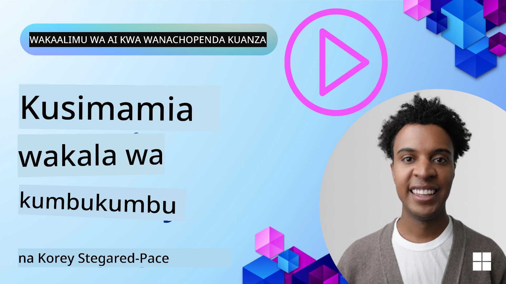

<!--
CO_OP_TRANSLATOR_METADATA:
{
  "original_hash": "a1d90991499ad697c4ad24decaf36968",
  "translation_date": "2025-12-09T12:39:47+00:00",
  "source_file": "13-agent-memory/README.md",
  "language_code": "sw"
}
-->
# Kumbukumbu kwa Mawakala wa AI

Tunapozungumzia faida za kipekee za kuunda Mawakala wa AI, mambo mawili yanajadiliwa sana: uwezo wa kutumia zana kukamilisha majukumu na uwezo wa kuboresha kwa muda. Kumbukumbu ni msingi wa kuunda wakala anayejiboresha mwenyewe ili kutoa uzoefu bora kwa watumiaji wetu.

Katika somo hili, tutachunguza kumbukumbu ni nini kwa Mawakala wa AI na jinsi tunavyoweza kuisimamia na kuitumia kwa manufaa ya programu zetu.

## Utangulizi

Somo hili litashughulikia:

• **Kuelewa Kumbukumbu ya Mawakala wa AI**: Kumbukumbu ni nini na kwa nini ni muhimu kwa mawakala.

• **Kutekeleza na Kuhifadhi Kumbukumbu**: Mbinu za vitendo za kuongeza uwezo wa kumbukumbu kwa Mawakala wa AI, kwa kuzingatia kumbukumbu ya muda mfupi na ya muda mrefu.

• **Kufanya Mawakala wa AI Kujiboresha**: Jinsi kumbukumbu inavyowezesha mawakala kujifunza kutoka kwa mwingiliano wa awali na kuboresha kwa muda.

## Utekelezaji Unaopatikana

Somo hili linajumuisha mafunzo mawili ya kina ya daftari:

• **[13-agent-memory.ipynb](./13-agent-memory.ipynb)**: Inatekeleza kumbukumbu kwa kutumia Mem0 na Azure AI Search na mfumo wa Semantic Kernel.

• **[13-agent-memory-cognee.ipynb](./13-agent-memory-cognee.ipynb)**: Inatekeleza kumbukumbu iliyopangwa kwa kutumia Cognee, ikijenga kiotomatiki grafu ya maarifa inayoungwa mkono na embeddings, kuonyesha grafu, na urejeshaji wa akili.

## Malengo ya Kujifunza

Baada ya kukamilisha somo hili, utajua jinsi ya:

• **Kutofautisha aina mbalimbali za kumbukumbu ya Mawakala wa AI**, ikiwa ni pamoja na kumbukumbu ya kazi, ya muda mfupi, na ya muda mrefu, pamoja na aina maalum kama kumbukumbu ya persona na ya episodic.

• **Kutekeleza na kusimamia kumbukumbu ya muda mfupi na ya muda mrefu kwa Mawakala wa AI** kwa kutumia mfumo wa Semantic Kernel, ukitumia zana kama Mem0, Cognee, kumbukumbu ya Whiteboard, na kuunganisha na Azure AI Search.

• **Kuelewa kanuni za mawakala wa AI wanaojiboresha** na jinsi mifumo thabiti ya usimamizi wa kumbukumbu inavyosaidia kujifunza na kubadilika kwa kuendelea.

## Kuelewa Kumbukumbu ya Mawakala wa AI

Kwa msingi wake, **kumbukumbu kwa Mawakala wa AI inahusu mifumo inayowawezesha kuhifadhi na kukumbuka taarifa**. Taarifa hizi zinaweza kuwa maelezo maalum kuhusu mazungumzo, mapendeleo ya mtumiaji, vitendo vya awali, au hata mifumo iliyojifunza.

Bila kumbukumbu, programu za AI mara nyingi hazina hali, ikimaanisha kila mwingiliano huanza upya. Hii husababisha uzoefu wa mtumiaji unaorudiwa na wa kukatisha tamaa ambapo wakala "anasahau" muktadha au mapendeleo ya awali.

### Kwa Nini Kumbukumbu Ni Muhimu?

Ujuzi wa wakala unahusiana sana na uwezo wake wa kukumbuka na kutumia taarifa za awali. Kumbukumbu inawawezesha mawakala kuwa:

• **Wenye kutafakari**: Kujifunza kutoka kwa vitendo na matokeo ya awali.

• **Wenye kuingiliana**: Kudumisha muktadha katika mazungumzo yanayoendelea.

• **Wenye kutabiri na kujibu**: Kutabiri mahitaji au kujibu ipasavyo kulingana na data ya kihistoria.

• **Wenye kujitegemea**: Kufanya kazi kwa uhuru zaidi kwa kutumia maarifa yaliyohifadhiwa.

Lengo la kutekeleza kumbukumbu ni kufanya mawakala kuwa **wa kuaminika na wenye uwezo zaidi**.

### Aina za Kumbukumbu

#### Kumbukumbu ya Kazi

Fikiria hii kama karatasi ya kuandika ambayo wakala hutumia wakati wa kazi moja au mchakato wa mawazo unaoendelea. Inashikilia taarifa za haraka zinazohitajika kuhesabu hatua inayofuata.

Kwa Mawakala wa AI, kumbukumbu ya kazi mara nyingi huchukua taarifa muhimu zaidi kutoka kwa mazungumzo, hata kama historia ya mazungumzo ni ndefu au imefupishwa. Inazingatia kutoa vipengele muhimu kama mahitaji, mapendekezo, maamuzi, na vitendo.

**Mfano wa Kumbukumbu ya Kazi**

Katika wakala wa uhifadhi wa safari, kumbukumbu ya kazi inaweza kushika ombi la sasa la mtumiaji, kama "Nataka kuhifadhi safari kwenda Paris". Mahitaji haya maalum yanashikiliwa katika muktadha wa wakala ili kuongoza mwingiliano wa sasa.

#### Kumbukumbu ya Muda Mfupi

Aina hii ya kumbukumbu huhifadhi taarifa kwa muda wa mazungumzo au kikao kimoja. Ni muktadha wa mazungumzo ya sasa, unaomruhusu wakala kurejelea mizunguko ya awali ya mazungumzo.

**Mfano wa Kumbukumbu ya Muda Mfupi**

Ikiwa mtumiaji anauliza, "Tiketi ya ndege kwenda Paris itagharimu kiasi gani?" na kisha anauliza, "Na kuhusu malazi huko?", kumbukumbu ya muda mfupi inahakikisha wakala anajua "huko" inahusu "Paris" ndani ya mazungumzo hayo hayo.

#### Kumbukumbu ya Muda Mrefu

Hii ni taarifa inayodumu katika mazungumzo au vikao vingi. Inawawezesha mawakala kukumbuka mapendeleo ya mtumiaji, mwingiliano wa kihistoria, au maarifa ya jumla kwa muda mrefu. Hii ni muhimu kwa ubinafsishaji.

**Mfano wa Kumbukumbu ya Muda Mrefu**

Kumbukumbu ya muda mrefu inaweza kuhifadhi kwamba "Ben anapenda skiing na shughuli za nje, anapenda kahawa na mandhari ya mlima, na anataka kuepuka miteremko ya skiing ya hali ya juu kutokana na jeraha la awali". Taarifa hii, iliyojifunza kutoka kwa mwingiliano wa awali, inaathiri mapendekezo katika vikao vya kupanga safari za baadaye, na kuyafanya kuwa ya kibinafsi sana.

#### Kumbukumbu ya Persona

Aina hii maalum ya kumbukumbu husaidia wakala kuendeleza "tabia" au "persona" thabiti. Inamruhusu wakala kukumbuka maelezo kuhusu yeye mwenyewe au jukumu lake lililokusudiwa, na kufanya mwingiliano kuwa rahisi na wa kuzingatia.

**Mfano wa Kumbukumbu ya Persona**
Ikiwa wakala wa safari ameundwa kuwa "mtaalamu wa kupanga safari za skiing," kumbukumbu ya persona inaweza kuimarisha jukumu hili, na kuathiri majibu yake ili yaendane na sauti na maarifa ya mtaalamu.

#### Kumbukumbu ya Mtiririko/Episodic

Kumbukumbu hii huhifadhi mlolongo wa hatua ambazo wakala huchukua wakati wa kazi ngumu, ikiwa ni pamoja na mafanikio na kushindwa. Ni kama kukumbuka "vipindi" maalum au uzoefu wa awali ili kujifunza kutoka kwao.

**Mfano wa Kumbukumbu ya Episodic**

Ikiwa wakala alijaribu kuhifadhi tiketi maalum ya ndege lakini ilishindikana kutokana na kutokuwepo, kumbukumbu ya episodic inaweza kurekodi kushindwa huku, na kumruhusu wakala kujaribu tiketi mbadala au kumjulisha mtumiaji kuhusu tatizo kwa njia iliyo na taarifa zaidi wakati wa jaribio linalofuata.

#### Kumbukumbu ya Vitu

Hii inahusisha kutoa na kukumbuka vitu maalum (kama watu, maeneo, au vitu) na matukio kutoka kwa mazungumzo. Inamruhusu wakala kujenga uelewa ulioandaliwa wa vipengele muhimu vilivyojadiliwa.

**Mfano wa Kumbukumbu ya Vitu**

Kutoka kwa mazungumzo kuhusu safari ya awali, wakala anaweza kutoa "Paris," "Mnara wa Eiffel," na "chakula cha jioni katika mgahawa wa Le Chat Noir" kama vitu. Katika mwingiliano wa baadaye, wakala anaweza kukumbuka "Le Chat Noir" na kutoa kuhifadhi tena huko.

#### RAG Iliyopangwa (Retrieval Augmented Generation)

Wakati RAG ni mbinu pana, "RAG Iliyopangwa" inasisitizwa kama teknolojia yenye nguvu ya kumbukumbu. Inatoa taarifa nyingi, zilizopangwa kutoka kwa vyanzo mbalimbali (mazungumzo, barua pepe, picha) na kuitumia kuboresha usahihi, kumbukumbu, na kasi ya majibu. Tofauti na RAG ya kawaida inayotegemea tu kufanana kwa semantiki, RAG Iliyopangwa inafanya kazi na muundo wa asili wa taarifa.

**Mfano wa RAG Iliyopangwa**

Badala ya kulinganisha tu maneno muhimu, RAG Iliyopangwa inaweza kuchambua maelezo ya tiketi ya ndege (mahali pa kwenda, tarehe, muda, shirika la ndege) kutoka kwa barua pepe na kuyahifadhi kwa njia iliyopangwa. Hii inaruhusu maswali sahihi kama "Ni tiketi gani ya ndege niliyohifadhi kwenda Paris siku ya Jumanne?"

## Kutekeleza na Kuhifadhi Kumbukumbu

Kutekeleza kumbukumbu kwa Mawakala wa AI kunahusisha mchakato wa kimfumo wa **usimamizi wa kumbukumbu**, ambao unajumuisha kuzalisha, kuhifadhi, kurejesha, kuunganisha, kusasisha, na hata "kusahau" (au kufuta) taarifa. Urejeshaji ni kipengele muhimu sana.

### Zana Maalum za Kumbukumbu

#### Mem0

Njia moja ya kuhifadhi na kusimamia kumbukumbu ya wakala ni kutumia zana maalum kama Mem0. Mem0 inafanya kazi kama safu ya kumbukumbu ya kudumu, ikiruhusu mawakala kukumbuka mwingiliano muhimu, kuhifadhi mapendeleo ya mtumiaji na muktadha wa ukweli, na kujifunza kutoka kwa mafanikio na kushindwa kwa muda. Wazo hapa ni kwamba mawakala wasio na hali wanageuka kuwa wenye hali.

Inafanya kazi kupitia **mchakato wa kumbukumbu wa awamu mbili: uchimbaji na sasisho**. Kwanza, ujumbe unaoongezwa kwenye mfululizo wa wakala hutumwa kwa huduma ya Mem0, ambayo hutumia Large Language Model (LLM) kufupisha historia ya mazungumzo na kutoa kumbukumbu mpya. Baadaye, awamu ya sasisho inayotumia LLM huamua ikiwa kuongeza, kurekebisha, au kufuta kumbukumbu hizi, na kuzihifadhi katika hifadhi ya data mseto inayoweza kujumuisha vector, grafu, na hifadhidata za thamani muhimu. Mfumo huu pia unasaidia aina mbalimbali za kumbukumbu na unaweza kujumuisha kumbukumbu ya grafu kwa kusimamia uhusiano kati ya vitu.

#### Cognee

Njia nyingine yenye nguvu ni kutumia **Cognee**, kumbukumbu ya semantiki ya chanzo wazi kwa Mawakala wa AI inayogeuza data iliyopangwa na isiyopangwa kuwa grafu za maarifa zinazoweza kuulizwa zinazoungwa mkono na embeddings. Cognee hutoa **muundo wa hifadhi mbili** unaochanganya utafutaji wa kufanana kwa vector na uhusiano wa grafu, na kuwezesha mawakala kuelewa si tu taarifa gani ni sawa, bali jinsi dhana zinavyohusiana.

Inafanikiwa katika **urejeshaji mseto** unaochanganya kufanana kwa vector, muundo wa grafu, na uamuzi wa LLM - kutoka kwa utafutaji wa vipande ghafi hadi kujibu maswali yanayojua grafu. Mfumo unadumisha **kumbukumbu hai** inayobadilika na kukua huku ikibaki kuwa grafu moja iliyounganishwa inayoweza kuulizwa, ikisaidia muktadha wa kikao cha muda mfupi na kumbukumbu ya kudumu ya muda mrefu.

Mafunzo ya daftari ya Cognee ([13-agent-memory-cognee.ipynb](./13-agent-memory-cognee.ipynb)) yanaonyesha jinsi ya kujenga safu hii ya kumbukumbu iliyounganishwa, na mifano ya vitendo ya kuingiza vyanzo mbalimbali vya data, kuonyesha grafu ya maarifa, na kuuliza kwa mikakati tofauti ya utafutaji inayolingana na mahitaji maalum ya wakala.

### Kuhifadhi Kumbukumbu na RAG

Zaidi ya zana maalum za kumbukumbu kama Mem0, unaweza kutumia huduma za utafutaji thabiti kama **Azure AI Search kama sehemu ya nyuma ya kuhifadhi na kurejesha kumbukumbu**, hasa kwa RAG Iliyopangwa.

Hii inakuwezesha kuimarisha majibu ya wakala wako kwa data yako mwenyewe, kuhakikisha majibu yanayofaa zaidi na sahihi. Azure AI Search inaweza kutumika kuhifadhi kumbukumbu za safari za mtumiaji, katalogi za bidhaa, au maarifa yoyote maalum ya kikoa.

Azure AI Search inasaidia uwezo kama **RAG Iliyopangwa**, ambayo inafanikiwa katika kutoa na kurejesha taarifa nyingi, zilizopangwa kutoka kwa seti kubwa za data kama historia za mazungumzo, barua pepe, au hata picha. Hii inatoa "usahihi na kumbukumbu ya kibinadamu" ikilinganishwa na mbinu za kawaida za kugawanya maandishi na embeddings.

## Kufanya Mawakala wa AI Kujiboresha

Mfumo wa kawaida wa mawakala wanaojiboresha unahusisha kuanzisha **"wakala wa maarifa"**. Wakala huyu tofauti huchunguza mazungumzo kuu kati ya mtumiaji na wakala mkuu. Jukumu lake ni:

1. **Kutambua taarifa muhimu**: Kuamua ikiwa sehemu yoyote ya mazungumzo inafaa kuhifadhi kama maarifa ya jumla au mapendeleo maalum ya mtumiaji.

2. **Kutoa na kufupisha**: Kuchambua mafunzo muhimu au mapendeleo kutoka kwa mazungumzo.

3. **Kuhifadhi katika hifadhidata ya maarifa**: Kudumisha taarifa iliyotolewa, mara nyingi katika hifadhidata ya vector, ili iweze kurejeshwa baadaye.

4. **Kuongeza maswali ya baadaye**: Wakati mtumiaji anaanzisha swali jipya, wakala wa maarifa hurejesha taarifa muhimu iliyohifadhiwa na kuiongeza kwenye ombi la mtumiaji, ikitoa muktadha muhimu kwa wakala mkuu (sawa na RAG).

### Uboreshaji wa Kumbukumbu

• **Usimamizi wa Muda wa Kujibu**: Ili kuepuka kuchelewesha mwingiliano wa mtumiaji, modeli ya bei nafuu na ya haraka inaweza kutumika awali kuangalia haraka ikiwa taarifa ni muhimu kuhifadhi au kurejesha, na kutumia mchakato wa uchimbaji/urejeshaji wa kina tu inapohitajika.

• **Matengenezo ya Hifadhidata ya Maarifa**: Kwa hifadhidata ya maarifa inayokua, taarifa zinazotumika mara chache zinaweza kuhamishwa kwenye "hifadhi baridi" ili kudhibiti gharama.

## Una Maswali Zaidi Kuhusu Kumbukumbu ya Mawakala?

Jiunge na [Azure AI Foundry Discord](https://aka.ms/ai-agents/discord) ili kukutana na wanafunzi wengine, kuhudhuria masaa ya ofisi, na kupata majibu ya maswali yako kuhusu Mawakala wa AI.

---

<!-- CO-OP TRANSLATOR DISCLAIMER START -->
**Kanusho**:  
Hati hii imetafsiriwa kwa kutumia huduma ya tafsiri ya AI [Co-op Translator](https://github.com/Azure/co-op-translator). Ingawa tunajitahidi kwa usahihi, tafadhali fahamu kuwa tafsiri za kiotomatiki zinaweza kuwa na makosa au kutokuwa sahihi. Hati ya asili katika lugha yake ya kiasili inapaswa kuzingatiwa kama chanzo cha mamlaka. Kwa taarifa muhimu, tafsiri ya kitaalamu ya binadamu inapendekezwa. Hatutawajibika kwa kutoelewana au tafsiri zisizo sahihi zinazotokana na matumizi ya tafsiri hii.
<!-- CO-OP TRANSLATOR DISCLAIMER END -->