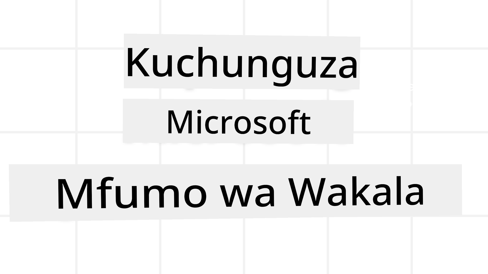
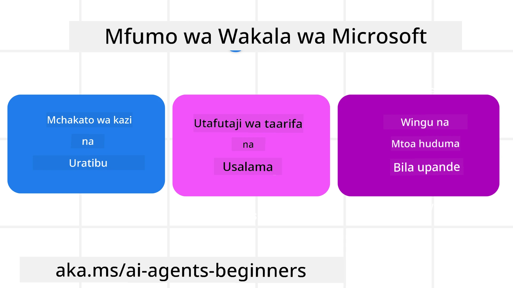
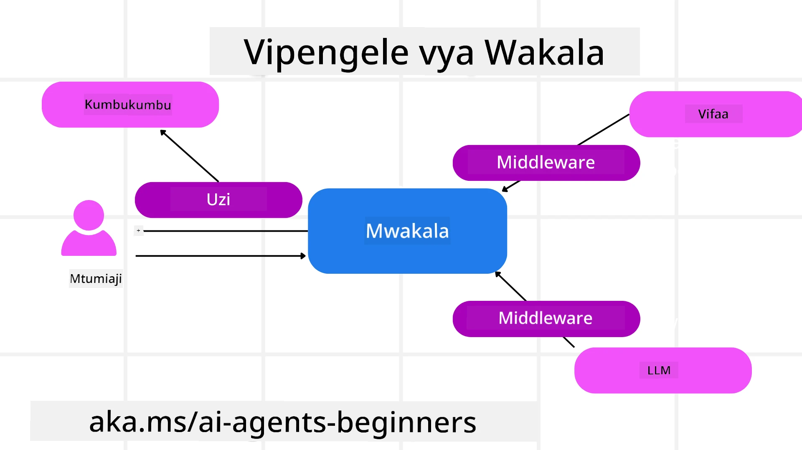

<!--
CO_OP_TRANSLATOR_METADATA:
{
  "original_hash": "19c4dab375acbc733855cc7f2f04edbc",
  "translation_date": "2025-10-02T08:58:09+00:00",
  "source_file": "14-microsoft-agent-framework/README.md",
  "language_code": "sw"
}
-->
# Kuchunguza Mfumo wa Microsoft Agent



### Utangulizi

Somo hili litashughulikia:

- Kuelewa Mfumo wa Microsoft Agent: Vipengele Muhimu na Thamani  
- Kuchunguza Dhana Muhimu za Mfumo wa Microsoft Agent  
- Kulinganisha MAF na Semantic Kernel na AutoGen: Mwongozo wa Uhamiaji  

## Malengo ya Kujifunza

Baada ya kukamilisha somo hili, utaweza:

- Kujenga Mawakala wa AI Tayari kwa Uzalishaji kwa kutumia Mfumo wa Microsoft Agent  
- Kutumia vipengele vya msingi vya Mfumo wa Microsoft Agent kwa Matumizi Yako ya Kiwakala  
- Kuhamisha na kuunganisha mifumo na zana zilizopo za kiwakala  

## Sampuli za Msimbo

Sampuli za msimbo wa [Microsoft Agent Framework (MAF)](https://aka.ms/ai-agents-beginners/agent-framewrok) zinapatikana kwenye hifadhi hii chini ya faili za `xx-python-agent-framework` na `xx-dotnet-agent-framework`.

## Kuelewa Mfumo wa Microsoft Agent



[Microsoft Agent Framework (MAF)](https://aka.ms/ai-agents-beginners/agent-framewrok) umejengwa juu ya uzoefu na mafunzo kutoka kwa Semantic Kernel na AutoGen. Unatoa kubadilika kushughulikia aina mbalimbali za matumizi ya kiwakala yanayoonekana katika mazingira ya uzalishaji na utafiti, ikiwa ni pamoja na:

- **Urushaji wa Wakala wa Mfululizo** katika hali ambapo kazi za hatua kwa hatua zinahitajika.  
- **Urushaji wa Wakati Mmoja** katika hali ambapo mawakala wanahitaji kukamilisha kazi kwa wakati mmoja.  
- **Urushaji wa Gumzo la Kundi** katika hali ambapo mawakala wanaweza kushirikiana pamoja kwenye kazi moja.  
- **Urushaji wa Kukabidhi** katika hali ambapo mawakala wanakabidhi kazi kwa mwingine baada ya kazi ndogo kukamilika.  
- **Urushaji wa Magnetic** katika hali ambapo wakala msimamizi huunda na kurekebisha orodha ya kazi na kushughulikia uratibu wa mawakala wadogo ili kukamilisha kazi.  

Ili kutoa Mawakala wa AI katika Uzalishaji, MAF pia ina vipengele vilivyojumuishwa kwa ajili ya:

- **Ufuatiliaji** kupitia matumizi ya OpenTelemetry ambapo kila hatua ya Wakala wa AI, ikiwa ni pamoja na mwito wa zana, hatua za urushaji, mtiririko wa hoja, na ufuatiliaji wa utendaji kupitia dashibodi za Azure AI Foundry, hufuatiliwa.  
- **Usalama** kwa kuwaweka mawakala kwenye Azure AI Foundry ambayo inajumuisha udhibiti wa usalama kama vile ufikiaji wa msingi wa majukumu, usimamizi wa data binafsi, na usalama wa maudhui uliojengwa ndani.  
- **Ustahimilivu** kwani nyuzi za wakala na mtiririko wa kazi zinaweza kusitishwa, kuendelea, na kupona kutokana na makosa, hivyo kuwezesha michakato ya muda mrefu.  
- **Udhibiti** kwani mtiririko wa kazi unaojumuisha binadamu unasaidiwa ambapo kazi zinawekwa kama zinahitaji idhini ya binadamu.  

Mfumo wa Microsoft Agent pia unalenga kuwa wa kuingiliana kwa:

- **Kutokuwa na utegemezi wa Wingu** - Mawakala wanaweza kuendeshwa kwenye kontena, kwenye mazingira ya ndani, na kwenye wingu tofauti.  
- **Kutokuwa na utegemezi wa Mtoa Huduma** - Mawakala wanaweza kuundwa kupitia SDK unayopendelea ikiwa ni pamoja na Azure OpenAI na OpenAI.  
- **Kuingiza Viwango Vilivyofunguliwa** - Mawakala wanaweza kutumia itifaki kama Agent-to-Agent (A2A) na Model Context Protocol (MCP) kugundua na kutumia mawakala na zana nyingine.  
- **Viongezi na Viunganishi** - Viunganisho vinaweza kufanywa kwa huduma za data na kumbukumbu kama Microsoft Fabric, SharePoint, Pinecone, na Qdrant.  

Hebu tuangalie jinsi vipengele hivi vinavyotumika kwa baadhi ya dhana za msingi za Mfumo wa Microsoft Agent.

## Dhana Muhimu za Mfumo wa Microsoft Agent

### Mawakala



**Kuunda Mawakala**

Uundaji wa wakala hufanyika kwa kufafanua huduma ya utambuzi (Mtoa Huduma wa LLM), seti ya maagizo ambayo Wakala wa AI atafuata, na jina lililowekwa:

```python
agent = AzureOpenAIChatClient(credential=AzureCliCredential()).create_agent( instructions="You are good at recommending trips to customers based on their preferences.", name="TripRecommender" )
```

Hapo juu inatumia `Azure OpenAI` lakini mawakala wanaweza kuundwa kwa kutumia huduma mbalimbali ikiwa ni pamoja na `Azure AI Foundry Agent Service`:

```python
AzureAIAgentClient(async_credential=credential).create_agent( name="HelperAgent", instructions="You are a helpful assistant." ) as agent
```

API za OpenAI `Responses`, `ChatCompletion`

```python
agent = OpenAIResponsesClient().create_agent( name="WeatherBot", instructions="You are a helpful weather assistant.", )
```

```python
agent = OpenAIChatClient().create_agent( name="HelpfulAssistant", instructions="You are a helpful assistant.", )
```

au mawakala wa mbali kwa kutumia itifaki ya A2A:

```python
agent = A2AAgent( name=agent_card.name, description=agent_card.description, agent_card=agent_card, url="https://your-a2a-agent-host" )
```

**Kuendesha Mawakala**

Mawakala huendeshwa kwa kutumia mbinu za `.run` au `.run_stream` kwa majibu yasiyo ya mtiririko au ya mtiririko.

```python
result = await agent.run("What are good places to visit in Amsterdam?")
print(result.text)
```

```python
async for update in agent.run_stream("What are the good places to visit in Amsterdam?"):
    if update.text:
        print(update.text, end="", flush=True)

```

Kila uendeshaji wa wakala pia unaweza kuwa na chaguo za kubinafsisha vigezo kama vile `max_tokens` vinavyotumiwa na wakala, `tools` ambazo wakala anaweza kuita, na hata `model` yenyewe inayotumiwa na wakala.

Hii ni muhimu katika hali ambapo mifano maalum au zana zinahitajika kwa kukamilisha kazi ya mtumiaji.

**Zana**

Zana zinaweza kufafanuliwa wakati wa kufafanua wakala:

```python
def get_attractions( location: Annotated[str, Field(description="The location to get the top tourist attractions for")], ) -> str: """Get the top tourist attractions for a given location.""" return f"The top attractions for {location} are." 


# When creating a ChatAgent directly 

agent = ChatAgent( chat_client=OpenAIChatClient(), instructions="You are a helpful assistant", tools=[get_attractions]

```

na pia wakati wa kuendesha wakala:

```python

result1 = await agent.run( "What's the best place to visit in Seattle?", tools=[get_attractions] # Tool provided for this run only )
```

**Nyuzi za Wakala**

Nyuzi za Wakala hutumika kushughulikia mazungumzo ya zamu nyingi. Nyuzi zinaweza kuundwa kwa:

- Kutumia `get_new_thread()` ambayo inaruhusu nyuzi kuhifadhiwa kwa muda.  
- Kuunda nyuzi moja kwa moja wakati wa kuendesha wakala na nyuzi hizo kudumu tu wakati wa uendeshaji wa sasa.

Ili kuunda nyuzi, msimbo unaonekana kama huu:

```python
# Create a new thread. 
thread = agent.get_new_thread() # Run the agent with the thread. 
response = await agent.run("Hello, I am here to help you book travel. Where would you like to go?", thread=thread)

```

Unaweza kisha kuhifadhi nyuzi kwa matumizi ya baadaye:

```python
# Create a new thread. 
thread = agent.get_new_thread() 

# Run the agent with the thread. 

response = await agent.run("Hello, how are you?", thread=thread) 

# Serialize the thread for storage. 

serialized_thread = await thread.serialize() 

# Deserialize the thread state after loading from storage. 

resumed_thread = await agent.deserialize_thread(serialized_thread)
```

**Middleware ya Wakala**

Mawakala huingiliana na zana na LLMs ili kukamilisha kazi za mtumiaji. Katika hali fulani, tunataka kutekeleza au kufuatilia kati ya mwingiliano huu. Middleware ya wakala inatuwezesha kufanya hivyo kupitia:

*Middleware ya Kazi*

Middleware hii inaruhusu kutekeleza hatua kati ya wakala na kazi/zana ambayo itaitwa. Mfano wa wakati hii inaweza kutumika ni wakati unataka kufanya ufuatiliaji wa mwito wa kazi.

Katika msimbo hapa chini `next` hufafanua ikiwa middleware inayofuata au kazi halisi inapaswa kuitwa.

```python
async def logging_function_middleware(
    context: FunctionInvocationContext,
    next: Callable[[FunctionInvocationContext], Awaitable[None]],
) -> None:
    """Function middleware that logs function execution."""
    # Pre-processing: Log before function execution
    print(f"[Function] Calling {context.function.name}")

    # Continue to next middleware or function execution
    await next(context)

    # Post-processing: Log after function execution
    print(f"[Function] {context.function.name} completed")
```

*Middleware ya Gumzo*

Middleware hii inaruhusu kutekeleza au kufuatilia hatua kati ya wakala na maombi kati ya LLM.

Hii inajumuisha taarifa muhimu kama vile `messages` zinazotumwa kwa huduma ya AI.

```python
async def logging_chat_middleware(
    context: ChatContext,
    next: Callable[[ChatContext], Awaitable[None]],
) -> None:
    """Chat middleware that logs AI interactions."""
    # Pre-processing: Log before AI call
    print(f"[Chat] Sending {len(context.messages)} messages to AI")

    # Continue to next middleware or AI service
    await next(context)

    # Post-processing: Log after AI response
    print("[Chat] AI response received")

```

**Kumbukumbu ya Wakala**

Kama ilivyoshughulikiwa katika somo la `Kumbukumbu ya Kiwakala`, kumbukumbu ni kipengele muhimu cha kuwezesha wakala kufanya kazi katika muktadha tofauti. MAF inatoa aina kadhaa za kumbukumbu:

*Kumbukumbu ya Ndani*

Hii ni kumbukumbu iliyohifadhiwa kwenye nyuzi wakati wa muda wa programu.

```python
# Create a new thread. 
thread = agent.get_new_thread() # Run the agent with the thread. 
response = await agent.run("Hello, I am here to help you book travel. Where would you like to go?", thread=thread)
```

*Ujumbe wa Kudumu*

Kumbukumbu hii hutumika wakati wa kuhifadhi historia ya mazungumzo katika vikao tofauti. Inafafanuliwa kwa kutumia `chat_message_store_factory`:

```python
from agent_framework import ChatMessageStore

# Create a custom message store
def create_message_store():
    return ChatMessageStore()

agent = ChatAgent(
    chat_client=OpenAIChatClient(),
    instructions="You are a Travel assistant.",
    chat_message_store_factory=create_message_store
)

```

*Kumbukumbu ya Nguvu*

Kumbukumbu hii huongezwa kwenye muktadha kabla ya mawakala kuendeshwa. Kumbukumbu hizi zinaweza kuhifadhiwa katika huduma za nje kama mem0:

```python
from agent_framework.mem0 import Mem0Provider

# Using Mem0 for advanced memory capabilities
memory_provider = Mem0Provider(
    api_key="your-mem0-api-key",
    user_id="user_123",
    application_id="my_app"
)

agent = ChatAgent(
    chat_client=OpenAIChatClient(),
    instructions="You are a helpful assistant with memory.",
    context_providers=memory_provider
)

```

**Ufuatiliaji wa Wakala**

Ufuatiliaji ni muhimu kwa kujenga mifumo ya kiwakala inayotegemewa na inayoweza kudumishwa. MAF inaunganishwa na OpenTelemetry ili kutoa ufuatiliaji na vipimo kwa ufuatiliaji bora.

```python
from agent_framework.observability import get_tracer, get_meter

tracer = get_tracer()
meter = get_meter()
with tracer.start_as_current_span("my_custom_span"):
    # do something
    pass
counter = meter.create_counter("my_custom_counter")
counter.add(1, {"key": "value"})
```

### Mtiririko wa Kazi

MAF inatoa mtiririko wa kazi ambao ni hatua zilizofafanuliwa awali za kukamilisha kazi na ni pamoja na mawakala wa AI kama vipengele katika hatua hizo.

Mtiririko wa kazi unajumuisha vipengele tofauti vinavyoruhusu mtiririko bora wa udhibiti. Mtiririko wa kazi pia huwezesha **urushaji wa mawakala wengi** na **kuhifadhi hali ya mtiririko wa kazi**.

Vipengele vya msingi vya mtiririko wa kazi ni:

**Watekelezaji**

Watekelezaji hupokea ujumbe wa pembejeo, kutekeleza kazi zao zilizokabidhiwa, na kisha kutoa ujumbe wa pato. Hii inasogeza mtiririko wa kazi kuelekea kukamilisha kazi kubwa. Watekelezaji wanaweza kuwa wakala wa AI au mantiki maalum.

**Mikondo**

Mikondo hutumika kufafanua mtiririko wa ujumbe katika mtiririko wa kazi. Hii inaweza kuwa:

*Mikondo ya Moja kwa Moja* - Miunganisho rahisi ya moja kwa moja kati ya watekelezaji:

```python
from agent_framework import WorkflowBuilder

builder = WorkflowBuilder()
builder.add_edge(source_executor, target_executor)
builder.set_start_executor(source_executor)
workflow = builder.build()
```

*Mikondo ya Masharti* - Huamilishwa baada ya hali fulani kutimizwa. Kwa mfano, wakati vyumba vya hoteli havipatikani, mtekelezaji anaweza kupendekeza chaguo nyingine.

*Mikondo ya Badilisha-kesi* - Hupeleka ujumbe kwa watekelezaji tofauti kulingana na hali zilizofafanuliwa. Kwa mfano, ikiwa mteja wa safari ana ufikiaji wa kipaumbele, kazi zao zitashughulikiwa kupitia mtiririko mwingine wa kazi.

*Mikondo ya Kusambaza* - Hutuma ujumbe mmoja kwa malengo mengi.

*Mikondo ya Kukusanya* - Hukusanya ujumbe mwingi kutoka kwa watekelezaji tofauti na kutuma kwa lengo moja.

**Matukio**

Ili kutoa ufuatiliaji bora katika mtiririko wa kazi, MAF inatoa matukio yaliyojengwa ndani kwa utekelezaji ikiwa ni pamoja na:

- `WorkflowStartedEvent`  - Utekelezaji wa mtiririko wa kazi unaanza  
- `WorkflowOutputEvent` - Mtiririko wa kazi unatoa pato  
- `WorkflowErrorEvent` - Mtiririko wa kazi unakutana na hitilafu  
- `ExecutorInvokeEvent`  - Mtekelezaji anaanza kuchakata  
- `ExecutorCompleteEvent`  - Mtekelezaji anakamilisha kuchakata  
- `RequestInfoEvent` - Ombi linatolewa  

## Kuhamia Kutoka kwa Mifumo Mingine (Semantic Kernel na AutoGen)

### Tofauti kati ya MAF na Semantic Kernel

**Uundaji Rahisi wa Wakala**

Semantic Kernel inategemea uundaji wa mfano wa Kernel kwa kila wakala. MAF hutumia mbinu rahisi kwa kutumia viendelezi kwa watoa huduma wakuu.

```python
agent = AzureOpenAIChatClient(credential=AzureCliCredential()).create_agent( instructions="You are good at reccomending trips to customers based on their preferences.", name="TripRecommender" )
```

**Uundaji wa Nyuzi za Wakala**

Semantic Kernel inahitaji nyuzi kuundwa kwa mikono. Katika MAF, wakala hupewa moja kwa moja nyuzi.

```python
thread = agent.get_new_thread() # Run the agent with the thread. 
```

**Usajili wa Zana**

Katika Semantic Kernel, zana zinasajiliwa kwa Kernel na Kernel kisha hupitishwa kwa wakala. Katika MAF, zana zinasajiliwa moja kwa moja wakati wa mchakato wa uundaji wa wakala.

```python
agent = ChatAgent( chat_client=OpenAIChatClient(), instructions="You are a helpful assistant", tools=[get_attractions]
```

### Tofauti kati ya MAF na AutoGen

**Timu dhidi ya Mtiririko wa Kazi**

`Timu` ni muundo wa tukio kwa shughuli zinazoendeshwa na matukio na mawakala katika AutoGen. MAF hutumia `Mtiririko wa Kazi` ambao husambaza data kwa watekelezaji kupitia usanifu wa grafu.

**Uundaji wa Zana**

AutoGen hutumia `FunctionTool` kufunika kazi kwa mawakala kuita. MAF hutumia @ai_function ambayo hufanya kazi kwa njia sawa lakini pia hutoa miundo kiotomatiki kwa kila kazi.

**Tabia ya Wakala**

Mawakala ni wa zamu moja kwa chaguo-msingi katika AutoGen isipokuwa `max_tool_iterations` imewekwa juu zaidi. Ndani ya MAF, `ChatAgent` ni wa zamu nyingi kwa chaguo-msingi, ikimaanisha kuwa itaendelea kuita zana hadi kazi ya mtumiaji ikamilike.

## Sampuli za Msimbo

Sampuli za msimbo wa Microsoft Agent Framework zinapatikana kwenye hifadhi hii chini ya faili za `xx-python-agent-framework` na `xx-dotnet-agent-framework`.

## Una Maswali Zaidi Kuhusu Mfumo wa Microsoft Agent?

Jiunge na [Azure AI Foundry Discord](https://aka.ms/ai-agents/discord) ili kukutana na wanafunzi wengine, kuhudhuria saa za ofisi, na kupata majibu ya maswali yako kuhusu Mawakala wa AI.

---

**Kanusho**:  
Hati hii imetafsiriwa kwa kutumia huduma ya tafsiri ya AI [Co-op Translator](https://github.com/Azure/co-op-translator). Ingawa tunajitahidi kwa usahihi, tafadhali fahamu kuwa tafsiri za kiotomatiki zinaweza kuwa na makosa au kutokuwa sahihi. Hati ya asili katika lugha yake ya awali inapaswa kuchukuliwa kama chanzo cha mamlaka. Kwa taarifa muhimu, inashauriwa kutumia huduma ya tafsiri ya kitaalamu ya binadamu. Hatutawajibika kwa maelewano au tafsiri zisizo sahihi zinazotokana na matumizi ya tafsiri hii.