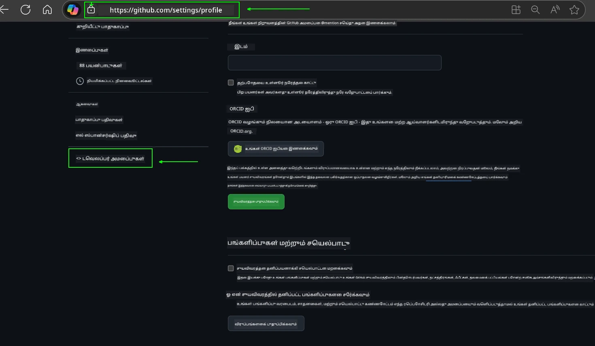
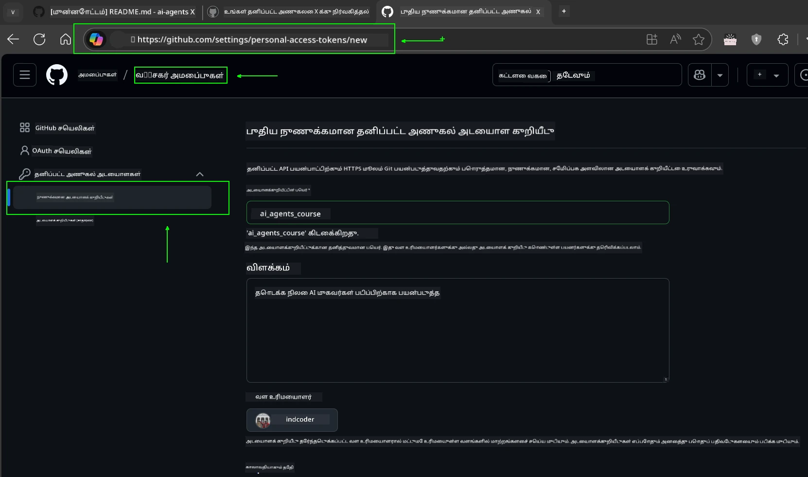
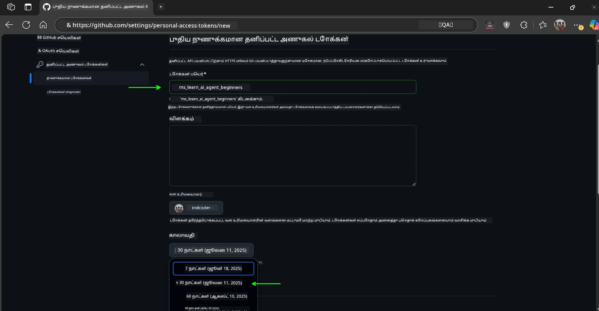
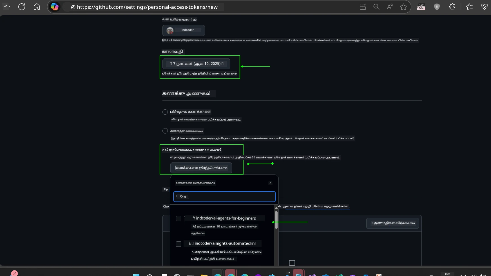
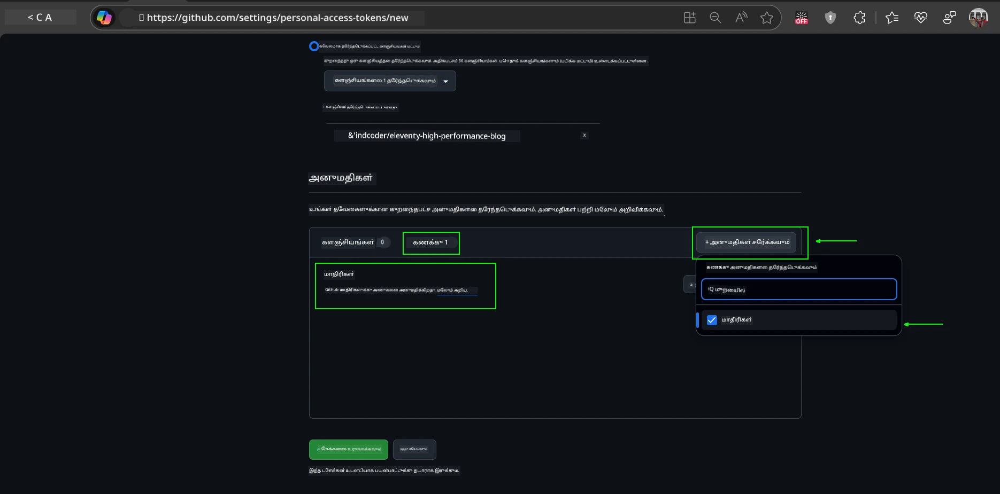
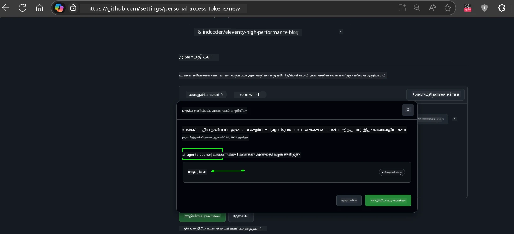
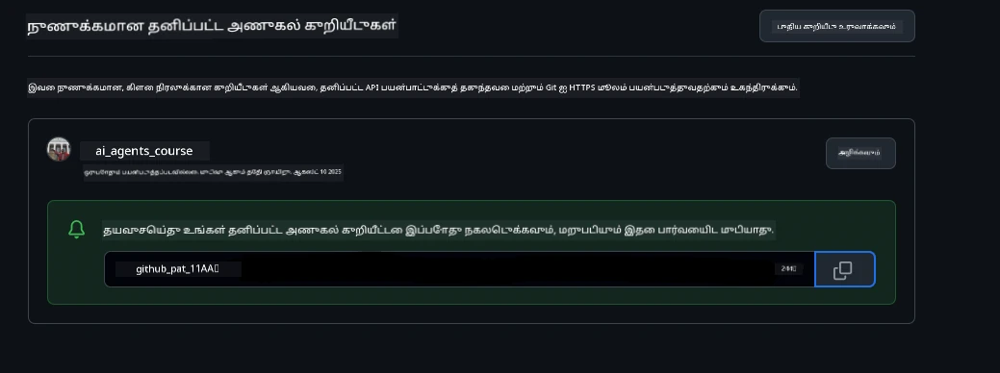
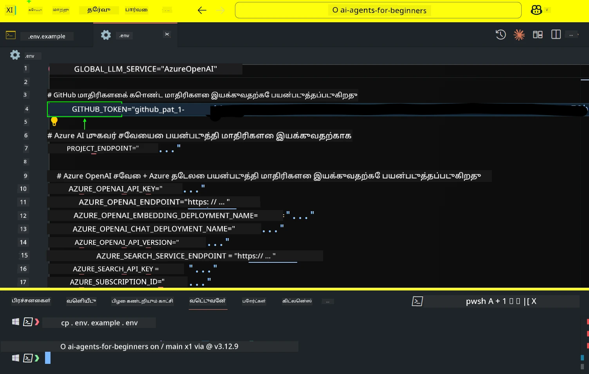
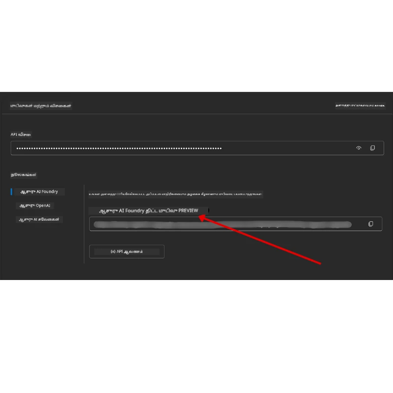

<!--
CO_OP_TRANSLATOR_METADATA:
{
  "original_hash": "63b1a8f6e840df15934935b728e569f0",
  "translation_date": "2025-12-03T15:15:06+00:00",
  "source_file": "00-course-setup/README.md",
  "language_code": "ta"
}
-->
# பாடநெறி அமைப்பு

## அறிமுகம்

இந்த பாடத்தில், இந்த பாடநெறியின் குறியீட்டு மாதிரிகளை எவ்வாறு இயக்குவது என்பதைப் பற்றி கற்றுக்கொள்வீர்கள்.

## மற்ற கற்றலாளர்களுடன் சேர்ந்து உதவி பெறுங்கள்

உங்கள் ரெப்போவை கிளோன் செய்ய ஆரம்பிக்கும்முன், [AI Agents For Beginners Discord சேனலில்](https://aka.ms/ai-agents/discord) சேர்ந்து அமைப்பில் உதவி பெறவும், பாடநெறி தொடர்பான கேள்விகளை கேட்கவும் அல்லது மற்ற கற்றலாளர்களுடன் தொடர்பு கொள்ளவும்.

## இந்த ரெப்போவை கிளோன் செய்யவும் அல்லது ஃபோர்க் செய்யவும்

தொடங்க, தயவுசெய்து GitHub Repository ஐ கிளோன் செய்யவும் அல்லது ஃபோர்க் செய்யவும். இது உங்களுக்கு பாடநெறி பொருட்களின் தனிப்பட்ட பதிப்பை உருவாக்க உதவும், இதனால் நீங்கள் குறியீட்டை இயக்க, சோதிக்க மற்றும் மாற்ற முடியும்!

இதைச் செய்ய, <a href="https://github.com/microsoft/ai-agents-for-beginners/fork" target="_blank">ரெப்போவை ஃபோர்க் செய்ய</a> இணைப்பைக் கிளிக் செய்யவும்.

இப்போது, இந்த பாடநெறியின் ஃபோர்க் செய்யப்பட்ட பதிப்பு உங்கள் கீழ்க்கண்ட இணைப்பில் இருக்கும்:


### சுருக்கமான கிளோன் (பயிற்சி / Codespaces க்கு பரிந்துரைக்கப்படுகிறது)

  >முழு ரெப்போசிட்டரி பெரியதாக இருக்கலாம் (~3 GB) முழு வரலாற்றையும் அனைத்து கோப்புகளையும் பதிவிறக்கம் செய்யும்போது. நீங்கள் பயிற்சியில் மட்டுமே பங்கேற்கிறீர்கள் அல்லது சில பாட கோப்புறைகளை மட்டுமே தேவைப்படுகிறீர்கள் என்றால், சுருக்கமான கிளோன் (அல்லது sparse clone) வரலாற்றின் பெரும்பகுதியை குறைத்து பதிவிறக்கத்தை தவிர்க்க உதவும்.

#### விரைவான சுருக்கமான கிளோன் — குறைந்த வரலாறு, அனைத்து கோப்புகளும்

கீழே உள்ள கட்டளைகளில் `<your-username>` ஐ உங்கள் ஃபோர்க் URL (அல்லது நீங்கள் விரும்பினால் upstream URL) மூலம் மாற்றவும்.

சமீபத்திய commit வரலாற்றை மட்டுமே கிளோன் செய்ய:

```bash|powershell
git clone --depth 1 https://github.com/<your-username>/ai-agents-for-beginners.git
```

குறிப்பிட்ட branch ஐ கிளோன் செய்ய:

```bash|powershell
git clone --depth 1 --branch <branch-name> https://github.com/<your-username>/ai-agents-for-beginners.git
```

#### பகுதி (sparse) கிளோன் — குறைந்த blobs + தேர்ந்தெடுக்கப்பட்ட கோப்புறைகள் மட்டுமே

இது partial clone மற்றும் sparse-checkout ஐப் பயன்படுத்துகிறது (Git 2.25+ தேவை மற்றும் partial clone ஆதரவுடன் நவீன Git பரிந்துரைக்கப்படுகிறது):

```bash|powershell
git clone --depth 1 --filter=blob:none --sparse https://github.com/<your-username>/ai-agents-for-beginners.git
```

ரெப்போ கோப்புறைக்குள் செல்லவும்:

```bash|powershell
cd ai-agents-for-beginners
```

பின்னர் நீங்கள் எந்த கோப்புறைகளை விரும்புகிறீர்கள் என்பதை குறிப்பிடவும் (கீழே உள்ள உதாரணம் இரண்டு கோப்புறைகளை காட்டுகிறது):

```bash|powershell
git sparse-checkout set 00-course-setup 01-intro-to-ai-agents
```

கோப்புகளை கிளோன் செய்து சரிபார்த்த பிறகு, நீங்கள் கோப்புகளை மட்டுமே தேவைப்படுகிறீர்கள் மற்றும் இடத்தை விடுவிக்க விரும்பினால் (git வரலாறு இல்லை), ரெப்போசிட்டரி metadata ஐ நீக்கவும் (💀மீளமுடியாதது — நீங்கள் அனைத்து Git செயல்பாடுகளையும் இழக்குவீர்கள்: commit, pull, push, அல்லது வரலாற்று அணுகல்).

```bash
# zsh/bash
rm -rf .git
```

```powershell
# பவர் ஷெல்
Remove-Item -Recurse -Force .git
```

#### GitHub Codespaces ஐப் பயன்படுத்துதல் (உள்ளூர் பெரிய பதிவிறக்கங்களைத் தவிர்க்க பரிந்துரைக்கப்படுகிறது)

- [GitHub UI](https://github.com/codespaces) வழியாக இந்த ரெப்போவுக்கு புதிய Codespace ஒன்றை உருவாக்கவும்.  

- புதிய Codespace இன் terminal இல், மேலே உள்ள சுருக்கமான/sparse கிளோன் கட்டளைகளில் ஒன்றை இயக்கி, உங்களுக்கு தேவையான பாட கோப்புறைகளை Codespace வேலைப்பகுதிக்குள் கொண்டு வரவும்.
- விருப்பமாக: Codespaces உள்ளே கிளோன் செய்த பிறகு, .git ஐ நீக்கி கூடுதல் இடத்தை மீட்கவும் (மேலே உள்ள நீக்க கட்டளைகளைப் பார்க்கவும்).
- குறிப்பு: நீங்கள் ரெப்போவை நேரடியாக Codespaces இல் திறக்க விரும்பினால் (கூடுதல் கிளோன் இல்லாமல்), Codespaces devcontainer சூழலை உருவாக்கும் மற்றும் உங்களுக்கு தேவையானதை விட அதிகமாக வழங்கலாம். புதிய Codespace உள்ளே சுருக்கமான நகலை கிளோன் செய்வது hard disk பயன்பாட்டை மேலாண்மை செய்ய அதிக கட்டுப்பாட்டை வழங்கும்.

#### குறிப்புகள்

- நீங்கள் திருத்த/commit செய்ய விரும்பினால், உங்கள் ஃபோர்க் URL ஐ clone URL மூலம் மாற்றவும்.
- பின்னர் மேலும் வரலாறு அல்லது கோப்புகள் தேவைப்பட்டால், அவற்றை fetch செய்யலாம் அல்லது sparse-checkout ஐச் சரிசெய்து கூடுதல் கோப்புறைகளைச் சேர்க்கலாம்.

## குறியீட்டை இயக்குதல்

இந்த பாடநெறி, AI Agents உருவாக்குவதற்கான அனுபவத்தைப் பெற Jupyter Notebooks தொடரை வழங்குகிறது.

குறியீட்டு மாதிரிகள் கீழ்க்கண்டவற்றை பயன்படுத்துகின்றன:

**GitHub கணக்கு தேவை - இலவசம்**:

1) Semantic Kernel Agent Framework + GitHub Models Marketplace. (semantic-kernel.ipynb) என லேபிள் செய்யப்பட்டுள்ளது.
2) AutoGen Framework + GitHub Models Marketplace. (autogen.ipynb) என லேபிள் செய்யப்பட்டுள்ளது.

**Azure சந்தா தேவை**:

3) Azure AI Foundry + Azure AI Agent Service. (azureaiagent.ipynb) என லேபிள் செய்யப்பட்டுள்ளது.

இந்த மூன்று வகையான உதாரணங்களையும் முயற்சிக்குமாறு உங்களை ஊக்குவிக்கிறோம், எது உங்களுக்கு சிறந்தது என்பதைப் பார்க்க.

நீங்கள் எந்த விருப்பத்தைத் தேர்ந்தெடுத்தாலும், அதற்கேற்ப கீழே உள்ள அமைப்பு படிகளை நீங்கள் பின்பற்ற வேண்டும்:

## தேவைகள்

- Python 3.12+
  - **NOTE**: Python3.12 நிறுவப்படவில்லை என்றால், அதை நிறுவவும். பின்னர் python3.12 ஐப் பயன்படுத்தி உங்கள் venv ஐ உருவாக்கவும், இதனால் requirements.txt கோப்பிலிருந்து சரியான பதிப்புகள் நிறுவப்படும்.
  
    >உதாரணம்

    Python venv கோப்புறை உருவாக்கவும்:

    ```bash|powershell
    python -m venv venv
    ```

    பின்னர் venv சூழலை செயல்படுத்தவும்:

    ```bash
    # zsh/bash
    source venv/bin/activate
    ```
  
    ```dos
    # Command Prompt for Windows
    venv\Scripts\activate
    ```

- .NET 10+: .NET ஐப் பயன்படுத்தும் மாதிரிக்குறியீடுகளுக்கு, [.NET 10 SDK](https://dotnet.microsoft.com/download/dotnet/10.0) அல்லது அதற்கு மேல் நிறுவவும். பின்னர், நிறுவப்பட்ட .NET SDK பதிப்பைச் சரிபார்க்கவும்:

    ```bash|powershell
    dotnet --list-sdks
    ```

- GitHub கணக்கு - GitHub Models Marketplace ஐ அணுக
- Azure சந்தா - Azure AI Foundry ஐ அணுக
- Azure AI Foundry கணக்கு - Azure AI Agent Service ஐ அணுக

இந்த ரெப்போசிட்டரியின் root இல் `requirements.txt` கோப்பை சேர்த்துள்ளோம், இது குறியீட்டு மாதிரிகளை இயக்க தேவையான அனைத்து Python தொகுதிகளையும் கொண்டுள்ளது.

நீங்கள் அதை ரெப்போசிட்டரியின் root இல் உங்கள் terminal இல் கீழே உள்ள கட்டளையை இயக்குவதன் மூலம் நிறுவலாம்:

```bash|powershell
pip install -r requirements.txt
```

எந்தவொரு மோதல்களையும் பிரச்சினைகளையும் தவிர்க்க Python மெய்நிகர் சூழலை உருவாக்க பரிந்துரைக்கிறோம்.

## VSCode அமைப்பு

VSCode இல் சரியான Python பதிப்பைப் பயன்படுத்துகிறீர்கள் என்பதை உறுதிசெய்யவும்.


## GitHub Models ஐப் பயன்படுத்தும் மாதிரிகளுக்கான அமைப்பு

### படி 1: உங்கள் GitHub Personal Access Token (PAT) ஐ பெறுங்கள்

இந்த பாடநெறி GitHub Models Marketplace ஐ பயன்படுத்துகிறது, இது உங்களுக்கு இலவசமாக பெரிய மொழி மாதிரிகளை (LLMs) அணுக அனுமதிக்கிறது, இதன் மூலம் நீங்கள் AI Agents உருவாக்கலாம்.

GitHub Models ஐப் பயன்படுத்த, நீங்கள் [GitHub Personal Access Token](https://docs.github.com/en/authentication/keeping-your-account-and-data-secure/managing-your-personal-access-tokens) ஐ உருவாக்க வேண்டும்.

இதை உங்கள் GitHub கணக்கில் உள்ள <a href="https://github.com/settings/personal-access-tokens" target="_blank">Personal Access Tokens settings</a> சென்று செய்யலாம்.

உங்கள் டோக்கனை உருவாக்கும்போது [Principle of Least Privilege](https://docs.github.com/en/get-started/learning-to-code/storing-your-secrets-safely) ஐ பின்பற்றவும். இது இந்த பாடநெறியில் உள்ள குறியீட்டு மாதிரிகளை இயக்க டோக்கனுக்கு தேவையான அனுமதிகளை மட்டுமே வழங்க வேண்டும் என்பதைக் குறிக்கிறது.

1. உங்கள் திரையில் இடதுபுறத்தில் **Developer settings** சென்று `Fine-grained tokens` விருப்பத்தைத் தேர்ந்தெடுக்கவும்.

   

   பின்னர் `Generate new token` ஐத் தேர்ந்தெடுக்கவும்.

   

2. உங்கள் டோக்கனின் நோக்கத்தை பிரதிபலிக்கும் விளக்கமான பெயரை உள்ளிடவும், பின்னர் அதை அடையாளம் காண எளிதாக இருக்கும்.

    🔐 டோக்கன் காலவரையறை பரிந்துரை

    பரிந்துரைக்கப்பட்ட காலம்: 30 நாட்கள்  
    மேலும் பாதுகாப்பான நிலைப்பாட்டிற்காக, குறுகிய காலத்தைத் தேர்ந்தெடுக்கலாம்—7 நாட்கள் போன்றது 🛡️  
    இது ஒரு தனிப்பட்ட இலக்கை அமைக்கவும், உங்கள் கற்றல் வேகத்தை அதிகரிக்கவும் ஒரு சிறந்த வழியாகும் 🚀.

    

3. டோக்கனின் அளவை உங்கள் ரெப்போ ஃபோர்க் வரை மட்டுப்படுத்தவும்.

    

4. டோக்கனின் அனுமதிகளை வரையறுக்கவும்: **Permissions** கீழ், **Account** தாவலை கிளிக் செய்து, "+ Add permissions" பொத்தானை கிளிக் செய்யவும். ஒரு dropdown தோன்றும். **Models** ஐத் தேடி, அதற்கான பெட்டியைச் சரிபார்க்கவும்.

    

5. டோக்கனை உருவாக்குவதற்கு முன் தேவையான அனுமதிகளை சரிபார்க்கவும். 

6. டோக்கனை உருவாக்குவதற்கு முன், அதை ஒரு பாதுகாப்பான இடத்தில் (கடவுச்சொல் மேலாளர் vault போன்றது) சேமிக்க தயாராக இருக்கவும், ஏனெனில் நீங்கள் அதை உருவாக்கிய பிறகு மீண்டும் காண முடியாது. 

உங்கள் புதிய டோக்கனை நகலெடுக்கவும். இப்போது இந்த பாடநெறியில் சேர்க்கப்பட்ட `.env` கோப்பில் இதைச் சேர்க்க வேண்டும்.

### படி 2: உங்கள் `.env` கோப்பை உருவாக்கவும்

உங்கள் `.env` கோப்பை உருவாக்க, உங்கள் terminal இல் கீழே உள்ள கட்டளையை இயக்கவும்.

```bash
# zsh/பாஷ்
cp .env.example .env
```

```powershell
# பவர் ஷெல்
Copy-Item .env.example .env
```

இது உதாரண கோப்பை நகலெடுத்து, உங்கள் கோப்புறையில் `.env` ஐ உருவாக்கும், அங்கு சூழல் மாறிகளுக்கான மதிப்புகளை நிரப்ப வேண்டும்.

உங்கள் டோக்கனை நகலெடுத்து, உங்கள் விருப்பமான உரை திருத்தியில் `.env` கோப்பைத் திறந்து, `GITHUB_TOKEN` புலத்தில் உங்கள் டோக்கனை ஒட்டவும்.



இப்போது நீங்கள் இந்த பாடநெறியின் குறியீட்டு மாதிரிகளை இயக்க முடியும்.

## Azure AI Foundry மற்றும் Azure AI Agent Service ஐப் பயன்படுத்தும் மாதிரிகளுக்கான அமைப்பு

### Step 1: Retrieve Your Azure Project Endpoint

Azure AI Foundry இல் hub மற்றும் project ஐ உருவாக்குவதற்கான படிகளை பின்பற்றவும்: [Hub resources overview](https://learn.microsoft.com/azure/ai-foundry/concepts/ai-resources)

உங்கள் project ஐ உருவாக்கிய பிறகு, உங்கள் project க்கான connection string ஐ பெற வேண்டும்.

இது Azure AI Foundry portal இல் உங்கள் project இன் **Overview** பக்கத்திற்குச் சென்று செய்யலாம்.



### Step 2: Create Your `.env` File

உங்கள் `.env` கோப்பை உருவாக்க, உங்கள் terminal இல் கீழே உள்ள கட்டளையை இயக்கவும்.

```bash
# zsh/பாஷ்
cp .env.example .env
```

```powershell
# பவர் ஷெல்
Copy-Item .env.example .env
```

இது உதாரண கோப்பை நகலெடுத்து, உங்கள் கோப்புறையில் `.env` ஐ உருவாக்கும், அங்கு சூழல் மாறிகளுக்கான மதிப்புகளை நிரப்ப வேண்டும்.

உங்கள் டோக்கனை நகலெடுத்து, உங்கள் விருப்பமான உரை திருத்தியில் `.env` கோப்பைத் திறந்து, `PROJECT_ENDPOINT` புலத்தில் உங்கள் டோக்கனை ஒட்டவும்.

### Step 3: Sign in to Azure

பாதுகாப்பு சிறந்த நடைமுறையாக, Microsoft Entra ID உடன் Azure OpenAI க்கு [keyless authentication](https://learn.microsoft.com/azure/developer/ai/keyless-connections?tabs=csharp%2Cazure-cli?WT.mc_id=academic-105485-koreyst) ஐப் பயன்படுத்துவோம்.

அடுத்ததாக, terminal ஐத் திறந்து, `az login --use-device-code` ஐ இயக்கி உங்கள் Azure கணக்கில் உள்நுழைக.

உங்கள் subscription ஐ terminal இல் தேர்ந்தெடுக்கவும்.

## கூடுதல் சூழல் மாறிகள் - Azure Search மற்றும் Azure OpenAI 

Agentic RAG பாடம் - பாடம் 5 - Azure Search மற்றும் Azure OpenAI ஐப் பயன்படுத்தும் மாதிரிகளை உள்ளடக்கியது.

இந்த மாதிரிகளை இயக்க விரும்பினால், உங்கள் `.env` கோப்பில் பின்வரும் சூழல் மாறிகளைச் சேர்க்க வேண்டும்:

### Overview Page (Project)

- `AZURE_SUBSCRIPTION_ID` - உங்கள் project இன் **Overview** பக்கத்தில் **Project details** ஐச் சரிபார்க்கவும்.

- `AZURE_AI_PROJECT_NAME` - உங்கள் project இன் **Overview** பக்கத்தின் மேல் பார்க்கவும்.

- `AZURE_OPENAI_SERVICE` - **Overview** பக்கத்தில் **Included capabilities** தாவலில் **Azure OpenAI Service** ஐப் பார்க்கவும்.

### Management Center

- `AZURE_OPENAI_RESOURCE_GROUP` - **Management Center** இன் **Overview** பக்கத்தில் **Project properties** க்கு சென்று பார்க்கவும்.

- `GLOBAL_LLM_SERVICE` - **Connected resources** கீழ், **Azure AI Services** இணைப்பு பெயரைப் பார்க்கவும். பட்டியலில் இல்லை என்றால், உங்கள் resource group இல் AI Services resource பெயரை **Azure portal** இல் சரிபார்க்கவும்.

### Models + Endpoints Page

- `AZURE_OPENAI_EMBEDDING_DEPLOYMENT_NAME` - உங்கள் embedding மாதிரியைத் தேர்ந்தெடுக்கவும் (எ.கா., `text-embedding-ada-002`) மற்றும் மாதிரி விவரங்களில் இருந்து **Deployment name** ஐ கவனிக்கவும்.

- `AZURE_OPENAI_CHAT_DEPLOYMENT_NAME` - உங்கள் chat மாதிரியைத் தேர்ந்தெடுக்கவும் (எ.கா., `gpt-4o-mini`) மற்றும் மாதிரி விவரங்களில் இருந்து **Deployment name** ஐ கவனிக்கவும்.

### Azure Portal

- `AZURE_OPENAI_ENDPOINT` - **Azure AI services** ஐத் தேடவும், அதை கிளிக் செய்யவும், பின்னர் **Resource Management**, **Keys and Endpoint** க்கு சென்று, "Azure OpenAI endpoints" கீழே "Language APIs" ஐ நகலெடுக்கவும்.

- `AZURE_OPENAI_API_KEY` - அதே திரையில் இருந்து, KEY 1 அல்லது KEY 2 ஐ நகலெடுக்கவும்.

- `AZURE_SEARCH_SERVICE_ENDPOINT` - உங்கள் **Azure AI Search** resource ஐத் தேடவும், அதை கிளிக் செய்யவும், பின்னர் **Overview** ஐப் பார்க்கவும்.

- `AZURE_SEARCH_API_KEY` - பின்னர் **Settings** க்கு சென்று **Keys** க்கு சென்று முதன்மை அல்லது இரண்டாம் நிலை நிர்வாக விசையை நகலெடுக்கவும்.

### External Webpage

- `AZURE_OPENAI_API_VERSION` - [API version lifecycle](https://learn.microsoft.com/azure/ai-services/openai/api-version-deprecation#latest-ga-api-release) பக்கத்தில் **Latest GA API release** கீழ் பாருங்கள்.

### Keyless Authentication அமைக்கவும்

உங்கள் சான்றுகளை hardcode செய்யாமல், Azure OpenAI உடன் keyless connection ஐப் பயன்படுத்துவோம். இதற்காக, `DefaultAzureCredential` ஐ இறக்குமதி செய்து, பின்னர் `DefaultAzureCredential` செயல்பாட்டை அழைத்து சான்றை பெறுவோம்.

```python
# பைதான்
from azure.identity import DefaultAzureCredential, InteractiveBrowserCredential
```

## எங்காவது சிக்கலா?
இந்த அமைப்பை இயக்குவதில் ஏதேனும் சிக்கல்கள் இருந்தால், எங்கள் <a href="https://discord.gg/kzRShWzttr" target="_blank">Azure AI Community Discord</a> அல்லது <a href="https://github.com/microsoft/ai-agents-for-beginners/issues?WT.mc_id=academic-105485-koreyst" target="_blank">ஒரு பிரச்சினையை உருவாக்கவும்</a>.

## அடுத்த பாடம்

இந்த பாடத்திற்கான குறியீட்டை இயக்க தயாராக உள்ளீர்கள். AI முகவர்களின் உலகத்தை மேலும் அறிந்து மகிழுங்கள்!

[AI முகவர்கள் மற்றும் முகவர் பயன்பாட்டு வழக்குகளுக்கான அறிமுகம்](../01-intro-to-ai-agents/README.md)

---

<!-- CO-OP TRANSLATOR DISCLAIMER START -->
**அறிவிப்பு**:  
இந்த ஆவணம் [Co-op Translator](https://github.com/Azure/co-op-translator) என்ற AI மொழிபெயர்ப்பு சேவையை பயன்படுத்தி மொழிபெயர்க்கப்பட்டுள்ளது. நாங்கள் துல்லியத்திற்காக முயற்சிக்கிறோம், ஆனால் தானியங்கி மொழிபெயர்ப்புகளில் பிழைகள் அல்லது தவறுகள் இருக்கக்கூடும் என்பதை கவனத்தில் கொள்ளவும். அதன் சொந்த மொழியில் உள்ள மூல ஆவணம் அதிகாரப்பூர்வ ஆதாரமாக கருதப்பட வேண்டும். முக்கியமான தகவல்களுக்கு, தொழில்முறை மனித மொழிபெயர்ப்பு பரிந்துரைக்கப்படுகிறது. இந்த மொழிபெயர்ப்பைப் பயன்படுத்துவதால் ஏற்படும் எந்த தவறான புரிதல்களுக்கும் அல்லது தவறான விளக்கங்களுக்கும் நாங்கள் பொறுப்பல்ல.
<!-- CO-OP TRANSLATOR DISCLAIMER END -->