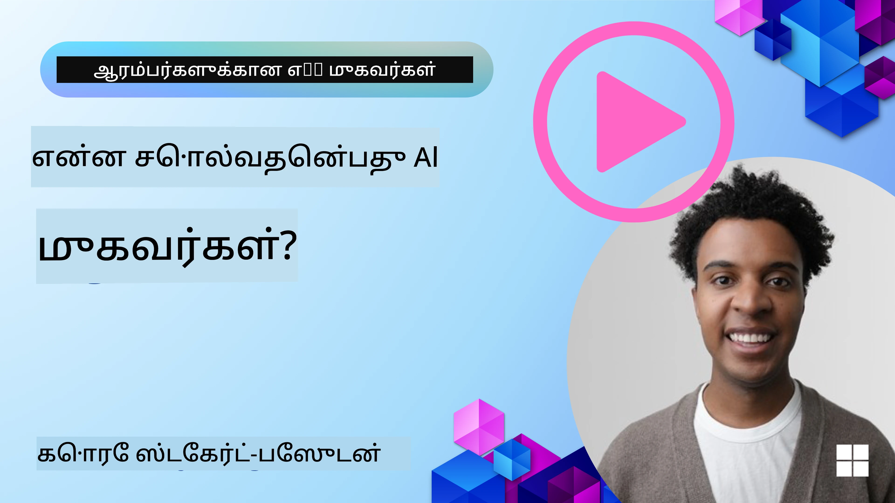
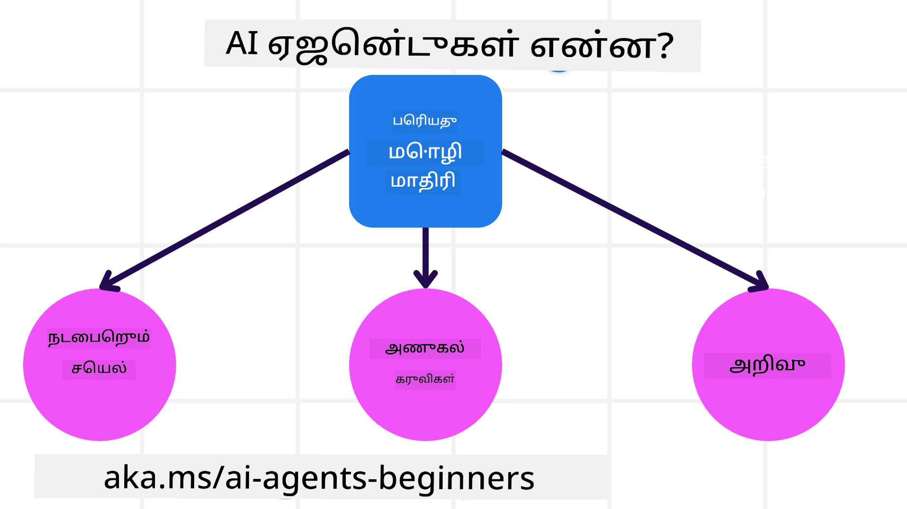
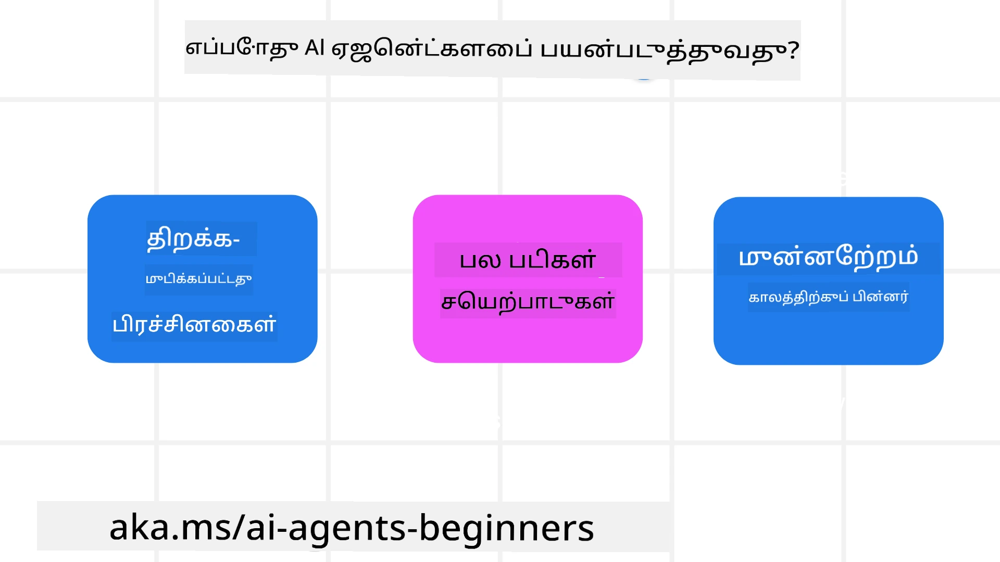

<!--
CO_OP_TRANSLATOR_METADATA:
{
  "original_hash": "cdd28bc00816d2773bb2b5968d782abc",
  "translation_date": "2025-11-11T11:49:50+00:00",
  "source_file": "01-intro-to-ai-agents/README.md",
  "language_code": "ta"
}
-->

> _(மேலே உள்ள படத்தை கிளிக் செய்து இந்த பாடத்தின் வீடியோவைப் பாருங்கள்)_

# AI முகவர்கள் மற்றும் முகவர் பயன்பாடுகளின் அறிமுகம்

"துவக்கத்திற்கான AI முகவர்கள்" பாடத்திற்குச் செல்வதற்கு உங்களை வரவேற்கிறோம்! இந்த பாடம் AI முகவர்களை உருவாக்க அடிப்படை அறிவு மற்றும் நடைமுறை உதாரணங்களை வழங்குகிறது.

<a href="https://discord.gg/kzRShWzttr" target="_blank">Azure AI Discord சமூகத்தில்</a> சேர்ந்து, மற்ற கற்றலாளர்கள் மற்றும் AI முகவர் உருவாக்குநர்களை சந்திக்கவும், இந்த பாடத்துடன் தொடர்புடைய கேள்விகளை கேட்கவும்.

இந்த பாடத்தைத் தொடங்க, AI முகவர்கள் என்ன, அவற்றை நாம் உருவாக்கும் பயன்பாடுகள் மற்றும் வேலைப்பாடுகளில் எப்படி பயன்படுத்தலாம் என்பதைப் பற்றி சிறந்த புரிதலைப் பெறுவோம்.

## அறிமுகம்

இந்த பாடத்தில் உள்ளடக்கப்பட்டவை:

- AI முகவர்கள் என்ன, மற்றும் அவற்றின் வெவ்வேறு வகைகள் என்ன?
- AI முகவர்களுக்கு ஏற்ற பயன்பாடுகள் என்ன, மற்றும் அவை எவ்வாறு நமக்கு உதவ முடியும்?
- முகவர் தீர்வுகளை வடிவமைக்கும் போது அடிப்படை கட்டமைப்புகள் என்ன?

## கற்றல் இலக்குகள்
இந்த பாடத்தை முடித்த பிறகு, நீங்கள்:

- AI முகவர் கருத்துக்களைப் புரிந்து கொள்ளவும், மற்றும் பிற AI தீர்வுகளிலிருந்து அவற்றின் வேறுபாடுகளை அறியவும்.
- AI முகவர்களை மிகச் சிறப்பாகப் பயன்படுத்தவும்.
- பயனாளர்கள் மற்றும் வாடிக்கையாளர்களுக்காக பயனுள்ள முகவர் தீர்வுகளை வடிவமைக்கவும்.

## AI முகவர்களை வரையறுத்தல் மற்றும் முகவர்களின் வகைகள்

### AI முகவர்கள் என்ன?

AI முகவர்கள் **மEquipment** மற்றும் **அறிவை** வழங்குவதன் மூலம் **பெரிய மொழி மாதிரிகள் (LLMs)** **செயல்களைச் செய்ய** உதவுகின்ற **கணினி அமைப்புகள்** ஆகும்.

இந்த வரையறையை சிறிய பகுதிகளாகப் பிரிப்போம்:

- **கணினி அமைப்பு** - AI முகவர்களை ஒரு தனி கூறாக அல்லாமல் பல கூறுகளின் அமைப்பாகக் கருதுவது முக்கியம். AI முகவர்களின் அடிப்படை கூறுகள்:
  - **சுற்றுச்சூழல்** - AI முகவர் செயல்படும் வரையறுக்கப்பட்ட இடம். உதாரணமாக, ஒரு பயண முன்பதிவு AI முகவர் இருந்தால், AI முகவர் பணிகளை முடிக்க பயன்படுத்தும் பயண முன்பதிவு அமைப்பு சுற்றுச்சூழலாக இருக்கும்.
  - **சென்சார்கள்** - சுற்றுச்சூழலில் தகவல்கள் மற்றும் பின்னூட்டங்கள் உள்ளன. AI முகவர்கள் சென்சார்களைப் பயன்படுத்தி சுற்றுச்சூழலின் தற்போதைய நிலை பற்றிய தகவல்களை சேகரித்து, புரிந்து கொள்கின்றன. பயண முன்பதிவு முகவர் உதாரணத்தில், ஹோட்டல் கிடைப்பது அல்லது விமான விலைகள் போன்ற தகவல்களை பயண முன்பதிவு அமைப்பு வழங்கும்.
  - **அக்டுவேட்டர்கள்** - AI முகவர் சுற்றுச்சூழலின் தற்போதைய நிலையைப் பெறும் போது, தற்போதைய பணிக்கான நடவடிக்கையைத் தீர்மானிக்கிறது. பயண முன்பதிவு முகவருக்கானது, பயனாளருக்காக கிடைக்கும் அறையை முன்பதிவு செய்வது ஆகும்.

**பெரிய மொழி மாதிரிகள்** - LLMs உருவாக்கத்திற்கு முன் முகவர்கள் என்ற கருத்து இருந்தது. LLMs உடன் AI முகவர்களை உருவாக்குவதன் நன்மை, மனித மொழி மற்றும் தரவுகளைப் புரிந்து கொள்ளும் திறன். இந்த திறன் LLMs சுற்றுச்சூழல் தகவல்களைப் புரிந்து கொண்டு, சுற்றுச்சூழலை மாற்ற ஒரு திட்டத்தை வரையறுக்க உதவுகிறது.

**செயல்களைச் செய்ய** - AI முகவர் அமைப்புகளுக்கு வெளியே, LLMs பயனாளரின் கேள்விக்கு பதிலளிக்க அல்லது தகவலை உருவாக்க மட்டுமே செயல்பட முடியும். AI முகவர் அமைப்புகளுக்குள், LLMs பயனாளரின் கோரிக்கையைப் புரிந்து கொண்டு, சுற்றுச்சூழலில் உள்ள கருவிகளைப் பயன்படுத்தி பணிகளை முடிக்க முடியும்.

**கருவிகளுக்கான அணுகல்** - LLMs எந்த கருவிகளை அணுக முடியும் என்பது 1) அது செயல்படும் சுற்றுச்சூழலால் மற்றும் 2) AI முகவரின் உருவாக்குநரால் வரையறுக்கப்படுகிறது. எங்கள் பயண முகவர் உதாரணத்தில், முகவரின் கருவிகள் முன்பதிவு அமைப்பில் கிடைக்கும் செயல்பாடுகளால் வரையறுக்கப்படும், அல்லது உருவாக்குநர் முகவரின் கருவி அணுகலை விமானங்களுக்கு மட்டுமே வரையறுக்க முடியும்.

**மறதி+அறிவு** - மறதி உரையாடலின் சூழலில் குறுகிய காலமாக இருக்கலாம். நீண்ட காலத்தில், சுற்றுச்சூழல் வழங்கும் தகவலுக்கு வெளியே, AI முகவர்கள் மற்ற அமைப்புகள், சேவைகள், கருவிகள் மற்றும் பிற முகவர்களிடமிருந்து அறிவை மீட்டெடுக்க முடியும். பயண முகவர் உதாரணத்தில், இந்த அறிவு பயனாளரின் பயண விருப்பங்களை வாடிக்கையாளர் தரவுத்தொகுப்பில் இருந்து பெறுவது ஆகும்.

### முகவர்களின் வெவ்வேறு வகைகள்

இப்போது AI முகவர்களின் பொதுவான வரையறையைப் பெற்றுள்ளோம், பயண முன்பதிவு AI முகவருக்கு பொருந்தும் சில குறிப்பிட்ட முகவர் வகைகளைப் பார்ப்போம்.

| **முகவர் வகை**                | **விளக்கம்**                                                                                                                       | **உதாரணம்**                                                                                                                                                                                                                   |
| ----------------------------- | ------------------------------------------------------------------------------------------------------------------------------------- | ----------------------------------------------------------------------------------------------------------------------------------------------------------------------------------------------------------------------------- |
| **எளிய ரெஃப்ளெக்ஸ் முகவர்கள்**      | முன்கூட்டியே வரையறுக்கப்பட்ட விதிகளின் அடிப்படையில் உடனடி நடவடிக்கைகளைச் செய்கின்றன.                                                                                  | பயண முகவர் மின்னஞ்சலின் சூழலைப் புரிந்து கொண்டு பயண புகார்களை வாடிக்கையாளர் சேவைக்கு அனுப்புகிறது.                                                                                                                          |
| **மாடல் அடிப்படையிலான ரெஃப்ளெக்ஸ் முகவர்கள்** | உலகின் மாடலின் அடிப்படையில் மற்றும் அந்த மாடலின் மாற்றங்களின் அடிப்படையில் நடவடிக்கைகளைச் செய்கின்றன.                                                              | பயண முகவர் வரலாற்று விலை தரவுகளின் அடிப்படையில் முக்கிய விலை மாற்றங்களுடன் வழிகளை முன்னுரிமை அளிக்கிறது.                                                                                                             |
| **கோல் அடிப்படையிலான முகவர்கள்**         | குறிப்பிட்ட இலக்குகளை அடைய திட்டங்களை உருவாக்கி, இலக்கைத் தீர்மானித்து அதை அடைய நடவடிக்கைகளை மேற்கொள்கின்றன.                                  | பயண முகவர் பயண ஏற்பாடுகளை (கார், பொது போக்குவரத்து, விமானங்கள்) தற்போதைய இடத்திலிருந்து இலக்கத்திற்குச் செல்ல தீர்மானித்து ஒரு பயணத்தை முன்பதிவு செய்கிறது.                                                                                |
| **யூட்டிலிட்டி அடிப்படையிலான முகவர்கள்**      | விருப்பங்களைப் பரிசீலித்து, இலக்குகளை அடைய எவ்வாறு முடியும் என்பதை எண்ணியல் முறையில் தீர்மானிக்கின்றன.                                               | பயண முகவர் பயணத்தை முன்பதிவு செய்யும் போது வசதியை எதிர்மறையாகவும், செலவுகளை எதிர்மறையாகவும் எடுக்கும் மூலம் யூட்டிலிட்டியை அதிகரிக்கிறது.                                                                                                                                          |
| **கற்றல் முகவர்கள்**           | பின்னூட்டத்திற்கு பதிலளித்து, நடவடிக்கைகளை சரிசெய்து, காலப்போக்கில் மேம்படுகின்றன.                                                        | பயண முகவர் பயணத்திற்குப் பிறகு கருத்துக்கணிப்பு மூலம் வாடிக்கையாளர் கருத்துகளைப் பயன்படுத்தி எதிர்கால முன்பதிவுகளில் மாற்றங்களைச் செய்கிறது.                                                                                                               |
| **அடுக்கு முகவர்கள்**       | பல முகவர்களை அடுக்குமுறை அமைப்பில் கொண்டிருக்கும், மேல்நிலை முகவர்கள் பணிகளை துணை பணிகளாகப் பிரித்து கீழ்நிலை முகவர்கள் முடிக்க அனுமதிக்கின்றன. | பயண முகவர் ஒரு பயணத்தை ரத்து செய்யும் போது, ​​பணியை துணை பணிகளாகப் பிரிக்கிறது (உதாரணமாக, குறிப்பிட்ட முன்பதிவுகளை ரத்து செய்வது) மற்றும் கீழ்நிலை முகவர்கள் அவற்றை முடிக்க, மேல்நிலை முகவருக்கு அறிக்கை அளிக்க அனுமதிக்கிறது.                                     |
| **பல முகவர் அமைப்புகள் (MAS)** | முகவர்கள் தனித்துவமாக பணிகளை முடிக்கின்றன, either ஒத்துழைப்பாக அல்லது போட்டியாளராக.                                                           | ஒத்துழைப்பு: பல முகவர்கள் குறிப்பிட்ட பயண சேவைகளை முன்பதிவு செய்கின்றன, உதாரணமாக ஹோட்டல்கள், விமானங்கள் மற்றும் பொழுதுபோக்கு. போட்டி: பல முகவர்கள் ஒரு பகிரப்பட்ட ஹோட்டல் முன்பதிவு காலண்டரை நிர்வகித்து, வாடிக்கையாளர்களை ஹோட்டலில் முன்பதிவு செய்ய போட்டியிடுகின்றன. |

## AI முகவர்களை எப்போது பயன்படுத்த வேண்டும்

முந்தைய பகுதியில், பயண முகவர் பயன்பாட்டை எடுத்துக்கொண்டு, பயண முன்பதிவின் வெவ்வேறு சூழல்களில் வெவ்வேறு வகையான முகவர்களை எவ்வாறு பயன்படுத்தலாம் என்பதை விளக்கினோம். இந்த பயன்பாட்டை முழு பாடத்திலும் தொடர்வோம்.

AI முகவர்கள் சிறந்த முறையில் பயன்படுத்தப்படும் பயன்பாடுகளின் வகைகளைப் பார்ப்போம்:

- **திறந்த முடிவில்லாத பிரச்சினைகள்** - LLM ஒரு பணியை முடிக்க தேவையான படிகளைத் தீர்மானிக்க அனுமதிக்கிறது, ஏனெனில் அதை ஒரு வேலைப்பாடில் முன்கூட்டியே குறியிட முடியாது.
- **பல படி செயல்முறைகள்** - AI முகவர் கருவிகள் அல்லது தகவல்களை பல முறை திரும்பத் திரும்ப பயன்படுத்த வேண்டிய சிக்கலான பணிகளுக்கு ஏற்றது.  
- **காலப்போக்கில் மேம்பாடு** - முகவர் தனது சுற்றுச்சூழல் அல்லது பயனாளர்களிடமிருந்து பின்னூட்டத்தைப் பெறுவதன் மூலம் காலப்போக்கில் மேம்பட முடியும், மேலும் சிறந்த பயன்பாட்டை வழங்க முடியும்.

AI முகவர்களைப் பயன்படுத்தும் மேலும் பல கருத்துக்களை "நம்பகமான AI முகவர்களை உருவாக்குதல்" பாடத்தில் கவருகிறோம்.

## முகவர் தீர்வுகளின் அடிப்படைகள்

### முகவர் மேம்பாடு

AI முகவர் அமைப்பை வடிவமைக்கும் முதல் படி கருவிகள், நடவடிக்கைகள் மற்றும் நடத்தைகளை வரையறுப்பது ஆகும். இந்த பாடத்தில், **Azure AI Agent Service** ஐப் பயன்படுத்தி நமது முகவர்களை வரையறுப்பதில் கவனம் செலுத்துகிறோம். இது போன்ற அம்சங்களை வழங்குகிறது:

- OpenAI, Mistral, மற்றும் Llama போன்ற திறந்த மாதிரிகளைத் தேர்வு செய்தல்
- Tripadvisor போன்ற வழங்குநர்களின் மூலம் உரிமம் பெற்ற தரவுகளைப் பயன்படுத்துதல்
- OpenAPI 3.0 கருவிகளைப் பயன்படுத்துதல்

### முகவர் முறை

LLMs உடன் தொடர்பு prompts மூலம் நடைபெறுகிறது. AI முகவர்களின் அரை தானியங்க தன்மையைப் பொருத்து, சுற்றுச்சூழலில் மாற்றம் ஏற்பட்ட பிறகு LLM ஐ கையால் மீண்டும் prompt செய்ய வேண்டிய அவசியம் இல்லை. **Agentic Patterns** ஐப் பயன்படுத்தி, LLM ஐ பல படிகளில் prompt செய்யும் ஒரு அளவளாவிய முறையை உருவாக்குகிறோம்.

இந்த பாடம் தற்போதைய பிரபலமான Agentic Patterns களைப் பிரிக்கிறது.

### முகவர் கட்டமைப்புகள்

Agentic Frameworks மூலம் உருவாக்குநர்கள் Agentic Patterns ஐ கோடில் செயல்படுத்த முடியும். இந்த கட்டமைப்புகள் டெம்ப்ளேட்கள், பிளகின்கள் மற்றும் கருவிகளை வழங்குகின்றன, மேலும் AI முகவர் ஒத்துழைப்பை மேம்படுத்துகின்றன. இந்த நன்மைகள் AI முகவர் அமைப்புகளின் கண்காணிப்பு மற்றும் பிழைதிருத்தத்திற்கான திறன்களை வழங்குகின்றன.

இந்த பாடத்தில், ஆராய்ச்சி சார்ந்த AutoGen Framework மற்றும் Semantic Kernel இன் தயாரிப்பு-தயார் Agent Framework ஐ ஆராய்வோம்.

## மாதிரி கோடுகள்

- Python: [Agent Framework](./code_samples/01-python-agent-framework.ipynb)
- .NET: [Agent Framework](./code_samples/01-dotnet-agent-framework.md)

## AI முகவர்களைப் பற்றிய மேலும் கேள்விகள் உள்ளதா?

மற்ற கற்றலாளர்களைச் சந்திக்க, அலுவலக நேரங்களில் பங்கேற்க மற்றும் உங்கள் AI முகவர் தொடர்பான கேள்விகளுக்கு பதிலளிக்க [Azure AI Foundry Discord](https://aka.ms/ai-agents/discord) இல் சேரவும்.

## முந்தைய பாடம்

[பாடநெறி அமைப்பு](../00-course-setup/README.md)

## அடுத்த பாடம்

[Agentic Frameworks ஆராய்தல்](../02-explore-agentic-frameworks/README.md)

---

<!-- CO-OP TRANSLATOR DISCLAIMER START -->
**குறிப்பு**:  
இந்த ஆவணம் AI மொழிபெயர்ப்பு சேவை [Co-op Translator](https://github.com/Azure/co-op-translator) பயன்படுத்தி மொழிபெயர்க்கப்பட்டுள்ளது. நாங்கள் துல்லியத்திற்காக முயற்சிக்கிறோம், ஆனால் தானியங்கி மொழிபெயர்ப்புகளில் பிழைகள் அல்லது தவறுகள் இருக்கக்கூடும் என்பதை கவனத்தில் கொள்ளவும். அதன் தாய்மொழியில் உள்ள மூல ஆவணம் அதிகாரப்பூர்வ ஆதாரமாக கருதப்பட வேண்டும். முக்கியமான தகவல்களுக்கு, தொழில்முறை மனித மொழிபெயர்ப்பு பரிந்துரைக்கப்படுகிறது. இந்த மொழிபெயர்ப்பைப் பயன்படுத்துவதால் ஏற்படும் எந்த தவறான புரிதல்கள் அல்லது தவறான விளக்கங்களுக்கு நாங்கள் பொறுப்பல்ல.
<!-- CO-OP TRANSLATOR DISCLAIMER END -->