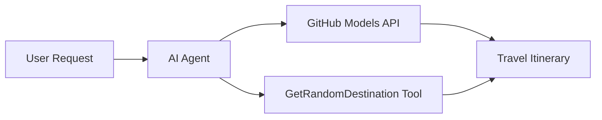

<!--
CO_OP_TRANSLATOR_METADATA:
{
  "original_hash": "5f351412e934f0833c8c821a0a60efaf",
  "translation_date": "2025-11-13T14:49:55+00:00",
  "source_file": "01-intro-to-ai-agents/code_samples/01-dotnet-agent-framework.md",
  "language_code": "ta"
}
-->
# 🌍 Microsoft Agent Framework (.NET) மூலம் AI பயண முகவர்

## 📋 சூழல் கண்ணோட்டம்

இந்த உதாரணம் Microsoft Agent Framework for .NET பயன்படுத்தி புத்திசாலியான பயண திட்டமிடும் முகவரை உருவாக்குவது எப்படி என்பதை விளக்குகிறது. இந்த முகவர் உலகம் முழுவதும் சீரற்ற இடங்களில் தனிப்பயன் நாள் பயண திட்டங்களை தானாக உருவாக்க முடியும்.

### முக்கிய திறன்கள்:

- 🎲 **சீரற்ற இடத் தேர்வு**: விடுமுறை இடங்களை தேர்வு செய்ய தனிப்பயன் கருவி பயன்படுத்துகிறது
- 🗺️ **புத்திசாலியான பயண திட்டமிடல்**: விரிவான நாள்-குறிப்பிட்ட திட்டங்களை உருவாக்குகிறது
- 🔄 **உடனடி ஸ்ட்ரீமிங்**: உடனடி மற்றும் ஸ்ட்ரீமிங் பதில்களை ஆதரிக்கிறது
- 🛠️ **தனிப்பயன் கருவி ஒருங்கிணைப்பு**: முகவரின் திறன்களை விரிவாக்குவது எப்படி என்பதை விளக்குகிறது

## 🔧 தொழில்நுட்ப கட்டமைப்பு

### முக்கிய தொழில்நுட்பங்கள்

- **Microsoft Agent Framework**: AI முகவர் மேம்பாட்டுக்கான .NET இன் சமீபத்திய செயல்பாடு
- **GitHub Models Integration**: GitHub இன் AI மாடல் தீர்மான சேவையை பயன்படுத்துகிறது
- **OpenAI API இணக்கத்தன்மை**: தனிப்பயன் முடிவுகளுடன் OpenAI கிளையன்ட் நூலகங்களை பயன்படுத்துகிறது
- **பாதுகாப்பான கட்டமைப்பு**: சூழல் அடிப்படையிலான API விசை மேலாண்மை

### முக்கிய கூறுகள்

1. **AIAgent**: உரையாடல் ஓட்டத்தை கையாளும் முக்கிய முகவர் ஒருங்கிணைப்பாளர்
2. **தனிப்பயன் கருவிகள்**: `GetRandomDestination()` செயல்பாடு முகவருக்கு கிடைக்கிறது
3. **Chat Client**: GitHub Models ஆதரவு கொண்ட உரையாடல் இடைமுகம்
4. **ஸ்ட்ரீமிங் ஆதரவு**: நேரடி பதில் உருவாக்கும் திறன்கள்

### ஒருங்கிணைப்பு முறை



## 🚀 தொடங்குவது எப்படி

### முன் தேவைகள்

- [.NET 10 SDK](https://dotnet.microsoft.com/download/dotnet/10.0) அல்லது அதற்கு மேல்
- [GitHub Models API அணுகல் குறியீடு](https://docs.github.com/github-models/github-models-at-scale/using-your-own-api-keys-in-github-models)

### தேவையான சூழல் மாறிகள்

```bash
# zsh/bash
export GH_TOKEN=<your_github_token>
export GH_ENDPOINT=https://models.github.ai/inference
export GH_MODEL_ID=openai/gpt-5-mini
```

```powershell
# PowerShell
$env:GH_TOKEN = "<your_github_token>"
$env:GH_ENDPOINT = "https://models.github.ai/inference"
$env:GH_MODEL_ID = "openai/gpt-5-mini"
```

### மாதிரி குறியீடு

குறியீடு உதாரணத்தை இயக்க,

```bash
# zsh/bash
chmod +x ./01-dotnet-agent-framework.cs
./01-dotnet-agent-framework.cs
```

அல்லது dotnet CLI பயன்படுத்தி:

```bash
dotnet run ./01-dotnet-agent-framework.cs
```

முழு குறியீட்டிற்கான [`01-dotnet-agent-framework.cs`](../../../../01-intro-to-ai-agents/code_samples/01-dotnet-agent-framework.cs) ஐ பார்க்கவும்.

```csharp
#!/usr/bin/dotnet run

#:package Microsoft.Extensions.AI@9.*
#:package Microsoft.Agents.AI.OpenAI@1.*-*

using System.ClientModel;
using System.ComponentModel;

using Microsoft.Agents.AI;
using Microsoft.Extensions.AI;

using OpenAI;

// Tool Function: Random Destination Generator
// This static method will be available to the agent as a callable tool
// The [Description] attribute helps the AI understand when to use this function
// This demonstrates how to create custom tools for AI agents
[Description("Provides a random vacation destination.")]
static string GetRandomDestination()
{
    // List of popular vacation destinations around the world
    // The agent will randomly select from these options
    var destinations = new List<string>
    {
        "Paris, France",
        "Tokyo, Japan",
        "New York City, USA",
        "Sydney, Australia",
        "Rome, Italy",
        "Barcelona, Spain",
        "Cape Town, South Africa",
        "Rio de Janeiro, Brazil",
        "Bangkok, Thailand",
        "Vancouver, Canada"
    };

    // Generate random index and return selected destination
    // Uses System.Random for simple random selection
    var random = new Random();
    int index = random.Next(destinations.Count);
    return destinations[index];
}

// Extract configuration from environment variables
// Retrieve the GitHub Models API endpoint, defaults to https://models.github.ai/inference if not specified
// Retrieve the model ID, defaults to openai/gpt-5-mini if not specified
// Retrieve the GitHub token for authentication, throws exception if not specified
var github_endpoint = Environment.GetEnvironmentVariable("GH_ENDPOINT") ?? "https://models.github.ai/inference";
var github_model_id = Environment.GetEnvironmentVariable("GH_MODEL_ID") ?? "openai/gpt-5-mini";
var github_token = Environment.GetEnvironmentVariable("GH_TOKEN") ?? throw new InvalidOperationException("GH_TOKEN is not set.");

// Configure OpenAI Client Options
// Create configuration options to point to GitHub Models endpoint
// This redirects OpenAI client calls to GitHub's model inference service
var openAIOptions = new OpenAIClientOptions()
{
    Endpoint = new Uri(github_endpoint)
};

// Initialize OpenAI Client with GitHub Models Configuration
// Create OpenAI client using GitHub token for authentication
// Configure it to use GitHub Models endpoint instead of OpenAI directly
var openAIClient = new OpenAIClient(new ApiKeyCredential(github_token), openAIOptions);

// Create AI Agent with Travel Planning Capabilities
// Initialize OpenAI client, get chat client for specified model, and create AI agent
// Configure agent with travel planning instructions and random destination tool
// The agent can now plan trips using the GetRandomDestination function
AIAgent agent = openAIClient
    .GetChatClient(github_model_id)
    .CreateAIAgent(
        instructions: "You are a helpful AI Agent that can help plan vacations for customers at random destinations",
        tools: [AIFunctionFactory.Create(GetRandomDestination)]
    );

// Execute Agent: Plan a Day Trip
// Run the agent with streaming enabled for real-time response display
// Shows the agent's thinking and response as it generates the content
// Provides better user experience with immediate feedback
await foreach (var update in agent.RunStreamingAsync("Plan me a day trip"))
{
    await Task.Delay(10);
    Console.Write(update);
}
```

## 🎓 முக்கிய கற்றுக்கொள்கைகள்

1. **முகவர் கட்டமைப்பு**: Microsoft Agent Framework .NET இல் AI முகவர்களை உருவாக்க சுத்தமான, வகை-பாதுகாப்பான அணுகுமுறையை வழங்குகிறது
2. **கருவி ஒருங்கிணைப்பு**: `[Description]` பண்புகள் கொண்ட செயல்பாடுகள் முகவருக்கு கிடைக்கும் கருவிகளாக மாறுகின்றன
3. **கட்டமைப்பு மேலாண்மை**: சூழல் மாறிகள் மற்றும் பாதுகாப்பான சான்றிதழ் கையாளுதல் .NET சிறந்த நடைமுறைகளை பின்பற்றுகிறது
4. **OpenAI இணக்கத்தன்மை**: GitHub Models ஒருங்கிணைப்பு OpenAI-இன் இணக்கமான APIகளின் மூலம் சீராக செயல்படுகிறது

## 🔗 கூடுதல் வளங்கள்

- [Microsoft Agent Framework ஆவணங்கள்](https://learn.microsoft.com/agent-framework)
- [GitHub Models சந்தை](https://github.com/marketplace?type=models)
- [Microsoft.Extensions.AI](https://learn.microsoft.com/dotnet/ai/microsoft-extensions-ai)
- [.NET ஒற்றை கோப்பு பயன்பாடுகள்](https://devblogs.microsoft.com/dotnet/announcing-dotnet-run-app)

---

<!-- CO-OP TRANSLATOR DISCLAIMER START -->
**குறிப்பு**:  
இந்த ஆவணம் AI மொழிபெயர்ப்பு சேவை [Co-op Translator](https://github.com/Azure/co-op-translator) பயன்படுத்தி மொழிபெயர்க்கப்பட்டுள்ளது. நாங்கள் துல்லியத்திற்காக முயற்சிக்கிறோம், ஆனால் தானியங்கி மொழிபெயர்ப்புகளில் பிழைகள் அல்லது தவறுகள் இருக்கக்கூடும் என்பதை கவனத்தில் கொள்ளவும். அதன் தாய்மொழியில் உள்ள மூல ஆவணம் அதிகாரப்பூர்வ ஆதாரமாக கருதப்பட வேண்டும். முக்கியமான தகவல்களுக்கு, தொழில்முறை மனித மொழிபெயர்ப்பு பரிந்துரைக்கப்படுகிறது. இந்த மொழிபெயர்ப்பைப் பயன்படுத்துவதால் ஏற்படும் எந்த தவறான புரிதல்கள் அல்லது தவறான விளக்கங்களுக்கு நாங்கள் பொறுப்பல்ல.
<!-- CO-OP TRANSLATOR DISCLAIMER END -->