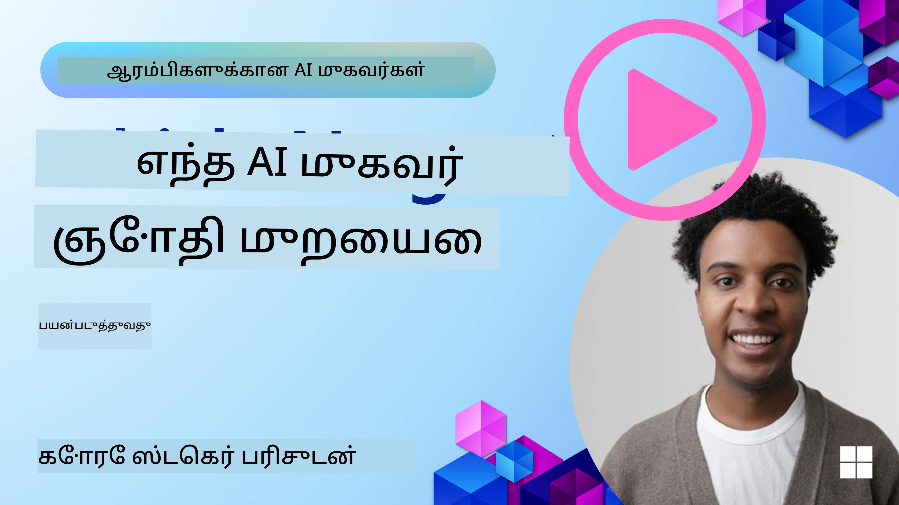

<!--
CO_OP_TRANSLATOR_METADATA:
{
  "original_hash": "7120197753abacc827b64ac2d5d6966f",
  "translation_date": "2025-11-13T14:52:10+00:00",
  "source_file": "02-explore-agentic-frameworks/README.md",
  "language_code": "ta"
}
-->
[](https://youtu.be/ODwF-EZo_O8?si=1xoy_B9RNQfrYdF7)

> _(மேலே உள்ள படத்தை கிளிக் செய்து இந்த பாடத்தின் வீடியோவைப் பாருங்கள்)_

# AI முகவர் கட்டமைப்புகளை ஆராயுங்கள்

AI முகவர் கட்டமைப்புகள் என்பது AI முகவர்களை உருவாக்க, பரப்ப, மற்றும் நிர்வகிக்க எளிதாக்க வடிவமைக்கப்பட்ட மென்பொருள் தளங்கள் ஆகும். இந்த கட்டமைப்புகள், சிக்கலான AI அமைப்புகளை உருவாக்குவதற்கான முன்னோட்ட கூறுகள், சுருக்கங்கள் மற்றும் கருவிகளை வழங்குவதன் மூலம் டெவலப்பர்களுக்கு உதவுகின்றன.

இந்த கட்டமைப்புகள், AI முகவர் மேம்பாட்டில் பொதுவான சவால்களுக்கு நிலையான அணுகுமுறைகளை வழங்குவதன் மூலம், டெவலப்பர்கள் தங்கள் பயன்பாடுகளின் தனித்துவமான அம்சங்களில் கவனம் செலுத்த உதவுகின்றன. அவை AI அமைப்புகளை உருவாக்குவதில் அளவளாவல், அணுகல் மற்றும் திறனை மேம்படுத்துகின்றன.

## அறிமுகம் 

இந்த பாடத்தில் நீங்கள் கற்றுக்கொள்ளப்போகிறீர்கள்:

- AI முகவர் கட்டமைப்புகள் என்ன? அவை டெவலப்பர்களுக்கு என்ன சாதிக்க உதவுகின்றன?
- குழுக்கள், தங்கள் முகவர்களின் திறன்களை விரைவாக மாதிரி வடிவமைக்க, திருத்த, மற்றும் மேம்படுத்த எப்படி பயன்படுத்த முடியும்?
- Microsoft <a href="https://aka.ms/ai-agents/autogen" target="_blank">AutoGen</a>, <a href="https://aka.ms/ai-agents-beginners/semantic-kernel" target="_blank">Semantic Kernel</a>, மற்றும் <a href="https://aka.ms/ai-agents-beginners/ai-agent-service" target="_blank">Azure AI Agent Service</a> ஆகியவற்றால் உருவாக்கப்பட்ட கட்டமைப்புகள் மற்றும் கருவிகளுக்கு இடையேயான வேறுபாடுகள் என்ன?
- Azure சூழலமைப்பு கருவிகளை நேரடியாக ஒருங்கிணைக்க முடியுமா அல்லது தனித்துவமான தீர்வுகள் தேவைப்படுமா?
- Azure AI Agents சேவை என்ன? இது என்ன உதவுகிறது?

## கற்றல் இலக்குகள்

இந்த பாடத்தின் இலக்குகள்:

- AI முகவர் கட்டமைப்புகளின் AI மேம்பாட்டில் உள்ள பங்கு.
- AI முகவர் கட்டமைப்புகளை பயன்படுத்தி புத்திசாலி முகவர்களை உருவாக்குவது எப்படி.
- AI முகவர் கட்டமைப்புகள் வழங்கும் முக்கிய திறன்கள்.
- AutoGen, Semantic Kernel, மற்றும் Azure AI Agent Service ஆகியவற்றின் வேறுபாடுகள்.

## AI முகவர் கட்டமைப்புகள் என்ன? அவை டெவலப்பர்களுக்கு என்ன செய்ய உதவுகின்றன?

சாதாரண AI கட்டமைப்புகள் உங்கள் பயன்பாடுகளில் AI ஐ ஒருங்கிணைக்க உதவுகின்றன மற்றும் கீழே உள்ள வழிகளில் அவற்றை மேம்படுத்துகின்றன:

- **தனிப்பயனாக்கம்**: AI பயனர் நடத்தை மற்றும் விருப்பங்களை பகுப்பாய்வு செய்து தனிப்பயன் பரிந்துரைகள், உள்ளடக்கம் மற்றும் அனுபவங்களை வழங்க முடியும்.
உதாரணம்: Netflix போன்ற ஸ்ட்ரீமிங் சேவைகள், பார்வை வரலாற்றின் அடிப்படையில் திரைப்படங்கள் மற்றும் நிகழ்ச்சிகளை பரிந்துரைக்க AI ஐ பயன்படுத்துகின்றன, இது பயனர் ஈடுபாடு மற்றும் திருப்தியை மேம்படுத்துகிறது.
- **தானியக்கமும் திறனும்**: AI மீண்டும் மீண்டும் செய்யப்படும் பணிகளை தானியக்கமாக்க, வேலைகளை சீரமைக்க மற்றும் செயல்திறனை மேம்படுத்த முடியும்.
உதாரணம்: வாடிக்கையாளர் சேவை பயன்பாடுகள் பொதுவான கேள்விகளை கையாள AI இயக்கம் கொண்ட சாட்பாட்களை பயன்படுத்துகின்றன, பதிலளிக்கும் நேரத்தை குறைத்து, மனித முகவர்களுக்கு சிக்கலான பிரச்சினைகளுக்கு நேரத்தை விடுகின்றன.
- **பயனர் அனுபவத்தை மேம்படுத்துதல்**: AI குரல் அங்கீகாரம், இயற்கை மொழி செயலாக்கம் மற்றும் முன்னறிவிப்பு உரை போன்ற புத்திசாலி அம்சங்களை வழங்குவதன் மூலம் மொத்த பயனர் அனுபவத்தை மேம்படுத்த முடியும்.
உதாரணம்: Siri மற்றும் Google Assistant போன்ற மெய்நிகர் உதவியாளர்கள், குரல் கட்டளைகளை புரிந்து, பதிலளிக்க AI ஐ பயன்படுத்துகின்றன, இது பயனர்களுக்கு தங்கள் சாதனங்களுடன் தொடர்பு கொள்ள எளிதாக்குகிறது.

### இது எல்லாம் அருமையாக இருக்கிறது, ஆனால் ஏன் AI முகவர் கட்டமைப்புகள் தேவை?

AI முகவர் கட்டமைப்புகள் சாதாரண AI கட்டமைப்புகளை விட அதிகமாக ஒன்றை பிரதிநிதித்துவப்படுத்துகின்றன. அவை பயனர்களுடன், பிற முகவர்களுடன் மற்றும் சூழலுடன் தொடர்பு கொள்ளும் புத்திசாலி முகவர்களை உருவாக்க வடிவமைக்கப்பட்டவை. இந்த முகவர்கள் தன்னாட்சி நடத்தை, முடிவுகளை எடுப்பது மற்றும் மாறும் சூழலுக்கு ஏற்ப மாறுதல் காட்ட முடியும். AI முகவர் கட்டமைப்புகள் வழங்கும் முக்கிய திறன்களை பார்ப்போம்:

- **முகவர் ஒத்துழைப்பு மற்றும் ஒருங்கிணைப்பு**: பல AI முகவர்களை உருவாக்கி, ஒருங்கிணைத்து, மற்றும் தொடர்பு கொண்டு சிக்கலான பணிகளை தீர்க்க உதவுகிறது.
- **பணி தானியக்கமும் மேலாண்மையும்**: பல படிகள் கொண்ட வேலைகளை தானியக்கமாக்க, பணி ஒதுக்கீடு செய்ய மற்றும் முகவர்களிடையே மாறும் பணி மேலாண்மையை வழங்குகிறது.
- **சூழல் புரிதலும் மாறுபாடும்**: முகவர்களுக்கு சூழலை புரிந்து, மாறும் சூழலுக்கு ஏற்ப மாறுதல் காட்டி, நேரடி தகவலின் அடிப்படையில் முடிவுகளை எடுக்கும் திறனை வழங்குகிறது.

சுருக்கமாக, முகவர்கள் உங்களுக்கு அதிகம் செய்ய உதவுகின்றன, தானியக்கத்தை அடுத்த நிலைக்கு கொண்டு செல்ல, மற்றும் சூழலிலிருந்து கற்றுக்கொண்டு மாறும் புத்திசாலி அமைப்புகளை உருவாக்க.
இந்த தகவல்கள் `SummarizedAzureDocs` என்ற நினைவக சேகரத்தில் சேமிக்கப்படுகின்றன. இது மிகவும் எளிமையான உதாரணமாகும், ஆனால் LLM பயன்படுத்துவதற்காக தகவல்களை நினைவகத்தில் எப்படி சேமிக்கலாம் என்பதை நீங்கள் பார்க்கலாம்.

இது Semantic Kernel framework இன் அடிப்படைகள். Agent Framework பற்றி என்ன?

## Azure AI Agent Service

Azure AI Agent Service என்பது Microsoft Ignite 2024 இல் அறிமுகப்படுத்தப்பட்ட சமீபத்திய சேவை. இது Llama 3, Mistral, Cohere போன்ற திறந்த மூல LLMக்களை நேரடியாக அழைக்கும் மாதிரிகளைப் பயன்படுத்தி AI ஏஜென்ட்களை உருவாக்கவும், பரப்பவும் அனுமதிக்கிறது.

Azure AI Agent Service வலுவான நிறுவன பாதுகாப்பு முறைகள் மற்றும் தரவுகளை சேமிக்கும் முறைகளை வழங்குகிறது, இது நிறுவன பயன்பாடுகளுக்கு ஏற்றதாக உள்ளது.

இது AutoGen மற்றும் Semantic Kernel போன்ற பல ஏஜென்ட் ஒருங்கிணைப்பு frameworks உடன் நேரடியாக வேலை செய்கிறது.

இந்த சேவை தற்போது Public Preview நிலையில் உள்ளது மற்றும் Python மற்றும் C# மூலம் ஏஜென்ட்களை உருவாக்க ஆதரிக்கிறது.

Semantic Kernel Python பயன்படுத்தி, நாங்கள் ஒரு பயனர் வரையறுக்கப்பட்ட plugin உடன் Azure AI Agent உருவாக்கலாம்:

```python
import asyncio
from typing import Annotated

from azure.identity.aio import DefaultAzureCredential

from semantic_kernel.agents import AzureAIAgent, AzureAIAgentSettings, AzureAIAgentThread
from semantic_kernel.contents import ChatMessageContent
from semantic_kernel.contents import AuthorRole
from semantic_kernel.functions import kernel_function


# Define a sample plugin for the sample
class MenuPlugin:
    """A sample Menu Plugin used for the concept sample."""

    @kernel_function(description="Provides a list of specials from the menu.")
    def get_specials(self) -> Annotated[str, "Returns the specials from the menu."]:
        return """
        Special Soup: Clam Chowder
        Special Salad: Cobb Salad
        Special Drink: Chai Tea
        """

    @kernel_function(description="Provides the price of the requested menu item.")
    def get_item_price(
        self, menu_item: Annotated[str, "The name of the menu item."]
    ) -> Annotated[str, "Returns the price of the menu item."]:
        return "$9.99"


async def main() -> None:
    ai_agent_settings = AzureAIAgentSettings.create()

    async with (
        DefaultAzureCredential() as creds,
        AzureAIAgent.create_client(
            credential=creds,
            conn_str=ai_agent_settings.project_connection_string.get_secret_value(),
        ) as client,
    ):
        # Create agent definition
        agent_definition = await client.agents.create_agent(
            model=ai_agent_settings.model_deployment_name,
            name="Host",
            instructions="Answer questions about the menu.",
        )

        # Create the AzureAI Agent using the defined client and agent definition
        agent = AzureAIAgent(
            client=client,
            definition=agent_definition,
            plugins=[MenuPlugin()],
        )

        # Create a thread to hold the conversation
        # If no thread is provided, a new thread will be
        # created and returned with the initial response
        thread: AzureAIAgentThread | None = None

        user_inputs = [
            "Hello",
            "What is the special soup?",
            "How much does that cost?",
            "Thank you",
        ]

        try:
            for user_input in user_inputs:
                print(f"# User: '{user_input}'")
                # Invoke the agent for the specified thread
                response = await agent.get_response(
                    messages=user_input,
                    thread_id=thread,
                )
                print(f"# {response.name}: {response.content}")
                thread = response.thread
        finally:
            await thread.delete() if thread else None
            await client.agents.delete_agent(agent.id)


if __name__ == "__main__":
    asyncio.run(main())
```

### முக்கிய கருத்துக்கள்

Azure AI Agent Service இன் முக்கிய கருத்துக்கள்:

- **Agent**. Azure AI Agent Service, Azure AI Foundry உடன் ஒருங்கிணைக்கிறது. AI Foundry இல், AI Agent என்பது "smart" மைக்ரோசர்வீஸ் ஆக செயல்படுகிறது, இது கேள்விகளுக்கு பதிலளிக்க (RAG), செயல்களைச் செய்ய அல்லது workflows ஐ முழுமையாக தானியங்கமாக்க பயன்படுத்தப்படுகிறது. இது உருவாக்கும் AI மாதிரிகளின் சக்தியை உண்மையான தரவூற்று ஆதாரங்களை அணுகவும், தொடர்பு கொள்ளவும் அனுமதிக்கும் கருவிகளுடன் இணைத்து சாதிக்கிறது. ஏஜென்ட்டின் ஒரு உதாரணம் இங்கே:

    ```python
    agent = project_client.agents.create_agent(
        model="gpt-4o-mini",
        name="my-agent",
        instructions="You are helpful agent",
        tools=code_interpreter.definitions,
        tool_resources=code_interpreter.resources,
    )
    ```

    இந்த உதாரணத்தில், `gpt-4o-mini` என்ற மாதிரியுடன், `my-agent` என்ற பெயருடன், மற்றும் `You are helpful agent` என்ற வழிகாட்டுதலுடன் ஒரு ஏஜென்ட் உருவாக்கப்படுகிறது. இந்த ஏஜென்ட் குறியீடு விளக்கம் பணிகளைச் செய்ய கருவிகள் மற்றும் வளங்களுடன் சீரமைக்கப்பட்டுள்ளது.

- **Thread மற்றும் Messages**. Thread என்பது மற்றொரு முக்கிய கருத்து. இது ஏஜென்ட் மற்றும் பயனர் இடையேயான உரையாடல் அல்லது தொடர்பை பிரதிநிதித்துவப்படுத்துகிறது. Threads உரையாடலின் முன்னேற்றத்தை கண்காணிக்க, சூழல் தகவல்களை சேமிக்க, மற்றும் தொடர்பின் நிலையை நிர்வகிக்க பயன்படுத்தப்படலாம். Thread இன் ஒரு உதாரணம் இங்கே:

    ```python
    thread = project_client.agents.create_thread()
    message = project_client.agents.create_message(
        thread_id=thread.id,
        role="user",
        content="Could you please create a bar chart for the operating profit using the following data and provide the file to me? Company A: $1.2 million, Company B: $2.5 million, Company C: $3.0 million, Company D: $1.8 million",
    )
    
    # Ask the agent to perform work on the thread
    run = project_client.agents.create_and_process_run(thread_id=thread.id, agent_id=agent.id)
    
    # Fetch and log all messages to see the agent's response
    messages = project_client.agents.list_messages(thread_id=thread.id)
    print(f"Messages: {messages}")
    ```

    முந்தைய குறியீட்டில், ஒரு Thread உருவாக்கப்படுகிறது. அதன் பிறகு, Thread க்கு ஒரு Message அனுப்பப்படுகிறது. `create_and_process_run` ஐ அழைப்பதன் மூலம், Thread இல் ஏஜென்ட் பணிகளைச் செய்ய கேட்கப்படுகிறது. இறுதியாக, Messages பெறப்பட்டு, ஏஜென்ட்டின் பதிலைப் பார்க்க பதிவு செய்யப்படுகிறது. Messages பயனர் மற்றும் ஏஜென்ட் இடையேயான உரையாடலின் முன்னேற்றத்தை குறிக்கின்றன. Messages பல வகைகளாக இருக்கலாம், உதாரணமாக Text, Image, அல்லது File போன்றவை, அதாவது ஏஜென்ட்டின் வேலை Text பதில் அல்லது Image போன்றவற்றை உருவாக்கியிருக்கலாம். ஒரு Developer ஆக, நீங்கள் இந்த தகவலை மேலும் செயல்படுத்த அல்லது பயனருக்கு வழங்க பயன்படுத்தலாம்.

- **மற்ற AI frameworks உடன் ஒருங்கிணைக்கிறது**. Azure AI Agent Service, AutoGen மற்றும் Semantic Kernel போன்ற frameworks உடன் தொடர்பு கொள்ள முடியும், அதாவது நீங்கள் உங்கள் பயன்பாட்டின் ஒரு பகுதியை இந்த frameworks இல் உருவாக்கலாம், உதாரணமாக Agent Service ஐ ஒருங்கிணைப்பாளராக பயன்படுத்தலாம் அல்லது அனைத்தையும் Agent Service இல் உருவாக்கலாம்.

**பயன்பாட்டு வழிகள்**: Azure AI Agent Service, பாதுகாப்பான, அளவளாவிய மற்றும் நெகிழ்வான AI ஏஜென்ட் பரப்புதலுக்கு வடிவமைக்கப்பட்டுள்ளது.

## இந்த frameworks க்கு என்ன வித்தியாசம்?

இந்த frameworks க்கு இடையில் நிறைய ஒற்றுமை உள்ளது போல தோன்றுகிறது, ஆனால் அவற்றின் வடிவமைப்பு, திறன்கள் மற்றும் இலக்கு பயன்பாட்டு வழிகளில் சில முக்கிய வித்தியாசங்கள் உள்ளன:

- **AutoGen**: பல ஏஜென்ட் அமைப்புகள் பற்றிய முன்னணி ஆராய்ச்சியில் கவனம் செலுத்தும் ஒரு பரிசோதனை framework. சிக்கலான பல ஏஜென்ட் அமைப்புகளை பரிசோதிக்கவும், உருவாக்கவும் சிறந்த இடம்.
- **Semantic Kernel**: நிறுவன ஏஜென்டிக் பயன்பாடுகளை உருவாக்க தயாராக இருக்கும் ஏஜென்ட் நூலகம். நிகழ்வு சார்ந்த, பகிர்ந்தளிக்கப்பட்ட ஏஜென்டிக் பயன்பாடுகளில் கவனம் செலுத்துகிறது, பல LLMs மற்றும் SLMs, கருவிகள் மற்றும் ஒற்றை/பல ஏஜென்ட் வடிவமைப்பு முறைகளை இயக்குகிறது.
- **Azure AI Agent Service**: Azure Foundry இல் ஏஜென்ட்களுக்கான ஒரு தளம் மற்றும் பரப்பல் சேவை. Azure OpenAI, Azure AI Search, Bing Search மற்றும் code execution போன்ற சேவைகளுடன் இணைப்புகளை உருவாக்க வழங்குகிறது.

இன்னும் எந்த framework ஐ தேர்வு செய்வது என்று தெரியவில்லையா?

### பயன்பாட்டு வழிகள்

சில பொதுவான பயன்பாட்டு வழிகளைப் பார்த்து உங்களுக்கு உதவ முயற்சிக்கலாம்:

> Q: நான் பரிசோதிக்கிறேன், கற்றுக்கொள்கிறேன் மற்றும் proof-of-concept ஏஜென்ட் பயன்பாடுகளை உருவாக்குகிறேன், மேலும் விரைவாக உருவாக்கவும், பரிசோதிக்கவும் விரும்புகிறேன்
>

>A: AutoGen இந்த சூழலுக்கு நல்ல தேர்வாக இருக்கும், ஏனெனில் இது நிகழ்வு சார்ந்த, பகிர்ந்தளிக்கப்பட்ட ஏஜென்டிக் பயன்பாடுகளில் கவனம் செலுத்துகிறது மற்றும் மேம்பட்ட பல ஏஜென்ட் வடிவமைப்பு முறைகளை ஆதரிக்கிறது.

> Q: இந்த பயன்பாட்டு வழிக்கான Semantic Kernel மற்றும் Azure AI Agent Service க்கு AutoGen ஏன் சிறந்த தேர்வாகும்?
>
> A: AutoGen குறிப்பாக நிகழ்வு சார்ந்த, பகிர்ந்தளிக்கப்பட்ட ஏஜென்டிக் பயன்பாடுகளுக்காக வடிவமைக்கப்பட்டுள்ளது, இது code generation மற்றும் data analysis பணிகளுக்கு ஏற்றதாக உள்ளது. இது சிக்கலான பல ஏஜென்ட் அமைப்புகளை திறமையாக உருவாக்க தேவையான கருவிகள் மற்றும் திறன்களை வழங்குகிறது.

>Q: Azure AI Agent Service இங்கே வேலை செய்யக்கூடும் போல தோன்றுகிறது, இது code generation மற்றும் பலவற்றுக்கு கருவிகளை கொண்டுள்ளது?

>
> A: ஆம், Azure AI Agent Service என்பது ஏஜென்ட்களுக்கான ஒரு தள சேவை மற்றும் பல மாதிரிகள், Azure AI Search, Bing Search மற்றும் Azure Functions ஆகியவற்றுக்கான built-in திறன்களை சேர்க்கிறது. Foundry Portal இல் உங்கள் ஏஜென்ட்களை உருவாக்கவும், அளவளாவிய அளவில் பரப்பவும் இது எளிதாக்குகிறது.

> Q: நான் இன்னும் குழப்பத்தில் இருக்கிறேன், ஒரு தேர்வை மட்டும் சொல்லுங்கள்
>
> A: உங்கள் பயன்பாட்டை முதலில் Semantic Kernel இல் உருவாக்கி, பின்னர் Azure AI Agent Service ஐ பயன்படுத்தி உங்கள் ஏஜென்ட்டை பரப்புவது ஒரு சிறந்த தேர்வாக இருக்கும். இந்த அணுகுமுறை உங்கள் ஏஜென்ட்களை எளிதாக நிலைத்திருக்க அனுமதிக்கிறது, மேலும் Semantic Kernel இல் பல ஏஜென்ட் அமைப்புகளை உருவாக்கும் சக்தியைப் பயன்படுத்துகிறது. கூடுதலாக, Semantic Kernel இல் AutoGen உடன் ஒரு connector உள்ளது, இது இரண்டு frameworks ஐ ஒன்றாக பயன்படுத்த எளிதாக்குகிறது.

வித்தியாசங்களை ஒரு அட்டவணையில் சுருக்குவோம்:

| Framework | கவனம் | முக்கிய கருத்துக்கள் | பயன்பாட்டு வழிகள் |
| --- | --- | --- | --- |
| AutoGen | நிகழ்வு சார்ந்த, பகிர்ந்தளிக்கப்பட்ட ஏஜென்டிக் பயன்பாடுகள் | Agents, Personas, Functions, Data | Code generation, data analysis tasks |
| Semantic Kernel | மனிதர்களைப் போன்ற உரை உள்ளடக்கத்தை புரிந்து கொள்ளுதல் மற்றும் உருவாக்குதல் | Agents, Modular Components, Collaboration | இயற்கை மொழி புரிதல், உள்ளடக்க உருவாக்கம் |
| Azure AI Agent Service | நெகிழ்வான மாதிரிகள், நிறுவன பாதுகாப்பு, Code generation, Tool calling | Modularity, Collaboration, Process Orchestration | பாதுகாப்பான, அளவளாவிய மற்றும் நெகிழ்வான AI ஏஜென்ட் பரப்பல் |

இந்த frameworks க்கு ஏற்ற பயன்பாட்டு வழிகள் என்ன?

## நான் Azure ecosystem கருவிகளை நேரடியாக ஒருங்கிணைக்க முடியுமா, அல்லது தனித்துவமான தீர்வுகள் தேவைப்படுமா?

பதில் ஆம், நீங்கள் Azure AI Agent Service உடன் உங்கள் Azure ecosystem கருவிகளை நேரடியாக ஒருங்கிணைக்க முடியும், ஏனெனில் இது மற்ற Azure சேவைகளுடன் எளிதாக வேலை செய்ய உருவாக்கப்பட்டுள்ளது. உதாரணமாக Bing, Azure AI Search, மற்றும் Azure Functions ஐ ஒருங்கிணைக்கலாம். Azure AI Foundry உடன் ஆழமான ஒருங்கிணைப்பு உள்ளது.

AutoGen மற்றும் Semantic Kernel க்கான, Azure சேவைகளை உங்கள் code இல் அழைக்க இது தேவைப்படலாம். மற்றொரு ஒருங்கிணைப்பு வழி Azure SDKs ஐ பயன்படுத்தி Azure சேவைகளுடன் உங்கள் ஏஜென்ட்களை தொடர்பு கொள்ளும். கூடுதலாக, Azure AI Agent Service ஐ AutoGen அல்லது Semantic Kernel இல் உருவாக்கப்பட்ட ஏஜென்ட்களுக்கு ஒருங்கிணைப்பாளராக பயன்படுத்தலாம், இது Azure ecosystem ஐ எளிதாக அணுக அனுமதிக்கும்.

## உதாரண குறியீடுகள்

- Python: [Agent Framework](./code_samples/02-python-agent-framework.ipynb)
- .NET: [Agent Framework](./code_samples/02-dotnet-agent-framework.md)

## AI Agent Frameworks பற்றி மேலும் கேள்விகள் உள்ளதா?

[Azure AI Foundry Discord](https://aka.ms/ai-agents/discord) இல் சேர்ந்து மற்ற பயிற்சியாளர்களை சந்திக்கவும், office hours இல் பங்கேற்கவும், மற்றும் உங்கள் AI Agents கேள்விகளுக்கு பதில் பெறவும்.

## குறிப்புகள்

- <a href="https://techcommunity.microsoft.com/blog/azure-ai-services-blog/introducing-azure-ai-agent-service/4298357" target="_blank">Azure Agent Service</a>
- <a href="https://devblogs.microsoft.com/semantic-kernel/microsofts-agentic-ai-frameworks-autogen-and-semantic-kernel/" target="_blank">Semantic Kernel and AutoGen</a>
- <a href="https://learn.microsoft.com/semantic-kernel/frameworks/agent/?pivots=programming-language-python" target="_blank">Semantic Kernel Python Agent Framework</a>
- <a href="https://learn.microsoft.com/semantic-kernel/frameworks/agent/?pivots=programming-language-csharp" target="_blank">Semantic Kernel .Net Agent Framework</a>
- <a href="https://learn.microsoft.com/azure/ai-services/agents/overview" target="_blank">Azure AI Agent service</a>
- <a href="https://techcommunity.microsoft.com/blog/educatordeveloperblog/using-azure-ai-agent-service-with-autogen--semantic-kernel-to-build-a-multi-agen/4363121" target="_blank">Using Azure AI Agent Service with AutoGen / Semantic Kernel to build a multi-agent's solution</a>

## முந்தைய பாடம்

[AI Agents மற்றும் Agent பயன்பாட்டு வழிகள் அறிமுகம்](../01-intro-to-ai-agents/README.md)

## அடுத்த பாடம்

[Agentic Design Patterns புரிதல்](../03-agentic-design-patterns/README.md)

---

<!-- CO-OP TRANSLATOR DISCLAIMER START -->
**புறக்குறிப்பு**:  
இந்த ஆவணம் AI மொழிபெயர்ப்பு சேவை [Co-op Translator](https://github.com/Azure/co-op-translator) பயன்படுத்தி மொழிபெயர்க்கப்பட்டுள்ளது. நாங்கள் துல்லியத்திற்காக முயற்சிக்கிறோம், ஆனால் தானியங்கி மொழிபெயர்ப்புகளில் பிழைகள் அல்லது தவறுகள் இருக்கக்கூடும் என்பதை கவனத்தில் கொள்ளவும். அதன் தாய்மொழியில் உள்ள மூல ஆவணம் அதிகாரப்பூர்வ ஆதாரமாக கருதப்பட வேண்டும். முக்கியமான தகவல்களுக்கு, தொழில்முறை மனித மொழிபெயர்ப்பு பரிந்துரைக்கப்படுகிறது. இந்த மொழிபெயர்ப்பைப் பயன்படுத்துவதால் ஏற்படும் எந்த தவறான புரிதல்கள் அல்லது தவறான விளக்கங்களுக்கு நாங்கள் பொறுப்பல்ல.
<!-- CO-OP TRANSLATOR DISCLAIMER END -->