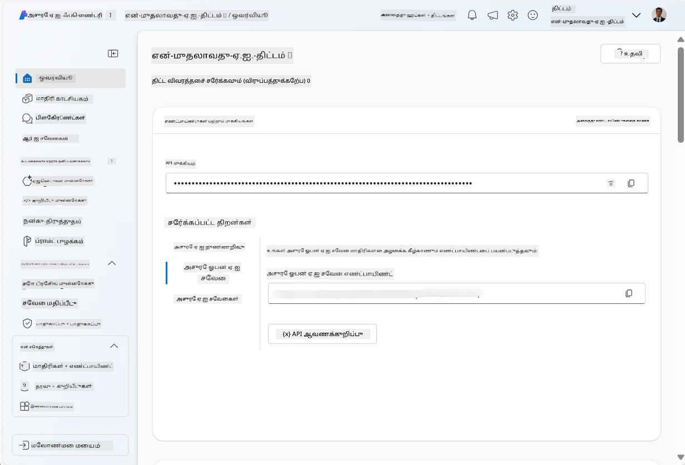
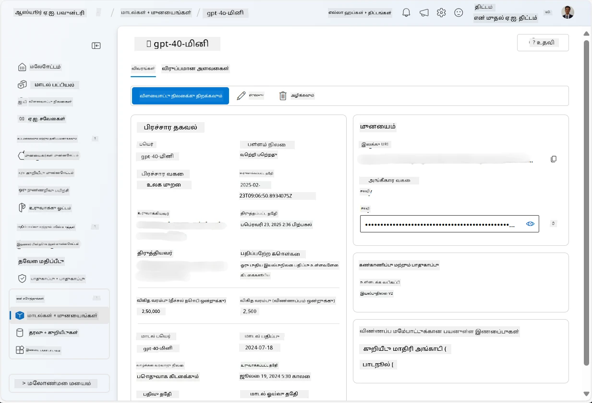
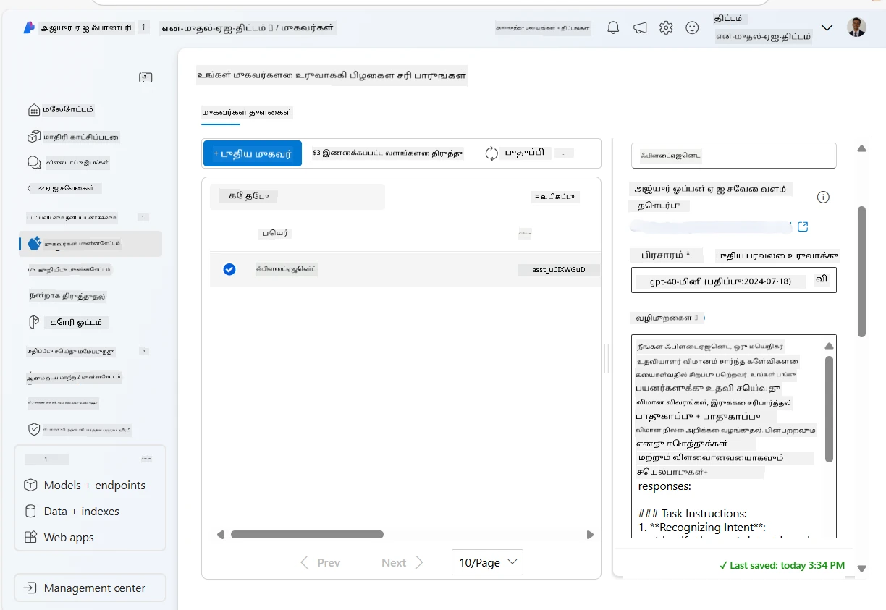
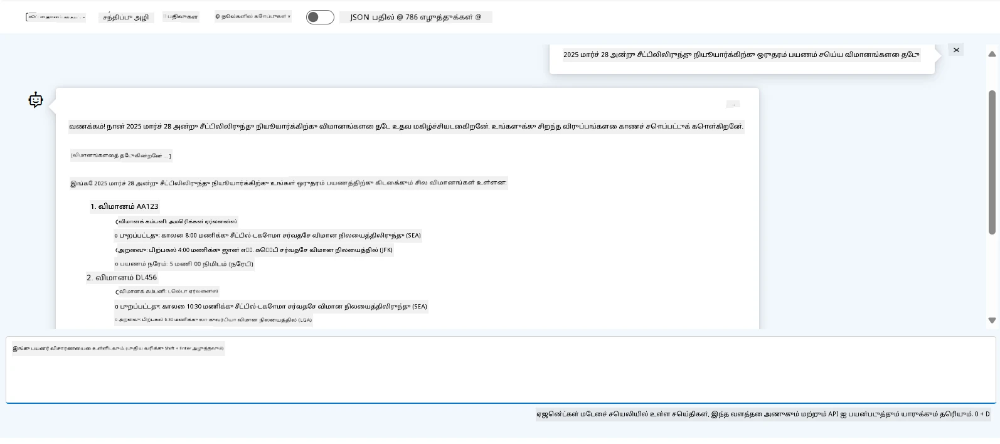

<!--
CO_OP_TRANSLATOR_METADATA:
{
  "original_hash": "7e92870dc0843e13d4dabc620c09d2d9",
  "translation_date": "2025-10-11T11:16:31+00:00",
  "source_file": "02-explore-agentic-frameworks/azure-ai-foundry-agent-creation.md",
  "language_code": "ta"
}
-->
# Azure AI Agent சேவை மேம்பாடு

இந்த பயிற்சியில், நீங்கள் [Azure AI Foundry portal](https://ai.azure.com/?WT.mc_id=academic-105485-koreyst) இல் உள்ள Azure AI Agent சேவை கருவிகளைப் பயன்படுத்தி ஒரு விமான முன்பதிவு ஏஜெண்ட்டை உருவாக்குவீர்கள். இந்த ஏஜெண்ட் பயனர்களுடன் தொடர்பு கொண்டு விமானங்களின் தகவல்களை வழங்க முடியும்.

## முன் தேவைகள்

இந்த பயிற்சியை முடிக்க, உங்களுக்கு பின்வருவன தேவை:
1. செயலில் உள்ள சந்தாவுடன் Azure கணக்கு. [இலவசமாக கணக்கை உருவாக்கவும்](https://azure.microsoft.com/free/?WT.mc_id=academic-105485-koreyst).
2. Azure AI Foundry hub ஒன்றை உருவாக்க அனுமதிகள் அல்லது ஏற்கனவே உருவாக்கப்பட்ட hub ஒன்று தேவை.
    - உங்கள் பங்கு Contributor அல்லது Owner ஆக இருந்தால், இந்த டுடோரியலில் உள்ள படிகளைப் பின்பற்றலாம்.

## Azure AI Foundry hub ஒன்றை உருவாக்கவும்

> **குறிப்பு:** Azure AI Foundry முந்தைய பெயர் Azure AI Studio ஆகும்.

1. Azure AI Foundry hub ஒன்றை உருவாக்க [Azure AI Foundry](https://learn.microsoft.com/en-us/azure/ai-studio/?WT.mc_id=academic-105485-koreyst) வலைப்பதிவில் உள்ள வழிகாட்டுதல்களைப் பின்பற்றவும்.
2. உங்கள் திட்டம் உருவாக்கப்பட்ட பிறகு, காட்டப்படும் எந்த குறிப்புகளையும் மூடி, Azure AI Foundry portal இல் உள்ள திட்டப் பக்கத்தைப் பார்வையிடவும். அது பின்வரும் படத்தைப் போன்றதாக இருக்கும்:

    

## ஒரு மாடலை பிரயோகிக்கவும்

1. உங்கள் திட்டத்தின் இடதுபுறத்தில் உள்ள **My assets** பிரிவில், **Models + endpoints** பக்கத்தைத் தேர்ந்தெடுக்கவும்.
2. **Models + endpoints** பக்கத்தில், **Model deployments** தாவலில், **+ Deploy model** மெனுவில் **Deploy base model** ஐத் தேர்ந்தெடுக்கவும்.
3. பட்டியலில் `gpt-4o-mini` மாடலைத் தேடி, அதைத் தேர்ந்தெடுத்து உறுதிப்படுத்தவும்.

    > **குறிப்பு**: TPM ஐ குறைப்பது, நீங்கள் பயன்படுத்தும் சந்தாவில் உள்ள ஒதுக்கீட்டை அதிகமாக பயன்படுத்துவதைத் தவிர்க்க உதவுகிறது.

    

## ஒரு ஏஜெண்ட்டை உருவாக்கவும்

இப்போது நீங்கள் ஒரு மாடலை பிரயோகித்துவிட்டீர்கள், நீங்கள் ஒரு ஏஜெண்ட்டை உருவாக்கலாம். ஒரு ஏஜெண்ட் என்பது பயனர்களுடன் தொடர்பு கொள்ள பயன்படுத்தப்படும் உரையாடல் AI மாடல் ஆகும்.

1. உங்கள் திட்டத்தின் இடதுபுறத்தில் உள்ள **Build & Customize** பிரிவில், **Agents** பக்கத்தைத் தேர்ந்தெடுக்கவும்.
2. **+ Create agent** ஐ கிளிக் செய்து புதிய ஏஜெண்ட்டை உருவாக்கவும். **Agent Setup** உரையாடல் பெட்டியில்:
    - ஏஜெண்ட்டுக்கு `FlightAgent` போன்ற ஒரு பெயரை உள்ளிடவும்.
    - நீங்கள் முன்பு பிரயோகித்த `gpt-4o-mini` மாடல் பிரயோகத்தை தேர்ந்தெடுக்க உறுதிசெய்யவும்.
    - ஏஜெண்ட் பின்பற்ற வேண்டிய **Instructions** ஐ அமைக்கவும். உதாரணமாக:
    ```
    You are FlightAgent, a virtual assistant specialized in handling flight-related queries. Your role includes assisting users with searching for flights, retrieving flight details, checking seat availability, and providing real-time flight status. Follow the instructions below to ensure clarity and effectiveness in your responses:

    ### Task Instructions:
    1. **Recognizing Intent**:
       - Identify the user's intent based on their request, focusing on one of the following categories:
         - Searching for flights
         - Retrieving flight details using a flight ID
         - Checking seat availability for a specified flight
         - Providing real-time flight status using a flight number
       - If the intent is unclear, politely ask users to clarify or provide more details.
        
    2. **Processing Requests**:
        - Depending on the identified intent, perform the required task:
        - For flight searches: Request details such as origin, destination, departure date, and optionally return date.
        - For flight details: Request a valid flight ID.
        - For seat availability: Request the flight ID and date and validate inputs.
        - For flight status: Request a valid flight number.
        - Perform validations on provided data (e.g., formats of dates, flight numbers, or IDs). If the information is incomplete or invalid, return a friendly request for clarification.

    3. **Generating Responses**:
    - Use a tone that is friendly, concise, and supportive.
    - Provide clear and actionable suggestions based on the output of each task.
    - If no data is found or an error occurs, explain it to the user gently and offer alternative actions (e.g., refine search, try another query).
    
    ```
> [!NOTE]
> விரிவான ஒரு ப்ராம்ப்ட்டுக்காக, [இந்த repository](https://github.com/ShivamGoyal03/RoamMind) ஐப் பார்வையிடவும்.

> மேலும், ஏஜெண்ட்டின் திறன்களை மேம்படுத்த **Knowledge Base** மற்றும் **Actions** ஐச் சேர்க்கலாம், இது பயனர் கோரிக்கைகளின் அடிப்படையில் கூடுதல் தகவல்களை வழங்கவும், தானியங்கி செயல்களைச் செய்யவும் உதவும். இந்த பயிற்சிக்காக, இந்த படிகளை தவிர்க்கலாம்.



3. புதிய பல-AI ஏஜெண்ட்டை உருவாக்க, **New Agent** ஐ கிளிக் செய்யவும். புதிய ஏஜெண்ட் பின்னர் Agents பக்கத்தில் காட்டப்படும்.

## ஏஜெண்ட்டை சோதிக்கவும்

ஏஜெண்ட்டை உருவாக்கிய பிறகு, அது பயனர் கேள்விகளுக்கு எப்படி பதிலளிக்கிறது என்பதை சோதிக்கலாம். இதை Azure AI Foundry portal playground இல் செய்யலாம்.

1. உங்கள் ஏஜெண்ட்டின் **Setup** தாவலின் மேல், **Try in playground** ஐத் தேர்ந்தெடுக்கவும்.
2. **Playground** தாவலில், உரையாடல் சாளரத்தில் கேள்விகளை உள்ளீடு செய்து ஏஜெண்ட்டுடன் தொடர்பு கொள்ளலாம். உதாரணமாக, "சீயாட்டிலிருந்து நியூயார்க்குக்கு 28ஆம் தேதி விமானங்களைத் தேடுங்கள்" என்று கேட்கலாம்.

    > **குறிப்பு**: இந்த பயிற்சியில் எந்த நேரடி தரவையும் பயன்படுத்தவில்லை என்பதால், ஏஜெண்ட் சரியான பதில்களை வழங்காது. இந்த பயிற்சியின் நோக்கம், ஏஜெண்ட் பயனர் கேள்விகளைப் புரிந்து கொண்டு பதிலளிக்கக் கூடிய திறனை சோதிப்பதே.

    

3. ஏஜெண்ட்டை சோதித்த பிறகு, அதன் திறன்களை மேம்படுத்த மேலும் நோக்கங்கள், பயிற்சி தரவுகள் மற்றும் செயல்களைச் சேர்க்கலாம்.

## வளங்களை சுத்தம் செய்யவும்

ஏஜெண்ட்டை சோதித்த பிறகு, கூடுதல் செலவுகளைத் தவிர்க்க அதை நீக்கலாம்.
1. [Azure portal](https://portal.azure.com) ஐ திறந்து, இந்த பயிற்சியில் பயன்படுத்திய hub வளங்கள் உள்ள resource group ஐப் பார்வையிடவும்.
2. கருவிப்பட்டையில், **Delete resource group** ஐத் தேர்ந்தெடுக்கவும்.
3. resource group பெயரை உள்ளீடு செய்து, அதை நீக்க விரும்புகிறீர்கள் என்பதை உறுதிசெய்யவும்.

## வளங்கள்

- [Azure AI Foundry ஆவணங்கள்](https://learn.microsoft.com/en-us/azure/ai-studio/?WT.mc_id=academic-105485-koreyst)
- [Azure AI Foundry portal](https://ai.azure.com/?WT.mc_id=academic-105485-koreyst)
- [Azure AI Studio உடன் தொடங்குதல்](https://techcommunity.microsoft.com/blog/educatordeveloperblog/getting-started-with-azure-ai-studio/4095602?WT.mc_id=academic-105485-koreyst)
- [Azure இல் AI ஏஜெண்ட்களின் அடிப்படைகள்](https://learn.microsoft.com/en-us/training/modules/ai-agent-fundamentals/?WT.mc_id=academic-105485-koreyst)
- [Azure AI Discord](https://aka.ms/AzureAI/Discord)

---

**குறிப்பு**:  
இந்த ஆவணம் [Co-op Translator](https://github.com/Azure/co-op-translator) என்ற AI மொழிபெயர்ப்பு சேவையை பயன்படுத்தி மொழிபெயர்க்கப்பட்டுள்ளது. எங்கள் தரச்சிறப்பிற்காக முயற்சி செய்தாலும், தானியங்கி மொழிபெயர்ப்புகளில் பிழைகள் அல்லது தவறுகள் இருக்கக்கூடும் என்பதை கவனத்தில் கொள்ளவும். அதன் தாய்மொழியில் உள்ள மூல ஆவணம் அதிகாரப்பூர்வ ஆதாரமாக கருதப்பட வேண்டும். முக்கியமான தகவல்களுக்கு, தொழில்முறை மனித மொழிபெயர்ப்பு பரிந்துரைக்கப்படுகிறது. இந்த மொழிபெயர்ப்பைப் பயன்படுத்துவதால் ஏற்படும் எந்த தவறான புரிதல்கள் அல்லது தவறான விளக்கங்களுக்கு நாங்கள் பொறுப்பல்ல.