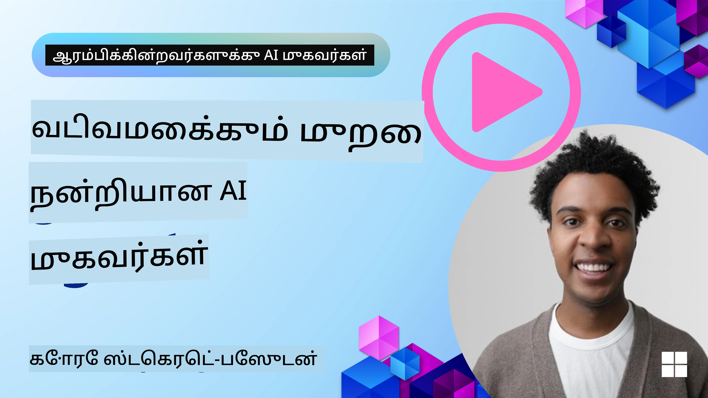
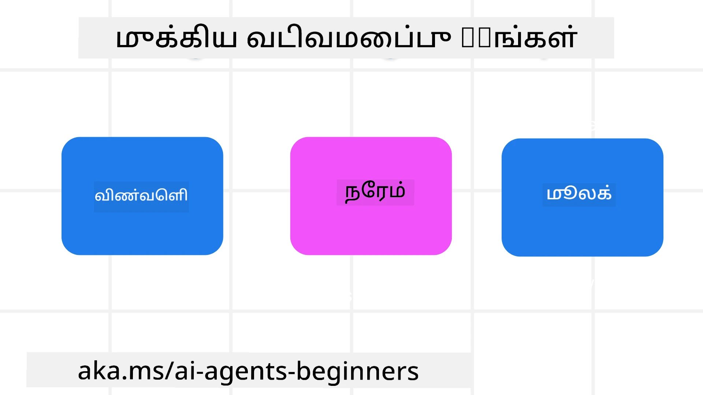

<!--
CO_OP_TRANSLATOR_METADATA:
{
  "original_hash": "d71524fe83a23829ae7a23b4031aaac8",
  "translation_date": "2025-11-13T14:53:59+00:00",
  "source_file": "03-agentic-design-patterns/README.md",
  "language_code": "ta"
}
-->

> _(மேலே உள்ள படத்தை கிளிக் செய்து இந்த பாடத்தின் வீடியோவைப் பாருங்கள்)_
# AI முகவர்களின் வடிவமைப்பு கொள்கைகள்

## அறிமுகம்

AI முகவர்களை உருவாக்க பல வழிகள் உள்ளன. Generative AI வடிவமைப்பில் தெளிவின்மை ஒரு குறைபாடு அல்ல, ஒரு அம்சமாகவே இருக்கிறது என்பதால், பொறியாளர்கள் எங்கு தொடங்குவது என்று கண்டுபிடிக்க சில நேரங்களில் சிரமமாக இருக்கலாம். வாடிக்கையாளர் மையமாக செயல்படும் முகவர்களை உருவாக்குவதற்கான மனித மைய UX வடிவமைப்பு கொள்கைகளை உருவாக்கியுள்ளோம். இந்த வடிவமைப்பு கொள்கைகள் கட்டாயமான கட்டமைப்பாக அல்ல, ஆனால் முகவர் அனுபவங்களை வரையறுத்து உருவாக்கும் குழுக்களுக்கு ஒரு தொடக்க புள்ளியாக செயல்படுகின்றன.

பொதுவாக, முகவர்கள்:

- மனித திறன்களை விரிவுபடுத்தி, பரந்த அளவில் பயன்படுத்த வேண்டும் (கற்பனை, பிரச்சினை தீர்வு, தானியங்கி செயல்பாடுகள் போன்றவை)
- அறிவு குறைபாடுகளை நிரப்ப வேண்டும் (அறிவுத்துறைகள், மொழிபெயர்ப்பு போன்றவற்றில் உதவுதல்)
- ஒத்துழைப்பை எளிதாக்கி, தனிநபர்களாக நாங்கள் மற்றவர்களுடன் வேலை செய்ய விரும்பும் முறைகளை ஆதரிக்க வேண்டும்
- நம்மை சிறந்தவர்களாக மாற்ற வேண்டும் (உதாரணமாக, வாழ்க்கை பயிற்சியாளர்/பணி மேலாளர், உணர்ச்சி கட்டுப்பாடு மற்றும் மன அமைதி திறன்களை கற்றுக்கொடுக்க உதவுதல், மன உறுதியை உருவாக்குதல் போன்றவை)

## இந்த பாடத்தில் நீங்கள் காண்பீர்கள்

- முகவர்களின் வடிவமைப்பு கொள்கைகள் என்ன
- இந்த வடிவமைப்பு கொள்கைகளை செயல்படுத்தும் போது பின்பற்ற வேண்டிய வழிகாட்டுதல்கள் என்ன
- வடிவமைப்பு கொள்கைகளை பயன்படுத்தும் சில உதாரணங்கள் என்ன

## கற்றல் இலக்குகள்

இந்த பாடத்தை முடித்த பிறகு, நீங்கள்:

1. முகவர்களின் வடிவமைப்பு கொள்கைகள் என்ன என்பதை விளக்க முடியும்
2. முகவர்களின் வடிவமைப்பு கொள்கைகளை பயன்படுத்துவதற்கான வழிகாட்டுதல்களை விளக்க முடியும்
3. முகவர்களை வடிவமைப்பு கொள்கைகளை பயன்படுத்தி உருவாக்குவது எப்படி என்பதை புரிந்துகொள்ள முடியும்

## முகவர்களின் வடிவமைப்பு கொள்கைகள்

### முகவர் (இடம்)

இது முகவர் செயல்படும் சூழல். இந்த கொள்கைகள், உடல் மற்றும் டிஜிட்டல் உலகங்களில் ஈடுபட முகவர்களை வடிவமைப்பதற்கான வழிகாட்டுதல்களை வழங்குகின்றன.

- **இணைக்க, சுருக்காமல்** – ஒத்துழைப்பு மற்றும் இணைப்பை எளிதாக்க, மக்கள், நிகழ்வுகள் மற்றும் செயல்படக்கூடிய அறிவுடன் இணைக்க உதவுங்கள்.
- முகவர்கள் நிகழ்வுகள், அறிவு மற்றும் மக்களை இணைக்க உதவுகின்றனர்.
- முகவர்கள் மக்களை ஒன்றிணைக்கின்றனர். அவர்கள் மக்களை மாற்ற அல்லது குறைத்து பார்க்க வடிவமைக்கப்படவில்லை.
- **எளிதாக அணுகக்கூடியது, ஆனால் சில நேரங்களில் மறைந்திருக்கும்** – முகவர் பெரும்பாலும் பின்னணியில் செயல்படுகிறது மற்றும் அது பொருத்தமான மற்றும் தேவையான போது மட்டுமே நம்மைத் தூண்டுகிறது.
  - முகவர் எந்த சாதனத்திலும் அல்லது தளத்திலும் அங்கீகரிக்கப்பட்ட பயனர்களுக்கு எளிதாகக் கண்டறியக்கூடியது மற்றும் அணுகக்கூடியது.
  - முகவர் பலவகை உள்ளீடுகள் மற்றும் வெளியீடுகளை ஆதரிக்கிறது (ஒலி, குரல், உரை போன்றவை).
  - முகவர் முன்னணி மற்றும் பின்னணி இடையே, செயல்பாட்டிலிருந்து எதிர்வினை வரை, பயனர் தேவைகளை உணர்ந்து எளிதாக மாறக்கூடியது.
  - முகவர் மறைந்த வடிவத்தில் செயல்படலாம், ஆனால் அதன் பின்னணி செயல்முறை பாதை மற்றும் பிற முகவர்களுடன் ஒத்துழைப்பு பயனருக்கு வெளிப்படையாகவும் கட்டுப்படுத்தக்கூடியதாகவும் இருக்கும்.

### முகவர் (நேரம்)

இது முகவர் நேரத்தின் மீது செயல்படுவது எப்படி என்பதை குறிக்கிறது. இந்த கொள்கைகள், கடந்த காலம், நிகழ்காலம் மற்றும் எதிர்காலத்தில் முகவர்கள் எப்படி செயல்பட வேண்டும் என்பதை வடிவமைக்க உதவுகின்றன.

- **கடந்த காலம்**: நிலை மற்றும் சூழ்நிலையை உள்ளடக்கிய வரலாற்றை பிரதிபலித்தல்.
  - முகவர் நிகழ்வுகள், மக்கள் அல்லது நிலைகள் மட்டுமல்லாமல், செறிவான வரலாற்று தரவின் பகுப்பாய்வின் அடிப்படையில் மேலும் பொருத்தமான முடிவுகளை வழங்குகிறது.
  - முகவர் கடந்த நிகழ்வுகளிலிருந்து இணைப்புகளை உருவாக்கி, தற்போதைய சூழ்நிலைகளுடன் ஈடுபட நினைவுகளைச் செயல்படுத்துகிறது.
- **இப்போது**: அறிவிப்பதை விட தூண்டுதல்.
  - முகவர் மக்களுடன் தொடர்பு கொள்ள விரிவான அணுகுமுறையை உடையது. ஒரு நிகழ்வு நடந்தால், முகவர் நிலையான அறிவிப்பு அல்லது மற்ற நிலையான முறைகளுக்கு அப்பாற்பட்டு செயல்படுகிறது. முகவர் பயனரின் கவனத்தை சரியான தருணத்தில் திருப்புவதற்கான வழிகளை எளிமைப்படுத்துகிறது அல்லது தானியங்கி சுட்டிகளை உருவாக்குகிறது.
  - முகவர் தகவல்களை சூழ்நிலை சூழல், சமூக மற்றும் கலாச்சார மாற்றங்கள் மற்றும் பயனர் நோக்கத்திற்கு ஏற்ப வழங்குகிறது.
  - முகவர் தொடர்பு படிப்படியாக, நீண்ட காலத்தில் பயனர்களை அதிகாரமளிக்க வளர்ந்து/மாறுகிறது.
- **எதிர்காலம்**: தழுவி, வளர்ந்து செல்லுதல்.
  - முகவர் பல சாதனங்கள், தளங்கள் மற்றும் முறைகளுக்கு தழுவுகிறது.
  - முகவர் பயனர் நடத்தை, அணுகல் தேவைகள் மற்றும் தனிப்பயனாக்கலுக்கு தகுந்ததாக மாறுகிறது.
  - முகவர் தொடர்ச்சியான பயனர் தொடர்பின் மூலம் வடிவமைக்கப்படுகிறது மற்றும் வளர்கிறது.

### முகவர் (மூலம்)

இவை முகவரின் வடிவமைப்பின் முக்கிய கூறுகள்.

- **தெளிவின்மையை ஏற்கவும் ஆனால் நம்பிக்கையை நிலைநிறுத்தவும்**.
  - ஒரு குறிப்பிட்ட அளவிலான முகவர் தெளிவின்மை எதிர்பார்க்கப்படுகிறது. தெளிவின்மை என்பது முகவர் வடிவமைப்பின் முக்கிய அம்சமாகும்.
  - நம்பிக்கை மற்றும் வெளிப்படைத்தன்மை முகவர் வடிவமைப்பின் அடிப்படை அடுக்குகளாகும்.
  - முகவர் எப்போது இயக்கம்/நிறுத்தம் செய்யப்பட வேண்டும் என்பதை மனிதர்கள் கட்டுப்படுத்துகிறார்கள், மேலும் முகவர் நிலை எப்போதும் தெளிவாக தெரியும்.

## இந்த கொள்கைகளை செயல்படுத்த வழிகாட்டுதல்கள்

முந்தைய வடிவமைப்பு கொள்கைகளை பயன்படுத்தும் போது, பின்வரும் வழிகாட்டுதல்களை பின்பற்றவும்:

1. **வெளிப்படைத்தன்மை**: AI ஈடுபடுகிறது என்பதை பயனருக்கு தெரிவிக்கவும், அது எப்படி செயல்படுகிறது (கடந்த செயல்கள் உட்பட), மற்றும் கருத்துக்களை வழங்கவும் மற்றும் அமைப்பை மாற்றவும் எப்படி என்பதை விளக்கவும்.
2. **கட்டுப்பாடு**: பயனருக்கு அமைப்பை தனிப்பயனாக்க, விருப்பங்களை குறிப்பிட, மற்றும் அமைப்பின் அம்சங்களை கட்டுப்படுத்த அனுமதிக்கவும் (மறக்க வைக்கும் திறன் உட்பட).
3. **முறையான தன்மை**: சாதனங்கள் மற்றும் முடிவுகளுக்கு இடையே ஒரே மாதிரியான, பலவகை அனுபவங்களை நோக்கி செயல்படுங்கள். சாத்தியமான இடங்களில் பரிச்சயமான UI/UX கூறுகளைப் பயன்படுத்தவும் (உதாரணமாக, குரல் தொடர்புக்கு மைக்ரோஃபோன் ஐகான்) மற்றும் வாடிக்கையாளர் மனச்சுமையை அதிகமாக குறைக்கவும் (உதாரணமாக, சுருக்கமான பதில்கள், காட்சிப் உதவிகள், மற்றும் ‘மேலும் கற்றுக்கொள்ளுங்கள்’ உள்ளடக்கம்).

## இந்த கொள்கைகள் மற்றும் வழிகாட்டுதல்களை பயன்படுத்தி ஒரு பயண முகவரை வடிவமைப்பது எப்படி

நீங்கள் ஒரு பயண முகவரை வடிவமைக்கிறீர்கள் என்று கற்பனை செய்யுங்கள், இந்த வடிவமைப்பு கொள்கைகள் மற்றும் வழிகாட்டுதல்களை பயன்படுத்துவது எப்படி என்று இங்கே சிந்திக்கலாம்:

1. **வெளிப்படைத்தன்மை** – பயண முகவர் AI மூலம் இயக்கப்படுகிறது என்பதை பயனருக்கு தெரிவிக்கவும். தொடங்க சில அடிப்படை வழிமுறைகளை வழங்கவும் (உதாரணமாக, ஒரு “வணக்கம்” செய்தி, மாதிரி உத்தேசங்கள்). இதை தயாரிப்பு பக்கத்தில் தெளிவாக ஆவணப்படுத்தவும். பயனர் முந்தைய உத்தேசங்களை எளிதாக பார்க்க முடியும். கருத்துக்களை எளிதாக வழங்க (தலைகீழ் மற்றும் மேலே விரல், கருத்து அனுப்பும் பொத்தான் போன்றவை) எப்படி என்பதை தெளிவாகக் கூறவும். முகவருக்கு பயன்பாடு அல்லது தலைப்பு வரம்புகள் உள்ளதா என்பதை தெளிவாக விளக்கவும்.
2. **கட்டுப்பாடு** – முகவர் உருவாக்கப்பட்ட பிறகு அதை எப்படி மாற்றுவது என்பதை பயனருக்கு தெளிவாகக் கூறவும், உதாரணமாக, System Prompt போன்றவற்றை மாற்ற. முகவர் எவ்வளவு விரிவாக இருக்க வேண்டும், அதன் எழுத்து பாணி மற்றும் அது பேசக்கூடாத தலைப்புகள் போன்றவற்றை பயனர் தேர்வு செய்ய அனுமதிக்கவும். தொடர்புடைய கோப்புகள் அல்லது தரவுகள், உத்தேசங்கள் மற்றும் முந்தைய உரையாடல்களைப் பார்க்கவும் நீக்கவும் பயனருக்கு அனுமதிக்கவும்.
3. **முறையான தன்மை** – Share Prompt, கோப்பு அல்லது புகைப்படத்தைச் சேர்க்கவும் மற்றும் ஒருவரை அல்லது ஏதாவது ஒன்றை குறிக்கவும் ஆகியவற்றுக்கான ஐகான்கள் நிலையான மற்றும் பரிச்சயமானதாக இருக்க வேண்டும். கோப்பு பதிவேற்றம்/பகிர்வுக்கு காகித கிளிப் ஐகானை மற்றும் பட பதிவேற்றத்திற்கு பட ஐகானை பயன்படுத்தவும்.

## மாதிரி குறியீடுகள்

- Python: [Agent Framework](./code_samples/03-python-agent-framework.ipynb)
- .NET: [Agent Framework](./code_samples/03-dotnet-agent-framework.md)

## AI முகவர்களின் வடிவமைப்பு முறைமைகள் குறித்த மேலும் கேள்விகள் உள்ளதா?

மற்ற கற்றலாளர்களை சந்திக்கவும், அலுவலக நேரங்களில் பங்கேற்கவும் மற்றும் உங்கள் AI முகவர்களின் கேள்விகளுக்கு பதிலளிக்கவும் [Azure AI Foundry Discord](https://aka.ms/ai-agents/discord) இல் சேரவும்.

## கூடுதல் ஆதாரங்கள்

- <a href="https://openai.com" target="_blank">Agentic AI Systems க்கான ஆளுமை நடைமுறைகள் | OpenAI</a>
- <a href="https://microsoft.com" target="_blank">The HAX Toolkit Project - Microsoft Research</a>
- <a href="https://responsibleaitoolbox.ai" target="_blank">Responsible AI Toolbox</a>

## முந்தைய பாடம்

[Agentic Frameworks ஆராய்தல்](../02-explore-agentic-frameworks/README.md)

## அடுத்த பாடம்

[கருவி பயன்பாட்டு வடிவமைப்பு முறை](../04-tool-use/README.md)

---

<!-- CO-OP TRANSLATOR DISCLAIMER START -->
**புறக்கணிப்பு**:  
இந்த ஆவணம் AI மொழிபெயர்ப்பு சேவை [Co-op Translator](https://github.com/Azure/co-op-translator) பயன்படுத்தி மொழிபெயர்க்கப்பட்டுள்ளது. நாங்கள் துல்லியத்திற்காக முயற்சிக்கின்றோம், ஆனால் தானியங்கி மொழிபெயர்ப்புகளில் பிழைகள் அல்லது தவறுகள் இருக்கக்கூடும் என்பதை கவனத்தில் கொள்ளவும். அதன் தாய்மொழியில் உள்ள மூல ஆவணம் அதிகாரப்பூர்வ ஆதாரமாக கருதப்பட வேண்டும். முக்கியமான தகவல்களுக்கு, தொழில்முறை மனித மொழிபெயர்ப்பு பரிந்துரைக்கப்படுகிறது. இந்த மொழிபெயர்ப்பைப் பயன்படுத்துவதால் ஏற்படும் எந்த தவறான புரிதல்கள் அல்லது தவறான விளக்கங்களுக்கு நாங்கள் பொறுப்பல்ல.
<!-- CO-OP TRANSLATOR DISCLAIMER END -->