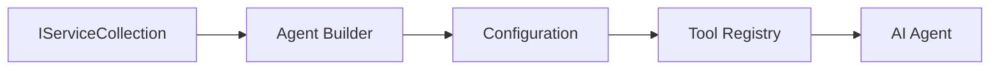

<!--
CO_OP_TRANSLATOR_METADATA:
{
  "original_hash": "bcc874e190347bd6a095aed56dc16de8",
  "translation_date": "2025-11-13T14:55:14+00:00",
  "source_file": "03-agentic-design-patterns/code_samples/03-dotnet-agent-framework.md",
  "language_code": "ta"
}
-->
# 🎨 GitHub மாடல்களுடன் (.NET) Agentic வடிவமைப்பு முறை

## 📋 கற்றல் நோக்கங்கள்

இந்த உதாரணம் Microsoft Agent Framework-ஐ .NET-இல் GitHub மாடல்களுடன் ஒருங்கிணைத்து நுண்ணறிவு முகவர்களை உருவாக்குவதற்கான நிறுவன தரமான வடிவமைப்பு முறைகளை விளக்குகிறது. உற்பத்தி-தயார், பராமரிக்கக்கூடிய மற்றும் விரிவாக்கக்கூடிய முகவர்களை உருவாக்குவதற்கான தொழில்முறை முறைகள் மற்றும் கட்டமைப்பு அணுகுமுறைகளை நீங்கள் கற்றுக்கொள்வீர்கள்.

### நிறுவன வடிவமைப்பு முறைகள்

- 🏭 **Factory Pattern**: சார்பு ஊடுருவலுடன் தரநிலைமிக்க முகவர் உருவாக்கம்
- 🔧 **Builder Pattern**: Fluent முகவர் அமைப்பு மற்றும் அமைப்பு
- 🧵 **Thread-Safe Patterns**: ஒரே நேரத்தில் உரையாடல் மேலாண்மை
- 📋 **Repository Pattern**: ஒழுங்கமைக்கப்பட்ட கருவி மற்றும் திறன் மேலாண்மை

## 🎯 .NET-க்கு தனித்துவமான கட்டமைப்பு நன்மைகள்

### நிறுவன அம்சங்கள்

- **Strong Typing**: தொகுப்பு நேர சரிபார்ப்பு மற்றும் IntelliSense ஆதரவு
- **Dependency Injection**: உள்ளமைக்கப்பட்ட DI கொண்டெய்னர் ஒருங்கிணைப்பு
- **Configuration Management**: IConfiguration மற்றும் Options முறைகள்
- **Async/Await**: முதன்மை அசிங்க்ரோனஸ் நிரலாக்க ஆதரவு

### உற்பத்தி-தயார் முறைகள்

- **Logging Integration**: ILogger மற்றும் அமைக்கப்பட்ட பதிவு ஆதரவு
- **Health Checks**: உள்ளமைக்கப்பட்ட கண்காணிப்பு மற்றும் நோயறிதல்
- **Configuration Validation**: தரமான டைப்பிங் மற்றும் தரவுக் குறிப்பு
- **Error Handling**: அமைக்கப்பட்ட தவறு மேலாண்மை

## 🔧 தொழில்நுட்ப கட்டமைப்பு

### முக்கிய .NET கூறுகள்

- **Microsoft.Extensions.AI**: ஒருங்கிணைந்த AI சேவை சுருக்கங்கள்
- **Microsoft.Agents.AI**: நிறுவன முகவர் ஒருங்கிணைப்பு கட்டமைப்பு
- **GitHub Models Integration**: உயர் செயல்திறன் API கிளையன்ட் முறைகள்
- **Configuration System**: appsettings.json மற்றும் சூழல் ஒருங்கிணைப்பு

### வடிவமைப்பு முறை செயல்பாடு



## 🏗️ நிறுவனம் தரமான முறைகள்

### 1. **Creational Patterns**

- **Agent Factory**: ஒரே மாதிரியான அமைப்புடன் மையப்படுத்தப்பட்ட முகவர் உருவாக்கம்
- **Builder Pattern**: சிக்கலான முகவர் அமைப்புக்கான Fluent API
- **Singleton Pattern**: பகிரப்பட்ட வளங்கள் மற்றும் அமைப்பு மேலாண்மை
- **Dependency Injection**: தளர்வான இணைப்பு மற்றும் சோதிக்கக்கூடிய தன்மை

### 2. **Behavioral Patterns**

- **Strategy Pattern**: மாற்றக்கூடிய கருவி செயல்படுத்தும் உத்திகள்
- **Command Pattern**: Undo/Redo உடன் மூடப்பட்ட முகவர் செயல்பாடுகள்
- **Observer Pattern**: நிகழ்வு சார்ந்த முகவர் வாழ்க்கைச்சுழற்சி மேலாண்மை
- **Template Method**: தரநிலைமிக்க முகவர் செயல்பாட்டு வேலைகள்

### 3. **Structural Patterns**

- **Adapter Pattern**: GitHub Models API ஒருங்கிணைப்பு அடுக்கு
- **Decorator Pattern**: முகவர் திறன் மேம்பாடு
- **Facade Pattern**: எளிமையான முகவர் தொடர்பு இடைமுகங்கள்
- **Proxy Pattern**: செயல்திறனுக்கான சோம்பேறி ஏற்றுதல் மற்றும் கேஷிங்

## 📚 .NET வடிவமைப்பு கொள்கைகள்

### SOLID கொள்கைகள்

- **Single Responsibility**: ஒவ்வொரு கூறும் ஒரு தெளிவான நோக்கத்துடன்
- **Open/Closed**: மாற்றமின்றி விரிவாக்கக்கூடியது
- **Liskov Substitution**: இடைமுக அடிப்படையிலான கருவி செயல்பாடுகள்
- **Interface Segregation**: கவனம் செலுத்திய, ஒருங்கிணைந்த இடைமுகங்கள்
- **Dependency Inversion**: கான்கிரீஷன்களுக்குப் பதிலாக சுருக்கங்களை நம்புங்கள்

### சுத்தமான கட்டமைப்பு

- **Domain Layer**: முக்கிய முகவர் மற்றும் கருவி சுருக்கங்கள்
- **Application Layer**: முகவர் ஒருங்கிணைப்பு மற்றும் வேலைகள்
- **Infrastructure Layer**: GitHub Models ஒருங்கிணைப்பு மற்றும் வெளிப்புற சேவைகள்
- **Presentation Layer**: பயனர் தொடர்பு மற்றும் பதில் வடிவமைப்பு

## 🔒 நிறுவன கருத்துக்கள்

### பாதுகாப்பு

- **Credential Management**: IConfiguration உடன் API விசை பாதுகாப்பான கையாளுதல்
- **Input Validation**: தரமான டைப்பிங் மற்றும் தரவுக் குறிப்பு சரிபார்ப்பு
- **Output Sanitization**: பாதுகாப்பான பதில் செயலாக்கம் மற்றும் வடிகட்டி
- **Audit Logging**: விரிவான செயல்பாட்டு கண்காணிப்பு

### செயல்திறன்

- **Async Patterns**: Non-blocking I/O செயல்பாடுகள்
- **Connection Pooling**: திறமையான HTTP கிளையன்ட் மேலாண்மை
- **Caching**: செயல்திறனை மேம்படுத்த பதில் கேஷிங்
- **Resource Management**: சரியான அகற்றல் மற்றும் சுத்தம் செய்யும் முறைகள்

### விரிவாக்கம்

- **Thread Safety**: ஒரே நேரத்தில் முகவர் செயல்பாட்டு ஆதரவு
- **Resource Pooling**: திறமையான வள பயன்பாடு
- **Load Management**: விகித வரையறை மற்றும் பின்செலுத்தல் கையாளுதல்
- **Monitoring**: செயல்திறன் அளவுகள் மற்றும் ஆரோக்கிய சோதனைகள்

## 🚀 உற்பத்தி வெளியீடு

- **Configuration Management**: சூழல்-குறிப்பிட்ட அமைப்புகள்
- **Logging Strategy**: அமைக்கப்பட்ட பதிவு மற்றும் தொடர்பு ஐடிகள்
- **Error Handling**: சரியான மீட்புடன் உலகளாவிய தவறு கையாளுதல்
- **Monitoring**: Application insights மற்றும் செயல்திறன் கவுண்டர்கள்
- **Testing**: Unit tests, integration tests மற்றும் load testing முறைகள்

.NET-இல் நிறுவன தரமான நுண்ணறிவு முகவர்களை உருவாக்க தயாரா? வலுவான ஒன்றை வடிவமைக்கலாம்! 🏢✨

## 🚀 தொடங்குதல்

### முன் தேவைகள்

- [.NET 10 SDK](https://dotnet.microsoft.com/download/dotnet/10.0) அல்லது அதற்கு மேல்
- [GitHub Models API access token](https://docs.github.com/github-models/github-models-at-scale/using-your-own-api-keys-in-github-models)

### தேவையான சூழல் மாறிகள்

```bash
# zsh/bash
export GH_TOKEN=<your_github_token>
export GH_ENDPOINT=https://models.github.ai/inference
export GH_MODEL_ID=openai/gpt-5-mini
```

```powershell
# PowerShell
$env:GH_TOKEN = "<your_github_token>"
$env:GH_ENDPOINT = "https://models.github.ai/inference"
$env:GH_MODEL_ID = "openai/gpt-5-mini"
```

### மாதிரி குறியீடு

குறியீடு உதாரணத்தை இயக்க,

```bash
# zsh/bash
chmod +x ./03-dotnet-agent-framework.cs
./03-dotnet-agent-framework.cs
```

அல்லது dotnet CLI-ஐப் பயன்படுத்தி:

```bash
dotnet run ./03-dotnet-agent-framework.cs
```

முழு குறியீட்டிற்கான [`03-dotnet-agent-framework.cs`](../../../../03-agentic-design-patterns/code_samples/03-dotnet-agent-framework.cs) ஐப் பார்க்கவும்.

```csharp
#!/usr/bin/dotnet run

#:package Microsoft.Extensions.AI@10.*
#:package Microsoft.Agents.AI.OpenAI@1.*-*

using System.ClientModel;
using System.ComponentModel;

using Microsoft.Agents.AI;
using Microsoft.Extensions.AI;

using OpenAI;

// Tool Function: Random Destination Generator
// This static method will be available to the agent as a callable tool
// The [Description] attribute helps the AI understand when to use this function
// This demonstrates how to create custom tools for AI agents
[Description("Provides a random vacation destination.")]
static string GetRandomDestination()
{
    // List of popular vacation destinations around the world
    // The agent will randomly select from these options
    var destinations = new List<string>
    {
        "Paris, France",
        "Tokyo, Japan",
        "New York City, USA",
        "Sydney, Australia",
        "Rome, Italy",
        "Barcelona, Spain",
        "Cape Town, South Africa",
        "Rio de Janeiro, Brazil",
        "Bangkok, Thailand",
        "Vancouver, Canada"
    };

    // Generate random index and return selected destination
    // Uses System.Random for simple random selection
    var random = new Random();
    int index = random.Next(destinations.Count);
    return destinations[index];
}

// Extract configuration from environment variables
// Retrieve the GitHub Models API endpoint, defaults to https://models.github.ai/inference if not specified
// Retrieve the model ID, defaults to openai/gpt-5-mini if not specified
// Retrieve the GitHub token for authentication, throws exception if not specified
var github_endpoint = Environment.GetEnvironmentVariable("GH_ENDPOINT") ?? "https://models.github.ai/inference";
var github_model_id = Environment.GetEnvironmentVariable("GH_MODEL_ID") ?? "openai/gpt-5-mini";
var github_token = Environment.GetEnvironmentVariable("GH_TOKEN") ?? throw new InvalidOperationException("GH_TOKEN is not set.");

// Configure OpenAI Client Options
// Create configuration options to point to GitHub Models endpoint
// This redirects OpenAI client calls to GitHub's model inference service
var openAIOptions = new OpenAIClientOptions()
{
    Endpoint = new Uri(github_endpoint)
};

// Initialize OpenAI Client with GitHub Models Configuration
// Create OpenAI client using GitHub token for authentication
// Configure it to use GitHub Models endpoint instead of OpenAI directly
var openAIClient = new OpenAIClient(new ApiKeyCredential(github_token), openAIOptions);

// Define Agent Identity and Comprehensive Instructions
// Agent name for identification and logging purposes
var AGENT_NAME = "TravelAgent";

// Detailed instructions that define the agent's personality, capabilities, and behavior
// This system prompt shapes how the agent responds and interacts with users
var AGENT_INSTRUCTIONS = """
You are a helpful AI Agent that can help plan vacations for customers.

Important: When users specify a destination, always plan for that location. Only suggest random destinations when the user hasn't specified a preference.

When the conversation begins, introduce yourself with this message:
"Hello! I'm your TravelAgent assistant. I can help plan vacations and suggest interesting destinations for you. Here are some things you can ask me:
1. Plan a day trip to a specific location
2. Suggest a random vacation destination
3. Find destinations with specific features (beaches, mountains, historical sites, etc.)
4. Plan an alternative trip if you don't like my first suggestion

What kind of trip would you like me to help you plan today?"

Always prioritize user preferences. If they mention a specific destination like "Bali" or "Paris," focus your planning on that location rather than suggesting alternatives.
""";

// Create AI Agent with Advanced Travel Planning Capabilities
// Initialize complete agent pipeline: OpenAI client → Chat client → AI agent
// Configure agent with name, detailed instructions, and available tools
// This demonstrates the .NET agent creation pattern with full configuration
AIAgent agent = openAIClient
    .GetChatClient(github_model_id)
    .CreateAIAgent(
        name: AGENT_NAME,
        instructions: AGENT_INSTRUCTIONS,
        tools: [AIFunctionFactory.Create(GetRandomDestination)]
    );

// Create New Conversation Thread for Context Management
// Initialize a new conversation thread to maintain context across multiple interactions
// Threads enable the agent to remember previous exchanges and maintain conversational state
// This is essential for multi-turn conversations and contextual understanding
AgentThread thread = agent.GetNewThread();

// Execute Agent: First Travel Planning Request
// Run the agent with an initial request that will likely trigger the random destination tool
// The agent will analyze the request, use the GetRandomDestination tool, and create an itinerary
// Using the thread parameter maintains conversation context for subsequent interactions
await foreach (var update in agent.RunStreamingAsync("Plan me a day trip", thread))
{
    await Task.Delay(10);
    Console.Write(update);
}

Console.WriteLine();

// Execute Agent: Follow-up Request with Context Awareness
// Demonstrate contextual conversation by referencing the previous response
// The agent remembers the previous destination suggestion and will provide an alternative
// This showcases the power of conversation threads and contextual understanding in .NET agents
await foreach (var update in agent.RunStreamingAsync("I don't like that destination. Plan me another vacation.", thread))
{
    await Task.Delay(10);
    Console.Write(update);
}
```

---

<!-- CO-OP TRANSLATOR DISCLAIMER START -->
**புறக்கணிப்பு**:  
இந்த ஆவணம் AI மொழிபெயர்ப்பு சேவை [Co-op Translator](https://github.com/Azure/co-op-translator) பயன்படுத்தி மொழிபெயர்க்கப்பட்டுள்ளது. நாங்கள் துல்லியத்திற்காக முயற்சிக்கிறோம், ஆனால் தானியங்கி மொழிபெயர்ப்புகளில் பிழைகள் அல்லது தவறுகள் இருக்கக்கூடும் என்பதை கவனத்தில் கொள்ளவும். அதன் தாய்மொழியில் உள்ள மூல ஆவணம் அதிகாரப்பூர்வ ஆதாரமாக கருதப்பட வேண்டும். முக்கியமான தகவல்களுக்கு, தொழில்முறை மனித மொழிபெயர்ப்பு பரிந்துரைக்கப்படுகிறது. இந்த மொழிபெயர்ப்பைப் பயன்படுத்துவதால் ஏற்படும் எந்த தவறான புரிதல்கள் அல்லது தவறான விளக்கங்களுக்கு நாங்கள் பொறுப்பல்ல.
<!-- CO-OP TRANSLATOR DISCLAIMER END -->