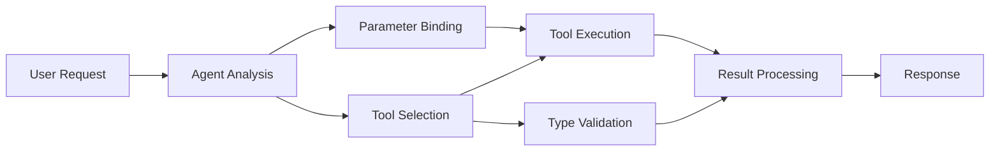

<!--
CO_OP_TRANSLATOR_METADATA:
{
  "original_hash": "91d6061e402489603f2ec8b528cae59b",
  "translation_date": "2025-11-18T18:42:31+00:00",
  "source_file": "04-tool-use/code_samples/04-dotnet-agent-framework.md",
  "language_code": "ta"
}
-->
# 🛠️ GitHub மாடல்களுடன் மேம்பட்ட கருவி பயன்பாடு (.NET)

## 📋 கற்றல் நோக்கங்கள்

இந்த நோட்புக் Microsoft Agent Framework-ஐ .NET-இல் GitHub மாடல்களுடன் பயன்படுத்தி நிறுவன தரமான கருவி ஒருங்கிணைப்பு முறைகளை விளக்குகிறது. பல சிறப்பு கருவிகளுடன் மேம்பட்ட முகவர்களை உருவாக்குவது, C#-இன் வலுவான டைப் மற்றும் .NET-இன் நிறுவன அம்சங்களை பயன்படுத்துவது எப்படி என்பதை நீங்கள் கற்றுக்கொள்வீர்கள்.

### நீங்கள் கற்றுக்கொள்ளும் மேம்பட்ட கருவி திறன்கள்

- 🔧 **பல கருவி கட்டமைப்பு**: பல சிறப்பு திறன்களுடன் முகவர்களை உருவாக்குதல்
- 🎯 **வகை-பாதுகாப்பான கருவி செயல்பாடு**: C#-இன் தொகுப்பு நேர சரிபார்ப்பை பயன்படுத்துதல்
- 📊 **நிறுவன கருவி முறைகள்**: உற்பத்தி-தயார் கருவி வடிவமைப்பு மற்றும் பிழை கையாளுதல்
- 🔗 **கருவி இணைப்பு**: சிக்கலான வணிக வேலைப்பாடுகளுக்கான கருவிகளை இணைத்தல்

## 🎯 .NET கருவி கட்டமைப்பின் நன்மைகள்

### நிறுவன கருவி அம்சங்கள்

- **தொகுப்பு நேர சரிபார்ப்பு**: வலுவான டைப்பிங் கருவி அளவுரு சரியானதை உறுதிப்படுத்துகிறது
- **இணைப்பு சார்பு ஊர்ஜிதம்**: IoC கொண்டெய்னர் ஒருங்கிணைப்பு கருவி மேலாண்மைக்காக
- **அசிங்க/காத்திருப்பு முறைகள்**: சரியான வள மேலாண்மையுடன் தடை இல்லாத கருவி செயல்பாடு
- **கட்டமைக்கப்பட்ட பதிவு**: கருவி செயல்பாட்டு கண்காணிப்புக்கான உள்ளமைக்கப்பட்ட பதிவு ஒருங்கிணைப்பு

### உற்பத்தி-தயார் முறைகள்

- **விலக்கு கையாளுதல்**: வகைப்படுத்தப்பட்ட விலக்குகளுடன் விரிவான பிழை மேலாண்மை
- **வள மேலாண்மை**: சரியான அகற்றல் முறைகள் மற்றும் நினைவக மேலாண்மை
- **செயல்திறன் கண்காணிப்பு**: உள்ளமைக்கப்பட்ட அளவீடுகள் மற்றும் செயல்திறன் கவுண்டர்கள்
- **கட்டமைப்பு மேலாண்மை**: சரிபார்ப்புடன் வகை-பாதுகாப்பான கட்டமைப்பு

## 🔧 தொழில்நுட்ப கட்டமைப்பு

### முக்கிய .NET கருவி கூறுகள்

- **Microsoft.Extensions.AI**: ஒருங்கிணைந்த கருவி சுருக்கலான அடுக்கு
- **Microsoft.Agents.AI**: நிறுவன தரமான கருவி ஒருங்கிணைப்பு
- **GitHub மாடல்கள் ஒருங்கிணைப்பு**: உயர் செயல்திறன் API கிளையன்ட் இணைப்பு குளம்

### கருவி செயல்பாட்டு குழாய்



## 🛠️ கருவி வகைகள் மற்றும் முறைகள்

### 1. **தரவு செயலாக்க கருவிகள்**

- **உள்ளீடு சரிபார்ப்பு**: தரவுக் குறிப்புகளுடன் வலுவான டைப்பிங்
- **மாற்று செயல்பாடுகள்**: வகை-பாதுகாப்பான தரவு மாற்றம் மற்றும் வடிவமைப்பு
- **வணிக தர்க்கம்**: துறை சார்ந்த கணக்கீடு மற்றும் பகுப்பாய்வு கருவிகள்
- **வெளியீடு வடிவமைப்பு**: கட்டமைக்கப்பட்ட பதில் உருவாக்கம்

### 2. **ஒருங்கிணைப்பு கருவிகள்**

- **API இணைப்பாளர்கள்**: RESTful சேவை ஒருங்கிணைப்பு HttpClient உடன்
- **தரவுத்தளம் கருவிகள்**: Entity Framework ஒருங்கிணைப்பு தரவினை அணுக
- **கோப்பு செயல்பாடுகள்**: சரிபார்ப்புடன் பாதுகாப்பான கோப்பு அமைப்பு செயல்பாடுகள்
- **வெளியக சேவைகள்**: மூன்றாம் தரப்பு சேவை ஒருங்கிணைப்பு முறைகள்

### 3. **உதவிக்கருவிகள்**

- **உரை செயலாக்கம்**: சரம் மாற்றம் மற்றும் வடிவமைப்பு உதவிகள்
- **தேதி/நேர செயல்பாடுகள்**: கலாச்சாரம்-அறிந்த தேதி/நேர கணக்கீடுகள்
- **கணித கருவிகள்**: துல்லியமான கணக்கீடுகள் மற்றும் புள்ளியியல் செயல்பாடுகள்
- **சரிபார்ப்பு கருவிகள்**: வணிக விதி சரிபார்ப்பு மற்றும் தரவுச் சரிபார்ப்பு

நிறுவன தரமான முகவர்களை வலுவான, வகை-பாதுகாப்பான கருவி திறன்களுடன் .NET-இல் உருவாக்க தயாரா? சில தொழில்முறை தரமான தீர்வுகளை வடிவமைப்போம்! 🏢⚡

## 🚀 தொடங்குதல்

### முன் தேவைகள்

- [.NET 10 SDK](https://dotnet.microsoft.com/download/dotnet/10.0) அல்லது அதற்கு மேல்
- [GitHub மாடல்கள் API அணுகல் டோக்கன்](https://docs.github.com/github-models/github-models-at-scale/using-your-own-api-keys-in-github-models)

### தேவையான சூழல் மாறிகள்

```bash
# zsh/bash
export GH_TOKEN=<your_github_token>
export GH_ENDPOINT=https://models.github.ai/inference
export GH_MODEL_ID=openai/gpt-5-mini
```

```powershell
# PowerShell
$env:GH_TOKEN = "<your_github_token>"
$env:GH_ENDPOINT = "https://models.github.ai/inference"
$env:GH_MODEL_ID = "openai/gpt-5-mini"
```

### மாதிரி குறியீடு

குறியீடு எடுத்துக்காட்டை இயக்க,

```bash
# zsh/bash
chmod +x ./04-dotnet-agent-framework.cs
./04-dotnet-agent-framework.cs
```

அல்லது dotnet CLI-ஐப் பயன்படுத்தி:

```bash
dotnet run ./04-dotnet-agent-framework.cs
```

முழு குறியீட்டிற்கான [`04-dotnet-agent-framework.cs`](../../../../04-tool-use/code_samples/04-dotnet-agent-framework.cs) ஐப் பார்க்கவும்.

```csharp
#!/usr/bin/dotnet run

#:package Microsoft.Extensions.AI@10.*
#:package Microsoft.Agents.AI.OpenAI@1.*-*

using System.ClientModel;
using System.ComponentModel;

using Microsoft.Agents.AI;
using Microsoft.Extensions.AI;

using OpenAI;

// Tool Function: Random Destination Generator
// This static method will be available to the agent as a callable tool
// The [Description] attribute helps the AI understand when to use this function
// This demonstrates how to create custom tools for AI agents
[Description("Provides a random vacation destination.")]
static string GetRandomDestination()
{
    // List of popular vacation destinations around the world
    // The agent will randomly select from these options
    var destinations = new List<string>
    {
        "Paris, France",
        "Tokyo, Japan",
        "New York City, USA",
        "Sydney, Australia",
        "Rome, Italy",
        "Barcelona, Spain",
        "Cape Town, South Africa",
        "Rio de Janeiro, Brazil",
        "Bangkok, Thailand",
        "Vancouver, Canada"
    };

    // Generate random index and return selected destination
    // Uses System.Random for simple random selection
    var random = new Random();
    int index = random.Next(destinations.Count);
    return destinations[index];
}

// Extract configuration from environment variables
// Retrieve the GitHub Models API endpoint, defaults to https://models.github.ai/inference if not specified
// Retrieve the model ID, defaults to openai/gpt-5-mini if not specified
// Retrieve the GitHub token for authentication, throws exception if not specified
var github_endpoint = Environment.GetEnvironmentVariable("GH_ENDPOINT") ?? "https://models.github.ai/inference";
var github_model_id = Environment.GetEnvironmentVariable("GH_MODEL_ID") ?? "openai/gpt-5-mini";
var github_token = Environment.GetEnvironmentVariable("GH_TOKEN") ?? throw new InvalidOperationException("GH_TOKEN is not set.");

// Configure OpenAI Client Options
// Create configuration options to point to GitHub Models endpoint
// This redirects OpenAI client calls to GitHub's model inference service
var openAIOptions = new OpenAIClientOptions()
{
    Endpoint = new Uri(github_endpoint)
};

// Initialize OpenAI Client with GitHub Models Configuration
// Create OpenAI client using GitHub token for authentication
// Configure it to use GitHub Models endpoint instead of OpenAI directly
var openAIClient = new OpenAIClient(new ApiKeyCredential(github_token), openAIOptions);

// Define Agent Identity and Comprehensive Instructions
// Agent name for identification and logging purposes
var AGENT_NAME = "TravelAgent";

// Detailed instructions that define the agent's personality, capabilities, and behavior
// This system prompt shapes how the agent responds and interacts with users
var AGENT_INSTRUCTIONS = """
You are a helpful AI Agent that can help plan vacations for customers.

Important: When users specify a destination, always plan for that location. Only suggest random destinations when the user hasn't specified a preference.

When the conversation begins, introduce yourself with this message:
"Hello! I'm your TravelAgent assistant. I can help plan vacations and suggest interesting destinations for you. Here are some things you can ask me:
1. Plan a day trip to a specific location
2. Suggest a random vacation destination
3. Find destinations with specific features (beaches, mountains, historical sites, etc.)
4. Plan an alternative trip if you don't like my first suggestion

What kind of trip would you like me to help you plan today?"

Always prioritize user preferences. If they mention a specific destination like "Bali" or "Paris," focus your planning on that location rather than suggesting alternatives.
""";

// Create AI Agent with Advanced Travel Planning Capabilities
// Initialize complete agent pipeline: OpenAI client → Chat client → AI agent
// Configure agent with name, detailed instructions, and available tools
// This demonstrates the .NET agent creation pattern with full configuration
AIAgent agent = openAIClient
    .GetChatClient(github_model_id)
    .CreateAIAgent(
        name: AGENT_NAME,
        instructions: AGENT_INSTRUCTIONS,
        tools: [AIFunctionFactory.Create(GetRandomDestination)]
    );

// Create New Conversation Thread for Context Management
// Initialize a new conversation thread to maintain context across multiple interactions
// Threads enable the agent to remember previous exchanges and maintain conversational state
// This is essential for multi-turn conversations and contextual understanding
AgentThread thread = agent.GetNewThread();

// Execute Agent: First Travel Planning Request
// Run the agent with an initial request that will likely trigger the random destination tool
// The agent will analyze the request, use the GetRandomDestination tool, and create an itinerary
// Using the thread parameter maintains conversation context for subsequent interactions
await foreach (var update in agent.RunStreamingAsync("Plan me a day trip", thread))
{
    await Task.Delay(10);
    Console.Write(update);
}

Console.WriteLine();

// Execute Agent: Follow-up Request with Context Awareness
// Demonstrate contextual conversation by referencing the previous response
// The agent remembers the previous destination suggestion and will provide an alternative
// This showcases the power of conversation threads and contextual understanding in .NET agents
await foreach (var update in agent.RunStreamingAsync("I don't like that destination. Plan me another vacation.", thread))
{
    await Task.Delay(10);
    Console.Write(update);
}
```

---

<!-- CO-OP TRANSLATOR DISCLAIMER START -->
**குறிப்பு**:  
இந்த ஆவணம் AI மொழிபெயர்ப்பு சேவை [Co-op Translator](https://github.com/Azure/co-op-translator) பயன்படுத்தி மொழிபெயர்க்கப்பட்டுள்ளது. நாங்கள் துல்லியத்திற்காக முயற்சிக்கிறோம், ஆனால் தானியங்கி மொழிபெயர்ப்புகளில் பிழைகள் அல்லது தவறுகள் இருக்கக்கூடும் என்பதை கவனத்தில் கொள்ளவும். அதன் தாய்மொழியில் உள்ள மூல ஆவணம் அதிகாரப்பூர்வ ஆதாரமாக கருதப்பட வேண்டும். முக்கியமான தகவல்களுக்கு, தொழில்முறை மனித மொழிபெயர்ப்பு பரிந்துரைக்கப்படுகிறது. இந்த மொழிபெயர்ப்பைப் பயன்படுத்துவதால் ஏற்படும் எந்த தவறான புரிதல்கள் அல்லது தவறான விளக்கங்களுக்கு நாங்கள் பொறுப்பல்ல.
<!-- CO-OP TRANSLATOR DISCLAIMER END -->