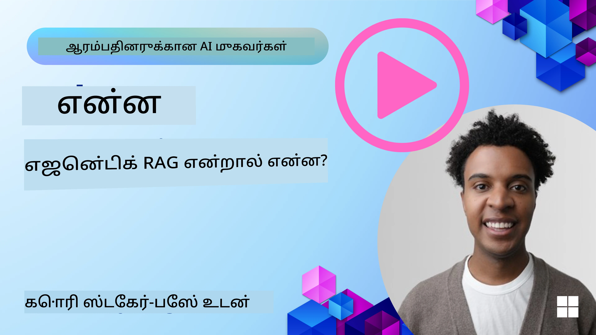
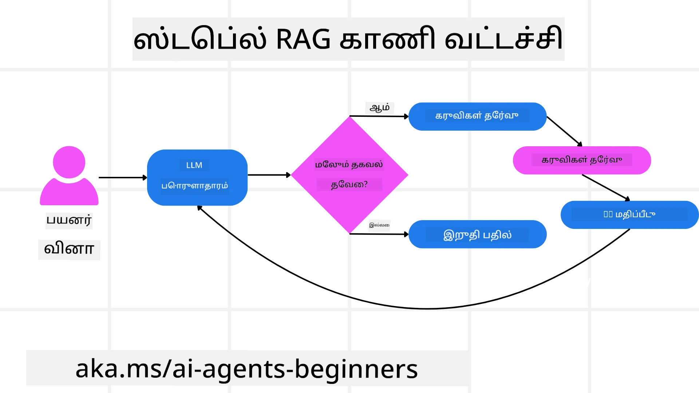
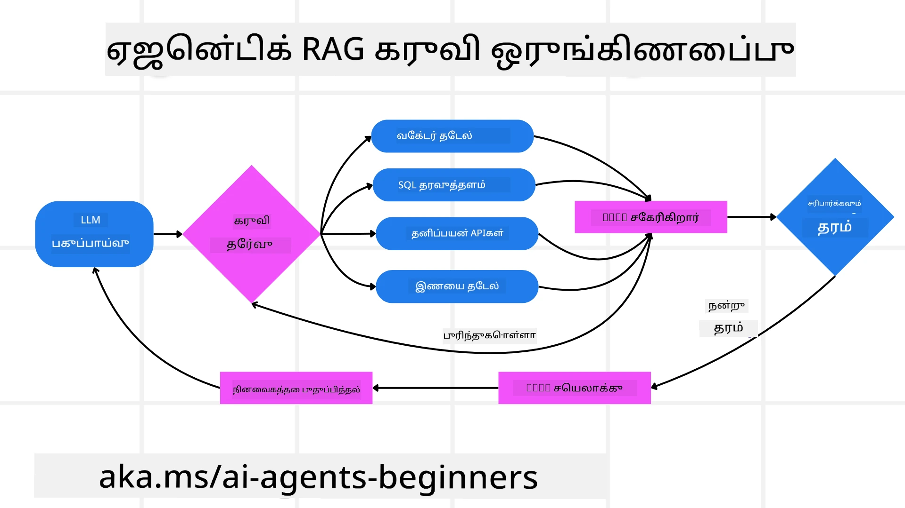
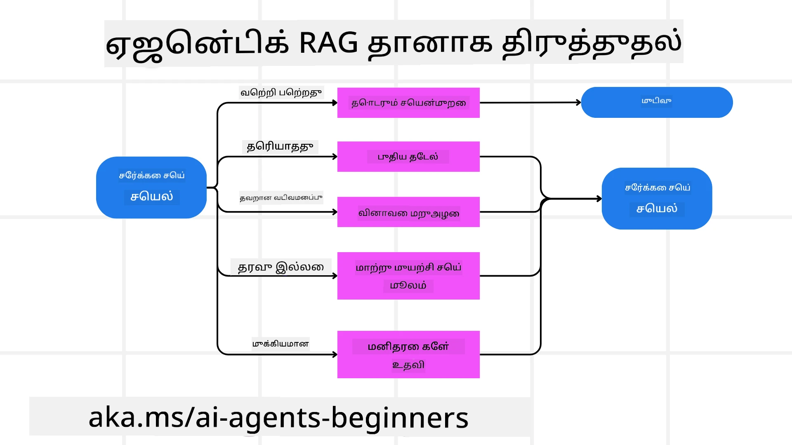

<!--
CO_OP_TRANSLATOR_METADATA:
{
  "original_hash": "0ebf6b2290db55dbf2d10cc49655523b",
  "translation_date": "2025-10-11T11:04:26+00:00",
  "source_file": "05-agentic-rag/README.md",
  "language_code": "ta"
}
-->

> _(மேலே உள்ள படத்தை கிளிக் செய்து இந்த பாடத்தின் வீடியோவைப் பாருங்கள்)_

# Agentic RAG

இந்த பாடம் Agentic Retrieval-Augmented Generation (Agentic RAG) பற்றிய விரிவான விளக்கத்தை வழங்குகிறது. இது ஒரு புதிய AI முறை, இதில் பெரிய மொழி மாதிரிகள் (LLMs) தானாகவே தங்களது அடுத்த படிகளை திட்டமிடுகின்றன மற்றும் வெளிப்புற தகவல் மூலங்களிலிருந்து தகவல்களை பெறுகின்றன. நிலையான retrieval-then-read முறைகளுக்கு மாறாக, Agentic RAG LLM-க்கு மீண்டும் மீண்டும் அழைப்புகளைச் செய்யும், அதற்கிடையில் கருவி அல்லது செயல்பாட்டு அழைப்புகள் மற்றும் அமைப்பான வெளியீடுகளைச் சேர்க்கும். இந்த அமைப்பு முடிவுகளை மதிப்பீடு செய்கிறது, கேள்விகளை மேம்படுத்துகிறது, தேவையானால் கூடுதல் கருவிகளை அழைக்கிறது, மற்றும் திருப்திகரமான தீர்வை அடையும் வரை இந்த சுழற்சியை தொடர்கிறது.

## அறிமுகம்

இந்த பாடத்தில் நீங்கள் கற்றுக்கொள்ளப் போகிறீர்கள்:

- **Agentic RAG-ஐ புரிந்து கொள்ளுங்கள்:** பெரிய மொழி மாதிரிகள் (LLMs) தானாகவே தங்களது அடுத்த படிகளை திட்டமிடுகின்றன மற்றும் வெளிப்புற தகவல் மூலங்களிலிருந்து தகவல்களை பெறுகின்றன என்ற புதிய AI முறையைப் பற்றி அறியுங்கள்.
- **Iterative Maker-Checker முறை:** LLM-க்கு மீண்டும் மீண்டும் அழைப்புகளைச் செய்யும், அதற்கிடையில் கருவி அல்லது செயல்பாட்டு அழைப்புகள் மற்றும் அமைப்பான வெளியீடுகளைச் சேர்க்கும் முறை, தவறான கேள்விகளைச் சரிசெய்யவும், சரியான முடிவுகளை வழங்கவும் வடிவமைக்கப்பட்டுள்ளது.
- **நடைமுறை பயன்பாடுகள்:** Agentic RAG சிறப்பாக செயல்படும் சூழல்களை, உதாரணமாக, சரியான முடிவுகளை முதலில் பெற வேண்டிய சூழல்கள், சிக்கலான தரவுத்தொகுப்பு தொடர்புகள், மற்றும் நீண்டகால வேலைப்பாடுகளை அடையாளம் காணுங்கள்.

## கற்றல் இலக்குகள்

இந்த பாடத்தை முடித்த பிறகு, நீங்கள் கற்றுக்கொள்ளும்/புரிந்துகொள்ளும்:

- **Agentic RAG-ஐ புரிந்து கொள்ளுங்கள்:** பெரிய மொழி மாதிரிகள் (LLMs) தானாகவே தங்களது அடுத்த படிகளை திட்டமிடுகின்றன மற்றும் வெளிப்புற தகவல் மூலங்களிலிருந்து தகவல்களை பெறுகின்றன என்ற புதிய AI முறையைப் பற்றி அறியுங்கள்.
- **Iterative Maker-Checker முறை:** தவறான கேள்விகளைச் சரிசெய்யவும், சரியான முடிவுகளை வழங்கவும் வடிவமைக்கப்பட்ட LLM-க்கு மீண்டும் மீண்டும் அழைப்புகளைச் செய்யும் முறை.
- **காரணத்தை தானாகவே நிர்வகிக்கவும்:** முன்கூட்டியே வரையறுக்கப்பட்ட பாதைகளில் நம்பிக்கையில்லாமல், பிரச்சினைகளை அணுகுவதற்கான முடிவுகளை அமைப்பு தானாகவே எடுக்கும் திறனைப் புரிந்துகொள்ளுங்கள்.
- **வேலைப்பாடு:** ஒரு agentic மாதிரி தானாகவே சந்தை போக்குவரத்து அறிக்கைகளை பெறுவது, போட்டியாளர்களின் தரவுகளை அடையாளம் காணுவது, உள்நாட்டு விற்பனை அளவுகோல்களை தொடர்புபடுத்துவது, கண்டுபிடிப்புகளை ஒருங்கிணைத்தல், மற்றும் உத்தியை மதிப்பீடு செய்வது போன்ற செயல்பாடுகளை எப்படி முடிவெடுக்கிறது என்பதைப் புரிந்துகொள்ளுங்கள்.
- **Iterative loops, கருவி ஒருங்கிணைப்பு, மற்றும் நினைவகம்:** மீண்டும் மீண்டும் தொடர்பு கொள்ளும் முறை, நிலை மற்றும் நினைவகத்தை பராமரிக்கிறது, மற்றும் தகவல்களை அடிப்படையாகக் கொண்டு முடிவுகளை எடுக்கும் திறனைப் பற்றி கற்றுக்கொள்ளுங்கள்.
- **தவறுகளைச் சமாளிக்கவும் மற்றும் தானாகவே திருத்தவும்:** தவறுகளைச் சமாளிக்கவும், திருத்தவும், மற்றும் மனித மேற்பார்வையை நம்பவும் அமைப்பின் திறனை ஆராயுங்கள்.
- **Agentic RAG-இன் வரையறைகள்:** துறைக்கு சார்ந்த தானியக்கத்திற்கான வரம்புகள், உள்கட்டமைப்பு சார்ந்த திறன்கள், மற்றும் பாதுகாப்பு வழிகாட்டுதல்களைப் பற்றிய புரிதலைப் பெறுங்கள்.
- **நடைமுறை பயன்பாடுகள் மற்றும் மதிப்பு:** Agentic RAG சிறப்பாக செயல்படும் சூழல்களை, உதாரணமாக, சரியான முடிவுகளை முதலில் பெற வேண்டிய சூழல்கள், சிக்கலான தரவுத்தொகுப்பு தொடர்புகள், மற்றும் நீண்டகால வேலைப்பாடுகளை அடையாளம் காணுங்கள்.
- **ஆட்சி, வெளிப்படைத்தன்மை, மற்றும் நம்பிக்கை:** ஆட்சி மற்றும் வெளிப்படைத்தன்மையின் முக்கியத்துவத்தை, விளக்கமான காரணங்களை, பாகுபாடு கட்டுப்பாட்டை, மற்றும் மனித மேற்பார்வையைப் பற்றி கற்றுக்கொள்ளுங்கள்.

## Agentic RAG என்றால் என்ன?

Agentic Retrieval-Augmented Generation (Agentic RAG) என்பது ஒரு புதிய AI முறை, இதில் பெரிய மொழி மாதிரிகள் (LLMs) தானாகவே தங்களது அடுத்த படிகளை திட்டமிடுகின்றன மற்றும் வெளிப்புற தகவல் மூலங்களிலிருந்து தகவல்களை பெறுகின்றன. நிலையான retrieval-then-read முறைகளுக்கு மாறாக, Agentic RAG LLM-க்கு மீண்டும் மீண்டும் அழைப்புகளைச் செய்யும், அதற்கிடையில் கருவி அல்லது செயல்பாட்டு அழைப்புகள் மற்றும் அமைப்பான வெளியீடுகளைச் சேர்க்கும். இந்த அமைப்பு முடிவுகளை மதிப்பீடு செய்கிறது, கேள்விகளை மேம்படுத்துகிறது, தேவையானால் கூடுதல் கருவிகளை அழைக்கிறது, மற்றும் திருப்திகரமான தீர்வை அடையும் வரை இந்த சுழற்சியை தொடர்கிறது. 

இந்த iterative “maker-checker” முறை சரியான முடிவுகளை மேம்படுத்தவும், தவறான கேள்விகளைச் சமாளிக்கவும், மற்றும் தரமான முடிவுகளை உறுதிப்படுத்தவும் வடிவமைக்கப்பட்டுள்ளது. அமைப்பு தானாகவே தனது காரணத்தை நிர்வகிக்கிறது, தோல்வியடைந்த கேள்விகளை மறுபதிவு செய்கிறது, வேறு retrieval முறைகளைத் தேர்ந்தெடுக்கிறது, மற்றும் பல கருவிகளை ஒருங்கிணைக்கிறது—Azure AI Search இல் vector search, SQL தரவுத்தொகுப்புகள், அல்லது custom APIs போன்றவை—தனது இறுதி பதிலை முடிவுறுத்துவதற்கு முன். 

## Agentic Retrieval-Augmented Generation (Agentic RAG) வரையறை

Agentic Retrieval-Augmented Generation (Agentic RAG) என்பது AI வளர்ச்சியில் ஒரு புதிய முறை, இதில் LLMs வெளிப்புற தரவுத் மூலங்களிலிருந்து தகவல்களைப் பெறுவதுடன் தங்களது அடுத்த படிகளை தானாகவே திட்டமிடுகின்றன. நிலையான retrieval-then-read முறைகள் அல்லது கவனமாக வடிவமைக்கப்பட்ட prompt வரிசைகளுக்கு மாறாக, Agentic RAG LLM-க்கு மீண்டும் மீண்டும் அழைப்புகளைச் செய்யும், அதற்கிடையில் கருவி அல்லது செயல்பாட்டு அழைப்புகள் மற்றும் அமைப்பான வெளியீடுகளைச் சேர்க்கும். 

இந்த iterative “maker-checker” முறை சரியான முடிவுகளை மேம்படுத்தவும், தவறான கேள்விகளைச் சமாளிக்கவும், மற்றும் தரமான முடிவுகளை உறுதிப்படுத்தவும் வடிவமைக்கப்பட்டுள்ளது. அமைப்பு தானாகவே தனது காரணத்தை நிர்வகிக்கிறது, தோல்வியடைந்த கேள்விகளை மறுபதிவு செய்கிறது, வேறு retrieval முறைகளைத் தேர்ந்தெடுக்கிறது, மற்றும் பல கருவிகளை ஒருங்கிணைக்கிறது—Azure AI Search இல் vector search, SQL தரவுத்தொகுப்புகள், அல்லது custom APIs போன்றவை—தனது இறுதி பதிலை முடிவுறுத்துவதற்கு முன். 

## காரணத்தை தானாகவே நிர்வகிக்கவும்

ஒரு அமைப்பை “agentic” ஆக ஆக்கும் தனித்துவமான தரம் அதன் காரணத்தை தானாகவே நிர்வகிக்கக்கூடிய திறன். பாரம்பரிய RAG செயல்பாடுகள் பெரும்பாலும் மனிதர்களால் முன்கூட்டியே வரையறுக்கப்பட்ட பாதையில் நம்பிக்கையுடன் செயல்படுகின்றன: retrieve செய்ய வேண்டியவை மற்றும் retrieve செய்ய வேண்டிய நேரம் போன்றவற்றைத் தீர்மானிக்கும் chain-of-thought. 

ஆனால் ஒரு அமைப்பு உண்மையாகவே agentic ஆக இருந்தால், அது பிரச்சினையை எப்படி அணுகுவது என்பதை உள்ளார்ந்த முறையில் தீர்மானிக்கிறது. இது ஒரு script ஐ செயல்படுத்துவது மட்டுமல்ல; அது கண்டுபிடித்த தகவலின் தரத்தை அடிப்படையாகக் கொண்டு படிகளின் வரிசையை தானாகவே தீர்மானிக்கிறது. 

உதாரணமாக, ஒரு தயாரிப்பு வெளியீட்டு உத்தியை உருவாக்குமாறு கேட்கப்பட்டால், அது முழு ஆராய்ச்சி மற்றும் முடிவெடுக்கும் வேலைப்பாட்டை விளக்கும் prompt-ல் மட்டும் நம்பிக்கையுடன் இருக்காது. மாறாக, agentic மாதிரி தானாகவே முடிவெடுக்கிறது:

1. Bing Web Grounding மூலம் தற்போதைய சந்தை போக்குவரத்து அறிக்கைகளை retrieve செய்கிறது.
2. Azure AI Search மூலம் தொடர்புடைய போட்டியாளர்களின் தரவுகளை அடையாளம் காண்கிறது.
3. Azure SQL Database மூலம் வரலாற்று உள்நாட்டு விற்பனை அளவுகோல்களை தொடர்புபடுத்துகிறது.
4. Azure OpenAI Service மூலம் ஒருங்கிணைக்கப்பட்ட உத்தியை உருவாக்குகிறது.
5. உத்தியில் உள்ள இடைவெளிகள் அல்லது முரண்பாடுகளை மதிப்பீடு செய்கிறது, மேலும் retrieve செய்யும் சுற்றத்தைத் தொடங்குகிறது.

இந்த அனைத்து படிகளும்—கேள்விகளை மேம்படுத்துதல், மூலங்களைத் தேர்ந்தெடுத்தல், “சந்தோஷமாக” பதிலுடன் திருப்தி அடையும் வரை iterate செய்தல்—மாதிரியின் முடிவுகள், மனிதனால் முன்கூட்டியே script செய்யப்படவில்லை.

## Iterative Loops, கருவி ஒருங்கிணைப்பு, மற்றும் நினைவகம்

ஒரு agentic அமைப்பு looped தொடர்பு முறைமையில் நம்பிக்கையுடன் செயல்படுகிறது:

- **ஆரம்ப அழைப்பு:** பயனர் நோக்கம் (aka. user prompt) LLM-க்கு வழங்கப்படுகிறது.
- **கருவி அழைப்பு:** மாதிரி காணாமல் போன தகவல் அல்லது குழப்பமான வழிமுறைகளை அடையாளம் காண்கிறது என்றால், அது ஒரு கருவி அல்லது retrieval முறையைத் தேர்ந்தெடுக்கிறது—உதாரணமாக vector database query (e.g. Azure AI Search Hybrid search over private data) அல்லது structured SQL call—மேலும் சூழலைப் பெற.
- **மதிப்பீடு மற்றும் மேம்பாடு:** திரும்பிய தரவைக் கண்காணித்த பிறகு, மாதிரி தகவல் போதுமானதா என்பதைத் தீர்மானிக்கிறது. இல்லையெனில், அது கேள்வியை மேம்படுத்துகிறது, வேறு கருவியை முயற்சிக்கிறது, அல்லது தனது அணுகுமுறையை சரிசெய்கிறது.
- **திருப்தி அடையும் வரை மீண்டும் செய்யுங்கள்:** இந்த சுழற்சி மாதிரி தெளிவும் ஆதாரமும் போதுமானதாக இருக்கிறது என்று தீர்மானிக்கும் வரை தொடர்கிறது.
- **நினைவகம் மற்றும் நிலை:** அமைப்பு நிலை மற்றும் நினைவகத்தை பராமரிக்கிறது, இது முந்தைய முயற்சிகளை மற்றும் அவற்றின் முடிவுகளை நினைவில் கொள்கிறது, மீண்டும் மீண்டும் சுழற்சிகளைத் தவிர்க்கிறது மற்றும் மேலும் தகவல்களை அடிப்படையாகக் கொண்டு முடிவுகளை எடுக்கிறது.

காலப்போக்கில், இது ஒரு வளர்ச்சியடைந்த புரிதலின் உணர்வை உருவாக்குகிறது, இது மனிதன் தொடர்ந்து தலையீடு செய்யவோ அல்லது prompt-ஐ மறுவடிவமைக்கவோ தேவையில்லாமல், சிக்கலான, பல-படிகள் கொண்ட பணிகளைச் செயல்படுத்த உதவுகிறது.

## தவறுகளைச் சமாளிக்கவும் மற்றும் தானாகவே திருத்தவும்

Agentic RAG-இன் தானியக்கத்திற்கான திறன் வலுவான தானாகவே திருத்தும் முறைகளை உள்ளடக்கியது. அமைப்பு முட்டுக்கட்டைகளுக்கு மோதும் போது—உதாரணமாக தொடர்பற்ற ஆவணங்களை retrieve செய்தல் அல்லது தவறான கேள்விகளைச் சந்தித்தல்—அது:

- **மீண்டும் முயற்சிக்கவும் மற்றும் re-query செய்யவும்:** குறைந்த மதிப்புள்ள பதில்களைத் திருப்புவதற்கு பதிலாக, மாதிரி புதிய தேடல் உத்திகளை முயற்சிக்கிறது, தரவுத்தொகுப்பு கேள்விகளை மறுபதிவு செய்கிறது, அல்லது மாற்று தரவுத்தொகுப்புகளைப் பார்க்கிறது.
- **Diagnostic கருவிகளைப் பயன்படுத்தவும்:** அமைப்பு தனது reasoning படிகளை debug செய்ய அல்லது retrieve செய்யப்பட்ட தரவின் சரியானதன்மையை உறுதிப்படுத்த உதவுவதற்காக கூடுதல் செயல்பாடுகளை அழைக்கலாம். Azure AI Tracing போன்ற கருவிகள் வலுவான கண்காணிப்பு மற்றும் கண்காணிப்பை இயக்க முக்கியமாக இருக்கும்.
- **மனித மேற்பார்வையை நம்புங்கள்:** உயர்-மதிப்புள்ள அல்லது மீண்டும் மீண்டும் தோல்வியடையும் சூழல்களில், மாதிரி uncertainty-ஐ flag செய்கிறது மற்றும் மனித வழிகாட்டுதலைக் கோருகிறது. மனிதன் சரிசெய்த பின்னூட்டத்தை வழங்கிய பிறகு, மாதிரி அந்த பாடத்தை எதிர்காலத்தில் இணைக்க முடியும்.

இந்த iterative மற்றும் dynamic அணுகுமுறை மாதிரியை தொடர்ந்து மேம்படுத்த அனுமதிக்கிறது, இது ஒரு ஒரே-முறை அமைப்பாக மட்டுமல்ல, ஒரு session-இல் தனது தவறுகளிலிருந்து கற்றுக்கொள்கிறது.

## தானியக்கத்தின் வரையறைகள்

ஒரு task-இல் தானியக்கத்திற்குப் பிறகும், Agentic RAG Artificial General Intelligence-க்கு ஒப்பானது அல்ல. அதன் “agentic” திறன்கள் மனித developers வழங்கிய கருவிகள், தரவுத் மூலங்கள், மற்றும் கொள்கைகளுக்கு மட்டுமே கட்டுப்படுத்தப்பட்டுள்ளன. அது தனது சொந்த கருவிகளை உருவாக்க முடியாது அல்லது அமைக்கப்பட்ட domain வரம்புகளை மீற முடியாது. மாறாக, அது கையிலுள்ள வளங்களை தானாகவே ஒருங்கிணைக்க சிறப்பாக செயல்படுகிறது.

மேம்பட்ட AI வடிவங்களிலிருந்து முக்கிய வேறுபாடுகள்:

1. **துறைக்கு சார்ந்த தானியக்கம்:** Agentic RAG அமைப்புகள் ஒரு அறியப்பட்ட domain-இல் பயனர் வரையறுக்கப்பட்ட இலக்குகளை அடைய கவனமாக செயல்படுகின்றன, query மறுபதிவு அல்லது கருவி தேர்வு போன்ற உத்திகளைப் பயன்படுத்தி முடிவுகளை மேம்படுத்துகின்றன.
2. **உள்கட்டமைப்பு சார்ந்தது:** அமைப்பின் திறன்கள் developers இணைத்த கருவிகள் மற்றும் தரவுகளின் மீது சார்ந்துள்ளது. மனித தலையீடு இல்லாமல் இந்த வரம்புகளை மீற முடியாது.
3. **வழிகாட்டுதல்களை மதிக்கவும்:** நெறிமுறைகள், ஒழுங்குமுறை விதிகள், மற்றும் வணிக கொள்கைகள் மிகவும் முக்கியமாகவே இருக்கும். agent-இன் சுதந்திரம் எப்போதும் பாதுகாப்பு நடவடிக்கைகள் மற்றும் மேற்பார்வை முறைகளால் கட்டுப்படுத்தப்படும் (நம்புகிறீர்களா?).

## நடைமுறை பயன்பாடுகள் மற்றும் மதிப்பு

Agentic RAG iterative refinement மற்றும் துல்லியத்தை தேவைப்படும் சூழல்களில் சிறப்பாக செயல்படுகிறது:

1. **சரியான முடிவுகளை முதலில் பெற வேண்டிய சூழல்கள்:** ஒழுங்குமுறை சரிபார்ப்புகள், ஒழுங்குமுறை பகுப்பாய்வு, அல்லது சட்ட ஆராய்ச்சி போன்றவற்றில், agentic மாதிரி மீண்டும் மீண்டும் உண்மைகளைச் சரிபார்க்க, பல மூலங்களை அணுக, மற்றும் முழுமையாக சரிபார்க்கப்பட்ட பதிலை உருவாக்க query-களை மறுபதிவு செய்ய முடியும்.
2. **சிக்கலான தரவுத்தொகுப்பு தொடர்புகள்:** SQL அல்லது Microsoft Fabric OneLake போன்ற structured data-ஐச் சமாளிக்கும் போது, query-கள் அடிக்கடி தோல்வியடையலாம் அல்லது சரிசெய்யப்பட வேண்டும். அமைப்பு தானாகவே Azure SQL-ஐப் பயன்படுத்தி query-களை மேம்படுத்தி, இறுதி retrieve பயனர் நோக்கத்துடன் ஒத்துப்போகும் என்பதை உறுதிப்படுத்துகிறது.
3. **நீண்டகால வேலைப்பாடுகள்:** புதிய தகவல்கள் வெளிப்படும்போது, நீண்டகால session-கள் மாறலாம். Agentic RAG தொடர்ந்து புதிய தரவுகளைச் சேர்க்க முடியும், மேலும் பிரச்சினை இடத்தைப் பற்றி மேலும் கற்றுக்கொண்டபோது உத்திகளை மாற்ற முடியும்.

## ஆட்சி, வெளிப்படைத்தன்மை, மற்றும் நம்பிக்கை

இந்த அமைப்புகள் reasoning-இல் மேலும் தானியக்கமாக மாறும்போது, ஆட்சி மற்றும் வெளிப்படைத்தன்மை மிகவும் முக்கியமாகிறது:

- **விளக்கமான reasoning:** மாதிரி செய்த query-கள், அணுகிய மூலங்கள், மற்றும் முடிவுக்கு வந்த reasoning படிகள் ஆகியவற்றின் audit trail-ஐ வழங்க முடியும். Azure AI Content Safety மற்றும் Azure AI Tracing / GenAIOps போன்ற கருவிகள் வெளிப்படைத்தன்மையை பராமரிக்கவும் மற்றும் அபாயங்களை குறைக்கவும் உதவுகின்றன.
- **பாகுபாடு கட்டுப்பாடு மற்றும் சமநிலையான retrieve:** Developers retrieve உத்திகளை fine-tune செய்ய முடியும், சமநிலையான, பிரதிநிதித்துவ தரவுத் மூலங்கள் கருதப்படுவதை உறுதிப்படுத்தவும், மற்றும் bias அல்லது skewed patterns-ஐ கண்டறிய outputs-ஐ முறையாக audit செய்ய முடியும்.
- **மனித மேற்பார்வை மற்றும் ஒழுங்குமுறை:** நெகிழ்ச்சியான பணிகளுக்கு, மனித மதிப்பீடு அவசியமாகவே இருக்கும். Agentic RAG உயர்-மதிப்புள்ள முடிவுகளில் மனித தீர்மானத்தை மாற்றாது—அது மேலும் முழுமையாக சரிபார்க்கப்பட்ட விருப்பங்களை வழங்குவதன் மூலம் அதை மேம்படுத்துகிறது.

செயல்பாடுகளின் தெளிவான பதிவுகளை வழங்கும் கருவிகள் அவசியமாகவே இருக்கும். அவற்றின்றி, பல-படிகள் கொண்ட
- <a href="https://ragaboutit.com/agentic-rag-a-complete-guide-to-agent-based-retrieval-augmented-generation/" target="_blank">Agentic RAG: முகவரியை அடிப்படையாகக் கொண்ட Retrieval Augmented Generation பற்றிய முழுமையான வழிகாட்டி – generation RAG-இல் இருந்து செய்திகள்</a>
- <a href="https://huggingface.co/learn/cookbook/agent_rag" target="_blank">Agentic RAG: உங்கள் RAG-ஐ கேள்வி மறுசீரமைப்பு மற்றும் சுய-கேள்வியுடன் வேகமாக மாற்றுங்கள்! Hugging Face திறந்த மூல AI சமையல் புத்தகம்</a>
- <a href="https://youtu.be/aQ4yQXeB1Ss?si=2HUqBzHoeB5tR04U" target="_blank">RAG-க்கு Agentic அடுக்குகளைச் சேர்த்தல்</a>
- <a href="https://www.youtube.com/watch?v=zeAyuLc_f3Q&t=244s" target="_blank">அறிவின் உதவியாளர்களின் எதிர்காலம்: ஜெர்ரி லியூ</a>
- <a href="https://www.youtube.com/watch?v=AOSjiXP1jmQ" target="_blank">Agentic RAG அமைப்புகளை உருவாக்குவது எப்படி</a>
- <a href="https://ignite.microsoft.com/sessions/BRK102?source=sessions" target="_blank">Azure AI Foundry Agent Service-ஐப் பயன்படுத்தி உங்கள் AI முகவரிகளை அளவிடுதல்</a>

### கல்வி ஆய்வுகள்

- <a href="https://arxiv.org/abs/2303.17651" target="_blank">2303.17651 Self-Refine: சுய-கருத்து மூலம் மீண்டும் திருத்துதல்</a>
- <a href="https://arxiv.org/abs/2303.11366" target="_blank">2303.11366 Reflexion: மொழி முகவரிகள் வாய்மொழி வலுப்படுத்தல் கற்றலுடன்</a>
- <a href="https://arxiv.org/abs/2305.11738" target="_blank">2305.11738 CRITIC: பெரிய மொழி மாதிரிகள் கருவி-இணைய செயல்பாடுகளுடன் சுய திருத்தம் செய்ய முடியும்</a>
- <a href="https://arxiv.org/abs/2501.09136" target="_blank">2501.09136 Agentic Retrieval-Augmented Generation: Agentic RAG பற்றிய ஆய்வு</a>

## முந்தைய பாடம்

[கருவி பயன்பாட்டு வடிவமைப்பு முறை](../04-tool-use/README.md)

## அடுத்த பாடம்

[நம்பகமான AI முகவரிகளை உருவாக்குதல்](../06-building-trustworthy-agents/README.md)

---

**அறிவிப்பு**:  
இந்த ஆவணம் [Co-op Translator](https://github.com/Azure/co-op-translator) என்ற AI மொழிபெயர்ப்பு சேவையை பயன்படுத்தி மொழிபெயர்க்கப்பட்டுள்ளது. நாங்கள் துல்லியத்திற்காக முயற்சிக்கிறோம், ஆனால் தானியங்கி மொழிபெயர்ப்புகளில் பிழைகள் அல்லது தவறுகள் இருக்கக்கூடும் என்பதை கவனத்தில் கொள்ளவும். அதன் சொந்த மொழியில் உள்ள மூல ஆவணம் அதிகாரப்பூர்வ ஆதாரமாக கருதப்பட வேண்டும். முக்கியமான தகவல்களுக்கு, தொழில்முறை மனித மொழிபெயர்ப்பு பரிந்துரைக்கப்படுகிறது. இந்த மொழிபெயர்ப்பைப் பயன்படுத்துவதால் ஏற்படும் எந்த தவறான புரிதல்களுக்கும் அல்லது தவறான விளக்கங்களுக்கும் நாங்கள் பொறுப்பல்ல.