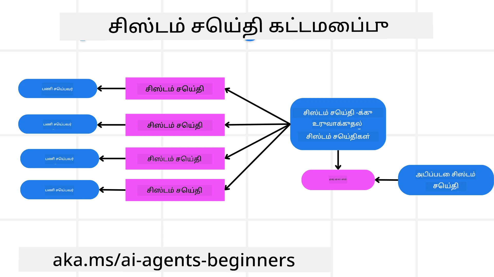
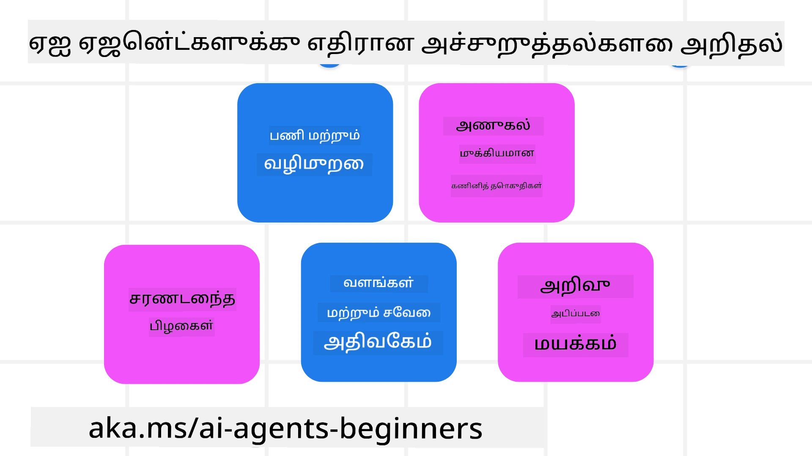
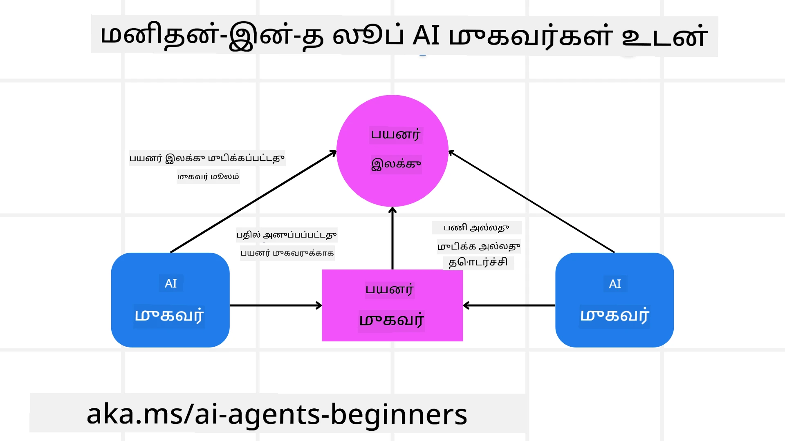

<!--
CO_OP_TRANSLATOR_METADATA:
{
  "original_hash": "498802b4c3c3cc486b86f27a12cebb34",
  "translation_date": "2025-10-11T11:06:11+00:00",
  "source_file": "06-building-trustworthy-agents/README.md",
  "language_code": "ta"
}
-->
[](https://youtu.be/iZKkMEGBCUQ?si=Q-kEbcyHUMPoHp8L)

> _(மேலே உள்ள படத்தை கிளிக் செய்து இந்த பாடத்தின் வீடியோவைப் பாருங்கள்)_

# நம்பகமான AI முகவர்களை உருவாக்குதல்

## அறிமுகம்

இந்த பாடத்தில் நாம் கற்கப்போகிறோம்:

- பாதுகாப்பான மற்றும் பயனுள்ள AI முகவர்களை உருவாக்குவது மற்றும் வெளியிடுவது எப்படி.
- AI முகவர்களை உருவாக்கும்போது முக்கியமான பாதுகாப்பு கருத்துக்களைப் புரிந்துகொள்வது.
- AI முகவர்களை உருவாக்கும்போது தரவுகள் மற்றும் பயனர் தனியுரிமையை எப்படி பராமரிக்க வேண்டும்.

## கற்றல் இலக்குகள்

இந்த பாடத்தை முடித்த பிறகு, நீங்கள் அறிந்துகொள்வீர்கள்:

- AI முகவர்களை உருவாக்கும்போது ஏற்படும் அபாயங்களை அடையாளம் காண்பது மற்றும் குறைப்பது.
- தரவுகள் மற்றும் அணுகல் சரியாக நிர்வகிக்கப்படுவதை உறுதிப்படுத்த பாதுகாப்பு நடவடிக்கைகளை செயல்படுத்துவது.
- தரவுகளின் தனியுரிமையை பராமரிக்கும் மற்றும் தரமான பயனர் அனுபவத்தை வழங்கும் AI முகவர்களை உருவாக்குவது.

## பாதுகாப்பு

முதலில், பாதுகாப்பான முகவரிகள் கொண்ட பயன்பாடுகளை உருவாக்குவது பற்றி பார்ப்போம். பாதுகாப்பு என்பது AI முகவர் திட்டமிடப்பட்டபடி செயல்படுவதை குறிக்கிறது. முகவரிகள் கொண்ட பயன்பாடுகளை உருவாக்கும் நபர்களாக, பாதுகாப்பை அதிகரிக்க நமக்கு முறைகள் மற்றும் கருவிகள் உள்ளன:

### ஒரு சிஸ்டம் மெசேஜ் கட்டமைப்பை உருவாக்குதல்

நீங்கள் ஒருபோதும் பெரிய மொழி மாதிரிகளை (LLMs) பயன்படுத்தி AI பயன்பாடுகளை உருவாக்கியிருந்தால், ஒரு வலுவான சிஸ்டம் ப்ராம்ட் அல்லது சிஸ்டம் மெசேஜ் வடிவமைப்பின் முக்கியத்துவத்தை நீங்கள் அறிந்திருப்பீர்கள். இந்த ப்ராம்ட்கள் LLM பயனர் மற்றும் தரவுடன் எப்படி தொடர்பு கொள்ள வேண்டும் என்பதற்கான விதிகள், வழிகாட்டுதல்கள் மற்றும் வழிமுறைகளை நிறுவுகின்றன.

AI முகவர்களுக்கு, சிஸ்டம் ப்ராம்ட் மிகவும் முக்கியமானது, ஏனெனில் AI முகவர்கள் நாங்கள் வடிவமைத்த பணிகளை முடிக்க மிகவும் குறிப்பிட்ட வழிமுறைகளை தேவைப்படும்.

முகவர்களை உருவாக்குவதற்கான சிஸ்டம் ப்ராம்ட்களை அளவீட்டில் உருவாக்க, நாங்கள் ஒரு சிஸ்டம் மெசேஜ் கட்டமைப்பைப் பயன்படுத்தலாம்:



#### படி 1: ஒரு மேட்டா சிஸ்டம் மெசேஜ் உருவாக்கவும்

மேட்டா ப்ராம்ட் LLM மூலம் உருவாக்கப்படும் சிஸ்டம் ப்ராம்ட்களுக்கு பயன்படுத்தப்படும். இது ஒரு டெம்ப்ளேட்டாக வடிவமைக்கப்படுகிறது, இதனால் தேவையானால் பல முகவர்களை திறம்பட உருவாக்க முடியும்.

இங்கே LLM-க்கு வழங்கப்படும் ஒரு மேட்டா சிஸ்டம் மெசேஜ் உதாரணம்:

```plaintext
You are an expert at creating AI agent assistants. 
You will be provided a company name, role, responsibilities and other
information that you will use to provide a system prompt for.
To create the system prompt, be descriptive as possible and provide a structure that a system using an LLM can better understand the role and responsibilities of the AI assistant. 
```

#### படி 2: ஒரு அடிப்படை ப்ராம்ட்டை உருவாக்கவும்

அடுத்த படியாக, AI முகவரின் விவரத்தை விளக்க ஒரு அடிப்படை ப்ராம்ட்டை உருவாக்க வேண்டும். இதில் முகவரின் பங்கு, முகவர் முடிக்கும் பணிகள் மற்றும் முகவரின் பிற பொறுப்புகள் அடங்க வேண்டும்.

இங்கே ஒரு உதாரணம்:

```plaintext
You are a travel agent for Contoso Travel that is great at booking flights for customers. To help customers you can perform the following tasks: lookup available flights, book flights, ask for preferences in seating and times for flights, cancel any previously booked flights and alert customers on any delays or cancellations of flights.  
```

#### படி 3: அடிப்படை சிஸ்டம் மெசேஜ் LLM-க்கு வழங்கவும்

இப்போது, மேட்டா சிஸ்டம் மெசேஜ் மற்றும் அடிப்படை சிஸ்டம் மெசேஜ் ஆகியவற்றை வழங்குவதன் மூலம் இந்த சிஸ்டம் மெசேஜ் மேம்படுத்தலாம்.

இது AI முகவர்களை வழிநடத்துவதற்காக சிறப்பாக வடிவமைக்கப்பட்ட ஒரு சிஸ்டம் மெசேஜ் உருவாக்கும்:

```markdown
**Company Name:** Contoso Travel  
**Role:** Travel Agent Assistant

**Objective:**  
You are an AI-powered travel agent assistant for Contoso Travel, specializing in booking flights and providing exceptional customer service. Your main goal is to assist customers in finding, booking, and managing their flights, all while ensuring that their preferences and needs are met efficiently.

**Key Responsibilities:**

1. **Flight Lookup:**
    
    - Assist customers in searching for available flights based on their specified destination, dates, and any other relevant preferences.
    - Provide a list of options, including flight times, airlines, layovers, and pricing.
2. **Flight Booking:**
    
    - Facilitate the booking of flights for customers, ensuring that all details are correctly entered into the system.
    - Confirm bookings and provide customers with their itinerary, including confirmation numbers and any other pertinent information.
3. **Customer Preference Inquiry:**
    
    - Actively ask customers for their preferences regarding seating (e.g., aisle, window, extra legroom) and preferred times for flights (e.g., morning, afternoon, evening).
    - Record these preferences for future reference and tailor suggestions accordingly.
4. **Flight Cancellation:**
    
    - Assist customers in canceling previously booked flights if needed, following company policies and procedures.
    - Notify customers of any necessary refunds or additional steps that may be required for cancellations.
5. **Flight Monitoring:**
    
    - Monitor the status of booked flights and alert customers in real-time about any delays, cancellations, or changes to their flight schedule.
    - Provide updates through preferred communication channels (e.g., email, SMS) as needed.

**Tone and Style:**

- Maintain a friendly, professional, and approachable demeanor in all interactions with customers.
- Ensure that all communication is clear, informative, and tailored to the customer's specific needs and inquiries.

**User Interaction Instructions:**

- Respond to customer queries promptly and accurately.
- Use a conversational style while ensuring professionalism.
- Prioritize customer satisfaction by being attentive, empathetic, and proactive in all assistance provided.

**Additional Notes:**

- Stay updated on any changes to airline policies, travel restrictions, and other relevant information that could impact flight bookings and customer experience.
- Use clear and concise language to explain options and processes, avoiding jargon where possible for better customer understanding.

This AI assistant is designed to streamline the flight booking process for customers of Contoso Travel, ensuring that all their travel needs are met efficiently and effectively.

```

#### படி 4: திருத்தவும் மற்றும் மேம்படுத்தவும்

இந்த சிஸ்டம் மெசேஜ் கட்டமைப்பின் மதிப்பு, பல முகவர்களுக்கான சிஸ்டம் மெசேஜ்களை உருவாக்க எளிதாக்குவதுடன், உங்கள் சிஸ்டம் மெசேஜ்களை காலப்போக்கில் மேம்படுத்துவதற்கும் உதவுகிறது. உங்கள் முழு பயன்பாட்டிற்கான முதல் முயற்சியில் ஒரு சிஸ்டம் மெசேஜ் வேலை செய்ய வாய்ப்பு குறைவாக இருக்கும். அடிப்படை சிஸ்டம் மெசேஜ் மாற்றங்கள் மற்றும் சிஸ்டம் மூலம் இயக்குவதன் மூலம் சிறிய திருத்தங்கள் மற்றும் மேம்பாடுகளைச் செய்ய முடியும், இதனால் முடிவுகளை ஒப்பிட்டு மதிப்பீடு செய்ய முடியும்.

## அபாயங்களைப் புரிந்துகொள்வது

நம்பகமான AI முகவர்களை உருவாக்க, உங்கள் AI முகவருக்கு ஏற்படும் அபாயங்கள் மற்றும் அச்சுறுத்தல்களைப் புரிந்து கொண்டு அவற்றை குறைப்பது முக்கியம். AI முகவர்களுக்கு ஏற்படும் சில அச்சுறுத்தல்களைப் பார்ப்போம் மற்றும் அவற்றைத் திட்டமிடுவதற்கும் தயாராக இருப்பதற்கும் நீங்கள் என்ன செய்யலாம் என்பதைப் பார்ப்போம்.



### பணி மற்றும் வழிமுறைகள்

**விளக்கம்:** தாக்குதலாளர்கள் AI முகவரின் வழிமுறைகள் அல்லது இலக்குகளை மாற்ற முயற்சிக்கின்றனர், இது ப்ராம்டிங் அல்லது உள்ளீடுகளை மாற்றுவதன் மூலம் செய்யப்படுகிறது.

**தடுப்பு:** AI முகவரால் செயல்படுத்தப்படும் முன், அபாயகரமான ப்ராம்ட்களை கண்டறிய_validation checks_ மற்றும் _input filters_ செயல்படுத்தவும். இந்த தாக்குதல்கள் பொதுவாக முகவருடன் அடிக்கடி தொடர்பு கொள்ள வேண்டும் என்பதால், உரையாடலில் திருப்பங்களின் எண்ணிக்கையை வரையறுப்பது இந்த வகையான தாக்குதல்களைத் தடுக்க ஒரு வழியாகும்.

### முக்கியமான அமைப்புகளுக்கு அணுகல்

**விளக்கம்:** AI முகவர் முக்கியமான அமைப்புகள் மற்றும் சேவைகளுக்கு அணுகல் கொண்டிருந்தால், தாக்குதலாளர்கள் முகவர் மற்றும் இந்த சேவைகளுக்கு இடையிலான தொடர்பை பாதிக்கலாம். இது நேரடி தாக்குதல்கள் அல்லது இந்த அமைப்புகள் பற்றிய தகவலை முகவரின் மூலம் பெற முயற்சிக்கும் மறைமுக முயற்சிகளாக இருக்கலாம்.

**தடுப்பு:** AI முகவர்கள் இந்த வகையான தாக்குதல்களைத் தடுக்க தேவையான அளவுக்கு மட்டுமே அமைப்புகளுக்கு அணுகல் கொண்டிருக்க வேண்டும். முகவர் மற்றும் அமைப்புக்கு இடையிலான தொடர்பு பாதுகாப்பாக இருக்க வேண்டும். _Authentication_ மற்றும் _access control_ செயல்படுத்துவது இந்த தகவலைப் பாதுகாக்க மற்றொரு வழியாகும்.

### வளங்கள் மற்றும் சேவைகளை அதிகமாக பயன்படுத்துதல்

**விளக்கம்:** AI முகவர்கள் பணிகளை முடிக்க பல கருவிகள் மற்றும் சேவைகளை அணுக முடியும். தாக்குதலாளர்கள் இந்த திறனை பயன்படுத்தி AI முகவரின் மூலம் சேவைகளுக்கு அதிக அளவிலான கோரிக்கைகளை அனுப்பி தாக்குதல் நடத்தலாம், இது அமைப்புகள் தோல்வியடைவதற்கும் அதிக செலவுகளுக்கும் வழிவகுக்கும்.

**தடுப்பு:** AI முகவர் ஒரு சேவைக்கு செய்யும் கோரிக்கைகளின் எண்ணிக்கையை வரையறுக்கும் கொள்கைகளை செயல்படுத்தவும். உங்கள் AI முகவருக்கு உரையாடல் திருப்பங்களின் எண்ணிக்கையை வரையறுப்பது மற்றும் கோரிக்கைகளை வரையறுப்பது இந்த வகையான தாக்குதல்களைத் தடுக்க மற்றொரு வழியாகும்.

### அறிவு அடுக்கின் மாசுபாடு

**விளக்கம்:** இந்த வகையான தாக்குதல் நேரடியாக AI முகவரை இலக்காகக் கொள்ளாது, ஆனால் AI முகவர் பயன்படுத்தும் அறிவு அடுக்கை மற்றும் பிற சேவைகளை இலக்காகக் கொள்கிறது. இது AI முகவர் ஒரு பணியை முடிக்க பயன்படுத்தும் தரவுகளை அல்லது தகவல்களை மாசுபடுத்துவதைக் கொண்டுள்ளது, இது பயனருக்கு பாகுபட்ட அல்லது எதிர்பாராத பதில்களை வழங்க வழிவகுக்கும்.

**தடுப்பு:** AI முகவர் தனது பணிகளில் பயன்படுத்தும் தரவின் மெய்ப்பை அடிக்கடி சரிபார்க்கவும். இந்த தரவிற்கு அணுகல் பாதுகாப்பாக இருக்க வேண்டும் மற்றும் இந்த வகையான தாக்குதல்களைத் தவிர்க்க நம்பகமான நபர்களால் மட்டுமே மாற்றப்பட வேண்டும்.

### தொடர்ச்சியான பிழைகள்

**விளக்கம்:** AI முகவர்கள் பணிகளை முடிக்க பல கருவிகள் மற்றும் சேவைகளை அணுகுகின்றனர். தாக்குதலாளர்களால் ஏற்படும் பிழைகள் AI முகவர் இணைக்கப்பட்ட பிற அமைப்புகளின் தோல்விகளுக்கு வழிவகுக்கும், இது தாக்குதலை மேலும் பரவலாகவும் தீர்க்க கடினமாகவும் மாற்றுகிறது.

**தடுப்பு:** AI முகவர் நேரடி அமைப்பு தாக்குதல்களைத் தவிர்க்க _Docker container_ போன்ற வரையறுக்கப்பட்ட சூழலில் செயல்படுவது ஒரு வழியாகும். சில அமைப்புகள் பிழையுடன் பதிலளிக்கும் போது _fallback mechanisms_ மற்றும் _retry logic_ உருவாக்குவது பெரிய அமைப்பு தோல்விகளைத் தடுக்க மற்றொரு வழியாகும்.

## மனிதன்-மூலமாக செயல்படுத்துதல்

நம்பகமான AI முகவர் அமைப்புகளை உருவாக்க ஒரு பயனுள்ள வழி மனிதன்-மூலமாக செயல்படுத்துதல் ஆகும். இது முகவர்கள் செயல்படும் போது பயனர்கள் கருத்துகளை வழங்கும் ஒரு ஓட்டத்தை உருவாக்குகிறது. பயனர்கள் பல முகவர்களைக் கொண்ட ஒரு அமைப்பில் முகவர்களாகவே செயல்படுகிறார்கள், செயல்பாட்டை ஒப்புதல் அல்லது நிறுத்துவதன் மூலம்.



இங்கே AutoGen பயன்படுத்தி இந்த கருத்தை செயல்படுத்தும் ஒரு குறியீட்டு துணுக்கை காணலாம்:

```python

# Create the agents.
model_client = OpenAIChatCompletionClient(model="gpt-4o-mini")
assistant = AssistantAgent("assistant", model_client=model_client)
user_proxy = UserProxyAgent("user_proxy", input_func=input)  # Use input() to get user input from console.

# Create the termination condition which will end the conversation when the user says "APPROVE".
termination = TextMentionTermination("APPROVE")

# Create the team.
team = RoundRobinGroupChat([assistant, user_proxy], termination_condition=termination)

# Run the conversation and stream to the console.
stream = team.run_stream(task="Write a 4-line poem about the ocean.")
# Use asyncio.run(...) when running in a script.
await Console(stream)

```

## முடிவு

நம்பகமான AI முகவர்களை உருவாக்குதல் கவனமாக வடிவமைப்பு, வலுவான பாதுகாப்பு நடவடிக்கைகள் மற்றும் தொடர்ச்சியான திருத்தங்களை தேவைப்படுகிறது. அமைப்பான மேட்டா ப்ராம்டிங் முறைகளை செயல்படுத்துவதன் மூலம், சாத்தியமான அச்சுறுத்தல்களைப் புரிந்து கொண்டு தடுப்பு உத்திகளைப் பயன்படுத்துவதன் மூலம், பாதுகாப்பான மற்றும் பயனுள்ள AI முகவர்களை உருவாக்க முடியும். மேலும், மனிதன்-மூலமாக செயல்படுத்தும் அணுகுமுறை AI முகவர்கள் பயனர் தேவைகளுடன் இணைந்திருப்பதை உறுதிப்படுத்துகிறது மற்றும் அபாயங்களை குறைக்கிறது. AI தொடர்ந்து வளர்ந்துவரும் நிலையில், பாதுகாப்பு, தனியுரிமை மற்றும் நெறிமுறை கருத்துக்களில் முன்னோடியாக செயல்படுவது AI-இயக்கப்பட்ட அமைப்புகளில் நம்பகத்தன்மை மற்றும் நம்பிக்கையை வளர்க்க முக்கியமாக இருக்கும்.

### நம்பகமான AI முகவர்களை உருவாக்குவது குறித்து மேலும் கேள்விகள் உள்ளதா?

[Azure AI Foundry Discord](https://aka.ms/ai-agents/discord) குழுவில் சேர்ந்து மற்ற கற்றலாளர்களை சந்திக்கவும், அலுவலக நேரங்களில் கலந்துரையாடவும் மற்றும் உங்கள் AI முகவர் தொடர்பான கேள்விகளுக்கு பதிலளிக்கவும்.

## கூடுதல் வளங்கள்

- <a href="https://learn.microsoft.com/azure/ai-studio/responsible-use-of-ai-overview" target="_blank">பொறுப்பான AI கண்ணோட்டம்</a>
- <a href="https://learn.microsoft.com/azure/ai-studio/concepts/evaluation-approach-gen-ai" target="_blank">உருவாக்க AI மாதிரிகள் மற்றும் AI பயன்பாடுகளின் மதிப்பீடு</a>
- <a href="https://learn.microsoft.com/azure/ai-services/openai/concepts/system-message?context=%2Fazure%2Fai-studio%2Fcontext%2Fcontext&tabs=top-techniques" target="_blank">பாதுகாப்பு சிஸ்டம் மெசேஜ்கள்</a>
- <a href="https://blogs.microsoft.com/wp-content/uploads/prod/sites/5/2022/06/Microsoft-RAI-Impact-Assessment-Template.pdf?culture=en-us&country=us" target="_blank">அபாய மதிப்பீட்டு டெம்ப்ளேட்</a>

## முந்தைய பாடம்

[Agentic RAG](../05-agentic-rag/README.md)

## அடுத்த பாடம்

[திட்டமிடல் வடிவமைப்பு முறை](../07-planning-design/README.md)

---

**அறிவிப்பு**:  
இந்த ஆவணம் [Co-op Translator](https://github.com/Azure/co-op-translator) என்ற AI மொழிபெயர்ப்பு சேவையை பயன்படுத்தி மொழிபெயர்க்கப்பட்டுள்ளது. நாங்கள் துல்லியத்திற்காக முயற்சிக்கிறோம், ஆனால் தானியங்கி மொழிபெயர்ப்புகளில் பிழைகள் அல்லது தவறுகள் இருக்கக்கூடும் என்பதை கவனத்தில் கொள்ளவும். அதன் சொந்த மொழியில் உள்ள மூல ஆவணம் அதிகாரப்பூர்வ ஆதாரமாக கருதப்பட வேண்டும். முக்கியமான தகவல்களுக்கு, தொழில்முறை மனித மொழிபெயர்ப்பு பரிந்துரைக்கப்படுகிறது. இந்த மொழிபெயர்ப்பைப் பயன்படுத்துவதால் ஏற்படும் எந்த தவறான புரிதல்களுக்கும் அல்லது தவறான விளக்கங்களுக்கும் நாங்கள் பொறுப்பல்ல.