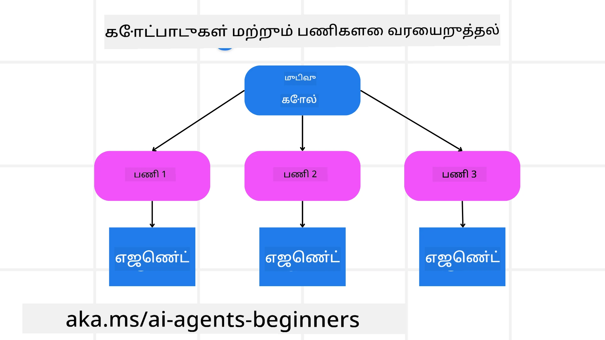

<!--
CO_OP_TRANSLATOR_METADATA:
{
  "original_hash": "43069833a0412210ad5c3cc93d9c2146",
  "translation_date": "2025-10-11T11:23:36+00:00",
  "source_file": "07-planning-design/README.md",
  "language_code": "ta"
}
-->
[](https://youtu.be/kPfJ2BrBCMY?si=9pYpPXp0sSbK91Dr)

> _(மேலே உள்ள படத்தை கிளிக் செய்து இந்த பாடத்தின் வீடியோவைப் பாருங்கள்)_

# திட்டமிடல் வடிவமைப்பு

## அறிமுகம்

இந்த பாடத்தில் நாம் கற்கப்போகிறோம்:

* ஒரு தெளிவான மொத்த இலக்கை வரையறுத்து, சிக்கலான பணியை நிர்வகிக்கக்கூடிய பணிகளாக பிரித்தல்.
* அமைப்பான வெளியீட்டை பயன்படுத்தி நம்பகமான மற்றும் இயந்திரத்தால் வாசிக்கக்கூடிய பதில்களை உருவாக்குதல்.
* நிகழ்வு சார்ந்த அணுகுமுறையை பயன்படுத்தி மாறும் பணிகள் மற்றும் எதிர்பாராத உள்ளீடுகளை கையாளுதல்.

## கற்கும் இலக்குகள்

இந்த பாடத்தை முடித்த பிறகு, நீங்கள் புரிந்துகொள்ளக்கூடியதாக இருக்கும்:

* AI முகவருக்கு ஒரு மொத்த இலக்கை அடையாளம் காணவும், அது எதை அடைய வேண்டும் என்பதை தெளிவாக அறியச் செய்யவும்.
* சிக்கலான பணியை நிர்வகிக்கக்கூடிய துணைப் பணிகளாக பிரித்து, அவற்றை ஒரு தர்க்கரீதியான வரிசையில் ஒழுங்குபடுத்தவும்.
* முகவர்களுக்கு சரியான கருவிகளை (எ.கா., தேடல் கருவிகள் அல்லது தரவுப் பகுப்பாய்வு கருவிகள்) வழங்கி, அவற்றை எப்போது மற்றும் எப்படி பயன்படுத்த வேண்டும் என்பதை முடிவு செய்து, ஏற்படும் எதிர்பாராத சூழல்களை கையாளவும்.
* துணைப் பணிகளின் முடிவுகளை மதிப்பீடு செய்து, செயல்திறனை அளந்து, இறுதி வெளியீட்டை மேம்படுத்த நடவடிக்கைகளை திருத்தவும்.

## மொத்த இலக்கை வரையறுத்தல் மற்றும் பணியை பிரித்தல்



அதிகபட்சம் உண்மையான உலக பணிகள் ஒரு படியில் கையாள முடியாத அளவுக்கு சிக்கலானவை. AI முகவருக்கு அதன் திட்டமிடல் மற்றும் செயல்பாடுகளை வழிநடத்த ஒரு சுருக்கமான இலக்கு தேவை. உதாரணமாக, இந்த இலக்கை எடுத்துக்கொள்ளுங்கள்:

    "3 நாள் பயண திட்டத்தை உருவாக்கவும்."

இது கூற எளிதானதாக இருந்தாலும், இது இன்னும் சீரமைக்கப்பட வேண்டும். இலக்கு எவ்வளவு தெளிவாக இருக்கிறதோ, முகவர் (மற்றும் எந்த மனித ஒத்துழைப்பாளர்களும்) சரியான முடிவை அடைய கவனம் செலுத்த முடியும், உதாரணமாக, விமான விருப்பங்கள், ஹோட்டல் பரிந்துரைகள் மற்றும் செயல்பாட்டு பரிந்துரைகளுடன் ஒரு விரிவான திட்டத்தை உருவாக்குதல்.

### பணியை துணைப் பணிகளாக பிரித்தல்

பெரிய அல்லது சிக்கலான பணிகள் சிறிய, இலக்கு சார்ந்த துணைப் பணிகளாக பிரிக்கப்பட்டால் நிர்வகிக்கக்கூடியதாக மாறுகின்றன. பயண திட்டத்தின் உதாரணத்திற்கு, நீங்கள் இலக்கை பின்வருமாறு பிரிக்கலாம்:

* விமான முன்பதிவு
* ஹோட்டல் முன்பதிவு
* கார் வாடகை
* தனிப்பயனாக்கல்

ஒவ்வொரு துணைப் பணியும் தனித்துவமான முகவர்கள் அல்லது செயல்முறைகளால் கையாளப்படலாம். ஒரு முகவர் சிறந்த விமான சலுகைகளை தேடுவதில் நிபுணத்துவம் பெற்றிருக்கலாம், மற்றொன்று ஹோட்டல் முன்பதிவுகளில் கவனம் செலுத்தலாம், இப்படி தொடரலாம். ஒருங்கிணைக்கும் அல்லது “கீழ்நிலை” முகவர் இந்த முடிவுகளை ஒரே மொத்த பயண திட்டமாக இறுதி பயனர் வரை தொகுத்து வழங்கலாம்.

இந்த தொகுதி அணுகுமுறை படிப்படியாக மேம்பாடுகளை செய்யவும் அனுமதிக்கிறது. உதாரணமாக, உணவு பரிந்துரைகள் அல்லது உள்ளூர் செயல்பாட்டு பரிந்துரைகளுக்கான நிபுணத்துவ முகவர்களைச் சேர்த்து, திட்டத்தை காலப்போக்கில் மேம்படுத்தலாம்.

### அமைப்பான வெளியீடு

பெரிய மொழி மாதிரிகள் (LLMs) அமைப்பான வெளியீட்டை (எ.கா., JSON) உருவாக்க முடியும், இது கீழ்நிலை முகவர்கள் அல்லது சேவைகள் எளிதாக பகுப்பாய்வு செய்து செயல்படுத்த உதவுகிறது. இது பல முகவர் சூழலில் மிகவும் பயனுள்ளதாக உள்ளது, எப்போது திட்டமிடல் வெளியீடு கிடைக்கிறதோ அப்போது இந்த பணிகளை செயல்படுத்த முடியும். ஒரு விரைவான கண்ணோட்டத்திற்காக இந்த <a href="https://microsoft.github.io/autogen/stable/user-guide/core-user-guide/cookbook/structured-output-agent.html" target="_blank">வலைப்பதிவை</a> பார்க்கவும்.

கீழே உள்ள Python குறியீடு ஒரு எளிய திட்டமிடல் முகவர் இலக்கை துணைப் பணிகளாக பிரித்து அமைப்பான திட்டத்தை உருவாக்குவதைக் காட்டுகிறது:

```python
from pydantic import BaseModel
from enum import Enum
from typing import List, Optional, Union
import json
import os
from typing import Optional
from pprint import pprint
from autogen_core.models import UserMessage, SystemMessage, AssistantMessage
from autogen_ext.models.azure import AzureAIChatCompletionClient
from azure.core.credentials import AzureKeyCredential

class AgentEnum(str, Enum):
    FlightBooking = "flight_booking"
    HotelBooking = "hotel_booking"
    CarRental = "car_rental"
    ActivitiesBooking = "activities_booking"
    DestinationInfo = "destination_info"
    DefaultAgent = "default_agent"
    GroupChatManager = "group_chat_manager"

# Travel SubTask Model
class TravelSubTask(BaseModel):
    task_details: str
    assigned_agent: AgentEnum  # we want to assign the task to the agent

class TravelPlan(BaseModel):
    main_task: str
    subtasks: List[TravelSubTask]
    is_greeting: bool

client = AzureAIChatCompletionClient(
    model="gpt-4o-mini",
    endpoint="https://models.inference.ai.azure.com",
    # To authenticate with the model you will need to generate a personal access token (PAT) in your GitHub settings.
    # Create your PAT token by following instructions here: https://docs.github.com/en/authentication/keeping-your-account-and-data-secure/managing-your-personal-access-tokens
    credential=AzureKeyCredential(os.environ["GITHUB_TOKEN"]),
    model_info={
        "json_output": False,
        "function_calling": True,
        "vision": True,
        "family": "unknown",
    },
)

# Define the user message
messages = [
    SystemMessage(content="""You are an planner agent.
    Your job is to decide which agents to run based on the user's request.
                      Provide your response in JSON format with the following structure:
{'main_task': 'Plan a family trip from Singapore to Melbourne.',
 'subtasks': [{'assigned_agent': 'flight_booking',
               'task_details': 'Book round-trip flights from Singapore to '
                               'Melbourne.'}
    Below are the available agents specialised in different tasks:
    - FlightBooking: For booking flights and providing flight information
    - HotelBooking: For booking hotels and providing hotel information
    - CarRental: For booking cars and providing car rental information
    - ActivitiesBooking: For booking activities and providing activity information
    - DestinationInfo: For providing information about destinations
    - DefaultAgent: For handling general requests""", source="system"),
    UserMessage(
        content="Create a travel plan for a family of 2 kids from Singapore to Melboune", source="user"),
]

response = await client.create(messages=messages, extra_create_args={"response_format": 'json_object'})

response_content: Optional[str] = response.content if isinstance(
    response.content, str) else None
if response_content is None:
    raise ValueError("Response content is not a valid JSON string" )

pprint(json.loads(response_content))

# # Ensure the response content is a valid JSON string before loading it
# response_content: Optional[str] = response.content if isinstance(
#     response.content, str) else None
# if response_content is None:
#     raise ValueError("Response content is not a valid JSON string")

# # Print the response content after loading it as JSON
# pprint(json.loads(response_content))

# Validate the response content with the MathReasoning model
# TravelPlan.model_validate(json.loads(response_content))
```

### பல முகவர் ஒருங்கிணைப்புடன் திட்டமிடல் முகவர்

இந்த உதாரணத்தில், ஒரு Semantic Router Agent ஒரு பயனர் கோரிக்கையை (எ.கா., "எனது பயணத்திற்கான ஹோட்டல் திட்டம் தேவை.") பெறுகிறது.

திட்டமிடுபவர் பின்னர்:

* ஹோட்டல் திட்டத்தை பெறுதல்: திட்டமிடுபவர் பயனர் செய்தியைப் பெறுகிறார் மற்றும் ஒரு அமைப்பு உந்துதல் (கிடைக்கக்கூடிய முகவர் விவரங்களை உள்ளடக்கியது) அடிப்படையில் ஒரு அமைப்பான பயண திட்டத்தை உருவாக்குகிறார்.
* முகவர்கள் மற்றும் அவர்களின் கருவிகளை பட்டியலிடுதல்: முகவர் பதிவேடு முகவர்களின் பட்டியலை (எ.கா., விமானம், ஹோட்டல், கார் வாடகை மற்றும் செயல்பாடுகள்) மற்றும் அவர்கள் வழங்கும் செயல்பாடுகள் அல்லது கருவிகளை வைத்திருக்கிறது.
* திட்டத்தை தொடர்புடைய முகவர்களுக்கு அனுப்புதல்: துணைப் பணிகளின் எண்ணிக்கையைப் பொறுத்து, திட்டமிடுபவர் செய்தியை நேரடியாக ஒரு தனித்துவமான முகவருக்கு (ஒரே பணிக்கான சூழல்களில்) அனுப்புகிறார் அல்லது பல முகவர் ஒத்துழைப்புக்கான குழு உரையாடல் மேலாளரின் மூலம் ஒருங்கிணைக்கிறார்.
* முடிவை சுருக்குதல்: இறுதியாக, திட்டமிடுபவர் உருவாக்கப்பட்ட திட்டத்தை தெளிவாக சுருக்குகிறார்.
கீழே உள்ள Python குறியீடு இந்த படிகளை விளக்குகிறது:

```python

from pydantic import BaseModel

from enum import Enum
from typing import List, Optional, Union

class AgentEnum(str, Enum):
    FlightBooking = "flight_booking"
    HotelBooking = "hotel_booking"
    CarRental = "car_rental"
    ActivitiesBooking = "activities_booking"
    DestinationInfo = "destination_info"
    DefaultAgent = "default_agent"
    GroupChatManager = "group_chat_manager"

# Travel SubTask Model

class TravelSubTask(BaseModel):
    task_details: str
    assigned_agent: AgentEnum # we want to assign the task to the agent

class TravelPlan(BaseModel):
    main_task: str
    subtasks: List[TravelSubTask]
    is_greeting: bool
import json
import os
from typing import Optional

from autogen_core.models import UserMessage, SystemMessage, AssistantMessage
from autogen_ext.models.openai import AzureOpenAIChatCompletionClient

# Create the client with type-checked environment variables

client = AzureOpenAIChatCompletionClient(
    azure_deployment=os.getenv("AZURE_OPENAI_DEPLOYMENT_NAME"),
    model=os.getenv("AZURE_OPENAI_DEPLOYMENT_NAME"),
    api_version=os.getenv("AZURE_OPENAI_API_VERSION"),
    azure_endpoint=os.getenv("AZURE_OPENAI_ENDPOINT"),
    api_key=os.getenv("AZURE_OPENAI_API_KEY"),
)

from pprint import pprint

# Define the user message

messages = [
    SystemMessage(content="""You are an planner agent.
    Your job is to decide which agents to run based on the user's request.
    Below are the available agents specialized in different tasks:
    - FlightBooking: For booking flights and providing flight information
    - HotelBooking: For booking hotels and providing hotel information
    - CarRental: For booking cars and providing car rental information
    - ActivitiesBooking: For booking activities and providing activity information
    - DestinationInfo: For providing information about destinations
    - DefaultAgent: For handling general requests""", source="system"),
    UserMessage(content="Create a travel plan for a family of 2 kids from Singapore to Melbourne", source="user"),
]

response = await client.create(messages=messages, extra_create_args={"response_format": TravelPlan})

# Ensure the response content is a valid JSON string before loading it

response_content: Optional[str] = response.content if isinstance(response.content, str) else None
if response_content is None:
    raise ValueError("Response content is not a valid JSON string")

# Print the response content after loading it as JSON

pprint(json.loads(response_content))
```

முந்தைய குறியீட்டின் வெளியீடு பின்வருகிறது, இதை `assigned_agent`-க்கு வழிமாற்றி பயனர் வரை பயண திட்டத்தை சுருக்க பயன்படுத்தலாம்.

```json
{
    "is_greeting": "False",
    "main_task": "Plan a family trip from Singapore to Melbourne.",
    "subtasks": [
        {
            "assigned_agent": "flight_booking",
            "task_details": "Book round-trip flights from Singapore to Melbourne."
        },
        {
            "assigned_agent": "hotel_booking",
            "task_details": "Find family-friendly hotels in Melbourne."
        },
        {
            "assigned_agent": "car_rental",
            "task_details": "Arrange a car rental suitable for a family of four in Melbourne."
        },
        {
            "assigned_agent": "activities_booking",
            "task_details": "List family-friendly activities in Melbourne."
        },
        {
            "assigned_agent": "destination_info",
            "task_details": "Provide information about Melbourne as a travel destination."
        }
    ]
}
```

முந்தைய குறியீடு உதாரணத்துடன் ஒரு நோட்புக் [இங்கே](07-autogen.ipynb) கிடைக்கிறது.

### மீண்டும் திட்டமிடல்

சில பணிகள் மீண்டும் திருத்தம் அல்லது மீண்டும் திட்டமிடல் தேவைப்படும், அங்கு ஒரு துணைப் பணியின் முடிவு அடுத்ததைக் பாதிக்கிறது. உதாரணமாக, முகவர் விமானங்களை முன்பதிவு செய்யும் போது எதிர்பாராத தரவுத் வடிவத்தை கண்டறிந்தால், ஹோட்டல் முன்பதிவுக்கு செல்லும் முன் தனது உத்தியை மாற்ற வேண்டியிருக்கும்.

மேலும், பயனர் கருத்து (எ.கா., ஒரு மனிதர் முன்னதாக ஒரு விமானத்தை விரும்புவதாக முடிவு செய்தால்) ஒரு பகுதி மீண்டும் திட்டமிடலைத் தூண்டலாம். இந்த மாறும், மீண்டும் திருத்தும் அணுகுமுறை இறுதி தீர்வு உண்மையான உலக கட்டுப்பாடுகள் மற்றும் மாறும் பயனர் விருப்பங்களுக்கு இணங்க இருப்பதை உறுதிசெய்கிறது.

உதாரணமாக குறியீடு:

```python
from autogen_core.models import UserMessage, SystemMessage, AssistantMessage
#.. same as previous code and pass on the user history, current plan
messages = [
    SystemMessage(content="""You are a planner agent to optimize the
    Your job is to decide which agents to run based on the user's request.
    Below are the available agents specialized in different tasks:
    - FlightBooking: For booking flights and providing flight information
    - HotelBooking: For booking hotels and providing hotel information
    - CarRental: For booking cars and providing car rental information
    - ActivitiesBooking: For booking activities and providing activity information
    - DestinationInfo: For providing information about destinations
    - DefaultAgent: For handling general requests""", source="system"),
    UserMessage(content="Create a travel plan for a family of 2 kids from Singapore to Melbourne", source="user"),
    AssistantMessage(content=f"Previous travel plan - {TravelPlan}", source="assistant")
]
# .. re-plan and send the tasks to respective agents
```

மேலும் விரிவான திட்டமிடலுக்காக, சிக்கலான பணிகளைத் தீர்க்க Magnetic One <a href="https://www.microsoft.com/research/articles/magentic-one-a-generalist-multi-agent-system-for-solving-complex-tasks" target="_blank">வலைப்பதிவை</a> பார்க்கவும்.

## சுருக்கம்

இந்த கட்டுரையில், நாம் கிடைக்கக்கூடிய முகவர்களை வரையறுத்து, தன்னிச்சையாக தேர்ந்தெடுக்கக்கூடிய திட்டமிடுபவரை உருவாக்குவதற்கான ஒரு உதாரணத்தைப் பார்த்தோம். திட்டமிடுபவரின் வெளியீடு பணிகளை துணைப் பணிகளாக பிரித்து, அவற்றை செயல்படுத்த முகவர்களை ஒதுக்குகிறது. முகவர்கள் பணியைச் செய்ய தேவையான செயல்பாடுகள்/கருவிகளுக்கு அணுகல் கொண்டிருப்பது என எதிர்பார்க்கப்படுகிறது. முகவர்களுக்கு கூடுதலாக, பிரதிபலிப்பு, சுருக்கம் மற்றும் ரவுண்ட் ராபின் உரையாடல் போன்ற பிற வடிவங்களைச் சேர்த்து மேலும் தனிப்பயனாக்கலாம்.

## கூடுதல் வளங்கள்

AutoGen Magentic One - சிக்கலான பணிகளைத் தீர்க்க ஒரு பொதுவான பல முகவர் அமைப்பு மற்றும் பல சவாலான முகவர் தரவுத்தொகுப்புகளில் சிறந்த முடிவுகளை அடைந்துள்ளது. குறிப்பு: <a href="https://github.com/microsoft/autogen/tree/main/python/packages/autogen-magentic-one" target="_blank">autogen-magentic-one</a>. இந்த செயல்பாட்டில் ஒருங்கிணைப்பாளர் பணிக்கு குறிப்பிட்ட திட்டத்தை உருவாக்கி, இந்த பணிகளை கிடைக்கக்கூடிய முகவர்களுக்கு ஒதுக்குகிறது. திட்டமிடலுக்கு கூடுதலாக, ஒருங்கிணைப்பாளர் பணியின் முன்னேற்றத்தை கண்காணிக்க ஒரு கண்காணிப்பு முறைமையைப் பயன்படுத்தி, தேவையானபோது மீண்டும் திட்டமிடுகிறது.

### திட்டமிடல் வடிவமைப்பு முறையைப் பற்றி மேலும் கேள்விகள் உள்ளதா?

மற்ற கற்றலாளர்களை சந்திக்க, அலுவலக நேரங்களில் பங்கேற்க மற்றும் உங்கள் AI முகவர் கேள்விகளுக்கு பதிலளிக்க [Azure AI Foundry Discord](https://aka.ms/ai-agents/discord) குழுவில் சேரவும்.

## முந்தைய பாடம்

[நம்பகமான AI முகவர்களை உருவாக்குதல்](../06-building-trustworthy-agents/README.md)

## அடுத்த பாடம்

[பல முகவர் வடிவமைப்பு முறை](../08-multi-agent/README.md)

---

**குறிப்பு**:  
இந்த ஆவணம் [Co-op Translator](https://github.com/Azure/co-op-translator) என்ற AI மொழிபெயர்ப்பு சேவையைப் பயன்படுத்தி மொழிபெயர்க்கப்பட்டுள்ளது. நாங்கள் துல்லியத்திற்காக முயற்சிக்கிறோம், ஆனால் தானியங்கி மொழிபெயர்ப்புகளில் பிழைகள் அல்லது தவறான தகவல்கள் இருக்கக்கூடும் என்பதை கவனத்தில் கொள்ளவும். அதன் தாய்மொழியில் உள்ள மூல ஆவணம் அதிகாரப்பூர்வ ஆதாரமாகக் கருதப்பட வேண்டும். முக்கியமான தகவல்களுக்கு, தொழில்முறை மனித மொழிபெயர்ப்பு பரிந்துரைக்கப்படுகிறது. இந்த மொழிபெயர்ப்பைப் பயன்படுத்துவதால் ஏற்படும் எந்த தவறான புரிதல்கள் அல்லது தவறான விளக்கங்களுக்கு நாங்கள் பொறுப்பல்ல.