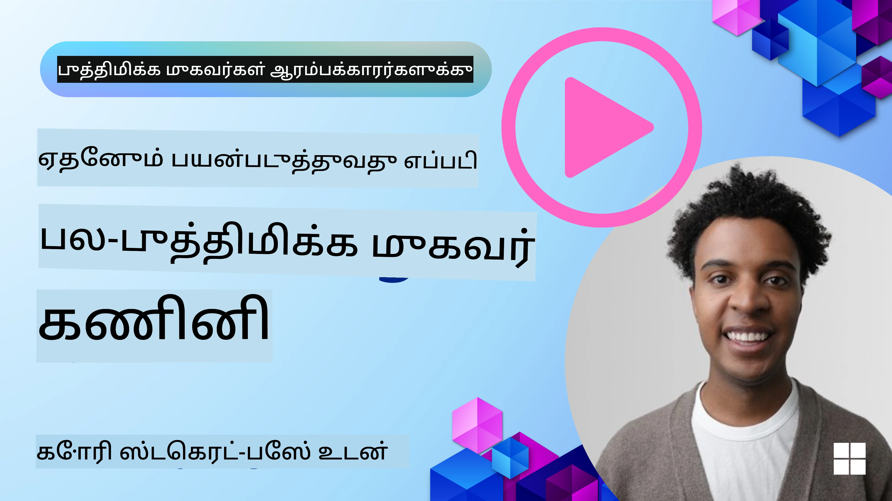
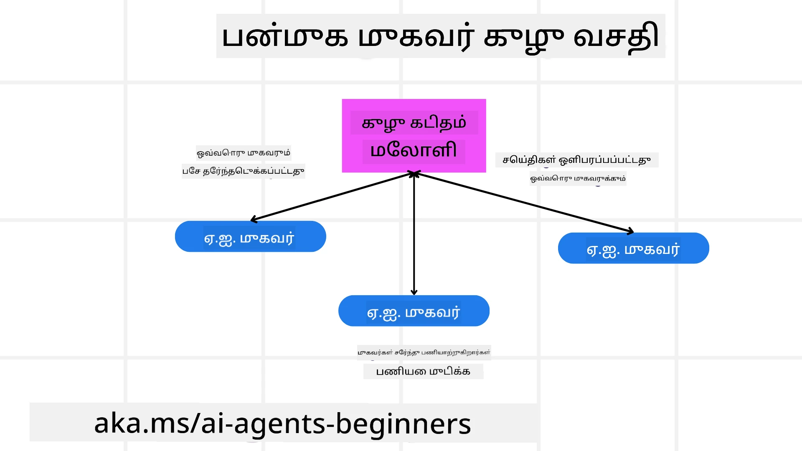
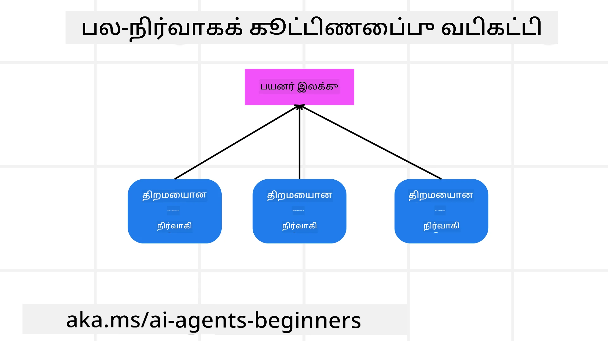

<!--
CO_OP_TRANSLATOR_METADATA:
{
  "original_hash": "1a008c204051cba8d0e253b75f261c41",
  "translation_date": "2025-10-11T11:07:09+00:00",
  "source_file": "08-multi-agent/README.md",
  "language_code": "ta"
}
-->

> _(மேலே உள்ள படத்தை கிளிக் செய்து இந்த பாடத்தின் வீடியோவைப் பாருங்கள்)_

# பல முகவர் வடிவமைப்பு முறை

பல முகவர்களை உள்ளடக்கிய ஒரு திட்டத்தில் நீங்கள் பணியாற்றத் தொடங்கும் போது, பல முகவர் வடிவமைப்பு முறையைப் பரிசீலிக்க வேண்டும். ஆனால், பல முகவர்களுக்கு மாற வேண்டிய நேரம் மற்றும் அதன் நன்மைகள் என்ன என்பதில் உடனடியாக தெளிவாக இருக்க முடியாது.

## அறிமுகம்

இந்தப் பாடத்தில், நாம் பின்வரும் கேள்விகளுக்கு பதிலளிக்க முயற்சிக்கிறோம்:

- எந்த சூழல்களில் பல முகவர்கள் பொருந்தக்கூடியவை?
- பல வேலைகளைச் செய்யும் ஒரு தனி முகவரை விட பல முகவர்களைப் பயன்படுத்துவதன் நன்மைகள் என்ன?
- பல முகவர் வடிவமைப்பு முறையை செயல்படுத்துவதற்கான அடிப்படை கூறுகள் என்ன?
- பல முகவர்கள் ஒருவருக்கொருவர் எப்படி தொடர்பு கொள்கிறார்கள் என்பதை எவ்வாறு காணலாம்?

## கற்றல் இலக்குகள்

இந்தப் பாடத்திற்குப் பிறகு, நீங்கள்:

- பல முகவர்கள் பொருந்தக்கூடிய சூழல்களை அடையாளம் காணலாம்.
- ஒரு தனி முகவரை விட பல முகவர்களைப் பயன்படுத்துவதன் நன்மைகளை அறியலாம்.
- பல முகவர் வடிவமைப்பு முறையை செயல்படுத்துவதற்கான அடிப்படை கூறுகளைப் புரிந்துகொள்ளலாம்.

பெரிய படம் என்ன?

*பல முகவர்கள் என்பது ஒரு வடிவமைப்பு முறை, இது பல முகவர்களை ஒரு பொதுவான இலக்கை அடைய ஒருங்கிணைந்து வேலை செய்ய அனுமதிக்கிறது.*

இந்த முறை ரோபோடிக்ஸ், தன்னாட்சி அமைப்புகள் மற்றும் பகிர்ந்தளிக்கப்பட்ட கணினி செயல்பாடுகள் போன்ற பல துறைகளில் பரவலாகப் பயன்படுத்தப்படுகிறது.

## பல முகவர்கள் பொருந்தக்கூடிய சூழல்கள்

பல முகவர்களைப் பயன்படுத்துவதற்கான நல்ல பயன்பாட்டு வழக்குகள் என்ன? பதில், பல முகவர்களைப் பயன்படுத்துவது பல சூழல்களில் பயனுள்ளதாக இருக்கும், குறிப்பாக பின்வரும் வழக்குகளில்:

- **பெரிய வேலைப்பளு**: பெரிய வேலைப்பளுவை சிறிய பணிகளாகப் பிரித்து, வேகமாக முடிக்க பல முகவர்களுக்கு ஒதுக்கலாம். இதற்கான உதாரணம் பெரிய தரவுகளை செயலாக்கும் பணியாக இருக்கலாம்.
- **சிக்கலான பணிகள்**: சிக்கலான பணிகளை, பெரிய வேலைப்பளுவைப் போலவே, சிறிய துணைப் பணிகளாகப் பிரித்து, ஒவ்வொரு முகவருக்கும் ஒதுக்கலாம். உதாரணமாக, தன்னாட்சி வாகனங்களில், வழிசெலுத்தல், தடைகள் கண்டறிதல் மற்றும் பிற வாகனங்களுடன் தொடர்பு கொள்ளுதல் போன்ற பணிகளை தனித்துவமாக நிர்வகிக்க பல முகவர்கள் பயன்படுத்தப்படலாம்.
- **பல்வேறு நிபுணத்துவம்**: பல்வேறு நிபுணத்துவம் கொண்ட முகவர்கள், ஒரு தனி முகவரை விட ஒரு பணியின் பல்வேறு அம்சங்களைச் சிறப்பாக நிர்வகிக்க முடியும். உதாரணமாக, மருத்துவத்தில், நோயறிதல், சிகிச்சை திட்டங்கள் மற்றும் நோயாளி கண்காணிப்பு ஆகியவற்றை நிர்வகிக்க பல முகவர்கள் பயன்படுத்தப்படலாம்.

## ஒரு தனி முகவரை விட பல முகவர்களைப் பயன்படுத்துவதன் நன்மைகள்

ஒரு தனி முகவர் அமைப்பு எளிய பணிகளுக்கு நன்றாக வேலை செய்யலாம், ஆனால் சிக்கலான பணிகளுக்கு, பல முகவர்களைப் பயன்படுத்துவது பல நன்மைகளை வழங்கும்:

- **சிறப்பு திறன்**: ஒவ்வொரு முகவரும் ஒரு குறிப்பிட்ட பணிக்காக சிறப்பு திறனைக் கொண்டிருக்க முடியும். ஒரு தனி முகவரின் சிறப்பு திறன் இல்லாமை, சிக்கலான பணிகளைச் செய்யும்போது குழப்பத்தை ஏற்படுத்தலாம். உதாரணமாக, அது தன்னுடைய திறமைக்கு பொருந்தாத ஒரு பணியைச் செய்ய முயற்சிக்கலாம்.
- **அளவீட்டு திறன்**: ஒரு தனி முகவரை அதிக வேலைப்பளுவில் ஈடுபடுத்துவதற்குப் பதிலாக, மேலும் பல முகவர்களைச் சேர்ப்பது எளிதாக இருக்கும்.
- **தோல்வி சகிப்புத்தன்மை**: ஒரு முகவர் தோல்வியடைந்தால், மற்றவர்கள் செயல்படத் தொடரலாம், இது அமைப்பின் நம்பகத்தன்மையை உறுதிசெய்யும்.

உதாரணமாக, ஒரு பயணத்தைப் பதிவு செய்ய முயற்சிக்கலாம். ஒரு தனி முகவர் அமைப்பு பயண பதிவு செயல்முறையின் அனைத்து அம்சங்களையும் நிர்வகிக்க வேண்டும், விமானங்களைத் தேடுதல் முதல் ஹோட்டல்கள் மற்றும் வாடகை கார்கள் பதிவு செய்வது வரை. இதை ஒரு தனி முகவருடன் அடைய, அந்த முகவருக்கு இந்த அனைத்து பணிகளையும் நிர்வகிக்க கருவிகள் தேவைப்படும். இது பராமரிக்கவும் அளவீட்டுக்குட்படுத்தவும் கடினமான ஒரு சிக்கலான மற்றும் ஒரே அமைப்பை உருவாக்கும். பல முகவர் அமைப்பு, மாறாக, விமானங்களைத் தேடுதல், ஹோட்டல்கள் மற்றும் வாடகை கார்கள் பதிவு செய்வதில் சிறப்பு திறனைக் கொண்ட பல முகவர்களைப் கொண்டிருக்கலாம். இது அமைப்பை மேலும் தொகுப்பாகவும் பராமரிக்க எளிதாகவும் அளவீட்டுக்குட்படுத்த எளிதாகவும் மாற்றும்.

இதை ஒரு சிறிய குடும்பம் நடத்தும் பயண அலுவலகம் மற்றும் ஒரு பிரஞ்சைஸ் மூலம் நடத்தப்படும் பயண அலுவலகத்துடன் ஒப்பிடுங்கள். சிறிய குடும்பம் நடத்தும் அலுவலகம் பயண பதிவு செயல்முறையின் அனைத்து அம்சங்களையும் ஒரே முகவரால் நிர்வகிக்க வேண்டும், ஆனால் பிரஞ்சைஸ், பயண பதிவு செயல்முறையின் பல்வேறு அம்சங்களை நிர்வகிக்க பல முகவர்களைப் கொண்டிருக்கும்.

## பல முகவர் வடிவமைப்பு முறையை செயல்படுத்துவதற்கான அடிப்படை கூறுகள்

பல முகவர் வடிவமைப்பு முறையை செயல்படுத்துவதற்கு முன், அந்த முறையை உருவாக்கும் அடிப்படை கூறுகளைப் புரிந்துகொள்ள வேண்டும்.

மீண்டும் பயணத்தைப் பதிவு செய்யும் உதாரணத்தைப் பார்ப்பதன் மூலம் இதை மேலும் தெளிவாக்கலாம். இந்தச் சூழலில், அடிப்படை கூறுகள் பின்வருமாறு இருக்கும்:

- **முகவர் தொடர்பு**: பயண தேடுதல், ஹோட்டல் பதிவு மற்றும் வாடகை கார்கள் முகவர்கள் பயனரின் விருப்பங்கள் மற்றும் கட்டுப்பாடுகளைப் பகிர்ந்து கொள்ள தொடர்பு கொள்ள வேண்டும். இந்த தொடர்புக்கான நெறிமுறைகள் மற்றும் முறைகளை நீங்கள் தீர்மானிக்க வேண்டும். உதாரணமாக, பயண தேடல் முகவர், பயண தேதிகளின் தகவலை ஹோட்டல் பதிவு முகவருடன் பகிர்ந்து, பயண தேதிகளுக்கு ஏற்ப ஹோட்டல் பதிவு செய்ய வேண்டும்.
- **ஒழுங்கமைப்பு முறைகள்**: பயனரின் விருப்பங்கள் மற்றும் கட்டுப்பாடுகள் பூர்த்தி செய்யப்படுவதை உறுதிசெய்ய முகவர்கள் தங்கள் செயல்களை ஒருங்கிணைக்க வேண்டும். உதாரணமாக, பயனர் விமான நிலையத்திற்கு அருகிலுள்ள ஹோட்டலை விரும்பலாம், ஆனால் வாடகை கார்கள் விமான நிலையத்தில் மட்டுமே கிடைக்கக்கூடும். இந்தச் சூழலில், ஹோட்டல் பதிவு முகவர் மற்றும் வாடகை கார் முகவர் ஒருங்கிணைந்து பயனரின் விருப்பங்கள் மற்றும் கட்டுப்பாடுகளை பூர்த்தி செய்ய வேண்டும்.
- **முகவர் கட்டமைப்பு**: முகவர்கள் பயனருடன் தொடர்பு கொள்ளும் அனுபவத்திலிருந்து முடிவுகளை எடுக்கவும் கற்றுக்கொள்ளவும் உள்ளமைப்பைக் கொண்டிருக்க வேண்டும். உதாரணமாக, பயண தேடல் முகவர் பயனரின் முந்தைய விருப்பங்களை அடிப்படையாகக் கொண்டு விமானங்களை பரிந்துரைக்க ஒரு இயந்திரக் கற்றல் மாடலைப் பயன்படுத்தலாம்.
- **பல முகவர் தொடர்புகளின் காட்சிப்படுத்தல்**: பல முகவர்கள் ஒருவருக்கொருவர் எப்படி தொடர்பு கொள்கிறார்கள் என்பதைப் பார்க்கும் திறன் இருக்க வேண்டும். இது பிழைதிருத்தம், மேம்படுத்தல் மற்றும் அமைப்பின் மொத்த செயல்திறனை உறுதிசெய்வதற்குத் தேவையானது. இதற்காக, முகவர் செயல்பாடுகள் மற்றும் தொடர்புகளைப் பதிவுசெய்யும் மற்றும் கண்காணிக்கும் கருவிகள், காட்சிப்படுத்தல் கருவிகள் மற்றும் செயல்திறன் அளவுகோல்கள் தேவைப்படும்.
- **பல முகவர் முறைகள்**: பல முகவர் அமைப்புகளை செயல்படுத்த பல்வேறு முறைகள் உள்ளன, உதாரணமாக மையமயமாக்கப்பட்ட, மையமற்ற மற்றும் கலப்பு கட்டமைப்புகள். உங்கள் பயன்பாட்டு வழக்குக்கு ஏற்ற முறையை நீங்கள் தீர்மானிக்க வேண்டும்.
- **மனிதன் தொடர்பு**: பெரும்பாலான சந்தர்ப்பங்களில், ஒரு மனிதன் தொடர்பு இருக்கும், மேலும் முகவர்களுக்கு மனித தலையீட்டை கேட்க வேண்டிய நேரத்தை நீங்கள் அறிவுறுத்த வேண்டும். உதாரணமாக, பயனர் ஒரு குறிப்பிட்ட ஹோட்டல் அல்லது விமானத்தை கேட்கலாம் அல்லது ஒரு விமானம் அல்லது ஹோட்டல் பதிவு செய்யும் முன் உறுதிப்படுத்த கேட்கலாம்.

## பல முகவர் தொடர்புகளின் காட்சிப்படுத்தல்

பல முகவர்கள் ஒருவருக்கொருவர் எப்படி தொடர்பு கொள்கிறார்கள் என்பதைப் பார்க்கும் திறன் முக்கியமானது. இந்த காட்சிப்படுத்தல் பிழைதிருத்தம், மேம்படுத்தல் மற்றும் அமைப்பின் மொத்த செயல்திறனை உறுதிசெய்வதற்குத் தேவையானது. இதை அடைய, முகவர் செயல்பாடுகள் மற்றும் தொடர்புகளைப் பதிவுசெய்யும் மற்றும் கண்காணிக்கும் கருவிகள், காட்சிப்படுத்தல் கருவிகள் மற்றும் செயல்திறன் அளவுகோல்கள் தேவைப்படும்.

உதாரணமாக, பயணத்தைப் பதிவு செய்யும் சூழலில், ஒவ்வொரு முகவரின் நிலை, பயனரின் விருப்பங்கள் மற்றும் கட்டுப்பாடுகள் மற்றும் முகவர்களுக்கிடையேயான தொடர்புகளை காட்டும் ஒரு டாஷ்போர்டு இருக்கலாம். இந்த டாஷ்போர்டு பயண தேதிகள், விமான முகவர் பரிந்துரைத்த விமானங்கள், ஹோட்டல் முகவர் பரிந்துரைத்த ஹோட்டல்கள் மற்றும் வாடகை கார் முகவர் பரிந்துரைத்த வாடகை கார்கள் ஆகியவற்றை காட்டலாம். இது முகவர்கள் ஒருவருக்கொருவர் எப்படி தொடர்பு கொள்கிறார்கள் மற்றும் பயனரின் விருப்பங்கள் மற்றும் கட்டுப்பாடுகள் பூர்த்தி செய்யப்படுகிறதா என்பதை தெளிவாகக் காட்டும்.

இப்போது இந்த அம்சங்களை விரிவாகப் பார்ப்போம்:

- **பதிவு மற்றும் கண்காணிப்பு கருவிகள்**: ஒவ்வொரு முகவரின் செயல்பாடுகளுக்கான பதிவுகளை வைத்திருக்க வேண்டும். ஒரு பதிவு தகவல், செயல்பாடு எடுத்த முகவர், எடுத்த செயல்பாடு, செயல்பாடு எடுக்கப்பட்ட நேரம் மற்றும் அதன் முடிவுகளைச் சேர்க்கலாம். இந்த தகவலை பிழைதிருத்தம் மற்றும் மேம்படுத்தலுக்கு பயன்படுத்தலாம்.

- **காட்சிப்படுத்தல் கருவிகள்**: முகவர்களுக்கிடையேயான தொடர்புகளை மேலும் எளிதாகப் புரிந்துகொள்ள காட்சிப்படுத்தல் கருவிகள் உதவலாம். உதாரணமாக, முகவர்களுக்கிடையேயான தகவல் பரிமாற்றத்தை காட்டும் ஒரு வரைபடம் இருக்கலாம். இது அமைப்பில் bottleneck-கள், செயல்திறன் குறைபாடுகள் மற்றும் பிற சிக்கல்களை அடையாளம் காண உதவும்.

- **செயல்திறன் அளவுகோல்கள்**: பல முகவர் அமைப்பின் செயல்திறனை கண்காணிக்க செயல்திறன் அளவுகோல்கள் உதவலாம். உதாரணமாக, ஒரு பணியை முடிக்க எடுத்த நேரம், ஒரு நேரத்தில் முடிக்கப்பட்ட பணிகளின் எண்ணிக்கை மற்றும் முகவர்கள் பரிந்துரைத்த பரிந்துரைகளின் துல்லியத்தை கண்காணிக்கலாம். இந்த தகவல் மேம்படுத்தலுக்கான பகுதிகளை அடையாளம் காண உதவுகிறது.

## பல முகவர் முறைகள்

பல முகவர் பயன்பாடுகளை உருவாக்க சில குறிப்பிட்ட முறைகளைப் பயன்படுத்தலாம். இங்கே சில சுவாரஸ்யமான முறைகள் உள்ளன:

### குழு உரையாடல்

இந்த முறை பல முகவர்கள் ஒருவருக்கொருவர் தொடர்பு கொள்ளும் குழு உரையாடல் பயன்பாட்டை உருவாக்க விரும்பும்போது பயனுள்ளதாக இருக்கும். இந்த முறையின் வழக்கமான பயன்பாட்டு வழக்குகள் குழு ஒத்துழைப்பு, வாடிக்கையாளர் ஆதரவு மற்றும் சமூக வலைதளங்கள் ஆகியவற்றை உள்ளடக்கியவை.

இந்த முறையில், ஒவ்வொரு முகவரும் குழு உரையாடலில் ஒரு பயனரை பிரதிநிதித்துவம் செய்கிறது, மேலும் செய்திகள் ஒரு செய்தி நெறிமுறையைப் பயன்படுத்தி முகவர்களுக்கிடையே பரிமாற்றப்படுகின்றன. முகவர்கள் குழு உரையாடலுக்கு செய்திகளை அனுப்பலாம், குழு உரையாடலிலிருந்து செய்திகளைப் பெறலாம் மற்றும் பிற முகவர்களின் செய்திகளுக்கு பதிலளிக்கலாம்.

இந்த முறையை அனைத்து செய்திகளும் மையச் சேவையகத்தின் மூலம் வழிமாற்றப்படுகின்ற மையமயமாக்கப்பட்ட கட்டமைப்பைப் பயன்படுத்தி அல்லது செய்திகள் நேரடியாக பரிமாற்றப்படும் மையமற்ற கட்டமைப்பைப் பயன்படுத்தி செயல்படுத்தலாம்.

### ஒப்படைப்பு

இந்த முறை பல முகவர்கள் ஒருவருக்கொருவர் பணிகளை ஒப்படைக்கும் பயன்பாட்டை உருவாக்க விரும்பும்போது பயனுள்ளதாக இருக்கும்.

இந்த முறையின் வழக்கமான பயன்பாட்டு வழக்குகள் வாடிக்கையாளர் ஆதரவு, பணிக்கான மேலாண்மை மற்றும் வேலைப்போக்கு தானியக்கத்தை உள்ளடக்கியவை.

இந்த முறையில், ஒவ்வொரு முகவரும் ஒரு பணியை அல்லது ஒரு வேலைப்போக்கில் ஒரு படியை பிரதிநிதித்துவம் செய்கிறது, மேலும் முகவர்கள் முன்கூட்டிய விதிகளின் அடிப்படையில் பணிகளை மற்ற முகவர்களுக்கு ஒப்படைக்கலாம்.

### ஒத்துழைப்பு வடிகட்டல்

இந்த முறை பல முகவர்கள் பயனர்களுக்கு பரிந்துரைகளை வழங்க ஒத்துழைக்கும் பயன்பாட்டை உருவாக்க விரும்பும்போது பயனுள்ளதாக இருக்கும்.

பல முகவர்கள் ஒத்துழைக்க விரும்புவதற்கான காரணம், ஒவ்வொரு முகவரும் வெவ்வேறு நிபுணத்துவம் கொண்டிருப்பதால் பரிந்துரை செயல்முறைக்கு வெவ்வேறு வழிகளில் பங்களிக்க முடியும்.

உதாரணமாக, ஒரு பயனர் பங்குச் சந்தையில் வாங்க சிறந்த பங்குகளைப் பற்றிய பரிந்துரையை விரும்புகிறார்.

- **தொழில்துறை நிபுணர்**: ஒரு முகவர் ஒரு குறிப்பிட்ட தொழில்துறையில் நிபுணத்துவம் கொண்டிருக்கலாம்.
- **தொழில்நுட்ப பகுப்பாய்வு**: மற்றொரு முகவர் தொழில்நுட்ப பகுப்பாய்வில் நிபுணத்துவம் கொண்டிருக்கலாம்.
- **அடிப்படை பகுப்பாய்வு**: மற்றொரு முகவர் அடிப்படை பகுப்பாய்வில் நிபுணத்துவம் கொண்டிருக்கலாம். இவை ஒத்துழைப்பதன் மூலம், இந்த முகவர்கள் பயனருக்கு மேலும் விரிவான பரிந்துரையை வழங்க முடியும்.

## சூழல்: பணத்தைத் திருப்பி வழங்கும் செயல்முறை

ஒரு வாடிக்கையாளர் ஒரு தயாரிப்புக்கான பணத்தைத் திருப்பி வழங்க முயற்சிக்கிற சூழலைக் கருதுங்கள். இந்த செயல்முறையில் பல முகவர்கள் ஈடுபடலாம், ஆனால் இந்த செயல்முறைக்கு குறிப்பிட்ட முகவர்கள் மற்றும் உங்கள் வணிகத்தின் பிற செயல்முறைகளில் பயன்படுத்தக்கூடிய பொதுவான முகவர்களைப் பிரிக்கலாம்.

**பணத்தைத் திருப்பி வழங்கும் செயல்முறைக்கு குறிப்பிட்ட முகவர்கள்**:

பின்வரும் முகவர்கள் பணத்தைத் திருப்பி வழங்கும் செயல்முறையில் ஈடுபடலாம்:

- **வாடிக்கையாளர் முகவர்**: இந்த முகவர் வாடிக்கையாளரை பிரதிநிதித்துவம் செய்கிறது மற்றும் பணத்தைத் திருப்பி வழங்கும் செயல்முறையைத் தொடங்குவதற்குப் பொறுப்பாக உள்ளது.
- **விற்பனையாளர் முகவர்**: இந்த முகவர் விற்பனையாளரை பிரதிநிதித்துவம் செய்கிறது மற்றும் பணத்தைத் திருப்பி வழங்குவதற்குப் பொறுப்பாக உள்ளது.
- **கட்டண முகவர்**: இந்த முகவர் கட்டண செயல்முறையை பிரதிநிதித்துவம் செய்கிறது மற்றும் வாடிக்கையாளரின் கட்டணத்தைத் திருப்பி வழங்குவதற்குப் பொறுப்பாக உள்ளது.
- **தீர்வு முகவர்**: இந்த முகவர் தீர்வு செயல்முறையை பிரதிநிதித்துவம் செய்கிறது மற்றும் பணத்தைத் திருப்பி வழங்கும் செயல்முறையின் போது ஏற்படும் எந்தவொரு சிக்கலையும் தீர்க்கப் பொறுப்பாக உள்ளது.
- **இணக்கம் முகவர்**: இந்த முகவர் இணக்கம் செயல்முறையை பிரதிநிதித்துவம் செய்கிறது மற்றும் பணத்தைத் திருப்பி வழங்கும் செயல்முறை விதிமுறைகள் மற்றும் கொள்கைகளுடன் இணங்குவதை உறுதிசெய்வதற்குப் பொறுப்பாக உள்ளது.

**பொதுவான முகவர்கள்**:

இந்த முகவர்கள் உங்கள் வணிகத்தின் பிற பகுதிகளால் பயன்படுத்தப்படலாம்.

- **கப்பல் முகவர்**: இந்த முகவர் கப்பல் செயல்முறையை பிரதிநிதித்துவம் செய்கிறது மற்றும் தயாரிப்பை விற்பனையாளருக்கு திருப்பி அனுப்புவதற்குப் பொறுப்பாக உள்ளது. இந்த முகவர் பணத்தைத் திருப்பி வழங்கும் செயல்முறைக்கும், ஒரு தயாரிப்பை வாங்கிய பிறகு பொதுவான கப்பல் செயல்முறைக்கும் பயன்படுத்தப்படலாம்.
- **கருத்து முகவர்**: இந்த முகவர் கருத்து செயல்முறையை பிரதிநிதித்துவம் செய்கிறது மற்றும் வாடிக்கையாளரிடமிருந்து கருத்துகளைச் சேகரிப்பதற்குப் பொறுப்பாக உள்ளது. கருத்து எந்த நேரத்திலும் பெறப்படலாம், பணத்தைத் திருப்பி வழங்கும் செயல்முறையின் போது மட்டுமல்ல.
- **உயர்த்தல் முகவர்**: இந்த முகவர் உயர்த்தல் செயல்முறையை பிரதிநிதித்துவம் செய்கிறது மற்றும் சிக்கல்களை மேலதிக ஆதரவு நிலைக்கு உயர்த்துவதற்குப் பொறுப்பாக உள்ளது. எந்த செயல்முறையிலும் சிக்கலை உயர்த்த வேண்டிய இடத்தில் இந்த முகவரைப் பயன்படுத்தலாம்.
- **அ
## பல முகவர் அமைப்பை வடிவமைக்கவும்

வாடிக்கையாளர் ஆதரவு செயல்முறைக்கான பல முகவர் அமைப்பை வடிவமைக்கவும். செயல்முறையில் ஈடுபடும் முகவர்களை, அவர்களின் பங்கு மற்றும் பொறுப்புகளை, மற்றும் அவர்கள் ஒருவருக்கொருவர் எப்படி தொடர்பு கொள்கிறார்கள் என்பதை அடையாளம் காணவும். வாடிக்கையாளர் ஆதரவு செயல்முறைக்கு குறிப்பிட்ட முகவர்களையும், உங்கள் வணிகத்தின் பிற பகுதிகளில் பயன்படுத்தக்கூடிய பொதுவான முகவர்களையும் கருத்தில் கொள்ளவும்.

> நீங்கள் கீழே உள்ள தீர்வை படிப்பதற்கு முன், நீங்கள் நினைப்பதைவிட அதிகமான முகவர்களை தேவைப்படலாம்.

> TIP: வாடிக்கையாளர் ஆதரவு செயல்முறையின் பல்வேறு நிலைகளைப் பற்றி சிந்திக்கவும், மேலும் எந்தவொரு அமைப்பிற்கும் தேவையான முகவர்களைப் பற்றியும் கவனிக்கவும்.

## தீர்வு

[தீர்வு](./solution/solution.md)

## அறிவு சோதனைகள்

கேள்வி: நீங்கள் எப்போது பல முகவர்களைப் பயன்படுத்த வேண்டும் என்று கருத வேண்டும்?

- [ ] A1: சிறிய வேலைப்பளு மற்றும் எளிய பணிகள் உள்ளபோது.
- [ ] A2: பெரிய வேலைப்பளு உள்ளபோது.
- [ ] A3: எளிய பணிகள் உள்ளபோது.

[தீர்வு வினாடி வினா](./solution/solution-quiz.md)

## சுருக்கம்

இந்த பாடத்தில், பல முகவர் வடிவமைப்பு முறைமையைப் பற்றி, பல முகவர்களைப் பயன்படுத்துவதற்கான சூழல்களை, ஒற்றை முகவரை விட பல முகவர்களைப் பயன்படுத்துவதற்கான நன்மைகளை, பல முகவர் வடிவமைப்பு முறைமையை செயல்படுத்துவதற்கான அடிப்படைகளை, மற்றும் பல முகவர்கள் ஒருவருக்கொருவர் எப்படி தொடர்பு கொள்கிறார்கள் என்பதைப் பற்றி பார்த்தோம்.

### பல முகவர் வடிவமைப்பு முறைமையைப் பற்றி மேலும் கேள்விகள் உள்ளதா?

மற்ற கற்றலாளர்களை சந்திக்கவும், அலுவலக நேரங்களில் கலந்துரையாடவும், மற்றும் உங்கள் AI முகவர்களின் கேள்விகளுக்கு பதிலளிக்கவும் [Azure AI Foundry Discord](https://aka.ms/ai-agents/discord) க்கு சேரவும்.

## கூடுதல் வளங்கள்

- <a href="https://microsoft.github.io/autogen/stable/user-guide/core-user-guide/design-patterns/intro.html" target="_blank">AutoGen வடிவமைப்பு முறைமைகள்</a>
- <a href="https://www.analyticsvidhya.com/blog/2024/10/agentic-design-patterns/" target="_blank">Agentic வடிவமைப்பு முறைமைகள்</a>

## முந்தைய பாடம்

[திட்டமிடல் வடிவமைப்பு](../07-planning-design/README.md)

## அடுத்த பாடம்

[AI முகவர்களில் தன்னிலை உணர்வு](../09-metacognition/README.md)

---

**குறிப்பு**:  
இந்த ஆவணம் [Co-op Translator](https://github.com/Azure/co-op-translator) என்ற AI மொழிபெயர்ப்பு சேவையைப் பயன்படுத்தி மொழிபெயர்க்கப்பட்டுள்ளது. நாங்கள் துல்லியத்திற்காக முயற்சிக்கின்றோம், ஆனால் தானியங்கி மொழிபெயர்ப்புகளில் பிழைகள் அல்லது தவறான தகவல்கள் இருக்கக்கூடும் என்பதை தயவுசெய்து கவனத்தில் கொள்ளவும். அதன் தாய்மொழியில் உள்ள மூல ஆவணம் அதிகாரப்பூர்வ ஆதாரமாக கருதப்பட வேண்டும். முக்கியமான தகவல்களுக்கு, தொழில்முறை மனித மொழிபெயர்ப்பு பரிந்துரைக்கப்படுகிறது. இந்த மொழிபெயர்ப்பைப் பயன்படுத்துவதால் ஏற்படும் எந்த தவறான புரிதல்கள் அல்லது தவறான விளக்கங்களுக்கு நாங்கள் பொறுப்பல்ல.