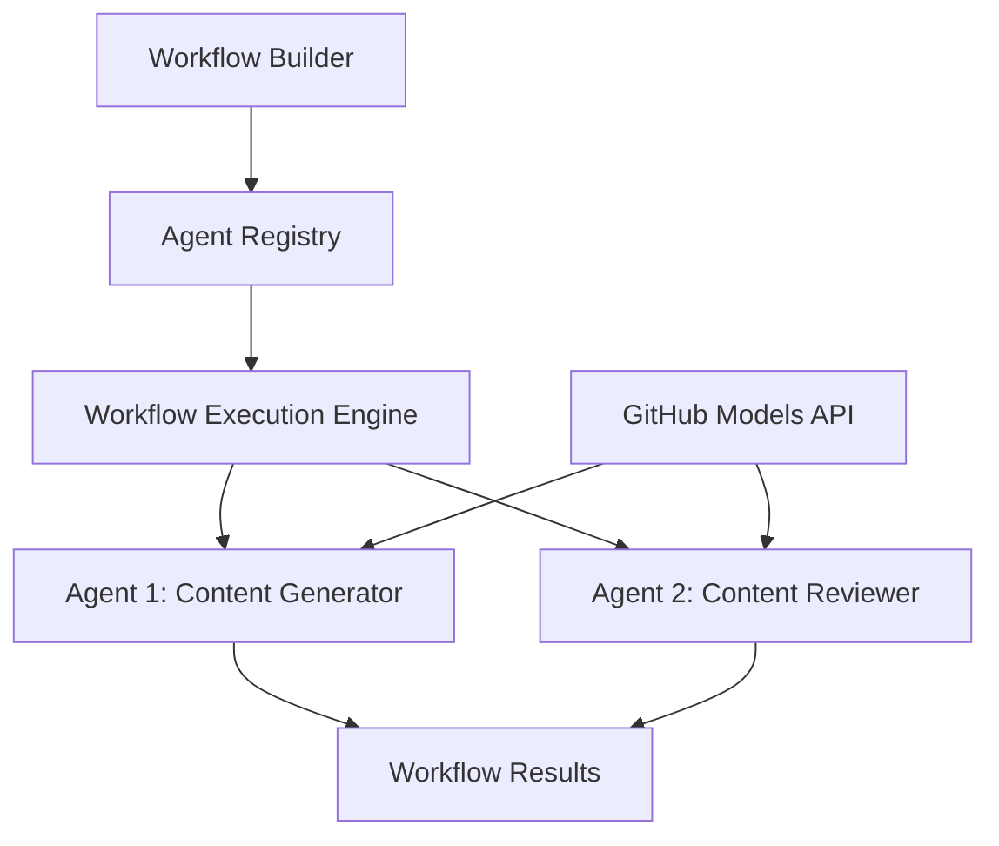

<!--
CO_OP_TRANSLATOR_METADATA:
{
  "original_hash": "034158688d0a45aae06dcbb21b0da5ae",
  "translation_date": "2025-11-11T13:02:39+00:00",
  "source_file": "08-multi-agent/code_samples/workflows-agent-framework/dotNET/01.dotnet-agent-framework-workflow-ghmodel-basic.md",
  "language_code": "ta"
}
-->
# 🔄 GitHub மாடல்களுடன் அடிப்படை முகவர் வேலைப்பாடுகள் (.NET)

## 📋 வேலைப்பாடுகள் ஒருங்கிணைப்பு பயிற்சி

இந்த நோட்புக் Microsoft Agent Framework for .NET மற்றும் GitHub மாடல்களைப் பயன்படுத்தி நுண்ணறிவு **முகவர் வேலைப்பாடுகளை** உருவாக்குவது எப்படி என்பதை விளக்குகிறது. AI முகவர்கள் இணைந்து செயல்பட்டு சிக்கலான பணிகளைச் செய்யும் பல படிகள் கொண்ட வணிக செயல்முறைகளை உருவாக்குவது மற்றும் ஒருங்கிணைப்பு முறைகளைப் பயன்படுத்துவது பற்றி நீங்கள் கற்றுக்கொள்வீர்கள்.

## 🎯 கற்றல் நோக்கங்கள்

### 🏗️ **வேலைப்பாடுகள் கட்டமைப்பு அடிப்படைகள்**
- **Workflow Builder**: சிக்கலான பல படிகள் கொண்ட AI செயல்முறைகளை வடிவமைத்து ஒருங்கிணை
- **Agent Coordination**: வேலைப்பாடுகளில் பல சிறப்பு முகவர்களை ஒருங்கிணை
- **GitHub Models Integration**: GitHub AI மாடல் தீர்மான சேவையை வேலைப்பாடுகளில் பயன்படுத்தவும்
- **Visual Workflow Design**: வேலைப்பாடுகள் அமைப்புகளை உருவாக்கி புரிந்துகொள்ள எளிதாக்கவும்

### 🔄 **செயல்முறை ஒருங்கிணைப்பு முறைகள்**
- **Sequential Processing**: பல முகவர் பணிகளை தரவுசார்ந்த வரிசையில் இணைக்கவும்
- **State Management**: வேலைப்பாடுகள் நிலைகள் முழுவதும் சூழல் மற்றும் தரவோட்டத்தை பராமரிக்கவும்
- **Error Handling**: வலுவான பிழை மீட்பு மற்றும் வேலைப்பாடுகள் நிலைத்தன்மையை செயல்படுத்தவும்
- **Performance Optimization**: நிறுவன அளவிலான செயல்பாடுகளுக்கு திறமையான வேலைப்பாடுகளை வடிவமைக்கவும்

### 🏢 **நிறுவன வேலைப்பாடுகள் பயன்பாடுகள்**
- **Business Process Automation**: சிக்கலான நிறுவன வேலைப்பாடுகளை தானியக்கமாக்கவும்
- **Content Production Pipeline**: மதிப்பீடு மற்றும் ஒப்புதல் நிலைகளுடன் ஆசிரிய வேலைப்பாடுகள்
- **Customer Service Automation**: பல படிகள் கொண்ட வாடிக்கையாளர் கேள்வி தீர்வு
- **Data Processing Workflows**: AI மூலம் மாற்றம் செய்யப்படும் ETL வேலைப்பாடுகள்

## ⚙️ முன்பதிவுகள் மற்றும் அமைப்பு

### 📦 **தேவையான NuGet தொகுப்புகள்**

இந்த வேலைப்பாடுகள் விளக்கம் பல முக்கிய .NET தொகுப்புகளைப் பயன்படுத்துகிறது:

```xml
<!-- Core AI Framework -->
<PackageReference Include="Microsoft.Extensions.AI" Version="9.9.0" />

<!-- Agent Framework (Local Development) -->
<!-- Microsoft.Agents.AI.dll - Core agent abstractions -->
<!-- Microsoft.Agents.AI.OpenAI.dll - OpenAI/GitHub Models integration -->

<!-- Configuration and Environment -->
<PackageReference Include="DotNetEnv" Version="3.1.1" />
```

### 🔑 **GitHub மாடல்கள் அமைப்பு**

**சூழல் அமைப்பு (.env கோப்பு):**
```env
GITHUB_TOKEN=your_github_personal_access_token
GITHUB_ENDPOINT=https://models.inference.ai.azure.com
GITHUB_MODEL_ID=gpt-4o-mini
```

**GitHub மாடல்கள் அணுகல்:**
1. GitHub மாடல்களுக்கு பதிவு செய்யவும் (தற்போது முன்னோட்டத்தில் உள்ளது)
2. மாடல் அணுகல் அனுமதிகளுடன் தனிப்பட்ட அணுகல் டோக்கனை உருவாக்கவும்
3. மேலே காட்டப்பட்டுள்ளபடி சூழல் மாறிகளை அமைக்கவும்

### 🏗️ **வேலைப்பாடுகள் கட்டமைப்பு கண்ணோட்டம்**



**முக்கிய கூறுகள்:**
- **WorkflowBuilder**: வேலைப்பாடுகளை வடிவமைக்க முக்கிய ஒருங்கிணைப்பு இயந்திரம்
- **AIAgent**: குறிப்பிட்ட திறன்களுடன் தனிப்பட்ட சிறப்பு முகவர்கள்
- **GitHub Models Client**: AI மாடல் தீர்மான சேவை ஒருங்கிணைப்பு
- **Execution Context**: வேலைப்பாடுகள் நிலைகளுக்கு இடையில் நிலை மற்றும் தரவோட்டத்தை நிர்வகிக்கிறது

## 🎨 **நிறுவன வேலைப்பாடுகள் வடிவமைப்பு முறைகள்**

### 📝 **உள்ளடக்க தயாரிப்பு வேலைப்பாடு**
```
User Request → Content Generation → Quality Review → Final Output
```

### 🔍 **ஆவண செயலாக்க குழாய்**
```
Document Input → Analysis → Extraction → Validation → Structured Output
```

### 💼 **வணிக நுண்ணறிவு வேலைப்பாடு**
```
Data Collection → Processing → Analysis → Report Generation → Distribution
```

### 🤝 **வாடிக்கையாளர் சேவை தானியக்கமாக்கல்**
```
Customer Inquiry → Classification → Processing → Response Generation → Follow-up
```

## 🏢 **நிறுவன நன்மைகள்**

### 🎯 **நம்பகத்தன்மை மற்றும் அளவீடு**
- **Deterministic Execution**: நிலையான, மீண்டும் செய்யக்கூடிய வேலைப்பாடுகள் முடிவுகள்
- **Error Recovery**: வேலைப்பாடுகள் எந்த நிலையிலும் தோல்விகளை நன்கு கையாளுதல்
- **Performance Monitoring**: செயல்பாட்டு அளவீடுகள் மற்றும் மேம்பாட்டு வாய்ப்புகளை கண்காணிக்கவும்
- **Resource Management**: AI மாடல் வளங்களை திறமையாக ஒதுக்கவும் மற்றும் பயன்படுத்தவும்

### 🔒 **பாதுகாப்பு மற்றும் இணக்கம்**
- **Secure Authentication**: API அணுகலுக்கு GitHub டோக்கன் அடிப்படையிலான அங்கீகாரம்
- **Audit Trails**: வேலைப்பாடுகள் செயல்பாடு மற்றும் முடிவுகள் முழுமையான பதிவு
- **Access Control**: வேலைப்பாடுகள் செயல்பாடு மற்றும் கண்காணிப்புக்கு நுணுக்கமான அனுமதிகள்
- **Data Privacy**: வேலைப்பாடுகள் முழுவதும் நுணுக்கமான தகவல்களை பாதுகாப்பாக கையாளுதல்

### 📊 **கண்காணிப்பு மற்றும் மேலாண்மை**
- **Visual Workflow Design**: செயல்முறைகள் மற்றும் சார்புகளின் தெளிவான பிரதிநிதித்துவம்
- **Execution Monitoring**: வேலைப்பாடுகள் முன்னேற்றம் மற்றும் செயல்திறனை நேரடி கண்காணிப்பு
- **Error Reporting**: விரிவான பிழை பகுப்பாய்வு மற்றும் பிழைத்திருத்த திறன்கள்
- **Performance Analytics**: மேம்பாடு மற்றும் திறன் திட்டமிடல் அளவீடுகள்

உங்கள் முதல் நிறுவனத்திற்கான AI வேலைப்பாடுகளை உருவாக்குவோம்! 🚀

## 💻 குறியீட்டை இயக்குதல்

முழுமையான செயல்பாடு `01.dotnet-agent-framework-workflow-ghmodel-basic.cs` இல் கிடைக்கிறது. இந்த கோப்பு விளக்குகிறது:

1. **சூழல் அமைப்பு** - `.env` கோப்பில் இருந்து GitHub மாடல்கள் சான்றுகளை ஏற்றுதல்
2. **OpenAI Client Setup** - GitHub மாடல்கள் இறுதிப்புள்ளியைப் பயன்படுத்த கிளையண்டை அமைத்தல்
3. **Agent Creation** - சிறப்பு முகவர்களை வரையறுத்தல் (Front Desk மற்றும் Concierge)
4. **Workflow Builder** - தரவுசார்ந்த செயல்முறையுடன் பல முகவர் வேலைப்பாடுகளை உருவாக்குதல்
5. **Workflow Execution** - ஸ்ட்ரீமிங் முடிவுகளுடன் வேலைப்பாடுகளை இயக்குதல்

### 🚀 உதாரணத்தை இயக்குதல்

```bash
# Make the script executable (Unix/Linux/macOS)
chmod +x 01.dotnet-agent-framework-workflow-ghmodel-basic.cs

# Run the workflow
./01.dotnet-agent-framework-workflow-ghmodel-basic.cs
```

அல்லது Windows இல்:
```powershell
dotnet run 01.dotnet-agent-framework-workflow-ghmodel-basic.cs
```

### 📝 எதிர்பார்க்கப்படும் வெளியீடு

வேலைப்பாடு:
1. உங்கள் பயண இலக்கு கோரிக்கையை ஏற்கும் ("நான் பாரிசுக்கு செல்ல விரும்புகிறேன்")
2. Front Desk முகவர் ஆரம்ப பரிந்துரையை வழங்குகிறார்
3. Concierge முகவர் பரிந்துரையை மதிப்பீடு செய்து மேம்படுத்துகிறார்
4. இறுதி வெளியீடு முழு உரையாடல் ஸ்ட்ரீமை காட்டுகிறது

### 🔧 தனிப்பயனாக்கல்

வேலைப்பாடுகளை நீங்கள் தனிப்பயனாக்கலாம்:
- முகவர் வழிகாட்டுதல்களை மாற்றி அவர்களின் நடத்தை மாற்றவும்
- மேலும் முகவர்களைச் சேர்த்து சிக்கலான பல படிகள் கொண்ட வேலைப்பாடுகளை உருவாக்கவும்
- பயனர் செய்தியை மாற்றி வெவ்வேறு சூழல்களை சோதிக்கவும்
- வேலைப்பாடுகள் விளிம்புகளை மாற்றி வெவ்வேறு செயல்முறை வடிவங்களை உருவாக்கவும்

---

<!-- CO-OP TRANSLATOR DISCLAIMER START -->
**குறிப்பு**:  
இந்த ஆவணம் AI மொழிபெயர்ப்பு சேவை [Co-op Translator](https://github.com/Azure/co-op-translator) பயன்படுத்தி மொழிபெயர்க்கப்பட்டுள்ளது. நாங்கள் துல்லியத்திற்காக முயற்சிக்கிறோம், ஆனால் தானியங்கி மொழிபெயர்ப்புகளில் பிழைகள் அல்லது தவறுகள் இருக்கக்கூடும் என்பதை கவனத்தில் கொள்ளவும். அதன் தாய்மொழியில் உள்ள மூல ஆவணம் அதிகாரப்பூர்வ ஆதாரமாக கருதப்பட வேண்டும். முக்கியமான தகவல்களுக்கு, தொழில்முறை மனித மொழிபெயர்ப்பு பரிந்துரைக்கப்படுகிறது. இந்த மொழிபெயர்ப்பைப் பயன்படுத்துவதால் ஏற்படும் எந்த தவறான புரிதல்கள் அல்லது தவறான விளக்கங்களுக்கு நாங்கள் பொறுப்பல்ல.
<!-- CO-OP TRANSLATOR DISCLAIMER END -->