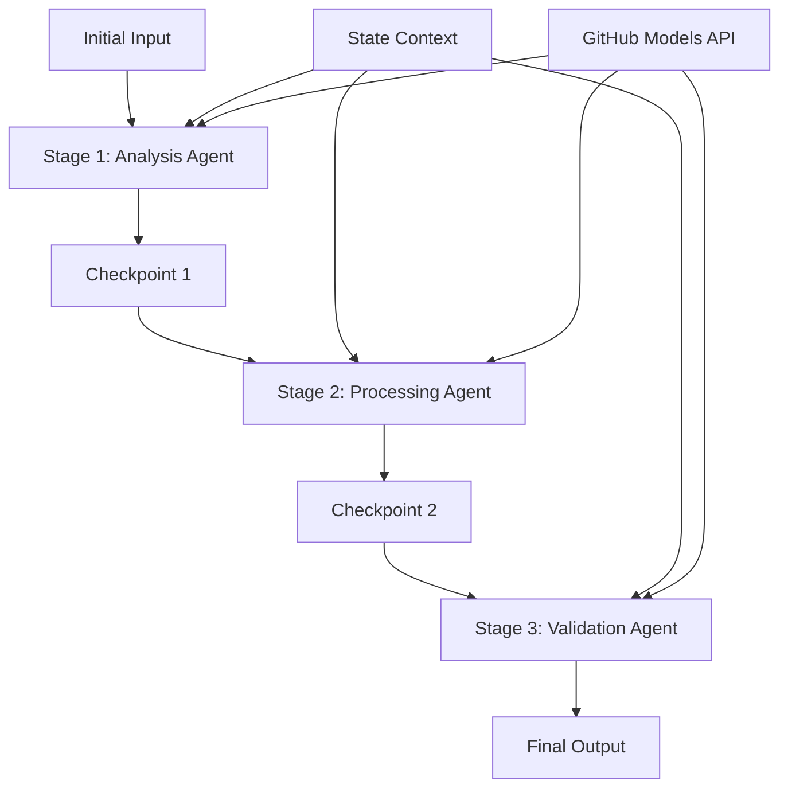

<!--
CO_OP_TRANSLATOR_METADATA:
{
  "original_hash": "1be9c8dcbd79a02d33d2c138684c1394",
  "translation_date": "2025-11-11T14:09:22+00:00",
  "source_file": "08-multi-agent/code_samples/workflows-agent-framework/dotNET/02.dotnet-agent-framework-workflow-ghmodel-sequential.md",
  "language_code": "ta"
}
-->
# ⏩ GitHub மாடல்களுடன் தொடர்ச்சியான முகவர் வேலைகள் (.NET)

## 📋 மேம்பட்ட தொடர்ச்சியான செயலாக்க பயிற்சி

இந்த நோட்புக் Microsoft Agent Framework for .NET மற்றும் GitHub மாடல்களைப் பயன்படுத்தி **தொடர்ச்சியான வேலைகள்** வடிவமைப்புகளை விளக்குகிறது. முகவர்கள் குறிப்பிட்ட வரிசையில் செயல்படுவதற்கான மேம்பட்ட, படிப்படியாக செயலாக்க குழாய்களை உருவாக்குவது எப்படி என்பதை நீங்கள் கற்றுக்கொள்வீர்கள், ஒவ்வொரு கட்டமும் முந்தைய கட்டத்தின் முடிவுகளை அடிப்படையாகக் கொண்டது.

## 🎯 கற்றல் நோக்கங்கள்

### 🔄 **தொடர்ச்சியான செயலாக்க கட்டமைப்பு**
- **நேரியல் வேலைகள் வடிவமைப்பு**: தெளிவான சார்புகளுடன் படிப்படியாக செயலாக்க குழாய்களை உருவாக்கவும்
- **நிலை மேலாண்மை**: தொடர்ச்சியான வேலைகள் கட்டங்களில் சூழல் மற்றும் தரவோட்டத்தை பராமரிக்கவும்
- **GitHub மாடல்களின் ஒருங்கிணைப்பு**: பல கட்ட .NET வேலைகளில் GitHub AI மாடல்களைப் பயன்படுத்தவும்
- **நிறுவன குழாய் வடிவங்கள்**: உற்பத்திக்கு தயாரான தொடர்ச்சியான செயலாக்க அமைப்புகளை உருவாக்கவும்

### 🏗️ **மேம்பட்ட தொடர்ச்சியான வடிவங்கள்**
- **கட்ட-கேட் செயலாக்கம்**: வேலைகள் கட்டங்களுக்கிடையே சரிபார்ப்பு சோதனை புள்ளிகளை செயல்படுத்தவும்
- **சூழல் பாதுகாப்பு**: அனைத்து கட்டங்களிலும் நிலை மற்றும் சேர்க்கப்பட்ட அறிவை பராமரிக்கவும்
- **பிழை பரவல்**: தொடர்ச்சியான செயலாக்க சங்கிலிகளில் தோல்விகளை நயமாக கையாளவும்
- **செயல்திறன் மேம்பாடு**: குறைந்த செலவுடன் திறமையான தொடர்ச்சியான செயல்பாடு

### 🏢 **நிறுவன தொடர்ச்சியான பயன்பாடுகள்**
- **ஆவண செயலாக்க குழாய்**: பல கட்ட ஆவண பகுப்பாய்வு, மாற்றம் மற்றும் சரிபார்ப்பு
- **தர உறுதிப்படுத்தல் வேலைகள்**: தொடர்ச்சியான மதிப்பீடு, சரிபார்ப்பு மற்றும் ஒப்புதல் செயல்முறைகள்
- **உள்ளடக்க உற்பத்தி குழாய்**: ஆராய்ச்சி → எழுதுதல் → திருத்தம் → மதிப்பீடு → வெளியீடு
- **வணிக செயல்முறை தானியக்கமாக்கல்**: தெளிவான கட்ட சார்புகளுடன் பல படி வணிக வேலைகள்

## ⚙️ முன்பதிவுகள் மற்றும் அமைப்பு

### 📦 **தேவையான NuGet தொகுப்புகள்**

.NET தொடர்ச்சியான வேலைகளுக்கான முக்கிய தொகுப்புகள்:

```xml
<!-- Core AI Framework -->
<PackageReference Include="Microsoft.Extensions.AI" Version="9.9.0" />

<!-- Client Model Abstractions -->
<PackageReference Include="System.ClientModel" Version="1.6.1.0" />

<!-- Azure Identity and Async LINQ Support -->
<PackageReference Include="Azure.Identity" Version="1.15.0" />
<PackageReference Include="System.Linq.Async" Version="6.0.3" />

<!-- Local Agent Framework References -->
<!-- Microsoft.Agents.AI.dll - Core agent abstractions -->
<!-- Microsoft.Agents.AI.OpenAI.dll - GitHub Models integration -->
```

### 🔑 **GitHub மாடல்கள் அமைப்பு**

**சூழல் அமைப்பு (.env கோப்பு):**
```env
GITHUB_TOKEN=your_github_personal_access_token
GITHUB_ENDPOINT=https://models.inference.ai.azure.com
GITHUB_MODEL_ID=gpt-4o-mini
```

**அமைப்பு மேலாண்மை:**
```csharp
// Load environment variables securely
Env.Load("../../../.env");
var githubToken = Environment.GetEnvironmentVariable("GITHUB_TOKEN");
var githubEndpoint = Environment.GetEnvironmentVariable("GITHUB_ENDPOINT");
var modelId = Environment.GetEnvironmentVariable("GITHUB_MODEL_ID");
```

### 🏗️ **தொடர்ச்சியான வேலைகள் கட்டமைப்பு**



**முக்கிய கூறுகள்:**
- **தொடர்ச்சியான முகவர்கள்**: ஒவ்வொரு செயலாக்க கட்டத்திற்கும் சிறப்பு முகவர்கள்
- **நிலை சூழல்**: கட்டங்களுக்கிடையே சேர்க்கப்பட்ட தரவுகள் மற்றும் முடிவுகளை பராமரிக்கவும்
- **சோதனை புள்ளிகள்**: ஒவ்வொரு கட்டத்திலும் தரம் மற்றும் நிலைத்தன்மையை உறுதிப்படுத்த சரிபார்ப்பு புள்ளிகள்
- **GitHub மாடல்கள் கிளையண்ட்**: அனைத்து வேலைகள் கட்டங்களிலும் AI மாடல்களை அணுகுவதற்கான ஒரே மாதிரியான அணுகல்

## 🎨 **தொடர்ச்சியான வேலைகள் வடிவமைப்பு வடிவங்கள்**

### 📝 **ஆவண செயலாக்க குழாய்**
```
Raw Document → Content Extraction → Analysis → Validation → Structured Output
```

### 🎯 **உள்ளடக்க உருவாக்க வேலைகள்**
```
Brief/Requirements → Research → Content Creation → Review → Final Polish
```

### 🔍 **தர உறுதிப்படுத்தல் குழாய்**
```
Initial Review → Technical Validation → Compliance Check → Final Approval
```

### 💼 **வணிக நுண்ணறிவு வேலைகள்**
```
Data Collection → Processing → Analysis → Report Generation → Distribution
```

## 🏢 **நிறுவன தொடர்ச்சியான நன்மைகள்**

### 🎯 **நம்பகத்தன்மை மற்றும் தரம்**
- **தீர்மானமான செயலாக்கம்**: கட்டமைக்கப்பட்ட கட்டங்கள் மூலம் நிலையான, மீண்டும் செய்யக்கூடிய முடிவுகள்
- **தர சோதனை புள்ளிகள்**: ஒவ்வொரு கட்டத்திலும் தரத்தை உறுதிப்படுத்த சரிபார்ப்பு புள்ளிகள்
- **பிழை தனிமைப்படுத்தல்**: ஒரு கட்டத்தில் உள்ள பிரச்சினைகள் அடுத்த கட்டங்களுக்கு பரவாது
- **ஆடிட் டிரெயில்கள்**: ஒவ்வொரு கட்டத்தில் முடிவுகள் மற்றும் மாற்றங்களை முழுமையாக கண்காணிக்கவும்

### 📈 **மிகைப்படுத்தல் மற்றும் செயல்திறன்**
- **தொகுதி வடிவமைப்பு**: ஒவ்வொரு கட்டத்தையும் தனித்தனியாக மேம்படுத்தலாம்
- **வள மேலாண்மை**: AI மாடல் வளங்களை கட்டங்களுக்கிடையே திறமையாக ஒதுக்கவும்
- **நிலை மேம்பாடு**: சிறந்த செயல்திறனுக்காக கட்டங்களுக்கிடையே குறைந்த நிலை மாற்றம்
- **இணைச்சேர்க்கை கட்ட குழுக்கள்**: பல தொடர்ச்சியான வேலைகள் இணைச்சேர்க்கையில் இயங்கலாம்

### 🔒 **பாதுகாப்பு மற்றும் இணக்கம்**
- **கட்ட நிலை பாதுகாப்பு**: வேறு வேறு செயலாக்க கட்டங்களுக்கு வேறு வேறு பாதுகாப்பு கொள்கைகள்
- **தரவு சரிபார்ப்பு**: ஒவ்வொரு சோதனை புள்ளியிலும் தரவின் முழுமை மற்றும் இணக்கத்தை உறுதிப்படுத்தவும்
- **அணுகல் கட்டுப்பாடு**: வேறு வேறு வேலைகள் கட்டங்களுக்கு தனிப்பட்ட அனுமதிகள்
- **ஒழுங்குமுறை இணக்கம்**: கட்டமைக்கப்பட்ட செயலாக்கத்தின் மூலம் ஒழுங்குமுறை தேவைகளை பூர்த்தி செய்யவும்

### 📊 **கண்காணிப்பு மற்றும் பகுப்பாய்வு**
- **கட்ட நிலை அளவீடுகள்**: ஒவ்வொரு வேலைகள் கட்டத்திற்கும் செயல்திறன் கண்காணிப்பு
- **தடை அடையாளம்**: மெதுவாக செயல்படும் கட்டங்களை அடையாளம் காணவும் மற்றும் மேம்படுத்தவும்
- **தர அளவீடுகள்**: ஒவ்வொரு கட்டத்திலும் தரம் மற்றும் வெற்றியின் விகிதங்களை கண்காணிக்கவும்
- **செயல்முறை மேம்பாடு**: கட்ட நிலை பகுப்பாய்வின் அடிப்படையில் தொடர்ச்சியான மேம்பாடு

வலுவான தொடர்ச்சியான AI செயலாக்க குழாய்களை உருவாக்குவோம்! 🚀

## 💻 குறியீட்டை இயக்குதல்

முழுமையான செயல்பாடு `02.dotnet-agent-framework-workflow-ghmodel-sequential.cs` இல் கிடைக்கிறது. இந்த கோப்பு **மூன்று கட்ட மரச்சாமான்கள் பகுப்பாய்வு வேலைகளை** விளக்குகிறது:

1. **கட்டம் 1 - விற்பனை முகவர்**: மரச்சாமான்களின் படங்களை பகுப்பாய்வு செய்து வாங்க பரிந்துரைகளை வழங்குகிறது
2. **கட்டம் 2 - விலை முகவர்**: விரிவான விலை பிரிவுகள் மற்றும் பட்ஜெட் விருப்பங்களை வழங்குகிறது
3. **கட்டம் 3 - மேற்கோள் முகவர்**: Markdown வடிவத்தில் ஒரு தொழில்முறை மேற்கோள் ஆவணத்தை உருவாக்குகிறது

### 🏗️ **வேலைகள் கட்டமைப்பு**

```
Image Input → Sales Analysis → Price Estimation → Quote Generation → Final Output
```

ஒவ்வொரு முகவரும்:
- முந்தைய கட்டத்தின் வெளியீட்டை சூழலாக பெறுகிறது
- முந்தைய பகுப்பாய்வின் அடிப்படையில் சிறப்பு நிபுணத்துவத்துடன் கட்டமைக்கிறது
- நிலை மேலாண்மையின் மூலம் வேலைகள் தொடர்ச்சியை பராமரிக்கிறது

### 🚀 உதாரணத்தை இயக்குதல்

**முன்பதிவுகள்:**
- `../imgs/home.png` (அல்லது `imgPath` மாறியைப் புதுப்பிக்கவும்) இடத்தில் ஒரு மரச்சாமான்களின் படத்தை வைக்கவும்
- உங்கள் `.env` கோப்பை GitHub மாடல்கள் சான்றுகளுடன் அமைக்கவும்

```bash
# Make the script executable (Unix/Linux/macOS)
chmod +x 02.dotnet-agent-framework-workflow-ghmodel-sequential.cs

# Run the sequential workflow
./02.dotnet-agent-framework-workflow-ghmodel-sequential.cs
```

Windows இல்:
```powershell
dotnet run 02.dotnet-agent-framework-workflow-ghmodel-sequential.cs
```

### 📝 எதிர்பார்க்கப்படும் வெளியீடு

வேலைகள்:
1. **விற்பனை முகவர்**: படத்தில் இருந்து மரச்சாமான்களை அடையாளம் கண்டு பரிந்துரைகளை வழங்கும்
2. **விலை முகவர்**: விரிவான விலை பகுப்பாய்வை பட்ஜெட் நிலைகள் மற்றும் வாங்க பரிந்துரைகளுடன் சேர்க்கும்
3. **மேற்கோள் முகவர்**: அனைத்து தகவல்களையும் ஒருங்கிணைத்து வடிவமைக்கப்பட்ட மேற்கோள் ஆவணத்தை உருவாக்கும்

இறுதியில், பட பகுப்பாய்வின் அடிப்படையில் ஒரு விரிவான, தொழில்முறை மரச்சாமான்கள் மேற்கோள் கிடைக்கும்.

### 🔧 தனிப்பயனாக்கல் விருப்பங்கள்

**முகவர் நடத்தை மாற்றவும்:**
```csharp
// Adjust agent instructions to change their focus
const string SalesAgentInstructions = "Your custom instructions...";
```

**தொடர்ச்சியான ஓட்டத்தை மாற்றவும்:**
```csharp
// Add or reorder workflow stages
var workflow = new WorkflowBuilder(salesagent)
    .AddEdge(salesagent, priceagent)
    .AddEdge(priceagent, quoteagent)
    .AddEdge(quoteagent, newAgent)  // Add another stage
    .Build();
```

**வேறு உள்ளீட்டை பயன்படுத்தவும்:**
```csharp
// Process text instead of images
ChatMessage userMessage = new ChatMessage(ChatRole.User, [
    new TextContent("Analyze pricing for a modern living room set")
]);
```

### 🎯 உண்மையான உலக பயன்பாடுகள்

இந்த தொடர்ச்சியான வடிவம் சிறந்தது:
- **மின் வணிகம்**: பொருள் பகுப்பாய்வு → விலை → மேற்கோள் உருவாக்கம்
- **சொத்து**: சொத்து பகுப்பாய்வு → மதிப்பீடு → பட்டியல் உருவாக்கம்
- **காப்பீடு**: கோரிக்கை பகுப்பாய்வு → மதிப்பீடு → மேற்கோள் உருவாக்கம்
- **உள்ளடக்க உருவாக்கம்**: ஆராய்ச்சி → எழுதுதல் → திருத்தம் → வெளியீடு

### 🔍 நிலை ஓட்டத்தைப் புரிந்துகொள்வது

தொடர்ச்சியில் உள்ள ஒவ்வொரு முகவரும் பெறுகிறது:
- **மூல உள்ளீடு**: ஆரம்ப பயனர் செய்தி (படம் + உரை)
- **முந்தைய முகவர் வெளியீடுகள்**: உரையாடல் வரலாற்றில் அனைத்து முந்தைய முகவர் பதில்கள்
- **சேர்க்கப்பட்ட சூழல்**: வேலைகள் முழுவதும் பராமரிக்கப்பட்ட முழுமையான நிலை

இது ஒவ்வொரு முகவரும் முந்தைய கட்டங்களின் முழுமையான சூழலின் அடிப்படையில் கட்டமைக்க அனுமதிக்கிறது, இது மேம்பட்ட பல கட்ட செயலாக்கத்தை சாத்தியமாக்குகிறது.

---

<!-- CO-OP TRANSLATOR DISCLAIMER START -->
**குறிப்பு**:  
இந்த ஆவணம் AI மொழிபெயர்ப்பு சேவை [Co-op Translator](https://github.com/Azure/co-op-translator) பயன்படுத்தி மொழிபெயர்க்கப்பட்டுள்ளது. நாங்கள் துல்லியத்திற்காக முயற்சிக்கின்றோம், ஆனால் தானியங்கி மொழிபெயர்ப்புகளில் பிழைகள் அல்லது தவறுகள் இருக்கக்கூடும் என்பதை கவனத்தில் கொள்ளவும். அதன் தாய்மொழியில் உள்ள மூல ஆவணம் அதிகாரப்பூர்வ ஆதாரமாக கருதப்பட வேண்டும். முக்கியமான தகவல்களுக்கு, தொழில்முறை மனித மொழிபெயர்ப்பு பரிந்துரைக்கப்படுகிறது. இந்த மொழிபெயர்ப்பைப் பயன்படுத்துவதால் ஏற்படும் எந்த தவறான புரிதல்கள் அல்லது தவறான விளக்கங்களுக்கு நாங்கள் பொறுப்பல்ல.
<!-- CO-OP TRANSLATOR DISCLAIMER END -->