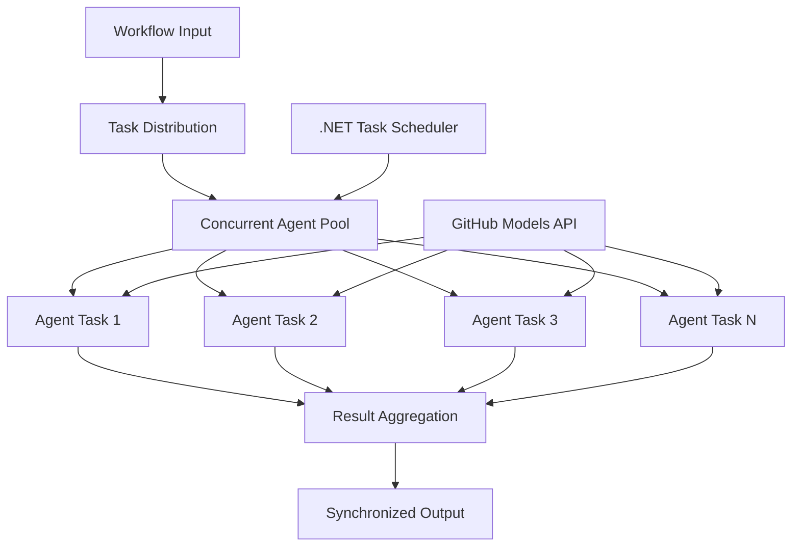

<!--
CO_OP_TRANSLATOR_METADATA:
{
  "original_hash": "b9c6e32c9b5f2fed20b6916984440d88",
  "translation_date": "2025-11-11T13:36:48+00:00",
  "source_file": "08-multi-agent/code_samples/workflows-agent-framework/dotNET/03.dotnet-agent-framework-workflow-ghmodel-concurrent.md",
  "language_code": "ta"
}
-->
# ⚡ GitHub மாடல்களுடன் ஒரே நேரத்தில் செயல்படும் ஏஜென்ட் வேலைகள் (.NET)

## 📋 உயர் செயல்திறன் ஒரே நேர செயலாக்க பயிற்சி

இந்த நோட்புக் Microsoft Agent Framework for .NET மற்றும் GitHub மாடல்களைக் கொண்டு **ஒரே நேர செயல்பாட்டு வேலைகள்** உருவாக்குவதற்கான முறைகளை விளக்குகிறது. பல AI ஏஜென்ட்களை ஒரே நேரத்தில் இயக்குவதன் மூலம் அதிக செயல்திறனைப் பெறுவதற்கான உயர் செயல்திறன், ஒரே நேர செயலாக்க வேலைகளை உருவாக்குவது எப்படி என்பதை நீங்கள் கற்றுக்கொள்வீர்கள், மேலும் ஒருங்கிணைப்பு மற்றும் தரவின் நிலைத்தன்மையை பராமரிக்கவும்.

## 🎯 கற்றல் நோக்கங்கள்

### 🚀 **ஒரே நேர செயலாக்க அடிப்படைகள்**
- **ஏஜென்ட் ஒரே நேர செயல்பாடு**: அதிக செயல்திறனுக்காக பல AI ஏஜென்ட்களை ஒரே நேரத்தில் இயக்கவும்
- **Async/Await முறை**: .NET இன் async நிரலாக்க மாடலை பயன்படுத்தி திறமையான ஒரே நேர செயலாக்கத்தைப் பெறவும்
- **GitHub மாடல்களுடன் ஒருங்கிணைப்பு**: GitHub இன் AI மாடல் தீர்மான சேவைக்கு பல ஒரே நேர அழைப்புகளை ஒருங்கிணைக்கவும்
- **வள மேலாண்மை**: ஒரே நேர செயல்பாடுகளில் AI மாடல் வளங்களை திறமையாக நிர்வகிக்கவும்

### 🏗️ **மேம்பட்ட ஒரே நேர செயலாக்க கட்டமைப்பு**
- **Task-Based Parallelism**: .NET Task Parallel Library ஐ பயன்படுத்தி சிறந்த ஒரே நேர செயல்பாட்டை உருவாக்கவும்
- **ஒத்திசைவு முறைகள்**: ஒரே நேர ஏஜென்ட்களை ஒருங்கிணைத்து race conditions ஐ தவிர்க்கவும்
- **Load Balancing**: கிடைக்கும் செயல்திறனுக்கு ஏற்ப வேலைகளை சமமாகப் பகிரவும்
- **Fault Tolerance**: தனிப்பட்ட ஏஜென்ட் தோல்விகளை முழு வேலைகளை நிறுத்தாமல் கையாளவும்

### 🏢 **நிறுவன ஒரே நேர செயல்பாட்டு பயன்பாடுகள்**
- **உயர் அளவிலான ஆவண செயலாக்கம்**: பல ஆவணங்களை ஒரே நேரத்தில் செயலாக்கவும்
- **உடனடி உள்ளடக்க பகுப்பாய்வு**: வரும் தரவின் ஒரே நேர பகுப்பாய்வு
- **Batch Processing Optimization**: பெரிய அளவிலான தரவுகளை செயலாக்குவதற்கான செயல்திறனை அதிகரிக்கவும்
- **Multi-Modal Analysis**: பல்வேறு உள்ளடக்க வகைகள் மற்றும் வடிவங்களை ஒரே நேரத்தில் செயலாக்கவும்

## ⚙️ முன்பதிவுகள் மற்றும் அமைப்பு

### 📦 **தேவையான NuGet தொகுப்புகள்**

உயர் செயல்திறன் ஒரே நேர வேலைகளுக்கான முக்கிய தொகுப்புகள்:

```xml
<!-- Core AI Framework with Async Support -->
<PackageReference Include="Microsoft.Extensions.AI" Version="9.9.0" />

<!-- Client Model Abstractions for API Communication -->
<PackageReference Include="System.ClientModel" Version="1.6.1.0" />

<!-- Azure Identity and Async LINQ for Advanced Operations -->
<PackageReference Include="Azure.Identity" Version="1.15.0" />
<PackageReference Include="System.Linq.Async" Version="6.0.3" />

<!-- Local Agent Framework References -->
<!-- Microsoft.Agents.AI.dll - Core agent abstractions with async support -->
<!-- Microsoft.Agents.AI.OpenAI.dll - GitHub Models integration with concurrency -->
```

### 🔑 **GitHub மாடல் அமைப்பு**

**சூழல் அமைப்பு (.env கோப்பு):**
```env
GITHUB_TOKEN=your_github_personal_access_token
GITHUB_ENDPOINT=https://models.inference.ai.azure.com
GITHUB_MODEL_ID=gpt-4o-mini
```

**ஒரே நேர செயலாக்க கருத்துக்கள்:**
```csharp
// Configure for concurrent operations
var clientOptions = new OpenAIClientOptions()
{
    Endpoint = new Uri(githubEndpoint),
    // Configure connection pooling for concurrent requests
    NetworkTimeout = TimeSpan.FromMinutes(5)
};
```

### 🏗️ **ஒரே நேர வேலைகள் கட்டமைப்பு**



**முக்கிய கூறுகள்:**
- **Task Parallel Library**: .NET இன் ஒரே நேர செயல்பாடுகளுக்கான உள்ளமைவு ஆதரவு
- **Agent Pool**: ஒரே நேர செயல்பாட்டிற்கான பல ஏஜென்ட் நிகழ்வுகள்
- **Result Aggregation**: ஒரே நேர ஏஜென்ட் முடிவுகளை ஒருங்கிணைத்து இணைத்தல்
- **Synchronization Points**: ஒரே நேர செயல்பாடுகளில் தரவின் நிலைத்தன்மையை உறுதிப்படுத்தவும்

## 🎨 **ஒரே நேர வேலைகள் வடிவமைப்பு முறைகள்**

### 🔍 **ஒரே நேர ஆராய்ச்சி மற்றும் பகுப்பாய்வு**
```
Research Topic → Concurrent Research Agents → Result Synthesis → Final Report
```

### 📊 **பல மூல தரவுகளை செயலாக்கம்**
```
Data Sources → Parallel Processing Agents → Data Integration → Unified Output
```

### 🎭 **உள்ளடக்க உருவாக்க குழாய்**
```
Content Requirements → Concurrent Content Generators → Quality Review → Final Content
```

### 🔄 **Fan-Out/Fan-In செயலாக்கம்**
```
Single Input → Multiple Concurrent Processors → Result Aggregation → Single Output
```

## 🏢 **நிறுவன செயல்திறன் நன்மைகள்**

### ⚡ **திறன் மற்றும் அளவீடு**
- **நேரியல் செயல்திறன் அளவீடு**: அதிக செயல்திறனைப் பெற மேலும் ஏஜென்ட்களைச் சேர்க்கவும்
- **வள பயன்பாடு**: கிடைக்கும் AI மாடல் திறனின் அதிகபட்ச திறன்
- **செயலாக்க நேரம் குறைவு**: ஒரே நேர செயல்பாட்டின் மூலம் நேரத்தை குறிப்பிடத்தக்க அளவில் குறைக்கவும்
- **Elastic Scaling**: வேலைப்பளுவின் அடிப்படையில் ஒரே நேர ஏஜென்ட் எண்ணிக்கையை தானாக சரிசெய்யவும்

### 🛡️ **நம்பகத்தன்மை மற்றும் மாறுபாடு**
- **Fault Isolation**: தனிப்பட்ட ஏஜென்ட் தோல்விகள் மற்ற ஒரே நேர செயல்பாடுகளை பாதிக்காது
- **Graceful Degradation**: குறைந்த ஏஜென்ட் திறனுடன் அமைப்பு செயல்படுகிறது
- **Error Recovery**: தோல்வியடைந்த ஒரே நேர செயல்பாடுகளுக்கான தானியங்கி மீளமைப்பு
- **Load Distribution**: கிடைக்கும் ஏஜென்ட்களுக்கு வேலை சமமாகப் பகிரவும்

### 📊 **செயல்திறன் கண்காணிப்பு**
- **ஒரே நேர செயல்பாட்டு அளவீடுகள்**: அனைத்து ஒரே நேர செயல்பாடுகளின் செயல்திறனை கண்காணிக்கவும்
- **வள பயன்பாட்டு பகுப்பாய்வு**: CPU, memory, மற்றும் network பயன்பாட்டை கண்காணிக்கவும்
- **திறன் பகுப்பாய்வு**: ஒரே நேர செயல்பாட்டின் மூலம் கிடைக்கும் செயல்திறன் முன்னேற்றங்களை அளவிடவும்
- **Bottleneck Detection**: செயல்திறன் கட்டுப்பாடுகளை கண்டறிந்து தீர்க்கவும்

### 🔧 **உருவாக்கம் மற்றும் செயல்பாடுகள்**
- **Async Programming Model**: .NET இன் முதிர்ந்த async/await முறைகளைப் பயன்படுத்தவும்
- **Task Coordination**: உள்ளமைவு task மேலாண்மை மற்றும் ஒருங்கிணைப்பு திறன்கள்
- **Exception Handling**: ஒரே நேர செயல்பாடுகளுக்கான விரிவான பிழை கையாளுதல்
- **Debugging Support**: Visual Studio debugging கருவிகள் ஒரே நேர வேலைகளுக்காக

.NET உடன் உயர் செயல்திறன் ஒரே நேர AI வேலைகளை உருவாக்குவோம்! 🚀

## 💻 குறியீட்டை இயக்குதல்

முழு செயல்பாடு `03.dotnet-agent-framework-workflow-ghmodel-concurrent.cs` இல் கிடைக்கிறது. இந்த கோப்பு **Fan-Out/Fan-In ஒரே நேர வேலைகளை** பயண திட்டமிடலுக்காக விளக்குகிறது:

### 🏗️ **வேலைகள் கட்டமைப்பு**

```
User Request → ConcurrentStartExecutor → [Researcher Agent || Planner Agent] → ConcurrentAggregationExecutor → Final Output
```

**முக்கிய கூறுகள்:**

1. **ConcurrentStartExecutor**: பயனர் கோரிக்கையை அனைத்து ஏஜென்ட்களுக்கும் ஒரே நேரத்தில் பரப்புகிறது
2. **Researcher Agent**: இடங்கள் மற்றும் ஈர்ப்புகளை ஒரே நேரத்தில் பகுப்பாய்வு செய்கிறது
3. **Planner Agent**: விரிவான பயண திட்டங்களை ஒரே நேரத்தில் உருவாக்குகிறது
4. **ConcurrentAggregationExecutor**: இரு ஏஜென்ட்களிடமிருந்து முடிவுகளை சேகரித்து இணைக்கிறது

### 🎯 **Fan-Out/Fan-In முறை**

இந்த வேலைகள் Fan-Out/Fan-In முறையின் கிளாசிக் உதாரணமாக செயல்படுகிறது:
- **Fan-Out**: ஒரு உள்ளீட்டு செய்தி பல ஏஜென்ட்களுக்கு ஒரே நேரத்தில் பரப்பப்படுகிறது
- **Concurrent Processing**: பல ஏஜென்ட்கள் ஒரே பணியில் ஒரே நேரத்தில் செயல்படுகின்றன
- **Fan-In**: அனைத்து ஏஜென்ட்களிடமிருந்து முடிவுகளை சேகரித்து ஒரே வெளியீட்டில் இணைக்கிறது

### 🚀 உதாரணத்தை இயக்குதல்

```bash
# Make the script executable (Unix/Linux/macOS)
chmod +x 03.dotnet-agent-framework-workflow-ghmodel-concurrent.cs

# Run the concurrent workflow
./03.dotnet-agent-framework-workflow-ghmodel-concurrent.cs
```

Windows இல்:
```powershell
dotnet run 03.dotnet-agent-framework-workflow-ghmodel-concurrent.cs
```

### 📝 எதிர்பார்க்கப்படும் வெளியீடு

வேலைகள்:
1. **கோரிக்கையை பரப்புதல்**: "டிசம்பர் மாதத்தில் சியாட்டிலுக்கு ஒரு பயணத்தை திட்டமிடுங்கள்" என்ற கோரிக்கையை இரு ஏஜென்ட்களுக்கும் அனுப்புகிறது
2. **ஒரே நேர செயல்பாடு**: இரு ஏஜென்ட்களும் ஒரே நேரத்தில் செயல்படுகின்றன:
   - Researcher ஈர்ப்புகள் மற்றும் விவரங்களை கண்டறிகிறது
   - Planner திட்டம் மற்றும் லாஜிஸ்டிக்ஸ் உருவாக்குகிறது
3. **Aggregation**: இரு பதில்களையும் ஒருங்கிணைத்து முழுமையான வெளியீட்டை உருவாக்குகிறது
4. **முடிவுகளை காட்டுதல்**: அனைத்து தகவல்களுடன் இணைக்கப்பட்ட பயண திட்டத்தை காட்டுகிறது

### 🔧 தனிப்பயனாக்கல் விருப்பங்கள்

**மேலும் ஒரே நேர ஏஜென்ட்களைச் சேர்க்கவும்:**
```csharp
// Create additional specialized agents
AIAgent budgetAgent = openAIClient.GetChatClient(github_model_id).CreateAIAgent(
    name: "Budget-Agent", instructions: "Calculate travel costs...");

// Add to fan-out
var workflow = new WorkflowBuilder(startExecutor)
    .AddFanOutEdge(startExecutor, targets: [researcherAgent, plannerAgent, budgetAgent])
    .AddFanInEdge(aggregationExecutor, sources: [researcherAgent, plannerAgent, budgetAgent])
    .WithOutputFrom(aggregationExecutor)
    .Build();

// Update aggregation count
if (this._messages.Count == 3) { ... }
```

**ஏஜென்ட் வழிமுறைகளை மாற்றவும்:**
```csharp
const string ResearcherAgentInstructions = "Your custom instructions for research...";
const string PlanAgentInstructions = "Your custom instructions for planning...";
```

**பணியை மாற்றவும்:**
```csharp
StreamingRun run = await InProcessExecution.StreamAsync(
    workflow, 
    "Plan a European vacation for 2 weeks in summer"
);
```

### 🎯 உண்மையான உலக பயன்பாடுகள்

இந்த ஒரே நேர முறை பின்வரும் பயன்பாடுகளுக்கு ஏற்றது:
- **உள்ளடக்க உருவாக்கம்**: பல எழுத்தாளர்கள் வெவ்வேறு பிரிவுகளை ஒரே நேரத்தில் உருவாக்குதல்
- **கோடு மதிப்பீடு**: பல மதிப்பீட்டாளர்கள் வெவ்வேறு கோணங்களில் கோடுகளை பகுப்பாய்வு செய்தல்
- **சந்தை ஆராய்ச்சி**: வெவ்வேறு சந்தை பிரிவுகளின் ஒரே நேர பகுப்பாய்வு
- **ஆவண செயலாக்கம்**: ஒரே நேரத்தில் எடுப்பு, பகுப்பாய்வு மற்றும் சரிபார்ப்பு
- **பல கோண பகுப்பாய்வு**: ஒரே உள்ளீட்டில் பல்வேறு பார்வைகளைப் பெறுதல்

### 🔍 தனிப்பயன் Executors ஐப் புரிந்துகொள்வது

**ConcurrentStartExecutor:**
- `IMessageHandler<string>` ஐ செயல்படுத்தி string உள்ளீட்டை ஏற்கிறது
- அனைத்து இணைக்கப்பட்ட ஏஜென்ட்களுக்கும் செய்திகளை பரப்புகிறது
- `TurnToken` ஐ அனுப்பி ஒரே நேர செயல்பாட்டைத் தொடங்குகிறது

**ConcurrentAggregationExecutor:**
- `IMessageHandler<ChatMessage>` ஐ செயல்படுத்தி ஏஜென்ட் பதில்களைப் பெறுகிறது
- Thread-safe முறையில் செய்திகளை சேகரிக்கிறது
- எதிர்பார்க்கப்படும் அனைத்து பதில்களும் வந்தவுடன் ஒருங்கிணைக்கிறது
- `context.YieldOutputAsync()` ஐப் பயன்படுத்தி இறுதி வெளியீட்டை வழங்குகிறது

### ⚡ செயல்திறன் நன்மைகள்

**ஒரே நேரம் vs தொடர்ச்சியாக:**
- தொடர்ச்சி: Agent1 (30s) → Agent2 (30s) = **மொத்தம் 60 விநாடிகள்**
- ஒரே நேரம்: Agent1 (30s) || Agent2 (30s) = **மொத்தம் 30 விநாடிகள்**

**திறன் முன்னேற்றம்**: வேலைப்பளு மற்றும் வளங்களின் அடிப்படையில் N ஒரே நேர ஏஜென்ட்களுக்கு N× வேகமாக

### 🛡️ பிழை கையாளுதல்

வேலைகள் தனிப்பட்ட ஏஜென்ட் தோல்விகளை நன்கு கையாளுகிறது:
- ஒரு ஏஜென்ட் தோல்வியடைந்தால், மற்றவை செயல்படத் தொடரும்
- Aggregator நேரம் முடிவுக்கு logic ஐ செயல்படுத்தலாம்
- தேவைப்பட்டால் பகுதி முடிவுகளை வழங்கலாம்

### 📊 மேம்பட்ட அம்சங்கள்

**Dynamic Agent Count:**
Aggregation logic ஐ மாற்றி மாறுபட்ட ஏஜென்ட் எண்ணிக்கையை ஆதரிக்கவும்:

```csharp
private int _expectedAgentCount;
private readonly List<ChatMessage> _messages = [];

public async ValueTask HandleAsync(ChatMessage message, IWorkflowContext context)
{
    this._messages.Add(message);
    if (this._messages.Count == _expectedAgentCount)
    {
        // Process aggregation
    }
}
```

இந்த ஒரே நேர வேலைகள் முறை உயர் செயல்திறன், அளவீடு செய்யக்கூடிய AI ஏஜென்ட் அமைப்புகளை உருவாக்க மிகவும் முக்கியமானது!

---

<!-- CO-OP TRANSLATOR DISCLAIMER START -->
**குறிப்பு**:  
இந்த ஆவணம் AI மொழிபெயர்ப்பு சேவை [Co-op Translator](https://github.com/Azure/co-op-translator) பயன்படுத்தி மொழிபெயர்க்கப்பட்டுள்ளது. நாங்கள் துல்லியத்திற்காக முயற்சிக்கிறோம், ஆனால் தானியங்கி மொழிபெயர்ப்புகளில் பிழைகள் அல்லது தவறுகள் இருக்கக்கூடும் என்பதை கவனத்தில் கொள்ளவும். அதன் தாய்மொழியில் உள்ள மூல ஆவணம் அதிகாரப்பூர்வ ஆதாரமாக கருதப்பட வேண்டும். முக்கியமான தகவல்களுக்கு, தொழில்முறை மனித மொழிபெயர்ப்பு பரிந்துரைக்கப்படுகிறது. இந்த மொழிபெயர்ப்பைப் பயன்படுத்துவதால் ஏற்படும் எந்த தவறான புரிதல்கள் அல்லது தவறான விளக்கங்களுக்கு நாங்கள் பொறுப்பல்ல.
<!-- CO-OP TRANSLATOR DISCLAIMER END -->