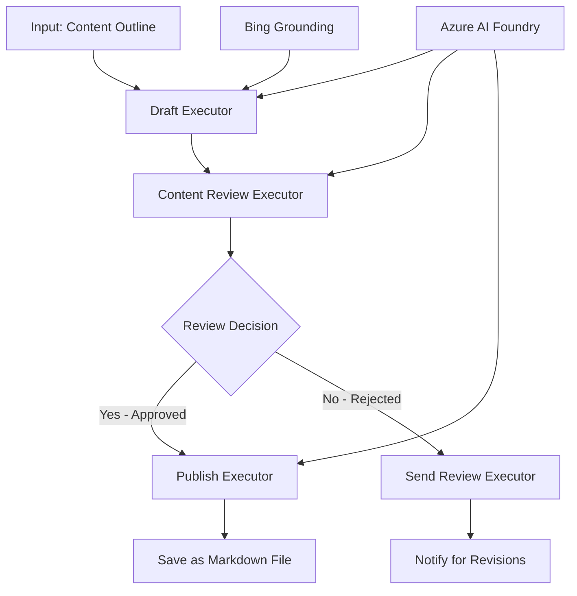

<!--
CO_OP_TRANSLATOR_METADATA:
{
  "original_hash": "8abd335151cee553293b637ee3d80d10",
  "translation_date": "2025-11-11T12:36:20+00:00",
  "source_file": "08-multi-agent/code_samples/workflows-agent-framework/dotNET/04.dotnet-agent-framework-workflow-aifoundry-condition.md",
  "language_code": "ta"
}
-->
# 🔀 Azure AI Foundry (.NET) மூலம் நிபந்தனை அடிப்படையிலான ஏஜென்ட் வேலைப்பாடுகள்

## 📋 அறிவார்ந்த முடிவு அடிப்படையிலான வேலைப்பாடுகள் பயிற்சி

இந்த நோட்புக் Azure AI Foundry மற்றும் Microsoft Agent Framework for .NET பயன்படுத்தி **நிபந்தனை வேலைப்பாடுகள்** உருவாக்குவதற்கான முறைகளை விளக்குகிறது. AI பகுப்பாய்வு, வணிக விதிகள் மற்றும் மாறும் சூழ்நிலைகளின் அடிப்படையில் செயல்பாட்டை அறிவார்ந்த முறையில் வழிநடத்துவதற்கான தொழில்துறை தரமான தானியக்கத்தை உருவாக்குவது எப்படி என்பதை நீங்கள் கற்றுக்கொள்வீர்கள்.

## 🎯 கற்றல் நோக்கங்கள்

### 🧠 **அறிவார்ந்த முடிவு கட்டமைப்பு**
- **நிபந்தனை தர்க்க செயல்படுத்தல்**: பல கிளைமிடுப்புகளுடன் கூடிய சிக்கலான முடிவு மரங்களை உருவாக்கவும்
- **AI வழிநடத்தல்**: Azure AI Foundry மாதிரிகளை பயன்படுத்தி அறிவார்ந்த வழிநடத்தல் முடிவுகளை எடுக்கவும்
- **மாறும் வேலைப்பாடுகள்**: இயக்க நேரத்தில் பகுப்பாய்வு மற்றும் சூழ்நிலைகளின் அடிப்படையில் வேலைப்பாடுகளை மாற்றவும்
- **தொழில்துறை விதி ஒருங்கிணைப்பு**: வேலைப்பாடுகளில் வணிக தர்க்கம் மற்றும் இணக்கத்தன்மை தேவைகளை இணைக்கவும்

### 🔀 **மேம்பட்ட நிபந்தனை முறைமைகள்**
- **பல அளவுகோள்களுடன் முடிவு எடுக்கும் செயல்முறை**: வழிநடத்தல் முடிவுகளுக்கான பல காரணிகளை மதிப்பீடு செய்யவும்
- **சூழ்நிலை சார்ந்த செயல்பாடு**: சேகரிக்கப்பட்ட வேலைப்பாடுகள் சூழ்நிலை மற்றும் வரலாற்றின் அடிப்படையில் முடிவுகளை எடுக்கவும்
- **செயல்பாட்டு பாதைகளை மாறும் நேரத்தில் மாற்றுதல்**: நேரடி சூழ்நிலைகளின் அடிப்படையில் செயல்பாட்டு பாதைகளை மாற்றவும்
- **விதி இயந்திர ஒருங்கிணைப்பு**: வேலைப்பாடுகளில் சிக்கலான வணிக விதி இயந்திரங்களை செயல்படுத்தவும்

### 🏢 **தொழில்துறை நிபந்தனை பயன்பாடுகள்**
- **ஆவண வகைப்படுத்தல் மற்றும் வழிநடத்தல்**: ஆவணங்களை தானாகவே வகைப்படுத்தி சரியான வேலைப்பாடுகளுக்கு வழிநடத்தவும்
- **வாடிக்கையாளர் சேவை பிரிவாக்கம்**: வாடிக்கையாளர் கேள்விகளை சிறப்பு கையாளும் குழுக்களுக்கு அறிவார்ந்த முறையில் வழிநடத்தவும்
- **இணக்கத்தன்மை மற்றும் அபாய செயல்பாடு**: அபாய மதிப்பீட்டின் அடிப்படையில் வேறுபட்ட சரிபார்ப்பு மற்றும் மதிப்பீட்டு செயல்பாடுகளை பயன்படுத்தவும்
- **தர உறுதிப்படுத்தல் வேலைப்பாடுகள்**: தர அளவுகோள்களின் அடிப்படையில் சரியான மதிப்பீட்டு செயல்பாடுகளுக்கு உள்ளடக்கத்தை வழிநடத்தவும்

## ⚙️ முன்பதிவுகள் மற்றும் அமைப்பு

### 📦 **தேவையான NuGet தொகுப்புகள்**

நிபந்தனை வேலைப்பாடுகள் செயல்பாட்டிற்கான மேம்பட்ட தொகுப்புகள்:

```xml
<!-- Core AI Framework -->
<PackageReference Include="Microsoft.Extensions.AI" Version="9.9.0" />

<!-- Azure AI Agents with Persistent State -->
<PackageReference Include="Azure.AI.Agents.Persistent" Version="1.2.0-beta.5" />

<!-- Azure Identity and Utilities -->
<PackageReference Include="Azure.Identity" Version="1.15.0" />
<PackageReference Include="System.Linq.Async" Version="6.0.3" />
<PackageReference Include="DotNetEnv" Version="3.1.1" />

<!-- Local Workflow Framework References -->
<!-- Microsoft.Agents.Workflows.dll - Advanced workflow orchestration -->
<!-- Microsoft.Agents.AI.AzureAI.dll - Azure AI Foundry integration -->
<!-- Microsoft.Agents.AI.dll - Core agent abstractions -->
```

### 🔑 **Azure AI Foundry அமைப்பு**

**தேவையான Azure வளங்கள்:**
- நிபந்தனை செயல்பாட்டு மாதிரிகளுடன் Azure AI Foundry பணிமனை
- சரியான கணினி அளவீடுகள் மற்றும் அனுமதிகளுடன் Azure சந்தா
- முடிவு எடுக்கும் மற்றும் உள்ளடக்க பகுப்பாய்விற்கான AI மாதிரிகள்
- (விருப்பம்) Bing Search API இணைப்பு தரவுத்தொகுப்பு திறன்களுக்காக

**சூழல் அமைப்பு (.env கோப்பு):**
```env
# Azure AI Foundry Configuration
AZURE_AI_PROJECT_ENDPOINT=https://your-project.cognitiveservices.azure.com/
BING_CONNECTION_ID=your-bing-connection-id
```

**அங்கீகாரம் அமைப்பு:**
```csharp
// Azure CLI or Managed Identity authentication
using Azure.Identity;
var credential = new AzureCliCredential();

// Load environment configuration
DotNetEnv.Env.Load("../../../.env");
```

### 🏗️ **நிபந்தனை வேலைப்பாடுகள் கட்டமைப்பு**



**முக்கிய கூறுகள்:**
- **Draft Executor**: வரைபடங்களிலிருந்து ஆரம்ப உள்ளடக்க வரைபடங்களை உருவாக்கும் AI ஏஜென்ட்
- **Content Review Executor**: வரைபட தரம் மற்றும் இணக்கத்தன்மையை மதிப்பீடு செய்யும் AI ஏஜென்ட்
- **Conditional Routing**: மதிப்பீட்டு முடிவுகளின் அடிப்படையில் வழிநடத்தும் முடிவு தர்க்கம்
- **Publish/Review Paths**: ஒப்புதலளிக்கப்பட்ட மற்றும் நிராகரிக்கப்பட்ட உள்ளடக்கத்திற்கான தனித்த செயல்பாட்டு பாதைகள்
- **State Management**: வேலைப்பாடுகள் முழுவதும் உள்ளடக்க மற்றும் மதிப்பீட்டு சூழ்நிலையை பராமரிக்கிறது

## 🎨 **நிபந்தனை வேலைப்பாடுகள் வடிவமைப்பு முறைமைகள்**

### 📋 **தர நுழைவாயில்களுடன் உள்ளடக்க தயாரிப்பு**
```
Outline → Draft Creation → Quality Review → {Approve: Publish | Reject: Revise}
```

### 🎯 **அபாய அடிப்படையிலான ஆவண செயல்பாடு**
```
Document → Risk Assessment → {Low: Standard | High: Enhanced Review}
```

### 🔍 **அறிவார்ந்த வாடிக்கையாளர் சேவை வழிநடத்தல்**
```
Customer Query → Analysis → {Simple: FAQ Bot | Complex: Human Agent}
```

### 💼 **இணக்கத்தன்மை சார்ந்த வேலைப்பாடுகள்**
```
Content → Compliance Check → {Pass: Publish | Fail: Legal Review}
```

## 🏢 **தொழில்துறை நிபந்தனை நன்மைகள்**

### 🎯 **அறிவார்ந்த தானியக்கம்**
- **சிறந்த முடிவு எடுக்கும் செயல்முறை**: உள்ளடக்க பகுப்பாய்வு மற்றும் சூழ்நிலையின் அடிப்படையில் AI வழிநடத்தல் முடிவுகள்
- **மாறும் செயல்பாடு**: மாறும் சூழ்நிலைகளின் அடிப்படையில் தானாகவே வேலைப்பாடுகள் சரிசெய்யப்படும்
- **வணிக விதி அமலாக்கம்**: சிக்கலான வணிக தர்க்கம் மற்றும் கொள்கைகளை தானாகவே செயல்படுத்தல்
- **சூழ்நிலை சார்ந்த வழிநடத்தல்**: முழு வேலைப்பாடுகள் வரலாற்றின் அடிப்படையில் முடிவுகள்

### 📈 **செயல்பாட்டு மேம்பாடு**
- **மிகச்சிறந்த வள ஒதுக்கீடு**: வேலைகளை மிகச்சிறந்த நிபுணர்களுக்கும் செயல்பாடுகளுக்கும் வழிநடத்தல்
- **குறைந்த கையால் தலையீடு**: தானியக்க முடிவு எடுக்கும் செயல்முறை மனித வழிநடத்தல் தேவையை குறைக்கிறது
- **வேகமான தீர்வு நேரங்கள்**: சரியான நிபுணத்துவம் மற்றும் செயல்பாட்டு திறன்களுக்கு நேரடி வழிநடத்தல்
- **ஒரே மாதிரியான பயன்பாடு**: வணிக விதிகள் மற்றும் முடிவு அளவுகோள்களின் ஒரே மாதிரியான செயல்பாடு

### 🛡️ **அபாய மேலாண்மை மற்றும் இணக்கத்தன்மை**
- **தானியக்க அபாய மதிப்பீடு**: உள்ளடக்க மற்றும் சூழ்நிலை அபாய நிலைகளை AI மூலம் மதிப்பீடு
- **இணக்கத்தன்மை அமலாக்கம்**: தேவையான ஒழுங்குமுறை செயல்பாடுகளின் வழியாக தானாகவே வழிநடத்தல்
- **பாதுகாப்பு நெறிமுறை பயன்பாடு**: அபாய மதிப்பீட்டின் அடிப்படையில் மேம்பட்ட பாதுகாப்பு நடவடிக்கைகள்
- **ஆடிட் தடம் பராமரிப்பு**: வழிநடத்தல் முடிவுகள் மற்றும் காரணங்களின் முழுமையான ஆவணங்கள்

### 📊 **பகுப்பாய்வு மற்றும் தொடர்ச்சியான மேம்பாடு**
- **முடிவு பகுப்பாய்வு**: வழிநடத்தல் முடிவுகளின் செயல்திறன் மற்றும் துல்லியத்தை கண்காணிக்கவும்
- **முறைமைகள் அடையாளம்**: வழிநடத்தல் முடிவுகளில் காலத்திற்கேற்ப போக்குகள் மற்றும் முறைமைகளை கண்டறியவும்
- **செயல்திறன் மேம்பாடு**: முடிவு அளவுகோள்கள் மற்றும் வழிநடத்தல் திறனின் தொடர்ச்சியான மேம்பாடு
- **வணிக நுண்ணறிவு**: உள்ளடக்க பண்புகள் மற்றும் செயல்பாட்டு தேவைகளின் மீது பார்வைகள்

### 🔧 **தொழில்நுட்ப மேம்பாடு**
- **நிலையான நிலை மேலாண்மை**: வேலைப்பாடுகள் செயல்பாட்டின் முழுவதும் சிக்கலான நிலையை பராமரிக்கவும்
- **அளவீட்டு கட்டமைப்பு**: அதிக அளவிலான நிபந்தனை செயல்பாட்டு தேவைகளை கையாளவும்
- **ஒருங்கிணைப்பு திறன்கள்**: தற்போதைய வணிக அமைப்புகள் மற்றும் செயல்பாடுகளுடன் எளிதாக ஒருங்கிணைப்பு
- **கண்காணிப்பு மற்றும் பார்வையிடல்**: வேலைப்பாடுகள் செயல்திறன் மற்றும் முடிவுகளின் விரிவான கண்காணிப்பு

.NET மூலம் அறிவார்ந்த, முடிவு அடிப்படையிலான தொழில்துறை வேலைப்பாடுகளை உருவாக்குவோம்! 🚀

## 💻 குறியீட்டை இயக்குதல்

முழுமையான செயல்பாடு `04.dotnet-agent-framework-workflow-aifoundry-condition.cs` இல் கிடைக்கிறது. இது **தர நுழைவாயில்களுடன் உள்ளடக்க தயாரிப்பு வேலைப்பாடுகளை** விளக்குகிறது:

### 🏗️ **வேலைப்பாடுகள் கட்டமைப்பு**

```
Content Outline → Draft Creation → Quality Review → Conditional Routing:
                                                      ├─ Approved (>200 words) → Publish
                                                      └─ Rejected (<200 words) → Review Notification
```

**வேலைப்பாடுகளில் உள்ள ஏஜென்ட்கள்:**
1. **Evangelist Agent**: Bing தரவுத்தொகுப்புடன் வரைபடங்களிலிருந்து பயிற்சி வரைபடங்களை உருவாக்குகிறது
2. **Content Reviewer Agent**: வரைபட தரத்தை மதிப்பீடு செய்கிறது (சொற்களின் எண்ணிக்கை, முழுமை)
3. **Publisher Agent**: ஒப்புதலளிக்கப்பட்ட உள்ளடக்கத்தை நேரம் முத்திரையிடப்பட்ட Markdown கோப்புகளாக சேமிக்கிறது

**தனிப்பயன் செயல்படுத்துபவர்கள்:**
1. **DraftExecutor**: வரைபட உருவாக்கத்தை ஒருங்கிணைக்கிறது
2. **ContentReviewExecutor**: தர மதிப்பீட்டை செய்கிறது
3. **PublishExecutor**: ஒப்புதலளிக்கப்பட்ட உள்ளடக்க வெளியீட்டை கையாளுகிறது
4. **SendReviewExecutor**: நிராகரிக்கப்பட்ட உள்ளடக்க அறிவிப்புகளை நிர்வகிக்கிறது

### 🚀 உதாரணத்தை இயக்குதல்

**முன்பதிவுகள்:**
- Azure AI Foundry பணிமனை அமைக்கப்பட்டது
- Azure CLI அங்கீகாரம் (`az login`)
- (விருப்பம்) Bing Search இணைப்பு தரவுத்தொகுப்பிற்காக

```bash
# Make the script executable (Unix/Linux/macOS)
chmod +x 04.dotnet-agent-framework-workflow-aifoundry-condition.cs

# Run the conditional workflow
./04.dotnet-agent-framework-workflow-aifoundry-condition.cs
```

Windows இல்:
```powershell
dotnet run 04.dotnet-agent-framework-workflow-aifoundry-condition.cs
```

### 📝 எதிர்பார்க்கப்படும் வெளியீடு

வேலைப்பாடுகள்:
1. **ஏஜென்ட்களை உருவாக்குதல்**: மூன்று சிறப்பு Azure AI Foundry ஏஜென்ட்களை ஆரம்பிக்கிறது
2. **வரைபட உருவாக்கம்**: Evangelist ஏஜென்ட் வரைபடத்திலிருந்து பயிற்சி வரைபடத்தை உருவாக்குகிறது
3. **உள்ளடக்க மதிப்பீடு**: Content Reviewer வரைபட தரத்தை மதிப்பீடு செய்கிறது
4. **நிபந்தனை வழிநடத்தல்**:
   - **ஒப்புதலளிக்கப்பட்ட (>200 சொற்கள்)**: PublishExecutor Markdown கோப்பாக சேமிக்கிறது
   - **நிராகரிக்கப்பட்ட (<200 சொற்கள்)**: SendReviewExecutor மதிப்பீட்டு அறிவிப்பை அனுப்புகிறது
5. **முடிவுகளை காட்டுதல்**: இறுதி வேலைப்பாடுகள் முடிவை காட்டுகிறது

### 🔧 தனிப்பயன் விருப்பங்கள்

**மதிப்பீட்டு அளவுகோள்களை மாற்றவும்:**
```csharp
const string ContentReviewerInstructions = @"
You are a content reviewer...
1. Check if content is more than 500 words (instead of 200)
2. Verify technical accuracy
3. Ensure proper formatting
...";
```

**மேலும் நிபந்தனை பாதைகளை சேர்க்கவும்:**
```csharp
var workflow = new WorkflowBuilder(draftExecutor)
    .AddEdge(draftExecutor, contentReviewerExecutor)
    .AddEdge(contentReviewerExecutor, publishExecutor, condition: GetCondition("Excellent"))
    .AddEdge(contentReviewerExecutor, editExecutor, condition: GetCondition("Good"))
    .AddEdge(contentReviewerExecutor, sendReviewerExecutor, condition: GetCondition("Poor"))
    .Build();
```

**உள்ளடக்க தேவைகளை மாற்றவும்:**
```csharp
string OUTLINE_Content = @"
# Your Custom Topic
## Section 1
https://your-reference-url
## Section 2
...
";
```

### 🎯 உண்மையான உலக பயன்பாடுகள்

இந்த நிபந்தனை வேலைப்பாடுகள் முறைமை பின்வரும் பயன்பாடுகளுக்கு ஏற்றது:
- **உள்ளடக்க மேலாண்மை அமைப்புகள்**: தர நுழைவாயில்களுடன் தானியக்க ஆசிரிய வேலைப்பாடுகள்
- **ஆவண செயல்பாடு**: வகைப்படுத்தல் மற்றும் இணக்கத்தன்மையின் அடிப்படையில் ஆவணங்களை வழிநடத்தல்
- **வாடிக்கையாளர் ஆதரவு**: சிக்கலான மற்றும் அவசர கேள்விகளின் அடிப்படையில் அறிவார்ந்த டிக்கெட் வழிநடத்தல்
- **சட்ட மதிப்பீடு**: ஒப்பந்தங்களை அபாய மதிப்பீடு மற்றும் மதிப்பின் அடிப்படையில் வழிநடத்தல்
- **மனிதவள செயல்பாடுகள்**: விண்ணப்பங்களை சரியான திரையிடல் வேலைப்பாடுகளுக்கு வழிநடத்தல்

### 🔍 நிபந்தனை தர்க்கத்தை புரிந்துகொள்வது

**Condition Function:**
```csharp
public Func<object?, bool> GetCondition(string expectedResult) =>
    reviewResult => reviewResult is ReviewResult review && review.Result == expectedResult;
```

இந்த செயல்பாடு ஒரு முன்னிலை உருவாக்குகிறது:
1. முடிவை `ReviewResult` வகையாக சரிபார்க்கிறது
2. `Result` சொத்தை எதிர்பார்க்கப்படும் மதிப்புடன் ஒப்பிடுகிறது
3. வழிநடத்தல் முடிவை தீர்மானிக்க உண்மை/தவறை திருப்புகிறது

**நிபந்தனை கொண்ட வேலைப்பாடுகள் விளிம்புகள்:**
```csharp
.AddEdge(contentReviewerExecutor, publishExecutor, condition: GetCondition("Yes"))
.AddEdge(contentReviewerExecutor, sendReviewerExecutor, condition: GetCondition("No"))
```

### 📊 மேம்பட்ட அம்சங்கள்

**JSON Schema Validation:**
வேலைப்பாடுகள் அமைந்த பதில்களை உறுதிப்படுத்த JSON schemas பயன்படுத்துகிறது:

```csharp
// Define response structure
public class ReviewResult
{
    [JsonPropertyName("review_result")]
    public string Result { get; set; } = string.Empty;
    
    [JsonPropertyName("reason")]
    public string Reason { get; set; } = string.Empty;
    
    [JsonPropertyName("draft_content")]
    public string DraftContent { get; set; } = string.Empty;
}

// Apply to agent
ResponseFormat = ChatResponseFormat.ForJsonSchema(
    AIJsonUtilities.CreateJsonSchema(typeof(ReviewResult)), 
    "ReviewResult", 
    "Review Result From DraftContent"
)
```

**Bing Grounding Integration:**
Evangelist ஏஜென்ட் Bing தரவுத்தொகுப்பை பயன்படுத்தி நேரடி தகவல்களை அணுகுகிறது:

```csharp
var bingGroundingConfig = new BingGroundingSearchConfiguration(bing_conn_id);
BingGroundingToolDefinition bingGroundingTool = new(
    new BingGroundingSearchToolParameters([bingGroundingConfig])
);
```

இது ஏஜென்ட்டை வரைபடத்தில் உள்ள URL-களை பின்தொடர்ந்து தற்போதைய தகவல்களை எடுக்க உதவுகிறது.

### 🛡️ பிழை கையாளுதல்

வேலைப்பாடுகள் நிராகரிக்கப்பட்ட உள்ளடக்கத்திற்கான வலுவான பிழை கையாளுதலை கொண்டுள்ளது:
- மதிப்பீட்டு தோல்விகள் மாற்று பாதையை தூண்டுகின்றன
- நிராகரிப்பு காரணங்களை தெளிவாக விளக்கும் அறிவிப்புகள்
- திருத்தத்திற்காக உள்ளடக்கம் பாதுகாக்கப்படுகிறது

### 🔄 வேலைப்பாடுகளை விரிவாக்குதல்

**திருத்த மடக்கு சேர்க்கவும்:**
தானாகவே உள்ளடக்கத்தை மீண்டும் வரைபடமாக்கும் பின்னூட்ட மடக்கு உருவாக்கவும்:

```csharp
.AddEdge(contentReviewerExecutor, publishExecutor, condition: GetCondition("Yes"))
.AddEdge(contentReviewerExecutor, draftExecutor, condition: GetCondition("No")) // Loop back
```

**பல நிலை மதிப்பீட்டை செயல்படுத்தவும்:**
வேறுபட்ட அளவுகோள்களுடன் பல மதிப்பீட்டு நிலைகளை சேர்க்கவும்:

```csharp
.AddEdge(draftExecutor, technicalReviewer)
.AddEdge(technicalReviewer, editorialReviewer, condition: GetCondition("TechPass"))
.AddEdge(editorialReviewer, publishExecutor, condition: GetCondition("EditPass"))
```

இந்த நிபந்தனை வேலைப்பாடுகள் முறைமை அறிவார்ந்த, சிக்கலான தொழில்துறை தானியக்க அமைப்புகளை உருவாக்குவதற்கான அடித்தளத்தை வழங்குகிறது! 🚀

---

<!-- CO-OP TRANSLATOR DISCLAIMER START -->
**புறக்குறிப்பு**:  
இந்த ஆவணம் AI மொழிபெயர்ப்பு சேவை [Co-op Translator](https://github.com/Azure/co-op-translator) பயன்படுத்தி மொழிபெயர்க்கப்பட்டுள்ளது. நாங்கள் துல்லியத்திற்காக முயற்சிக்கின்றோம், ஆனால் தானியங்கி மொழிபெயர்ப்புகளில் பிழைகள் அல்லது தவறுகள் இருக்கக்கூடும் என்பதை கவனத்தில் கொள்ளவும். அதன் தாய்மொழியில் உள்ள அசல் ஆவணம் அதிகாரப்பூர்வ மூலமாக கருதப்பட வேண்டும். முக்கியமான தகவல்களுக்கு, தொழில்முறை மனித மொழிபெயர்ப்பு பரிந்துரைக்கப்படுகிறது. இந்த மொழிபெயர்ப்பைப் பயன்படுத்துவதால் ஏற்படும் எந்த தவறான புரிதல்கள் அல்லது தவறான விளக்கங்களுக்கு நாங்கள் பொறுப்பல்ல.
<!-- CO-OP TRANSLATOR DISCLAIMER END -->