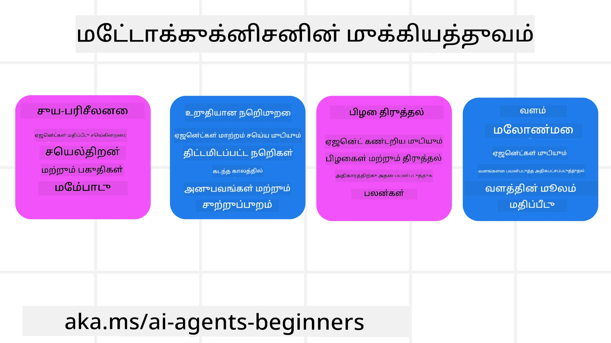
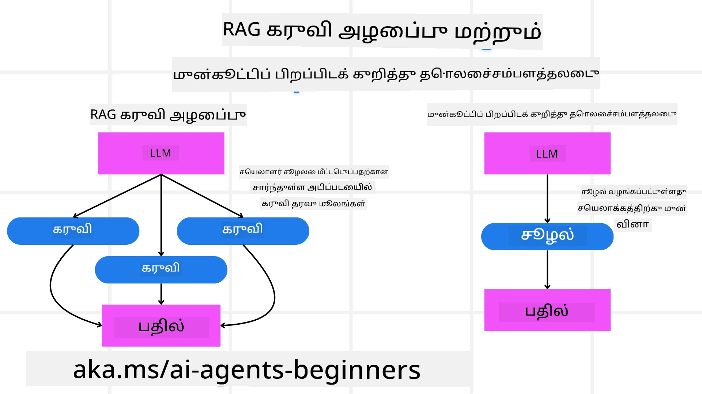

<!--
CO_OP_TRANSLATOR_METADATA:
{
  "original_hash": "5f0deef171fc3a68d5d3d770a8bfb03d",
  "translation_date": "2025-10-11T10:59:10+00:00",
  "source_file": "09-metacognition/README.md",
  "language_code": "ta"
}
-->
[](https://youtu.be/His9R6gw6Ec?si=3_RMb8VprNvdLRhX)

> _(மேலே உள்ள படத்தை கிளிக் செய்து இந்த பாடத்தின் வீடியோவைப் பாருங்கள்)_
# AI முகவர்களில் தன்னிலை உணர்வு

## அறிமுகம்

AI முகவர்களில் தன்னிலை உணர்வைப் பற்றிய பாடத்திற்கு வரவேற்கிறோம்! AI முகவர்கள் தங்களது சிந்தனை செயல்முறைகளைப் பற்றி சிந்திக்க எப்படி முடியும் என்பதை அறிய ஆர்வமுள்ள தொடக்க நிலை மாணவர்களுக்காக இந்த அத்தியாயம் வடிவமைக்கப்பட்டுள்ளது. இந்த பாடத்தின் முடிவில், முக்கிய கருத்துகளைப் புரிந்து கொண்டு, AI முகவர் வடிவமைப்பில் தன்னிலை உணர்வைச் சேர்க்க உதவும் நடைமுறை உதாரணங்களைப் பெறுவீர்கள்.

## கற்றல் இலக்குகள்

இந்த பாடத்தை முடித்த பிறகு, நீங்கள்:

1. முகவர் வரையறைகளில் காரணமுடைய மடக்கங்களைப் புரிந்து கொள்ள முடியும்.
2. தன்னிலை திருத்தும் முகவர்களுக்கு திட்டமிடல் மற்றும் மதிப்பீட்டு நுட்பங்களைப் பயன்படுத்த முடியும்.
3. பணிகளை நிறைவேற்ற குறியீட்டை மாற்றும் திறன் கொண்ட உங்கள் சொந்த முகவர்களை உருவாக்க முடியும்.

## தன்னிலை உணர்வின் அறிமுகம்

தன்னிலை உணர்வு என்பது ஒருவரது சிந்தனை செயல்முறைகளைப் பற்றி சிந்திக்கும் உயர் நிலை அறிவாற்றல் செயல்முறைகளை குறிக்கிறது. AI முகவர்களுக்கு, இது தன்னிலை உணர்வு மற்றும் கடந்த அனுபவங்களை அடிப்படையாகக் கொண்டு தங்கள் செயல்களை மதிப்பீடு செய்து சரிசெய்யும் திறனை வழங்குகிறது. "சிந்தனை பற்றி சிந்தனை" எனப்படும் தன்னிலை உணர்வு, முகவர் AI அமைப்புகளை உருவாக்குவதில் முக்கியமான கருத்தாகும். இது AI அமைப்புகள் தங்களது உள் செயல்முறைகளைப் பற்றி விழிப்புணர்வுடன் இருக்கவும், தங்கள் நடத்தை கண்காணிக்கவும், ஒழுங்குபடுத்தவும், மற்றும் தகுந்த மாற்றங்களைச் செய்யவும் உதவுகிறது. நாம் ஒரு பிரச்சினையைப் பற்றி சிந்திக்கும்போது அல்லது சூழலைப் படிக்கும்போது செய்யும் செயல்களைப் போலவே இது செயல்படுகிறது. இந்த தன்னிலை உணர்வு AI அமைப்புகள் சிறந்த முடிவுகளை எடுக்க, பிழைகளை அடையாளம் காண, மற்றும் காலப்போக்கில் தங்கள் செயல்திறனை மேம்படுத்த உதவுகிறது - இது டூரிங் சோதனை மற்றும் AI உலகை ஆட்சி செய்யும் விவாதத்துடன் மீண்டும் இணைக்கிறது.

Agentic AI அமைப்புகளின் சூழலில், தன்னிலை உணர்வு பல சவால்களைத் தீர்க்க உதவுகிறது, உதாரணமாக:
- வெளிப்படைத்தன்மை: AI அமைப்புகள் தங்கள் காரணங்கள் மற்றும் முடிவுகளை விளக்க முடியும் என்பதை உறுதிப்படுத்துதல்.
- காரணம்: தகவலை ஒருங்கிணைத்து நல்ல முடிவுகளை எடுக்க AI அமைப்புகளின் திறனை மேம்படுத்துதல்.
- தழுவல்: புதிய சூழல்களுக்கு மற்றும் மாறும் நிலைகளுக்கு AI அமைப்புகள் தழுவுதல்.
- உணர்வு: தங்கள் சூழலிலிருந்து தரவை அடையாளம் காணும் மற்றும் விளக்குவதில் AI அமைப்புகளின் துல்லியத்தை மேம்படுத்துதல்.

### தன்னிலை உணர்வு என்றால் என்ன?

தன்னிலை உணர்வு, அல்லது "சிந்தனை பற்றி சிந்தனை," என்பது தன்னிலை உணர்வு மற்றும் ஒருவரது அறிவாற்றல் செயல்முறைகளை தன்னிலை ஒழுங்குபடுத்துதல் ஆகியவற்றை உள்ளடக்கிய உயர் நிலை அறிவாற்றல் செயல்முறையாகும். AI துறையில், தன்னிலை உணர்வு முகவர்களுக்கு தங்கள் உத்திகள் மற்றும் செயல்களை மதிப்பீடு செய்து சரிசெய்யும் திறனை வழங்குகிறது, இது பிரச்சினைகளைத் தீர்க்கும் மற்றும் முடிவெடுக்கும் திறன்களை மேம்படுத்துகிறது. தன்னிலை உணர்வை புரிந்துகொள்வதன் மூலம், நீங்கள் மேலும் புத்திசாலி, தழுவக்கூடிய மற்றும் திறமையான AI முகவர்களை வடிவமைக்க முடியும். உண்மையான தன்னிலை உணர்வில், AI தன் காரணங்களை வெளிப்படையாக சிந்திக்கும்.

உதாரணம்: “நான் மலிவான விமானங்களை முன்னுரிமை கொடுத்தேன், ஏனெனில்... நேரடி விமானங்களை தவறவிடக்கூடும், எனவே மீண்டும் சரிபார்க்கிறேன்.”
தான் ஏன் ஒரு குறிப்பிட்ட பாதையைத் தேர்ந்தெடுத்தது என்பதை கண்காணித்தல்.
- கடந்த முறை பயனர் விருப்பங்களை அதிகமாக நம்பியதால் பிழை செய்தது என்பதை கவனித்து, தனது முடிவெடுக்கும் உத்தியை மாற்றுகிறது, இறுதி பரிந்துரையை மட்டும் அல்ல.
- “பயனர் ‘மிகவும் கூட்டம்’ என்று குறிப்பிடும் போது, நான் குறிப்பிட்ட ஈர்ப்புகளை நீக்க வேண்டும், மேலும் ‘முக்கிய ஈர்ப்புகள்’ தேர்வு செய்யும் எனது முறை எப்போதும் பிரபலத்தன்மையை அடிப்படையாகக் கொண்டால் தவறாக உள்ளது” போன்ற முறைமைகளை கண்டறிதல்.

### AI முகவர்களில் தன்னிலை உணர்வின் முக்கியத்துவம்

AI முகவர் வடிவமைப்பில் தன்னிலை உணர்வு பல காரணங்களுக்காக முக்கிய பங்கு வகிக்கிறது:



- தன்னிலை சிந்தனை: முகவர்கள் தங்கள் செயல்திறனை மதிப்பீடு செய்து மேம்படுத்த வேண்டிய பகுதிகளை அடையாளம் காண முடியும்.
- தழுவல்: கடந்த அனுபவங்கள் மற்றும் மாறும் சூழல்களை அடிப்படையாகக் கொண்டு தங்கள் உத்திகளை மாற்ற முடியும்.
- பிழை திருத்தம்: முகவர்கள் தானாகவே பிழைகளை கண்டறிந்து திருத்த முடியும், இது மேலும் துல்லியமான முடிவுகளுக்கு வழிவகுக்கும்.
- வள மேலாண்மை: முகவர்கள் தங்கள் செயல்களை திட்டமிடல் மற்றும் மதிப்பீட்டின் மூலம் நேரம் மற்றும் கணினி சக்தி போன்ற வளங்களை மேம்படுத்த முடியும்.

## AI முகவரின் கூறுகள்

தன்னிலை உணர்வு செயல்முறைகளில் இறங்குவதற்கு முன், AI முகவரின் அடிப்படை கூறுகளைப் புரிந்துகொள்வது அவசியம். ஒரு AI முகவர் பொதுவாக கீழ்க்கண்டவற்றைக் கொண்டுள்ளது:

- தன்மை: முகவரின் தன்மை மற்றும் பண்புகள், இது பயனர்களுடன் எப்படி தொடர்பு கொள்ளும் என்பதை வரையறுக்கிறது.
- கருவிகள்: முகவர் செய்யக்கூடிய திறன்கள் மற்றும் செயல்பாடுகள்.
- திறன்கள்: முகவரின் அறிவு மற்றும் நிபுணத்துவம்.

இந்த கூறுகள் "நிபுணத்துவ அலகு" ஒன்றை உருவாக்க உதவுகிறது, இது குறிப்பிட்ட பணிகளைச் செய்ய முடியும்.

**உதாரணம்**:
ஒரு பயண முகவர், பயணத்தை திட்டமிடுவதோடு மட்டுமல்லாமல், நேரடி தரவுகள் மற்றும் கடந்த வாடிக்கையாளர் அனுபவங்களை அடிப்படையாகக் கொண்டு தனது பாதையை சரிசெய்யும் சேவைகளை வழங்குகிறது.

### உதாரணம்: பயண முகவர் சேவையில் தன்னிலை உணர்வு

நீங்கள் AI மூலம் இயக்கப்படும் ஒரு பயண முகவர் சேவையை வடிவமைக்கிறீர்கள் என்று கற்பனை செய்யுங்கள். இந்த முகவர், "Travel Agent," பயணத்தை திட்டமிடுவதில் பயனர்களுக்கு உதவுகிறது. தன்னிலை உணர்வைச் சேர்க்க, Travel Agent தன்னிலை உணர்வு மற்றும் கடந்த அனுபவங்களை அடிப்படையாகக் கொண்டு தனது செயல்களை மதிப்பீடு செய்து சரிசெய்ய வேண்டும். இதோ தன்னிலை உணர்வு எப்படி பங்கு வகிக்கிறது:

#### தற்போதைய பணி

பயனருக்கு பாரிசுக்கு ஒரு பயணத்தை திட்டமிட உதவுவது.

#### பணியை முடிக்க தேவையான படிகள்

1. **பயனர் விருப்பங்களைச் சேகரிக்க**: பயனரின் பயண தேதிகள், பட்ஜெட், விருப்பங்கள் (எ.கா., அருங்காட்சியகங்கள், சமையல், ஷாப்பிங்), மற்றும் எந்தவொரு குறிப்பிட்ட தேவைகள் பற்றிய கேள்வி கேட்கவும்.
2. **தகவலைப் பெற**: பயனர் விருப்பங்களுக்கு பொருந்தும் விமான விருப்பங்கள், தங்குமிடம், ஈர்ப்புகள், மற்றும் உணவகங்களைத் தேடவும்.
3. **பரிந்துரைகளை உருவாக்கவும்**: விமான விவரங்கள், ஹோட்டல் முன்பதிவுகள், மற்றும் பரிந்துரைக்கப்பட்ட செயல்பாடுகளுடன் தனிப்பயன் திட்டத்தை வழங்கவும்.
4. **பின்னூட்டத்தின் அடிப்படையில் சரிசெய்யவும்**: பரிந்துரைகளின் மீது பயனரின் பின்னூட்டத்தை கேட்டு தேவையான மாற்றங்களைச் செய்யவும்.

#### தேவையான வளங்கள்

- விமான மற்றும் ஹோட்டல் முன்பதிவு தரவுத்தொகுப்புகளுக்கான அணுகல்.
- பாரிசின் ஈர்ப்புகள் மற்றும் உணவகங்கள் பற்றிய தகவல்.
- முந்தைய தொடர்புகளிலிருந்து பயனர் பின்னூட்ட தரவுகள்.

#### அனுபவம் மற்றும் தன்னிலை சிந்தனை

Travel Agent தனது செயல்திறனை மதிப்பீடு செய்து கடந்த அனுபவங்களிலிருந்து கற்றுக்கொள்கிறது. உதாரணமாக:

1. **பயனர் பின்னூட்டத்தை பகுப்பாய்வு**: Travel Agent எந்த பரிந்துரைகள் நல்ல வரவேற்பைப் பெற்றன, எந்தவை பெறவில்லை என்பதைத் தீர்மானிக்க பயனர் பின்னூட்டத்தை மதிப்பீடு செய்கிறது. இது தனது எதிர்கால பரிந்துரைகளை சரிசெய்கிறது.
2. **தழுவல்**: பயனர் கூட்டம் நிறைந்த இடங்களை விரும்பவில்லை என்று முன்பு குறிப்பிட்டிருந்தால், Travel Agent எதிர்காலத்தில் பிக்அவர்களில் பிரபலமான சுற்றுலா இடங்களை பரிந்துரைப்பதை தவிர்க்கும்.
3. **பிழை திருத்தம்**: Travel Agent கடந்த முன்பதிவில் பிழை செய்திருந்தால், உதாரணமாக, முழுமையாக முன்பதிவு செய்யப்பட்ட ஹோட்டலை பரிந்துரைத்திருந்தால், பரிந்துரைகளைச் செய்யும் முன் கிடைப்பதை மேலும் தீவிரமாகச் சரிபார்க்க கற்றுக்கொள்கிறது.

#### நடைமுறை டெவலப்பர் உதாரணம்

Travel Agent தன்னிலை உணர்வைச் சேர்க்கும் போது அதன் குறியீடு எப்படி இருக்கும் என்பதற்கான எளிய உதாரணம்:

```python
class Travel_Agent:
    def __init__(self):
        self.user_preferences = {}
        self.experience_data = []

    def gather_preferences(self, preferences):
        self.user_preferences = preferences

    def retrieve_information(self):
        # Search for flights, hotels, and attractions based on preferences
        flights = search_flights(self.user_preferences)
        hotels = search_hotels(self.user_preferences)
        attractions = search_attractions(self.user_preferences)
        return flights, hotels, attractions

    def generate_recommendations(self):
        flights, hotels, attractions = self.retrieve_information()
        itinerary = create_itinerary(flights, hotels, attractions)
        return itinerary

    def adjust_based_on_feedback(self, feedback):
        self.experience_data.append(feedback)
        # Analyze feedback and adjust future recommendations
        self.user_preferences = adjust_preferences(self.user_preferences, feedback)

# Example usage
travel_agent = Travel_Agent()
preferences = {
    "destination": "Paris",
    "dates": "2025-04-01 to 2025-04-10",
    "budget": "moderate",
    "interests": ["museums", "cuisine"]
}
travel_agent.gather_preferences(preferences)
itinerary = travel_agent.generate_recommendations()
print("Suggested Itinerary:", itinerary)
feedback = {"liked": ["Louvre Museum"], "disliked": ["Eiffel Tower (too crowded)"]}
travel_agent.adjust_based_on_feedback(feedback)
```

#### தன்னிலை உணர்வு ஏன் முக்கியம்

- **தன்னிலை சிந்தனை**: முகவர்கள் தங்கள் செயல்திறனை மதிப்பீடு செய்து மேம்படுத்த வேண்டிய பகுதிகளை அடையாளம் காண முடியும்.
- **தழுவல்**: முகவர்கள் பின்னூட்டம் மற்றும் மாறும் நிலைகளின் அடிப்படையில் உத்திகளை மாற்ற முடியும்.
- **பிழை திருத்தம்**: முகவர்கள் தானாகவே பிழைகளை கண்டறிந்து திருத்த முடியும்.
- **வள மேலாண்மை**: முகவர்கள் நேரம் மற்றும் கணினி சக்தி போன்ற வளங்களை மேம்படுத்த முடியும்.

தன்னிலை உணர்வைச் சேர்ப்பதன் மூலம், Travel Agent பயனரின் அனுபவத்தை மேம்படுத்தும் வகையில் மேலும் தனிப்பயன் மற்றும் துல்லியமான பயண பரிந்துரைகளை வழங்க முடியும்.

---

## 2. முகவர்களில் திட்டமிடல்

திட்டமிடல் என்பது AI முகவர் நடத்தைக்கான முக்கிய கூறாகும். இது ஒரு இலக்கை அடைய தேவையான படிகளை வரையறுத்தல், தற்போதைய நிலை, வளங்கள், மற்றும் சாத்தியமான தடைகள் ஆகியவற்றை கருத்தில் கொள்ளுதல் ஆகியவற்றை உள்ளடக்கியது.

### திட்டமிடலின் கூறுகள்

- **தற்போதைய பணி**: பணியை தெளிவாக வரையறுக்கவும்.
- **பணியை முடிக்க தேவையான படிகள்**: பணியை நிர்வகிக்கக்கூடிய படிகளாக பிரிக்கவும்.
- **தேவையான வளங்கள்**: தேவையான வளங்களை அடையாளம் காணவும்.
- **அனுபவம்**: திட்டமிடலுக்கு கடந்த அனுபவங்களைப் பயன்படுத்தவும்.

**உதாரணம்**:
Travel Agent பயனருக்கு பயணத்தை திறமையாக திட்டமிட உதவ தேவையான படிகள் இங்கே:

### Travel Agent-க்கு தேவையான படிகள்

1. **பயனர் விருப்பங்களைச் சேகரிக்க**
   - பயனரின் பயண தேதிகள், பட்ஜெட், விருப்பங்கள், மற்றும் எந்தவொரு குறிப்பிட்ட தேவைகள் பற்றிய விவரங்களை கேட்கவும்.
   - உதாரணங்கள்: "நீங்கள் எப்போது பயணம் செய்ய திட்டமிட்டுள்ளீர்கள்?" "உங்கள் பட்ஜெட் வரம்பு என்ன?" "விடுமுறையில் நீங்கள் எந்த செயல்பாடுகளை விரும்புகிறீர்கள்?"

2. **தகவலைப் பெற**
   - பயனர் விருப்பங்களை அடிப்படையாகக் கொண்டு தொடர்புடைய பயண விருப்பங்களைத் தேடவும்.
   - **விமானங்கள்**: பயனர் பட்ஜெட் மற்றும் விருப்பமான பயண தேதிகளுக்குள் கிடைக்கும் விமானங்களைத் தேடவும்.
   - **தங்குமிடம்**: பயனர் விருப்பங்களுக்கு பொருந்தும் இடம், விலை, மற்றும் வசதிகள் ஆகியவற்றுடன் ஹோட்டல்கள் அல்லது வாடகை சொத்துகளைத் தேடவும்.
   - **ஈர்ப்புகள் மற்றும் உணவகங்கள்**: பயனர் விருப்பங்களுக்கு பொருந்தும் பிரபலமான ஈர்ப்புகள், செயல்பாடுகள், மற்றும் உணவகங்களை அடையாளம் காணவும்.

3. **பரிந்துரைகளை உருவாக்கவும்**
   - சேகரிக்கப்பட்ட தகவலை தனிப்பயன் திட்டமாக தொகுக்கவும்.
   - பயனர் விருப்பங்களுக்கு பொருந்தும் வகையில் பரிந்துரைகளை உருவாக்கி, விமான விருப்பங்கள், ஹோட்டல் முன்பதிவுகள், மற்றும் பரிந்துரைக்கப்பட்ட செயல்பாடுகள் போன்ற விவரங்களை வழங்கவும்.

4. **பயனருக்கு திட்டத்தை வழங்கவும்**
   - பரிந்துரைக்கப்பட்ட திட்டத்தை பயனருடன் பகிர்ந்து, மதிப்பீட்டிற்காக வழங்கவும்.
   - உதாரணம்: "பாரிசுக்கு உங்கள் பயணத்திற்கான பரிந்துரைக்கப்பட்ட திட்டம் இங்கே. இது விமான விவரங்கள், ஹோட்டல் முன்பதிவுகள், மற்றும் பரிந்துரைக்கப்பட்ட செயல்பாடுகள் மற்றும் உணவகங்களின் பட்டியலை உள்ளடக்கியது. உங்கள் கருத்துகளை எனக்கு தெரிவிக்கவும்!"

5. **பின்னூட்டத்தை சேகரிக்கவும்**
   - பரிந்துரைக்கப்பட்ட திட்டத்தின் மீது பயனரின் பின்னூட்டத்தை கேட்கவும்.
   - உதாரணங்கள்: "விமான விருப்பங்கள் உங்களுக்கு பிடித்ததா?" "ஹோட்டல் உங்கள் தேவைகளுக்கு பொருந்துகிறதா?" "நீங்கள் சேர்க்க அல்லது நீக்க விரும்பும் செயல்பாடுகள் உள்ளனவா?"

6. **பின்னூட்டத்தின் அடிப்படையில் சரிசெய்யவும்**
   - பயனரின் பின்னூட்டத்தின் அடிப்படையில் திட்டத்தை மாற்றவும்.
   - பயனர் விருப்பங்களுக்கு மேலும் பொருந்தும் வகையில் விமானம், தங்குமிடம், மற்றும் செயல்பாடுகள் பரிந்துரைகளில் தேவையான மாற்றங்களைச் செய்யவும்.

7. **இறுதி உறுதிப்படுத்தல்**
   - பயனருக்கு இறுதி உறுதிப்படுத்தலுக்காக புதுப்பிக்கப்பட்ட திட்டத்தை வழங்கவும்.
   - உதாரணம்: "உங்கள் பின்னூட்டத்தின் அடிப்படையில் மாற்றங்களைச் செய்துள்ளேன். புதுப்பிக்கப்பட்ட திட்டம் இங்கே. அனைத்தும் உங்களுக்கு சரியாக இருக்கிறதா?"

8. **முன்பதிவுகள் மற்றும் உறுதிப்படுத்தல்களைச் செய்யவும்**
   - பயனர் திட்டத்தை ஒப்புக்கொண்ட பிறகு, விமானங்கள், தங்குமிடம், மற்றும் முன்பதிவு செய்யப்பட்ட செயல்பாடுகளை முன்பதிவு செய்யவும்.
   - உறுதிப்படுத்தல் விவரங்களை பயனருக்கு அனுப்பவும்.

9. **தொடர்ந்த ஆதரவை வழங்கவும்**
   - பயனரின் பயணத்திற்கு முன் மற்றும் பயணத்தின் போது எந்த மாற்றங்கள் அல்லது கூடுதல் கோரிக்கைகளுக்கும் உதவ தயாராக இருங்கள்.
   - உதாரணம்: "உங்கள் பயணத்தின் போது மேலும் உதவி தேவைப்பட்டால், எப்போது வேண்டுமானாலும் என்னை தொடர்பு கொள்ளுங்கள்!"

### உதாரண தொடர்பு

```python
class Travel_Agent:
    def __init__(self):
        self.user_preferences = {}
        self.experience_data = []

    def gather_preferences(self, preferences):
        self.user_preferences = preferences

    def retrieve_information(self):
        flights = search_flights(self.user_preferences)
        hotels = search_hotels(self.user_preferences)
        attractions = search_attractions(self.user_preferences)
        return flights, hotels, attractions

    def generate_recommendations(self):
        flights, hotels, attractions = self.retrieve_information()
        itinerary = create_itinerary(flights, hotels, attractions)
        return itinerary

    def adjust_based_on_feedback(self, feedback):
        self.experience_data.append(feedback)
        self.user_preferences = adjust_preferences(self.user_preferences, feedback)

# Example usage within a booing request
travel_agent = Travel_Agent()
preferences = {
    "destination": "Paris",
    "dates": "2025-04-01 to 2025-04-10",
    "budget": "moderate",
    "interests": ["museums", "cuisine"]
}
travel_agent.gather_preferences(preferences)
itinerary = travel_agent.generate_recommendations()
print("Suggested Itinerary:", itinerary)
feedback = {"liked": ["Louvre Museum"], "disliked": ["Eiffel Tower (too crowded)"]}
travel_agent.adjust_based_on_feedback(feedback)
```

## 3. திருத்தும் RAG அமைப்பு

முதலில் RAG கருவி மற்றும் முன்னேற்பாட்டு சூழல் ஏற்றுதல் இடையேயான வேறுபாட்டை புரிந்துகொள்வோம்.



### Retrieval-Augmented Generation (RAG)

RAG ஒரு மீட்பு அமைப்பை ஒரு உருவாக்க மாடலுடன் இணைக்கிறது. ஒரு கேள்வி கேட்கப்பட்டால், மீட்பு அமைப்பு வெளிப்புற மூலத்திலிருந்து தொடர்புடைய ஆவணங்கள் அல்லது தரவை மீட்டெடுக்கிறது, மற்றும் இந்த மீட்டெடுக்கப்பட்ட தகவல் உருவாக்க மாடலின் உள்ளீட்டை மேம்படுத்த பயன்படுத்தப்படுகிறது. இது மாடலுக்கு மேலும் துல்லியமான மற்றும் சூழலுக்கு பொருந்தும் பதில்களை உருவாக்க உதவுகிறது.

RAG அமைப்பில், முகவர் ஒரு அறிவுத்தொகுப்பிலிருந்து தொடர்புடைய தகவலை மீட்டெடுக்கிறது மற்றும் பொருத்தமான பதில்கள் அல்லது செயல்களை உருவாக்க இதைப் பயன்படுத்துகிறது.

### திருத்தும் RAG அணுகுமுறை

திருத்தும் RAG அணுகுமுறை RAG நுட்பங்களைப் பயன்படுத்தி பிழைகளை திருத்தவும் AI முகவர்களின் துல்லியத்தை மேம்படுத்தவும் கவனம் செலுத்துகிறது. இது அடங்கும்:

1. **பிரேரணை நுட்பம்**: தொடர்புடைய தகவலை மீட்டெடுக்க முகவரை வழிநடத்த குறிப்பிட்ட பிரேரணைகளைப் பயன்படுத்துதல்.
2. **கருவி**: மீட்டெடுக்கப்பட்ட தகவலின் பொருத்தத்தை மதிப்பீடு செய்து துல்லியமான பதில்களை உருவாக்க முகவருக்கு அல்காரிதங்கள் மற்றும் செயல்முறைகளை செயல்படுத்துதல்.
3. **மதிப்பீடு**: முகவரின் செயல்திறனை தொடர்ந்து மதிப்பீடு செய்து அதன் துல்லியத்தையும் திறமையையும் மேம்படுத்த மாற்றங்களைச் செய்யுதல்.

#### உதாரணம்: தேடல் முகவரில் திருத்தும் RAG

பயனர் கேள்விகளுக்கு பதிலளிக்க இணையத்திலிருந்து தகவலை மீட்டெடுக்கும் தேடல் முகவரை எடுத்துக்கொள்ளுங்கள். திருத்தும் RAG அண
முன்கூட்டியே சூழலை ஏற்றுதல் என்பது ஒரு கேள்வியை செயலாக்குவதற்கு முன், தொடர்புடைய சூழல் அல்லது பின்னணி தகவலை மாடலில் ஏற்றுவதைக் குறிக்கிறது. இதன் மூலம் மாடல் தொடக்கத்திலேயே இந்த தகவல்களை அணுக முடியும், இது கூடுதல் தரவுகளை செயல்முறையின் போது மீட்டெடுக்காமல், மேலும் தகவலளிக்கக்கூடிய பதில்களை உருவாக்க உதவுகிறது.

Python-இல் ஒரு பயண முகவர் பயன்பாட்டிற்கான முன்கூட்டிய சூழல் ஏற்றுதலின் எளிய எடுத்துக்காட்டை இங்கே காணலாம்:

```python
class TravelAgent:
    def __init__(self):
        # Pre-load popular destinations and their information
        self.context = {
            "Paris": {"country": "France", "currency": "Euro", "language": "French", "attractions": ["Eiffel Tower", "Louvre Museum"]},
            "Tokyo": {"country": "Japan", "currency": "Yen", "language": "Japanese", "attractions": ["Tokyo Tower", "Shibuya Crossing"]},
            "New York": {"country": "USA", "currency": "Dollar", "language": "English", "attractions": ["Statue of Liberty", "Times Square"]},
            "Sydney": {"country": "Australia", "currency": "Dollar", "language": "English", "attractions": ["Sydney Opera House", "Bondi Beach"]}
        }

    def get_destination_info(self, destination):
        # Fetch destination information from pre-loaded context
        info = self.context.get(destination)
        if info:
            return f"{destination}:\nCountry: {info['country']}\nCurrency: {info['currency']}\nLanguage: {info['language']}\nAttractions: {', '.join(info['attractions'])}"
        else:
            return f"Sorry, we don't have information on {destination}."

# Example usage
travel_agent = TravelAgent()
print(travel_agent.get_destination_info("Paris"))
print(travel_agent.get_destination_info("Tokyo"))
```

#### விளக்கம்

1. **துவக்க (`__init__` முறை)**: `TravelAgent` வகுப்பு பிரபலமான இடங்கள் பற்றிய தகவல்களைக் கொண்ட ஒரு அகராதியை முன்கூட்டியே ஏற்றுகிறது, உதாரணமாக பாரிஸ், டோக்கியோ, நியூயார்க் மற்றும் சிட்னி. இந்த அகராதியில் ஒவ்வொரு இடத்திற்கும் நாடு, நாணயம், மொழி மற்றும் முக்கிய ஈர்ப்புகள் போன்ற விவரங்கள் அடங்கும்.

2. **தகவலை மீட்டெடுப்பது (`get_destination_info` முறை)**: ஒரு பயனர் குறிப்பிட்ட இடம் பற்றிய கேள்வி கேட்டால், `get_destination_info` முறை முன்கூட்டியே ஏற்றப்பட்ட சூழல் அகராதியிலிருந்து தொடர்புடைய தகவல்களை மீட்டெடுக்கிறது.

சூழலை முன்கூட்டியே ஏற்றுவதன் மூலம், பயண முகவர் பயன்பாடு பயனர் கேள்விகளுக்கு விரைவாக பதிலளிக்க முடியும், இந்த தகவல்களை நேரடி வெளிப்புற மூலத்திலிருந்து மீட்டெடுக்காமல். இது பயன்பாட்டை மேலும் திறமையாகவும், பதிலளிக்கக்கூடியதாகவும் ஆக்குகிறது.

### திட்டத்தை மீளச்சுழற்சி செய்யும் முன் ஒரு இலக்குடன் துவக்குதல்

ஒரு திட்டத்தை ஒரு இலக்குடன் துவக்குதல் என்பது தெளிவான நோக்கம் அல்லது இலக்கை முதலில் அமைத்தல் ஆகும். இந்த இலக்கை முன்னதாகவே வரையறுத்து, மாடல் அதை மீளச்சுழற்சியின் போது வழிகாட்டும் கொள்கையாக பயன்படுத்த முடியும். இது ஒவ்வொரு சுழற்சியும் விரும்பிய முடிவை அடைய நெருக்கமாக நகர்வதை உறுதிசெய்கிறது, செயல்முறையை மேலும் திறமையாகவும் கவனமாகவும் ஆக்குகிறது.

Python-இல் ஒரு பயண முகவருக்கான திட்டத்தை மீளச்சுழற்சி செய்யும் முன் ஒரு இலக்குடன் துவக்குவதற்கான எடுத்துக்காட்டை இங்கே காணலாம்:

### சூழல்

ஒரு பயண முகவர் ஒரு வாடிக்கையாளருக்கான தனிப்பயன் விடுமுறை திட்டத்தை உருவாக்க விரும்புகிறார். இலக்கு என்பது வாடிக்கையாளரின் விருப்பங்கள் மற்றும் பட்ஜெட்டின் அடிப்படையில் ஒரு பயண திட்டத்தை உருவாக்குவது.

### படிகள்

1. வாடிக்கையாளரின் விருப்பங்கள் மற்றும் பட்ஜெட்டை வரையறுக்கவும்.
2. இந்த விருப்பங்களின் அடிப்படையில் ஆரம்ப திட்டத்தை உருவாக்கவும்.
3. திட்டத்தை மீளச்சுழற்சி செய்து, வாடிக்கையாளரின் திருப்தியை மேம்படுத்தவும்.

#### Python குறியீடு

```python
class TravelAgent:
    def __init__(self, destinations):
        self.destinations = destinations

    def bootstrap_plan(self, preferences, budget):
        plan = []
        total_cost = 0

        for destination in self.destinations:
            if total_cost + destination['cost'] <= budget and self.match_preferences(destination, preferences):
                plan.append(destination)
                total_cost += destination['cost']

        return plan

    def match_preferences(self, destination, preferences):
        for key, value in preferences.items():
            if destination.get(key) != value:
                return False
        return True

    def iterate_plan(self, plan, preferences, budget):
        for i in range(len(plan)):
            for destination in self.destinations:
                if destination not in plan and self.match_preferences(destination, preferences) and self.calculate_cost(plan, destination) <= budget:
                    plan[i] = destination
                    break
        return plan

    def calculate_cost(self, plan, new_destination):
        return sum(destination['cost'] for destination in plan) + new_destination['cost']

# Example usage
destinations = [
    {"name": "Paris", "cost": 1000, "activity": "sightseeing"},
    {"name": "Tokyo", "cost": 1200, "activity": "shopping"},
    {"name": "New York", "cost": 900, "activity": "sightseeing"},
    {"name": "Sydney", "cost": 1100, "activity": "beach"},
]

preferences = {"activity": "sightseeing"}
budget = 2000

travel_agent = TravelAgent(destinations)
initial_plan = travel_agent.bootstrap_plan(preferences, budget)
print("Initial Plan:", initial_plan)

refined_plan = travel_agent.iterate_plan(initial_plan, preferences, budget)
print("Refined Plan:", refined_plan)
```

#### குறியீட்டு விளக்கம்

1. **துவக்க (`__init__` முறை)**: `TravelAgent` வகுப்பு இடங்களின் பட்டியலுடன் துவங்குகிறது, ஒவ்வொன்றும் பெயர், செலவு மற்றும் செயல்பாட்டு வகை போன்ற பண்புகளைக் கொண்டுள்ளது.

2. **திட்டத்தை துவக்குதல் (`bootstrap_plan` முறை)**: இந்த முறை வாடிக்கையாளரின் விருப்பங்கள் மற்றும் பட்ஜெட்டின் அடிப்படையில் ஒரு ஆரம்ப பயண திட்டத்தை உருவாக்குகிறது. இடங்களின் பட்டியலை மீளச்சுழற்சி செய்து, அவை வாடிக்கையாளரின் விருப்பங்களுக்கு பொருந்தினால் மற்றும் பட்ஜெட்டிற்குள் பொருந்தினால் அவற்றை திட்டத்தில் சேர்க்கிறது.

3. **விருப்பங்களை பொருத்துதல் (`match_preferences` முறை)**: இந்த முறை ஒரு இடம் வாடிக்கையாளரின் விருப்பங்களுக்கு பொருந்துகிறதா என்பதை சரிபார்க்கிறது.

4. **திட்டத்தை மீளச்சுழற்சி செய்தல் (`iterate_plan` முறை)**: இந்த முறை ஆரம்ப திட்டத்தை மேம்படுத்துகிறது, ஒவ்வொரு இடத்தையும் வாடிக்கையாளரின் விருப்பங்கள் மற்றும் பட்ஜெட்டின் அடிப்படையில் சிறந்த பொருத்தத்துடன் மாற்ற முயற்சிக்கிறது.

5. **செலவை கணக்கிடுதல் (`calculate_cost` முறை)**: இந்த முறை தற்போதைய திட்டத்தின் மொத்த செலவை கணக்கிடுகிறது, புதிய இடத்தை சேர்த்தல் உட்பட.

#### எடுத்துக்காட்டு பயன்பாடு

- **ஆரம்ப திட்டம்**: பயண முகவர் $2000 பட்ஜெட்டில் பார்வையிடும் விருப்பங்களுக்கான வாடிக்கையாளரின் விருப்பங்களின் அடிப்படையில் ஒரு ஆரம்ப திட்டத்தை உருவாக்குகிறார்.
- **மேம்படுத்தப்பட்ட திட்டம்**: பயண முகவர் திட்டத்தை மீளச்சுழற்சி செய்து, வாடிக்கையாளரின் விருப்பங்கள் மற்றும் பட்ஜெட்டின் அடிப்படையில் மேம்படுத்துகிறார்.

தெளிவான இலக்குடன் (உதா: வாடிக்கையாளரின் திருப்தியை அதிகரித்தல்) திட்டத்தை துவக்கி, திட்டத்தை மீளச்சுழற்சி செய்து, பயண முகவர் வாடிக்கையாளருக்கான தனிப்பயன் மற்றும் மேம்படுத்தப்பட்ட பயண திட்டத்தை உருவாக்க முடியும். இந்த அணுகுமுறை பயண திட்டம் தொடக்கத்திலேயே வாடிக்கையாளரின் விருப்பங்கள் மற்றும் பட்ஜெட்டுடன் பொருந்துவதை உறுதிசெய்கிறது மற்றும் ஒவ்வொரு சுழற்சியிலும் மேம்படுகிறது.

### LLM-ஐ மீள-வரிசைப்படுத்தல் மற்றும் மதிப்பீட்டிற்காக பயன்படுத்துதல்

பெரிய மொழி மாடல்கள் (LLMs) மீள-வரிசைப்படுத்தல் மற்றும் மதிப்பீட்டிற்காக பயன்படுத்தப்படலாம், இது மீட்டெடுக்கப்பட்ட ஆவணங்கள் அல்லது உருவாக்கப்பட்ட பதில்களின் தொடர்பு மற்றும் தரத்தை மதிப்பீடு செய்வதன் மூலம். இது எப்படி செயல்படுகிறது:

**மீட்டெடுப்பு:** ஆரம்ப மீட்டெடுப்பு படி கேள்வியின் அடிப்படையில் ஒரு தொகுப்பான ஆவணங்கள் அல்லது பதில்களை மீட்டெடுக்கிறது.

**மீள-வரிசைப்படுத்தல்:** LLM இந்த வேட்பாளர்களை மதிப்பீடு செய்து, அவற்றின் தொடர்பு மற்றும் தரத்தின் அடிப்படையில் மீள-வரிசைப்படுத்துகிறது. இந்த படி மிகவும் தொடர்புடைய மற்றும் உயர்தர தகவல் முதலில் வழங்கப்படுவதை உறுதிசெய்கிறது.

**மதிப்பீடு:** LLM ஒவ்வொரு வேட்பாளருக்கும் மதிப்பெண்களை வழங்குகிறது, அவற்றின் தொடர்பு மற்றும் தரத்தை பிரதிபலிக்கிறது. இது பயனர் தேவைக்கு சிறந்த பதில் அல்லது ஆவணத்தை தேர்வு செய்ய உதவுகிறது.

LLMs-ஐ மீள-வரிசைப்படுத்தல் மற்றும் மதிப்பீட்டிற்காக பயன்படுத்துவதன் மூலம், அமைப்பு மேலும் துல்லியமான மற்றும் சூழலுக்கு பொருந்தக்கூடிய தகவல்களை வழங்க முடியும், பயனர் அனுபவத்தை மேம்படுத்துகிறது.

Python-இல் பயனர் விருப்பங்களின் அடிப்படையில் பயண இடங்களை மீள-வரிசைப்படுத்த மற்றும் மதிப்பீடு செய்ய ஒரு பயண முகவர் LLM-ஐ எப்படி பயன்படுத்தலாம் என்பதை இங்கே காணலாம்:

#### சூழல் - விருப்பங்களின் அடிப்படையில் பயணம்

ஒரு பயண முகவர் வாடிக்கையாளருக்கு அவர்களின் விருப்பங்களின் அடிப்படையில் சிறந்த பயண இடங்களை பரிந்துரைக்க விரும்புகிறார். LLM இடங்களை மீள-வரிசைப்படுத்த மற்றும் மதிப்பீடு செய்ய உதவுகிறது, மிகவும் தொடர்புடைய விருப்பங்கள் வழங்கப்படுவதை உறுதிசெய்கிறது.

#### படிகள்:

1. பயனர் விருப்பங்களை சேகரிக்கவும்.
2. சாத்தியமான பயண இடங்களின் பட்டியலை மீட்டெடுக்கவும்.
3. Azure OpenAI சேவையை பயன்படுத்தி, பயனர் விருப்பங்களின் அடிப்படையில் இடங்களை மீள-வரிசைப்படுத்தவும் மற்றும் மதிப்பீடு செய்யவும்.

Azure OpenAI சேவையை பயன்படுத்தி முந்தைய எடுத்துக்காட்டை எப்படி புதுப்பிக்கலாம் என்பதை இங்கே காணலாம்:

#### தேவைகள்

1. Azure சந்தாதாரர் இருக்க வேண்டும்.
2. Azure OpenAI வளத்தை உருவாக்கி உங்கள் API விசையை பெறவும்.

#### Python குறியீட்டு எடுத்துக்காட்டு

```python
import requests
import json

class TravelAgent:
    def __init__(self, destinations):
        self.destinations = destinations

    def get_recommendations(self, preferences, api_key, endpoint):
        # Generate a prompt for the Azure OpenAI
        prompt = self.generate_prompt(preferences)
        
        # Define headers and payload for the request
        headers = {
            'Content-Type': 'application/json',
            'Authorization': f'Bearer {api_key}'
        }
        payload = {
            "prompt": prompt,
            "max_tokens": 150,
            "temperature": 0.7
        }
        
        # Call the Azure OpenAI API to get the re-ranked and scored destinations
        response = requests.post(endpoint, headers=headers, json=payload)
        response_data = response.json()
        
        # Extract and return the recommendations
        recommendations = response_data['choices'][0]['text'].strip().split('\n')
        return recommendations

    def generate_prompt(self, preferences):
        prompt = "Here are the travel destinations ranked and scored based on the following user preferences:\n"
        for key, value in preferences.items():
            prompt += f"{key}: {value}\n"
        prompt += "\nDestinations:\n"
        for destination in self.destinations:
            prompt += f"- {destination['name']}: {destination['description']}\n"
        return prompt

# Example usage
destinations = [
    {"name": "Paris", "description": "City of lights, known for its art, fashion, and culture."},
    {"name": "Tokyo", "description": "Vibrant city, famous for its modernity and traditional temples."},
    {"name": "New York", "description": "The city that never sleeps, with iconic landmarks and diverse culture."},
    {"name": "Sydney", "description": "Beautiful harbour city, known for its opera house and stunning beaches."},
]

preferences = {"activity": "sightseeing", "culture": "diverse"}
api_key = 'your_azure_openai_api_key'
endpoint = 'https://your-endpoint.com/openai/deployments/your-deployment-name/completions?api-version=2022-12-01'

travel_agent = TravelAgent(destinations)
recommendations = travel_agent.get_recommendations(preferences, api_key, endpoint)
print("Recommended Destinations:")
for rec in recommendations:
    print(rec)
```

#### குறியீட்டு விளக்கம் - Preference Booker

1. **துவக்குதல்**: `TravelAgent` வகுப்பு இடங்களின் பட்டியலுடன் துவங்குகிறது, ஒவ்வொன்றும் பெயர் மற்றும் விளக்கம் போன்ற பண்புகளைக் கொண்டுள்ளது.

2. **பரிந்துரைகளை பெறுதல் (`get_recommendations` முறை)**: இந்த முறை Azure OpenAI சேவைக்கான ஒரு உந்துதலை பயனர் விருப்பங்களின் அடிப்படையில் உருவாக்குகிறது மற்றும் Azure OpenAI API-க்கு HTTP POST கோரிக்கையை செய்கிறது, மீள-வரிசைப்படுத்தப்பட்ட மற்றும் மதிப்பீட்டிடப்பட்ட இடங்களை பெற.

3. **உந்துதலை உருவாக்குதல் (`generate_prompt` முறை)**: இந்த முறை Azure OpenAI-க்கு ஒரு உந்துதலை உருவாக்குகிறது, இதில் பயனர் விருப்பங்கள் மற்றும் இடங்களின் பட்டியல் அடங்கும். இந்த உந்துதல் மாடலை இடங்களை மீள-வரிசைப்படுத்த மற்றும் மதிப்பீடு செய்ய வழிகாட்டுகிறது.

4. **API அழைப்பு**: `requests` நூலகம் Azure OpenAI API இறுதிப்புள்ளிக்கு HTTP POST கோரிக்கையை செய்ய பயன்படுத்தப்படுகிறது. பதில் மீள-வரிசைப்படுத்தப்பட்ட மற்றும் மதிப்பீட்டிடப்பட்ட இடங்களை கொண்டுள்ளது.

5. **எடுத்துக்காட்டு பயன்பாடு**: பயண முகவர் பயனர் விருப்பங்களை (உதா: பார்வையிடும் ஆர்வம் மற்றும் பல்வேறு கலாச்சாரம்) சேகரித்து, Azure OpenAI சேவையை பயன்படுத்தி பயண இடங்களுக்கு மீள-வரிசைப்படுத்தப்பட்ட மற்றும் மதிப்பீட்டிடப்பட்ட பரிந்துரைகளை பெறுகிறார்.

`your_azure_openai_api_key`-ஐ உங்கள் உண்மையான Azure OpenAI API விசையுடன் மாற்றவும் மற்றும் `https://your-endpoint.com/...`-ஐ உங்கள் Azure OpenAI பிரிவின் உண்மையான இறுதிப்புள்ளி URL-யுடன் மாற்றவும்.

LLM-ஐ மீள-வரிசைப்படுத்தல் மற்றும் மதிப்பீட்டிற்காக பயன்படுத்துவதன் மூலம், பயண முகவர் வாடிக்கையாளர்களுக்கு மேலும் தனிப்பயன் மற்றும் தொடர்புடைய பயண பரிந்துரைகளை வழங்க முடியும், அவர்களின் மொத்த அனுபவத்தை மேம்படுத்துகிறது.

### RAG: உந்துதல் தொழில்நுட்பம் vs கருவி

மீட்டெடுப்பு-வளர்த்த உருவாக்கம் (RAG) உந்துதல் தொழில்நுட்பமாகவும், AI முகவர்களின் மேம்பாட்டில் ஒரு கருவியாகவும் இருக்க முடியும். இவற்றின் இடையிலான வேறுபாட்டை புரிந்துகொள்வது உங்கள் திட்டங்களில் RAG-ஐ மேலும் திறமையாக பயன்படுத்த உதவும்.

#### RAG ஒரு உந்துதல் தொழில்நுட்பமாக

**அது என்ன?**

- உந்துதல் தொழில்நுட்பமாக, RAG என்பது ஒரு பெரிய தொகுப்பு அல்லது தரவுத்தொகுப்பிலிருந்து தொடர்புடைய தகவல்களை மீட்டெடுக்க வழிகாட்டும் குறிப்பிட்ட கேள்விகள் அல்லது உந்துதல்களை உருவாக்குவதை குறிக்கிறது. இந்த தகவல் பதில்கள் அல்லது செயல்களை உருவாக்க பயன்படுத்தப்படுகிறது.

**அது எப்படி செயல்படுகிறது:**

1. **உந்துதல்களை உருவாக்குதல்**: பயனர் உள்ளீட்டின் அடிப்படையில் அல்லது பணியின் அடிப்படையில் நன்கு அமைக்கப்பட்ட உந்துதல்களை உருவாக்கவும்.
2. **தகவலை மீட்டெடுப்பது**: முன்கூட்டிய அறிவு அடிப்படை அல்லது தரவுத்தொகுப்பிலிருந்து தொடர்புடைய தரவுகளை தேட உந்துதல்களை பயன்படுத்தவும்.
3. **பதில் உருவாக்குதல்**: மீட்டெடுக்கப்பட்ட தகவல்களை உருவாக்கும் AI மாடல்களுடன் இணைத்து விரிவான மற்றும் இணக்கமான பதிலை உருவாக்கவும்.

**பயண முகவரில் எடுத்துக்காட்டு**:

- பயனர் உள்ளீடு: "பாரிஸில் அருங்காட்சியகங்களை பார்க்க விரும்புகிறேன்."
- உந்துதல்: "பாரிஸில் சிறந்த அருங்காட்சியகங்களை கண்டறியவும்."
- மீட்டெடுக்கப்பட்ட தகவல்: லூவ்ர் அருங்காட்சியகம், Musée d'Orsay பற்றிய விவரங்கள்.
- உருவாக்கப்பட்ட பதில்: "பாரிஸில் சிறந்த அருங்காட்சியகங்கள்: லூவ்ர் அருங்காட்சியகம், Musée d'Orsay, மற்றும் சென்டர் பொம்பிடு."

#### RAG ஒரு கருவியாக

**அது என்ன?**

- ஒரு கருவியாக, RAG என்பது மீட்டெடுப்பு மற்றும் உருவாக்க செயல்முறையை தானியங்கமாக்கும் ஒருங்கிணைந்த அமைப்பு, ஒவ்வொரு கேள்விக்காக உந்துதல்களை கைவினையாக உருவாக்காமல் சிக்கலான AI செயல்பாடுகளை செயல்படுத்துவதில் டெவலப்பர்களுக்கு எளிதாக்குகிறது.

**அது எப்படி செயல்படுகிறது:**

1. **ஒருங்கிணைப்பு**: AI முகவரின் கட்டமைப்பில் RAG-ஐ உட்படுத்தி, மீட்டெடுப்பு மற்றும் உருவாக்க பணிகளை தானியங்கமாக கையாள அனுமதிக்கவும்.
2. **தானியங்கம்**: கருவி முழு செயல்முறையை நிர்வகிக்கிறது, பயனர் உள்ளீட்டை பெறுவதிலிருந்து இறுதி பதிலை உருவாக்குவதற்கு வரை, ஒவ்வொரு படிக்காக வெளிப்படையான உந்துதல்களை தேவைப்படாமல்.
3. **திறமையான செயல்பாடு**: மீட்டெடுப்பு மற்றும் உருவாக்க செயல்முறையை எளிமைப்படுத்துவதன் மூலம் முகவரின் செயல்திறனை மேம்படுத்துகிறது, விரைவான மற்றும் துல்லியமான பதில்களை வழங்குகிறது.

**பயண முகவரில் எடுத்துக்காட்டு**:

- பயனர் உள்ளீடு: "பாரிஸில் அருங்காட்சியகங்களை பார்க்க விரும்புகிறேன்."
- RAG கருவி: தானியங்கமாக அருங்காட்சியகங்கள் பற்றிய தகவல்களை மீட்டெடுத்து பதிலை உருவாக்குகிறது.
- உருவாக்கப்பட்ட பதில்: "பாரிஸில் சிறந்த அருங்காட்சியகங்கள்: லூவ்ர் அருங்காட்சியகம், Musée d'Orsay, மற்றும் சென்டர் பொம்பிடு."

### ஒப்பீடு

| அம்சம்                 | உந்துதல் தொழில்நுட்பம்                                        | கருவி                                                  |
|------------------------|-------------------------------------------------------------|-------------------------------------------------------|
| **கையேடு vs தானியங்கம்**| ஒவ்வொரு கேள்விக்காக உந்துதல்களை கையேடாக உருவாக்குதல்.               | மீட்டெடுப்பு மற்றும் உருவாக்கத்திற்கான தானியங்க செயல்முறை.       |
| **கட்டுப்பாடு**            | மீட்டெடுப்பு செயல்முறையில் அதிக கட்டுப்பாட்டை வழங்குகிறது.             | மீட்டெடுப்பு மற்றும் உருவாக்கத்தை எளிமைப்படுத்தி தானியங்கமாக்குகிறது.|
| **நெகிழ்வுத்தன்மை**        | குறிப்பிட்ட தேவைகளின் அடிப்படையில் தனிப்பயன் உந்துதல்களை அனுமதிக்கிறது.      | பெரிய அளவிலான செயல்பாடுகளுக்கு மேலும் திறமையானது.       |
| **சிக்கலானது**         | உந்துதல்களை உருவாக்குதல் மற்றும் சரிசெய்தல் தேவைப்படுகிறது.                  | AI முகவரின் கட்டமைப்பில் எளிதாக ஒருங்கிணைக்க முடியும். |

### நடைமுறை எடுத்துக்காட்டுகள்

**உந்துதல் தொழில்நுட்பம் எடுத்துக்காட்டு:**

```python
def search_museums_in_paris():
    prompt = "Find top museums in Paris"
    search_results = search_web(prompt)
    return search_results

museums = search_museums_in_paris()
print("Top Museums in Paris:", museums)
```

**கருவி எடுத்துக்காட்டு:**

```python
class Travel_Agent:
    def __init__(self):
        self.rag_tool = RAGTool()

    def get_museums_in_paris(self):
        user_input = "I want to visit museums in Paris."
        response = self.rag_tool.retrieve_and_generate(user_input)
        return response

travel_agent = Travel_Agent()
museums = travel_agent.get_museums_in_paris()
print("Top Museums in Paris:", museums)
```

### தொடர்பு மதிப்பீடு

AI முகவர்களின் செயல்திறனில் தொடர்பு மதிப்பீடு முக்கியமான அம்சமாகும். இது முகவர் மீட்டெடுத்த மற்றும் உருவாக்கிய தகவல் பயனருக்கு பொருத்தமானது, துல்லியமானது மற்றும் பயனுள்ளதாக இருக்கிறதா என்பதை உறுதிசெய்கிறது. AI முகவர்களில் தொடர்பு மதிப்பீட்டை மதிப்பீடு செய்வதற்கான நடைமுறை எடுத்துக்காட்டுகள் மற்றும் தொழில்நுட்பங்களை ஆராய்வோம்.

#### தொடர்பு மதிப்பீட்டில் முக்கிய கருத்துக்கள்

1. **சூழல் விழிப்புணர்வு**:
   - பயனர் கேள்வியின் சூழலை முகவர் புரிந்துகொள்ள வேண்டும், தொடர்புடைய தகவலை மீட்டெடுக்கவும், உருவாக்கவும்.
   - எடுத்துக்காட்டு: ஒரு பயனர் "பாரிஸில் சிறந்த உணவகங்கள்" கேட்கும்போது, ​​முகவர் பயனர் விருப்பங்களை, உணவின் வகை மற்றும் பட்ஜெட்டை கருத்தில் கொள்ள வேண்டும்.

2. **துல்லியம்**:
   - முகவர் வழங்கும் தகவல் உண்மையானது மற்றும் தற்போதையது இருக்க வேண்டும்.
   - எடுத்துக்காட்டு: மூடப்பட்ட அல்லது பழமையான விருப்பங்களை விட நல்ல மதிப்பீடுகளுடன் தற்போதைய திறந்த உணவகங்களை பரிந்துரைத்தல்.

3. **பயனர் நோக்கம்**:
   - பயனர் கேள்வியின் பின்னால் உள்ள நோக்கத்தை முகவர் ஊகிக்க வேண்டும், மிகவும் தொடர்புடைய தகவலை வழங்க.
   - எடுத்துக்காட்டு: ஒரு பயனர் "பட்ஜெட்-சூடான ஹோட்டல்கள்" கேட்கும்போது, ​​முகவர் மலிவான விருப்பங்களை முன்னுரிமை அளிக்க வேண்டும்.

4. **பின்னூட்டம் மடல்சுழற்சி**:
   - பயனர் பின்னூட்டத்தை தொடர்ந்து சேகரித்து, பகுப்பாய்வு செய்வது முகவரின் தொடர்பு மதிப்பீட்டு செயல்முறையை மேம்படுத்த உதவுகிறது.
   - எடுத்துக்காட்டு: முந்தைய பரிந்துரைகளின் பயனர் மதிப்பீடுகள் மற்றும் பின்னூட்டங்களை இணைத்து எதிர்கால பதில்களை மேம்படுத்துதல்.

#### தொடர்பு மதிப்பீட்டிற்கான நடைமுறை தொழில்நுட்பங்கள்

1. **தொடர்பு மதிப்பீட்டு மதிப்பெண்கள்**:
   - பயனர் கேள்வி மற்றும் விருப்பங்களுக்கு எவ்வளவு பொருந்த
1. **பயனர் விருப்பங்களை சேகரித்தல்**

   ```python
   class Travel_Agent:
       def __init__(self):
           self.user_preferences = {}

       def gather_preferences(self, preferences):
           self.user_preferences = preferences
   ```

2. **பயனர் நோக்கத்தை புரிந்துகொள்வது**

   ```python
   def identify_intent(query):
       if "book" in query or "purchase" in query:
           return "transactional"
       elif "website" in query or "official" in query:
           return "navigational"
       else:
           return "informational"
   ```

3. **சூழல் விழிப்புணர்வு**

   ```python
   def analyze_context(query, user_history):
       # Combine current query with user history to understand context
       context = {
           "current_query": query,
           "user_history": user_history
       }
       return context
   ```

4. **தேடல் மற்றும் முடிவுகளை தனிப்பயனாக்குதல்**

   ```python
   def search_with_intent(query, preferences, user_history):
       intent = identify_intent(query)
       context = analyze_context(query, user_history)
       if intent == "informational":
           search_results = search_information(query, preferences)
       elif intent == "navigational":
           search_results = search_navigation(query)
       elif intent == "transactional":
           search_results = search_transaction(query, preferences)
       personalized_results = personalize_results(search_results, user_history)
       return personalized_results

   def search_information(query, preferences):
       # Example search logic for informational intent
       results = search_web(f"best {preferences['interests']} in {preferences['destination']}")
       return results

   def search_navigation(query):
       # Example search logic for navigational intent
       results = search_web(query)
       return results

   def search_transaction(query, preferences):
       # Example search logic for transactional intent
       results = search_web(f"book {query} to {preferences['destination']}")
       return results

   def personalize_results(results, user_history):
       # Example personalization logic
       personalized = [result for result in results if result not in user_history]
       return personalized[:10]  # Return top 10 personalized results
   ```

5. **உதாரண பயன்பாடு**

   ```python
   travel_agent = Travel_Agent()
   preferences = {
       "destination": "Paris",
       "interests": ["museums", "cuisine"]
   }
   travel_agent.gather_preferences(preferences)
   user_history = ["Louvre Museum website", "Book flight to Paris"]
   query = "best museums in Paris"
   results = search_with_intent(query, preferences, user_history)
   print("Search Results:", results)
   ```

---

## 4. ஒரு கருவியாக குறியீடு உருவாக்குதல்

குறியீடு உருவாக்கும் முகவர்கள் AI மாதிரிகளை பயன்படுத்தி குறியீடுகளை எழுதவும் செயல்படுத்தவும் செய்கின்றனர், சிக்கலான பிரச்சினைகளை தீர்க்கவும் பணிகளை தானியக்கமாக்கவும் செய்கின்றனர்.

### குறியீடு உருவாக்கும் முகவர்கள்

குறியீடு உருவாக்கும் முகவர்கள் உருவாக்கும் AI மாதிரிகளை பயன்படுத்தி குறியீடுகளை எழுதவும் செயல்படுத்தவும் செய்கின்றனர். இந்த முகவர்கள் சிக்கலான பிரச்சினைகளை தீர்க்கவும், பணிகளை தானியக்கமாக்கவும், பல்வேறு நிரலாக்க மொழிகளில் குறியீடுகளை உருவாக்கி இயக்குவதன் மூலம் மதிப்பான தகவல்களை வழங்கவும் முடியும்.

#### நடைமுறை பயன்பாடுகள்

1. **தானியக்க குறியீடு உருவாக்கல்**: தரவுகள் பகுப்பாய்வு, வலைத் தேடல் அல்லது இயந்திரக் கற்றல் போன்ற குறிப்பிட்ட பணிகளுக்கான குறியீடு துணுக்குகளை உருவாக்குதல்.
2. **SQL as a RAG**: தரவுத்தொகுப்புகளில் இருந்து தரவுகளை பெறவும் மாற்றவும் SQL கேள்விகளைப் பயன்படுத்துதல்.
3. **பிரச்சினை தீர்வு**: குறிப்பிட்ட பிரச்சினைகளைத் தீர்க்க குறியீடுகளை உருவாக்கி செயல்படுத்துதல், உதாரணமாக, ஆல்கொரிதங்களை மேம்படுத்துதல் அல்லது தரவுகளை பகுப்பாய்வு செய்தல்.

#### உதாரணம்: தரவுப் பகுப்பாய்வுக்கான குறியீடு உருவாக்கும் முகவர்

நீங்கள் ஒரு குறியீடு உருவாக்கும் முகவரை வடிவமைக்கிறீர்கள் என்று கற்பனை செய்யுங்கள். இது எப்படி செயல்படலாம்:

1. **பணி**: ஒரு தரவுத்தொகுப்பை பகுப்பாய்வு செய்து போக்குகள் மற்றும் முறைமைகளை அடையாளம் காணுதல்.
2. **அடுக்கு நடவடிக்கைகள்**:
   - தரவுத்தொகுப்பை ஒரு தரவுப் பகுப்பாய்வு கருவியில் ஏற்றுதல்.
   - SQL கேள்விகளை உருவாக்கி தரவுகளை வடிகட்டவும் தொகுக்கவும்.
   - கேள்விகளை செயல்படுத்தி முடிவுகளைப் பெறுதல்.
   - முடிவுகளைப் பயன்படுத்தி காட்சிப்படுத்தல்களையும் தகவல்களையும் உருவாக்குதல்.
3. **தேவையான வளங்கள்**: தரவுத்தொகுப்பிற்கான அணுகல், தரவுப் பகுப்பாய்வு கருவிகள் மற்றும் SQL திறன்கள்.
4. **அனுபவம்**: கடந்த கால பகுப்பாய்வு முடிவுகளைப் பயன்படுத்தி எதிர்கால பகுப்பாய்வுகளின் துல்லியத்தையும் தொடர்புடையதையும் மேம்படுத்துதல்.

### உதாரணம்: பயண முகவருக்கான குறியீடு உருவாக்கும் முகவர்

இந்த உதாரணத்தில், பயணத்தை திட்டமிட பயனர்களுக்கு உதவ குறியீடுகளை உருவாக்கி செயல்படுத்த ஒரு குறியீடு உருவாக்கும் முகவரை, Travel Agent, வடிவமைப்போம். இந்த முகவர் பயண விருப்பங்களைத் தேடுதல், முடிவுகளை வடிகட்டுதல் மற்றும் உருவாக்கும் AI-யை பயன்படுத்தி ஒரு பயண திட்டத்தை தொகுப்பது போன்ற பணிகளைச் செய்ய முடியும்.

#### குறியீடு உருவாக்கும் முகவரின் மேற்பார்வை

1. **பயனர் விருப்பங்களை சேகரித்தல்**: பயனர் உள்ளீடுகளைச் சேகரிக்கிறது, உதாரணமாக, இடம், பயண தேதிகள், பட்ஜெட் மற்றும் விருப்பங்கள்.
2. **தரவைப் பெற குறியீடுகளை உருவாக்குதல்**: விமானங்கள், ஹோட்டல்கள் மற்றும் ஈர்ப்புகள் பற்றிய தரவுகளைப் பெற குறியீடு துணுக்குகளை உருவாக்குகிறது.
3. **உருவாக்கப்பட்ட குறியீடுகளை செயல்படுத்துதல்**: நேரடி தகவல்களைப் பெற உருவாக்கப்பட்ட குறியீடுகளை இயக்குகிறது.
4. **பயண திட்டத்தை உருவாக்குதல்**: பெறப்பட்ட தரவுகளை தனிப்பயனாக்கப்பட்ட பயண திட்டமாக தொகுக்கிறது.
5. **கருத்துக்களை அடிப்படையாகக் கொண்டு சரிசெய்தல்**: பயனர் கருத்துகளைப் பெறுகிறது மற்றும் முடிவுகளை மேம்படுத்த குறியீடுகளை மீண்டும் உருவாக்குகிறது.

#### படிப்படியாக செயல்படுத்தல்

1. **பயனர் விருப்பங்களை சேகரித்தல்**

   ```python
   class Travel_Agent:
       def __init__(self):
           self.user_preferences = {}

       def gather_preferences(self, preferences):
           self.user_preferences = preferences
   ```

2. **தரவைப் பெற குறியீடுகளை உருவாக்குதல்**

   ```python
   def generate_code_to_fetch_data(preferences):
       # Example: Generate code to search for flights based on user preferences
       code = f"""
       def search_flights():
           import requests
           response = requests.get('https://api.example.com/flights', params={preferences})
           return response.json()
       """
       return code

   def generate_code_to_fetch_hotels(preferences):
       # Example: Generate code to search for hotels
       code = f"""
       def search_hotels():
           import requests
           response = requests.get('https://api.example.com/hotels', params={preferences})
           return response.json()
       """
       return code
   ```

3. **உருவாக்கப்பட்ட குறியீடுகளை செயல்படுத்துதல்**

   ```python
   def execute_code(code):
       # Execute the generated code using exec
       exec(code)
       result = locals()
       return result

   travel_agent = Travel_Agent()
   preferences = {
       "destination": "Paris",
       "dates": "2025-04-01 to 2025-04-10",
       "budget": "moderate",
       "interests": ["museums", "cuisine"]
   }
   travel_agent.gather_preferences(preferences)
   
   flight_code = generate_code_to_fetch_data(preferences)
   hotel_code = generate_code_to_fetch_hotels(preferences)
   
   flights = execute_code(flight_code)
   hotels = execute_code(hotel_code)

   print("Flight Options:", flights)
   print("Hotel Options:", hotels)
   ```

4. **பயண திட்டத்தை உருவாக்குதல்**

   ```python
   def generate_itinerary(flights, hotels, attractions):
       itinerary = {
           "flights": flights,
           "hotels": hotels,
           "attractions": attractions
       }
       return itinerary

   attractions = search_attractions(preferences)
   itinerary = generate_itinerary(flights, hotels, attractions)
   print("Suggested Itinerary:", itinerary)
   ```

5. **கருத்துக்களை அடிப்படையாகக் கொண்டு சரிசெய்தல்**

   ```python
   def adjust_based_on_feedback(feedback, preferences):
       # Adjust preferences based on user feedback
       if "liked" in feedback:
           preferences["favorites"] = feedback["liked"]
       if "disliked" in feedback:
           preferences["avoid"] = feedback["disliked"]
       return preferences

   feedback = {"liked": ["Louvre Museum"], "disliked": ["Eiffel Tower (too crowded)"]}
   updated_preferences = adjust_based_on_feedback(feedback, preferences)
   
   # Regenerate and execute code with updated preferences
   updated_flight_code = generate_code_to_fetch_data(updated_preferences)
   updated_hotel_code = generate_code_to_fetch_hotels(updated_preferences)
   
   updated_flights = execute_code(updated_flight_code)
   updated_hotels = execute_code(updated_hotel_code)
   
   updated_itinerary = generate_itinerary(updated_flights, updated_hotels, attractions)
   print("Updated Itinerary:", updated_itinerary)
   ```

### சூழல் விழிப்புணர்வையும் காரணமீட்டலையும் பயன்படுத்துதல்

அட்டவணையின் ஸ்கீமாவை அடிப்படையாகக் கொண்டு கேள்வி உருவாக்கல் செயல்முறையை மேம்படுத்த சூழல் விழிப்புணர்வையும் காரணமீட்டலையும் பயன்படுத்தலாம்.

இதைக் காட்டும் ஒரு உதாரணம் இதோ:

1. **ஸ்கீமாவை புரிந்துகொள்வது**: அமைப்பு அட்டவணையின் ஸ்கீமாவை புரிந்து கொண்டு கேள்வி உருவாக்கலை நிலைப்படுத்த இந்த தகவலைப் பயன்படுத்தும்.
2. **கருத்துக்களை அடிப்படையாகக் கொண்டு சரிசெய்தல்**: அமைப்பு பயனர் கருத்துக்களை அடிப்படையாகக் கொண்டு விருப்பங்களை சரிசெய்து ஸ்கீமாவில் எந்த புலங்கள் புதுப்பிக்கப்பட வேண்டும் என்பதைப் பற்றி காரணமீட்டல் செய்யும்.
3. **கேள்விகளை உருவாக்கி செயல்படுத்துதல்**: புதிய விருப்பங்களை அடிப்படையாகக் கொண்டு புதுப்பிக்கப்பட்ட விமான மற்றும் ஹோட்டல் தரவுகளைப் பெற அமைப்பு கேள்விகளை உருவாக்கி செயல்படுத்தும்.

இதில் இந்த கருத்துகளை உள்ளடக்கிய Python குறியீடு உதாரணம்:

```python
def adjust_based_on_feedback(feedback, preferences, schema):
    # Adjust preferences based on user feedback
    if "liked" in feedback:
        preferences["favorites"] = feedback["liked"]
    if "disliked" in feedback:
        preferences["avoid"] = feedback["disliked"]
    # Reasoning based on schema to adjust other related preferences
    for field in schema:
        if field in preferences:
            preferences[field] = adjust_based_on_environment(feedback, field, schema)
    return preferences

def adjust_based_on_environment(feedback, field, schema):
    # Custom logic to adjust preferences based on schema and feedback
    if field in feedback["liked"]:
        return schema[field]["positive_adjustment"]
    elif field in feedback["disliked"]:
        return schema[field]["negative_adjustment"]
    return schema[field]["default"]

def generate_code_to_fetch_data(preferences):
    # Generate code to fetch flight data based on updated preferences
    return f"fetch_flights(preferences={preferences})"

def generate_code_to_fetch_hotels(preferences):
    # Generate code to fetch hotel data based on updated preferences
    return f"fetch_hotels(preferences={preferences})"

def execute_code(code):
    # Simulate execution of code and return mock data
    return {"data": f"Executed: {code}"}

def generate_itinerary(flights, hotels, attractions):
    # Generate itinerary based on flights, hotels, and attractions
    return {"flights": flights, "hotels": hotels, "attractions": attractions}

# Example schema
schema = {
    "favorites": {"positive_adjustment": "increase", "negative_adjustment": "decrease", "default": "neutral"},
    "avoid": {"positive_adjustment": "decrease", "negative_adjustment": "increase", "default": "neutral"}
}

# Example usage
preferences = {"favorites": "sightseeing", "avoid": "crowded places"}
feedback = {"liked": ["Louvre Museum"], "disliked": ["Eiffel Tower (too crowded)"]}
updated_preferences = adjust_based_on_feedback(feedback, preferences, schema)

# Regenerate and execute code with updated preferences
updated_flight_code = generate_code_to_fetch_data(updated_preferences)
updated_hotel_code = generate_code_to_fetch_hotels(updated_preferences)

updated_flights = execute_code(updated_flight_code)
updated_hotels = execute_code(updated_hotel_code)

updated_itinerary = generate_itinerary(updated_flights, updated_hotels, feedback["liked"])
print("Updated Itinerary:", updated_itinerary)
```

#### விளக்கம் - கருத்துக்களை அடிப்படையாகக் கொண்டு முன்பதிவு

1. **ஸ்கீமா விழிப்புணர்வு**: `schema` அகராதி கருத்துக்களை அடிப்படையாகக் கொண்டு விருப்பங்களை எப்படி சரிசெய்ய வேண்டும் என்பதை வரையறுக்கிறது. இது `favorites` மற்றும் `avoid` போன்ற புலங்களைச் சேர்க்கிறது, அதற்கான சரிசெய்தல்களுடன்.
2. **விருப்பங்களை சரிசெய்தல் (`adjust_based_on_feedback` முறை)**: இந்த முறை பயனர் கருத்துக்களை அடிப்படையாகக் கொண்டு மற்றும் ஸ்கீமாவை அடிப்படையாகக் கொண்டு விருப்பங்களை சரிசெய்யும்.
3. **சூழல் அடிப்படையிலான சரிசெய்தல்கள் (`adjust_based_on_environment` முறை)**: இந்த முறை ஸ்கீமா மற்றும் கருத்துக்களை அடிப்படையாகக் கொண்டு சரிசெய்தல்களை தனிப்பயனாக்குகிறது.
4. **கேள்விகளை உருவாக்கி செயல்படுத்துதல்**: சரிசெய்யப்பட்ட விருப்பங்களை அடிப்படையாகக் கொண்டு புதுப்பிக்கப்பட்ட விமான மற்றும் ஹோட்டல் தரவுகளைப் பெற அமைப்பு குறியீடுகளை உருவாக்கி செயல்படுத்தும் மற்றும் இந்த கேள்விகளை செயல்படுத்தல் ச模拟ம் செய்கிறது.
5. **பயண திட்டத்தை உருவாக்குதல்**: புதிய விமான, ஹோட்டல் மற்றும் ஈர்ப்பு தரவுகளை அடிப்படையாகக் கொண்டு அமைப்பு புதுப்பிக்கப்பட்ட பயண திட்டத்தை உருவாக்குகிறது.

அமைப்பை சூழல் விழிப்புணர்வுடன் செய்து ஸ்கீமாவை அடிப்படையாகக் கொண்டு காரணமீட்டல் செய்வதன் மூலம், இது மேலும் துல்லியமான மற்றும் தொடர்புடைய கேள்விகளை உருவாக்க முடியும், இது சிறந்த பயண பரிந்துரைகள் மற்றும் தனிப்பயனாக்கப்பட்ட பயனர் அனுபவத்தை உருவாக்க உதவுகிறது.

### SQL-ஐ Retrieval-Augmented Generation (RAG) தொழில்நுட்பமாக பயன்படுத்துதல்

SQL (Structured Query Language) என்பது தரவுத்தொகுப்புகளுடன் தொடர்பு கொள்ள ஒரு சக்திவாய்ந்த கருவியாகும். Retrieval-Augmented Generation (RAG) அணுகுமுறையின் ஒரு பகுதியாக SQL பயன்படுத்தப்படும் போது, SQL தரவுத்தொகுப்புகளில் இருந்து தொடர்புடைய தரவுகளைப் பெற முடியும், இது AI முகவர்களில் பதில்கள் அல்லது நடவடிக்கைகளை உருவாக்க உதவுகிறது. Travel Agent-இன் சூழலில் SQL-ஐ RAG தொழில்நுட்பமாக எப்படி பயன்படுத்தலாம் என்பதை ஆராய்வோம்.

#### முக்கிய கருத்துக்கள்

1. **தரவுத்தொகுப்பு தொடர்பு**:
   - SQL தரவுத்தொகுப்புகளை கேட்க, தொடர்புடைய தகவல்களைப் பெற மற்றும் தரவுகளை மாற்ற பயன்படுத்தப்படுகிறது.
   - உதாரணம்: ஒரு பயண தரவுத்தொகுப்பில் இருந்து விமான விவரங்கள், ஹோட்டல் தகவல்கள் மற்றும் ஈர்ப்புகளைப் பெறுதல்.

2. **RAG உடன் ஒருங்கிணைப்பு**:
   - SQL கேள்விகள் பயனர் உள்ளீடு மற்றும் விருப்பங்களை அடிப்படையாகக் கொண்டு உருவாக்கப்படுகின்றன.
   - பெறப்பட்ட தரவுகள் தனிப்பயனாக்கப்பட்ட பரிந்துரைகள் அல்லது நடவடிக்கைகளை உருவாக்க பயன்படுத்தப்படுகிறது.

3. **மாறும் கேள்வி உருவாக்கல்**:
   - AI முகவர் சூழல் மற்றும் பயனர் தேவைகளை அடிப்படையாகக் கொண்டு மாறும் SQL கேள்விகளை உருவாக்குகிறது.
   - உதாரணம்: பட்ஜெட், தேதிகள் மற்றும் விருப்பங்களை அடிப்படையாகக் கொண்டு முடிவுகளை வடிகட்ட SQL கேள்விகளை தனிப்பயனாக்குதல்.

#### பயன்பாடுகள்

- **தானியக்க குறியீடு உருவாக்கல்**: குறிப்பிட்ட பணிகளுக்கான குறியீடு துணுக்குகளை உருவாக்குதல்.
- **SQL as a RAG**: SQL கேள்விகளைப் பயன்படுத்தி தரவுகளை மாற்றுதல்.
- **பிரச்சினை தீர்வு**: பிரச்சினைகளைத் தீர்க்க குறியீடுகளை உருவாக்கி செயல்படுத்துதல்.

**உதாரணம்**:
ஒரு தரவுப் பகுப்பாய்வு முகவர்:

1. **பணி**: ஒரு தரவுத்தொகுப்பை பகுப்பாய்வு செய்து போக்குகளை கண்டறிதல்.
2. **அடுக்கு நடவடிக்கைகள்**:
   - தரவுத்தொகுப்பை ஏற்றுதல்.
   - SQL கேள்விகளை உருவாக்கி தரவுகளை வடிகட்டுதல்.
   - கேள்விகளை செயல்படுத்தி முடிவுகளைப் பெறுதல்.
   - காட்சிப்படுத்தல்களையும் தகவல்களையும் உருவாக்குதல்.
3. **வளங்கள்**: தரவுத்தொகுப்பிற்கான அணுகல், SQL திறன்கள்.
4. **அனுபவம்**: கடந்த கால முடிவுகளைப் பயன்படுத்தி எதிர்கால பகுப்பாய்வுகளை மேம்படுத்துதல்.

#### நடைமுறை உதாரணம்: Travel Agent-இல் SQL-ஐ பயன்படுத்துதல்

1. **பயனர் விருப்பங்களை சேகரித்தல்**

   ```python
   class Travel_Agent:
       def __init__(self):
           self.user_preferences = {}

       def gather_preferences(self, preferences):
           self.user_preferences = preferences
   ```

2. **SQL கேள்விகளை உருவாக்குதல்**

   ```python
   def generate_sql_query(table, preferences):
       query = f"SELECT * FROM {table} WHERE "
       conditions = []
       for key, value in preferences.items():
           conditions.append(f"{key}='{value}'")
       query += " AND ".join(conditions)
       return query
   ```

3. **SQL கேள்விகளை செயல்படுத்துதல்**

   ```python
   import sqlite3

   def execute_sql_query(query, database="travel.db"):
       connection = sqlite3.connect(database)
       cursor = connection.cursor()
       cursor.execute(query)
       results = cursor.fetchall()
       connection.close()
       return results
   ```

4. **பரிந்துரைகளை உருவாக்குதல்**

   ```python
   def generate_recommendations(preferences):
       flight_query = generate_sql_query("flights", preferences)
       hotel_query = generate_sql_query("hotels", preferences)
       attraction_query = generate_sql_query("attractions", preferences)
       
       flights = execute_sql_query(flight_query)
       hotels = execute_sql_query(hotel_query)
       attractions = execute_sql_query(attraction_query)
       
       itinerary = {
           "flights": flights,
           "hotels": hotels,
           "attractions": attractions
       }
       return itinerary

   travel_agent = Travel_Agent()
   preferences = {
       "destination": "Paris",
       "dates": "2025-04-01 to 2025-04-10",
       "budget": "moderate",
       "interests": ["museums", "cuisine"]
   }
   travel_agent.gather_preferences(preferences)
   itinerary = generate_recommendations(preferences)
   print("Suggested Itinerary:", itinerary)
   ```

#### SQL கேள்வி உதாரணங்கள்

1. **விமான கேள்வி**

   ```sql
   SELECT * FROM flights WHERE destination='Paris' AND dates='2025-04-01 to 2025-04-10' AND budget='moderate';
   ```

2. **ஹோட்டல் கேள்வி**

   ```sql
   SELECT * FROM hotels WHERE destination='Paris' AND budget='moderate';
   ```

3. **ஈர்ப்பு கேள்வி**

   ```sql
   SELECT * FROM attractions WHERE destination='Paris' AND interests='museums, cuisine';
   ```

SQL-ஐ Retrieval-Augmented Generation (RAG) தொழில்நுட்பத்தின் ஒரு பகுதியாக பயன்படுத்துவதன் மூலம், Travel Agent போன்ற AI முகவர்கள் தொடர்புடைய தரவுகளை தானியக்கமாகப் பெறவும் பயன்படுத்தவும் முடியும், இது துல்லியமான மற்றும் தனிப்பயனாக்கப்பட்ட பரிந்துரைகளை வழங்க உதவுகிறது.

### Metacognition-இன் உதாரணம்

Metacognition-ஐ செயல்படுத்த ஒரு எளிய முகவரை உருவாக்கி, *தன் முடிவெடுக்கும் செயல்முறையை* சிந்தித்து பிரச்சினையைத் தீர்க்க முயற்சிக்கலாம். இந்த உதாரணத்தில், ஒரு முகவர் ஹோட்டலின் தேர்வை மேம்படுத்த முயற்சிக்கிறது, ஆனால் அது தன் காரணமீட்டலையும் தன் உத்தியை மாற்றவும் செய்யும்.

இந்த உதாரணத்தில், முகவர் விலை மற்றும் தரம் ஆகியவற்றின் அடிப்படையில் ஹோட்டல்களைத் தேர்ந்தெடுக்கிறது, ஆனால் "தன் முடிவுகளை" சிந்தித்து தன் உத்தியை மாற்றுகிறது.

#### இது Metacognition-ஐ எப்படி விளக்குகிறது:

1. **ஆரம்ப முடிவு**: முகவர் குறைந்த விலை கொண்ட ஹோட்டலை தேர்ந்தெடுக்கிறது, தரத்தின் தாக்கத்தை புரியாமல்.
2. **சிந்தனை மற்றும் மதிப்பீடு**: ஆரம்ப தேர்வுக்குப் பிறகு, முகவர் ஹோட்டல் "மோசமான" தேர்வு என்பதை பயனர் கருத்துக்களைப் பயன்படுத்தி சரிபார்க்கிறது. ஹோட்டலின் தரம் மிகவும் குறைவாக இருந்தால், அது தன் காரணமீட்டலைச் செய்கிறது.
3. **உத்தியை மாற்றுதல்**: முகவர் தன் உத்தியை மாற்றி "குறைந்த விலை" என்பதிலிருந்து "உயர் தரம்" என்பதற்கு மாறுகிறது, இதனால் எதிர்கால முடிவெடுப்புகளில் மேம்படுத்தல் ஏற்படுகிறது.

இதோ ஒரு உதாரணம்:

```python
class HotelRecommendationAgent:
    def __init__(self):
        self.previous_choices = []  # Stores the hotels chosen previously
        self.corrected_choices = []  # Stores the corrected choices
        self.recommendation_strategies = ['cheapest', 'highest_quality']  # Available strategies

    def recommend_hotel(self, hotels, strategy):
        """
        Recommend a hotel based on the chosen strategy.
        The strategy can either be 'cheapest' or 'highest_quality'.
        """
        if strategy == 'cheapest':
            recommended = min(hotels, key=lambda x: x['price'])
        elif strategy == 'highest_quality':
            recommended = max(hotels, key=lambda x: x['quality'])
        else:
            recommended = None
        self.previous_choices.append((strategy, recommended))
        return recommended

    def reflect_on_choice(self):
        """
        Reflect on the last choice made and decide if the agent should adjust its strategy.
        The agent considers if the previous choice led to a poor outcome.
        """
        if not self.previous_choices:
            return "No choices made yet."

        last_choice_strategy, last_choice = self.previous_choices[-1]
        # Let's assume we have some user feedback that tells us whether the last choice was good or not
        user_feedback = self.get_user_feedback(last_choice)

        if user_feedback == "bad":
            # Adjust strategy if the previous choice was unsatisfactory
            new_strategy = 'highest_quality' if last_choice_strategy == 'cheapest' else 'cheapest'
            self.corrected_choices.append((new_strategy, last_choice))
            return f"Reflecting on choice. Adjusting strategy to {new_strategy}."
        else:
            return "The choice was good. No need to adjust."

    def get_user_feedback(self, hotel):
        """
        Simulate user feedback based on hotel attributes.
        For simplicity, assume if the hotel is too cheap, the feedback is "bad".
        If the hotel has quality less than 7, feedback is "bad".
        """
        if hotel['price'] < 100 or hotel['quality'] < 7:
            return "bad"
        return "good"

# Simulate a list of hotels (price and quality)
hotels = [
    {'name': 'Budget Inn', 'price': 80, 'quality': 6},
    {'name': 'Comfort Suites', 'price': 120, 'quality': 8},
    {'name': 'Luxury Stay', 'price': 200, 'quality': 9}
]

# Create an agent
agent = HotelRecommendationAgent()

# Step 1: The agent recommends a hotel using the "cheapest" strategy
recommended_hotel = agent.recommend_hotel(hotels, 'cheapest')
print(f"Recommended hotel (cheapest): {recommended_hotel['name']}")

# Step 2: The agent reflects on the choice and adjusts strategy if necessary
reflection_result = agent.reflect_on_choice()
print(reflection_result)

# Step 3: The agent recommends again, this time using the adjusted strategy
adjusted_recommendation = agent.recommend_hotel(hotels, 'highest_quality')
print(f"Adjusted hotel recommendation (highest_quality): {adjusted_recommendation['name']}")
```

#### முகவர்களின் Metacognition திறன்கள்

இங்கு முக்கியமானது:
- தன் முந்தைய தேர்வுகளையும் முடிவெடுக்கும் செயல்முறையையும் மதிப்பீடு செய்யும் திறன்.
- அந்த சிந்தனையை அடிப்படையாகக் கொண்டு தன் உத்தியை மாற்றுதல், அதாவது Metacognition செயல்பாட்டில்.

இது ஒரு எளிய Metacognition வடிவமாகும், இதில் அமைப்பு தன் உளவுத்திறனை அடிப்படையாகக் கொண்டு தன் காரணமீட்டல் செயல்முறையை சரிசெய்யும்.

### முடிவு

Metacognition என்பது AI முகவர்களின் திறன்களை குறிப்பிடத்தக்க அளவில் மேம்படுத்தக்கூடிய ஒரு சக்திவாய்ந்த கருவியாகும். Metacognitive செயல்முறைகளை உள்ளடக்குவதன் மூலம், நீங்கள் மேலும் புத்திசாலி, தழுவக்கூடிய மற்றும் திறமையான முகவர்களை வடிவமைக்க முடியும். Metacognition-இன் Fascinating உலகத்தை மேலும் ஆராய்வதற்கான கூடுதல் வளங்களைப் பயன்படுத்துங்கள்.

### Metacognition Design Pattern குறித்து மேலும் கேள்விகள் உள்ளதா?

[Azure AI Foundry Discord](https://aka.ms/ai-agents/discord) க்கு இணைந்து மற்ற கற்றலாளர்களை சந்திக்கவும், அலுவலக நேரங்களில் கலந்துரையாடவும் மற்றும் உங்கள் AI முகவர்கள் தொடர்பான கேள்விகளுக்கு பதில் பெறவும்.

## முந்தைய பாடம்

[Multi-Agent Design Pattern](../08-multi-agent/README.md)

## அடுத்த பாடம்

[AI Agents in Production](../10-ai-agents-production/README.md)

---

**குறிப்பு**:  
இந்த ஆவணம் [Co-op Translator](https://github.com/Azure/co-op-translator) என்ற AI மொழிபெயர்ப்பு சேவையை பயன்படுத்தி மொழிபெயர்க்கப்பட்டுள்ளது. எங்கள் தரச்சிறப்பிற்காக முயற்சிப்பதுடன், தானியங்கி மொழிபெயர்ப்புகளில் பிழைகள் அல்லது தவறுகள் இருக்கக்கூடும் என்பதை கவனத்தில் கொள்ளவும். அதன் தாய்மொழியில் உள்ள மூல ஆவணம் அதிகாரப்பூர்வ ஆதாரமாக கருதப்பட வேண்டும். முக்கியமான தகவல்களுக்கு, தொழில்முறை மனித மொழிபெயர்ப்பு பரிந்துரைக்கப்படுகிறது. இந்த மொழிபெயர்ப்பைப் பயன்படுத்துவதால் ஏற்படும் எந்த தவறான புரிதல்கள் அல்லது தவறான விளக்கங்களுக்கு நாங்கள் பொறுப்பல்ல.