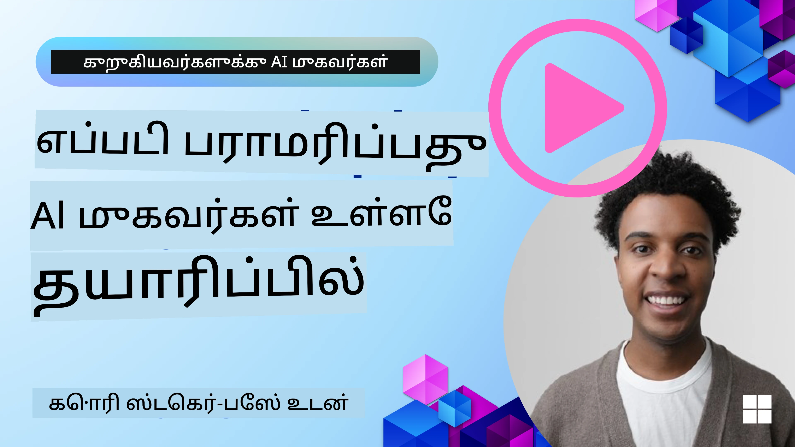

<!--
CO_OP_TRANSLATOR_METADATA:
{
  "original_hash": "cdfd0acc8592c1af14f8637833450375",
  "translation_date": "2025-10-11T11:13:07+00:00",
  "source_file": "10-ai-agents-production/README.md",
  "language_code": "ta"
}
-->
# உற்பத்தியில் AI முகவர்கள்: கண்காணிப்பு மற்றும் மதிப்பீடு

[](https://youtu.be/l4TP6IyJxmQ?si=reGOyeqjxFevyDq9)

AI முகவர்கள் பரிசோதனை மாதிரிகளிலிருந்து உண்மையான பயன்பாடுகளுக்கு மாறும்போது, அவற்றின் நடத்தை, செயல்திறன் மற்றும் வெளியீடுகளை முறையாக மதிப்பீடு செய்யும் திறன் முக்கியமாகிறது.

## கற்றல் இலக்குகள்

இந்த பாடத்தை முடித்த பிறகு, நீங்கள் அறிந்துகொள்வீர்கள்:
- முகவர்களின் கண்காணிப்பு மற்றும் மதிப்பீட்டின் முக்கிய கருத்துக்கள்
- முகவர்களின் செயல்திறன், செலவுகள் மற்றும் பயன்தன்மையை மேம்படுத்தும் நுட்பங்கள்
- உங்கள் AI முகவர்களை முறையாக மதிப்பீடு செய்வது எப்படி
- AI முகவர்களை உற்பத்தியில் பயன்படுத்தும்போது செலவுகளை கட்டுப்படுத்துவது எப்படி
- AutoGen மூலம் உருவாக்கப்பட்ட முகவர்களை கருவியாக்குவது எப்படி

உங்கள் "கருப்பு பெட்டி" முகவர்களை வெளிப்படையான, நிர்வகிக்கக்கூடிய மற்றும் நம்பகமான அமைப்புகளாக மாற்றுவதற்கான அறிவை உங்களுக்கு வழங்குவதே நோக்கம்.

_**குறிப்பு:** பாதுகாப்பான மற்றும் நம்பகமான AI முகவர்களை பயன்படுத்துவது முக்கியம். [நம்பகமான AI முகவர்களை உருவாக்குதல்](./06-building-trustworthy-agents/README.md) பாடத்தை பாருங்கள்._

## டிரேஸ்கள் மற்றும் ஸ்பான்கள்

[Langfuse](https://langfuse.com/) அல்லது [Azure AI Foundry](https://learn.microsoft.com/en-us/azure/ai-foundry/what-is-azure-ai-foundry) போன்ற கண்காணிப்பு கருவிகள் பொதுவாக முகவர் இயக்கங்களை டிரேஸ்கள் மற்றும் ஸ்பான்களாகக் காட்டுகின்றன.

- **டிரேஸ்** என்பது ஒரு முழுமையான முகவர் பணியை தொடக்கம் முதல் முடிவு வரை பிரதிநிதித்துவப்படுத்துகிறது (பயனர் கேள்வியைச் சமாளிப்பது போன்றது).
- **ஸ்பான்கள்** என்பது டிரேஸில் உள்ள தனிப்பட்ட படிகள் (மொழி மாதிரியை அழைப்பது அல்லது தரவுகளை மீட்டெடுப்பது போன்றவை).


கண்காணிப்பு இல்லாமல், AI முகவர் "கருப்பு பெட்டி" போல தோன்றலாம் - அதன் உள் நிலை மற்றும் காரணங்கள் தெளிவற்றதாக இருக்கும், இது சிக்கல்களை கண்டறிய அல்லது செயல்திறனை மேம்படுத்த கடினமாக்கும். கண்காணிப்புடன், முகவர்கள் "கண்ணாடி பெட்டிகள்" ஆக மாறுகின்றன, இது நம்பகத்தன்மையை உருவாக்கவும், அவை எதிர்பார்த்தபடி செயல்படுவதை உறுதிப்படுத்தவும் முக்கியமானது.

## உற்பத்தி சூழல்களில் கண்காணிப்பு ஏன் முக்கியம்

AI முகவர்களை உற்பத்தி சூழல்களுக்கு மாற்றுவது புதிய சவால்கள் மற்றும் தேவைகளை அறிமுகப்படுத்துகிறது. கண்காணிப்பு "நல்லதுதான் இருக்க வேண்டும்" என்ற நிலையை விட்டு "முக்கிய திறன்" ஆக மாறுகிறது:

*   **பிழைதிருத்தம் மற்றும் மூலக் காரணம் பகுப்பாய்வு**: ஒரு முகவர் தோல்வியடையும்போது அல்லது எதிர்பாராத வெளியீட்டை உருவாக்கும்போது, கண்காணிப்பு கருவிகள் பிழையின் மூலத்தை கண்டறிய தேவையான டிரேஸ்களை வழங்குகின்றன. இது பல LLM அழைப்புகள், கருவி தொடர்புகள் மற்றும் நிபந்தனைத் தர்க்கம் ஆகியவற்றை உள்ளடக்கிய சிக்கலான முகவர்களில் மிகவும் முக்கியமானது.
*   **தாமதம் மற்றும் செலவுகள் மேலாண்மை**: AI முகவர்கள் பெரும்பாலும் LLMக்கள் மற்றும் பிற வெளிப்புற APIக்களை நம்புகின்றன, அவை டோக்கன் அல்லது அழைப்புக்கு கட்டணம் வசூலிக்கப்படுகின்றன. இந்த அழைப்புகளை துல்லியமாக கண்காணிக்க கண்காணிப்பு உதவுகிறது, இது மிகவும் மெதுவாக அல்லது செலவான செயல்பாடுகளை அடையாளம் காண உதவுகிறது. இது குழுக்களுக்கு உந்துதல்களை மேம்படுத்த, திறமையான மாதிரிகளைத் தேர்ந்தெடுக்க அல்லது செயல்பாட்டு செலவுகளை நிர்வகிக்கவும், நல்ல பயனர் அனுபவத்தை உறுதிப்படுத்தவும் வேலைப்பாடுகளை மறுவடிவமைக்கவும் உதவுகிறது.
*   **நம்பகத்தன்மை, பாதுகாப்பு மற்றும் இணக்கம்**: பல பயன்பாடுகளில், முகவர்கள் பாதுகாப்பாகவும் நெறிமுறையுடன் செயல்படுவதை உறுதிப்படுத்துவது முக்கியம். கண்காணிப்பு முகவர் நடவடிக்கைகள் மற்றும் முடிவுகளின் ஆடிட் தடத்தை வழங்குகிறது. இது உந்துதல் ஊடுருவல், தீங்கு விளைவிக்கும் உள்ளடக்கத்தை உருவாக்குதல் அல்லது தனிப்பட்ட அடையாளத் தகவல்களை (PII) தவறாக கையாளுதல் போன்ற சிக்கல்களை கண்டறிந்து தீர்க்க பயன்படுத்தப்படலாம். உதாரணமாக, ஒரு முகவர் ஏன் ஒரு குறிப்பிட்ட பதிலை வழங்கியது அல்லது ஒரு குறிப்பிட்ட கருவியைப் பயன்படுத்தியது என்பதைப் புரிந்துகொள்ள டிரேஸ்களை மதிப்பீடு செய்யலாம்.
*   **தொடர்ச்சியான மேம்பாட்டு சுற்றுகள்**: கண்காணிப்பு தரவுகள் ஒரு முறைமையான மேம்பாட்டு செயல்முறையின் அடிப்படையாகும். முகவர்கள் உண்மையான உலகில் எப்படி செயல்படுகின்றன என்பதை கண்காணிப்பதன் மூலம், குழுக்கள் மேம்படுத்த வேண்டிய பகுதிகளை அடையாளம் காணலாம், மாதிரிகளை நன்றாகத் தட்டச்சு செய்ய தரவுகளைச் சேகரிக்கலாம் மற்றும் மாற்றங்களின் தாக்கத்தை சரிபார்க்கலாம். இது ஆன்லைன் மதிப்பீவிலிருந்து உற்பத்தி உள்ளீடுகள் ஆஃப்லைன் பரிசோதனைகள் மற்றும் சீரமைப்புகளைத் தகவமைத்தல் மூலம் தொடர்ந்து மேம்பட்ட முகவர் செயல்திறனை உருவாக்கும் பின்னூட்டச் சுற்று உருவாக்குகிறது.

## கண்காணிக்க வேண்டிய முக்கிய அளவுகோல்கள்

முகவர் நடத்தை மற்றும் செயல்திறனைப் புரிந்துகொள்ள, பல்வேறு அளவுகோல்கள் மற்றும் சிக்னல்களை கண்காணிக்க வேண்டும். முகவரின் நோக்கத்தைப் பொறுத்து குறிப்பிட்ட அளவுகோல்கள் மாறக்கூடும், ஆனால் சில பொதுவாக முக்கியமானவை.

கண்காணிப்பு கருவிகள் கண்காணிக்கும் பொதுவான அளவுகோல்கள் சிலவற்றை இங்கே காணலாம்:

**தாமதம்:** முகவர் எவ்வளவு விரைவாக பதிலளிக்கிறது? நீண்ட காத்திருப்பு நேரங்கள் பயனர் அனுபவத்தை பாதிக்கின்றன. முகவர் இயக்கங்களை டிரேஸிங் மூலம் பணிகள் மற்றும் தனிப்பட்ட படிகளுக்கான தாமதத்தை அளவிட வேண்டும். உதாரணமாக, அனைத்து மாதிரி அழைப்புகளுக்கும் 20 விநாடிகள் எடுத்துக்கொள்ளும் ஒரு முகவரை வேகமான மாதிரியைப் பயன்படுத்துவதன் மூலம் அல்லது மாதிரி அழைப்புகளை ஒரே நேரத்தில் இயக்குவதன் மூலம் வேகமாக்கலாம்.

**செலவுகள்:** ஒரு முகவர் இயக்கத்திற்கு செலவு என்ன? AI முகவர்கள் டோக்கனுக்கு கட்டணம் வசூலிக்கப்படும் LLM அழைப்புகள் அல்லது வெளிப்புற APIக்களை நம்புகின்றன. அடிக்கடி கருவி பயன்பாடு அல்லது பல உந்துதல்கள் விரைவாக செலவுகளை அதிகரிக்கலாம். உதாரணமாக, ஒரு முகவர் LLM ஐ ஐந்து முறை அழைக்கும்போது, நீங்கள் செலவு நியாயமானதா அல்லது அழைப்புகளின் எண்ணிக்கையை குறைக்க முடியுமா அல்லது மலிவான மாதிரியைப் பயன்படுத்த முடியுமா என்பதை மதிப்பீடு செய்ய வேண்டும். நேரடி கண்காணிப்பு எதிர்பாராத உச்சங்களை (எ.கா., அதிக API மடக்கங்கள் ஏற்படுத்தும் பிழைகள்) அடையாளம் காண உதவுகிறது.

**கோரிக்கை பிழைகள்:** முகவர் எத்தனை கோரிக்கைகளை தோல்வியடைத்தது? இதில் API பிழைகள் அல்லது தோல்வியடைந்த கருவி அழைப்புகள் அடங்கும். உற்பத்தியில் இதற்கு எதிராக உங்கள் முகவரை மேலும் வலுப்படுத்த, பின்னடைவுகள் அல்லது மீண்டும் முயற்சிகளை அமைக்கலாம். எ.கா., LLM வழங்குநர் A செயலிழந்தால், நீங்கள் LLM வழங்குநர் B ஐ காப்புப்பிரதி ஆக மாற்றுகிறீர்கள்.

**பயனர் கருத்து:** நேரடி பயனர் மதிப்பீடுகளை செயல்படுத்துவது மதிப்புமிக்க தகவல்களை வழங்குகிறது. இதில் வெளிப்படையான மதிப்பீடுகள் (👍தம்ப்ஸ்-அப்/👎கீழே, ⭐1-5 நட்சத்திரங்கள்) அல்லது உரை கருத்துக்கள் அடங்கும். தொடர்ந்து எதிர்மறை கருத்து முகவர் எதிர்பார்த்தபடி செயல்படவில்லை என்பதற்கான அறிகுறியாக இருக்க வேண்டும்.

**மறைமுக பயனர் கருத்து:** வெளிப்படையான மதிப்பீடுகள் இல்லாமல் கூட, பயனர் நடத்தை மறைமுக கருத்துகளை வழங்குகிறது. இதில் உடனடி கேள்வி மறுசீரமைப்பு, மீண்டும் மீண்டும் கேள்விகள் அல்லது மீண்டும் முயற்சி பொத்தானை அழுத்துதல் அடங்கும். எ.கா., பயனர்கள் மீண்டும் மீண்டும் ஒரே கேள்வியை கேட்கும் போது, இது முகவர் எதிர்பார்த்தபடி செயல்படவில்லை என்பதற்கான அறிகுறியாகும்.

**துல்லியம்:** முகவர் சரியான அல்லது விரும்பத்தகுந்த வெளியீடுகளை எவ்வளவு அடிக்கடி உருவாக்குகிறது? துல்லியத்தின் வரையறைகள் மாறுபடும் (எ.கா., சிக்கல் தீர்க்கும் சரியானது, தகவல் மீட்பு துல்லியம், பயனர் திருப்தி). உங்கள் முகவருக்கு வெற்றியென்பது என்ன என்பதை முதலில் வரையறுக்க வேண்டும். துல்லியத்தை தானியங்கி சரிபார்ப்புகள், மதிப்பீட்டு மதிப்புகள் அல்லது பணித் முடிவு லேபிள்கள் மூலம் கண்காணிக்கலாம். உதாரணமாக, டிரேஸ்களை "வெற்றி" அல்லது "தோல்வி" எனக் குறிக்கலாம்.

**தானியங்கி மதிப்பீட்டு அளவுகோல்கள்:** நீங்கள் தானியங்கி மதிப்பீடுகளை அமைக்கலாம். உதாரணமாக, முகவரின் வெளியீட்டை மதிப்பீடு செய்ய LLM ஐ பயன்படுத்தலாம், உதாரணமாக இது பயனுள்ளதாக, துல்லியமாக அல்லது இல்லையா என்பதை. முகவரின் பல்வேறு அம்சங்களை மதிப்பீடு செய்ய உதவும் பல திறந்த மூல நூலகங்கள் உள்ளன. உதாரணமாக, RAG முகவர்களுக்கு [RAGAS](https://docs.ragas.io/) அல்லது தீங்கு விளைவிக்கும் மொழி அல்லது உந்துதல் ஊடுருவலை கண்டறிய [LLM Guard](https://llm-guard.com/).

செயல்திறனின் சிறந்த கவரேஜை வழங்க இந்த அளவுகோல்களின் கலவையைப் பயன்படுத்துவது நடைமுறையில் சிறந்தது. இந்த அத்தியாயத்தின் [உதாரண நோட்புக்](./code_samples/10_autogen_evaluation.ipynb) இல், இந்த அளவுகோல்கள் உண்மையான உதாரணங்களில் எப்படி தோன்றுகின்றன என்பதை நாங்கள் காட்டுவோம், ஆனால் முதலில் ஒரு வழக்கமான மதிப்பீட்டு வேலைப்பாடுகள் எப்படி தோன்றுகின்றன என்பதை நாங்கள் கற்றுக்கொள்வோம்.

## உங்கள் முகவரை கருவியாக்கவும்

டிரேசிங் தரவுகளைச் சேகரிக்க, உங்கள் குறியீட்டை கருவியாக்க வேண்டும். முகவர் குறியீட்டை டிரேஸ்கள் மற்றும் அளவுகோலங்களை வெளியிட கருவியாக்குவது நோக்கம், அவற்றை கண்காணிப்பு தளம் மூலம் பிடிக்க, செயலாக்க மற்றும் காட்சிப்படுத்த முடியும்.

**OpenTelemetry (OTel):** [OpenTelemetry](https://opentelemetry.io/) LLM கண்காணிப்புக்கான தொழில்துறை தரமாக உருவெடுத்துள்ளது. இது தொலைநோக்கி தரவுகளை உருவாக்க, சேகரிக்க மற்றும் ஏற்றுமதி செய்ய APIக்கள், SDKக்கள் மற்றும் கருவிகளை வழங்குகிறது.

முகவர் கட்டமைப்புகளை சுற்றி உள்ள பல கருவியாக்க நூலகங்கள் உள்ளன, அவை OpenTelemetry ஸ்பான்களை கண்காணிப்பு கருவிக்கு ஏற்றுமதி செய்ய எளிதாக்குகின்றன. [OpenLit கருவியாக்க நூலகம்](https://github.com/openlit/openlit) மூலம் AutoGen முகவரை கருவியாக்குவதற்கான உதாரணம் கீழே உள்ளது:

```python
import openlit

openlit.init(tracer = langfuse._otel_tracer, disable_batch = True)
```

இந்த அத்தியாயத்தின் [உதாரண நோட்புக்](./code_samples/10_autogen_evaluation.ipynb) உங்கள் AutoGen முகவரை கருவியாக்குவது எப்படி என்பதை விளக்குகிறது.

**கையேடு ஸ்பான் உருவாக்கம்:** கருவியாக்க நூலகங்கள் நல்ல அடிப்படை அளவுகோலை வழங்கினாலும், மேலும் விரிவான அல்லது தனிப்பயன் தகவல் தேவைப்படும் சந்தர்ப்பங்கள் அடிக்கடி உள்ளன. நீங்கள் தனிப்பயன் பயன்பாட்டு தர்க்கத்தைச் சேர்க்க ஸ்பான்களை கையேடாக உருவாக்கலாம். மேலும் முக்கியமாக, அவற்றை தனிப்பயன் பண்புகளுடன் (குறிச்சொற்கள் அல்லது மெட்டாடேட்டா என்றும் அழைக்கப்படும்) செறிவூட்டலாம். இந்த பண்புகள் வணிக-குறிப்பிட்ட தரவுகள், இடைநிலை கணக்கீடுகள் அல்லது பிழைதிருத்தம் அல்லது பகுப்பாய்வுக்கு பயனுள்ளதாக இருக்கும் எந்த சூழலையும் உள்ளடக்கலாம், உதாரணமாக `user_id`, `session_id`, அல்லது `model_version`.

[Langfuse Python SDK](https://langfuse.com/docs/sdk/python/sdk-v3) மூலம் டிரேஸ்கள் மற்றும் ஸ்பான்களை கையேடாக உருவாக்குவதற்கான உதாரணம்:

```python
from langfuse import get_client
 
langfuse = get_client()
 
span = langfuse.start_span(name="my-span")
 
span.end()
```

## முகவர் மதிப்பீடு

கண்காணிப்பு எங்களுக்கு அளவுகோலங்களை வழங்குகிறது, ஆனால் மதிப்பீடு என்பது அந்த தரவுகளை (மற்றும் சோதனைகளைச் செய்ய) பகுப்பாய்வு செய்வது, AI முகவர் எவ்வளவு நன்றாக செயல்படுகிறது மற்றும் அதை எப்படி மேம்படுத்தலாம் என்பதைத் தீர்மானிக்கிறது. மற்றொரு வார்த்தையில், நீங்கள் அந்த டிரேஸ்கள் மற்றும் அளவுகோலங்களைப் பெற்ற பிறகு, முகவரை மதிப்பீடு செய்யவும் முடிவுகளை எடுக்கவும் அதை எப்படி பயன்படுத்துகிறீர்கள்?

வழக்கமான மதிப்பீடு முக்கியமானது, ஏனெனில் AI முகவர்கள் அடிக்கடி நிர்ணயமற்றவை மற்றும் மாறக்கூடியவை (மேம்பாடுகள் அல்லது மாறும் மாதிரி நடத்தை மூலம்) – மதிப்பீடு இல்லாமல், உங்கள் "புத்திசாலி முகவர்" உண்மையில் தனது வேலை நன்றாகச் செய்கிறதா அல்லது அது பின்னடைவைச் சந்திக்கிறதா என்பதை நீங்கள் அறிய முடியாது.

AI முகவர்களுக்கு இரண்டு வகையான மதிப்பீடுகள் உள்ளன: **ஆன்லைன் மதிப்பீடு** மற்றும் **ஆஃப்லைன் மதிப்பீடு**. இரண்டும் மதிப்புமிக்கவை, மேலும் அவை ஒருவருக்கொருவர் पूरकமாக உள்ளன. நாம் பொதுவாக ஆஃப்லைன் மதிப்பீட்டுடன் தொடங்குகிறோம், ஏனெனில் இது எந்த முகவரையும் பயன்படுத்துவதற்கு முன் குறைந்தபட்சம் தேவையான படியாகும்.

### ஆஃப்லைன் மதிப்பீடு


இது முகவரை கட்டுப்படுத்தப்பட்ட சூழலில் மதிப்பீடு செய்வதை உள்ளடக்குகிறது, பொதுவாக சோதனை தரவுத்தொகுப்புகளைப் பயன்படுத்தி, நேரடி பயனர் கேள்விகளை அல்ல. நீங்கள் எதிர்பார்க்கப்படும் வெளியீடு அல்லது சரியான நடத்தை என்ன என்பதை நீங்கள் அறிந்துள்ள தேர்ந்தெடுக்கப்பட்ட தரவுத்தொகுப்புகளைப் பயன்படுத்துகிறீர்கள், பின்னர் உங்கள் முகவரை அவற்றில் இயக்குகிறீர்கள்.

உதாரணமாக, நீங்கள் கணித வார்த்தை-சிக்கல் முகவரை உருவாக்கியிருந்தால், நீங்கள் [சோதனை தரவுத்தொகுப்பு](https://huggingface.co/datasets/gsm8k) கொண்ட 100 சிக்கல்களுடன் சரியான பதில்களைப் பெறலாம். ஆஃப்லைன் மதிப்பீடு பொதுவாக மேம்பாட்டு காலத்தில் செய்யப்படுகிறது (மேலும் CI/CD குழுக்களின் பகுதியாக இருக்கலாம்) மேம்பாடுகளைச் சரிபார்க்க அல்லது பின்னடைவுகளைத் தடுக்க. நன்மை என்னவென்றால், இது **மீண்டும் செய்யக்கூடியது மற்றும் நீங்கள் தரவுத்தொகுப்பின் உண்மையான பதில்களை வைத்திருப்பதால் தெளிவான துல்லிய அளவுகோலங்களைப் பெறலாம்**. நீங்கள் பயனர் கேள்விகளை உருவாக்கி முகவரின் பதில்களை சிறந்த பதில்களுடன் அளவிடலாம் அல்லது மேலே விவரிக்கப்பட்ட தானியங்கி அளவுகோலங்களைப் பயன்படுத்தலாம்.

ஆஃப்லைன் மதிப்பீட்டின் முக்கிய சவால் உங்கள் சோதனை தரவுத்தொகுப்பு விரிவானது மற்றும் பொருத்தமானது என்பதை உறுதிப்படுத்துவதில் உள்ளது – முகவர் நிலையான சோதனை தொகுப்பில் நன்றாக செயல்படலாம், ஆனால் உற்பத்தியில் மிகவும் மாறுபட்ட கேள்விகளை சந்திக்கலாம். எனவே, நீங்கள் புதிய விளிம்பு வழக்குகள் மற்றும் உண்மையான உலக சூழல்களை பிரதிபலிக்கும் உதாரணங்களுடன் சோதனை தொகுப்புகளை புதுப்பித்துக் கொள்ள வேண்டும்​. சிறிய "சமோக்கே" வழக்குகள் மற்றும் பெரிய மதிப்பீட்டு தொகுப்புகளின் கலவை பயனுள்ளதாக இருக்கும்: விரைவான சோதனைகளுக்கு சிறிய தொகுப்புகள் மற்றும் பரந்த செயல்திறன் அளவுகோலங்களுக்கு பெரியவை​.

### ஆன்லைன் மதிப்பீடு 


இது நேரடி, உண்மையான உலக சூழலில் முகவரை மதிப்பீடு செய்வதை குறிக்கிறது, அதாவது உற்பத்தியில் உண்மையான பயன்பாட்டின் போது. ஆன்லைன் மதிப்பீடு முகவரின் செயல்திறனை உண்மையான பயனர் தொடர்புகளில் தொடர்ந்து கண்காணித்து முடிவுகளை பகுப்பாய்வு செய்வதை உள்ளடக்குகிறது.

உதாரணமாக,
AI முகவரிகளை உற்பத்தியில் பயன்படுத்துவதற்கான செலவுகளை நிர்வகிக்க சில உத்திகள் இங்கே உள்ளன:

**சிறிய மாடல்களைப் பயன்படுத்துதல்:** சிறிய மொழி மாடல்கள் (SLMs) குறிப்பிட்ட முகவரியின் பயன்பாடுகளில் சிறப்பாக செயல்பட முடியும், மேலும் செலவுகளை குறிப்பிடத்தக்க அளவில் குறைக்கும். முன்னதாக குறிப்பிடப்பட்டபடி, செயல்திறனைப் புரிந்துகொள்ளவும், பெரிய மாடல்களுடன் ஒப்பிடவும் மதிப்பீட்டு அமைப்பை உருவாக்குவது உங்கள் பயன்பாட்டில் SLM எவ்வளவு நன்றாக செயல்படும் என்பதை அறிய சிறந்த வழியாகும். நோக்கத்தை வகைப்படுத்துதல் அல்லது அளவுரு எடுக்கும் போன்ற எளிய பணிகளுக்கு SLM-களைப் பயன்படுத்தவும், சிக்கலான காரணங்களைத் தீர்க்க பெரிய மாடல்களைப் பயன்படுத்தவும் பரிந்துரைக்கப்படுகிறது.

**ரூட்டர் மாடலைப் பயன்படுத்துதல்:** இதே போன்ற ஒரு உத்தி மாடல்களின் பல்வேறு அளவுகளைப் பயன்படுத்துவது. LLM/SLM அல்லது சர்வர்லெஸ் செயல்பாட்டை பயன்படுத்தி கேள்விகளின் சிக்கலின்படி சரியான மாடல்களுக்கு வழிமாற்றம் செய்யலாம். இது செலவுகளை குறைக்கவும், சரியான பணிகளில் செயல்திறனை உறுதிப்படுத்தவும் உதவும். உதாரணமாக, எளிய கேள்விகளை சிறிய, வேகமான மாடல்களுக்கு வழிமாற்றவும், சிக்கலான காரணங்களைத் தீர்க்க விலை உயர்ந்த பெரிய மாடல்களை மட்டுமே பயன்படுத்தவும்.

**பதில்களை காட்சிப்படுத்துதல்:** பொதுவான கோரிக்கைகள் மற்றும் பணிகளை அடையாளம் காண்பது மற்றும் உங்கள் முகவரியின் அமைப்பில் செல்லும் முன் பதில்களை வழங்குவது ஒரே மாதிரியான கோரிக்கைகளின் அளவைக் குறைக்க நல்ல வழியாகும். மேலும் அடிப்படை AI மாடல்களைப் பயன்படுத்தி ஒரு கோரிக்கை உங்கள் காட்சிப்படுத்தப்பட்ட கோரிக்கைகளுக்கு எவ்வளவு ஒத்ததாக உள்ளது என்பதை அடையாளம் காண ஒரு செயல்பாட்டை செயல்படுத்தலாம். இந்த உத்தி அடிக்கடி கேட்கப்படும் கேள்விகள் அல்லது பொதுவான வேலைப்பாடுகளுக்கான செலவுகளை குறிப்பிடத்தக்க அளவில் குறைக்க முடியும்.

## இது நடைமுறையில் எப்படி செயல்படுகிறது என்பதை பார்ப்போம்

இந்த பிரிவின் [உதாரண நோட்புக்](./code_samples/10_autogen_evaluation.ipynb) இல், எவ்வாறு கண்காணிப்பு மற்றும் மதிப்பீட்டு கருவிகளைப் பயன்படுத்தி நமது முகவரியை கண்காணிக்கலாம் என்பதைப் பார்க்கலாம்.

### உற்பத்தியில் AI முகவரிகள் குறித்து மேலும் கேள்விகள் உள்ளதா?

மற்ற கற்றலாளர்களை சந்திக்கவும், அலுவலக நேரங்களில் கலந்துரையாடவும், உங்கள் AI முகவரிகள் தொடர்பான கேள்விகளுக்கு பதில் பெறவும் [Azure AI Foundry Discord](https://aka.ms/ai-agents/discord) இல் சேரவும்.

## முந்தைய பாடம்

[Metacognition Design Pattern](../09-metacognition/README.md)

## அடுத்த பாடம்

[Agentic Protocols](../11-agentic-protocols/README.md)

---

**குறிப்பு**:  
இந்த ஆவணம் [Co-op Translator](https://github.com/Azure/co-op-translator) என்ற AI மொழிபெயர்ப்பு சேவையை பயன்படுத்தி மொழிபெயர்க்கப்பட்டுள்ளது. எங்கள் தரச்சிறப்பிற்காக முயற்சி செய்கிறோம், ஆனால் தானியக்க மொழிபெயர்ப்புகளில் பிழைகள் அல்லது தவறான தகவல்கள் இருக்கக்கூடும் என்பதை தயவுசெய்து கவனத்தில் கொள்ளுங்கள். அதன் தாய்மொழியில் உள்ள மூல ஆவணம் அதிகாரப்பூர்வ ஆதாரமாக கருதப்பட வேண்டும். முக்கியமான தகவல்களுக்கு, தொழில்முறை மனித மொழிபெயர்ப்பு பரிந்துரைக்கப்படுகிறது. இந்த மொழிபெயர்ப்பைப் பயன்படுத்துவதால் ஏற்படும் எந்த தவறான புரிதல்கள் அல்லது தவறான விளக்கங்களுக்கு நாங்கள் பொறுப்பல்ல.