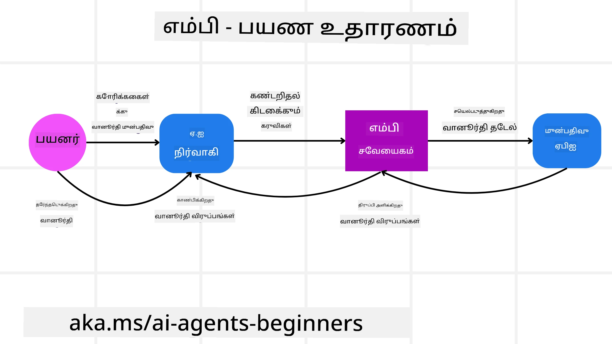
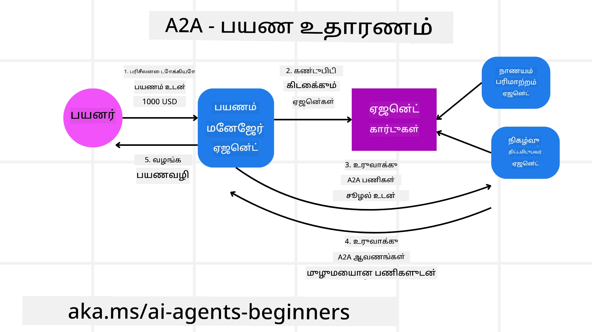
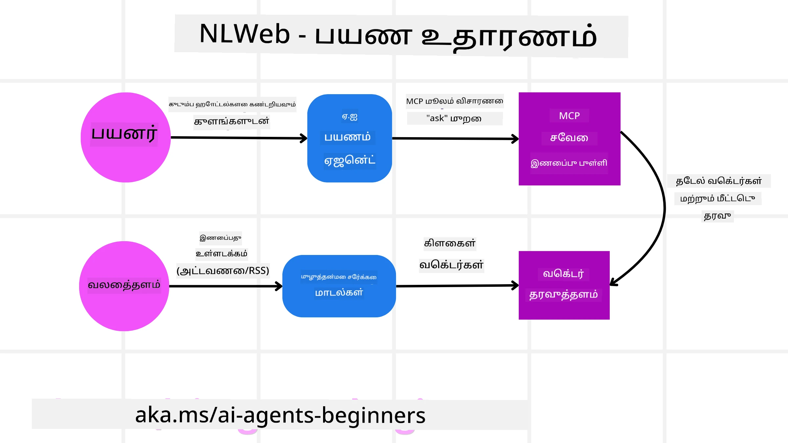

<!--
CO_OP_TRANSLATOR_METADATA:
{
  "original_hash": "aff92c6f019b4627ca9399c6e3882e17",
  "translation_date": "2025-10-11T11:25:58+00:00",
  "source_file": "11-agentic-protocols/README.md",
  "language_code": "ta"
}
-->
# ஏஜென்டிக் நெறிமுறைகளைப் பயன்படுத்துதல் (MCP, A2A மற்றும் NLWeb)

> _(மேலே உள்ள படத்தை கிளிக் செய்து இந்த பாடத்தின் வீடியோவைப் பாருங்கள்)_

AI ஏஜென்ட்களின் பயன்பாடு அதிகரிக்கும்போது, தரநிலை, பாதுகாப்பு மற்றும் திறந்த புதுமையை ஆதரிக்கும் நெறிமுறைகளின் தேவையும் அதிகரிக்கிறது. இந்த பாடத்தில், இந்த தேவையை பூர்த்தி செய்ய முயற்சிக்கும் 3 நெறிமுறைகளைப் பற்றி நாம் காண்போம் - மாடல் சூழல் நெறிமுறை (MCP), ஏஜென்ட்-டூ-ஏஜென்ட் (A2A) மற்றும் இயற்கை மொழி வலை (NLWeb).

## அறிமுகம்

இந்த பாடத்தில் நாம் காண்பது:

• **MCP** எப்படி AI ஏஜென்ட்கள் வெளிப்புற கருவிகள் மற்றும் தரவுகளை அணுகி பயனர் பணிகளை முடிக்க உதவுகிறது.

• **A2A** எப்படி பல்வேறு AI ஏஜென்ட்களுக்கிடையே தொடர்பு மற்றும் ஒத்துழைப்பை எளிதாக்குகிறது.

• **NLWeb** எப்படி இயற்கை மொழி இடைமுகங்களை எந்தவொரு வலைத்தளத்திலும் கொண்டு வந்து AI ஏஜென்ட்கள் உள்ளடக்கத்தை கண்டறிந்து தொடர்பு கொள்ள உதவுகிறது.

## கற்றல் இலக்குகள்

• **அடையாளம் காண்க** MCP, A2A மற்றும் NLWeb-இன் முக்கிய நோக்கம் மற்றும் பயன்களை AI ஏஜென்ட்களின் சூழலில்.

• **விளக்குங்கள்** ஒவ்வொரு நெறிமுறையும் LLMs, கருவிகள் மற்றும் பிற ஏஜென்ட்களுக்கிடையே தொடர்பு மற்றும் தொடர்பை எவ்வாறு எளிதாக்குகிறது.

• **அறியுங்கள்** சிக்கலான ஏஜென்டிக் அமைப்புகளை உருவாக்குவதில் ஒவ்வொரு நெறிமுறையும் வகிக்கும் தனித்துவமான பங்குகளை.

## மாடல் சூழல் நெறிமுறை

**மாடல் சூழல் நெறிமுறை (MCP)** என்பது LLMs-க்கு பயன்பாடுகள் சூழல் மற்றும் கருவிகளை வழங்குவதற்கான தரநிலையான வழியை வழங்கும் திறந்த தரநிலை ஆகும். இது AI ஏஜென்ட்கள் பல்வேறு தரவூட்டங்கள் மற்றும் கருவிகளை ஒரே மாதிரியான முறையில் இணைக்க "உலகளாவிய அடாப்டர்" ஆக செயல்பட உதவுகிறது.

MCP-இன் கூறுகள், நேரடி API பயன்பாட்டுடன் ஒப்பிடும் போது அதன் நன்மைகள் மற்றும் AI ஏஜென்ட்கள் MCP சர்வரை எவ்வாறு பயன்படுத்தலாம் என்பதற்கான உதாரணத்தைப் பார்ப்போம்.

### MCP முக்கிய கூறுகள்

MCP **கிளையன்ட்-சர்வர் கட்டமைப்பில்** செயல்படுகிறது, மற்றும் முக்கிய கூறுகள்:

• **ஹோஸ்ட்கள்** என்பது MCP சர்வருடன் இணைப்புகளை தொடங்கும் LLM பயன்பாடுகள் (உதாரணமாக VSCode போன்ற ஒரு குறியீட்டு எடிட்டர்).

• **கிளையன்ட்கள்** என்பது ஹோஸ்ட் பயன்பாட்டின் உள்ளக கூறுகள், சர்வர்களுடன் ஒரே நேரத்தில் இணைப்புகளை பராமரிக்கின்றன.

• **சர்வர்கள்** என்பது குறிப்பிட்ட திறன்களை வெளிப்படுத்தும் எளிய நிரல்கள்.

MCP சர்வரின் திறன்களில் மூன்று முக்கிய அடிப்படை கூறுகள் உள்ளன:

• **கருவிகள்**: AI ஏஜென்ட்கள் ஒரு செயலைச் செய்ய அழைக்கக்கூடிய தனித்துவமான செயல்கள் அல்லது செயல்பாடுகள். உதாரணமாக, ஒரு வானிலை சேவை "வானிலை பெறுதல்" கருவியை வெளிப்படுத்தலாம், அல்லது ஒரு e-commerce சர்வர் "தயாரிப்பு வாங்குதல்" கருவியை வெளிப்படுத்தலாம். MCP சர்வர்கள் ஒவ்வொரு கருவியின் பெயர், விளக்கம் மற்றும் உள்ளீடு/வெளியீடு ஸ்கீமாவை தங்கள் திறன்களின் பட்டியலில் விளம்பரப்படுத்துகின்றன.

• **வளங்கள்**: MCP சர்வர் வழங்கக்கூடிய, மற்றும் கிளையன்ட்கள் தேவையான போது பெறக்கூடிய வாசிக்க மட்டுமே உள்ள தரவுப் பொருட்கள் அல்லது ஆவணங்கள். உதாரணமாக கோப்பு உள்ளடக்கங்கள், தரவுத்தொகுப்பு பதிவுகள் அல்லது பதிவு கோப்புகள். வளங்கள் உரை (குறியீடு அல்லது JSON போன்றவை) அல்லது பைனரி (படங்கள் அல்லது PDF போன்றவை) ஆக இருக்கலாம்.

• **ப்ராம்ப்ட்கள்**: இது முன்னDefined டெம்ப்ளேட்கள், சிக்கலான பணிச்சூழல்களை எளிதாக்குவதற்கான பரிந்துரைக்கப்பட்ட ப்ராம்ப்ட்களை வழங்குகின்றன.

### MCP-இன் நன்மைகள்

MCP AI ஏஜென்ட்களுக்கு முக்கியமான நன்மைகளை வழங்குகிறது:

• **தனிவழி கருவி கண்டறிதல்**: ஏஜென்ட்கள் சர்வரிலிருந்து கிடைக்கும் கருவிகளின் பட்டியலை, அவற்றின் விளக்கங்களுடன், தன்னியல்பாக பெற முடியும். இது பாரம்பரிய APIs-களுடன் ஒப்பிடும்போது, ஒரே முறை ஒருங்கிணைப்பு அணுகுமுறையை வழங்குகிறது, இது அதிக தகுதியாக்கலை ஏற்படுத்துகிறது.

• **LLMs-களுக்கிடையே இணக்கத்தன்மை**: MCP பல்வேறு LLMs-களுக்கு வேலை செய்கிறது, முக்கிய மாடல்களை மாற்றுவதற்கான சுதந்திரத்தை வழங்குகிறது.

• **தரநிலை பாதுகாப்பு**: MCP ஒரு தரநிலை அங்கீகார முறையை உள்ளடக்கியது, இது MCP சர்வர்களுக்கு அணுகலைச் சேர்க்கும்போது அளவீட்டத்தை மேம்படுத்துகிறது.

### MCP உதாரணம்

ஒரு பயனர் MCP மூலம் இயக்கப்படும் AI உதவியாளரைப் பயன்படுத்தி விமானம் بک செய்ய விரும்புகிறார் என்று கற்பனை செய்யுங்கள்.

1. **இணைப்பு**: AI உதவியாளர் (MCP கிளையன்ட்) ஒரு விமான நிறுவனத்தால் வழங்கப்படும் MCP சர்வருடன் இணைகிறது.

2. **கருவி கண்டறிதல்**: கிளையன்ட் விமான நிறுவனத்தின் MCP சர்வரிடம் "உங்களிடம் என்ன கருவிகள் உள்ளன?" என்று கேட்கிறது. சர்வர் "விமானங்களை தேடுதல்" மற்றும் "விமானங்களை بک செய்தல்" போன்ற கருவிகளை பதிலளிக்கிறது.

3. **கருவி அழைப்பு**: நீங்கள் AI உதவியாளரிடம் "போர்ட்லாந்திலிருந்து ஹோனலுலு வரை ஒரு விமானத்தை தேடுங்கள்" என்று கேட்கிறீர்கள். AI உதவியாளர், அதன் LLM-ஐப் பயன்படுத்தி, "விமானங்களை தேடுதல்" கருவியை அழைக்க வேண்டும் என்று அடையாளம் காண்கிறது மற்றும் MCP சர்வருக்கு தொடர்புடைய அளவுருக்களை (origin, destination) அனுப்புகிறது.

4. **செயல்படுத்தல் மற்றும் பதில்**: MCP சர்வர், wrapper ஆக செயல்பட்டு, விமான நிறுவனத்தின் உள்நாட்டு API-க்கு உண்மையான அழைப்பைச் செய்கிறது. பின்னர், MCP சர்வர் விமான தகவல்களை (உதாரணமாக JSON தரவுகள்) AI உதவியாளருக்கு அனுப்புகிறது.

5. **மேலும் தொடர்பு**: AI உதவியாளர் விமான விருப்பங்களை வழங்குகிறது. நீங்கள் ஒரு விமானத்தைத் தேர்ந்தெடுத்த பிறகு, உதவியாளர் அதே MCP சர்வரில் "விமானத்தை بک செய்தல்" கருவியை அழைக்கலாம், بک செய்தலை முடிக்கிறது.

## ஏஜென்ட்-டூ-ஏஜென்ட் நெறிமுறை (A2A)

MCP LLMs-களை கருவிகளுடன் இணைப்பதில் கவனம் செலுத்தும் போது, **Agent-to-Agent (A2A) நெறிமுறை** பல AI ஏஜென்ட்களுக்கிடையே தொடர்பு மற்றும் ஒத்துழைப்பை எளிதாக்குகிறது. A2A பல்வேறு நிறுவனங்கள், சூழல்கள் மற்றும் தொழில்நுட்ப அடுக்குகளுக்கு AI ஏஜென்ட்களை இணைத்து ஒரு பகிர்ந்த பணியை முடிக்க உதவுகிறது.

### A2A முக்கிய கூறுகள்

A2A ஏஜென்ட்களுக்கிடையே தொடர்பை எளிதாக்குவதில் கவனம் செலுத்துகிறது, மற்றும் ஒவ்வொரு கூறும் இதற்கு பங்களிக்கிறது:

#### ஏஜென்ட் கார்டு

MCP சர்வர் கருவிகளின் பட்டியலைப் பகிரும் விதத்தில், ஏஜென்ட் கார்டில்:

- ஏஜென்டின் பெயர்.
- **பொதுவான பணிகளை** முடிக்க ஏஜென்ட் செய்யும் விளக்கம்.
- **குறிப்பிட்ட திறன்களின் பட்டியல்** மற்றும் விளக்கங்கள்.
- ஏஜென்டின் **தற்போதைய Endpoint URL**.
- ஏஜென்டின் **பதிப்பு** மற்றும் **திறன்கள்**.

#### ஏஜென்ட் எக்ஸிக்யூட்டர்

ஏஜென்ட் எக்ஸிக்யூட்டர் **பயனர் உரையாடலின் சூழலை தொலைதூர ஏஜென்டுக்கு அனுப்புவதற்குப் பொறுப்பாக உள்ளது**.

#### ஆர்டிஃபாக்ட்

தொலைதூர ஏஜென்ட் கோரிய பணியை முடித்த பிறகு, அதன் வேலைப் பொருள் ஆர்டிஃபாக்ட் ஆக உருவாக்கப்படுகிறது.

#### நிகழ்வு வரிசை

இந்த கூறு **மேலதிக தகவல்களை பரிமாற்றுவதற்கும், செய்திகளை அனுப்புவதற்கும்** பயன்படுகிறது.

### A2A-இன் நன்மைகள்

• **மேம்பட்ட ஒத்துழைப்பு**: இது பல்வேறு விற்பனையாளர்கள் மற்றும் தளங்களில் ஏஜென்ட்களை இணைத்து, தகவல்களைப் பகிர்ந்து, ஒருங்கிணைந்த செயல்பாட்டை எளிதாக்குகிறது.

• **மாடல் தேர்வு சுதந்திரம்**: ஒவ்வொரு A2A ஏஜென்டும் தனது கோரிக்கைகளைச் சேவையளிக்க எந்த LLM-ஐப் பயன்படுத்த வேண்டும் என்பதைத் தீர்மானிக்க முடியும்.

• **உள்ளமைக்கப்பட்ட அங்கீகாரம்**: A2A நெறிமுறையில் அங்கீகாரம் நேரடியாக ஒருங்கிணைக்கப்பட்டுள்ளது.

### A2A உதாரணம்

முன்பு பார்த்த பயண بک செய்யும் காட்சியை A2A மூலம் விரிவாக்குவோம்.

1. **பயனர் கோரிக்கை**: பயனர் "Travel Agent" A2A கிளையன்ட்/ஏஜென்டுடன் தொடர்பு கொண்டு, "அடுத்த வாரம் ஹோனலுலு பயணத்தை بک செய்யுங்கள், விமானங்கள், ஓட்டல் மற்றும் வாடகை கார் உட்பட" என்று கேட்கிறார்.

2. **ஏஜென்ட் ஒருங்கிணைப்பு**: Travel Agent இந்த சிக்கலான கோரிக்கையைப் பெறுகிறது.

3. **ஏஜென்ட்களுக்கிடையே தொடர்பு**: Travel Agent A2A நெறிமுறையைப் பயன்படுத்தி "Airline Agent," "Hotel Agent," மற்றும் "Car Rental Agent" ஆகியவற்றுடன் இணைகிறது.

4. **பணிகளை ஒப்படைத்தல்**: Travel Agent இந்த சிறப்பு ஏஜென்ட்களுக்கு குறிப்பிட்ட பணிகளை அனுப்புகிறது.

5. **ஒற்றுமையான பதில்**: அனைத்து ஏஜென்ட்களும் தங்கள் பணிகளை முடித்த பிறகு, Travel Agent முடிவுகளை ஒருங்கிணைத்து பயனருக்கு அனுப்புகிறது.

## இயற்கை மொழி வலை (NLWeb)

வலைத்தளங்கள் நீண்ட காலமாக தகவல்களை அணுகுவதற்கான முதன்மை வழியாக இருந்தன.

### NLWeb கூறுகள்

- **NLWeb பயன்பாடு**: இயற்கை மொழி கேள்விகளை செயல்படுத்தும் அமைப்பு.

- **NLWeb நெறிமுறை**: வலைத்தளத்துடன் இயற்கை மொழி தொடர்பு கொள்ள அடிப்படை விதிகள்.

- **MCP சர்வர்**: ஒவ்வொரு NLWeb அமைப்பும் MCP சர்வராக செயல்படுகிறது.

- **எம்பெடிங் மாடல்கள்**: வலைத்தள உள்ளடக்கத்தை எம்பெடிங்காக மாற்ற உதவும்.

- **வெக்டர் தரவுத்தொகுப்பு**: எம்பெடிங்குகளை சேமிக்கும் தரவுத்தொகுப்பு.

### NLWeb உதாரணம்

முன்பு பார்த்த பயண بک செய்யும் காட்சியை NLWeb மூலம் விரிவாக்குவோம்.

1. **தரவு சேர்த்தல்**: பயண வலைத்தளத்தின் தயாரிப்பு பட்டியல்கள் NLWeb கருவிகளால் எம்பெடிங்காக மாற்றப்படுகின்றன.

2. **இயற்கை மொழி கேள்வி**: பயனர் "அடுத்த வாரம் ஹோனலுலுவில் குடும்பத்துடன் செல்ல ஏற்ற ஓட்டல்களை தேடுங்கள்" என்று கேட்கிறார்.

3. **NLWeb செயலாக்கம்**: NLWeb பயன்பாடு கேள்வியை LLM-க்கு அனுப்புகிறது.

4. **துல்லியமான முடிவுகள்**: LLM தரவுத்தொகுப்பிலிருந்து முடிவுகளைத் தேர்ந்தெடுக்க உதவுகிறது.

5. **AI ஏஜென்ட் தொடர்பு**: NLWeb MCP சர்வராக செயல்படுவதால், வெளிப்புற AI ஏஜென்ட் வலைத்தளத்தை நேரடியாக கேள்வி கேட்க முடியும்.

### MCP/A2A/NLWeb பற்றி மேலும் கேள்விகள் உள்ளதா?

[Azure AI Foundry Discord](https://aka.ms/ai-agents/discord) க்கு சேர்ந்து மற்ற கற்றலாளர்களைச் சந்திக்கவும், அலுவலக நேரங்களில் கலந்துரையாடவும், உங்கள் AI ஏஜென்ட்கள் தொடர்பான கேள்விகளுக்கு பதில் பெறவும்.

## வளங்கள்

- [MCP ஆரம்பக்காரர்களுக்கான வழிகாட்டி](https://aka.ms/mcp-for-beginners)  
- [MCP ஆவணங்கள்](https://github.com/microsoft/semantic-kernel/tree/main/python/semantic-kernel/semantic_kernel/connectors/mcp)
- [NLWeb Repo](https://github.com/nlweb-ai/NLWeb)
- [Semantic Kernel வழிகாட்டிகள்](https://learn.microsoft.com/semantic-kernel/)

---

**குறிப்பு**:  
இந்த ஆவணம் [Co-op Translator](https://github.com/Azure/co-op-translator) என்ற AI மொழிபெயர்ப்பு சேவையைப் பயன்படுத்தி மொழிபெயர்க்கப்பட்டுள்ளது. நாங்கள் துல்லியத்திற்காக முயற்சிக்கின்றோம், ஆனால் தானியக்க மொழிபெயர்ப்புகளில் பிழைகள் அல்லது தவறான தகவல்கள் இருக்கக்கூடும் என்பதை தயவுசெய்து கவனத்தில் கொள்ளுங்கள். அதன் தாய்மொழியில் உள்ள மூல ஆவணம் அதிகாரப்பூர்வ ஆதாரமாக கருதப்பட வேண்டும். முக்கியமான தகவல்களுக்கு, தொழில்முறை மனித மொழிபெயர்ப்பு பரிந்துரைக்கப்படுகிறது. இந்த மொழிபெயர்ப்பைப் பயன்படுத்துவதால் ஏற்படும் எந்த தவறான புரிதல்கள் அல்லது தவறான விளக்கங்களுக்கு நாங்கள் பொறுப்பல்ல.