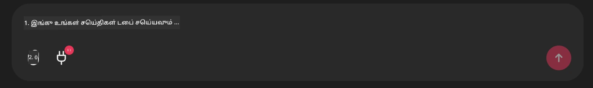

<!--
CO_OP_TRANSLATOR_METADATA:
{
  "original_hash": "9bf0395cbc541ce8db2a9699c8678dfc",
  "translation_date": "2025-10-11T11:29:07+00:00",
  "source_file": "11-agentic-protocols/code_samples/github-mcp/README.md",
  "language_code": "ta"
}
-->
# Github MCP Server Example

## விளக்கம்

இந்த டெமோ Microsoft Reactor மூலம் நடத்தப்பட்ட AI Agents Hackathon க்காக உருவாக்கப்பட்டது.

இந்த கருவி, பயனர் Github ரெப்போக்களை அடிப்படையாகக் கொண்டு ஹாக்கத்தான் திட்டங்களை பரிந்துரைக்க பயன்படுகிறது. இது கீழ்க்கண்டவாறு செயல்படுகிறது:

1. **Github Agent** - Github MCP Server ஐப் பயன்படுத்தி ரெப்போக்கள் மற்றும் அவற்றின் தகவல்களை பெறுகிறது.
2. **Hackathon Agent** - Github Agent வழங்கிய தரவுகளை அடிப்படையாகக் கொண்டு, பயனர் பயன்படுத்திய திட்டங்கள், மொழிகள் மற்றும் AI Agents Hackathon க்கான திட்டப் பாதைகள் ஆகியவற்றின் அடிப்படையில் படைப்பாற்றல் கொண்ட ஹாக்கத்தான் திட்ட யோசனைகளை உருவாக்குகிறது.
3. **Events Agent** - Hackathon Agent பரிந்துரையின் அடிப்படையில், AI Agent Hackathon தொடரில் தொடர்புடைய நிகழ்வுகளை பரிந்துரைக்கிறது.

## கோடை இயக்குதல்

### சூழல் மாறிகள்

இந்த டெமோ Azure Open AI Service, Semantic Kernel, Github MCP Server மற்றும் Azure AI Search ஐப் பயன்படுத்துகிறது.

இந்த கருவிகளைப் பயன்படுத்த சரியான சூழல் மாறிகள் அமைக்கப்பட்டுள்ளதை உறுதிப்படுத்தவும்:

```python
AZURE_OPENAI_CHAT_DEPLOYMENT_NAME=""
AZURE_OPENAI_EMBEDDING_DEPLOYMENT_NAME=""
AZURE_OPENAI_ENDPOINT=""
AZURE_OPENAI_API_KEY=""
AZURE_OPENAI_API_VERSION=""
AZURE_SEARCH_SERVICE_ENDPOINT=""
AZURE_SEARCH_API_KEY=""
``` 


## Chainlit Server ஐ இயக்குதல்

MCP Server ஐ இணைக்க, இந்த டெமோ Chainlit ஐ ஒரு உரையாடல் இடைமுகமாகப் பயன்படுத்துகிறது.

சர்வரை இயக்க, உங்கள் டெர்மினலில் கீழ்க்கண்ட கட்டளையை பயன்படுத்தவும்:

```bash
chainlit run app.py -w
```


இது உங்கள் Chainlit சர்வரை `localhost:8000` இல் தொடங்குவதுடன் `event-descriptions.md` உள்ளடக்கத்தை Azure AI Search Index இல் நிரப்பும்.

## MCP Server ஐ இணைத்தல்

Github MCP Server ஐ இணைக்க, "Type your message here.." உரையாடல் பெட்டியின் கீழ் உள்ள "plug" ஐகானைத் தேர்ந்தெடுக்கவும்:



அதன் பின்னர், Github MCP Server ஐ இணைக்க கட்டளையைச் சேர்க்க "Connect an MCP" ஐ கிளிக் செய்யலாம்:

```bash
npx -y @modelcontextprotocol/server-github --env GITHUB_PERSONAL_ACCESS_TOKEN=[YOUR PERSONAL ACCESS TOKEN]
```


"[YOUR PERSONAL ACCESS TOKEN]" ஐ உங்கள் உண்மையான Personal Access Token மூலம் மாற்றவும்.

இணைத்த பிறகு, plug ஐகானின் பக்கத்தில் (1) எனக் காணலாம், இது இணைக்கப்பட்டதை உறுதிப்படுத்தும். இணைக்கப்படவில்லை என்றால், `chainlit run app.py -w` மூலம் chainlit சர்வரை மீண்டும் தொடங்க முயற்சிக்கவும்.

## டெமோவைப் பயன்படுத்துதல்

ஹாக்கத்தான் திட்டங்களை பரிந்துரைக்கும் ஏஜென்ட் வேலைப்பாடுகளைத் தொடங்க, நீங்கள் இவ்வாறு ஒரு செய்தியைத் தட்டச்சு செய்யலாம்:

"Github பயனர் koreyspace க்கான ஹாக்கத்தான் திட்டங்களை பரிந்துரைக்கவும்"

Router Agent உங்கள் கோரிக்கையை பகுப்பாய்வு செய்து, எந்த ஏஜென்ட்களின் (GitHub, Hackathon, மற்றும் Events) சேர்க்கை உங்கள் கேள்வியைச் சமாளிக்க சிறந்தது என்பதைத் தீர்மானிக்கும். ஏஜென்ட்கள் ஒன்றாக இணைந்து, Github ரெப்போ பகுப்பாய்வு, திட்ட யோசனைகள் மற்றும் தொடர்புடைய தொழில்நுட்ப நிகழ்வுகள் அடிப்படையில் விரிவான பரிந்துரைகளை வழங்கும்.

---

**அறிவிப்பு**:  
இந்த ஆவணம் [Co-op Translator](https://github.com/Azure/co-op-translator) என்ற AI மொழிபெயர்ப்பு சேவையை பயன்படுத்தி மொழிபெயர்க்கப்பட்டுள்ளது. நாங்கள் துல்லியத்திற்காக முயற்சிக்கிறோம், ஆனால் தானியங்கி மொழிபெயர்ப்புகளில் பிழைகள் அல்லது தவறுகள் இருக்கக்கூடும் என்பதை கவனத்தில் கொள்ளவும். அதன் சொந்த மொழியில் உள்ள மூல ஆவணம் அதிகாரப்பூர்வ ஆதாரமாக கருதப்பட வேண்டும். முக்கியமான தகவல்களுக்கு, தொழில்முறை மனித மொழிபெயர்ப்பு பரிந்துரைக்கப்படுகிறது. இந்த மொழிபெயர்ப்பைப் பயன்படுத்துவதால் ஏற்படும் எந்த தவறான புரிதல்களுக்கும் அல்லது தவறான விளக்கங்களுக்கும் நாங்கள் பொறுப்பல்ல.