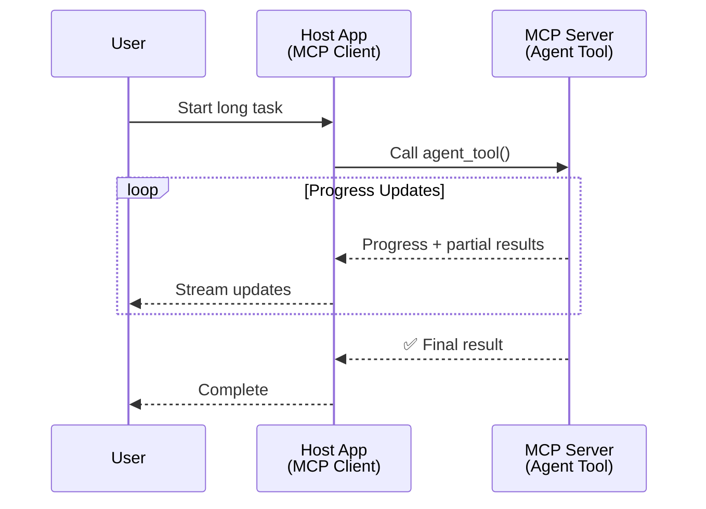
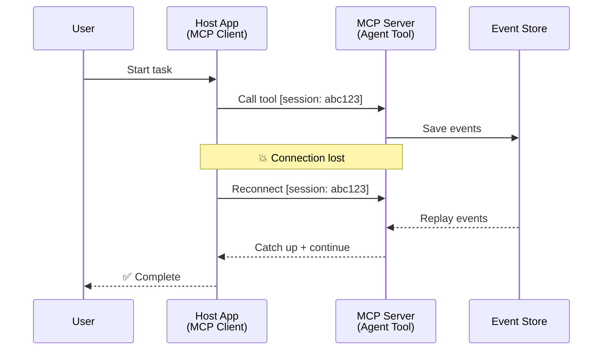
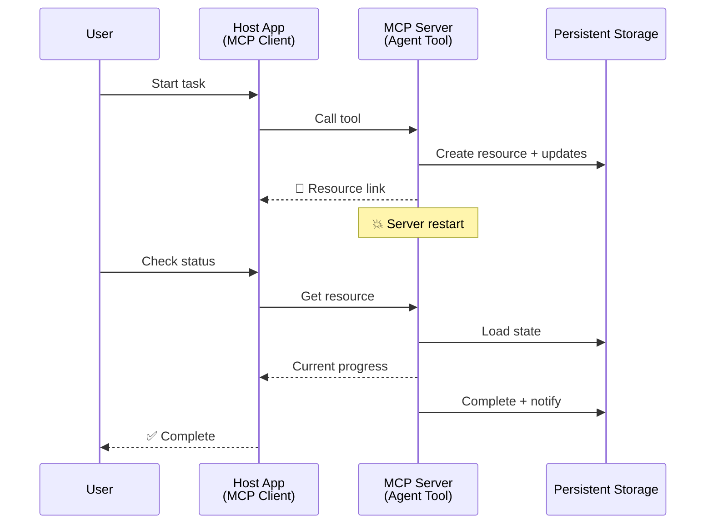
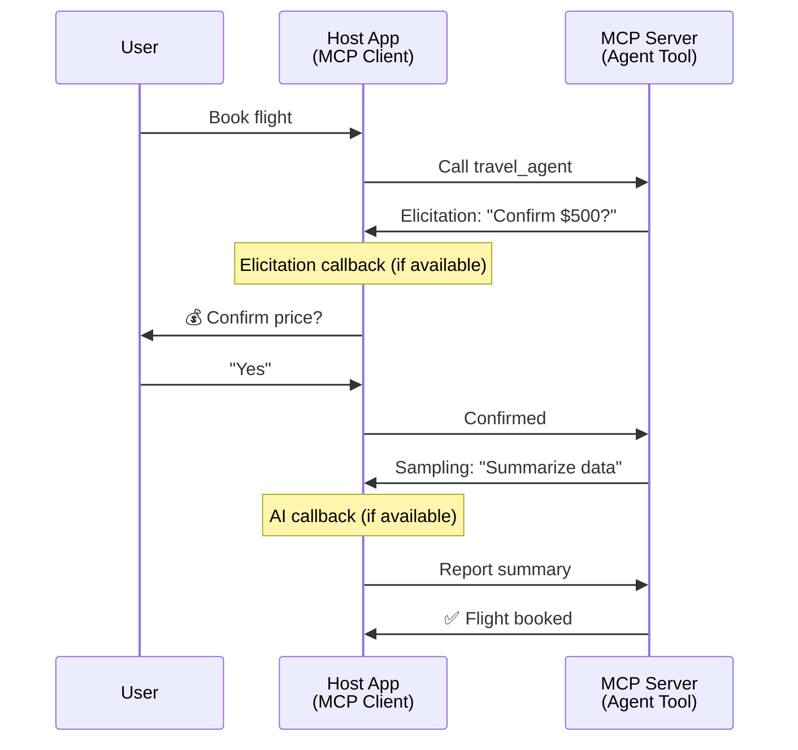
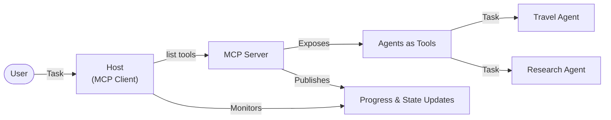

<!--
CO_OP_TRANSLATOR_METADATA:
{
  "original_hash": "5cc6836626047aa055e8960c8484a7d0",
  "translation_date": "2025-10-11T11:29:52+00:00",
  "source_file": "11-agentic-protocols/code_samples/mcp-agents/README.md",
  "language_code": "ta"
}
-->
# MCP மூலம் முகவர்-முகவர் தொடர்பு அமைப்புகளை உருவாக்குதல்

> TL;DR - MCP-ல் Agent2Agent தொடர்பு அமைக்க முடியுமா? முடியும்!

MCP அதன் ஆரம்ப நோக்கமான "LLMs-க்கு சூழலை வழங்குதல்" என்பதைக் கடந்துவிட்டது. சமீபத்திய மேம்பாடுகள், [resumable streams](https://modelcontextprotocol.io/docs/concepts/transports#resumability-and-redelivery), [elicitation](https://modelcontextprotocol.io/specification/2025-06-18/client/elicitation), [sampling](https://modelcontextprotocol.io/specification/2025-06-18/client/sampling), மற்றும் அறிவிப்புகள் ([progress](https://modelcontextprotocol.io/specification/2025-06-18/basic/utilities/progress) மற்றும் [resources](https://modelcontextprotocol.io/specification/2025-06-18/schema#resourceupdatednotification)) ஆகியவற்றுடன் MCP இப்போது சிக்கலான முகவர்-முகவர் தொடர்பு அமைப்புகளை உருவாக்குவதற்கான வலுவான அடித்தளத்தை வழங்குகிறது.

## முகவர்/கருவி குறைபாடு

முகவர் செயல்பாடுகளுடன் கருவிகளை (நீண்ட நேரம் இயங்குதல், செயல்பாட்டின் நடுவில் கூடுதல் உள்ளீடு தேவைப்படுதல் போன்றவை) ஆராயும் மேம்பாட்டாளர்கள் அதிகரித்துள்ளதால், MCP எளிய கோரிக்கை-பதில் முறைமைகளில் கவனம் செலுத்தியதால் இது பொருத்தமற்றது என்ற தவறான கருத்து உருவாகியுள்ளது.

இந்த பார்வை பழமையானது. MCP விவரக்குறிப்பு கடந்த சில மாதங்களில் நீண்ட நேரம் இயங்கும் முகவர் செயல்பாடுகளை உருவாக்குவதற்கான இடைவெளியை மூடுவதற்கான திறன்களுடன் குறிப்பிடத்தக்க அளவில் மேம்படுத்தப்பட்டுள்ளது:

- **Streaming & Partial Results**: செயல்பாட்டின் போது நேரடி முன்னேற்றம்
- **Resumability**: வாடிக்கையாளர்கள் துண்டிப்பு பிறகு மீண்டும் இணைந்து தொடர முடியும்
- **Durability**: முடிவுகள் சர்வர் மீண்டும் தொடங்கிய பிறகும் நிலைத்திருக்கும் (உதாரணமாக, resource links மூலம்)
- **Multi-turn**: செயல்பாட்டின் நடுவில் தொடர்பாடல் மூலம் உள்ளீடு

இந்த அம்சங்கள் MCP நெறிமுறையில் சிக்கலான முகவர் மற்றும் பல-முகவர் பயன்பாடுகளை இயக்குவதற்காக இணைக்கப்படலாம்.

உதாரணமாக, MCP சர்வரில் கிடைக்கும் "கருவி" என ஒரு முகவரை குறிப்பிடுவோம். இது MCP வாடிக்கையாளர் செயல்படுத்தும் ஒரு ஹோஸ்ட் பயன்பாட்டின் இருப்பை குறிக்கிறது, இது MCP சர்வருடன் ஒரு அமர்வை நிறுவி முகவரியை அழைக்க முடியும்.

## MCP கருவி "Agentic" ஆக என்ன செய்கிறது?

செயல்படுத்துவதற்கு முன், நீண்ட நேரம் இயங்கும் முகவர்களை ஆதரிக்க தேவையான அடித்தள திறன்களை நிறுவுவோம்.

> நீண்ட நேரம் தன்னாட்சி செயல்படக்கூடிய, பல தொடர்பாடல்கள் அல்லது நேரடி பின்னூட்டத்தின் அடிப்படையில் சரிசெய்தல் தேவைப்படும் சிக்கலான பணிகளை கையாளக்கூடிய ஒரு முகவரை நாம் வரையறுக்கிறோம்.

### 1. Streaming & Partial Results

சாதாரண கோரிக்கை-பதில் முறைமைகள் நீண்ட நேரம் இயங்கும் பணிகளுக்கு பொருத்தமற்றவை. முகவர்களுக்கு தேவையானவை:

- நேரடி முன்னேற்றம்
- இடைநிலை முடிவுகள்

**MCP ஆதரவு**: Resource update notifications மூலம் streaming partial results-ஐ இயக்க முடியும், ஆனால் இது JSON-RPC இன் 1:1 கோரிக்கை/பதில் மாடலுடன் முரண்பாடுகளை தவிர்க்க கவனமாக வடிவமைக்க வேண்டும்.

| அம்சம்                     | பயன்பாட்டு நிலை                                                                                                                                                                       | MCP ஆதரவு                                                                                |
| -------------------------- | ------------------------------------------------------------------------------------------------------------------------------------------------------------------------------------ | ------------------------------------------------------------------------------------------ |
| நேரடி முன்னேற்றம் | பயனர் ஒரு codebase மாற்றும் பணியை கோருகிறார். முகவர் முன்னேற்றத்தை stream செய்கிறது: "10% - Dependencies ஆய்வு... 25% - TypeScript கோப்புகளை மாற்றுதல்... 50% - Imports புதுப்பித்தல்..."          | ✅ Progress notifications                                                                  |
| இடைநிலை முடிவுகள்            | "Generate a book" பணியை stream செய்கிறது, உதாரணமாக, 1) கதை வளைவு வரைபடம், 2) அத்தியாய பட்டியல், 3) ஒவ்வொரு அத்தியாயமும் முடிக்கப்பட்டது. ஹோஸ்ட் ஆய்வு செய்ய, ரத்து செய்ய அல்லது மாற்ற முடியும். | ✅ Notifications "extended" செய்ய முடியும், PR 383, 776 இல் முன்மொழிவுகளைப் பார்க்கவும் |

<div align="center" style="font-style: italic; font-size: 0.95em; margin-bottom: 0.5em;">
<strong>படம் 1:</strong> இந்த வரைபடம் MCP முகவர் நீண்ட நேரம் இயங்கும் பணியின் போது ஹோஸ்ட் பயன்பாட்டிற்கு நேரடி முன்னேற்றம் மற்றும் இடைநிலை முடிவுகளை stream செய்கிறது, பயனர் செயல்பாட்டை நேரடியாக கண்காணிக்க அனுமதிக்கிறது.
</div>



### 2. Resumability

முகவர்கள் நெட்வொர்க் இடையூறுகளை சீராக கையாள வேண்டும்:

- (வாடிக்கையாளர்) துண்டிப்பு பிறகு மீண்டும் இணைப்பு
- தாங்கள் நிறுத்திய இடத்திலிருந்து தொடருதல் (message redelivery)

**MCP ஆதரவு**: MCP StreamableHTTP transport இன்று session resumption மற்றும் message redelivery-ஐ session IDs மற்றும் last event IDs மூலம் ஆதரிக்கிறது. இங்கு முக்கியமானது, சர்வர் EventStore-ஐ செயல்படுத்த வேண்டும், இது வாடிக்கையாளர் மீண்டும் இணைப்பு செய்யும் போது நிகழ்வுகளை மீண்டும் இயக்க அனுமதிக்கிறது.  
சமூக முன்மொழிவு (PR #975) transport-agnostic resumable streams-ஐ ஆராய்கிறது.

| அம்சம்      | பயன்பாட்டு நிலை                                                                                                                                                   | MCP ஆதரவு                                                                |
| ------------ | ---------------------------------------------------------------------------------------------------------------------------------------------------------- | -------------------------------------------------------------------------- |
| Resumability | நீண்ட நேரம் இயங்கும் பணியின் போது வாடிக்கையாளர் துண்டிக்கிறது. மீண்டும் இணைப்பு செய்யும் போது, session IDs மற்றும் EventStore மூலம் நிகழ்வுகளை மீண்டும் இயக்கி seamless-ஆக தொடருகிறது. | ✅ StreamableHTTP transport session IDs, event replay, மற்றும் EventStore |

<div align="center" style="font-style: italic; font-size: 0.95em; margin-bottom: 0.5em;">
<strong>படம் 2:</strong> இந்த வரைபடம் MCP இன் StreamableHTTP transport மற்றும் EventStore session resumption-ஐ எவ்வாறு சீராக செயல்படுத்துகிறது என்பதை காட்டுகிறது: வாடிக்கையாளர் துண்டிக்கும்போது, அது மீண்டும் இணைப்பு செய்து, நிகழ்வுகளை மீண்டும் இயக்கி, செயல்பாட்டை இழப்பின்றி தொடர முடியும்.
</div>



### 3. Durability

நீண்ட நேரம் இயங்கும் முகவர்களுக்கு நிலையான நிலை தேவை:

- முடிவுகள் சர்வர் மீண்டும் தொடங்கிய பிறகும் நிலைத்திருக்கும்
- நிலையை out-of-band-ல் பெற முடியும்
- session-களுக்கு இடையே முன்னேற்றத்தை கண்காணித்தல்

**MCP ஆதரவு**: MCP இப்போது Resource link return type-ஐ tool calls-க்கு ஆதரிக்கிறது. இன்று, ஒரு resource-ஐ உருவாக்கி resource link-ஐ உடனடியாக திருப்பி அனுப்பும் tool-ஐ வடிவமைப்பது ஒரு சாத்தியமான முறை. இந்த tool பின்னணியில் பணியை தொடர முடியும் மற்றும் resource-ஐ புதுப்பிக்க முடியும். இதனால், வாடிக்கையாளர் resource-இன் நிலையை poll செய்ய partial அல்லது முழு முடிவுகளைப் பெற முடியும் (சர்வர் வழங்கும் resource updates அடிப்படையில்) அல்லது resource-க்கு update notifications-ஐ subscribe செய்ய முடியும்.

இங்கு ஒரு வரம்பு என்னவென்றால், resources-ஐ poll செய்வது அல்லது updates-க்கு subscribe செய்வது resources-ஐ பயன்படுத்துவதுடன், அளவிலான விளைவுகளை ஏற்படுத்தும். இதற்கான community proposal (உள்ளடக்கம் #992) webhooks அல்லது triggers-ஐ சேர்க்கும் சாத்தியத்தை ஆராய்கிறது, இது updates-ஐ client/host application-க்கு அறிவிக்க சர்வர் அழைக்க அனுமதிக்கிறது.

| அம்சம்    | பயன்பாட்டு நிலை                                                                                                                                        | MCP ஆதரவு                                                        |
| ---------- | ----------------------------------------------------------------------------------------------------------------------------------------------- | ------------------------------------------------------------------ |
| Durability | சர்வர் data migration task-இல் crash ஆகிறது. முடிவுகள் மற்றும் முன்னேற்றம் restart-க்கு பிறகும் நிலைத்திருக்கும், client நிலையைச் சரிபார்த்து நிலையான resource-இல் இருந்து தொடர முடியும். | ✅ Resource links persistent storage மற்றும் status notifications |

இன்று, resource-ஐ உருவாக்கி resource link-ஐ உடனடியாக திருப்பி அனுப்பும் tool-ஐ வடிவமைப்பது ஒரு பொதுவான முறை. இந்த tool பின்னணியில் task-ஐ address செய்து, resource notifications-ஐ progress updates-ஆக issue செய்து அல்லது partial results-ஐ சேர்த்து, resource-இல் உள்ளடக்கத்தை தேவையானபடி புதுப்பிக்க முடியும்.

<div align="center" style="font-style: italic; font-size: 0.95em; margin-bottom: 0.5em;">
<strong>படம் 3:</strong> இந்த வரைபடம் MCP முகவர்கள் persistent resources மற்றும் status notifications-ஐ பயன்படுத்தி நீண்ட நேரம் இயங்கும் பணிகள் சர்வர் மீண்டும் தொடங்கிய பிறகும் நிலைத்திருக்கும், வாடிக்கையாளர்கள் முன்னேற்றத்தைச் சரிபார்த்து தோல்விகளுக்குப் பிறகும் முடிவுகளைப் பெற அனுமதிக்கிறது.
</div>



### 4. Multi-Turn Interactions

முகவர்களுக்கு செயல்பாட்டின் நடுவில் கூடுதல் உள்ளீடு தேவைப்படும்:

- மனித விளக்கம் அல்லது ஒப்புதல்
- சிக்கலான முடிவுகளுக்கு AI உதவி
- மாறும் அளவுரு சரிசெய்தல்

**MCP ஆதரவு**: Sampling (AI input-க்கு) மற்றும் elicitation (மனித input-க்கு) மூலம் முழுமையாக ஆதரிக்கப்படுகிறது.

| அம்சம்                 | பயன்பாட்டு நிலை                                                                                                                                     | MCP ஆதரவு                                           |
| ----------------------- | -------------------------------------------------------------------------------------------------------------------------------------------- | ----------------------------------------------------- |
| Multi-Turn Interactions | பயண முன்பதிவு முகவர் பயனர் விலையை உறுதிப்படுத்த கோருகிறது, பின்னர் பயண தரவுகளை சுருக்க AI-ஐ கேட்கிறது, முன்பதிவு பரிவர்த்தனை முடிக்கிறது. | ✅ Elicitation மனித input-க்கு, sampling AI input-க்கு |

<div align="center" style="font-style: italic; font-size: 0.95em; margin-bottom: 0.5em;">
<strong>படம் 4:</strong> இந்த வரைபடம் MCP முகவர்கள் செயல்பாட்டின் நடுவில் மனித input-ஐ interactively elicitation மூலம் அல்லது AI உதவியை கேட்க sampling மூலம், சிக்கலான, multi-turn workflows-ஐ ஆதரிக்கிறது, உதாரணமாக உறுதிப்பாடுகள் மற்றும் மாறும் முடிவெடுப்புகள்.
</div>



## MCP-ல் நீண்ட நேரம் இயங்கும் முகவர்களை செயல்படுத்துதல் - குறியீட்டு கண்ணோட்டம்

இந்த கட்டுரையின் ஒரு பகுதியாக, [code repository](https://github.com/victordibia/ai-tutorials/tree/main/MCP%20Agents) MCP Python SDK மற்றும் StreamableHTTP transport-ஐ session resumption மற்றும் message redelivery-க்கு பயன்படுத்தி நீண்ட நேரம் இயங்கும் முகவர்களை முழுமையாக செயல்படுத்தும் ஒரு செயல்பாட்டை கொண்டுள்ளது. MCP திறன்களை சிக்கலான முகவர் போன்ற செயல்பாடுகளை இயக்குவதற்காக எப்படி இணைக்க முடியும் என்பதை இந்த செயல்பாடு காட்டுகிறது.

குறிப்பாக, இரண்டு முக்கிய முகவர் கருவிகளுடன் ஒரு சர்வரை செயல்படுத்துகிறோம்:

- **Travel Agent** - elicitation மூலம் விலை உறுதிப்பாட்டுடன் பயண முன்பதிவு சேவையை simulation செய்கிறது
- **Research Agent** - sampling மூலம் AI-assisted சுருக்கங்களைப் பயன்படுத்தி ஆராய்ச்சி பணிகளைச் செய்கிறது

இரண்டு முகவர்களும் நேரடி முன்னேற்றம், interactive உறுதிப்பாடுகள், மற்றும் முழு session resumption திறன்களை காட்டுகின்றன.

### முக்கிய செயல்பாட்டு கருத்துக்கள்

கீழே உள்ள பிரிவுகள் ஒவ்வொரு திறனுக்கும் சர்வர்-பக்கம் முகவர் செயல்படுத்தல் மற்றும் வாடிக்கையாளர்-பக்கம் ஹோஸ்ட் கையாளுதலைக் காட்டுகின்றன:

#### Streaming & Progress Updates - நேரடி பணியின் நிலை

Streaming நீண்ட நேரம் இயங்கும் பணிகளின் போது முகவர்களுக்கு real-time progress updates வழங்க அனுமதிக்கிறது, பயனர்களை task status மற்றும் இடைநிலை முடிவுகள் குறித்து தகவலளிக்கிறது.

**சர்வர் செயல்படுத்தல் (முகவர் progress notifications அனுப்புகிறது):**

```python
# From server/server.py - Travel agent sending progress updates
for i, step in enumerate(steps):
    await ctx.session.send_progress_notification(
        progress_token=ctx.request_id,
        progress=i * 25,
        total=100,
        message=step,
        related_request_id=str(ctx.request_id)
    )
    await anyio.sleep(2)  # Simulate work

# Alternative: Log messages for detailed step-by-step updates
await ctx.session.send_log_message(
    level="info",
    data=f"Processing step {current_step}/{steps} ({progress_percent}%)",
    logger="long_running_agent",
    related_request_id=ctx.request_id,
)
```

**வாடிக்கையாளர் செயல்படுத்தல் (ஹோஸ்ட் progress updates பெறுகிறது):**

```python
# From client/client.py - Client handling real-time notifications
async def message_handler(message) -> None:
    if isinstance(message, types.ServerNotification):
        if isinstance(message.root, types.LoggingMessageNotification):
            console.print(f"📡 [dim]{message.root.params.data}[/dim]")
        elif isinstance(message.root, types.ProgressNotification):
            progress = message.root.params
            console.print(f"🔄 [yellow]{progress.message} ({progress.progress}/{progress.total})[/yellow]")

# Register message handler when creating session
async with ClientSession(
    read_stream, write_stream,
    message_handler=message_handler
) as session:
```

#### Elicitation - பயனர் input கோருதல்

Elicitation நீண்ட நேரம் இயங்கும் பணிகளின் நடுவில் முகவர்களுக்கு பயனர் input-ஐ கோர அனுமதிக்கிறது. இது உறுதிப்பாடுகள், விளக்கங்கள், அல்லது approvals-க்கு அவசியமானது.

**சர்வர் செயல்படுத்தல் (முகவர் உறுதிப்பாட்டை கோருகிறது):**

```python
# From server/server.py - Travel agent requesting price confirmation
elicit_result = await ctx.session.elicit(
    message=f"Please confirm the estimated price of $1200 for your trip to {destination}",
    requestedSchema=PriceConfirmationSchema.model_json_schema(),
    related_request_id=ctx.request_id,
)

if elicit_result and elicit_result.action == "accept":
    # Continue with booking
    logger.info(f"User confirmed price: {elicit_result.content}")
elif elicit_result and elicit_result.action == "decline":
    # Cancel the booking
    booking_cancelled = True
```

**வாடிக்கையாளர் செயல்படுத்தல் (ஹோஸ்ட் elicitation callback வழங்குகிறது):**

```python
# From client/client.py - Client handling elicitation requests
async def elicitation_callback(context, params):
    console.print(f"💬 Server is asking for confirmation:")
    console.print(f"   {params.message}")

    response = console.input("Do you accept? (y/n): ").strip().lower()

    if response in ['y', 'yes']:
        return types.ElicitResult(
            action="accept",
            content={"confirm": True, "notes": "Confirmed by user"}
        )
    else:
        return types.ElicitResult(
            action="decline",
            content={"confirm": False, "notes": "Declined by user"}
        )

# Register the callback when creating the session
async with ClientSession(
    read_stream, write_stream,
    elicitation_callback=elicitation_callback
) as session:
```

#### Sampling - AI உதவியை கோருதல்

Sampling முகவர்களுக்கு execution-இன் போது சிக்கலான முடிவுகள் அல்லது உள்ளடக்க உருவாக்கத்திற்கு LLM உதவியை கோர அனுமதிக்கிறது. இது மனித-AI இணைந்த workflows-ஐ இயக்குகிறது.

**சர்வர் செயல்படுத்தல் (முகவர் AI உதவியை கோருகிறது):**

```python
# From server/server.py - Research agent requesting AI summary
sampling_result = await ctx.session.create_message(
    messages=[
        SamplingMessage(
            role="user",
            content=TextContent(type="text", text=f"Please summarize the key findings for research on: {topic}")
        )
    ],
    max_tokens=100,
    related_request_id=ctx.request_id,
)

if sampling_result and sampling_result.content:
    if sampling_result.content.type == "text":
        sampling_summary = sampling_result.content.text
        logger.info(f"Received sampling summary: {sampling_summary}")
```

**வாடிக்கையாளர் செயல்படுத்தல் (ஹோஸ்ட் sampling callback வழங்குகிறது):**

```python
# From client/client.py - Client handling sampling requests
async def sampling_callback(context, params):
    message_text = params.messages[0].content.text if params.messages else 'No message'
    console.print(f"🧠 Server requested sampling: {message_text}")

    # In a real application, this could call an LLM API
    # For demo purposes, we provide a mock response
    mock_response = "Based on current research, MCP has evolved significantly..."

    return types.CreateMessageResult(
        role="assistant",
        content=types.TextContent(type="text", text=mock_response),
        model="interactive-client",
        stopReason="endTurn"
    )

# Register the callback when creating the session
async with ClientSession(
    read_stream, write_stream,
    sampling_callback=sampling_callback,
    elicitation_callback=elicitation_callback
) as session:
```

#### Resumability - துண்டிப்புகளுக்கு இடையே session continuity

Resumability நீண்ட நேரம் இயங்கும் முகவர் பணிகள் வாடிக்கையாளர் துண்டிப்புகளைத் தாண்டி உயிர்வாழ்ந்து, மீண்டும் இணைப்பு செய்யும் போது seamless-ஆக தொடர அனுமதிக்கிறது. இது event stores மற்றும் resumption tokens மூலம் செயல்படுத்தப்படுகிறது.

**Event Store செயல்படுத்தல் (சர்வர் session state-ஐ வைத்திருக்கிறது):**

```python
# From server/event_store.py - Simple in-memory event store
class SimpleEventStore(EventStore):
    def __init__(self):
        self._events: list[tuple[StreamId, EventId, JSONRPCMessage]] = []
        self._event_id_counter = 0

    async def store_event(self, stream_id: StreamId, message: JSONRPCMessage) -> EventId:
        """Store an event and return its ID."""
        self._event_id_counter += 1
        event_id = str(self._event_id_counter)
        self._events.append((stream_id, event_id, message))
        return event_id

    async def replay_events_after(self, last_event_id: EventId, send_callback: EventCallback) -> StreamId | None:
        """Replay events after the specified ID for resumption."""
        # Find events after the last known event and replay them
        for _, event_id, message in self._events[start_index:]:
            await send_callback(EventMessage(message, event_id))

# From server/server.py - Passing event store to session manager
def create_server_app(event_store: Optional[EventStore] = None) -> Starlette:
    server = ResumableServer()

    # Create session manager with event store for resumption
    session_manager = StreamableHTTPSessionManager(
        app=server,
        event_store=event_store,  # Event store enables session resumption
        json_response=False,
        security_settings=security_settings,
    )

    return Starlette(routes=[Mount("/mcp", app=session_manager.handle_request)])

# Usage: Initialize with event store
event_store = SimpleEventStore()
app = create_server_app(event_store)
```

**வாடிக்கையாளர் Metadata resumption token-ஐ கொண்டு (stored state-ஐ பயன்படுத்தி client reconnect செய்கிறது):**

```python
# From client/client.py - Client resumption with metadata
if existing_tokens and existing_tokens.get("resumption_token"):
    # Use existing resumption token to continue where we left off
    metadata = ClientMessageMetadata(
        resumption_token=existing_tokens["resumption_token"],
    )
else:
    # Create callback to save resumption token when received
    def enhanced_callback(token: str):
        protocol_version = getattr(session, 'protocol_version', None)
        token_manager.save_tokens(session_id, token, protocol_version, command, args)

    metadata = ClientMessageMetadata(
        on_resumption_token_update=enhanced_callback,
    )

# Send request with resumption metadata
result = await session.send_request(
    types.ClientRequest(
        types.CallToolRequest(
            method="tools/call",
            params=types.CallToolRequestParams(name=command, arguments=args)
        )
    ),
    types.CallToolResult,
    metadata=metadata,
)
```

ஹோஸ்ட் பயன்பாடு session IDs மற்றும் resumption tokens-ஐ உள்ளடகமாக வைத்திருக்கிறது, இது progress அல்லது state இழக்காமல் உள்ள session-களுக்கு மீண்டும் இணைப்பு செய்ய அனுமதிக்கிறது.

### குறியீட்டு அமைப்பு

<div align="center" style="font-style: italic; font-size: 0.95em; margin-bottom: 0.5em;">
<strong>படம் 5:</strong> MCP அடிப்படையிலான முகவர் அமைப்பு கட்டமைப்பு
</div>



**முக்கிய கோப்புகள்:**

- **`server/server.py`** - Resumable MCP server பயண மற்றும் ஆராய்ச்சி முகவர்களுடன், elicitation, sampling, மற்றும் progress updates-ஐ காட்டுகிறது
- **`client/client.py`** - Resumption ஆதரவு, callback handlers, மற்றும் token management கொண்ட interactive host application
- **`server/event_store.py`** - Event store செயல்படுத்தல் session resumption மற்றும் message redelivery-ஐ இயக்குகிறது

## MCP-ல் பல-முகவர் தொடர்பு அமைப்புக்கு விரிவாக்கம்

மேலே உள்ள செயல்பாட்டை host பயன்பாட்டின் நுண்ணறிவு மற்றும் பரப்பை மேம்படுத்துவதன் மூலம் பல-முகவர் அமைப்புகளுக்கு விரிவாக்க முடியும்:

- **Intelligent Task Decomposition**: Host சிக்கலான பயனர் கோரிக்கைகளை பகுப்பாய்வு செய்து, பல சிறப்பு முகவர்களுக்கு துண்டு பணிகளை பிரிக்கிறது
- **Multi-Server Coordination**: Host பல MCP சர்வர்களுடன் இணைப்புகளை பராமரிக்கிறது, ஒவ்வொன்றும் வேறுபட்ட முகவர் திறன்களை வெளிப்படுத்துகிறது
- **Task State Management**: Host பல ஒரே நேரத்தில் இயங்கும் முகவர் பணிகளின் முன்னேற்றத்தை கண்காணிக்கிறது, சார்புகளை மற்றும் வரிசையை கையாளுகிறது
- **Resilience & Retries**: Host தோல்விகளை நிர்வகிக்கிறது, retry logic-ஐ செயல்படுத்துகிறது, மற்றும் முகவர்கள் கிடைக்காதபோது பணிகளை reroute செய்கிறது
- **Result Synthesis**: Host பல முகவர்களிடமிருந்து output-களை ஒருங்கிணைத்து cohesive முடிவுகளை உருவாக்குகிறது

Host ஒரு எளிய client-இல் இருந்து ஒரு நுண்ணறிவு orchestrator ஆக மாறுகிறது, MCP protocol அடித்தளத்தை பராமரிக்கும்போது விநியோகிக்கப்பட்ட முகவர் திறன்களை ஒருங்கிணைக்கிறது.

## முடிவு

MCP இன் மேம்பட்ட திறன்கள் - resource notifications, elicitation/sampling, resumable streams, மற்றும் persistent resources - சிக்கலான முகவர்-முகவர் தொடர்புகளை இயக்குகிறது, அதே நேரத்தில் நெறிமுறை எளிமையை பராமரிக்கிறது.

## தொடங்குதல்

உங்கள் சொந்த agent2agent அமைப்பை உருவாக்க தயாரா? இந்த படிகளைப் பின்பற்றுங்கள்:

### 1. டெமோவை இயக்குங்கள்

```bash
# Start the server with event store for resumption
python -m server.server --port 8006

# In another terminal, run the interactive client
python -m client.client --url http://127.0.0.1:8006/mcp
```

**Interactive mode-ல் கிடைக்கும் கட்டளைகள்:**

- `travel_agent` - elicitation மூலம் விலை உறுதிப்பாட்டுடன் பயண முன்பதிவு
- `research_agent` - sampling மூலம் AI-assisted சுருக்கங்களுடன் ஆராய்ச்சி
- `list` - அனைத்து கிடைக்கும் கருவிகளைப் பார்க்க
- `clean-tokens` - Resumption tokens-ஐ அழிக்க
- `help` - விரிவான கட்டளை உதவியைப் பார்க்க
- `quit` - client-ஐ வெளியேற்ற

### 2. Res
மொத்தத்தில், MCP நெறிமுறை விவரக்குறிப்பு வேகமாக வளர்ந்து வருகிறது; சமீபத்திய புதுப்பிப்புகளை அறிய வாசகர்கள் அதிகாரப்பூர்வ ஆவண வலைதளத்தை பார்வையிடுமாறு ஊக்குவிக்கப்படுகிறார்கள் - https://modelcontextprotocol.io/introduction

---

**குறிப்பு**:  
இந்த ஆவணம் [Co-op Translator](https://github.com/Azure/co-op-translator) என்ற AI மொழிபெயர்ப்பு சேவையைப் பயன்படுத்தி மொழிபெயர்க்கப்பட்டுள்ளது. நாங்கள் துல்லியத்திற்காக முயற்சிக்கின்றோம், ஆனால் தானியக்க மொழிபெயர்ப்புகளில் பிழைகள் அல்லது தவறான தகவல்கள் இருக்கக்கூடும் என்பதை தயவுசெய்து கவனத்தில் கொள்ளுங்கள். அதன் தாய்மொழியில் உள்ள மூல ஆவணம் அதிகாரப்பூர்வ ஆதாரமாக கருதப்பட வேண்டும். முக்கியமான தகவல்களுக்கு, தொழில்முறை மனித மொழிபெயர்ப்பு பரிந்துரைக்கப்படுகிறது. இந்த மொழிபெயர்ப்பைப் பயன்படுத்துவதால் ஏற்படும் எந்த தவறான புரிதல்கள் அல்லது தவறான விளக்கங்களுக்கு நாங்கள் பொறுப்பல்ல.