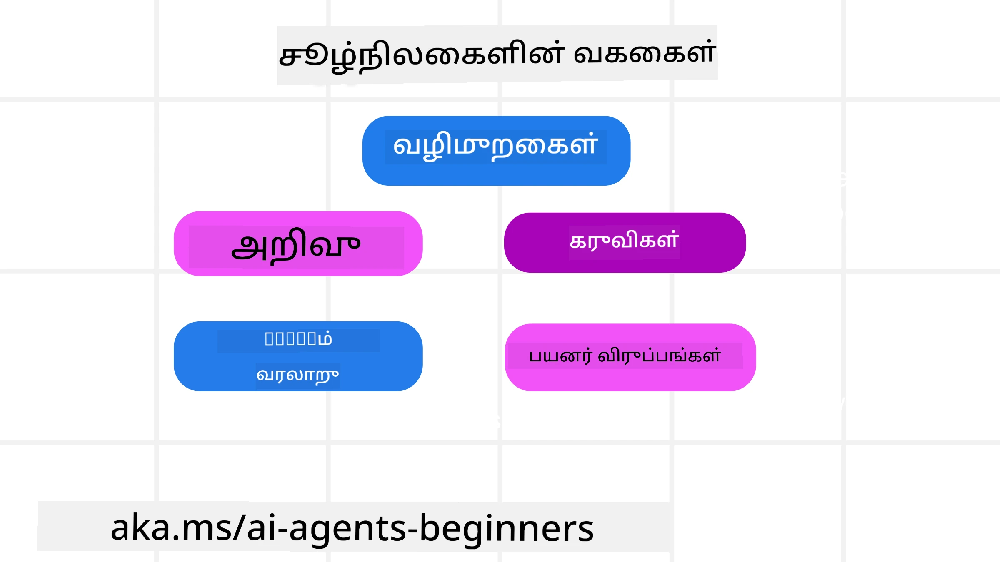
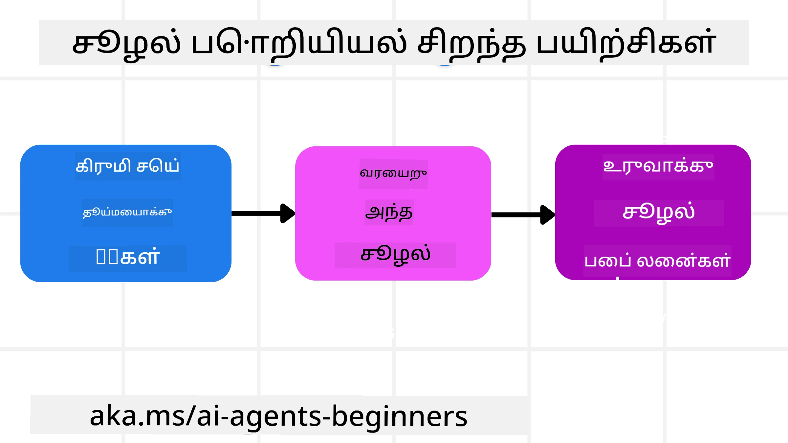

<!--
CO_OP_TRANSLATOR_METADATA:
{
  "original_hash": "cb7e50f471905ce6fdb92a30269a7a98",
  "translation_date": "2025-10-11T11:21:49+00:00",
  "source_file": "12-context-engineering/README.md",
  "language_code": "ta"
}
-->
# AI முகவர்களுக்கான சூழல் பொறியியல்

> _(மேலே உள்ள படத்தை கிளிக் செய்து இந்த பாடத்தின் வீடியோவைப் பாருங்கள்)_

நீங்கள் உருவாக்கும் AI முகவர்களுக்கான பயன்பாட்டின் சிக்கல்களைப் புரிந்துகொள்வது, நம்பகமான AI முகவர்களை உருவாக்குவதற்கு முக்கியமானது. கேள்வி பொறியியல் மட்டுமின்றி, சிக்கலான தேவைகளைத் தீர்க்க தகவல்களை திறமையாக நிர்வகிக்கும் AI முகவர்களை உருவாக்க வேண்டும்.

இந்த பாடத்தில், சூழல் பொறியியல் என்ன மற்றும் AI முகவர்களை உருவாக்குவதில் அதன் பங்கு என்ன என்பதைப் பார்ப்போம்.

## அறிமுகம்

இந்த பாடத்தில் நீங்கள் கற்றுக்கொள்ளப்போகிறீர்கள்:

• **சூழல் பொறியியல் என்ன** மற்றும் அது கேள்வி பொறியியல் (Prompt Engineering) உடன் எப்படி மாறுபடுகிறது.

• **சூழல் பொறியியல் செயல்திறனை மேம்படுத்தும் உத்திகள்**, அதாவது தகவல்களை எழுதுவது, தேர்வு செய்வது, சுருக்குவது மற்றும் தனிமைப்படுத்துவது.

• **சூழல் தோல்விகள்** மற்றும் அவற்றை சரிசெய்வதற்கான வழிகள்.

## கற்றல் இலக்குகள்

இந்த பாடத்தை முடித்த பிறகு, நீங்கள்:

• **சூழல் பொறியியல்** என்ன என்பதை வரையறுத்து, அதை கேள்வி பொறியியல் உடன் மாறுபடுத்தி புரிந்துகொள்ள முடியும்.

• **LLM பயன்பாடுகளில் முக்கியமான சூழல் கூறுகளை** அடையாளம் காண முடியும்.

• **சூழல் எழுதுதல், தேர்வு செய்தல், சுருக்குதல் மற்றும் தனிமைப்படுத்தல் உத்திகளை** பயன்படுத்தி முகவர்களின் செயல்திறனை மேம்படுத்த முடியும்.

• **சூழல் தோல்விகளை** (பொய்யான தகவல், கவனச்சிதறல், குழப்பம், முரண்பாடு) அடையாளம் கண்டு, அவற்றைத் தீர்க்கும் முறைகளை செயல்படுத்த முடியும்.

## சூழல் பொறியியல் என்ன?

AI முகவர்களுக்கு, சூழல் என்பது AI முகவரின் திட்டமிடலை இயக்கும் முக்கியமானது. AI முகவர் அடுத்த படியை முடிக்க தேவையான சரியான தகவல்களை வைத்திருக்க வேண்டும் என்பதை உறுதிப்படுத்தும் செயல்முறையே சூழல் பொறியியல். சூழல் சாளரத்தின் அளவு வரையறுக்கப்பட்டிருப்பதால், முகவர் உருவாக்குபவர்கள் தகவல்களைச் சேர்க்க, நீக்க மற்றும் சுருக்குவதற்கான அமைப்புகள் மற்றும் செயல்முறைகளை உருவாக்க வேண்டும்.

### கேள்வி பொறியியல் vs சூழல் பொறியியல்

கேள்வி பொறியியல் என்பது AI முகவர்களை ஒரு நிலையான விதிமுறைகளின் அடிப்படையில் வழிநடத்துவதற்கானது. சூழல் பொறியியல் என்பது AI முகவருக்கு தேவையான தகவல்களை காலத்திற்கேற்ப நிர்வகிக்க உதவும் செயல்முறை. இந்த செயல்முறையை மீண்டும் மீண்டும் பயன்படுத்தக்கூடியதாகவும் நம்பகமானதாகவும் மாற்றுவதே சூழல் பொறியியல்.

### சூழலின் வகைகள்

சூழல் என்பது ஒரே ஒரு விஷயமாக இருக்காது என்பதை நினைவில் கொள்ள வேண்டும். AI முகவருக்கு தேவையான தகவல்கள் பல்வேறு மூலங்களிலிருந்து வரலாம், மேலும் இந்த தகவல்களை முகவருக்கு அணுகக்கூடியதாக மாற்றுவது நமக்கு பொறுப்பு:

AI முகவர் நிர்வகிக்க வேண்டிய சூழலின் வகைகள்:

• **வழிமுறைகள்:** இது முகவரின் "விதிமுறைகள்" போன்றவை – கேள்விகள், அமைப்பு செய்திகள், சில உதாரணங்கள் (AI-க்கு எதையாவது செய்யக் கற்றுக்கொடுக்க), மற்றும் அது பயன்படுத்தக்கூடிய கருவிகளின் விளக்கங்கள். இது கேள்வி பொறியியல் மற்றும் சூழல் பொறியியல் இணையும் இடமாகும்.

• **அறிவு:** தரவுத்தொகுப்புகள் அல்லது நீண்டகால நினைவுகளில் சேமிக்கப்பட்ட தகவல்கள். இது RAG அமைப்புகளை ஒருங்கிணைப்பதையும், முகவருக்கு பல்வேறு அறிவு சேமிப்பகங்கள் மற்றும் தரவுத்தொகுப்புகளை அணுக உதவுவதையும் உள்ளடக்கியது.

• **கருவிகள்:** வெளிப்புற செயல்பாடுகள், APIகள் மற்றும் MCP சேவைகள் பற்றிய வரையறைகள், மற்றும் அவற்றைப் பயன்படுத்தியதில் கிடைக்கும் முடிவுகள்.

• **உரையாடல் வரலாறு:** பயனர் உடன் தொடர்ச்சியான உரையாடல். காலப்போக்கில், இந்த உரையாடல்கள் நீண்டதும் சிக்கலானதுமானதாக மாறும், இது சூழல் சாளரத்தில் இடத்தை எடுத்துக்கொள்ளும்.

• **பயனர் விருப்பங்கள்:** பயனர் விருப்பங்களைப் பற்றிய தகவல்கள், இது முக்கிய முடிவுகளை எடுக்கும் போது உதவியாக இருக்கும்.

## சூழல் பொறியியல் செயல்திறனை மேம்படுத்தும் உத்திகள்

### திட்டமிடல் உத்திகள்

சூழல் பொறியியல் சிறந்த திட்டமிடலுடன் தொடங்க வேண்டும். இதை எவ்வாறு செயல்படுத்துவது என்பதைப் பற்றி சிந்திக்க உதவும் ஒரு அணுகுமுறை இங்கே:

1. **தெளிவான முடிவுகளை வரையறுக்கவும்** - AI முகவர்களுக்கு வழங்கப்படும் பணிகளின் முடிவுகள் தெளிவாக வரையறுக்கப்பட வேண்டும். "AI முகவர் தனது பணியை முடித்த பிறகு உலகம் எப்படி இருக்கும்?" என்ற கேள்விக்கு பதிலளிக்கவும்.

2. **சூழலை வரைபடம் செய்யவும்** - AI முகவரின் முடிவுகளை வரையறுத்த பிறகு, "இந்த பணியை முடிக்க AI முகவருக்கு என்ன தகவல் தேவை?" என்ற கேள்விக்கு பதிலளிக்கவும்.

3. **சூழல் குழாய்களை உருவாக்கவும்** - தகவல் எங்கு இருக்கிறது என்பதை நீங்கள் அறிந்த பிறகு, "முகவர் இந்த தகவலை எவ்வாறு பெறும்?" என்ற கேள்விக்கு பதிலளிக்கவும்.

### நடைமுறை உத்திகள்

திட்டமிடல் முக்கியமானது, ஆனால் தகவல் AI முகவரின் சூழல் சாளரத்தில் வரும்போது, அதை நிர்வகிக்க சில நடைமுறை உத்திகள் தேவை:

#### சூழலை நிர்வகித்தல்

சில தகவல்கள் தானாகவே சூழல் சாளரத்தில் சேர்க்கப்படும், ஆனால் சூழல் பொறியியல் என்பது இந்த தகவல்களைச் செயல்படுதல் முறையில் நிர்வகிப்பது:

1. **முகவர் ஸ்கிராட்ச்பேட்**
   AI முகவர் ஒரு குறிப்பிட்ட அமர்வின் போது பயனர் தொடர்புகள் மற்றும் தற்போதைய பணிகளைப் பற்றிய முக்கிய தகவல்களை குறிப்பெடுக்க அனுமதிக்கிறது. இது சூழல் சாளரத்திற்கு வெளியே ஒரு கோப்பு அல்லது ரன்டைம் பொருளில் இருக்க வேண்டும்.

2. **நினைவுகள்**
   ஸ்கிராட்ச்பேட்கள் ஒரு அமர்வின் சூழல் சாளரத்திற்கு வெளியே தகவல்களை நிர்வகிக்க உதவுகின்றன. நினைவுகள் பல அமர்வுகளுக்கு மத்தியில் தொடர்புடைய தகவல்களை சேமிக்கவும் மீட்டெடுக்கவும் உதவுகின்றன.

3. **சூழலை சுருக்குதல்**
   சூழல் சாளரம் வளர்ந்து அதன் வரம்பை அடையும் போது, சுருக்குதல் மற்றும் குறைக்குதல் போன்ற உத்திகள் பயன்படுத்தப்படலாம்.

4. **பல முகவர் அமைப்புகள்**
   பல முகவர் அமைப்புகளை உருவாக்குவது ஒரு வகையான சூழல் பொறியியல் ஆகும்.

5. **சாண்ட்பாக்ஸ் சூழல்கள்**
   ஒரு முகவர் ஒரு கோடை இயக்க வேண்டும் அல்லது ஒரு பெரிய ஆவணத்தை செயல்படுத்த வேண்டும் என்றால், இது சூழல் சாளரத்தில் அதிக இடத்தை எடுத்துக்கொள்ளும்.

6. **ரன்டைம் நிலை பொருட்கள்**
   இது ஒரு முகவருக்கு குறிப்பிட்ட தகவல்களை அணுக அனுமதிக்க தகவல்களை நிர்வகிக்க உதவுகிறது.

### சூழல் பொறியியல் உதாரணம்

உதாரணமாக, ஒரு AI முகவரிடம் **"என்னை பாரிசுக்கு ஒரு பயணத்தை முன்பதிவு செய்யுங்கள்."** என்று கேட்கலாம்.

• ஒரு எளிய முகவர் **"நீங்கள் பாரிசுக்கு எப்போது செல்ல விரும்புகிறீர்கள்?"** என்று கேட்கலாம்.

• சூழல் பொறியியல் உத்திகளைப் பயன்படுத்தும் ஒரு முகவர் மேலும் பல செயல்பாடுகளைச் செய்யும்.

## பொதுவான சூழல் தோல்விகள்

### சூழல் விஷம்

**என்ன:** பொய்யான தகவல் அல்லது தவறான தகவல் சூழலில் சேர்க்கப்பட்டு, முகவர் தவறான முடிவுகளை எடுக்க வழிவகுக்கும்.

**என்ன செய்ய வேண்டும்:** **சூழல் சரிபார்ப்பு** மற்றும் **தனிமைப்படுத்தல்** செயல்படுத்தவும்.

### சூழல் கவனச்சிதறல்

**என்ன:** சூழல் மிகப்பெரியதாக மாறும்போது, மாடல் பயிற்சியில் கற்றுக்கொண்டதை மறந்து, தவறான செயல்பாடுகளைச் செய்யும்.

**என்ன செய்ய வேண்டும்:** **சூழல் சுருக்குதல்** பயன்படுத்தவும்.

### சூழல் குழப்பம்

**என்ன:** தேவையற்ற சூழல் காரணமாக, மாடல் தவறான பதில்களை உருவாக்கும்.

**என்ன செய்ய வேண்டும்:** **கருவி நிர்வாகம்** செயல்படுத்தவும்.

### சூழல் முரண்பாடு

**என்ன:** முரண்பட்ட தகவல்கள் சூழலில் இருப்பதால், மாடல் தவறான முடிவுகளை எடுக்கிறது.

**என்ன செய்ய வேண்டும்:** **சூழல் குறைக்குதல்** மற்றும் **தவறான தகவல்களை நீக்குதல்**.

## சூழல் பொறியியல் குறித்து மேலும் கேள்விகள் உள்ளதா?

[Azure AI Foundry Discord](https://aka.ms/ai-agents/discord) குழுவில் சேர்ந்து, மற்ற கற்றலாளர்களுடன் சந்திக்கவும், அலுவலக நேரங்களில் கலந்துரையாடவும், உங்கள் AI முகவர்களின் கேள்விகளுக்கு பதிலளிக்கவும்.

---

**அறிவிப்பு**:  
இந்த ஆவணம் [Co-op Translator](https://github.com/Azure/co-op-translator) என்ற AI மொழிபெயர்ப்பு சேவையை பயன்படுத்தி மொழிபெயர்க்கப்பட்டுள்ளது. நாங்கள் துல்லியத்திற்காக முயற்சிக்கிறோம், ஆனால் தானியங்கி மொழிபெயர்ப்புகளில் பிழைகள் அல்லது தவறுகள் இருக்கக்கூடும் என்பதை கவனத்தில் கொள்ளவும். அதன் சொந்த மொழியில் உள்ள மூல ஆவணம் அதிகாரப்பூர்வ ஆதாரமாக கருதப்பட வேண்டும். முக்கியமான தகவல்களுக்கு, தொழில்முறை மனித மொழிபெயர்ப்பு பரிந்துரைக்கப்படுகிறது. இந்த மொழிபெயர்ப்பைப் பயன்படுத்துவதால் ஏற்படும் எந்த தவறான புரிதல்கள் அல்லது தவறான விளக்கங்களுக்கு நாங்கள் பொறுப்பல்ல.