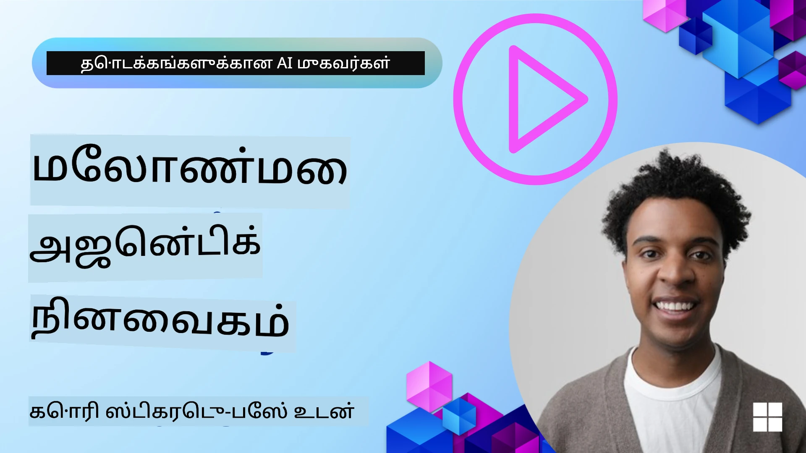

<!--
CO_OP_TRANSLATOR_METADATA:
{
  "original_hash": "a1d90991499ad697c4ad24decaf36968",
  "translation_date": "2025-12-09T13:01:40+00:00",
  "source_file": "13-agent-memory/README.md",
  "language_code": "ta"
}
-->
# AI முகவர்களின் நினைவகம்

AI முகவர்களை உருவாக்குவதன் தனித்துவமான நன்மைகள் குறித்து பேசும்போது, இரண்டு முக்கிய அம்சங்கள் பேசப்படுகின்றன: கருவிகளை அழைத்து பணிகளை முடிக்கவும், காலப்போக்கில் மேம்படவும். நினைவகம் என்பது தன்னம்பிக்கையுடன் மேம்படும் முகவர்களை உருவாக்குவதற்கான அடித்தளமாகும், இது எங்கள் பயனர்களுக்கு சிறந்த அனுபவங்களை உருவாக்க உதவுகிறது.

இந்த பாடத்தில், AI முகவர்களுக்கு நினைவகம் என்ன, அதை எவ்வாறு நிர்வகிக்கலாம் மற்றும் எங்கள் பயன்பாடுகளுக்கு பயன்படுமாறு பயன்படுத்தலாம் என்பதைப் பார்ப்போம்.

## அறிமுகம்

இந்த பாடத்தில் கற்றுக்கொள்ளப்படுவது:

• **AI முகவர்களின் நினைவகத்தைப் புரிந்துகொள்வது**: நினைவகம் என்ன, ஏன் அது முகவர்களுக்கு அவசியம்.

• **நினைவகத்தை செயல்படுத்துதல் மற்றும் சேமித்தல்**: AI முகவர்களுக்கு நினைவக திறன்களைச் சேர்க்கும் நடைமுறை முறைகள், குறுகிய கால மற்றும் நீண்ட கால நினைவகத்தை மையமாகக் கொண்டு.

• **AI முகவர்களை தன்னம்பிக்கையுடன் மேம்படுத்துதல்**: கடந்த தொடர்புகளிலிருந்து கற்றுக்கொள்வதற்கும், காலப்போக்கில் மேம்படுவதற்கும் நினைவகம் எப்படி உதவுகிறது.

## கிடைக்கக்கூடிய செயல்பாடுகள்

இந்த பாடத்தில் இரண்டு விரிவான நோட்புக் டுடோரியல்கள் உள்ளன:

• **[13-agent-memory.ipynb](./13-agent-memory.ipynb)**: Mem0 மற்றும் Azure AI Search-ஐ Semantic Kernel framework மூலம் நினைவகத்தை செயல்படுத்துகிறது.

• **[13-agent-memory-cognee.ipynb](./13-agent-memory-cognee.ipynb)**: Cognee மூலம் அமைப்பான நினைவகத்தை செயல்படுத்துகிறது, இது எம்பெடிங்குகளால் ஆதரிக்கப்படும் அறிவு வரைபடத்தை தானாக உருவாக்கி, அதை காட்சிப்படுத்தி, புத்திசாலியான தேடலை வழங்குகிறது.

## கற்றல் இலக்குகள்

இந்த பாடத்தை முடித்த பிறகு, நீங்கள்:

• **AI முகவர்களின் பல்வேறு வகையான நினைவகங்களை வேறுபடுத்த முடியும்**, வேலை, குறுகிய கால, நீண்ட கால நினைவகம் மற்றும் தனிப்பட்ட நினைவகங்கள் போன்ற சிறப்பு வடிவங்களை உள்ளடக்கியது.

• **AI முகவர்களுக்கு குறுகிய கால மற்றும் நீண்ட கால நினைவகத்தை செயல்படுத்தவும் நிர்வகிக்கவும்** Semantic Kernel framework-ஐ பயன்படுத்தி, Mem0, Cognee, Whiteboard memory போன்ற கருவிகளைப் பயன்படுத்தி, Azure AI Search உடன் ஒருங்கிணைத்து.

• **தன்னம்பிக்கையுடன் மேம்படும் AI முகவர்களின் அடிப்படை கொள்கைகளைப் புரிந்துகொள்ளவும்** மற்றும் வலுவான நினைவக மேலாண்மை அமைப்புகள் தொடர்ச்சியான கற்றல் மற்றும் தழுவலுக்கு எப்படி பங்களிக்கின்றன என்பதை அறியலாம்.

## AI முகவர்களின் நினைவகத்தைப் புரிந்துகொள்வது

அதன் மையத்தில், **AI முகவர்களுக்கு நினைவகம் என்பது தகவலை நினைவில் வைத்துக்கொள்வதற்கும் மீண்டும் நினைவூட்டுவதற்கும் உதவும் முறைகளை குறிக்கிறது**. இந்த தகவல் உரையாடல் பற்றிய குறிப்புகள், பயனர் விருப்பங்கள், கடந்த செயல்கள் அல்லது கற்றுக்கொண்ட முறைமைகள் போன்றவை இருக்கலாம்.

நினைவகம் இல்லாமல், AI பயன்பாடுகள் பெரும்பாலும் நிலையற்றதாக இருக்கும், அதாவது ஒவ்வொரு தொடர்பும் புதிதாக தொடங்கும். இது முகவர் முந்தைய சூழல் அல்லது விருப்பங்களை "மறந்து" மீண்டும் மீண்டும் தொடங்கும், பயனர்களுக்கு சிரமமான அனுபவத்தை உருவாக்கும்.

### நினைவகம் ஏன் முக்கியம்?

ஒரு முகவரின் புத்திசாலித்தனம் அதன் கடந்த தகவல்களை நினைவூட்டுவதற்கும் பயன்படுத்துவதற்கும் உள்ள திறனுடன் ஆழமாக இணைக்கப்பட்டுள்ளது. நினைவகம் முகவர்களை:

• **பரிந்துரை செய்யும்**: கடந்த செயல்கள் மற்றும் முடிவுகளிலிருந்து கற்றுக்கொள்வது.

• **உரையாடல் நடத்தும்**: தொடர்ச்சியான உரையாடலின் சூழலை பராமரிக்கிறது.

• **முன்கூட்டிய மற்றும் எதிர்வினை செயல்**: கடந்த தரவின் அடிப்படையில் தேவைகளை முன்னறிவிக்க அல்லது சரியான பதில்களை வழங்க.

• **தன்னாட்சி**: சேமிக்கப்பட்ட அறிவைப் பயன்படுத்தி சுயமாக செயல்படுதல்.

நினைவகத்தை செயல்படுத்துவதன் நோக்கம் முகவர்களை **நம்பகமான மற்றும் திறமையானதாக** மாற்றுவதாகும்.

### நினைவக வகைகள்

#### வேலை நினைவகம்

இதை ஒரு முகவர் ஒரு குறிப்பிட்ட பணியை அல்லது சிந்தனை செயல்முறையை மேற்கொள்ளும் போது பயன்படுத்தும் "குறுகிய குறிப்புப் பேப்பர்" என்று நினைக்கலாம். இது அடுத்த படியை கணக்கிட தேவையான உடனடி தகவலை வைத்திருக்கிறது.

AI முகவர்களுக்கு, வேலை நினைவகம் பெரும்பாலும் ஒரு உரையாடலின் மிக முக்கியமான தகவல்களைப் பிடிக்கிறது, முழு உரையாடல் வரலாறு நீண்டதாக இருந்தாலும் அல்லது குறைக்கப்பட்டாலும். இது தேவைகள், முன்மொழிவுகள், முடிவுகள் மற்றும் செயல்கள் போன்ற முக்கிய அம்சங்களை எடுத்துக்காட்டுகிறது.

**வேலை நினைவக உதாரணம்**

ஒரு பயண முன்பதிவு முகவரில், வேலை நினைவகம் பயனரின் தற்போதைய கோரிக்கையைப் பிடிக்கலாம், உதாரணமாக "நான் பாரிசுக்கு ஒரு பயணத்தை முன்பதிவு செய்ய விரும்புகிறேன்". இந்த குறிப்பிட்ட தேவையை முகவரின் உடனடி சூழலில் வைத்துக்கொண்டு தற்போதைய தொடர்பை வழிநடத்துகிறது.

#### குறுகிய கால நினைவகம்

இந்த வகை நினைவகம் ஒரு உரையாடல் அல்லது அமர்வின் காலத்திற்கு தகவலை வைத்திருக்கிறது. இது தற்போதைய உரையாடலின் சூழல், உரையாடலின் முந்தைய திருப்புகளை மீண்டும் குறிப்பிடுவதற்கு முகவருக்கு உதவுகிறது.

**குறுகிய கால நினைவக உதாரணம்**

ஒரு பயனர் "பாரிசுக்கு ஒரு விமானத்தின் செலவு எவ்வளவு?" என்று கேட்க, பின்னர் "அங்கு தங்குமிடம் பற்றி என்ன?" என்று தொடர்ந்தால், குறுகிய கால நினைவகம் "அங்கு" என்பது "பாரிஸ்" என்பதை உறுதிப்படுத்துகிறது.

#### நீண்ட கால நினைவகம்

இது பல உரையாடல்கள் அல்லது அமர்வுகளுக்கு மேலாக நிலைத்திருக்கும் தகவலாகும். இது பயனர் விருப்பங்கள், வரலாற்று தொடர்புகள் அல்லது பொதுவான அறிவை நீண்ட காலத்திற்கு நினைவில் வைத்திருக்க உதவுகிறது. இது தனிப்பயனாக்கத்திற்கு முக்கியமானது.

**நீண்ட கால நினைவக உதாரணம்**

நீண்ட கால நினைவகம் "பென் ஸ்கீயிங் மற்றும் வெளிப்புற செயல்பாடுகளை விரும்புகிறார், மலைக்காட்சியுடன் காபி விரும்புகிறார், மற்றும் கடந்த காயம் காரணமாக மேம்பட்ட ஸ்கீ சாய்வுகளை தவிர்க்க விரும்புகிறார்" என்பதை சேமிக்கலாம். இது முந்தைய தொடர்புகளிலிருந்து கற்றுக்கொண்ட தகவலாக, எதிர்கால பயண திட்டமிடும் அமர்வுகளில் பரிந்துரைகளை மிகவும் தனிப்பயனாக்கமாக மாற்றுகிறது.

#### தனிப்பட்ட நினைவகம்

இந்த சிறப்பு நினைவக வகை ஒரு முகவருக்கு ஒரு "தனித்துவமான தன்மை" அல்லது "தனிப்பட்ட தன்மை" உருவாக்க உதவுகிறது. இது முகவருக்கு அதன் விவரங்களை அல்லது அதன் நோக்கமுள்ள பாத்திரத்தை நினைவில் வைத்திருக்க உதவுகிறது, உரையாடல்களை மேலும் சீராகவும் மையமாகவும் மாற்றுகிறது.

**தனிப்பட்ட நினைவக உதாரணம்**

ஒரு பயண முகவர் "சிறந்த ஸ்கீ திட்டமிடும் நிபுணர்" ஆக வடிவமைக்கப்பட்டால், தனிப்பட்ட நினைவகம் இந்த பாத்திரத்தை உறுதிப்படுத்தலாம், அதன் பதில்களை ஒரு நிபுணரின் குரல் மற்றும் அறிவுடன் இணங்கச் செய்ய உதவுகிறது.

#### வேலை/நிகழ்வு நினைவகம்

இந்த நினைவகம் ஒரு முகவர் ஒரு சிக்கலான பணியை மேற்கொள்ளும் போது எடுத்துக்கொள்ளும் படிகளின் வரிசையை, வெற்றிகள் மற்றும் தோல்விகளைச் சேமிக்கிறது. இது கடந்த "நிகழ்வுகள்" அல்லது அனுபவங்களை நினைவில் வைத்துக்கொண்டு அவற்றிலிருந்து கற்றுக்கொள்வது போன்றது.

**நிகழ்வு நினைவக உதாரணம்**

முகவர் ஒரு குறிப்பிட்ட விமானத்தை முன்பதிவு செய்ய முயன்றால், ஆனால் அது கிடைக்காததால் தோல்வியடைந்தால், நிகழ்வு நினைவகம் இந்த தோல்வியை பதிவு செய்யலாம், இது முகவருக்கு மாற்று விமானங்களை முயற்சிக்க அல்லது பயனருக்கு தகவல் வழங்க உதவுகிறது.

#### பொருள் நினைவகம்

இது உரையாடல்களில் இருந்து குறிப்பிட்ட பொருட்கள் (மனிதர்கள், இடங்கள் அல்லது பொருட்கள்) மற்றும் நிகழ்வுகளை எடுத்து நினைவில் வைத்துக்கொள்வதைக் குறிக்கிறது. இது உரையாடப்பட்ட முக்கிய அம்சங்களை அமைப்பான முறையில் புரிந்துகொள்ள முகவருக்கு உதவுகிறது.

**பொருள் நினைவக உதாரணம்**

கடந்த பயணத்தைப் பற்றிய உரையாடலிலிருந்து, முகவர் "பாரிஸ்," "ஐஃபெல் டவர்," மற்றும் "Le Chat Noir உணவகத்தில் இரவு உணவு" போன்ற பொருட்களை எடுக்கலாம். எதிர்கால தொடர்பில், முகவர் "Le Chat Noir" ஐ நினைவூட்ட முடியும் மற்றும் அங்கு புதிய முன்பதிவை செய்ய பரிந்துரைக்கலாம்.

#### அமைப்பான RAG (Retrieval Augmented Generation)

RAG என்பது ஒரு பரந்த தொழில்நுட்பமாக இருந்தாலும், "அமைப்பான RAG" ஒரு சக்திவாய்ந்த நினைவக தொழில்நுட்பமாக குறிப்பிடப்படுகிறது. இது பல்வேறு மூலங்களிலிருந்து (உரையாடல்கள், மின்னஞ்சல்கள், படங்கள்) அடர்த்தியான, அமைப்பான தகவல்களை எடுத்து, பதில்களில் துல்லியத்தை, நினைவூட்டலை மற்றும் வேகத்தை மேம்படுத்த உதவுகிறது. பாரம்பரிய RAG semantic similarity-ஐ மட்டுமே நம்புவதற்கு மாறாக, Structured RAG தகவலின் உள்ளமைப்புடன் வேலை செய்கிறது.

**அமைப்பான RAG உதாரணம்**

விசைப்பதிவுகளைப் பொருத்துவதற்கு மாறாக, Structured RAG ஒரு மின்னஞ்சலிலிருந்து விமான விவரங்களை (இடம், தேதி, நேரம், விமான நிறுவனம்) பகுப்பாய்வு செய்து அமைப்பான முறையில் சேமிக்கலாம். இது "நான் செவ்வாய்க்கிழமை பாரிஸ் செல்ல எந்த விமானத்தை முன்பதிவு செய்தேன்?" போன்ற துல்லியமான கேள்விகளை அனுமதிக்கிறது.

## நினைவகத்தை செயல்படுத்துதல் மற்றும் சேமித்தல்

AI முகவர்களுக்கு நினைவகத்தை செயல்படுத்துவது **நினைவக மேலாண்மை** என்ற முறையான செயல்முறையை உள்ளடக்கியது, இது தகவலை உருவாக்குதல், சேமித்தல், மீட்டெடுப்பது, ஒருங்கிணைத்தல், புதுப்பித்தல் மற்றும் "மறக்குதல்" (அல்லது நீக்குதல்) ஆகியவற்றை உள்ளடக்கியது. குறிப்பாக, மீட்டெடுப்பு முக்கியமான அம்சமாகும்.

### சிறப்பு நினைவக கருவிகள்

#### Mem0

முகவர்களின் நினைவகத்தை சேமிக்கவும் நிர்வகிக்கவும் Mem0 போன்ற சிறப்பு கருவிகளைப் பயன்படுத்தலாம். Mem0 ஒரு நிலையான நினைவக அடுக்கு ஆக செயல்படுகிறது, இது முகவர்களுக்கு தொடர்புகளை நினைவூட்ட, பயனர் விருப்பங்கள் மற்றும் உண்மையான சூழலை சேமிக்கவும், காலப்போக்கில் வெற்றிகள் மற்றும் தோல்விகளிலிருந்து கற்றுக்கொள்ளவும் உதவுகிறது. இங்கு கருத்து, நிலையற்ற முகவர்கள் நிலையானவர்களாக மாறுகின்றனர்.

#### Cognee

மற்றொரு சக்திவாய்ந்த அணுகுமுறை **Cognee** ஐப் பயன்படுத்துவது, இது AI முகவர்களுக்கு திறந்த மூல semantic memory ஆக செயல்படுகிறது, அமைப்பான மற்றும் அமைப்பற்ற தரவுகளை எம்பெடிங்குகளால் ஆதரிக்கப்படும் கேள்விக்குரிய அறிவு வரைபடங்களாக மாற்றுகிறது. Cognee **இரட்டை-சேமிப்பு கட்டமைப்பை** வழங்குகிறது, இது வெக்டர் ஒத்திசைவு தேடலுடன் வரைபட உறவுகளை இணைக்கிறது, தகவல் ஒத்திசைவு மட்டுமல்லாமல், கருத்துகள் எப்படி தொடர்புடையவை என்பதை முகவர்களுக்கு புரிந்துகொள்ள உதவுகிறது.

### RAG மூலம் நினைவகத்தை சேமித்தல்

Mem0 போன்ற சிறப்பு நினைவக கருவிகளைத் தவிர, **Azure AI Search** போன்ற வலுவான தேடல் சேவைகளை நினைவகங்களை சேமிக்கவும் மீட்டெடுக்கவும் பின்புலமாக பயன்படுத்தலாம், குறிப்பாக அமைப்பான RAG க்காக.

## AI முகவர்களை தன்னம்பிக்கையுடன் மேம்படுத்துதல்

தன்னம்பிக்கையுடன் மேம்படும் முகவர்களுக்கு ஒரு **"அறிவு முகவர்"** அறிமுகப்படுத்துவது பொதுவான முறை.

---

<!-- CO-OP TRANSLATOR DISCLAIMER START -->
**புறக்குறிப்பு**:  
இந்த ஆவணம் AI மொழிபெயர்ப்பு சேவை [Co-op Translator](https://github.com/Azure/co-op-translator) பயன்படுத்தி மொழிபெயர்க்கப்பட்டுள்ளது. நாங்கள் துல்லியத்திற்காக முயற்சிக்கின்றோம், ஆனால் தானியங்கி மொழிபெயர்ப்புகளில் பிழைகள் அல்லது தவறுகள் இருக்கக்கூடும் என்பதை கவனத்தில் கொள்ளவும். அதன் தாய்மொழியில் உள்ள மூல ஆவணம் அதிகாரப்பூர்வ ஆதாரமாக கருதப்பட வேண்டும். முக்கியமான தகவல்களுக்கு, தொழில்முறை மனித மொழிபெயர்ப்பு பரிந்துரைக்கப்படுகிறது. இந்த மொழிபெயர்ப்பைப் பயன்படுத்துவதால் ஏற்படும் எந்த தவறான புரிதல்கள் அல்லது தவறான விளக்கங்களுக்கு நாங்கள் பொறுப்பல்ல.
<!-- CO-OP TRANSLATOR DISCLAIMER END -->