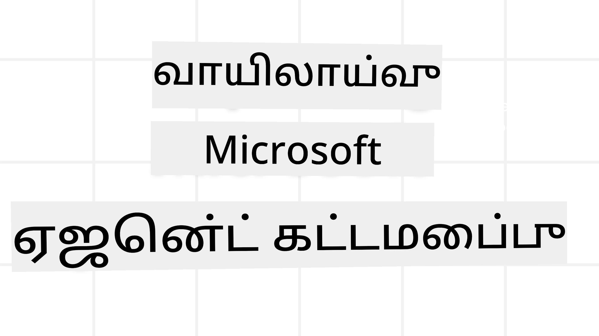
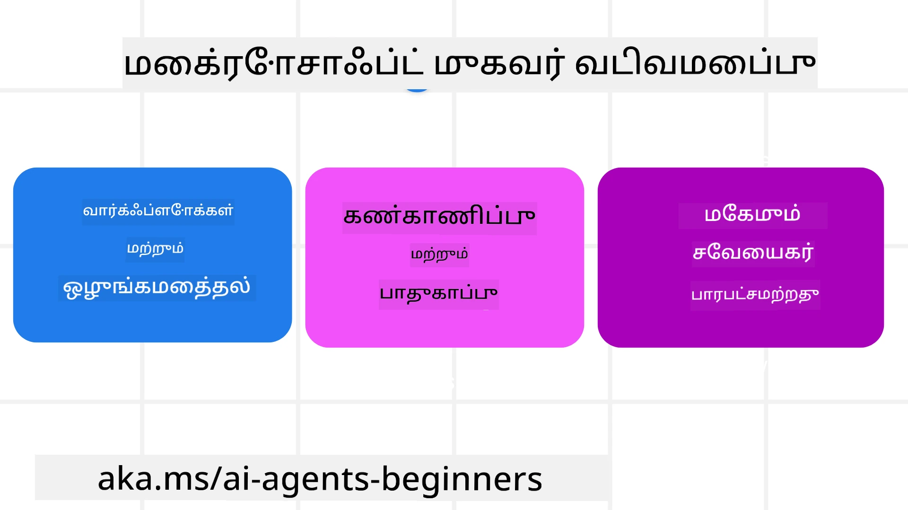
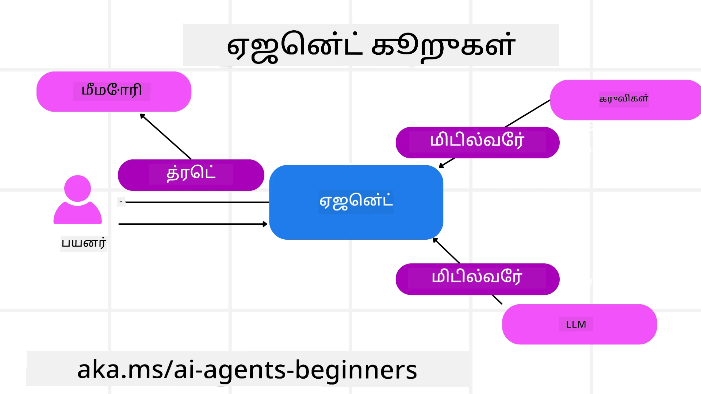

<!--
CO_OP_TRANSLATOR_METADATA:
{
  "original_hash": "19c4dab375acbc733855cc7f2f04edbc",
  "translation_date": "2025-10-11T11:10:13+00:00",
  "source_file": "14-microsoft-agent-framework/README.md",
  "language_code": "ta"
}
-->
# Microsoft Agent Framework ஆராய்ச்சி



### அறிமுகம்

இந்த பாடத்தில் நீங்கள் கற்றுக்கொள்ளப்போகிறீர்கள்:

- Microsoft Agent Framework-ஐப் புரிந்துகொள்வது: முக்கிய அம்சங்கள் மற்றும் மதிப்பு  
- Microsoft Agent Framework-இன் முக்கிய கருத்துகளை ஆராய்வது  
- Semantic Kernel மற்றும் AutoGen உடன் MAF-ஐ ஒப்பிடுதல்: இடமாற்ற வழிகாட்டி  

## கற்றல் இலக்குகள்

இந்த பாடத்தை முடித்த பிறகு, நீங்கள்:

- Microsoft Agent Framework-ஐப் பயன்படுத்தி தயாரிப்பு தர AI முகவர்களை உருவாக்க  
- Microsoft Agent Framework-இன் முக்கிய அம்சங்களை உங்கள் Agentic பயன்பாடுகளில் பயன்படுத்த  
- ஏற்கனவே உள்ள Agentic frameworks மற்றும் கருவிகளை இடமாற்றம் செய்து ஒருங்கிணைக்க  

## குறியீட்டு மாதிரிகள் 

[Microsoft Agent Framework (MAF)](https://aka.ms/ai-agents-beginners/agent-framewrok) குறியீட்டு மாதிரிகள் இந்த repository-யில் `xx-python-agent-framework` மற்றும் `xx-dotnet-agent-framework` கோப்புகளில் கிடைக்கின்றன.

## Microsoft Agent Framework-ஐப் புரிந்துகொள்வது



[Microsoft Agent Framework (MAF)](https://aka.ms/ai-agents-beginners/agent-framewrok) என்பது Semantic Kernel மற்றும் AutoGen ஆகியவற்றின் அனுபவங்களையும் கற்றல்களையும் அடிப்படையாகக் கொண்டு உருவாக்கப்பட்டுள்ளது. இது உற்பத்தி மற்றும் ஆராய்ச்சி சூழல்களில் காணப்படும் பல்வேறு Agentic பயன்பாடுகளைத் தீர்க்கும் வகையில் நெகிழ்வுத்தன்மையை வழங்குகிறது:

- **தொடர்ச்சியான முகவர் ஒருங்கிணைப்பு** - படிப்படியாக செயல்படும் வேலைப்பாடுகள் தேவைப்படும் சூழல்களில்.  
- **ஒரே நேரத்தில் ஒருங்கிணைப்பு** - முகவர்கள் ஒரே நேரத்தில் பணிகளை முடிக்க வேண்டிய சூழல்களில்.  
- **குழு உரையாடல் ஒருங்கிணைப்பு** - முகவர்கள் ஒரே பணியில் இணைந்து செயல்படும் சூழல்களில்.  
- **கையளிப்பு ஒருங்கிணைப்பு** - துணை பணிகள் முடிக்கப்பட்ட பிறகு, முகவர்கள் பணியை ஒருவருக்கொருவர் கையளிக்கும் சூழல்களில்.  
- **காந்த ஒருங்கிணைப்பு** - மேலாளர் முகவர் பணிகளின் பட்டியலை உருவாக்கி மாற்றி, துணை முகவர்களை ஒருங்கிணைத்து பணியை முடிக்கச் செய்கிறார்.  

உற்பத்தியில் AI முகவர்களை வழங்க, MAF-ல் மேலும் உள்ள அம்சங்கள்:

- **காண்பித்தல்** - OpenTelemetry-ஐப் பயன்படுத்தி AI முகவரின் ஒவ்வொரு செயலையும், கருவி அழைப்புகள், ஒருங்கிணைப்பு படிகள், காரணமுடைய செயல்பாடுகள் மற்றும் Azure AI Foundry டாஷ்போர்டுகள் மூலம் செயல்திறன் கண்காணிப்பு.  
- **பாதுகாப்பு** - Azure AI Foundry-ல் முகவர்களை இயல்பாக ஹோஸ்ட் செய்வதன் மூலம், ரோல் அடிப்படையிலான அணுகல், தனிப்பட்ட தரவுகள் கையாளுதல் மற்றும் உள்ளடக்க பாதுகாப்பு போன்ற பாதுகாப்பு கட்டுப்பாடுகள்.  
- **நிலைத்தன்மை** - முகவர் திரிகள் மற்றும் வேலைப்பாடுகள் இடைநிறுத்தம், மீண்டும் தொடங்குதல் மற்றும் பிழைகளிலிருந்து மீட்கும் திறன் கொண்டவை, இது நீண்ட கால செயல்பாடுகளை சாத்தியமாக்குகிறது.  
- **கட்டுப்பாடு** - மனிதன் மடக்கி வேலைப்பாடுகள் ஆதரிக்கப்படுகின்றன, இதில் பணிகள் மனித ஒப்புதலை தேவைப்படும் வகையில் குறிக்கப்படுகின்றன.  

Microsoft Agent Framework மேலும் இடையூறற்றதாக இருக்க கவனம் செலுத்துகிறது:

- **Cloud-agnostic** - முகவர்கள் கெண்டெய்னர்கள், on-prem மற்றும் பல்வேறு clouds-ல் இயங்க முடியும்.  
- **Provider-agnostic** - Azure OpenAI மற்றும் OpenAI உட்பட உங்கள் விருப்பமான SDK மூலம் முகவர்களை உருவாக்க முடியும்.  
- **திறந்த தரநிலைகள்** - Agent-to-Agent(A2A) மற்றும் Model Context Protocol (MCP) போன்ற நெறிமுறைகளைப் பயன்படுத்தி மற்ற முகவர்கள் மற்றும் கருவிகளை கண்டறிந்து பயன்படுத்த முடியும்.  
- **Plugins மற்றும் Connectors** - Microsoft Fabric, SharePoint, Pinecone மற்றும் Qdrant போன்ற தரவுகள் மற்றும் நினைவக சேவைகளுடன் இணைப்புகளை உருவாக்க முடியும்.  

Microsoft Agent Framework-இன் முக்கிய கருத்துகளில் இந்த அம்சங்கள் எப்படி பயன்படுத்தப்படுகின்றன என்பதை பார்ப்போம்.

## Microsoft Agent Framework-இன் முக்கிய கருத்துகள்

### முகவர்கள்



**முகவர்களை உருவாக்குதல்**

முகவர் உருவாக்கம், inference service (LLM Provider), AI முகவருக்கு பின்பற்ற வேண்டிய வழிகாட்டுதல்கள் மற்றும் ஒதுக்கப்பட்ட `name` ஆகியவற்றை வரையறுத்து செய்யப்படுகிறது:

```python
agent = AzureOpenAIChatClient(credential=AzureCliCredential()).create_agent( instructions="You are good at recommending trips to customers based on their preferences.", name="TripRecommender" )
```

மேலே உள்ளது `Azure OpenAI`-ஐப் பயன்படுத்துகிறது, ஆனால் `Azure AI Foundry Agent Service` உட்பட பல்வேறு சேவைகளைப் பயன்படுத்தி முகவர்களை உருவாக்க முடியும்:

```python
AzureAIAgentClient(async_credential=credential).create_agent( name="HelperAgent", instructions="You are a helpful assistant." ) as agent
```

OpenAI `Responses`, `ChatCompletion` APIs

```python
agent = OpenAIResponsesClient().create_agent( name="WeatherBot", instructions="You are a helpful weather assistant.", )
```

```python
agent = OpenAIChatClient().create_agent( name="HelpfulAssistant", instructions="You are a helpful assistant.", )
```

அல்லது A2A நெறிமுறையைப் பயன்படுத்தி தொலைதூர முகவர்கள்:

```python
agent = A2AAgent( name=agent_card.name, description=agent_card.description, agent_card=agent_card, url="https://your-a2a-agent-host" )
```

**முகவர்களை இயக்குதல்**

முகவர்கள் `.run` அல்லது `.run_stream` முறைகளைப் பயன்படுத்தி non-streaming அல்லது streaming பதில்களுக்காக இயக்கப்படுகிறார்கள்.

```python
result = await agent.run("What are good places to visit in Amsterdam?")
print(result.text)
```

```python
async for update in agent.run_stream("What are the good places to visit in Amsterdam?"):
    if update.text:
        print(update.text, end="", flush=True)

```

ஒவ்வொரு முகவர் இயக்கத்திற்கும் `max_tokens`, `tools`, மற்றும் `model` போன்ற அளவுருக்களை தனிப்பயனாக்குவதற்கான விருப்பங்கள் இருக்கலாம்.

இது குறிப்பிட்ட மாதிரிகள் அல்லது கருவிகள் பயனர் பணியை முடிக்க தேவையான சூழல்களில் பயனுள்ளதாக இருக்கும்.

**கருவிகள்**

கருவிகள் முகவரை வரையறுக்கும் போது வரையறுக்கப்படலாம்:

```python
def get_attractions( location: Annotated[str, Field(description="The location to get the top tourist attractions for")], ) -> str: """Get the top tourist attractions for a given location.""" return f"The top attractions for {location} are." 


# When creating a ChatAgent directly 

agent = ChatAgent( chat_client=OpenAIChatClient(), instructions="You are a helpful assistant", tools=[get_attractions]

```

மற்றும் முகவரை இயக்கும் போது:

```python

result1 = await agent.run( "What's the best place to visit in Seattle?", tools=[get_attractions] # Tool provided for this run only )
```

**முகவர் திரிகள்**

முகவர் திரிகள் பல முறை உரையாடல்களை கையாள பயன்படுத்தப்படுகின்றன. திரிகள் உருவாக்கப்படலாம்:

- `get_new_thread()`-ஐப் பயன்படுத்தி, இது திரியை காலத்திற்குப் பின் சேமிக்க அனுமதிக்கிறது.  
- முகவரை இயக்கும் போது தானாகவே ஒரு திரியை உருவாக்கி, தற்போதைய இயக்கத்தின் போது மட்டுமே திரியை வைத்திருக்க.  

திரியை உருவாக்க, குறியீடு இவ்வாறு இருக்கும்:

```python
# Create a new thread. 
thread = agent.get_new_thread() # Run the agent with the thread. 
response = await agent.run("Hello, I am here to help you book travel. Where would you like to go?", thread=thread)

```

பின்னர் திரியை சேமிக்க வைக்க serialize செய்யலாம்:

```python
# Create a new thread. 
thread = agent.get_new_thread() 

# Run the agent with the thread. 

response = await agent.run("Hello, how are you?", thread=thread) 

# Serialize the thread for storage. 

serialized_thread = await thread.serialize() 

# Deserialize the thread state after loading from storage. 

resumed_thread = await agent.deserialize_thread(serialized_thread)
```

**முகவர் மிடில்வேர்**

முகவர்கள் கருவிகள் மற்றும் LLM-களுடன் தொடர்பு கொண்டு பயனர் பணிகளை முடிக்கின்றன. சில சூழல்களில், இந்த தொடர்புகளுக்கு இடையில் செயல்படுத்த அல்லது கண்காணிக்க விரும்புகிறோம். முகவர் மிடில்வேர் இதைச் செய்ய அனுமதிக்கிறது:

*Function Middleware*

இந்த மிடில்வேர் முகவர் மற்றும் அது அழைக்க இருக்கும் function/tool இடையே ஒரு செயல்பாட்டை செயல்படுத்த அனுமதிக்கிறது. இது function call-ல் சில பதிவு செய்ய விரும்பும் போது உதவியாக இருக்கும்.

குறியீட்டில் `next` அடுத்த மிடில்வேர் அல்லது உண்மையான function அழைக்கப்பட வேண்டுமா என்பதை வரையறுக்கிறது.

```python
async def logging_function_middleware(
    context: FunctionInvocationContext,
    next: Callable[[FunctionInvocationContext], Awaitable[None]],
) -> None:
    """Function middleware that logs function execution."""
    # Pre-processing: Log before function execution
    print(f"[Function] Calling {context.function.name}")

    # Continue to next middleware or function execution
    await next(context)

    # Post-processing: Log after function execution
    print(f"[Function] {context.function.name} completed")
```

*Chat Middleware*

இந்த மிடில்வேர் முகவர் மற்றும் LLM இடையேயான கோரிக்கைகளுக்கு இடையில் ஒரு செயல்பாட்டை செயல்படுத்த அல்லது பதிவு செய்ய அனுமதிக்கிறது.

இது AI சேவைக்கு அனுப்பப்படும் `messages` போன்ற முக்கிய தகவல்களை உள்ளடக்கியது.

```python
async def logging_chat_middleware(
    context: ChatContext,
    next: Callable[[ChatContext], Awaitable[None]],
) -> None:
    """Chat middleware that logs AI interactions."""
    # Pre-processing: Log before AI call
    print(f"[Chat] Sending {len(context.messages)} messages to AI")

    # Continue to next middleware or AI service
    await next(context)

    # Post-processing: Log after AI response
    print("[Chat] AI response received")

```

**முகவர் நினைவகம்**

`Agentic Memory` பாடத்தில் கற்றுக்கொண்டது போல, நினைவகம் முகவருக்கு பல்வேறு சூழல்களில் செயல்பட உதவுவதற்கான முக்கிய கூறாகும். MAF பல்வேறு வகையான நினைவகங்களை வழங்குகிறது:

*In-Memory Storage*

இது பயன்பாட்டு runtime-இல் திரிகளில் சேமிக்கப்பட்ட நினைவகம்.

```python
# Create a new thread. 
thread = agent.get_new_thread() # Run the agent with the thread. 
response = await agent.run("Hello, I am here to help you book travel. Where would you like to go?", thread=thread)
```

*Persistent Messages*

இது பல்வேறு அமர்வுகளில் உரையாடல் வரலாற்றைச் சேமிக்க பயன்படுத்தப்படும் நினைவகம். இது `chat_message_store_factory` மூலம் வரையறுக்கப்படுகிறது:

```python
from agent_framework import ChatMessageStore

# Create a custom message store
def create_message_store():
    return ChatMessageStore()

agent = ChatAgent(
    chat_client=OpenAIChatClient(),
    instructions="You are a Travel assistant.",
    chat_message_store_factory=create_message_store
)

```

*Dynamic Memory*

முகவர்கள் இயக்கப்படும் முன் context-க்கு சேர்க்கப்படும் நினைவகம். இந்த நினைவகங்கள் mem0 போன்ற வெளிப்புற சேவைகளில் சேமிக்கப்படலாம்:

```python
from agent_framework.mem0 import Mem0Provider

# Using Mem0 for advanced memory capabilities
memory_provider = Mem0Provider(
    api_key="your-mem0-api-key",
    user_id="user_123",
    application_id="my_app"
)

agent = ChatAgent(
    chat_client=OpenAIChatClient(),
    instructions="You are a helpful assistant with memory.",
    context_providers=memory_provider
)

```

**முகவர் காண்பித்தல்**

காண்பித்தல் நம்பகமான மற்றும் பராமரிக்கக்கூடிய Agentic அமைப்புகளை உருவாக்க முக்கியமானது. MAF OpenTelemetry-யுடன் ஒருங்கிணைக்கப்பட்டு tracing மற்றும் meters-ஐ வழங்குகிறது.

```python
from agent_framework.observability import get_tracer, get_meter

tracer = get_tracer()
meter = get_meter()
with tracer.start_as_current_span("my_custom_span"):
    # do something
    pass
counter = meter.create_counter("my_custom_counter")
counter.add(1, {"key": "value"})
```

### வேலைப்பாடுகள்

MAF வேலைப்பாடுகளை வழங்குகிறது, இது ஒரு பணியை முடிக்க முன் வரையறுக்கப்பட்ட படிகளை உள்ளடக்கியது மற்றும் அந்த படிகளில் AI முகவர்களை கூறுகளாகக் கொண்டுள்ளது.

வேலைப்பாடுகள் control flow-ஐ மேம்படுத்தும் கூறுகளை உள்ளடக்கியவை. வேலைப்பாடுகள் **multi-agent orchestration** மற்றும் **checkpointing**-ஐ செயல்படுத்தவும் வேலைப்பாடுகளின் நிலைகளைச் சேமிக்கவும் உதவுகின்றன.

வேலைப்பாடுகளின் முக்கிய கூறுகள்:

**Executors**

Executors உள்ளீட்டு செய்திகளைப் பெறுகின்றன, ஒதுக்கப்பட்ட பணிகளைச் செய்கின்றன, பின்னர் ஒரு வெளியீட்டு செய்தியை உருவாக்குகின்றன. இது வேலைப்பாடுகளை பெரிய பணியை முடிக்க முன்னேற்றுகிறது. Executors AI முகவர் அல்லது தனிப்பயன் logic ஆக இருக்கலாம்.

**Edges**

Edges வேலைப்பாடுகளில் செய்திகளின் ஓட்டத்தை வரையறுக்க பயன்படுத்தப்படுகின்றன. இவை:

*Direct Edges* - Executors இடையே எளிய one-to-one இணைப்புகள்:

```python
from agent_framework import WorkflowBuilder

builder = WorkflowBuilder()
builder.add_edge(source_executor, target_executor)
builder.set_start_executor(source_executor)
workflow = builder.build()
```

*Conditional Edges* - குறிப்பிட்ட நிலை பூர்த்தி செய்யப்பட்ட பிறகு செயல்படுத்தப்படும். உதாரணமாக, ஹோட்டல் அறைகள் கிடைக்கவில்லை என்றால், ஒரு executor மற்ற விருப்பங்களை பரிந்துரைக்கலாம்.

*Switch-case Edges* - வரையறுக்கப்பட்ட நிலைகளின் அடிப்படையில் செய்திகளை வேறு executors-க்கு வழிமாற்றம் செய்கிறது. உதாரணமாக, பயண வாடிக்கையாளருக்கு முன்னுரிமை அணுகல் இருந்தால், அவர்களின் பணிகள் வேறு வேலைப்பாடுகள் மூலம் கையாளப்படும்.

*Fan-out Edges* - ஒரு செய்தியை பல இலக்குகளுக்கு அனுப்புகிறது.

*Fan-in Edges* - பல executors-லிருந்து பல செய்திகளைச் சேகரித்து ஒரு இலக்குக்கு அனுப்புகிறது.

**Events**

வேலைப்பாடுகளில் சிறந்த காண்பித்தலை வழங்க, MAF செயல்பாட்டிற்கான built-in நிகழ்வுகளை வழங்குகிறது:

- `WorkflowStartedEvent`  - வேலைப்பாடுகள் செயல்பாடு தொடங்குகிறது  
- `WorkflowOutputEvent` - வேலைப்பாடுகள் ஒரு வெளியீட்டை உருவாக்குகிறது  
- `WorkflowErrorEvent` - வேலைப்பாடுகள் பிழையை சந்திக்கிறது  
- `ExecutorInvokeEvent`  - Executor செயல்பாடுகளை தொடங்குகிறது  
- `ExecutorCompleteEvent`  -  Executor செயல்பாடுகளை முடிக்கிறது  
- `RequestInfoEvent` - ஒரு கோரிக்கை வெளியிடப்படுகிறது  

## Semantic Kernel மற்றும் AutoGen Frameworks-இல் இருந்து இடமாற்றம்

### MAF மற்றும் Semantic Kernel இடையேயான வேறுபாடுகள்

**முகவர் உருவாக்கம் எளிமைப்படுத்தப்பட்டது**

Semantic Kernel ஒவ்வொரு முகவருக்கும் Kernel instance உருவாக்கத்தை நம்புகிறது. MAF முக்கிய providers-க்கு extensions-ஐப் பயன்படுத்தி எளிமையான அணுகுமுறையைப் பயன்படுத்துகிறது.

```python
agent = AzureOpenAIChatClient(credential=AzureCliCredential()).create_agent( instructions="You are good at reccomending trips to customers based on their preferences.", name="TripRecommender" )
```

**முகவர் திரி உருவாக்கம்**

Semantic Kernel-ல் திரிகள் கையேடாக உருவாக்கப்பட வேண்டும். MAF-ல், முகவருக்கு நேரடியாக ஒரு திரி ஒதுக்கப்படுகிறது.

```python
thread = agent.get_new_thread() # Run the agent with the thread. 
```

**கருவி பதிவு**

Semantic Kernel-ல், கருவிகள் Kernel-க்கு பதிவு செய்யப்படுகின்றன, பின்னர் Kernel முகவருக்கு வழங்கப்படுகிறது. MAF-ல், கருவிகள் முகவர் உருவாக்க செயல்பாட்டின் போது நேரடியாக பதிவு செய்யப்படுகின்றன.

```python
agent = ChatAgent( chat_client=OpenAIChatClient(), instructions="You are a helpful assistant", tools=[get_attractions]
```

### MAF மற்றும் AutoGen இடையேயான வேறுபாடுகள்

**Teams மற்றும் Workflows**

AutoGen-ல் `Teams` என்பது முகவர்களுடன் நிகழ்வு சார்ந்த செயல்பாட்டிற்கான நிகழ்வு அமைப்பு. MAF `Workflows`-ஐ பயன்படுத்துகிறது, இது graph-based architecture மூலம் data-ஐ executors-க்கு வழிமாற்றுகிறது.

**கருவி உருவாக்கம்**

AutoGen `FunctionTool`-ஐ பயன்படுத்தி முகவர்கள் அழைக்க வேண்டிய functions-ஐ wrap செய்கிறது. MAF @ai_function-ஐ பயன்படுத்துகிறது, இது ஒத்ததாக செயல்படுகிறது, ஆனால் ஒவ்வொரு function-க்கும் schemas-ஐ தானாகவே கண்டறிகிறது.

**முகவர் நடத்தை**

AutoGen-ல் முகவர்கள் default-ஆக single-turn முகவர்களாக இருக்கின்றன, `max_tool_iterations` அதிகமாக அமைக்கப்படாத வரை. MAF-ல் `ChatAgent` default-ஆக multi-turn ஆக செயல்படுகிறது, இது பயனர் பணியை முடிக்க tools-ஐ தொடர்ந்து அழைக்கும்.

## குறியீட்டு மாதிரிகள் 

Microsoft Agent Framework-க்கான குறியீட்டு மாதிரிகள் இந்த repository-யில் `xx-python-agent-framework` மற்றும் `xx-dotnet-agent-framework` கோப்புகளில் கிடைக்கின்றன.

## Microsoft Agent Framework-க்கு மேலும் கேள்விகள் உள்ளதா?

மற்ற கற்றலாளர்களை சந்திக்க, office hours-க்கு பங்கேற்க மற்றும் உங்கள் AI முகவர்கள் தொடர்பான கேள்விகளுக்கு பதில் பெற [Azure AI Foundry Discord](https://aka.ms/ai-agents/discord)-ஐச் சேருங்கள்.

---

**குறிப்பு**:  
இந்த ஆவணம் [Co-op Translator](https://github.com/Azure/co-op-translator) என்ற AI மொழிபெயர்ப்பு சேவையை பயன்படுத்தி மொழிபெயர்க்கப்பட்டுள்ளது. எங்கள் தரத்தை உறுதிப்படுத்த முயற்சிக்கிறோம், ஆனால் தானியங்கி மொழிபெயர்ப்புகளில் பிழைகள் அல்லது தவறுகள் இருக்கக்கூடும் என்பதை கவனத்தில் கொள்ளவும். அதன் தாய்மொழியில் உள்ள மூல ஆவணம் அதிகாரப்பூர்வ ஆதாரமாக கருதப்பட வேண்டும். முக்கியமான தகவல்களுக்கு, தொழில்முறை மனித மொழிபெயர்ப்பு பரிந்துரைக்கப்படுகிறது. இந்த மொழிபெயர்ப்பைப் பயன்படுத்துவதால் ஏற்படும் எந்த தவறான புரிதல்கள் அல்லது தவறான விளக்கங்களுக்கு நாங்கள் பொறுப்பல்ல.