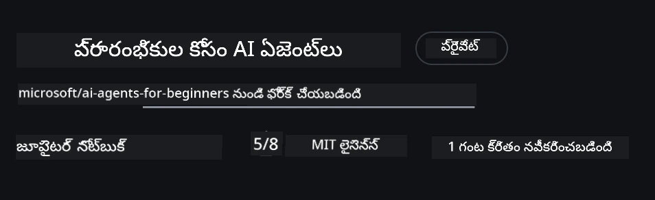
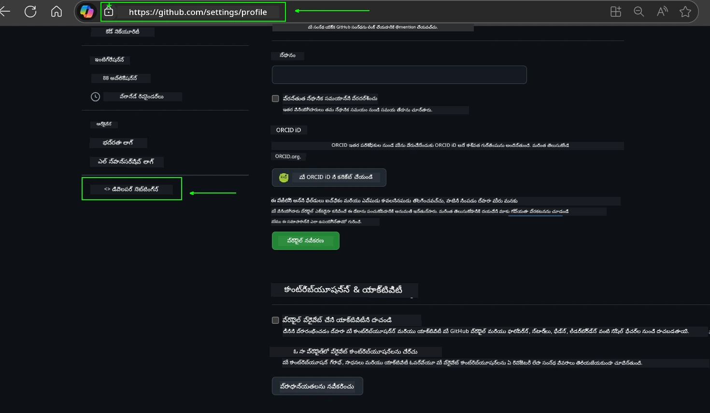
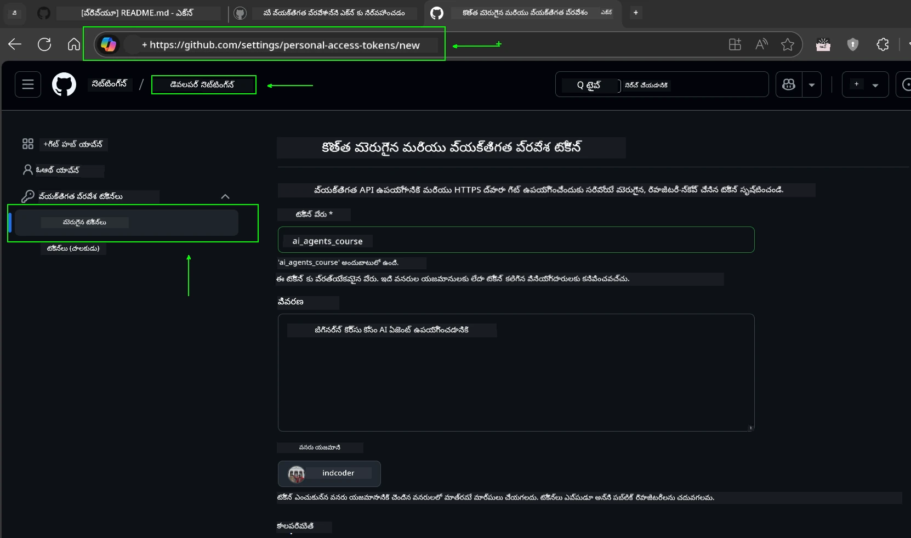
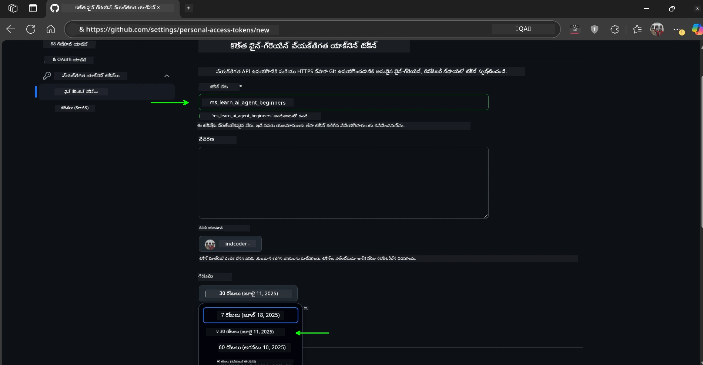
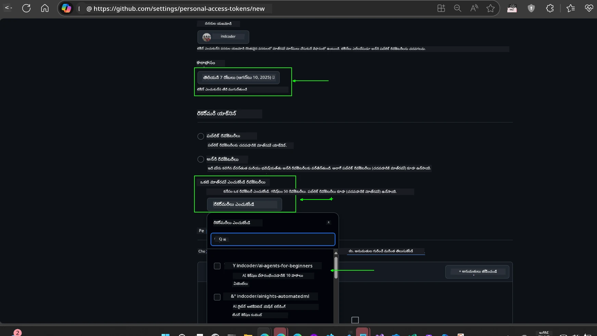
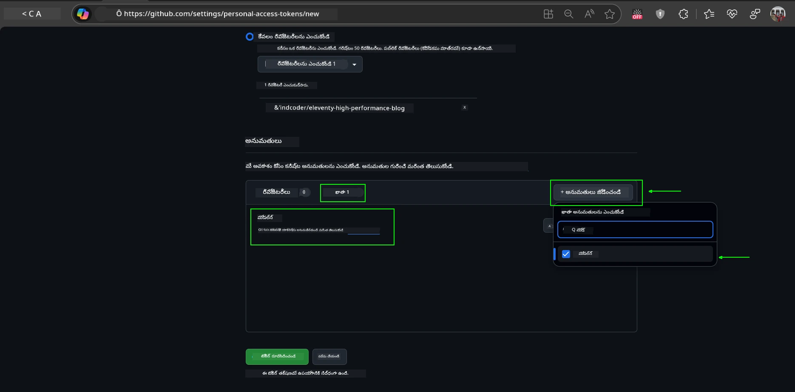
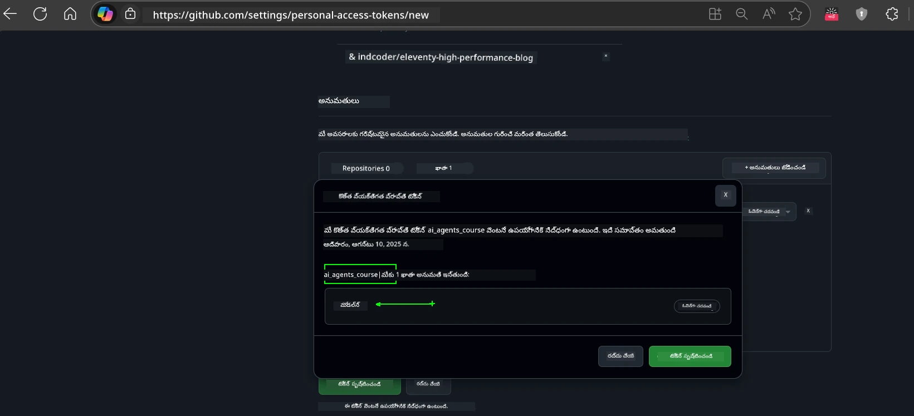
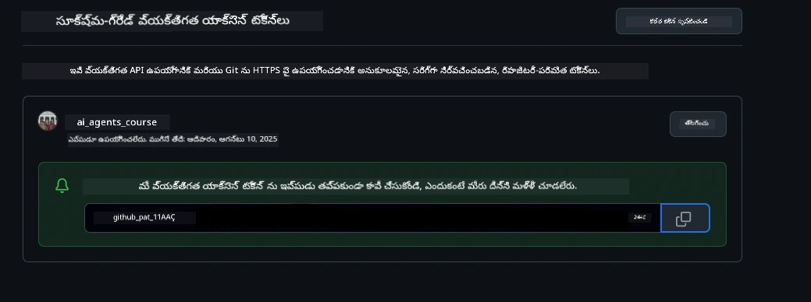
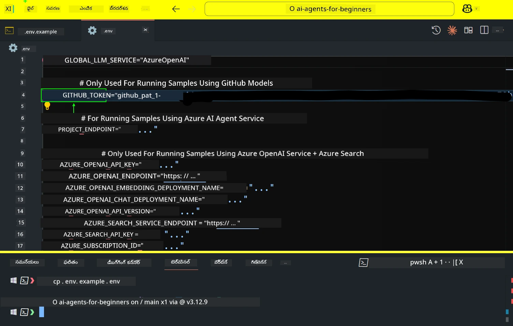
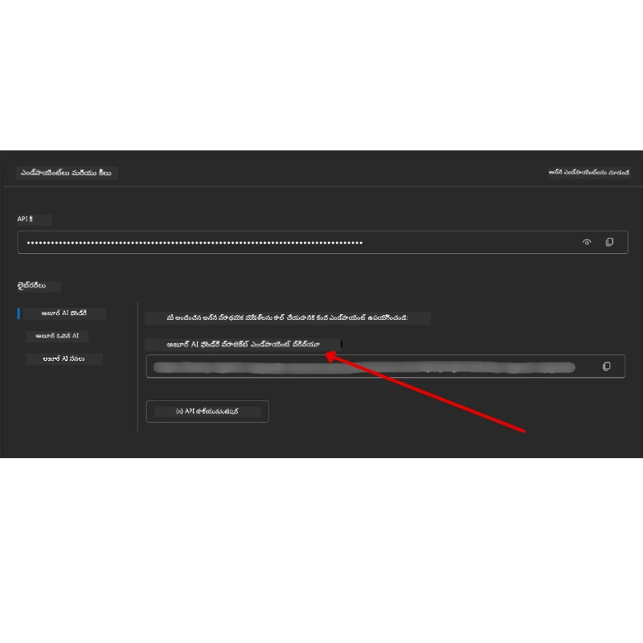

<!--
CO_OP_TRANSLATOR_METADATA:
{
  "original_hash": "63b1a8f6e840df15934935b728e569f0",
  "translation_date": "2025-12-03T17:24:14+00:00",
  "source_file": "00-course-setup/README.md",
  "language_code": "te"
}
-->
# కోర్సు సెటప్

## పరిచయం

ఈ పాఠంలో ఈ కోర్సు కోడ్ నమూనాలను ఎలా నడపాలో తెలుసుకుంటారు.

## ఇతర విద్యార్థులతో చేరండి మరియు సహాయం పొందండి

మీ రిపోను క్లోన్ చేయడం ప్రారంభించే ముందు, సెటప్, కోర్సు గురించి ఏవైనా ప్రశ్నలు లేదా ఇతర విద్యార్థులతో కనెక్ట్ కావడానికి [AI Agents For Beginners Discord ఛానల్](https://aka.ms/ai-agents/discord) లో చేరండి.

## ఈ రిపోను క్లోన్ చేయండి లేదా ఫోర్క్ చేయండి

ప్రారంభించడానికి, దయచేసి GitHub రిపోజిటరీని క్లోన్ చేయండి లేదా ఫోర్క్ చేయండి. ఇది మీకు కోర్సు మెటీరియల్ యొక్క మీ స్వంత వెర్షన్‌ను అందిస్తుంది, తద్వారా మీరు కోడ్‌ను నడపడం, పరీక్షించడం మరియు మార్చడం చేయవచ్చు!

ఇది <a href="https://github.com/microsoft/ai-agents-for-beginners/fork" target="_blank">రిపోను ఫోర్క్ చేయడానికి</a> లింక్‌పై క్లిక్ చేయడం ద్వారా చేయవచ్చు.

ఇప్పుడు ఈ కోర్సు యొక్క మీ స్వంత ఫోర్క్ వెర్షన్‌ను ఈ లింక్‌లో కలిగి ఉంటారు:



### షాలో క్లోన్ (వర్క్‌షాప్ / కోడ్‌స్పేస్‌ల కోసం సిఫార్సు చేయబడింది)

  >పూర్తి రిపోజిటరీ పెద్దదిగా ఉండవచ్చు (~3 GB) మీరు పూర్తి చరిత్ర మరియు అన్ని ఫైళ్లను డౌన్‌లోడ్ చేసినప్పుడు. మీరు కేవలం వర్క్‌షాప్‌లో పాల్గొనడం లేదా కొన్ని పాఠాల ఫోల్డర్లను మాత్రమే అవసరం ఉంటే, షాలో క్లోన్ (లేదా స్పార్స్ క్లోన్) చరిత్రను తగ్గించడం మరియు/లేదా బ్లోబ్స్‌ను స్కిప్ చేయడం ద్వారా ఎక్కువ డౌన్‌లోడ్‌ను నివారిస్తుంది.

#### త్వరితమైన షాలో క్లోన్ — కనిష్ట చరిత్ర, అన్ని ఫైళ్లు

క్రింది ఆదేశాలలో `<your-username>` ను మీ ఫోర్క్ URL (లేదా మీకు ఇష్టమైనది అయితే అప్‌స్ట్రీమ్ URL) తో మార్చండి.

కేవలం తాజా కమిట్ చరిత్రను క్లోన్ చేయడానికి (చిన్న డౌన్‌లోడ్):

```bash|powershell
git clone --depth 1 https://github.com/<your-username>/ai-agents-for-beginners.git
```

ఒక నిర్దిష్ట బ్రాంచ్‌ను క్లోన్ చేయడానికి:

```bash|powershell
git clone --depth 1 --branch <branch-name> https://github.com/<your-username>/ai-agents-for-beginners.git
```

#### భాగస్వామ్య (స్పార్స్) క్లోన్ — కనిష్ట బ్లోబ్స్ + కేవలం ఎంపిక చేసిన ఫోల్డర్లు

ఇది భాగస్వామ్య క్లోన్ మరియు స్పార్స్-చెకౌట్ ఉపయోగిస్తుంది (Git 2.25+ అవసరం మరియు భాగస్వామ్య క్లోన్ మద్దతుతో ఆధునిక Git సిఫార్సు చేయబడింది):

```bash|powershell
git clone --depth 1 --filter=blob:none --sparse https://github.com/<your-username>/ai-agents-for-beginners.git
```

రిపో ఫోల్డర్‌లోకి వెళ్లండి:

```bash|powershell
cd ai-agents-for-beginners
```

తర్వాత మీరు ఏ ఫోల్డర్లను కావాలో పేర్కొనండి (క్రింది ఉదాహరణ రెండు ఫోల్డర్లను చూపిస్తుంది):

```bash|powershell
git sparse-checkout set 00-course-setup 01-intro-to-ai-agents
```

క్లోన్ చేసి ఫైళ్లను ధృవీకరించిన తర్వాత, మీకు కేవలం ఫైళ్లు అవసరమైతే మరియు స్థలాన్ని ఖాళీ చేయాలనుకుంటే (గిట్ చరిత్ర లేదు), దయచేసి రిపోజిటరీ మెటాడేటాను తొలగించండి (💀 తిరిగి పొందలేని — మీరు అన్ని Git ఫంక్షనాలిటీని కోల్పోతారు: కమిట్లు, పుల్‌లు, పుష్‌లు లేదా చరిత్ర యాక్సెస్).

```bash
# జెడ్‌ష్/బాష్
rm -rf .git
```

```powershell
# పవర్‌షెల్
Remove-Item -Recurse -Force .git
```

#### GitHub కోడ్‌స్పేస్‌లను ఉపయోగించడం (స్థానిక పెద్ద డౌన్‌లోడ్‌లను నివారించడానికి సిఫార్సు చేయబడింది)

- [GitHub UI](https://github.com/codespaces) ద్వారా ఈ రిపో కోసం కొత్త కోడ్‌స్పేస్‌ను సృష్టించండి.  

- కొత్తగా సృష్టించిన కోడ్‌స్పేస్ యొక్క టెర్మినల్‌లో, మీకు అవసరమైన పాఠాల ఫోల్డర్లను మాత్రమే కోడ్‌స్పేస్ వర్క్‌స్పేస్‌లోకి తీసుకురావడానికి పై షాలో/స్పార్స్ క్లోన్ ఆదేశాలలో ఒకదాన్ని నడపండి.
- ఐచ్ఛికం: కోడ్‌స్పేస్‌లలో క్లోన్ చేసిన తర్వాత, అదనపు స్థలాన్ని తిరిగి పొందడానికి .git ను తొలగించండి (పై తొలగింపు ఆదేశాలను చూడండి).
- గమనిక: మీరు రిపోను నేరుగా కోడ్‌స్పేస్‌లలో తెరవడానికి ఇష్టపడితే (అదనపు క్లోన్ లేకుండా), కోడ్‌స్పేస్‌లు devcontainer వాతావరణాన్ని నిర్మిస్తాయి మరియు మీకు అవసరమైనదానికంటే ఎక్కువ ప్రొవిజన్ చేయవచ్చు. తాజా కోడ్‌స్పేస్‌లో షాలో కాపీని క్లోన్ చేయడం డిస్క్ వినియోగంపై మీకు మరింత నియంత్రణను ఇస్తుంది.

#### చిట్కాలు

- మీరు ఎడిట్/కమిట్ చేయాలనుకుంటే ఎల్లప్పుడూ మీ ఫోర్క్‌తో క్లోన్ URLని మార్చండి.
- మీరు తర్వాత మరింత చరిత్ర లేదా ఫైళ్లను అవసరమైతే, మీరు వాటిని ఫెచ్ చేయవచ్చు లేదా స్పార్స్-చెకౌట్‌ను అదనపు ఫోల్డర్లను చేర్చడానికి సర్దుబాటు చేయవచ్చు.

## కోడ్ నడపడం

ఈ కోర్సు AI ఏజెంట్లను నిర్మించడంలో ప్రాక్టికల్ అనుభవం పొందడానికి మీరు నడపగల Jupyter నోట్‌బుక్‌ల సిరీస్‌ను అందిస్తుంది.

కోడ్ నమూనాలు ఈ క్రింది వాటిని ఉపయోగిస్తాయి:

**GitHub ఖాతా అవసరం - ఉచితం**:

1) సెమాంటిక్ కర్నెల్ ఏజెంట్ ఫ్రేమ్‌వర్క్ + GitHub మోడల్స్ మార్కెట్‌ప్లేస్. (semantic-kernel.ipynb) అని లేబుల్ చేయబడింది
2) ఆటోజెన్ ఫ్రేమ్‌వర్క్ + GitHub మోడల్స్ మార్కెట్‌ప్లేస్. (autogen.ipynb) అని లేబుల్ చేయబడింది

**Azure సబ్‌స్క్రిప్షన్ అవసరం**:

3) Azure AI Foundry + Azure AI Agent Service. (azureaiagent.ipynb) అని లేబుల్ చేయబడింది

మూడు రకాల ఉదాహరణలను ప్రయత్నించమని మేము మీకు ప్రోత్సహిస్తున్నాము, ఏది మీకు బాగా పనిచేస్తుందో చూడటానికి.

మీరు ఎంచుకున్న ఎంపిక ఏదైనా, అది మీరు క్రింద అనుసరించాల్సిన సెటప్ దశలను నిర్ణయిస్తుంది:

## అవసరాలు

- Python 3.12+
  - **NOTE**: మీకు Python3.12 ఇన్‌స్టాల్ చేయబడకపోతే, దయచేసి దాన్ని ఇన్‌స్టాల్ చేయండి. ఆపై requirements.txt ఫైల్ నుండి సరైన వెర్షన్‌లు ఇన్‌స్టాల్ చేయడానికి python3.12 ఉపయోగించి మీ venvని సృష్టించండి.
  
    >ఉదాహరణ

    Python venv డైరెక్టరీని సృష్టించండి:

    ```bash|powershell
    python -m venv venv
    ```

    ఆపై venv వాతావరణాన్ని యాక్టివేట్ చేయండి:

    ```bash
    # జెడ్‌ష్/బాష్
    source venv/bin/activate
    ```
  
    ```dos
    # Command Prompt for Windows
    venv\Scripts\activate
    ```

- .NET 10+: .NET ఉపయోగించే నమూనా కోడ్‌ల కోసం, దయచేసి [.NET 10 SDK](https://dotnet.microsoft.com/download/dotnet/10.0) లేదా తరువాతి వెర్షన్‌ను ఇన్‌స్టాల్ చేయండి. ఆపై, మీరు ఇన్‌స్టాల్ చేసిన .NET SDK వెర్షన్‌ను తనిఖీ చేయండి:

    ```bash|powershell
    dotnet --list-sdks
    ```

- GitHub ఖాతా - GitHub మోడల్స్ మార్కెట్‌ప్లేస్ యాక్సెస్ కోసం
- Azure సబ్‌స్క్రిప్షన్ - Azure AI Foundry యాక్సెస్ కోసం
- Azure AI Foundry ఖాతా - Azure AI Agent Service యాక్సెస్ కోసం

ఈ రిపోజిటరీ రూట్‌లో కోడ్ నమూనాలను నడపడానికి అవసరమైన అన్ని Python ప్యాకేజీలను కలిగి ఉన్న `requirements.txt` ఫైల్‌ను మేము చేర్చాము.

మీరు ఈ క్రింది ఆదేశాన్ని రిపోజిటరీ రూట్‌లోని మీ టెర్మినల్‌లో నడిపి వాటిని ఇన్‌స్టాల్ చేయవచ్చు:

```bash|powershell
pip install -r requirements.txt
```

ఏదైనా సమస్యలు మరియు ఘర్షణలను నివారించడానికి Python వర్చువల్ ఎన్విరాన్‌మెంట్‌ను సృష్టించడం మేము సిఫార్సు చేస్తున్నాము.

## VSCode సెటప్ చేయండి

VSCodeలో మీరు సరైన Python వెర్షన్‌ను ఉపయోగిస్తున్నారని నిర్ధారించుకోండి.


## GitHub మోడల్స్ ఉపయోగించే నమూనాల కోసం సెటప్

### దశ 1: మీ GitHub పర్సనల్ యాక్సెస్ టోకెన్ (PAT) పొందండి

ఈ కోర్సు GitHub మోడల్స్ మార్కెట్‌ప్లేస్‌ను ఉపయోగిస్తుంది, ఇది మీరు AI ఏజెంట్లను నిర్మించడానికి ఉపయోగించే పెద్ద భాషా మోడల్స్ (LLMs) కు ఉచిత యాక్సెస్‌ను అందిస్తుంది.

GitHub మోడల్స్‌ను ఉపయోగించడానికి, మీరు [GitHub పర్సనల్ యాక్సెస్ టోకెన్](https://docs.github.com/en/authentication/keeping-your-account-and-data-secure/managing-your-personal-access-tokens) సృష్టించాలి.

మీ GitHub ఖాతాలోని <a href="https://github.com/settings/personal-access-tokens" target="_blank">పర్సనల్ యాక్సెస్ టోకెన్స్ సెట్టింగ్స్</a> కు వెళ్లడం ద్వారా ఇది చేయవచ్చు.

మీ టోకెన్ సృష్టించేటప్పుడు [లీస్ట్ ప్రివిలేజ్ ప్రిన్సిపల్](https://docs.github.com/en/get-started/learning-to-code/storing-your-secrets-safely) ను అనుసరించండి. అంటే ఈ కోర్సులోని కోడ్ నమూనాలను నడపడానికి టోకెన్‌కు అవసరమైన అనుమతులను మాత్రమే ఇవ్వాలి.

1. **డెవలపర్ సెట్టింగ్స్** కు వెళ్లి, ఎడమ వైపున `ఫైన్-గ్రెయిన్ టోకెన్స్` ఎంపికను ఎంచుకోండి.

   

   ఆపై `కొత్త టోకెన్ సృష్టించండి` ను ఎంచుకోండి.

   

2. మీ టోకెన్ యొక్క ఉద్దేశాన్ని ప్రతిబింబించే వివరణాత్మక పేరును నమోదు చేయండి, తద్వారా దానిని తర్వాత గుర్తించడం సులభం అవుతుంది.

    🔐 టోకెన్ వ్యవధి సిఫార్సు

    సిఫార్సు వ్యవధి: 30 రోజులు  
    మరింత సురక్షితమైన విధానానికి, మీరు 7 రోజుల వంటి చిన్న వ్యవధిని ఎంచుకోవచ్చు 🛡️  
    ఇది వ్యక్తిగత లక్ష్యాన్ని సెట్ చేయడానికి మరియు మీ అభ్యాస ఉత్సాహం ఉన్నప్పుడు కోర్సును పూర్తి చేయడానికి గొప్ప మార్గం 🚀.

    

3. టోకెన్ యొక్క స్కోప్‌ను ఈ రిపోజిటరీ యొక్క మీ ఫోర్క్‌కు పరిమితం చేయండి.

    

4. టోకెన్ యొక్క అనుమతులను పరిమితం చేయండి: **Permissions** కింద, **Account** ట్యాబ్‌ను క్లిక్ చేయండి, మరియు "+ Add permissions" బటన్‌ను క్లిక్ చేయండి. డ్రాప్‌డౌన్ కనిపిస్తుంది. దయచేసి **Models** కోసం శోధించి, బాక్స్‌ను టిక్ చేయండి.

    

5. టోకెన్ సృష్టించే ముందు అవసరమైన అనుమతులను ధృవీకరించండి. 

6. టోకెన్ సృష్టించే ముందు, దయచేసి టోకెన్‌ను పాస్‌వర్డ్ మేనేజర్ వాల్ట్ వంటి సురక్షిత ప్రదేశంలో నిల్వ చేయడానికి సిద్ధంగా ఉండండి, ఎందుకంటే మీరు దాన్ని సృష్టించిన తర్వాత మళ్లీ చూపబడదు. 

మీరు ఇప్పుడే సృష్టించిన కొత్త టోకెన్‌ను కాపీ చేయండి. ఇప్పుడు ఈ కోర్సులో చేర్చిన `.env` ఫైల్‌కు దీన్ని జోడిస్తారు.

### దశ 2: మీ `.env` ఫైల్‌ను సృష్టించండి

మీ టెర్మినల్‌లో క్రింది ఆదేశాన్ని నడిపి మీ `.env` ఫైల్‌ను సృష్టించండి.

```bash
# zsh/bash
cp .env.example .env
```

```powershell
# పవర్‌షెల్
Copy-Item .env.example .env
```

ఇది ఉదాహరణ ఫైల్‌ను కాపీ చేసి, `.env` ను మీ డైరెక్టరీలో సృష్టిస్తుంది, అక్కడ మీరు పర్యావరణ వేరియబుల్స్ కోసం విలువలను నింపుతారు.

మీ టోకెన్‌ను కాపీ చేసి, మీ ఇష్టమైన టెక్స్ట్ ఎడిటర్‌లో `.env` ఫైల్‌ను తెరవండి మరియు `GITHUB_TOKEN` ఫీల్డ్‌లో మీ టోకెన్‌ను పేస్ట్ చేయండి.



ఇప్పుడు మీరు ఈ కోర్సు యొక్క కోడ్ నమూనాలను నడపగలరు.

## Azure AI Foundry మరియు Azure AI Agent Service ఉపయోగించే నమూనాల కోసం సెటప్

### దశ 1: మీ Azure ప్రాజెక్ట్ ఎండ్‌పాయింట్‌ను పొందండి

ఇక్కడ కనుగొనబడిన దశలను అనుసరించండి: [హబ్ వనరుల అవలోకనం](https://learn.microsoft.com/azure/ai-foundry/concepts/ai-resources)

మీ ప్రాజెక్ట్‌ను సృష్టించిన తర్వాత, మీ ప్రాజెక్ట్ కోసం కనెక్షన్ స్ట్రింగ్‌ను పొందాలి.

ఇది Azure AI Foundry పోర్టల్‌లో మీ ప్రాజెక్ట్ యొక్క **Overview** పేజీకి వెళ్లడం ద్వారా చేయవచ్చు.



### దశ 2: మీ `.env` ఫైల్‌ను సృష్టించండి

మీ టెర్మినల్‌లో క్రింది ఆదేశాన్ని నడిపి మీ `.env` ఫైల్‌ను సృష్టించండి.

```bash
# జెడ్‌ష్/బాష్
cp .env.example .env
```

```powershell
# పవర్‌షెల్
Copy-Item .env.example .env
```

ఇది ఉదాహరణ ఫైల్‌ను కాపీ చేసి, `.env` ను మీ డైరెక్టరీలో సృష్టిస్తుంది, అక్కడ మీరు పర్యావరణ వేరియబుల్స్ కోసం విలువలను నింపుతారు.

మీ టోకెన్‌ను కాపీ చేసి, మీ ఇష్టమైన టెక్స్ట్ ఎడిటర్‌లో `.env` ఫైల్‌ను తెరవండి మరియు `PROJECT_ENDPOINT` ఫీల్డ్‌లో మీ టోకెన్‌ను పేస్ట్ చేయండి.

### దశ 3: Azureలో సైన్ ఇన్ చేయండి

భద్రతా ఉత్తమ పద్ధతిగా, మేము [కీలెస్ ఆథెంటికేషన్](https://learn.microsoft.com/azure/developer/ai/keyless-connections?tabs=csharp%2Cazure-cli?WT.mc_id=academic-105485-koreyst) ను ఉపయోగించి Microsoft Entra IDతో Azure OpenAIకి ఆథెంటికేట్ చేస్తాము.

తదుపరి, టెర్మినల్‌ను తెరవండి మరియు మీ Azure ఖాతాలో సైన్ ఇన్ చేయడానికి `az login --use-device-code` ను నడపండి.

మీరు లాగిన్ అయిన తర్వాత, టెర్మినల్‌లో మీ సబ్‌స్క్రిప్షన్‌ను ఎంచుకోండి.

## అదనపు పర్యావరణ వేరియబుల్స్ - Azure Search మరియు Azure OpenAI 

Agentic RAG పాఠం - పాఠం 5 - లో Azure Search మరియు Azure OpenAI ఉపయోగించే నమూనాలు ఉన్నాయి.

ఈ నమూనాలను నడపాలనుకుంటే, మీ `.env` ఫైల్‌లో క్రింది పర్యావరణ వేరియబుల్స్‌ను జోడించాలి:

### Overview పేజీ (ప్రాజెక్ట్)

- `AZURE_SUBSCRIPTION_ID` - మీ ప్రాజెక్ట్ యొక్క **Overview** పేజీలో **Project details** ను తనిఖీ చేయండి.

- `AZURE_AI_PROJECT_NAME` - మీ ప్రాజెక్ట్ యొక్క **Overview** పేజీపై పైభాగంలో చూడండి.

- `AZURE_OPENAI_SERVICE` - **Overview** పేజీలో **Azure OpenAI Service** కోసం **Included capabilities** ట్యాబ్‌లో ఇది కనుగొనండి.

### మేనేజ్‌మెంట్ సెంటర్

- `AZURE_OPENAI_RESOURCE_GROUP` - **Overview** పేజీలో **Project properties** కు వెళ్లండి.

- `GLOBAL_LLM_SERVICE` - **Connected resources** కింద, **Azure AI Services** కనెక్షన్ పేరును కనుగొనండి. జాబితాలో లేకపోతే, మీ రిసోర్స్ గ్రూప్‌లోని AI Services రిసోర్స్ పేరును **Azure పోర్టల్** లో తనిఖీ చేయండి.

### మోడల్స్ + ఎండ్‌పాయింట్స్ పేజీ

- `AZURE_OPENAI_EMBEDDING_DEPLOYMENT_NAME` - మీ ఎంబెడింగ్ మోడల్ (ఉదా: `text-embedding-ada-002`) ను ఎంచుకోండి మరియు మోడల్ వివరాల నుండి **Deployment name** ను గమనించండి.

- `AZURE_OPENAI_CHAT_DEPLOYMENT_NAME` - మీ చాట్ మోడల్ (ఉదా: `gpt
మీరు ఈ సెటప్‌ను అమలు చేయడంలో ఏవైనా సమస్యలు ఎదుర్కొంటే, మా <a href="https://discord.gg/kzRShWzttr" target="_blank">Azure AI Community Discord</a> లో చేరండి లేదా <a href="https://github.com/microsoft/ai-agents-for-beginners/issues?WT.mc_id=academic-105485-koreyst" target="_blank">ఒక సమస్యను సృష్టించండి</a>.

## తదుపరి పాఠం

ఈ కోర్సు కోసం కోడ్‌ను అమలు చేయడానికి మీరు ఇప్పుడు సిద్ధంగా ఉన్నారు. AI ఏజెంట్ల ప్రపంచం గురించి మరింత తెలుసుకోవడం ఆనందంగా ఉండాలి!

[AI ఏజెంట్లకు పరిచయం మరియు ఏజెంట్ ఉపయోగ కేసులు](../01-intro-to-ai-agents/README.md)

---

<!-- CO-OP TRANSLATOR DISCLAIMER START -->
**విమర్శ**:  
ఈ పత్రాన్ని AI అనువాద సేవ [Co-op Translator](https://github.com/Azure/co-op-translator) ఉపయోగించి అనువదించారు. మేము ఖచ్చితత్వానికి ప్రయత్నిస్తున్నప్పటికీ, ఆటోమేటెడ్ అనువాదాలలో తప్పులు లేదా అసమగ్రతలు ఉండవచ్చు. దయచేసి, దాని స్వదేశీ భాషలోని అసలు పత్రాన్ని అధికారం కలిగిన మూలంగా పరిగణించండి. కీలకమైన సమాచారం కోసం, ప్రొఫెషనల్ మానవ అనువాదాన్ని సిఫారసు చేస్తాము. ఈ అనువాదం ఉపయోగం వల్ల కలిగే ఏవైనా అపార్థాలు లేదా తప్పుదారులు కోసం మేము బాధ్యత వహించము.
<!-- CO-OP TRANSLATOR DISCLAIMER END -->