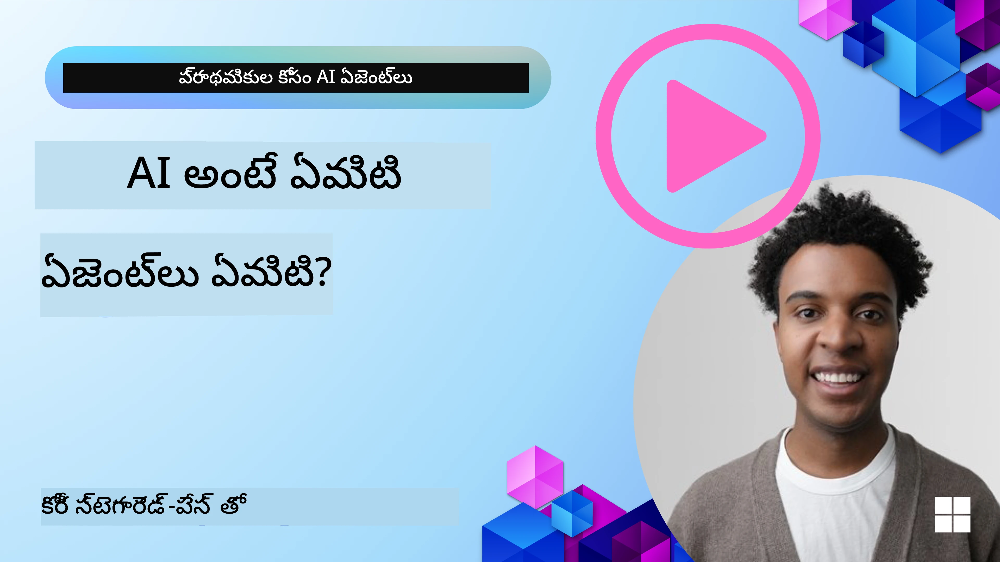
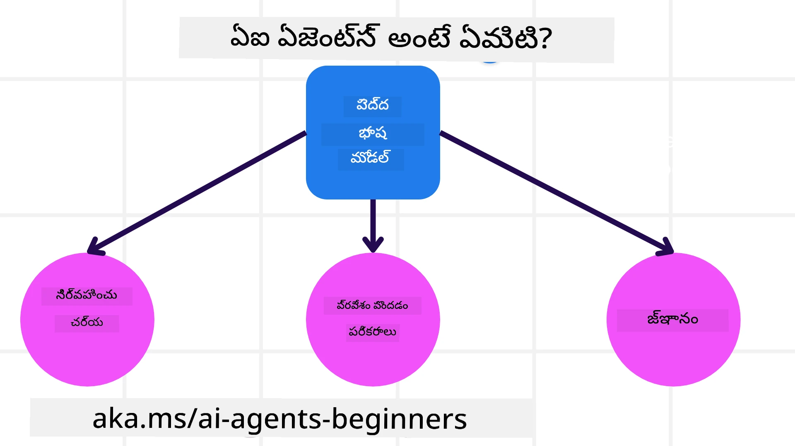
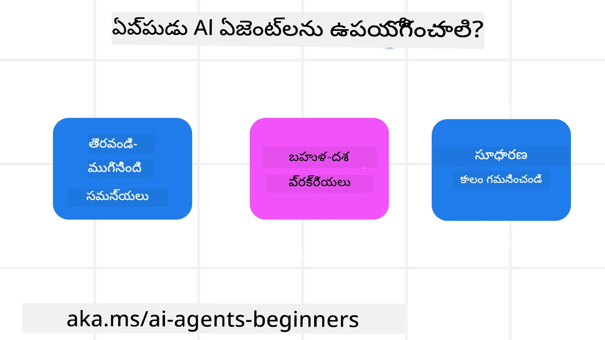

<!--
CO_OP_TRANSLATOR_METADATA:
{
  "original_hash": "cdd28bc00816d2773bb2b5968d782abc",
  "translation_date": "2025-12-03T16:34:50+00:00",
  "source_file": "01-intro-to-ai-agents/README.md",
  "language_code": "te"
}
-->

> _(ఈ పాఠానికి సంబంధించిన వీడియోను చూడటానికి పై చిత్రంపై క్లిక్ చేయండి)_

# AI ఏజెంట్లు మరియు వాటి వినియోగ సందర్భాలకు పరిచయం

"AI ఏజెంట్లు ప్రారంభికుల కోసం" కోర్సుకు స్వాగతం! ఈ కోర్సు AI ఏజెంట్లను నిర్మించడానికి అవసరమైన ప్రాథమిక జ్ఞానం మరియు అనువర్తిత నమూనాలను అందిస్తుంది.

మరింత నేర్చుకోవడానికి మరియు ఇతర AI ఏజెంట్ బిల్డర్లను కలవడానికి <a href="https://discord.gg/kzRShWzttr" target="_blank">Azure AI Discord Community</a>లో చేరండి. ఈ కోర్సు గురించి మీకు ఉన్న ప్రశ్నలను అడగండి.

ఈ కోర్సును ప్రారంభించడానికి, మొదట AI ఏజెంట్లు ఏమిటి మరియు వాటిని మనం నిర్మించే అనువర్తనాలు మరియు వర్క్‌ఫ్లోలలో ఎలా ఉపయోగించవచ్చో అర్థం చేసుకోవడం ప్రారంభిద్దాం.

## పరిచయం

ఈ పాఠం కవర్ చేస్తుంది:

- AI ఏజెంట్లు ఏమిటి? వాటి వివిధ రకాల ఏజెంట్లు ఏమిటి?
- ఏ వినియోగ సందర్భాలు AI ఏజెంట్లకు ఉత్తమమైనవి? అవి మనకు ఎలా సహాయపడతాయి?
- ఏజెంటిక్ సొల్యూషన్స్ డిజైన్ చేయడంలో కొన్ని ప్రాథమిక నిర్మాణ బ్లాక్స్ ఏమిటి?

## నేర్చుకునే లక్ష్యాలు
ఈ పాఠాన్ని పూర్తి చేసిన తర్వాత, మీరు:

- AI ఏజెంట్ కాన్సెప్ట్‌లను మరియు అవి ఇతర AI సొల్యూషన్‌లతో ఎలా భిన్నంగా ఉంటాయో అర్థం చేసుకోవచ్చు.
- AI ఏజెంట్లను సమర్థవంతంగా ఉపయోగించగలరు.
- వినియోగదారులు మరియు కస్టమర్ల కోసం ఉత్పాదకంగా ఏజెంటిక్ సొల్యూషన్‌లను డిజైన్ చేయగలరు.

## AI ఏజెంట్ల నిర్వచనం మరియు వాటి రకాలు

### AI ఏజెంట్లు ఏమిటి?

AI ఏజెంట్లు అనేవి **సిస్టమ్‌లు**, ఇవి **లార్జ్ లాంగ్వేజ్ మోడల్స్ (LLMs)**కు **పనులు చేయడానికి** వీలు కల్పిస్తాయి. ఇవి LLMsకు **టూల్స్** మరియు **నాలెడ్జ్** యాక్సెస్‌ను అందించడం ద్వారా వాటి సామర్థ్యాలను విస్తరించగలవు.

ఈ నిర్వచనాన్ని చిన్న భాగాలుగా విభజిద్దాం:

- **సిస్టమ్** - ఏజెంట్లను ఒకే భాగంగా కాకుండా అనేక భాగాల సిస్టమ్‌గా చూడటం ముఖ్యం. AI ఏజెంట్ యొక్క ప్రాథమిక భాగాలు:
  - **ఎన్విరాన్‌మెంట్** - AI ఏజెంట్ పనిచేస్తున్న నిర్వచిత స్థలం. ఉదాహరణకు, ట్రావెల్ బుకింగ్ AI ఏజెంట్ ఉంటే, ఆ ఎన్విరాన్‌మెంట్ ట్రావెల్ బుకింగ్ సిస్టమ్ అవుతుంది.
  - **సెన్సార్లు** - ఎన్విరాన్‌మెంట్ సమాచారం అందిస్తుంది. AI ఏజెంట్లు ఈ సమాచారాన్ని సేకరించి, అర్థం చేసుకోవడానికి సెన్సార్లను ఉపయోగిస్తాయి. ట్రావెల్ బుకింగ్ ఏజెంట్ ఉదాహరణలో, హోటల్ లభ్యత లేదా ఫ్లైట్ ధరల వంటి సమాచారం అందించవచ్చు.
  - **యాక్చ్యుయేటర్లు** - ఎన్విరాన్‌మెంట్ యొక్క ప్రస్తుత స్థితిని తెలుసుకున్న తర్వాత, ఏజెంట్ ఆ స్థితిని మార్చడానికి ఏ చర్య చేయాలో నిర్ణయిస్తుంది. ట్రావెల్ బుకింగ్ ఏజెంట్ కోసం, ఇది వినియోగదారుని కోసం ఒక గది బుక్ చేయడం కావచ్చు.

**లార్జ్ లాంగ్వేజ్ మోడల్స్** - LLMల సృష్టికి ముందు కూడా ఏజెంట్ల కాన్సెప్ట్‌లు ఉన్నాయి. LLMలతో AI ఏజెంట్లను నిర్మించడంలో ప్రయోజనం ఏమిటంటే, అవి మానవ భాషను మరియు డేటాను అర్థం చేసుకోవడంలో నైపుణ్యం కలిగి ఉంటాయి.

**పనులు చేయడం** - AI ఏజెంట్ సిస్టమ్‌ల వెలుపల, LLMలు కేవలం కంటెంట్ లేదా సమాచారాన్ని ఉత్పత్తి చేయడంలో పరిమితం అవుతాయి. కానీ AI ఏజెంట్ సిస్టమ్‌లలో, అవి వినియోగదారుని అభ్యర్థనను అర్థం చేసుకుని, అందుబాటులో ఉన్న టూల్స్‌ను ఉపయోగించి పనులను పూర్తి చేయగలవు.

**టూల్స్ యాక్సెస్** - LLMకు ఏ టూల్స్ యాక్సెస్ ఉంటాయో 1) అది పనిచేస్తున్న ఎన్విరాన్‌మెంట్ మరియు 2) AI ఏజెంట్ డెవలపర్ ద్వారా నిర్వచించబడుతుంది.

**మెమరీ+నాలెడ్జ్** - మెమరీ చర్చ సందర్భంలో తాత్కాలికంగా ఉండవచ్చు. దీని వెలుపల, AI ఏజెంట్లు ఇతర సిస్టమ్‌లు, సర్వీసులు, టూల్స్, మరియు ఇతర ఏజెంట్ల నుండి నాలెడ్జ్‌ను పొందగలవు.

### ఏజెంట్ల రకాలు

ఇప్పుడు AI ఏజెంట్ల సాధారణ నిర్వచనాన్ని అర్థం చేసుకున్నాం కాబట్టి, కొన్ని ప్రత్యేక ఏజెంట్ రకాల గురించి మరియు అవి ట్రావెల్ బుకింగ్ AI ఏజెంట్‌కు ఎలా వర్తిస్తాయో చూద్దాం.

| **ఏజెంట్ రకం**                | **వివరణ**                                                                                                                       | **ఉదాహరణ**                                                                                                                                                                                                                   |
| ----------------------------- | ------------------------------------------------------------------------------------------------------------------------------------- | ----------------------------------------------------------------------------------------------------------------------------------------------------------------------------------------------------------------------------- |
| **సింపుల్ రిఫ్లెక్స్ ఏజెంట్లు**      | ముందుగా నిర్వచించిన నియమాల ఆధారంగా తక్షణ చర్యలు చేస్తాయి.                                                                                  | ట్రావెల్ ఏజెంట్ ఇమెయిల్ కంటెంట్‌ను అర్థం చేసుకుని, ట్రావెల్ ఫిర్యాదులను కస్టమర్ సర్వీస్‌కు ఫార్వర్డ్ చేస్తుంది.                                                                                                                          |
| **మోడల్-బేస్డ్ రిఫ్లెక్స్ ఏజెంట్లు** | ప్రపంచ మోడల్ మరియు దానిలో మార్పుల ఆధారంగా చర్యలు చేస్తాయి.                                                              | ట్రావెల్ ఏజెంట్ చారిత్రక ధరల డేటా ఆధారంగా ధరల మార్పులను ప్రాధాన్యత ఇస్తుంది.                                                                                                             |
| **గోల్-బేస్డ్ ఏజెంట్లు**         | నిర్దిష్ట లక్ష్యాలను సాధించడానికి ప్రణాళికలు రూపొందిస్తాయి.                                  | ట్రావెల్ ఏజెంట్ ప్రస్తుత స్థానం నుండి గమ్యస్థానానికి ప్రయాణ ఏర్పాట్లను (కారు, పబ్లిక్ ట్రాన్సిట్, ఫ్లైట్స్) నిర్ణయించి బుక్ చేస్తుంది.                                                                                |
| **యుటిలిటీ-బేస్డ్ ఏజెంట్లు**      | ప్రాధాన్యతలను పరిగణనలోకి తీసుకుని, గోళాలను సాధించడానికి ట్రేడ్ ఆఫ్స్‌ను గణనీయంగా తూకం వేస్తాయి.                                               | ట్రావెల్ ఏజెంట్ ప్రయాణ బుకింగ్‌లో సౌలభ్యం మరియు ఖర్చు మధ్య యుటిలిటీని గరిష్టం చేస్తుంది.                                                                                                                                          |
| **లెర్నింగ్ ఏజెంట్లు**           | సమయం గడిచేకొద్దీ అభిప్రాయాలను పరిగణనలోకి తీసుకుని, చర్యలను సర్దుబాటు చేస్తాయి.                                                        | ట్రావెల్ ఏజెంట్ కస్టమర్ ఫీడ్‌బ్యాక్ ఆధారంగా భవిష్యత్ బుకింగ్‌లను మెరుగుపరుస్తుంది.                                                                                                               |
| **హైరార్కికల్ ఏజెంట్లు**       | పలు స్థాయిలలో ఏజెంట్లను కలిగి ఉంటాయి, ఎగువ స్థాయి ఏజెంట్లు పనులను ఉపపనులుగా విభజించి, దిగువ స్థాయి ఏజెంట్లు వాటిని పూర్తి చేస్తాయి. | ట్రావెల్ ఏజెంట్ ఒక ట్రిప్‌ను రద్దు చేయడానికి ఉపపనులుగా విభజించి (ఉదాహరణకు, ప్రత్యేక బుకింగ్‌లను రద్దు చేయడం) దిగువ స్థాయి ఏజెంట్ల ద్వారా పూర్తి చేయిస్తుంది.                                     |
| **మల్టీ-ఏజెంట్ సిస్టమ్స్ (MAS)** | ఏజెంట్లు స్వతంత్రంగా పనులను పూర్తి చేస్తాయి, either సహకారంగా లేదా పోటీగా.                                                           | సహకారం: పలు ఏజెంట్లు హోటల్స్, ఫ్లైట్స్, మరియు వినోదం వంటి ప్రత్యేక సేవలను బుక్ చేస్తాయి. పోటీ: పలు ఏజెంట్లు ఒక హోటల్ బుకింగ్ క్యాలెండర్‌ను నిర్వహించి, వినియోగదారులను హోటల్‌లో బుక్ చేయడానికి పోటీ పడతాయి. |

## AI ఏజెంట్లను ఎప్పుడు ఉపయోగించాలి

మునుపటి విభాగంలో, ట్రావెల్ ఏజెంట్ వినియోగ సందర్భాన్ని ఉపయోగించి, వివిధ రకాల ఏజెంట్లు ట్రావెల్ బుకింగ్ వివిధ సందర్భాల్లో ఎలా ఉపయోగించబడతాయో చూశాం. ఈ కోర్సు మొత్తం ఈ అనువర్తనాన్ని కొనసాగిస్తాము.

AI ఏజెంట్లు ఉత్తమంగా ఉపయోగించబడే వినియోగ సందర్భాలను చూద్దాం:

- **ఓపెన్-ఎండెడ్ సమస్యలు** - LLMకు పనిని పూర్తి చేయడానికి అవసరమైన దశలను నిర్ణయించడానికి అనుమతించడం, ఎందుకంటే ఇది ఎల్లప్పుడూ వర్క్‌ఫ్లోలో హార్డ్‌కోడ్ చేయడం సాధ్యం కాదు.
- **మల్టీ-స్టెప్ ప్రాసెస్‌లు** - AI ఏజెంట్ టూల్స్ లేదా సమాచారాన్ని పలు దశల్లో ఉపయోగించాల్సిన పనులు.
- **సమయం గడిచేకొద్దీ మెరుగుదల** - ఏజెంట్ తన ఎన్విరాన్‌మెంట్ లేదా వినియోగదారుల నుండి ఫీడ్‌బ్యాక్‌ను స్వీకరించి మెరుగైన సేవలను అందించగల పనులు.

AI ఏజెంట్లను ఉపయోగించడంపై మరిన్ని అంశాలను "ట్రస్ట్‌వర్ధీ AI ఏజెంట్లను నిర్మించడం" పాఠంలో కవర్ చేస్తాము.

## ఏజెంటిక్ సొల్యూషన్‌ల ప్రాథమికాలు

### ఏజెంట్ డెవలప్మెంట్

AI ఏజెంట్ సిస్టమ్‌ను డిజైన్ చేయడంలో మొదటి దశ టూల్స్, చర్యలు, మరియు ప్రవర్తనలను నిర్వచించడం. ఈ కోర్సులో, **Azure AI Agent Service**ను ఉపయోగించి మన ఏజెంట్లను నిర్వచించడంపై దృష్టి సారిస్తాము. ఇది ఈ క్రింది ఫీచర్లను అందిస్తుంది:

- OpenAI, Mistral, మరియు Llama వంటి ఓపెన్ మోడల్స్ ఎంపిక
- Tripadvisor వంటి ప్రొవైడర్ల ద్వారా లైసెన్స్ పొందిన డేటా వినియోగం
- OpenAPI 3.0 టూల్స్ వినియోగం

### ఏజెంటిక్ ప్యాటర్న్లు

LLMsతో కమ్యూనికేషన్ ప్రాంప్ట్‌ల ద్వారా జరుగుతుంది. AI ఏజెంట్ల సెమీ-ఆటోనమస్ స్వభావం కారణంగా, ఎన్విరాన్‌మెంట్‌లో మార్పు తర్వాత LLMను మాన్యువల్‌గా రీప్రాంప్ట్ చేయడం ఎల్లప్పుడూ అవసరం కాదు. **ఏజెంటిక్ ప్యాటర్న్లు** అనేవి LLMను పలు దశల్లో స్కేలబుల్‌గా ప్రాంప్ట్ చేయడానికి అనుమతిస్తాయి.

### ఏజెంటిక్ ఫ్రేమ్‌వర్క్‌లు

ఏజెంటిక్ ఫ్రేమ్‌వర్క్‌లు డెవలపర్లకు కోడ్ ద్వారా ఏజెంటిక్ ప్యాటర్న్లను అమలు చేయడానికి సహాయపడతాయి. ఇవి టెంప్లేట్లు, ప్లగిన్లు, మరియు టూల్స్‌ను అందించి, AI ఏజెంట్ సిస్టమ్‌లను మెరుగ్గా పరిశీలించడానికి మరియు ట్రబుల్‌షూట్ చేయడానికి వీలు కల్పిస్తాయి.

ఈ కోర్సులో, పరిశోధన ఆధారిత AutoGen ఫ్రేమ్‌వర్క్ మరియు ప్రొడక్షన్-రెడీ Agent ఫ్రేమ్‌వర్క్ (Semantic Kernel నుండి)ను అన్వేషిస్తాము.

## నమూనా కోడ్లు

- Python: [Agent Framework](./code_samples/01-python-agent-framework.ipynb)
- .NET: [Agent Framework](./code_samples/01-dotnet-agent-framework.md)

## AI ఏజెంట్ల గురించి మరిన్ని ప్రశ్నలున్నాయా?

[Azure AI Foundry Discord](https://aka.ms/ai-agents/discord)లో చేరి ఇతర విద్యార్థులను కలవండి, ఆఫీస్ అవర్స్‌లో పాల్గొనండి, మరియు మీ AI ఏజెంట్లకు సంబంధించిన ప్రశ్నలకు సమాధానాలు పొందండి.

## మునుపటి పాఠం

[కోర్సు సెటప్](../00-course-setup/README.md)

## తదుపరి పాఠం

[ఏజెంటిక్ ఫ్రేమ్‌వర్క్‌ల అన్వేషణ](../02-explore-agentic-frameworks/README.md)

---

<!-- CO-OP TRANSLATOR DISCLAIMER START -->
**విమర్శ**:  
ఈ పత్రాన్ని AI అనువాద సేవ [Co-op Translator](https://github.com/Azure/co-op-translator) ఉపయోగించి అనువదించబడింది. మేము ఖచ్చితత్వానికి ప్రయత్నిస్తున్నప్పటికీ, ఆటోమేటెడ్ అనువాదాలలో తప్పులు లేదా అసమానతలు ఉండవచ్చు. దాని స్వదేశీ భాషలోని అసలు పత్రాన్ని అధికారం కలిగిన మూలంగా పరిగణించాలి. కీలకమైన సమాచారం కోసం, ప్రొఫెషనల్ మానవ అనువాదాన్ని సిఫారసు చేస్తాము. ఈ అనువాదాన్ని ఉపయోగించడం వల్ల కలిగే ఏవైనా అపార్థాలు లేదా తప్పుదారులు కోసం మేము బాధ్యత వహించము.
<!-- CO-OP TRANSLATOR DISCLAIMER END -->