<!--
CO_OP_TRANSLATOR_METADATA:
{
  "original_hash": "5f351412e934f0833c8c821a0a60efaf",
  "translation_date": "2025-12-03T16:37:18+00:00",
  "source_file": "01-intro-to-ai-agents/code_samples/01-dotnet-agent-framework.md",
  "language_code": "te"
}
-->
# 🌍 మైక్రోసాఫ్ట్ ఏజెంట్ ఫ్రేమ్‌వర్క్ (.NET) తో AI ట్రావెల్ ఏజెంట్

## 📋 సన్నివేశం అవలోకనం

ఈ ఉదాహరణ మైక్రోసాఫ్ట్ ఏజెంట్ ఫ్రేమ్‌వర్క్ కోసం .NET ఉపయోగించి తెలివైన ప్రయాణ ప్రణాళిక ఏజెంట్‌ను ఎలా నిర్మించాలో చూపిస్తుంది. ఈ ఏజెంట్ ప్రపంచంలోని యాదృచ్ఛిక గమ్యస్థానాల కోసం వ్యక్తిగత డే-ట్రిప్ ప్రణాళికలను స్వయంచాలకంగా రూపొందించగలదు.

### ముఖ్యమైన సామర్థ్యాలు:

- 🎲 **యాదృచ్ఛిక గమ్యస్థానం ఎంపిక**: సెలవు ప్రదేశాలను ఎంచుకోవడానికి కస్టమ్ టూల్‌ను ఉపయోగిస్తుంది  
- 🗺️ **తెలివైన ట్రిప్ ప్లానింగ్**: ప్రతి రోజు కోసం వివరమైన ప్రణాళికలను సృష్టిస్తుంది  
- 🔄 **రియల్-టైమ్ స్ట్రీమింగ్**: తక్షణ మరియు స్ట్రీమింగ్ ప్రతిస్పందనలను మద్దతు ఇస్తుంది  
- 🛠️ **కస్టమ్ టూల్ ఇంటిగ్రేషన్**: ఏజెంట్ సామర్థ్యాలను విస్తరించడాన్ని ప్రదర్శిస్తుంది  

## 🔧 సాంకేతిక నిర్మాణం

### ప్రధాన సాంకేతికతలు

- **మైక్రోసాఫ్ట్ ఏజెంట్ ఫ్రేమ్‌వర్క్**: AI ఏజెంట్ అభివృద్ధి కోసం తాజా .NET అమలు  
- **GitHub మోడల్స్ ఇంటిగ్రేషన్**: GitHub యొక్క AI మోడల్ ఇన్‌ఫరెన్స్ సేవను ఉపయోగిస్తుంది  
- **OpenAI API అనుకూలత**: కస్టమ్ ఎండ్‌పాయింట్‌లతో OpenAI క్లయింట్ లైబ్రరీలను ఉపయోగిస్తుంది  
- **సురక్షిత కాన్ఫిగరేషన్**: పర్యావరణ ఆధారిత API కీ నిర్వహణ  

### ముఖ్యమైన భాగాలు

1. **AIAgent**: సంభాషణ ప్రవాహాన్ని నిర్వహించే ప్రధాన ఏజెంట్ ఆర్కెస్ట్రేటర్  
2. **కస్టమ్ టూల్స్**: ఏజెంట్‌కు అందుబాటులో ఉన్న `GetRandomDestination()` ఫంక్షన్  
3. **చాట్ క్లయింట్**: GitHub మోడల్స్ ఆధారిత సంభాషణ ఇంటర్‌ఫేస్  
4. **స్ట్రీమింగ్ మద్దతు**: రియల్-టైమ్ ప్రతిస్పందన ఉత్పత్తి సామర్థ్యాలు  

### ఇంటిగ్రేషన్ ప్యాటర్న్

```mermaid
graph LR
    A[వినియోగదారు అభ్యర్థన] --> B[ఏఐ ఏజెంట్]
    B --> C[గిట్‌హబ్ మోడల్స్ ఏపీఐ]
    B --> D[గెట్ రాండమ్ డెస్టినేషన్ టూల్]
    C --> E[ప్రయాణ ప్రణాళిక]
    D --> E
```


## 🚀 ప్రారంభం

### అవసరమైనవి

- [.NET 10 SDK](https://dotnet.microsoft.com/download/dotnet/10.0) లేదా అంతకంటే ఎక్కువ  
- [GitHub మోడల్స్ API యాక్సెస్ టోకెన్](https://docs.github.com/github-models/github-models-at-scale/using-your-own-api-keys-in-github-models)  

### అవసరమైన పర్యావరణ వేరియబుల్స్

```bash
# zsh/bash
export GH_TOKEN=<your_github_token>
export GH_ENDPOINT=https://models.github.ai/inference
export GH_MODEL_ID=openai/gpt-5-mini
```

```powershell
# పవర్‌షెల్
$env:GH_TOKEN = "<your_github_token>"
$env:GH_ENDPOINT = "https://models.github.ai/inference"
$env:GH_MODEL_ID = "openai/gpt-5-mini"
```

### నమూనా కోడ్

కోడ్ ఉదాహరణను నడపడానికి,

```bash
# జెడ్‌ష్/బాష్
chmod +x ./01-dotnet-agent-framework.cs
./01-dotnet-agent-framework.cs
```

లేదా dotnet CLI ఉపయోగించి:

```bash
dotnet run ./01-dotnet-agent-framework.cs
```

పూర్తి కోడ్ కోసం [`01-dotnet-agent-framework.cs`](../../../../01-intro-to-ai-agents/code_samples/01-dotnet-agent-framework.cs) చూడండి.

```csharp
#!/usr/bin/dotnet run

#:package Microsoft.Extensions.AI@9.*
#:package Microsoft.Agents.AI.OpenAI@1.*-*

using System.ClientModel;
using System.ComponentModel;

using Microsoft.Agents.AI;
using Microsoft.Extensions.AI;

using OpenAI;

// Tool Function: Random Destination Generator
// This static method will be available to the agent as a callable tool
// The [Description] attribute helps the AI understand when to use this function
// This demonstrates how to create custom tools for AI agents
[Description("Provides a random vacation destination.")]
static string GetRandomDestination()
{
    // List of popular vacation destinations around the world
    // The agent will randomly select from these options
    var destinations = new List<string>
    {
        "Paris, France",
        "Tokyo, Japan",
        "New York City, USA",
        "Sydney, Australia",
        "Rome, Italy",
        "Barcelona, Spain",
        "Cape Town, South Africa",
        "Rio de Janeiro, Brazil",
        "Bangkok, Thailand",
        "Vancouver, Canada"
    };

    // Generate random index and return selected destination
    // Uses System.Random for simple random selection
    var random = new Random();
    int index = random.Next(destinations.Count);
    return destinations[index];
}

// Extract configuration from environment variables
// Retrieve the GitHub Models API endpoint, defaults to https://models.github.ai/inference if not specified
// Retrieve the model ID, defaults to openai/gpt-5-mini if not specified
// Retrieve the GitHub token for authentication, throws exception if not specified
var github_endpoint = Environment.GetEnvironmentVariable("GH_ENDPOINT") ?? "https://models.github.ai/inference";
var github_model_id = Environment.GetEnvironmentVariable("GH_MODEL_ID") ?? "openai/gpt-5-mini";
var github_token = Environment.GetEnvironmentVariable("GH_TOKEN") ?? throw new InvalidOperationException("GH_TOKEN is not set.");

// Configure OpenAI Client Options
// Create configuration options to point to GitHub Models endpoint
// This redirects OpenAI client calls to GitHub's model inference service
var openAIOptions = new OpenAIClientOptions()
{
    Endpoint = new Uri(github_endpoint)
};

// Initialize OpenAI Client with GitHub Models Configuration
// Create OpenAI client using GitHub token for authentication
// Configure it to use GitHub Models endpoint instead of OpenAI directly
var openAIClient = new OpenAIClient(new ApiKeyCredential(github_token), openAIOptions);

// Create AI Agent with Travel Planning Capabilities
// Initialize OpenAI client, get chat client for specified model, and create AI agent
// Configure agent with travel planning instructions and random destination tool
// The agent can now plan trips using the GetRandomDestination function
AIAgent agent = openAIClient
    .GetChatClient(github_model_id)
    .CreateAIAgent(
        instructions: "You are a helpful AI Agent that can help plan vacations for customers at random destinations",
        tools: [AIFunctionFactory.Create(GetRandomDestination)]
    );

// Execute Agent: Plan a Day Trip
// Run the agent with streaming enabled for real-time response display
// Shows the agent's thinking and response as it generates the content
// Provides better user experience with immediate feedback
await foreach (var update in agent.RunStreamingAsync("Plan me a day trip"))
{
    await Task.Delay(10);
    Console.Write(update);
}
```

## 🎓 ముఖ్యమైన విషయాలు

1. **ఏజెంట్ ఆర్కిటెక్చర్**: మైక్రోసాఫ్ట్ ఏజెంట్ ఫ్రేమ్‌వర్క్ .NET లో AI ఏజెంట్లను నిర్మించడానికి శుభ్రమైన, టైప్-సేఫ్ విధానాన్ని అందిస్తుంది  
2. **టూల్ ఇంటిగ్రేషన్**: `[Description]` అట్రిబ్యూట్‌లతో అలంకరించిన ఫంక్షన్లు ఏజెంట్‌కు అందుబాటులో ఉన్న టూల్స్‌గా మారతాయి  
3. **కాన్ఫిగరేషన్ నిర్వహణ**: పర్యావరణ వేరియబుల్స్ మరియు సురక్షిత క్రెడెన్షియల్ నిర్వహణ .NET ఉత్తమ పద్ధతులను అనుసరిస్తుంది  
4. **OpenAI అనుకూలత**: GitHub మోడల్స్ ఇంటిగ్రేషన్ OpenAI-అనుకూల APIల ద్వారా సజావుగా పనిచేస్తుంది  

## 🔗 అదనపు వనరులు

- [మైక్రోసాఫ్ట్ ఏజెంట్ ఫ్రేమ్‌వర్క్ డాక్యుమెంటేషన్](https://learn.microsoft.com/agent-framework)  
- [GitHub మోడల్స్ మార్కెట్‌ప్లేస్](https://github.com/marketplace?type=models)  
- [Microsoft.Extensions.AI](https://learn.microsoft.com/dotnet/ai/microsoft-extensions-ai)  
- [.NET సింగిల్ ఫైల్ యాప్స్](https://devblogs.microsoft.com/dotnet/announcing-dotnet-run-app)  

---

<!-- CO-OP TRANSLATOR DISCLAIMER START -->
**విమర్శ**:  
ఈ పత్రాన్ని AI అనువాద సేవ [Co-op Translator](https://github.com/Azure/co-op-translator) ఉపయోగించి అనువదించారు. మేము ఖచ్చితత్వానికి ప్రయత్నిస్తున్నప్పటికీ, ఆటోమేటెడ్ అనువాదాలలో తప్పులు లేదా అసమానతలు ఉండవచ్చు. దయచేసి, మూల భాషలో ఉన్న అసలు పత్రాన్ని అధికారం కలిగిన మూలంగా పరిగణించండి. ముఖ్యమైన సమాచారం కోసం, ప్రొఫెషనల్ మానవ అనువాదాన్ని సిఫారసు చేస్తాము. ఈ అనువాదాన్ని ఉపయోగించడం వల్ల కలిగే ఏవైనా అపార్థాలు లేదా తప్పుదారులు కోసం మేము బాధ్యత వహించము.
<!-- CO-OP TRANSLATOR DISCLAIMER END -->