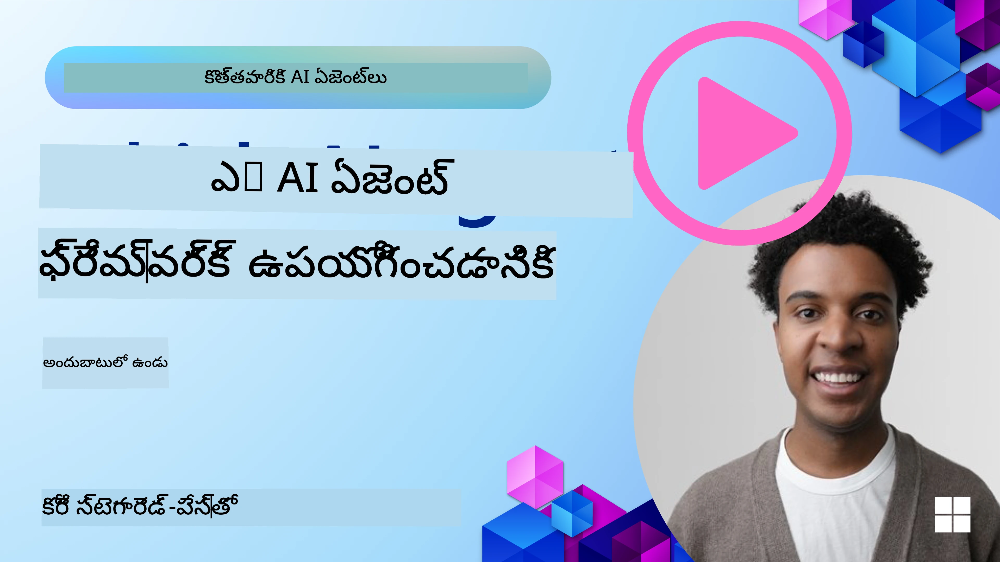

<!--
CO_OP_TRANSLATOR_METADATA:
{
  "original_hash": "7120197753abacc827b64ac2d5d6966f",
  "translation_date": "2025-12-03T16:59:29+00:00",
  "source_file": "02-explore-agentic-frameworks/README.md",
  "language_code": "te"
}
-->
[](https://youtu.be/ODwF-EZo_O8?si=1xoy_B9RNQfrYdF7)

> _(ఈ పాఠం వీడియోను చూడటానికి పై చిత్రాన్ని క్లిక్ చేయండి)_

# AI ఏజెంట్ ఫ్రేమ్‌వర్క్‌లను అన్వేషించండి

AI ఏజెంట్ ఫ్రేమ్‌వర్క్‌లు అనేవి AI ఏజెంట్‌లను సృష్టించడం, అమలు చేయడం, నిర్వహించడం సులభతరం చేయడానికి రూపొందించిన సాఫ్ట్‌వేర్ ప్లాట్‌ఫారమ్‌లు. ఈ ఫ్రేమ్‌వర్క్‌లు డెవలపర్‌లకు ముందే నిర్మించిన భాగాలు, సారాంశాలు, మరియు సాధనాలను అందిస్తాయి, ఇవి క్లిష్టమైన AI వ్యవస్థల అభివృద్ధిని సులభతరం చేస్తాయి.

ఈ ఫ్రేమ్‌వర్క్‌లు AI ఏజెంట్ అభివృద్ధిలో సాధారణ సవాళ్లకు ప్రామాణిక పద్ధతులను అందించడం ద్వారా డెవలపర్‌లు తమ అప్లికేషన్‌ల ప్రత్యేక అంశాలపై దృష్టి పెట్టడానికి సహాయపడతాయి. ఇవి AI వ్యవస్థల నిర్మాణంలో స్కేలబిలిటీ, యాక్సెసిబిలిటీ, మరియు సామర్థ్యాన్ని పెంచుతాయి.

## పరిచయం

ఈ పాఠంలో మీరు తెలుసుకుంటారు:

- AI ఏజెంట్ ఫ్రేమ్‌వర్క్‌లు ఏమిటి మరియు ఇవి డెవలపర్‌లకు ఏమి సాధించడానికి వీలు కల్పిస్తాయి?
- జట్లు వీటిని ఎలా ఉపయోగించి త్వరగా ప్రోటోటైప్ చేయగలవు, పునరావృతం చేయగలవు, మరియు తమ ఏజెంట్ సామర్థ్యాలను మెరుగుపరచగలవు?
- మైక్రోసాఫ్ట్ <a href="https://aka.ms/ai-agents/autogen" target="_blank">AutoGen</a>, <a href="https://aka.ms/ai-agents-beginners/semantic-kernel" target="_blank">Semantic Kernel</a>, మరియు <a href="https://aka.ms/ai-agents-beginners/ai-agent-service" target="_blank">Azure AI Agent Service</a> ద్వారా రూపొందించిన ఫ్రేమ్‌వర్క్‌లు మరియు సాధనాల మధ్య తేడాలు ఏమిటి?
- నా ప్రస్తుత Azure ఎకోసిస్టమ్ సాధనాలను నేరుగా సమీకరించగలనా, లేదా ప్రత్యేక పరిష్కారాలు అవసరమా?
- Azure AI ఏజెంట్ సర్వీస్ ఏమిటి మరియు ఇది నాకు ఎలా సహాయపడుతుంది?

## నేర్చుకునే లక్ష్యాలు

ఈ పాఠం మీకు ఈ విషయాలను అర్థం చేసుకోవడంలో సహాయపడుతుంది:

- AI అభివృద్ధిలో AI ఏజెంట్ ఫ్రేమ్‌వర్క్‌ల పాత్ర.
- తెలివైన ఏజెంట్‌లను నిర్మించడానికి AI ఏజెంట్ ఫ్రేమ్‌వర్క్‌లను ఎలా ఉపయోగించాలి.
- AI ఏజెంట్ ఫ్రేమ్‌వర్క్‌లు అందించే ముఖ్యమైన సామర్థ్యాలు.
- AutoGen, Semantic Kernel, మరియు Azure AI Agent Service మధ్య తేడాలు.

## AI ఏజెంట్ ఫ్రేమ్‌వర్క్‌లు ఏమిటి మరియు ఇవి డెవలపర్‌లకు ఏమి చేయడానికి వీలు కల్పిస్తాయి?

సాంప్రదాయ AI ఫ్రేమ్‌వర్క్‌లు మీ అప్లికేషన్‌లలో AIని సమీకరించడంలో మరియు ఈ అప్లికేషన్‌లను క్రింది విధాలుగా మెరుగుపరచడంలో సహాయపడతాయి:

- **వ్యక్తిగతీకరణ**: AI వినియోగదారుల ప్రవర్తన మరియు అభిరుచులను విశ్లేషించి వ్యక్తిగత సిఫార్సులు, కంటెంట్, మరియు అనుభవాలను అందించగలదు.  
ఉదాహరణ: Netflix వంటి స్ట్రీమింగ్ సేవలు AIని ఉపయోగించి వీక్షణ చరిత్ర ఆధారంగా సినిమాలు మరియు షోలను సూచిస్తాయి, తద్వారా వినియోగదారుల నిమగ్నత మరియు సంతృప్తిని పెంచుతాయి.  
- **ఆటోమేషన్ మరియు సామర్థ్యం**: AI పునరావృత పనులను ఆటోమేట్ చేయగలదు, వర్క్‌ఫ్లోలను సులభతరం చేయగలదు, మరియు ఆపరేషనల్ సామర్థ్యాన్ని మెరుగుపరచగలదు.  
ఉదాహరణ: కస్టమర్ సర్వీస్ అప్లికేషన్‌లు సాధారణ ప్రశ్నలను నిర్వహించడానికి AI-ఆధారిత చాట్‌బాట్‌లను ఉపయోగిస్తాయి, ప్రతిస్పందన సమయాలను తగ్గిస్తాయి మరియు క్లిష్టమైన సమస్యల కోసం మానవ ఏజెంట్‌లను ఉంచుతాయి.  
- **మెరుగైన వినియోగదారు అనుభవం**: AI వాయిస్ గుర్తింపు, సహజ భాషా ప్రాసెసింగ్, మరియు ప్రిడిక్టివ్ టెక్స్ట్ వంటి తెలివైన ఫీచర్‌లను అందించడం ద్వారా మొత్తం వినియోగదారు అనుభవాన్ని మెరుగుపరచగలదు.  
ఉదాహరణ: Siri మరియు Google Assistant వంటి వర్చువల్ అసిస్టెంట్‌లు AIని ఉపయోగించి వాయిస్ కమాండ్‌లను అర్థం చేసుకుని ప్రతిస్పందిస్తాయి, తద్వారా వినియోగదారులు తమ పరికరాలతో సులభంగా పరస్పర చర్యలు చేయగలుగుతారు.

### ఇది అంతా గొప్పగా అనిపిస్తుంది కదా, మరి AI ఏజెంట్ ఫ్రేమ్‌వర్క్ ఎందుకు అవసరం?

AI ఏజెంట్ ఫ్రేమ్‌వర్క్‌లు కేవలం AI ఫ్రేమ్‌వర్క్‌ల కంటే ఎక్కువగా ఉన్నాయి. ఇవి వినియోగదారులతో, ఇతర ఏజెంట్‌లతో, మరియు పర్యావరణంతో పరస్పర చర్యలు చేయగల తెలివైన ఏజెంట్‌లను సృష్టించడానికి రూపొందించబడ్డాయి. ఈ ఏజెంట్‌లు స్వతంత్ర ప్రవర్తనను ప్రదర్శించగలవు, నిర్ణయాలు తీసుకోగలవు, మరియు మారుతున్న పరిస్థితులకు అనుగుణంగా మారగలవు. AI ఏజెంట్ ఫ్రేమ్‌వర్క్‌లు అందించే కొన్ని ముఖ్యమైన సామర్థ్యాలను చూద్దాం:

- **ఏజెంట్ సహకారం మరియు సమన్వయం**: బహుళ AI ఏజెంట్‌లను సృష్టించడానికి వీలు కల్పిస్తుంది, ఇవి కలిసి పనిచేయగలవు, కమ్యూనికేట్ చేయగలవు, మరియు క్లిష్టమైన పనులను పరిష్కరించగలవు.  
- **పని ఆటోమేషన్ మరియు నిర్వహణ**: బహుళ-దశ వర్క్‌ఫ్లోలను ఆటోమేట్ చేయడానికి, పనులను కేటాయించడానికి, మరియు డైనమిక్ టాస్క్ మేనేజ్‌మెంట్ కోసం మెకానిజం అందిస్తుంది.  
- **సందర్భాత్మక అవగాహన మరియు అనుకూలత**: ఏజెంట్‌లకు సందర్భాన్ని అర్థం చేసుకోవడం, మారుతున్న పర్యావరణాలకు అనుగుణంగా మారడం, మరియు రియల్-టైమ్ సమాచారం ఆధారంగా నిర్ణయాలు తీసుకోవడం వంటి సామర్థ్యాలను అందిస్తుంది.

మొత్తం మీద, ఏజెంట్‌లు మీకు మరింత చేయడానికి, ఆటోమేషన్‌ను తదుపరి స్థాయికి తీసుకెళ్లడానికి, మరియు తమ పర్యావరణం నుండి నేర్చుకుని అనుకూలించగల తెలివైన వ్యవస్థలను సృష్టించడానికి వీలు కల్పిస్తాయి.

## ఏజెంట్ సామర్థ్యాలను త్వరగా ప్రోటోటైప్ చేయడం, పునరావృతం చేయడం, మరియు మెరుగుపరచడం ఎలా?

ఇది వేగంగా మారుతున్న రంగం, కానీ చాలా AI ఏజెంట్ ఫ్రేమ్‌వర్క్‌లలో సాధారణంగా కనిపించే కొన్ని అంశాలు ఉన్నాయి, ఇవి మాడ్యూల్ భాగాలు, సహకార సాధనాలు, మరియు రియల్-టైమ్ లెర్నింగ్. వీటిని వివరంగా చూద్దాం:

- **మాడ్యూల్ భాగాలను ఉపయోగించండి**: AI SDKలు ముందే నిర్మించిన భాగాలను అందిస్తాయి, ఉదా: AI మరియు మెమరీ కనెక్టర్లు, సహజ భాష లేదా కోడ్ ప్లగిన్‌లను ఉపయోగించి ఫంక్షన్ కాలింగ్, ప్రాంప్ట్ టెంప్లేట్‌లు, మరియు మరిన్ని.  
- **సహకార సాధనాలను ఉపయోగించండి**: ప్రత్యేక పాత్రలు మరియు పనులతో ఏజెంట్‌లను రూపొందించండి, వీటిని పరీక్షించి సహకార వర్క్‌ఫ్లోలను మెరుగుపరచండి.  
- **రియల్-టైమ్‌లో నేర్చుకోండి**: ఏజెంట్‌లు పరస్పర చర్యల నుండి నేర్చుకునే మరియు తమ ప్రవర్తనను డైనమిక్‌గా సర్దుబాటు చేసే ఫీడ్‌బ్యాక్ లూప్‌లను అమలు చేయండి.  

### మాడ్యూల్ భాగాలను ఉపయోగించండి

Microsoft Semantic Kernel మరియు LangChain వంటి SDKలు ముందే నిర్మించిన భాగాలను అందిస్తాయి, ఉదా: AI కనెక్టర్లు, ప్రాంప్ట్ టెంప్లేట్‌లు, మరియు మెమరీ నిర్వహణ.

**జట్లు వీటిని ఎలా ఉపయోగించగలవు**: జట్లు ఈ భాగాలను త్వరగా కలిపి, ప్రారంభం నుండి ప్రారంభించకుండా ఫంక్షనల్ ప్రోటోటైప్‌ను సృష్టించగలవు, తద్వారా వేగంగా ప్రయోగాలు మరియు పునరావృతం చేయగలవు.

**ఇది ఆచరణలో ఎలా పనిచేస్తుంది**: వినియోగదారు ఇన్‌పుట్ నుండి సమాచారం తీసుకోవడానికి ముందే నిర్మించిన పార్సర్‌ను ఉపయోగించవచ్చు, డేటాను నిల్వ చేయడానికి మరియు తిరిగి పొందడానికి మెమరీ మాడ్యూల్‌ను ఉపయోగించవచ్చు, మరియు వినియోగదారులతో పరస్పర చర్యల కోసం ప్రాంప్ట్ జనరేటర్‌ను ఉపయోగించవచ్చు, ఇవన్నీ ప్రారంభం నుండి నిర్మించాల్సిన అవసరం లేకుండా.

**ఉదాహరణ కోడ్**. Semantic Kernel Python మరియు .Netతో ముందే నిర్మించిన AI కనెక్టర్‌ను ఎలా ఉపయోగించవచ్చో ఉదాహరణలు చూద్దాం, ఇది మోడల్‌ను వినియోగదారు ఇన్‌పుట్‌కు ప్రతిస్పందించడానికి ఆటో-ఫంక్షన్ కాలింగ్‌ను ఉపయోగిస్తుంది:

``` python
# సెమాంటిక్ కర్నెల్ పైథాన్ ఉదాహరణ

import asyncio
from typing import Annotated

from semantic_kernel.connectors.ai import FunctionChoiceBehavior
from semantic_kernel.connectors.ai.open_ai import AzureChatCompletion, AzureChatPromptExecutionSettings
from semantic_kernel.contents import ChatHistory
from semantic_kernel.functions import kernel_function
from semantic_kernel.kernel import Kernel

# సంభాషణ యొక్క సందర్భాన్ని నిలుపుకోవడానికి చాట్ హిస్టరీ ఆబ్జెక్ట్‌ను నిర్వచించండి
chat_history = ChatHistory()
chat_history.add_user_message("I'd like to go to New York on January 1, 2025")


# ప్రయాణాన్ని బుక్ చేయడానికి ఫంక్షన్ కలిగిన నమూనా ప్లగిన్‌ను నిర్వచించండి
class BookTravelPlugin:
    """A Sample Book Travel Plugin"""

    @kernel_function(name="book_flight", description="Book travel given location and date")
    async def book_flight(
        self, date: Annotated[str, "The date of travel"], location: Annotated[str, "The location to travel to"]
    ) -> str:
        return f"Travel was booked to {location} on {date}"

# కర్నెల్‌ను సృష్టించండి
kernel = Kernel()

# కర్నెల్ ఆబ్జెక్ట్‌కు నమూనా ప్లగిన్‌ను జోడించండి
kernel.add_plugin(BookTravelPlugin(), plugin_name="book_travel")

# ఆజూర్ ఓపెన్‌ఏఐ ఎఐ కనెక్టర్‌ను నిర్వచించండి
chat_service = AzureChatCompletion(
    deployment_name="YOUR_DEPLOYMENT_NAME", 
    api_key="YOUR_API_KEY", 
    endpoint="https://<your-resource>.azure.openai.com/",
)

# ఆటో-ఫంక్షన్ కాలింగ్‌తో మోడల్‌ను ఆకృతీకరించడానికి అభ్యర్థన సెట్టింగులను నిర్వచించండి
request_settings = AzureChatPromptExecutionSettings(function_choice_behavior=FunctionChoiceBehavior.Auto())


async def main():
    # ఇచ్చిన చాట్ హిస్టరీ మరియు అభ్యర్థన సెట్టింగుల కోసం మోడల్‌కు అభ్యర్థన చేయండి
    # మోడల్ ఆహ్వానించడానికి అభ్యర్థించే నమూనాను కర్నెల్ కలిగి ఉంటుంది
    response = await chat_service.get_chat_message_content(
        chat_history=chat_history, settings=request_settings, kernel=kernel
    )
    assert response is not None

    """
    Note: In the auto function calling process, the model determines it can invoke the 
    `BookTravelPlugin` using the `book_flight` function, supplying the necessary arguments. 
    
    For example:

    "tool_calls": [
        {
            "id": "call_abc123",
            "type": "function",
            "function": {
                "name": "BookTravelPlugin-book_flight",
                "arguments": "{'location': 'New York', 'date': '2025-01-01'}"
            }
        }
    ]

    Since the location and date arguments are required (as defined by the kernel function), if the 
    model lacks either, it will prompt the user to provide them. For instance:

    User: Book me a flight to New York.
    Model: Sure, I'd love to help you book a flight. Could you please specify the date?
    User: I want to travel on January 1, 2025.
    Model: Your flight to New York on January 1, 2025, has been successfully booked. Safe travels!
    """

    print(f"`{response}`")
    # ఉదాహరణ ఎఐ మోడల్ ప్రతిస్పందన: `మీ జనవరి 1, 2025 న్యూయార్క్‌కు విమానం విజయవంతంగా బుక్ చేయబడింది. సురక్షిత ప్రయాణం! ✈️🗽`

    # మా చాట్ హిస్టరీ సందర్భానికి మోడల్ యొక్క ప్రతిస్పందనను జోడించండి
    chat_history.add_assistant_message(response.content)


if __name__ == "__main__":
    asyncio.run(main())
```
```csharp
// Semantic Kernel C# example

using Microsoft.SemanticKernel;
using Microsoft.SemanticKernel.ChatCompletion;
using System.ComponentModel;
using Microsoft.SemanticKernel.Connectors.AzureOpenAI;

ChatHistory chatHistory = [];
chatHistory.AddUserMessage("I'd like to go to New York on January 1, 2025");

var kernelBuilder = Kernel.CreateBuilder();
kernelBuilder.AddAzureOpenAIChatCompletion(
    deploymentName: "NAME_OF_YOUR_DEPLOYMENT",
    apiKey: "YOUR_API_KEY",
    endpoint: "YOUR_AZURE_ENDPOINT"
);
kernelBuilder.Plugins.AddFromType<BookTravelPlugin>("BookTravel"); 
var kernel = kernelBuilder.Build();

var settings = new AzureOpenAIPromptExecutionSettings()
{
    FunctionChoiceBehavior = FunctionChoiceBehavior.Auto()
};

var chatCompletion = kernel.GetRequiredService<IChatCompletionService>();

var response = await chatCompletion.GetChatMessageContentAsync(chatHistory, settings, kernel);

/*
Behind the scenes, the model recognizes the tool to call, what arguments it already has (location) and (date)
{

"tool_calls": [
    {
        "id": "call_abc123",
        "type": "function",
        "function": {
            "name": "BookTravelPlugin-book_flight",
            "arguments": "{'location': 'New York', 'date': '2025-01-01'}"
        }
    }
]
*/

Console.WriteLine(response.Content);
chatHistory.AddMessage(response!.Role, response!.Content!);

// Example AI Model Response: Your flight to New York on January 1, 2025, has been successfully booked. Safe travels! ✈️🗽

// Define a plugin that contains the function to book travel
public class BookTravelPlugin
{
    [KernelFunction("book_flight")]
    [Description("Book travel given location and date")]
    public async Task<string> BookFlight(DateTime date, string location)
    {
        return await Task.FromResult( $"Travel was booked to {location} on {date}");
    }
}
```

ఈ ఉదాహరణలో మీరు చూడగలిగేది, వినియోగదారు ఇన్‌పుట్ నుండి ముఖ్యమైన సమాచారాన్ని తీసుకోవడానికి ముందే నిర్మించిన పార్సర్‌ను ఎలా ఉపయోగించవచ్చో, ఉదా: ఫ్లైట్ బుకింగ్ అభ్యర్థనలో మూలం, గమ్యం, మరియు తేదీ. ఈ మాడ్యూలర్ విధానం మీకు ఉన్నత స్థాయి లాజిక్‌పై దృష్టి పెట్టడానికి వీలు కల్పిస్తుంది.

### సహకార సాధనాలను ఉపయోగించండి

CrewAI, Microsoft AutoGen, మరియు Semantic Kernel వంటి ఫ్రేమ్‌వర్క్‌లు బహుళ ఏజెంట్‌ల సృష్టిని సులభతరం చేస్తాయి.

**జట్లు వీటిని ఎలా ఉపయోగించగలవు**: జట్లు ప్రత్యేక పాత్రలు మరియు పనులతో ఏజెంట్‌లను రూపొందించవచ్చు, వీటిని పరీక్షించి సహకార వర్క్‌ఫ్లోలను మెరుగుపరచవచ్చు, మరియు మొత్తం వ్యవస్థ సామర్థ్యాన్ని మెరుగుపరచవచ్చు.

**ఇది ఆచరణలో ఎలా పనిచేస్తుంది**: మీరు డేటా రిట్రీవల్, విశ్లేషణ, లేదా నిర్ణయాలు తీసుకోవడం వంటి ప్రత్యేక ఫంక్షన్‌లతో ఏజెంట్‌ల బృందాన్ని సృష్టించవచ్చు. ఈ ఏజెంట్‌లు సమాచారాన్ని కమ్యూనికేట్ చేసి పంచుకోవచ్చు, వినియోగదారు ప్రశ్నకు సమాధానం ఇవ్వడం లేదా పనిని పూర్తి చేయడం వంటి సాధారణ లక్ష్యాన్ని సాధించడానికి.

**ఉదాహరణ కోడ్ (AutoGen)**:

```python
# ఏజెంట్లను సృష్టించడం, తరువాత వారు కలిసి పని చేయగల రౌండ్ రాబిన్ షెడ్యూల్‌ను సృష్టించడం, ఈ సందర్భంలో క్రమంలో

# డేటా రిట్రీవల్ ఏజెంట్
# డేటా విశ్లేషణ ఏజెంట్
# నిర్ణయం తీసుకునే ఏజెంట్

agent_retrieve = AssistantAgent(
    name="dataretrieval",
    model_client=model_client,
    tools=[retrieve_tool],
    system_message="Use tools to solve tasks."
)

agent_analyze = AssistantAgent(
    name="dataanalysis",
    model_client=model_client,
    tools=[analyze_tool],
    system_message="Use tools to solve tasks."
)

# వినియోగదారు "APPROVE" అని చెప్పినప్పుడు సంభాషణ ముగుస్తుంది
termination = TextMentionTermination("APPROVE")

user_proxy = UserProxyAgent("user_proxy", input_func=input)

team = RoundRobinGroupChat([agent_retrieve, agent_analyze, user_proxy], termination_condition=termination)

stream = team.run_stream(task="Analyze data", max_turns=10)
# స్క్రిప్ట్‌లో నడుపుతున్నప్పుడు asyncio.run(...) ఉపయోగించండి.
await Console(stream)
```

మునుపటి కోడ్‌లో మీరు చూడగలిగేది, డేటా విశ్లేషణ వంటి పనిని కలిగి ఉన్న బహుళ ఏజెంట్‌లు కలిసి పనిచేసే విధానం. ప్రతి ఏజెంట్ ఒక ప్రత్యేక ఫంక్షన్‌ను నిర్వహిస్తుంది, మరియు పనిని సమన్వయం చేయడం ద్వారా కోరుకున్న ఫలితాన్ని సాధించబడుతుంది. ప్రత్యేక పాత్రలతో ప్రత్యేక ఏజెంట్‌లను సృష్టించడం ద్వారా, మీరు పనుల సామర్థ్యాన్ని మరియు పనితీరును మెరుగుపరచవచ్చు.

### రియల్-టైమ్‌లో నేర్చుకోండి

అధునాతన ఫ్రేమ్‌వర్క్‌లు రియల్-టైమ్ సందర్భ అవగాహన మరియు అనుకూలత కోసం సామర్థ్యాలను అందిస్తాయి.

**జట్లు వీటిని ఎలా ఉపయోగించగలవు**: జట్లు పరస్పర చర్యల నుండి నేర్చుకునే మరియు తమ ప్రవర్తనను డైనమిక్‌గా సర్దుబాటు చేసే ఫీడ్‌బ్యాక్ లూప్‌లను అమలు చేయగలవు, తద్వారా సామర్థ్యాల నిరంతర మెరుగుదల మరియు సవరణ సాధ్యమవుతుంది.

**ఇది ఆచరణలో ఎలా పనిచేస్తుంది**: ఏజెంట్‌లు వినియోగదారు ఫీడ్‌బ్యాక్, పర్యావరణ డేటా, మరియు పనుల ఫలితాలను విశ్లేషించి తమ జ్ఞానాన్ని నవీకరించగలవు, నిర్ణయాల ఆల్గోరిథమ్‌లను సర్దుబాటు చేయగలవు, మరియు సమయానుకూలంగా పనితీరును మెరుగుపరచగలవు. ఈ పునరావృత లెర్నింగ్ ప్రక్రియ ఏజెంట్‌లను మారుతున్న పరిస్థితులకు మరియు వినియోగదారు అభిరుచులకు అనుగుణంగా మార్చడానికి వీలు కల్పిస్తుంది, మొత్తం వ్యవస్థ సామర్థ్యాన్ని మెరుగుపరుస్తుంది.

## AutoGen, Semantic Kernel మరియు Azure AI Agent Service మధ్య తేడాలు ఏమిటి?

ఈ ఫ్రేమ్‌వర్క్‌లను అనేక మార్గాల్లో పోల్చవచ్చు, కానీ వాటి రూపకల్పన, సామర్థ్యాలు, మరియు లక్ష్య వినియోగ సందర్భాల పరంగా కొన్ని ముఖ్యమైన తేడాలను చూద్దాం:

## AutoGen

AutoGen అనేది Microsoft Research యొక్క AI Frontiers Lab ద్వారా అభివృద్ధి చేయబడిన ఓపెన్-సోర్స్ ఫ్రేమ్‌వర్క్. ఇది ఈవెంట్-డ్రైవన్, డిస్ట్రిబ్యూటెడ్ *ఏజెంటిక్* అప్లికేషన్‌లపై దృష్టి పెడుతుంది, బహుళ LLMs మరియు SLMs, సాధనాలు, మరియు అధునాతన బహుళ-ఏజెంట్ డిజైన్ నమూనాలను సాధ్యమవుతుంది.

AutoGen ఏజెంట్‌ల ప్రధాన భావన చుట్టూ నిర్మించబడింది, ఇవి స్వతంత్ర సంస్థలు, ఇవి తమ పర్యావరణాన్ని గ్రహించగలవు, నిర్ణయాలు తీసుకోగలవు, మరియు నిర్దిష్ట లక్ష్యాలను సాధించడానికి చర్యలు తీసుకోగలవు. ఏజెంట్‌లు అసింక్రోనస్ సందేశాల ద్వారా కమ్యూనికేట్ చేస్తాయి, ఇవి స్వతంత్రంగా మరియు సమాంతరంగా పనిచేయడానికి వీలు కల్పిస్తాయి, వ్యవస్థ స్కేలబిలిటీ మరియు ప్రతిస్పందనను మెరుగుపరుస్తాయి.

<a href="https://en.wikipedia.org/wiki/Actor_model" target="_blank">ఏజెంట్‌లు యాక్టర్ మోడల్ ఆధారంగా ఉంటాయి</a>. Wikipedia ప్రకారం, యాక్టర్ అనేది _సమాంతర లెక్కింపుల ప్రాథమిక నిర్మాణ బ్లాక్. ఇది అందుకున్న సందేశానికి ప్రతిస్పందనగా స్థానిక నిర్ణయాలు తీసుకోవచ్చు, మరిన్ని యాక్టర్‌లను సృష్టించవచ్చు, మరిన్ని సందేశాలను పంపవచ్చు, మరియు తదుపరి అందుకున్న సందేశానికి ఎలా ప్రతిస్పందించాలో నిర్ణయించవచ్చు_.

**వినియోగ సందర్భాలు**: కోడ్ జనరేషన్ ఆటోమేషన్, డేటా విశ్లేషణ పనులు, మరియు ప్రణాళిక మరియు పరిశోధన ఫంక్షన్‌ల కోసం కస్టమ్ ఏజెంట్‌లను నిర్మించడం.

AutoGen యొక్క కొన్ని ముఖ్యమైన కోర్ కాన్సెప్ట్‌లు:

- **ఏజెంట్‌లు**. ఏజెంట్ అనేది ఒక సాఫ్ట్‌వేర్ ఎంటిటీ:
  - **సందేశాల ద్వారా కమ్యూనికేట్ చేస్తుంది**, ఈ సందేశాలు సమకాలీన లేదా అసింక్రోనస్ కావచ్చు.
  - **తన స్వంత స్థితిని నిర్వహిస్తుంది**, incoming సందేశాల ద్వారా ఇది మార్చబడుతుంది.
  - **చర్యలు చేస్తుంది** అందుకున్న సందేశాలకు లేదా తన స్థితిలో మార్పులకు ప్రతిస్పందనగా.
ఈ విషయాలను `SummarizedAzureDocs` అనే మెమరీ కలెక్షన్‌లో నిల్వ చేస్తారు. ఇది చాలా సరళమైన ఉదాహరణ, కానీ మీరు LLM ఉపయోగించడానికి సమాచారం మెమరీలో ఎలా నిల్వ చేయాలో చూడవచ్చు.

ఇప్పుడు Semantic Kernel ఫ్రేమ్‌వర్క్ యొక్క ప్రాథమిక విషయాలు చూశాం, మరి Agent Framework గురించి ఏమిటి?

## Azure AI Agent Service

Azure AI Agent Service అనేది Microsoft Ignite 2024లో పరిచయం చేసిన తాజా సేవ. ఇది Llama 3, Mistral, Cohere వంటి ఓపెన్ సోర్స్ LLMలను నేరుగా కాల్ చేయగలిగే మరింత అనువైన మోడళ్లతో AI ఏజెంట్లను అభివృద్ధి చేయడానికి మరియు అమలు చేయడానికి అనుమతిస్తుంది.

Azure AI Agent Service బలమైన ఎంటర్‌ప్రైజ్ భద్రతా మెకానిజం మరియు డేటా నిల్వ పద్ధతులను అందిస్తుంది, ఇది ఎంటర్‌ప్రైజ్ అప్లికేషన్లకు అనుకూలంగా ఉంటుంది.

ఇది AutoGen మరియు Semantic Kernel వంటి మల్టీ-ఏజెంట్ ఆర్కెస్ట్రేషన్ ఫ్రేమ్‌వర్క్‌లతో సులభంగా పనిచేస్తుంది.

ఈ సేవ ప్రస్తుతం Public Previewలో ఉంది మరియు ఏజెంట్లను నిర్మించడానికి Python మరియు C# ను మద్దతు ఇస్తుంది.

Semantic Kernel Python ఉపయోగించి, మనం యూజర్-డిఫైన్ చేసిన ప్లగిన్‌తో Azure AI Agent సృష్టించవచ్చు:

```python
import asyncio
from typing import Annotated

from azure.identity.aio import DefaultAzureCredential

from semantic_kernel.agents import AzureAIAgent, AzureAIAgentSettings, AzureAIAgentThread
from semantic_kernel.contents import ChatMessageContent
from semantic_kernel.contents import AuthorRole
from semantic_kernel.functions import kernel_function


# నమూనా కోసం ఒక నమూనా ప్లగిన్‌ను నిర్వచించండి
class MenuPlugin:
    """A sample Menu Plugin used for the concept sample."""

    @kernel_function(description="Provides a list of specials from the menu.")
    def get_specials(self) -> Annotated[str, "Returns the specials from the menu."]:
        return """
        Special Soup: Clam Chowder
        Special Salad: Cobb Salad
        Special Drink: Chai Tea
        """

    @kernel_function(description="Provides the price of the requested menu item.")
    def get_item_price(
        self, menu_item: Annotated[str, "The name of the menu item."]
    ) -> Annotated[str, "Returns the price of the menu item."]:
        return "$9.99"


async def main() -> None:
    ai_agent_settings = AzureAIAgentSettings.create()

    async with (
        DefaultAzureCredential() as creds,
        AzureAIAgent.create_client(
            credential=creds,
            conn_str=ai_agent_settings.project_connection_string.get_secret_value(),
        ) as client,
    ):
        # ఏజెంట్ నిర్వచనాన్ని సృష్టించండి
        agent_definition = await client.agents.create_agent(
            model=ai_agent_settings.model_deployment_name,
            name="Host",
            instructions="Answer questions about the menu.",
        )

        # నిర్వచించిన క్లయింట్ మరియు ఏజెంట్ నిర్వచనాన్ని ఉపయోగించి AzureAI ఏజెంట్‌ను సృష్టించండి
        agent = AzureAIAgent(
            client=client,
            definition=agent_definition,
            plugins=[MenuPlugin()],
        )

        # సంభాషణను నిలుపుకోవడానికి ఒక థ్రెడ్‌ను సృష్టించండి
        # థ్రెడ్ అందించబడని పక్షంలో, కొత్త థ్రెడ్‌ను
        # ప్రారంభ ప్రతిస్పందనతో సృష్టించి తిరిగి ఇస్తారు
        thread: AzureAIAgentThread | None = None

        user_inputs = [
            "Hello",
            "What is the special soup?",
            "How much does that cost?",
            "Thank you",
        ]

        try:
            for user_input in user_inputs:
                print(f"# User: '{user_input}'")
                # నిర్దిష్ట థ్రెడ్ కోసం ఏజెంట్‌ను ఆహ్వానించండి
                response = await agent.get_response(
                    messages=user_input,
                    thread_id=thread,
                )
                print(f"# {response.name}: {response.content}")
                thread = response.thread
        finally:
            await thread.delete() if thread else None
            await client.agents.delete_agent(agent.id)


if __name__ == "__main__":
    asyncio.run(main())
```

### ప్రధాన భావనలు

Azure AI Agent Service లో ఈ క్రింది ప్రధాన భావనలు ఉన్నాయి:

- **Agent**. Azure AI Agent Service, Azure AI Foundryతో ఇంటిగ్రేట్ అవుతుంది. AI Foundryలో, AI Agent ఒక "స్మార్ట్" మైక్రోసర్వీస్‌గా పనిచేస్తుంది, ఇది ప్రశ్నలకు సమాధానాలు ఇవ్వడం (RAG), చర్యలు చేయడం లేదా వర్క్‌ఫ్లోలను పూర్తిగా ఆటోమేట్ చేయడం వంటి పనులు చేయగలదు. ఇది జనరేటివ్ AI మోడళ్ల శక్తిని వాస్తవ ప్రపంచ డేటా సోర్స్‌లను యాక్సెస్ చేయడానికి మరియు ఇంటరాక్ట్ చేయడానికి అనుమతించే టూల్స్‌తో కలిపి సాధిస్తుంది. ఇక్కడ ఒక ఏజెంట్ ఉదాహరణ ఉంది:

    ```python
    agent = project_client.agents.create_agent(
        model="gpt-4o-mini",
        name="my-agent",
        instructions="You are helpful agent",
        tools=code_interpreter.definitions,
        tool_resources=code_interpreter.resources,
    )
    ```

    ఈ ఉదాహరణలో, `gpt-4o-mini` మోడల్‌తో, `my-agent` అనే పేరు మరియు `You are helpful agent` అనే సూచనలతో ఒక ఏజెంట్ సృష్టించబడింది. ఈ ఏజెంట్ కోడ్ ఇంటర్‌ప్రిటేషన్ పనులను చేయడానికి టూల్స్ మరియు రిసోర్సులతో అమర్చబడి ఉంటుంది.

- **Thread and messages**. థ్రెడ్ అనేది మరో ముఖ్యమైన భావన. ఇది ఏజెంట్ మరియు యూజర్ మధ్య సంభాషణ లేదా ఇంటరాక్షన్‌ను సూచిస్తుంది. థ్రెడ్‌లు సంభాషణ పురోగతిని ట్రాక్ చేయడానికి, కాంటెక్స్ట్ సమాచారాన్ని నిల్వ చేయడానికి మరియు ఇంటరాక్షన్ స్థితిని నిర్వహించడానికి ఉపయోగించవచ్చు. ఇక్కడ ఒక థ్రెడ్ ఉదాహరణ ఉంది:

    ```python
    thread = project_client.agents.create_thread()
    message = project_client.agents.create_message(
        thread_id=thread.id,
        role="user",
        content="Could you please create a bar chart for the operating profit using the following data and provide the file to me? Company A: $1.2 million, Company B: $2.5 million, Company C: $3.0 million, Company D: $1.8 million",
    )
    
    # Ask the agent to perform work on the thread
    run = project_client.agents.create_and_process_run(thread_id=thread.id, agent_id=agent.id)
    
    # Fetch and log all messages to see the agent's response
    messages = project_client.agents.list_messages(thread_id=thread.id)
    print(f"Messages: {messages}")
    ```

    పైన ఉన్న కోడ్‌లో, ఒక థ్రెడ్ సృష్టించబడింది. ఆ తర్వాత, థ్రెడ్‌కు ఒక మెసేజ్ పంపబడింది. `create_and_process_run` కాల్ చేయడం ద్వారా, ఏజెంట్‌ను థ్రెడ్‌పై పని చేయమని అడిగారు. చివరగా, మెసేజ్‌లు ఫెచ్ చేసి, ఏజెంట్ స్పందనను చూడటానికి లాగ్ చేయబడతాయి. ఈ మెసేజ్‌లు యూజర్ మరియు ఏజెంట్ మధ్య సంభాషణ పురోగతిని సూచిస్తాయి. మెసేజ్‌లు వేరువేరు రకాలుగా ఉండవచ్చు, ఉదాహరణకు టెక్స్ట్, ఇమేజ్ లేదా ఫైల్, అంటే ఏజెంట్ పని ఫలితంగా ఒక ఇమేజ్ లేదా టెక్స్ట్ స్పందన వచ్చింది. డెవలపర్‌గా, మీరు ఈ సమాచారాన్ని మరింత ప్రాసెస్ చేయడానికి లేదా యూజర్‌కు ప్రదర్శించడానికి ఉపయోగించవచ్చు.

- **ఇతర AI ఫ్రేమ్‌వర్క్‌లతో ఇంటిగ్రేట్ అవుతుంది**. Azure AI Agent Service, AutoGen మరియు Semantic Kernel వంటి ఇతర ఫ్రేమ్‌వర్క్‌లతో ఇంటరాక్ట్ చేయగలదు, అంటే మీరు మీ యాప్‌లో భాగాన్ని ఈ ఫ్రేమ్‌వర్క్‌లలో ఒకదానిలో నిర్మించవచ్చు మరియు ఉదాహరణకు ఏజెంట్ సర్వీస్‌ను ఆర్కెస్ట్రేటర్‌గా ఉపయోగించవచ్చు లేదా మీరు అన్ని పనులను ఏజెంట్ సర్వీస్‌లో నిర్మించవచ్చు.

**వినియోగ సందర్భాలు**: Azure AI Agent Service భద్రత, స్కేలబిలిటీ, మరియు అనువైన AI ఏజెంట్ అమలుకు అవసరమైన ఎంటర్‌ప్రైజ్ అప్లికేషన్ల కోసం రూపొందించబడింది.

## ఈ ఫ్రేమ్‌వర్క్‌ల మధ్య తేడా ఏమిటి?

ఈ ఫ్రేమ్‌వర్క్‌ల మధ్య చాలా సామాన్యతలు ఉన్నట్లు అనిపించవచ్చు, కానీ వాటి డిజైన్, సామర్థ్యాలు, మరియు లక్ష్య వినియోగ సందర్భాలలో కొన్ని ముఖ్యమైన తేడాలు ఉన్నాయి:

- **AutoGen**: ఇది మల్టీ-ఏజెంట్ సిస్టమ్‌లపై ఆధునిక పరిశోధన కోసం రూపొందించిన ప్రయోగాత్మక ఫ్రేమ్‌వర్క్. ఇది క్లిష్టమైన మల్టీ-ఏజెంట్ సిస్టమ్‌లను ప్రోటోటైప్ చేయడానికి మరియు ప్రయోగించడానికి ఉత్తమమైన ప్రదేశం.
- **Semantic Kernel**: ఇది ఎంటర్‌ప్రైజ్ ఏజెంటిక్ అప్లికేషన్లను నిర్మించడానికి ప్రొడక్షన్-రెడీ ఏజెంట్ లైబ్రరీ. ఇది ఈవెంట్-డ్రివెన్, డిస్ట్రిబ్యూటెడ్ ఏజెంటిక్ అప్లికేషన్లపై దృష్టి సారిస్తుంది, అనేక LLMలు మరియు SLMలు, టూల్స్, మరియు సింగిల్/మల్టీ-ఏజెంట్ డిజైన్ ప్యాటర్న్‌లను అనుమతిస్తుంది.
- **Azure AI Agent Service**: ఇది Azure Foundryలో ఏజెంట్ల కోసం ఒక ప్లాట్‌ఫారమ్ మరియు అమలు సేవ. ఇది Azure OpenAI, Azure AI Search, Bing Search మరియు కోడ్ ఎగ్జిక్యూషన్ వంటి సేవలకు కనెక్టివిటీని అందిస్తుంది.

ఇప్పటికీ ఏది ఎంచుకోవాలో తెలియకపోతే?

### వినియోగ సందర్భాలు

కొన్ని సాధారణ వినియోగ సందర్భాల ద్వారా మీకు సహాయం చేయగలమా చూద్దాం:

> Q: నేను ప్రయోగాలు చేస్తూ, నేర్చుకుంటూ, మరియు ప్రూఫ్-ఆఫ్-కాన్సెప్ట్ ఏజెంట్ అప్లికేషన్లను నిర్మిస్తున్నాను, మరియు నేను త్వరగా నిర్మించి ప్రయోగించగలగాలి
>

>A: ఈ సందర్భంలో AutoGen మంచి ఎంపిక, ఎందుకంటే ఇది ఈవెంట్-డ్రివెన్, డిస్ట్రిబ్యూటెడ్ ఏజెంట్ అప్లికేషన్లపై దృష్టి సారిస్తుంది మరియు అధునాతన మల్టీ-ఏజెంట్ డిజైన్ ప్యాటర్న్‌లకు మద్దతు ఇస్తుంది.

> Q: ఈ వినియోగ సందర్భానికి Semantic Kernel మరియు Azure AI Agent Service కంటే AutoGen ఎందుకు మెరుగైన ఎంపిక?
>
> A: AutoGen ప్రత్యేకంగా ఈవెంట్-డ్రివెన్, డిస్ట్రిబ్యూటెడ్ ఏజెంట్ అప్లికేషన్ల కోసం రూపొందించబడింది, ఇది కోడ్ జనరేషన్ మరియు డేటా విశ్లేషణ పనుల ఆటోమేషన్‌కు అనుకూలంగా ఉంటుంది. ఇది క్లిష్టమైన మల్టీ-ఏజెంట్ సిస్టమ్‌లను సమర్థవంతంగా నిర్మించడానికి అవసరమైన టూల్స్ మరియు సామర్థ్యాలను అందిస్తుంది.

>Q: ఇక్కడ Azure AI Agent Service కూడా పనిచేయగలదా, ఇది కోడ్ జనరేషన్ మరియు మరిన్ని టూల్స్ కలిగి ఉందా?

>
> A: అవును, Azure AI Agent Service ఒక ప్లాట్‌ఫారమ్ సేవ, మరియు అనేక మోడళ్లకు, Azure AI Search, Bing Search మరియు Azure Functions వంటి బిల్ట్-ఇన్ సామర్థ్యాలను కలిగి ఉంది. ఇది Foundry Portalలో మీ ఏజెంట్లను సులభంగా నిర్మించి, వాటిని పెద్ద ఎత్తున అమలు చేయడానికి అనుమతిస్తుంది.

> Q: నాకు ఇంకా సందేహం ఉంది, ఒకే ఒక ఎంపికను చెప్పండి
>
> A: మీ అప్లికేషన్‌ను మొదట Semantic Kernelలో నిర్మించి, ఆ తర్వాత Azure AI Agent Serviceను ఉపయోగించి మీ ఏజెంట్‌ను అమలు చేయడం మంచి ఎంపిక. ఈ విధానం మీ ఏజెంట్లను సులభంగా నిల్వ చేయడానికి మరియు Semantic Kernelలో మల్టీ-ఏజెంట్ సిస్టమ్‌లను నిర్మించడానికి శక్తిని ఉపయోగించడానికి అనుమతిస్తుంది. అదనంగా, Semantic Kernelలో AutoGenకు కనెక్టర్ ఉంది, ఇది ఈ రెండు ఫ్రేమ్‌వర్క్‌లను కలిసి ఉపయోగించడం సులభం చేస్తుంది.

ముఖ్యమైన తేడాలను ఒక పట్టికలో సారాంశం చేద్దాం:

| ఫ్రేమ్‌వర్క్ | దృష్టి | ప్రధాన భావనలు | వినియోగ సందర్భాలు |
| --- | --- | --- | --- |
| AutoGen | ఈవెంట్-డ్రివెన్, డిస్ట్రిబ్యూటెడ్ ఏజెంట్ అప్లికేషన్లు | ఏజెంట్లు, పర్సోనాస్, ఫంక్షన్స్, డేటా | కోడ్ జనరేషన్, డేటా విశ్లేషణ పనులు |
| Semantic Kernel | మానవులా టెక్స్ట్ కంటెంట్‌ను అర్థం చేసుకోవడం మరియు ఉత్పత్తి చేయడం | ఏజెంట్లు, మాడ్యులర్ కంపోనెంట్స్, సహకారం | నేచురల్ లాంగ్వేజ్ అండర్‌స్టాండింగ్, కంటెంట్ జనరేషన్ |
| Azure AI Agent Service | అనువైన మోడళ్లు, ఎంటర్‌ప్రైజ్ భద్రత, కోడ్ జనరేషన్, టూల్ కాలింగ్ | మాడ్యులారిటీ, సహకారం, ప్రాసెస్ ఆర్కెస్ట్రేషన్ | భద్రత, స్కేలబిలిటీ, మరియు అనువైన AI ఏజెంట్ అమలు |

ప్రతి ఫ్రేమ్‌వర్క్‌కు సరైన వినియోగ సందర్భం ఏమిటి?

## నా ప్రస్తుత Azure ఎకోసిస్టమ్ టూల్స్‌ను నేరుగా ఇంటిగ్రేట్ చేయగలనా, లేదా ప్రత్యేకమైన సొల్యూషన్‌లు అవసరమా?

సమాధానం అవును, మీరు మీ ప్రస్తుత Azure ఎకోసిస్టమ్ టూల్స్‌ను నేరుగా Azure AI Agent Serviceతో ఇంటిగ్రేట్ చేయవచ్చు, ముఖ్యంగా ఇది ఇతర Azure సేవలతో సులభంగా పనిచేయడానికి రూపొందించబడింది. ఉదాహరణకు, మీరు Bing, Azure AI Search, మరియు Azure Functionsను ఇంటిగ్రేట్ చేయవచ్చు. Azure AI Foundryతో కూడా లోతైన ఇంటిగ్రేషన్ ఉంది.

AutoGen మరియు Semantic Kernel కోసం కూడా, మీరు Azure సేవలతో ఇంటిగ్రేట్ చేయవచ్చు, కానీ ఇది మీ కోడ్ నుండి Azure సేవలను కాల్ చేయడం అవసరం కావచ్చు. మరో మార్గం Azure SDKలను ఉపయోగించి మీ ఏజెంట్ల నుండి Azure సేవలతో ఇంటరాక్ట్ చేయడం. అదనంగా, మీరు AutoGen లేదా Semantic Kernelలో నిర్మించిన ఏజెంట్ల కోసం ఆర్కెస్ట్రేటర్‌గా Azure AI Agent Serviceను ఉపయోగించవచ్చు, ఇది Azure ఎకోసిస్టమ్‌కు సులభంగా యాక్సెస్ అందిస్తుంది.

## నమూనా కోడ్లు

- Python: [Agent Framework](./code_samples/02-python-agent-framework.ipynb)
- .NET: [Agent Framework](./code_samples/02-dotnet-agent-framework.md)

## AI Agent Frameworks గురించి మరిన్ని ప్రశ్నలున్నాయా?

[Azure AI Foundry Discord](https://aka.ms/ai-agents/discord)లో చేరి ఇతర లెర్నర్స్‌ను కలవండి, ఆఫీస్ అవర్స్‌లో పాల్గొనండి మరియు మీ AI ఏజెంట్ల ప్రశ్నలకు సమాధానాలు పొందండి.

## సూచనలు

- <a href="https://techcommunity.microsoft.com/blog/azure-ai-services-blog/introducing-azure-ai-agent-service/4298357" target="_blank">Azure Agent Service</a>
- <a href="https://devblogs.microsoft.com/semantic-kernel/microsofts-agentic-ai-frameworks-autogen-and-semantic-kernel/" target="_blank">Semantic Kernel and AutoGen</a>
- <a href="https://learn.microsoft.com/semantic-kernel/frameworks/agent/?pivots=programming-language-python" target="_blank">Semantic Kernel Python Agent Framework</a>
- <a href="https://learn.microsoft.com/semantic-kernel/frameworks/agent/?pivots=programming-language-csharp" target="_blank">Semantic Kernel .Net Agent Framework</a>
- <a href="https://learn.microsoft.com/azure/ai-services/agents/overview" target="_blank">Azure AI Agent service</a>
- <a href="https://techcommunity.microsoft.com/blog/educatordeveloperblog/using-azure-ai-agent-service-with-autogen--semantic-kernel-to-build-a-multi-agen/4363121" target="_blank">Using Azure AI Agent Service with AutoGen / Semantic Kernel to build a multi-agent's solution</a>

## మునుపటి పాఠం

[Introduction to AI Agents and Agent Use Cases](../01-intro-to-ai-agents/README.md)

## తదుపరి పాఠం

[Understanding Agentic Design Patterns](../03-agentic-design-patterns/README.md)

---

<!-- CO-OP TRANSLATOR DISCLAIMER START -->
**విమర్శ**:  
ఈ పత్రాన్ని AI అనువాద సేవ [Co-op Translator](https://github.com/Azure/co-op-translator) ఉపయోగించి అనువదించారు. మేము ఖచ్చితత్వానికి ప్రయత్నిస్తున్నప్పటికీ, ఆటోమేటెడ్ అనువాదాలలో తప్పులు లేదా అసమానతలు ఉండవచ్చు. దాని స్వదేశీ భాషలోని అసలు పత్రాన్ని అధికారం కలిగిన మూలంగా పరిగణించాలి. కీలకమైన సమాచారం కోసం, ప్రొఫెషనల్ మానవ అనువాదాన్ని సిఫారసు చేస్తాము. ఈ అనువాదాన్ని ఉపయోగించడం వల్ల కలిగే ఏవైనా అపార్థాలు లేదా తప్పుదారులు కోసం మేము బాధ్యత వహించము.
<!-- CO-OP TRANSLATOR DISCLAIMER END -->