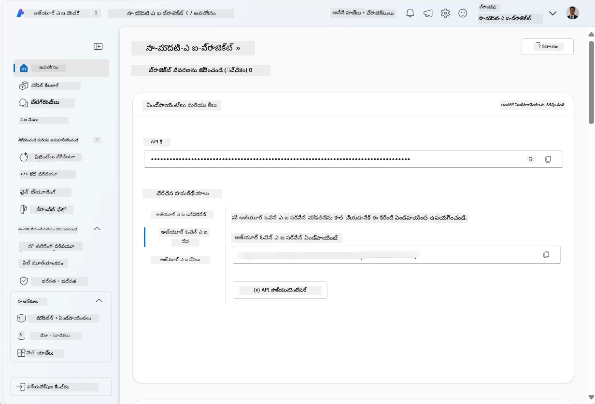
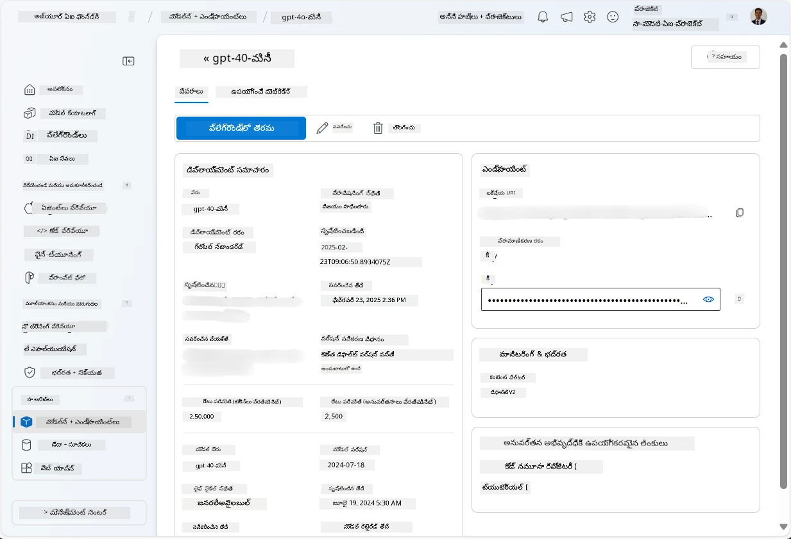
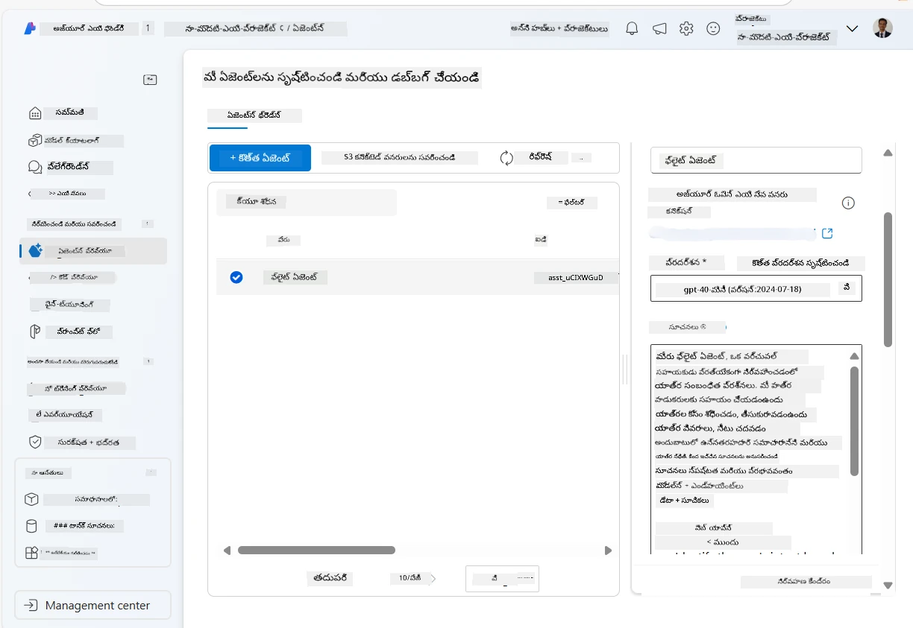
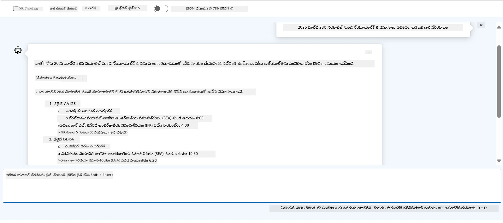

<!--
CO_OP_TRANSLATOR_METADATA:
{
  "original_hash": "7e92870dc0843e13d4dabc620c09d2d9",
  "translation_date": "2025-12-03T16:56:39+00:00",
  "source_file": "02-explore-agentic-frameworks/azure-ai-foundry-agent-creation.md",
  "language_code": "te"
}
-->
# Azure AI ఏజెంట్ సేవ అభివృద్ధి

ఈ వ్యాయామంలో, మీరు [Azure AI Foundry portal](https://ai.azure.com/?WT.mc_id=academic-105485-koreyst) లోని Azure AI ఏజెంట్ సేవ టూల్స్ ఉపయోగించి ఫ్లైట్ బుకింగ్ కోసం ఒక ఏజెంట్‌ను సృష్టిస్తారు. ఈ ఏజెంట్ వినియోగదారులతో సంభాషించి, ఫ్లైట్ల గురించి సమాచారం అందించగలదు.

## ముందస్తు అవసరాలు

ఈ వ్యాయామాన్ని పూర్తి చేయడానికి, మీకు ఈ క్రింది వాటి అవసరం ఉంటుంది:
1. చురుకైన సబ్‌స్క్రిప్షన్‌తో Azure ఖాతా. [ఉచిత ఖాతాను సృష్టించండి](https://azure.microsoft.com/free/?WT.mc_id=academic-105485-koreyst).
2. Azure AI Foundry హబ్‌ను సృష్టించడానికి అనుమతులు లేదా మీ కోసం ఒక హబ్ సృష్టించబడాలి.
    - మీ పాత్ర Contributor లేదా Owner అయితే, మీరు ఈ ట్యుటోరియల్‌లోని దశలను అనుసరించవచ్చు.

## Azure AI Foundry హబ్ సృష్టించండి

> **Note:** Azure AI Foundry ను మునుపు Azure AI Studio అని పిలిచేవారు.

1. [Azure AI Foundry](https://learn.microsoft.com/en-us/azure/ai-studio/?WT.mc_id=academic-105485-koreyst) బ్లాగ్ పోస్ట్‌లోని మార్గదర్శకాలను అనుసరించి Azure AI Foundry హబ్‌ను సృష్టించండి.
2. మీ ప్రాజెక్ట్ సృష్టించబడిన తర్వాత, ప్రదర్శించబడే సూచనలను మూసివేసి, Azure AI Foundry పోర్టల్‌లోని ప్రాజెక్ట్ పేజీని సమీక్షించండి. ఇది క్రింది చిత్రానికి సమానంగా కనిపించాలి:

    

## మోడల్‌ను డిప్లాయ్ చేయండి

1. మీ ప్రాజెక్ట్ కోసం ఎడమ ప్యానెల్‌లో, **My assets** విభాగంలో **Models + endpoints** పేజీని ఎంచుకోండి.
2. **Models + endpoints** పేజీలో, **Model deployments** ట్యాబ్‌లో, **+ Deploy model** మెనూలో **Deploy base model** ను ఎంచుకోండి.
3. జాబితాలో `gpt-4o-mini` మోడల్‌ను శోధించి, దానిని ఎంచుకుని ధృవీకరించండి.

    > **Note**: TPM తగ్గించడం, మీరు ఉపయోగిస్తున్న సబ్‌స్క్రిప్షన్‌లో అందుబాటులో ఉన్న కోటాను అధికంగా ఉపయోగించకుండా ఉండటానికి సహాయపడుతుంది.

    

## ఏజెంట్‌ను సృష్టించండి

ఇప్పుడు మీరు మోడల్‌ను డిప్లాయ్ చేసిన తర్వాత, మీరు ఒక ఏజెంట్‌ను సృష్టించవచ్చు. ఏజెంట్ అనేది వినియోగదారులతో సంభాషించగల కృత్రిమ మేధస్సు మోడల్.

1. మీ ప్రాజెక్ట్ కోసం ఎడమ ప్యానెల్‌లో, **Build & Customize** విభాగంలో **Agents** పేజీని ఎంచుకోండి.
2. **+ Create agent** పై క్లిక్ చేసి కొత్త ఏజెంట్‌ను సృష్టించండి. **Agent Setup** డైలాగ్ బాక్స్‌లో:
    - ఏజెంట్‌కు `FlightAgent` వంటి పేరు ఇవ్వండి.
    - మీరు ముందుగా సృష్టించిన `gpt-4o-mini` మోడల్ డిప్లాయ్‌మెంట్ ఎంచుకోబడిందని నిర్ధారించుకోండి.
    - ఏజెంట్ అనుసరించాల్సిన సూచనలను **Instructions** లో సెట్ చేయండి. ఉదాహరణకు:
    ```
    You are FlightAgent, a virtual assistant specialized in handling flight-related queries. Your role includes assisting users with searching for flights, retrieving flight details, checking seat availability, and providing real-time flight status. Follow the instructions below to ensure clarity and effectiveness in your responses:

    ### Task Instructions:
    1. **Recognizing Intent**:
       - Identify the user's intent based on their request, focusing on one of the following categories:
         - Searching for flights
         - Retrieving flight details using a flight ID
         - Checking seat availability for a specified flight
         - Providing real-time flight status using a flight number
       - If the intent is unclear, politely ask users to clarify or provide more details.
        
    2. **Processing Requests**:
        - Depending on the identified intent, perform the required task:
        - For flight searches: Request details such as origin, destination, departure date, and optionally return date.
        - For flight details: Request a valid flight ID.
        - For seat availability: Request the flight ID and date and validate inputs.
        - For flight status: Request a valid flight number.
        - Perform validations on provided data (e.g., formats of dates, flight numbers, or IDs). If the information is incomplete or invalid, return a friendly request for clarification.

    3. **Generating Responses**:
    - Use a tone that is friendly, concise, and supportive.
    - Provide clear and actionable suggestions based on the output of each task.
    - If no data is found or an error occurs, explain it to the user gently and offer alternative actions (e.g., refine search, try another query).
    
    ```
> [!NOTE]
> మరింత వివరమైన ప్రాంప్ట్ కోసం, మీరు [ఈ రిపోజిటరీ](https://github.com/ShivamGoyal03/RoamMind)ని చూడవచ్చు.

> అదనంగా, మీరు ఏజెంట్ సామర్థ్యాలను మెరుగుపరచడానికి **Knowledge Base** మరియు **Actions** ను జోడించవచ్చు, తద్వారా వినియోగదారుల అభ్యర్థనల ఆధారంగా మరింత సమాచారం అందించగలదు మరియు ఆటోమేటెడ్ పనులను నిర్వహించగలదు. ఈ వ్యాయామంలో, మీరు ఈ దశలను వదిలివేయవచ్చు.



3. కొత్త మల్టీ-AI ఏజెంట్‌ను సృష్టించడానికి, **New Agent** పై క్లిక్ చేయండి. కొత్తగా సృష్టించిన ఏజెంట్ తరువాత ఏజెంట్స్ పేజీలో ప్రదర్శించబడుతుంది.

## ఏజెంట్‌ను పరీక్షించండి

ఏజెంట్‌ను సృష్టించిన తర్వాత, అది వినియోగదారుల ప్రశ్నలకు ఎలా స్పందిస్తుందో పరీక్షించవచ్చు.

1. మీ ఏజెంట్ కోసం **Setup** ప్యానెల్‌లో పైభాగంలో **Try in playground** ను ఎంచుకోండి.
2. **Playground** ప్యానెల్‌లో, చాట్ విండోలో ప్రశ్నలను టైప్ చేసి ఏజెంట్‌తో సంభాషించవచ్చు. ఉదాహరణకు, మీరు ఏజెంట్‌ను 28వ తేదీన సియాటిల్ నుండి న్యూయార్క్‌కు ఫ్లైట్లను శోధించమని అడగవచ్చు.

    > **Note**: ఈ వ్యాయామంలో నిజ-సమయ డేటా ఉపయోగించబడటం లేదు కాబట్టి ఏజెంట్ ఖచ్చితమైన సమాధానాలను అందించకపోవచ్చు. ఈ వ్యాయామం ఉద్దేశం ఏజెంట్ వినియోగదారుల ప్రశ్నలను అర్థం చేసుకోవడం మరియు అందుకు అనుగుణంగా స్పందించగల సామర్థ్యాన్ని పరీక్షించడం.

    

3. ఏజెంట్‌ను పరీక్షించిన తర్వాత, దాని సామర్థ్యాలను మెరుగుపరచడానికి మరిన్ని intents, training data, మరియు actions జోడించి అనుకూలీకరించవచ్చు.

## వనరులను తొలగించండి

ఏజెంట్‌ను పరీక్షించడం పూర్తయిన తర్వాత, అదనపు ఖర్చులను నివారించడానికి దానిని తొలగించవచ్చు.
1. [Azure portal](https://portal.azure.com) ఓపెన్ చేసి, ఈ వ్యాయామంలో ఉపయోగించిన హబ్ వనరులను డిప్లాయ్ చేసిన రిసోర్స్ గ్రూప్ యొక్క కంటెంట్‌ను వీక్షించండి.
2. టూల్‌బార్‌లో **Delete resource group** ను ఎంచుకోండి.
3. రిసోర్స్ గ్రూప్ పేరును నమోదు చేసి, దానిని తొలగించాలనుకుంటున్నారని ధృవీకరించండి.

## వనరులు

- [Azure AI Foundry documentation](https://learn.microsoft.com/en-us/azure/ai-studio/?WT.mc_id=academic-105485-koreyst)
- [Azure AI Foundry portal](https://ai.azure.com/?WT.mc_id=academic-105485-koreyst)
- [Getting Started with Azure AI Studio](https://techcommunity.microsoft.com/blog/educatordeveloperblog/getting-started-with-azure-ai-studio/4095602?WT.mc_id=academic-105485-koreyst)
- [Fundamentals of AI agents on Azure](https://learn.microsoft.com/en-us/training/modules/ai-agent-fundamentals/?WT.mc_id=academic-105485-koreyst)
- [Azure AI Discord](https://aka.ms/AzureAI/Discord)

---

<!-- CO-OP TRANSLATOR DISCLAIMER START -->
**విమర్శ**:  
ఈ పత్రాన్ని AI అనువాద సేవ [Co-op Translator](https://github.com/Azure/co-op-translator) ఉపయోగించి అనువదించారు. మేము ఖచ్చితత్వానికి ప్రయత్నిస్తున్నప్పటికీ, ఆటోమేటెడ్ అనువాదాలలో తప్పులు లేదా అసమానతలు ఉండవచ్చు. దాని స్వదేశీ భాషలోని అసలు పత్రాన్ని అధికారం కలిగిన మూలంగా పరిగణించాలి. కీలకమైన సమాచారం కోసం, ప్రొఫెషనల్ మానవ అనువాదాన్ని సిఫారసు చేస్తాము. ఈ అనువాదాన్ని ఉపయోగించడం వల్ల కలిగే ఏవైనా అపార్థాలు లేదా తప్పుదారులు కోసం మేము బాధ్యత వహించము.
<!-- CO-OP TRANSLATOR DISCLAIMER END -->