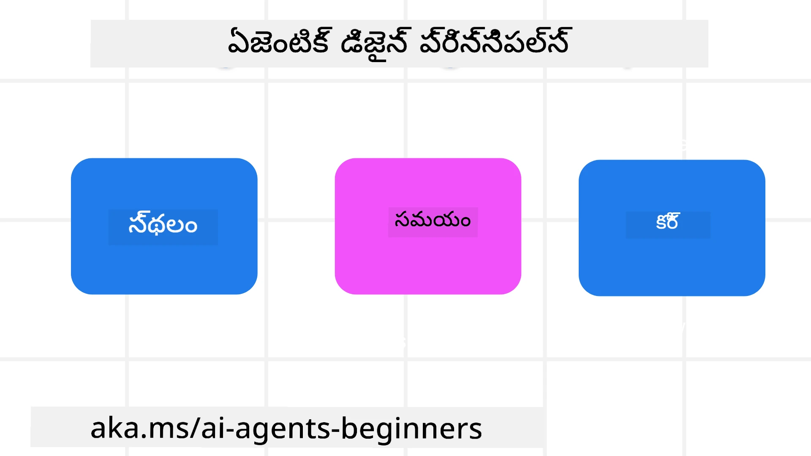

<!--
CO_OP_TRANSLATOR_METADATA:
{
  "original_hash": "d71524fe83a23829ae7a23b4031aaac8",
  "translation_date": "2025-12-03T17:11:51+00:00",
  "source_file": "03-agentic-design-patterns/README.md",
  "language_code": "te"
}
-->

> _(ఈ పాఠం వీడియోను చూడటానికి పై చిత్రంపై క్లిక్ చేయండి)_
# AI ఏజెంటిక్ డిజైన్ ప్రిన్సిపిల్స్

## పరిచయం

AI ఏజెంటిక్ సిస్టమ్స్ నిర్మించడానికి అనేక మార్గాలు ఉన్నాయి. జనరేటివ్ AI డిజైన్‌లో అస్పష్టత ఒక ఫీచర్ మరియు బగ్ కాదు అని భావించినప్పుడు, ఇంజనీర్లు ఎక్కడ ప్రారంభించాలో కూడా నిర్ణయించడం కొంచెం కష్టంగా ఉంటుంది. అభివృద్ధి కర్తలు తమ వ్యాపార అవసరాలను పరిష్కరించడానికి కస్టమర్-కేంద్రిత ఏజెంటిక్ సిస్టమ్స్‌ను నిర్మించడానికి వీలు కల్పించడానికి మేము మానవ-కేంద్రిత UX డిజైన్ ప్రిన్సిపిల్స్ సెట్‌ను రూపొందించాము. ఈ డిజైన్ ప్రిన్సిపిల్స్ ఒక నిర్దిష్ట ఆర్కిటెక్చర్ కాదు, కానీ ఏజెంట్ అనుభవాలను నిర్వచించడానికి మరియు నిర్మించడానికి ప్రయత్నిస్తున్న టీమ్‌లకు ఒక ప్రారంభ బిందువుగా ఉంటాయి.

సాధారణంగా, ఏజెంట్లు:

- మానవ సామర్థ్యాలను విస్తరించండి మరియు స్కేల్ చేయండి (బ్రెయిన్‌స్టార్మింగ్, సమస్య పరిష్కారం, ఆటోమేషన్ మొదలైనవి)
- జ్ఞాన లోటును పూరించండి (నాకు జ్ఞాన డొమైన్‌లపై అవగాహన కలిగించండి, అనువాదం మొదలైనవి)
- వ్యక్తులుగా మేము ఇతరులతో పని చేయడానికి ఇష్టపడే మార్గాల్లో సహకారం సులభతరం చేయండి మరియు మద్దతు ఇవ్వండి
- మమ్మల్ని మెరుగైన వెర్షన్‌లుగా మార్చండి (ఉదాహరణకు, లైఫ్ కోచ్/టాస్క్ మాస్టర్, మాకు భావోద్వేగ నియంత్రణ మరియు మైండ్‌ఫుల్‌నెస్ నైపుణ్యాలను నేర్పడం, రిజిలియన్స్‌ను నిర్మించడం మొదలైనవి)

## ఈ పాఠంలో మీరు నేర్చుకునే అంశాలు

- ఏజెంటిక్ డిజైన్ ప్రిన్సిపిల్స్ ఏమిటి
- ఈ డిజైన్ ప్రిన్సిపిల్స్ అమలు చేయడానికి అనుసరించాల్సిన కొన్ని మార్గదర్శకాలు ఏమిటి
- డిజైన్ ప్రిన్సిపిల్స్ ఉపయోగించి కొన్ని ఉదాహరణలు ఏమిటి

## నేర్చుకునే లక్ష్యాలు

ఈ పాఠాన్ని పూర్తి చేసిన తర్వాత, మీరు:

1. ఏజెంటిక్ డిజైన్ ప్రిన్సిపిల్స్ ఏమిటి అనేది వివరించగలరు
2. ఏజెంటిక్ డిజైన్ ప్రిన్సిపిల్స్ ఉపయోగించడానికి మార్గదర్శకాలను వివరించగలరు
3. ఏజెంటిక్ డిజైన్ ప్రిన్సిపిల్స్ ఉపయోగించి ఏజెంట్‌ను ఎలా నిర్మించాలో అర్థం చేసుకోగలరు

## ఏజెంటిక్ డిజైన్ ప్రిన్సిపిల్స్

### ఏజెంట్ (స్పేస్)

ఇది ఏజెంట్ పనిచేసే వాతావరణం. భౌతిక మరియు డిజిటల్ ప్రపంచాలలో పాల్గొనేందుకు ఏజెంట్లను ఎలా డిజైన్ చేయాలో ఈ ప్రిన్సిపిల్స్ తెలియజేస్తాయి.

- **కనెక్ట్ చేయడం, కుదించడం కాదు** – వ్యక్తులు, ఈవెంట్‌లు మరియు యాక్షనబుల్ నాలెడ్జ్‌లను కనెక్ట్ చేయడానికి సహాయం చేయండి, తద్వారా సహకారం మరియు కనెక్షన్ సాధ్యమవుతుంది.
- ఏజెంట్లు ఈవెంట్‌లు, జ్ఞానం మరియు వ్యక్తులను కనెక్ట్ చేయడంలో సహాయపడతాయి.
- ఏజెంట్లు వ్యక్తులను దగ్గరగా తీసుకువస్తాయి. వారు వ్యక్తులను భర్తీ చేయడానికి లేదా చిన్నచూపు చూడటానికి రూపొందించబడలేదు.
- **సులభంగా యాక్సెస్ చేయగలిగే, కానీ అప్పుడప్పుడు కనిపించని** – ఏజెంట్ ప్రధానంగా బ్యాక్‌గ్రౌండ్‌లో పనిచేస్తుంది మరియు అవసరమైనప్పుడు మరియు అనువైనప్పుడు మాత్రమే మమ్మల్ని నడిపిస్తుంది.
  - ఏజెంట్ అనుమతించబడిన వినియోగదారులకు ఏదైనా డివైస్ లేదా ప్లాట్‌ఫారమ్‌లో సులభంగా కనుగొనగలిగే మరియు యాక్సెస్ చేయగలిగే విధంగా ఉంటుంది.
  - ఏజెంట్ మల్టీమోడల్ ఇన్‌పుట్‌లు మరియు అవుట్‌పుట్‌లను (సౌండ్, వాయిస్, టెక్స్ట్ మొదలైనవి) మద్దతు ఇస్తుంది.
  - ఏజెంట్ వినియోగదారుల అవసరాలను గుర్తించడం ఆధారంగా ఫోర్‌గ్రౌండ్ మరియు బ్యాక్‌గ్రౌండ్ మధ్య, ప్రోయాక్టివ్ మరియు రియాక్టివ్ మధ్య సులభంగా మారగలదు.
  - ఏజెంట్ కనిపించని రూపంలో పనిచేయవచ్చు, కానీ దాని బ్యాక్‌గ్రౌండ్ ప్రాసెస్ పాత్ మరియు ఇతర ఏజెంట్లతో సహకారం వినియోగదారుకు పారదర్శకంగా మరియు నియంత్రించగలిగే విధంగా ఉంటుంది.

### ఏజెంట్ (టైమ్)

ఇది ఏజెంట్ కాలక్రమంలో ఎలా పనిచేస్తుందో. గతం, ప్రస్తుతం మరియు భవిష్యత్తు అంతటా ఏజెంట్లు ఎలా పరస్పర చర్యలు చేయాలో ఈ ప్రిన్సిపిల్స్ తెలియజేస్తాయి.

- **గతం**: స్థితి మరియు సందర్భం రెండింటినీ కలిగి ఉన్న చరిత్రను ప్రతిబింబించడం.
  - ఏజెంట్ ఈవెంట్, వ్యక్తులు లేదా స్థితుల కంటే ఎక్కువ చరిత్రాత్మక డేటా విశ్లేషణ ఆధారంగా మరింత సంబంధిత ఫలితాలను అందిస్తుంది.
  - ఏజెంట్ గత ఈవెంట్‌ల నుండి కనెక్షన్‌లను సృష్టిస్తుంది మరియు ప్రస్తుత పరిస్థితులతో నిమగ్నమవ్వడానికి జ్ఞాపకాన్ని చురుకుగా ప్రతిబింబిస్తుంది.
- **ప్రస్తుతం**: నోటిఫై చేయడం కంటే నడిపించడం.
  - ఏజెంట్ వ్యక్తులతో పరస్పర చర్యకు సమగ్ర దృక్పథాన్ని కలిగి ఉంటుంది. ఒక ఈవెంట్ జరిగే సమయంలో, ఏజెంట్ స్థిరమైన నోటిఫికేషన్ లేదా ఇతర స్థిరమైన రూపాన్ని మించి వెళుతుంది. ఏజెంట్ ఫ్లోలను సరళతరం చేయగలదు లేదా వినియోగదారుడి దృష్టిని సరైన సమయంలో దిశగా నడిపించడానికి డైనమిక్‌గా సంకేతాలను సృష్టించగలదు.
  - ఏజెంట్ సమాచారాన్ని సందర్భాత్మక వాతావరణం, సామాజిక మరియు సాంస్కృతిక మార్పులు మరియు వినియోగదారుడి ఉద్దేశానికి అనుగుణంగా అందిస్తుంది.
  - ఏజెంట్ పరస్పర చర్య క్రమంగా, దీర్ఘకాలంలో వినియోగదారులను సాధికారత కలిగించడానికి పరిణామం/సంక్లిష్టతలో పెరుగుతుంది.
- **భవిష్యత్తు**: అనుకూలించడం మరియు అభివృద్ధి చెందడం.
  - ఏజెంట్ వివిధ డివైస్‌లు, ప్లాట్‌ఫారమ్‌లు మరియు మోడాలిటీలకు అనుగుణంగా ఉంటుంది.
  - ఏజెంట్ వినియోగదారుల ప్రవర్తన, యాక్సెసిబిలిటీ అవసరాలకు అనుగుణంగా ఉంటుంది మరియు స్వేచ్ఛగా అనుకూలీకరించగలదు.
  - ఏజెంట్ నిరంతర వినియోగదారుల పరస్పర చర్య ద్వారా ఆకారాన్ని పొందుతుంది మరియు అభివృద్ధి చెందుతుంది.

### ఏజెంట్ (కోర్)

ఏజెంట్ డిజైన్ యొక్క ప్రధాన అంశాలు ఇవి.

- **అస్పష్టతను స్వీకరించండి కానీ నమ్మకాన్ని స్థాపించండి**.
  - ఏజెంట్ డిజైన్‌లో అస్పష్టత ఒక కీలక అంశం. ఏజెంట్ అస్పష్టత యొక్క నిర్దిష్ట స్థాయి ఆశించబడుతుంది.
  - నమ్మకం మరియు పారదర్శకత ఏజెంట్ డిజైన్ యొక్క ఫౌండేషన్ లేయర్‌లు.
  - ఏజెంట్ ఆన్/ఆఫ్ ఉన్నప్పుడు మనుషులు నియంత్రణలో ఉంటారు మరియు ఏజెంట్ స్థితి ఎల్లప్పుడూ స్పష్టంగా కనిపిస్తుంది.

## ఈ ప్రిన్సిపిల్స్ అమలు చేయడానికి మార్గదర్శకాలు

మీరు పై డిజైన్ ప్రిన్సిపిల్స్ ఉపయోగిస్తున్నప్పుడు, ఈ మార్గదర్శకాలను అనుసరించండి:

1. **పారదర్శకత**: AI పాల్గొంటుందని, అది ఎలా పనిచేస్తుందో (గత చర్యలు సహా), మరియు సిస్టమ్‌ను ఎలా ఫీడ్‌బ్యాక్ ఇవ్వాలి మరియు మార్చాలో వినియోగదారుడికి తెలియజేయండి.
2. **నియంత్రణ**: వినియోగదారుడికి అనుకూలీకరించడానికి, ప్రాధాన్యతలను పేర్కొనడానికి మరియు వ్యక్తిగతీకరించడానికి, అలాగే సిస్టమ్ మరియు దాని లక్షణాలపై నియంత్రణ కలిగి ఉండే అవకాశం ఇవ్వండి (మర్చిపోయే సామర్థ్యం సహా).
3. **స్థిరత్వం**: డివైస్‌లు మరియు ఎండ్‌పాయింట్‌లలో స్థిరమైన, మల్టీ-మోడల్ అనుభవాలను లక్ష్యంగా పెట్టుకోండి. సాధ్యమైనంతవరకు పరిచితమైన UI/UX అంశాలను ఉపయోగించండి (ఉదాహరణకు, వాయిస్ పరస్పర చర్య కోసం మైక్రోఫోన్ ఐకాన్) మరియు వినియోగదారుడి మానసిక భారం తగ్గించడానికి ప్రయత్నించండి (ఉదాహరణకు, సంక్షిప్త ప్రతిస్పందనలు, విజువల్ ఎయిడ్స్ మరియు 'మరింత తెలుసుకోండి' కంటెంట్).

## ఈ ప్రిన్సిపిల్స్ మరియు మార్గదర్శకాలను ఉపయోగించి ట్రావెల్ ఏజెంట్‌ను ఎలా డిజైన్ చేయాలి

మీరు ట్రావెల్ ఏజెంట్‌ను డిజైన్ చేస్తున్నారని ఊహించుకోండి, ఈ డిజైన్ ప్రిన్సిపిల్స్ మరియు మార్గదర్శకాలను ఉపయోగించడం గురించి మీరు ఇలా ఆలోచించవచ్చు:

1. **పారదర్శకత** – ట్రావెల్ ఏజెంట్ AI-ఎనేబుల్ చేసిన ఏజెంట్ అని వినియోగదారుడికి తెలియజేయండి. ప్రారంభించడానికి కొన్ని ప్రాథమిక సూచనలను అందించండి (ఉదాహరణకు, "హలో" సందేశం, నమూనా ప్రాంప్ట్‌లు). ఇది ఉత్పత్తి పేజీలో స్పష్టంగా డాక్యుమెంట్ చేయండి. వినియోగదారుడు గతంలో అడిగిన ప్రాంప్ట్‌ల జాబితాను చూపండి. ఫీడ్‌బ్యాక్ ఇవ్వడం ఎలా అనేది స్పష్టంగా తెలియజేయండి (అంగీకార/అంగీకార గుర్తులు, ఫీడ్‌బ్యాక్ పంపు బటన్ మొదలైనవి). ఏజెంట్‌కు ఉపయోగం లేదా టాపిక్ పరిమితులు ఉంటే స్పష్టంగా వివరించండి.
2. **నియంత్రణ** – ఏజెంట్ సృష్టించబడిన తర్వాత దాన్ని ఎలా మార్చుకోవాలో వినియోగదారుడికి స్పష్టంగా తెలియజేయండి, ఉదాహరణకు సిస్టమ్ ప్రాంప్ట్ వంటి అంశాలతో. ఏజెంట్ ఎంత విస్తృతంగా ఉండాలో, దాని రచనా శైలి మరియు ఏజెంట్ మాట్లాడకూడదని చెప్పిన అంశాలను ఎంచుకోవడానికి వినియోగదారుడికి వీలు కల్పించండి. ఏదైనా సంబంధిత ఫైల్‌లు లేదా డేటా, ప్రాంప్ట్‌లు మరియు గత సంభాషణలను చూడటానికి మరియు తొలగించడానికి వినియోగదారుడికి అనుమతించండి.
3. **స్థిరత్వం** – షేర్ ప్రాంప్ట్, ఫైల్ లేదా ఫోటోను జోడించండి మరియు ఏదైనా లేదా ఎవరినైనా ట్యాగ్ చేయడానికి ఐకాన్‌లు ప్రామాణికంగా మరియు గుర్తించదగినవి ఉండేలా చూసుకోండి. ఏజెంట్‌తో ఫైల్ అప్‌లోడ్/షేరింగ్ సూచించడానికి పేపర్‌క్లిప్ ఐకాన్‌ను మరియు గ్రాఫిక్స్ అప్‌లోడ్ సూచించడానికి ఇమేజ్ ఐకాన్‌ను ఉపయోగించండి.

## నమూనా కోడ్‌లు

- Python: [Agent Framework](./code_samples/03-python-agent-framework.ipynb)
- .NET: [Agent Framework](./code_samples/03-dotnet-agent-framework.md)

## AI ఏజెంటిక్ డిజైన్ ప్యాటర్న్‌ల గురించి మరిన్ని ప్రశ్నలున్నాయా?

మరింత నేర్చుకోవడానికి, ఆఫీస్ అవర్స్‌లో పాల్గొనడానికి మరియు మీ AI ఏజెంట్ల ప్రశ్నలకు సమాధానం పొందడానికి [Azure AI Foundry Discord](https://aka.ms/ai-agents/discord)లో చేరండి.

## అదనపు వనరులు

- <a href="https://openai.com" target="_blank">ఏజెంటిక్ AI సిస్టమ్స్ పాలనకు సంబంధించిన పద్ధతులు | OpenAI</a>
- <a href="https://microsoft.com" target="_blank">HAX టూల్‌కిట్ ప్రాజెక్ట్ - Microsoft Research</a>
- <a href="https://responsibleaitoolbox.ai" target="_blank">Responsible AI Toolbox</a>

## గత పాఠం

[ఏజెంటిక్ ఫ్రేమ్‌వర్క్‌లను అన్వేషించడం](../02-explore-agentic-frameworks/README.md)

## తదుపరి పాఠం

[టూల్ యూజ్ డిజైన్ ప్యాటర్న్](../04-tool-use/README.md)

---

<!-- CO-OP TRANSLATOR DISCLAIMER START -->
**విమర్శ**:  
ఈ పత్రాన్ని AI అనువాద సేవ [Co-op Translator](https://github.com/Azure/co-op-translator) ఉపయోగించి అనువదించారు. మేము ఖచ్చితత్వానికి ప్రయత్నిస్తున్నప్పటికీ, ఆటోమేటెడ్ అనువాదాలలో తప్పులు లేదా అసమానతలు ఉండవచ్చు. దాని స్వదేశీ భాషలోని అసలు పత్రాన్ని అధికారం కలిగిన మూలంగా పరిగణించాలి. కీలకమైన సమాచారం కోసం, ప్రొఫెషనల్ మానవ అనువాదాన్ని సిఫారసు చేస్తాము. ఈ అనువాదాన్ని ఉపయోగించడం వల్ల కలిగే ఏవైనా అపార్థాలు లేదా తప్పుదారులు కోసం మేము బాధ్యత వహించము.
<!-- CO-OP TRANSLATOR DISCLAIMER END -->