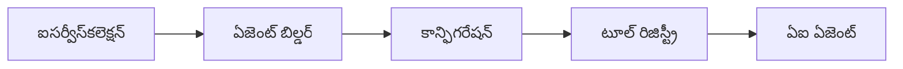

<!--
CO_OP_TRANSLATOR_METADATA:
{
  "original_hash": "bcc874e190347bd6a095aed56dc16de8",
  "translation_date": "2025-12-03T17:13:56+00:00",
  "source_file": "03-agentic-design-patterns/code_samples/03-dotnet-agent-framework.md",
  "language_code": "te"
}
-->
# 🎨 GitHub మోడల్స్ (.NET) తో Agentic డిజైన్ ప్యాటర్న్స్

## 📋 నేర్చుకునే లక్ష్యాలు

ఈ ఉదాహరణ Microsoft Agent Frameworkను .NETలో GitHub మోడల్స్ ఇంటిగ్రేషన్‌తో ఉపయోగించి ఇంటెలిజెంట్ ఏజెంట్లను నిర్మించడానికి ఎంటర్‌ప్రైజ్-గ్రేడ్ డిజైన్ ప్యాటర్న్స్‌ను చూపిస్తుంది. ఏజెంట్లను ప్రొడక్షన్-రెడీ, నిర్వహించదగిన మరియు స్కేలబుల్‌గా మార్చే ప్రొఫెషనల్ ప్యాటర్న్స్ మరియు ఆర్కిటెక్చరల్ విధానాలను మీరు నేర్చుకుంటారు.

### ఎంటర్‌ప్రైజ్ డిజైన్ ప్యాటర్న్స్

- 🏭 **ఫ్యాక్టరీ ప్యాటర్న్**: డిపెండెన్సీ ఇంజెక్షన్‌తో ఏజెంట్ క్రియేషన్‌ను ప్రామాణీకరించడం
- 🔧 **బిల్డర్ ప్యాటర్న్**: ఫ్లూయెంట్ ఏజెంట్ కాన్ఫిగరేషన్ మరియు సెటప్
- 🧵 **థ్రెడ్-సేఫ్ ప్యాటర్న్స్**: కరెంట్ సంభాషణ నిర్వహణ
- 📋 **రిపోజిటరీ ప్యాటర్న్**: టూల్ మరియు సామర్థ్య నిర్వహణను సజావుగా చేయడం

## 🎯 .NET-స్పెసిఫిక్ ఆర్కిటెక్చరల్ ప్రయోజనాలు

### ఎంటర్‌ప్రైజ్ ఫీచర్లు

- **స్ట్రాంగ్ టైపింగ్**: కంపైల్-టైమ్ వాలిడేషన్ మరియు IntelliSense సపోర్ట్
- **డిపెండెన్సీ ఇంజెక్షన్**: బిల్ట్-ఇన్ DI కంటైనర్ ఇంటిగ్రేషన్
- **కాన్ఫిగరేషన్ మేనేజ్‌మెంట్**: IConfiguration మరియు Options ప్యాటర్న్స్
- **Async/Await**: ఫస్ట్-క్లాస్ అసింక్రోనస్ ప్రోగ్రామింగ్ సపోర్ట్

### ప్రొడక్షన్-రెడీ ప్యాటర్న్స్

- **లాగింగ్ ఇంటిగ్రేషన్**: ILogger మరియు స్ట్రక్చర్డ్ లాగింగ్ సపోర్ట్
- **హెల్త్ చెక్స్**: బిల్ట్-ఇన్ మానిటరింగ్ మరియు డయాగ్నోస్టిక్స్
- **కాన్ఫిగరేషన్ వాలిడేషన్**: డేటా అనోటేషన్లతో స్ట్రాంగ్ టైపింగ్
- **ఎర్రర్ హ్యాండ్లింగ్**: స్ట్రక్చర్డ్ ఎక్సెప్షన్ మేనేజ్‌మెంట్

## 🔧 టెక్నికల్ ఆర్కిటెక్చర్

### కోర్ .NET భాగాలు

- **Microsoft.Extensions.AI**: ఏకీకృత AI సేవల అబ్స్ట్రాక్షన్స్
- **Microsoft.Agents.AI**: ఎంటర్‌ప్రైజ్ ఏజెంట్ ఆర్కెస్ట్రేషన్ ఫ్రేమ్‌వర్క్
- **GitHub మోడల్స్ ఇంటిగ్రేషన్**: హై-పర్ఫార్మెన్స్ API క్లయింట్ ప్యాటర్న్స్
- **కాన్ఫిగరేషన్ సిస్టమ్**: appsettings.json మరియు ఎన్విరాన్‌మెంట్ ఇంటిగ్రేషన్

### డిజైన్ ప్యాటర్న్ అమలు


## 🏗️ ఎంటర్‌ప్రైజ్ ప్యాటర్న్స్ ప్రదర్శన

### 1. **క్రియేషనల్ ప్యాటర్న్స్**

- **ఏజెంట్ ఫ్యాక్టరీ**: కేంద్రీకృత ఏజెంట్ క్రియేషన్ మరియు స్థిరమైన కాన్ఫిగరేషన్
- **బిల్డర్ ప్యాటర్న్**: క్లిష్టమైన ఏజెంట్ కాన్ఫిగరేషన్ కోసం ఫ్లూయెంట్ API
- **సింగిల్టన్ ప్యాటర్న్**: షేర్డ్ రిసోర్సెస్ మరియు కాన్ఫిగరేషన్ మేనేజ్‌మెంట్
- **డిపెండెన్సీ ఇంజెక్షన్**: లూజ్ కప్లింగ్ మరియు టెస్టబిలిటీ

### 2. **బిహేవియరల్ ప్యాటర్న్స్**

- **స్ట్రాటజీ ప్యాటర్న్**: మార్పిడి చేయగల టూల్ ఎగ్జిక్యూషన్ స్ట్రాటజీస్
- **కమాండ్ ప్యాటర్న్**: ఏజెంట్ ఆపరేషన్స్‌ను undo/redoతో ఎన్‌కాప్సులేట్ చేయడం
- **ఆబ్జర్వర్ ప్యాటర్న్**: ఈవెంట్-డ్రివెన్ ఏజెంట్ లైఫ్‌సైకిల్ మేనేజ్‌మెంట్
- **టెంప్లేట్ మెథడ్**: ఏజెంట్ ఎగ్జిక్యూషన్ వర్క్‌ఫ్లోలను ప్రామాణీకరించడం

### 3. **స్ట్రక్చరల్ ప్యాటర్న్స్**

- **అడాప్టర్ ప్యాటర్న్**: GitHub మోడల్స్ API ఇంటిగ్రేషన్ లేయర్
- **డెకరేటర్ ప్యాటర్న్**: ఏజెంట్ సామర్థ్యాన్ని పెంచడం
- **ఫసాడ్ ప్యాటర్న్**: సులభమైన ఏజెంట్ ఇంటరాక్షన్ ఇంటర్‌ఫేస్‌లు
- **ప్రాక్సీ ప్యాటర్న్**: పనితీరు కోసం లేజీ లోడింగ్ మరియు క్యాషింగ్

## 📚 .NET డిజైన్ ప్రిన్సిపల్స్

### SOLID ప్రిన్సిపల్స్

- **సింగిల్ రెస్పాన్సిబిలిటీ**: ప్రతి భాగానికి ఒక స్పష్టమైన ఉద్దేశం ఉంటుంది
- **ఓపెన్/క్లోజ్డ్**: మార్పు లేకుండా విస్తరించగలిగే విధంగా
- **లిస్కోవ్ సబ్‌స్టిట్యూషన్**: ఇంటర్‌ఫేస్-ఆధారిత టూల్ అమలు
- **ఇంటర్‌ఫేస్ సెగ్రిగేషన్**: ఫోకస్ చేసిన, సమగ్రమైన ఇంటర్‌ఫేస్‌లు
- **డిపెండెన్సీ ఇన్వర్షన్**: కాంక్రీషన్స్‌పై కాకుండా అబ్స్ట్రాక్షన్స్‌పై ఆధారపడండి

### క్లీన్ ఆర్కిటెక్చర్

- **డొమైన్ లేయర్**: కోర్ ఏజెంట్ మరియు టూల్ అబ్స్ట్రాక్షన్స్
- **అప్లికేషన్ లేయర్**: ఏజెంట్ ఆర్కెస్ట్రేషన్ మరియు వర్క్‌ఫ్లోలు
- **ఇన్‌ఫ్రాస్ట్రక్చర్ లేయర్**: GitHub మోడల్స్ ఇంటిగ్రేషన్ మరియు బాహ్య సేవలు
- **ప్రెజెంటేషన్ లేయర్**: యూజర్ ఇంటరాక్షన్ మరియు రెస్పాన్స్ ఫార్మాటింగ్

## 🔒 ఎంటర్‌ప్రైజ్ అంశాలు

### సెక్యూరిటీ

- **క్రెడెన్షియల్ మేనేజ్‌మెంట్**: IConfigurationతో సురక్షిత API కీ నిర్వహణ
- **ఇన్‌పుట్ వాలిడేషన్**: స్ట్రాంగ్ టైపింగ్ మరియు డేటా అనోటేషన్ వాలిడేషన్
- **అవుట్‌పుట్ శానిటైజేషన్**: సురక్షిత రెస్పాన్స్ ప్రాసెసింగ్ మరియు ఫిల్టరింగ్
- **ఆడిట్ లాగింగ్**: సమగ్ర ఆపరేషన్ ట్రాకింగ్

### పనితీరు

- **అసింక్ ప్యాటర్న్స్**: నాన్-బ్లాకింగ్ I/O ఆపరేషన్స్
- **కనెక్షన్ పూలింగ్**: సమర్థవంతమైన HTTP క్లయింట్ మేనేజ్‌మెంట్
- **క్యాషింగ్**: పనితీరు మెరుగుపరచడానికి రెస్పాన్స్ క్యాషింగ్
- **రిసోర్స్ మేనేజ్‌మెంట్**: సరైన డిస్పోజల్ మరియు క్లీనప్ ప్యాటర్న్స్

### స్కేలబిలిటీ

- **థ్రెడ్ సేఫ్టీ**: కరెంట్ ఏజెంట్ ఎగ్జిక్యూషన్ సపోర్ట్
- **రిసోర్స్ పూలింగ్**: సమర్థవంతమైన రిసోర్స్ వినియోగం
- **లోడ్ మేనేజ్‌మెంట్**: రేట్ లిమిటింగ్ మరియు బ్యాక్‌ప్రెషర్ హ్యాండ్లింగ్
- **మానిటరింగ్**: పనితీరు మెట్రిక్స్ మరియు హెల్త్ చెక్స్

## 🚀 ప్రొడక్షన్ డిప్లాయ్‌మెంట్

- **కాన్ఫిగరేషన్ మేనేజ్‌మెంట్**: ఎన్విరాన్‌మెంట్-స్పెసిఫిక్ సెట్టింగ్స్
- **లాగింగ్ స్ట్రాటజీ**: కరెలేషన్ IDsతో స్ట్రక్చర్డ్ లాగింగ్
- **ఎర్రర్ హ్యాండ్లింగ్**: గ్లోబల్ ఎక్సెప్షన్ హ్యాండ్లింగ్ మరియు సరైన రికవరీ
- **మానిటరింగ్**: అప్లికేషన్ ఇన్‌సైట్స్ మరియు పనితీరు కౌంటర్లు
- **టెస్టింగ్**: యూనిట్ టెస్టులు, ఇంటిగ్రేషన్ టెస్టులు మరియు లోడ్ టెస్టింగ్ ప్యాటర్న్స్

ఎంటర్‌ప్రైజ్-గ్రేడ్ ఇంటెలిజెంట్ ఏజెంట్లను .NETతో నిర్మించడానికి సిద్ధంగా ఉన్నారా? రాబస్టుగా ఆర్కిటెక్ట్ చేద్దాం! 🏢✨

## 🚀 ప్రారంభం

### అవసరమైనవి

- [.NET 10 SDK](https://dotnet.microsoft.com/download/dotnet/10.0) లేదా అంతకంటే ఎక్కువ
- [GitHub మోడల్స్ API యాక్సెస్ టోకెన్](https://docs.github.com/github-models/github-models-at-scale/using-your-own-api-keys-in-github-models)

### అవసరమైన ఎన్విరాన్‌మెంట్ వేరియబుల్స్

```bash
# జెడ్‌ష్/బాష్
export GH_TOKEN=<your_github_token>
export GH_ENDPOINT=https://models.github.ai/inference
export GH_MODEL_ID=openai/gpt-5-mini
```

```powershell
# పవర్‌షెల్
$env:GH_TOKEN = "<your_github_token>"
$env:GH_ENDPOINT = "https://models.github.ai/inference"
$env:GH_MODEL_ID = "openai/gpt-5-mini"
```

### ఉదాహరణ కోడ్

కోడ్ ఉదాహరణను రన్ చేయడానికి,

```bash
# జెడ్‌ష్/బాష్
chmod +x ./03-dotnet-agent-framework.cs
./03-dotnet-agent-framework.cs
```

లేదా dotnet CLI ఉపయోగించి:

```bash
dotnet run ./03-dotnet-agent-framework.cs
```

పూర్తి కోడ్ కోసం [`03-dotnet-agent-framework.cs`](../../../../03-agentic-design-patterns/code_samples/03-dotnet-agent-framework.cs) చూడండి.

```csharp
#!/usr/bin/dotnet run

#:package Microsoft.Extensions.AI@10.*
#:package Microsoft.Agents.AI.OpenAI@1.*-*

using System.ClientModel;
using System.ComponentModel;

using Microsoft.Agents.AI;
using Microsoft.Extensions.AI;

using OpenAI;

// Tool Function: Random Destination Generator
// This static method will be available to the agent as a callable tool
// The [Description] attribute helps the AI understand when to use this function
// This demonstrates how to create custom tools for AI agents
[Description("Provides a random vacation destination.")]
static string GetRandomDestination()
{
    // List of popular vacation destinations around the world
    // The agent will randomly select from these options
    var destinations = new List<string>
    {
        "Paris, France",
        "Tokyo, Japan",
        "New York City, USA",
        "Sydney, Australia",
        "Rome, Italy",
        "Barcelona, Spain",
        "Cape Town, South Africa",
        "Rio de Janeiro, Brazil",
        "Bangkok, Thailand",
        "Vancouver, Canada"
    };

    // Generate random index and return selected destination
    // Uses System.Random for simple random selection
    var random = new Random();
    int index = random.Next(destinations.Count);
    return destinations[index];
}

// Extract configuration from environment variables
// Retrieve the GitHub Models API endpoint, defaults to https://models.github.ai/inference if not specified
// Retrieve the model ID, defaults to openai/gpt-5-mini if not specified
// Retrieve the GitHub token for authentication, throws exception if not specified
var github_endpoint = Environment.GetEnvironmentVariable("GH_ENDPOINT") ?? "https://models.github.ai/inference";
var github_model_id = Environment.GetEnvironmentVariable("GH_MODEL_ID") ?? "openai/gpt-5-mini";
var github_token = Environment.GetEnvironmentVariable("GH_TOKEN") ?? throw new InvalidOperationException("GH_TOKEN is not set.");

// Configure OpenAI Client Options
// Create configuration options to point to GitHub Models endpoint
// This redirects OpenAI client calls to GitHub's model inference service
var openAIOptions = new OpenAIClientOptions()
{
    Endpoint = new Uri(github_endpoint)
};

// Initialize OpenAI Client with GitHub Models Configuration
// Create OpenAI client using GitHub token for authentication
// Configure it to use GitHub Models endpoint instead of OpenAI directly
var openAIClient = new OpenAIClient(new ApiKeyCredential(github_token), openAIOptions);

// Define Agent Identity and Comprehensive Instructions
// Agent name for identification and logging purposes
var AGENT_NAME = "TravelAgent";

// Detailed instructions that define the agent's personality, capabilities, and behavior
// This system prompt shapes how the agent responds and interacts with users
var AGENT_INSTRUCTIONS = """
You are a helpful AI Agent that can help plan vacations for customers.

Important: When users specify a destination, always plan for that location. Only suggest random destinations when the user hasn't specified a preference.

When the conversation begins, introduce yourself with this message:
"Hello! I'm your TravelAgent assistant. I can help plan vacations and suggest interesting destinations for you. Here are some things you can ask me:
1. Plan a day trip to a specific location
2. Suggest a random vacation destination
3. Find destinations with specific features (beaches, mountains, historical sites, etc.)
4. Plan an alternative trip if you don't like my first suggestion

What kind of trip would you like me to help you plan today?"

Always prioritize user preferences. If they mention a specific destination like "Bali" or "Paris," focus your planning on that location rather than suggesting alternatives.
""";

// Create AI Agent with Advanced Travel Planning Capabilities
// Initialize complete agent pipeline: OpenAI client → Chat client → AI agent
// Configure agent with name, detailed instructions, and available tools
// This demonstrates the .NET agent creation pattern with full configuration
AIAgent agent = openAIClient
    .GetChatClient(github_model_id)
    .CreateAIAgent(
        name: AGENT_NAME,
        instructions: AGENT_INSTRUCTIONS,
        tools: [AIFunctionFactory.Create(GetRandomDestination)]
    );

// Create New Conversation Thread for Context Management
// Initialize a new conversation thread to maintain context across multiple interactions
// Threads enable the agent to remember previous exchanges and maintain conversational state
// This is essential for multi-turn conversations and contextual understanding
AgentThread thread = agent.GetNewThread();

// Execute Agent: First Travel Planning Request
// Run the agent with an initial request that will likely trigger the random destination tool
// The agent will analyze the request, use the GetRandomDestination tool, and create an itinerary
// Using the thread parameter maintains conversation context for subsequent interactions
await foreach (var update in agent.RunStreamingAsync("Plan me a day trip", thread))
{
    await Task.Delay(10);
    Console.Write(update);
}

Console.WriteLine();

// Execute Agent: Follow-up Request with Context Awareness
// Demonstrate contextual conversation by referencing the previous response
// The agent remembers the previous destination suggestion and will provide an alternative
// This showcases the power of conversation threads and contextual understanding in .NET agents
await foreach (var update in agent.RunStreamingAsync("I don't like that destination. Plan me another vacation.", thread))
{
    await Task.Delay(10);
    Console.Write(update);
}
```

---

<!-- CO-OP TRANSLATOR DISCLAIMER START -->
**విమర్శ**:  
ఈ పత్రాన్ని AI అనువాద సేవ [Co-op Translator](https://github.com/Azure/co-op-translator) ఉపయోగించి అనువదించారు. మేము ఖచ్చితత్వానికి ప్రయత్నిస్తున్నప్పటికీ, ఆటోమేటెడ్ అనువాదాలలో తప్పులు లేదా అసమానతలు ఉండవచ్చు. దాని స్వదేశీ భాషలోని అసలు పత్రాన్ని అధికారం కలిగిన మూలంగా పరిగణించాలి. కీలకమైన సమాచారం కోసం, ప్రొఫెషనల్ మానవ అనువాదాన్ని సిఫారసు చేస్తాము. ఈ అనువాదాన్ని ఉపయోగించడం వల్ల కలిగే ఏవైనా అపార్థాలు లేదా తప్పుదారులు కోసం మేము బాధ్యత వహించము.
<!-- CO-OP TRANSLATOR DISCLAIMER END -->