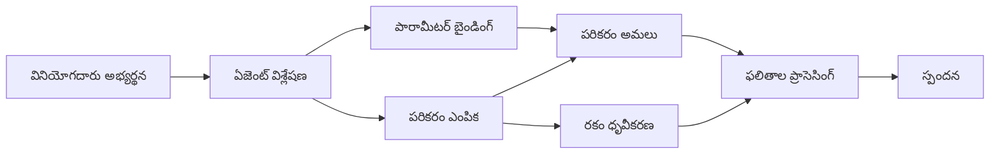

<!--
CO_OP_TRANSLATOR_METADATA:
{
  "original_hash": "91d6061e402489603f2ec8b528cae59b",
  "translation_date": "2025-12-03T16:55:06+00:00",
  "source_file": "04-tool-use/code_samples/04-dotnet-agent-framework.md",
  "language_code": "te"
}
-->
# 🛠️ GitHub మోడల్స్ (.NET) తో అధునాతన టూల్ వినియోగం

## 📋 నేర్చుకునే లక్ష్యాలు

ఈ నోట్‌బుక్ Microsoft Agent Framework ను .NET లో GitHub మోడల్స్ తో ఉపయోగించి ఎంటర్‌ప్రైజ్-గ్రేడ్ టూల్ ఇంటిగ్రేషన్ ప్యాటర్న్స్‌ను చూపిస్తుంది. మీరు బహుళ ప్రత్యేక టూల్స్‌తో అధునాతన ఏజెంట్లను నిర్మించడం, C# యొక్క స్ట్రాంగ్ టైపింగ్ మరియు .NET యొక్క ఎంటర్‌ప్రైజ్ ఫీచర్లను ఉపయోగించడం నేర్చుకుంటారు.

### మీరు నేర్చుకునే అధునాతన టూల్ సామర్థ్యాలు

- 🔧 **బహుళ-టూల్ ఆర్కిటెక్చర్**: బహుళ ప్రత్యేక సామర్థ్యాలతో ఏజెంట్లను నిర్మించడం
- 🎯 **టైప్-సేఫ్ టూల్ ఎగ్జిక్యూషన్**: C# యొక్క కంపైల్-టైమ్ వాలిడేషన్‌ను ఉపయోగించడం
- 📊 **ఎంటర్‌ప్రైజ్ టూల్ ప్యాటర్న్స్**: ప్రొడక్షన్-రెడీ టూల్ డిజైన్ మరియు ఎర్రర్ హ్యాండ్లింగ్
- 🔗 **టూల్ కాంపోజిషన్**: క్లిష్టమైన వ్యాపార వర్క్‌ఫ్లోల కోసం టూల్స్‌ను కలపడం

## 🎯 .NET టూల్ ఆర్కిటెక్చర్ ప్రయోజనాలు

### ఎంటర్‌ప్రైజ్ టూల్ ఫీచర్లు

- **కంపైల్-టైమ్ వాలిడేషన్**: స్ట్రాంగ్ టైపింగ్ టూల్ పరామితుల సరైనతను నిర్ధారిస్తుంది
- **డిపెండెన్సీ ఇంజెక్షన్**: టూల్ మేనేజ్‌మెంట్ కోసం IoC కంటైనర్ ఇంటిగ్రేషన్
- **అసింక్/అవైట్ ప్యాటర్న్స్**: సరైన వనరుల నిర్వహణతో నాన్-బ్లాకింగ్ టూల్ ఎగ్జిక్యూషన్
- **స్ట్రక్చర్డ్ లాగింగ్**: టూల్ ఎగ్జిక్యూషన్ మానిటరింగ్ కోసం బిల్ట్-ఇన్ లాగింగ్ ఇంటిగ్రేషన్

### ప్రొడక్షన్-రెడీ ప్యాటర్న్స్

- **ఎక్సెప్షన్ హ్యాండ్లింగ్**: టైప్డ్ ఎక్సెప్షన్స్‌తో సమగ్ర ఎర్రర్ మేనేజ్‌మెంట్
- **వనరుల నిర్వహణ**: సరైన డిస్పోజల్ ప్యాటర్న్స్ మరియు మెమరీ మేనేజ్‌మెంట్
- **పర్ఫార్మెన్స్ మానిటరింగ్**: బిల్ట్-ఇన్ మెట్రిక్స్ మరియు పర్ఫార్మెన్స్ కౌంటర్స్
- **కాన్ఫిగరేషన్ మేనేజ్‌మెంట్**: వాలిడేషన్‌తో టైప్-సేఫ్ కాన్ఫిగరేషన్

## 🔧 టెక్నికల్ ఆర్కిటెక్చర్

### కోర్ .NET టూల్ భాగాలు

- **Microsoft.Extensions.AI**: యూనిఫైడ్ టూల్ అబ్స్ట్రాక్షన్ లేయర్
- **Microsoft.Agents.AI**: ఎంటర్‌ప్రైజ్-గ్రేడ్ టూల్ ఆర్కెస్ట్రేషన్
- **GitHub మోడల్స్ ఇంటిగ్రేషన్**: హై-పర్ఫార్మెన్స్ API క్లయింట్ కనెక్షన్ పూలింగ్‌తో

### టూల్ ఎగ్జిక్యూషన్ పైప్‌లైన్


## 🛠️ టూల్ వర్గాలు & ప్యాటర్న్స్

### 1. **డేటా ప్రాసెసింగ్ టూల్స్**

- **ఇన్‌పుట్ వాలిడేషన్**: డేటా అనోటేషన్స్‌తో స్ట్రాంగ్ టైపింగ్
- **ట్రాన్స్‌ఫార్మ్ ఆపరేషన్స్**: టైప్-సేఫ్ డేటా కన్వర్షన్ మరియు ఫార్మాటింగ్
- **బిజినెస్ లాజిక్**: డొమైన్-స్పెసిఫిక్ కాలిక్యులేషన్ మరియు విశ్లేషణ టూల్స్
- **అవుట్‌పుట్ ఫార్మాటింగ్**: స్ట్రక్చర్డ్ రెస్పాన్స్ జనరేషన్

### 2. **ఇంటిగ్రేషన్ టూల్స్**

- **API కనెక్టర్స్**: RESTful సర్వీస్ ఇంటిగ్రేషన్ HttpClient తో
- **డేటాబేస్ టూల్స్**: డేటా యాక్సెస్ కోసం Entity Framework ఇంటిగ్రేషన్
- **ఫైల్ ఆపరేషన్స్**: వాలిడేషన్‌తో సురక్షితమైన ఫైల్ సిస్టమ్ ఆపరేషన్స్
- **ఎక్స్‌టర్నల్ సర్వీసెస్**: థర్డ్-పార్టీ సర్వీస్ ఇంటిగ్రేషన్ ప్యాటర్న్స్

### 3. **యుటిలిటీ టూల్స్**

- **టెక్స్ట్ ప్రాసెసింగ్**: స్ట్రింగ్ మానిప్యులేషన్ మరియు ఫార్మాటింగ్ యుటిలిటీస్
- **తేదీ/సమయం ఆపరేషన్స్**: కల్చర్-అవేర్ తేదీ/సమయం లెక్కలు
- **గణిత టూల్స్**: ఖచ్చితమైన లెక్కలు మరియు గణాంక ఆపరేషన్స్
- **వాలిడేషన్ టూల్స్**: బిజినెస్ రూల్ వాలిడేషన్ మరియు డేటా వెరిఫికేషన్

ఎంటర్‌ప్రైజ్-గ్రేడ్ ఏజెంట్లను శక్తివంతమైన, టైప్-సేఫ్ టూల్ సామర్థ్యాలతో .NET లో నిర్మించడానికి సిద్ధంగా ఉన్నారా? ప్రొఫెషనల్-గ్రేడ్ సొల్యూషన్స్‌ను ఆర్కిటెక్ట్ చేద్దాం! 🏢⚡

## 🚀 ప్రారంభించండి

### అవసరమైనవి

- [.NET 10 SDK](https://dotnet.microsoft.com/download/dotnet/10.0) లేదా అంతకంటే ఎక్కువ
- [GitHub మోడల్స్ API యాక్సెస్ టోకెన్](https://docs.github.com/github-models/github-models-at-scale/using-your-own-api-keys-in-github-models)

### అవసరమైన ఎన్విరాన్‌మెంట్ వేరియబుల్స్

```bash
# జెడ్‌ష్/బాష్
export GH_TOKEN=<your_github_token>
export GH_ENDPOINT=https://models.github.ai/inference
export GH_MODEL_ID=openai/gpt-5-mini
```

```powershell
# పవర్‌షెల్
$env:GH_TOKEN = "<your_github_token>"
$env:GH_ENDPOINT = "https://models.github.ai/inference"
$env:GH_MODEL_ID = "openai/gpt-5-mini"
```

### నమూనా కోడ్

కోడ్ ఉదాహరణను నడపడానికి,

```bash
# జెడ్‌ష్/బాష్
chmod +x ./04-dotnet-agent-framework.cs
./04-dotnet-agent-framework.cs
```

లేదా dotnet CLI ఉపయోగించి:

```bash
dotnet run ./04-dotnet-agent-framework.cs
```

పూర్తి కోడ్ కోసం [`04-dotnet-agent-framework.cs`](../../../../04-tool-use/code_samples/04-dotnet-agent-framework.cs) చూడండి.

```csharp
#!/usr/bin/dotnet run

#:package Microsoft.Extensions.AI@10.*
#:package Microsoft.Agents.AI.OpenAI@1.*-*

using System.ClientModel;
using System.ComponentModel;

using Microsoft.Agents.AI;
using Microsoft.Extensions.AI;

using OpenAI;

// Tool Function: Random Destination Generator
// This static method will be available to the agent as a callable tool
// The [Description] attribute helps the AI understand when to use this function
// This demonstrates how to create custom tools for AI agents
[Description("Provides a random vacation destination.")]
static string GetRandomDestination()
{
    // List of popular vacation destinations around the world
    // The agent will randomly select from these options
    var destinations = new List<string>
    {
        "Paris, France",
        "Tokyo, Japan",
        "New York City, USA",
        "Sydney, Australia",
        "Rome, Italy",
        "Barcelona, Spain",
        "Cape Town, South Africa",
        "Rio de Janeiro, Brazil",
        "Bangkok, Thailand",
        "Vancouver, Canada"
    };

    // Generate random index and return selected destination
    // Uses System.Random for simple random selection
    var random = new Random();
    int index = random.Next(destinations.Count);
    return destinations[index];
}

// Extract configuration from environment variables
// Retrieve the GitHub Models API endpoint, defaults to https://models.github.ai/inference if not specified
// Retrieve the model ID, defaults to openai/gpt-5-mini if not specified
// Retrieve the GitHub token for authentication, throws exception if not specified
var github_endpoint = Environment.GetEnvironmentVariable("GH_ENDPOINT") ?? "https://models.github.ai/inference";
var github_model_id = Environment.GetEnvironmentVariable("GH_MODEL_ID") ?? "openai/gpt-5-mini";
var github_token = Environment.GetEnvironmentVariable("GH_TOKEN") ?? throw new InvalidOperationException("GH_TOKEN is not set.");

// Configure OpenAI Client Options
// Create configuration options to point to GitHub Models endpoint
// This redirects OpenAI client calls to GitHub's model inference service
var openAIOptions = new OpenAIClientOptions()
{
    Endpoint = new Uri(github_endpoint)
};

// Initialize OpenAI Client with GitHub Models Configuration
// Create OpenAI client using GitHub token for authentication
// Configure it to use GitHub Models endpoint instead of OpenAI directly
var openAIClient = new OpenAIClient(new ApiKeyCredential(github_token), openAIOptions);

// Define Agent Identity and Comprehensive Instructions
// Agent name for identification and logging purposes
var AGENT_NAME = "TravelAgent";

// Detailed instructions that define the agent's personality, capabilities, and behavior
// This system prompt shapes how the agent responds and interacts with users
var AGENT_INSTRUCTIONS = """
You are a helpful AI Agent that can help plan vacations for customers.

Important: When users specify a destination, always plan for that location. Only suggest random destinations when the user hasn't specified a preference.

When the conversation begins, introduce yourself with this message:
"Hello! I'm your TravelAgent assistant. I can help plan vacations and suggest interesting destinations for you. Here are some things you can ask me:
1. Plan a day trip to a specific location
2. Suggest a random vacation destination
3. Find destinations with specific features (beaches, mountains, historical sites, etc.)
4. Plan an alternative trip if you don't like my first suggestion

What kind of trip would you like me to help you plan today?"

Always prioritize user preferences. If they mention a specific destination like "Bali" or "Paris," focus your planning on that location rather than suggesting alternatives.
""";

// Create AI Agent with Advanced Travel Planning Capabilities
// Initialize complete agent pipeline: OpenAI client → Chat client → AI agent
// Configure agent with name, detailed instructions, and available tools
// This demonstrates the .NET agent creation pattern with full configuration
AIAgent agent = openAIClient
    .GetChatClient(github_model_id)
    .CreateAIAgent(
        name: AGENT_NAME,
        instructions: AGENT_INSTRUCTIONS,
        tools: [AIFunctionFactory.Create(GetRandomDestination)]
    );

// Create New Conversation Thread for Context Management
// Initialize a new conversation thread to maintain context across multiple interactions
// Threads enable the agent to remember previous exchanges and maintain conversational state
// This is essential for multi-turn conversations and contextual understanding
AgentThread thread = agent.GetNewThread();

// Execute Agent: First Travel Planning Request
// Run the agent with an initial request that will likely trigger the random destination tool
// The agent will analyze the request, use the GetRandomDestination tool, and create an itinerary
// Using the thread parameter maintains conversation context for subsequent interactions
await foreach (var update in agent.RunStreamingAsync("Plan me a day trip", thread))
{
    await Task.Delay(10);
    Console.Write(update);
}

Console.WriteLine();

// Execute Agent: Follow-up Request with Context Awareness
// Demonstrate contextual conversation by referencing the previous response
// The agent remembers the previous destination suggestion and will provide an alternative
// This showcases the power of conversation threads and contextual understanding in .NET agents
await foreach (var update in agent.RunStreamingAsync("I don't like that destination. Plan me another vacation.", thread))
{
    await Task.Delay(10);
    Console.Write(update);
}
```

---

<!-- CO-OP TRANSLATOR DISCLAIMER START -->
**అస్వీకరణ**:  
ఈ పత్రాన్ని AI అనువాద సేవ [Co-op Translator](https://github.com/Azure/co-op-translator) ఉపయోగించి అనువదించారు. మేము ఖచ్చితత్వానికి ప్రయత్నిస్తున్నప్పటికీ, ఆటోమేటెడ్ అనువాదాలు తప్పులు లేదా అసమగ్రతలను కలిగి ఉండవచ్చు. దయచేసి, దాని స్వస్థల భాషలో ఉన్న అసలు పత్రాన్ని అధికారం కలిగిన మూలంగా పరిగణించండి. కీలకమైన సమాచారం కోసం, ప్రొఫెషనల్ మానవ అనువాదాన్ని సిఫారసు చేస్తాము. ఈ అనువాదాన్ని ఉపయోగించడం వల్ల కలిగే ఏవైనా అపార్థాలు లేదా తప్పుదారులు కోసం మేము బాధ్యత వహించము.
<!-- CO-OP TRANSLATOR DISCLAIMER END -->