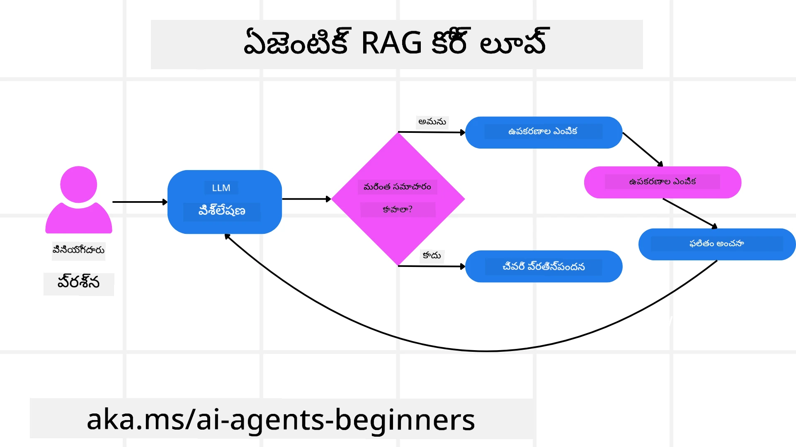
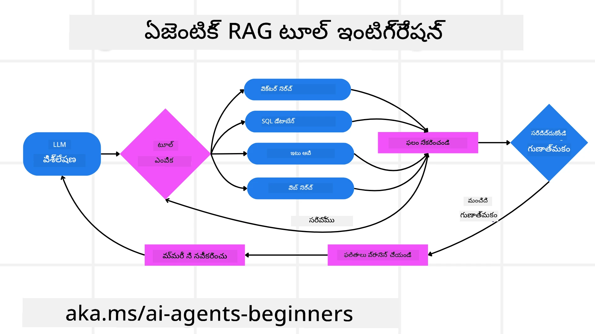
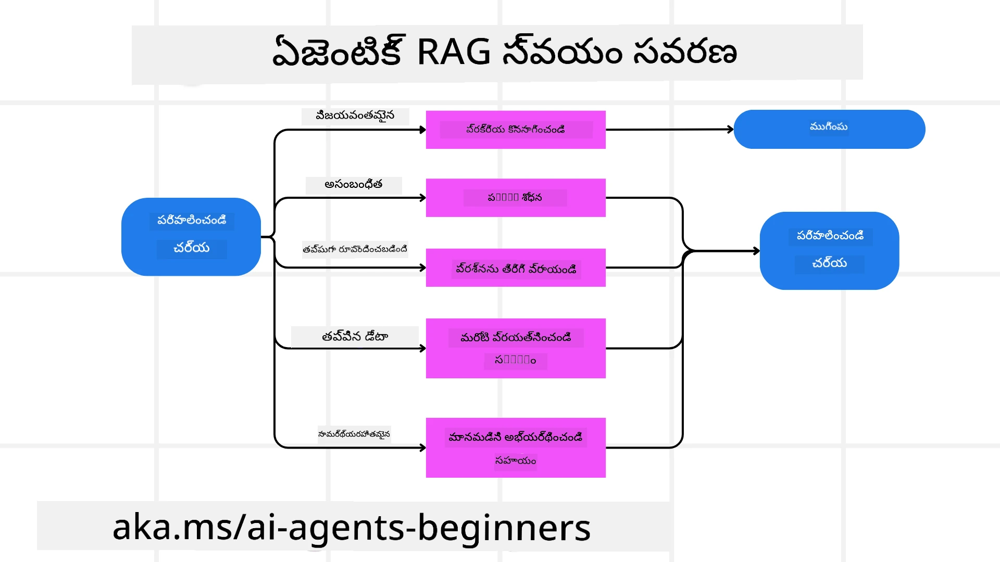

<!--
CO_OP_TRANSLATOR_METADATA:
{
  "original_hash": "0ebf6b2290db55dbf2d10cc49655523b",
  "translation_date": "2025-12-03T15:50:27+00:00",
  "source_file": "05-agentic-rag/README.md",
  "language_code": "te"
}
-->

> _(ఈ పాఠం వీడియోను చూడటానికి పై చిత్రంపై క్లిక్ చేయండి)_

# ఏజెంటిక్ RAG

ఈ పాఠం ఏజెంటిక్ రిట్రీవల్-ఆగ్మెంటెడ్ జనరేషన్ (Agentic RAG) అనే కొత్త AI పారడైగంపై సమగ్ర అవగాహనను అందిస్తుంది, ఇందులో పెద్ద భాషా మోడల్స్ (LLMs) స్వతంత్రంగా తమ తదుపరి దశలను ప్రణాళిక చేసుకుంటూ, బాహ్య వనరుల నుండి సమాచారం పొందుతాయి. స్థిరమైన రిట్రీవ్-తదుపరి-రీడ్ నమూనాలకు భిన్నంగా, ఏజెంటిక్ RAG పునరావృతంగా LLM కాల్స్, టూల్ లేదా ఫంక్షన్ కాల్స్, మరియు నిర్మిత అవుట్‌పుట్‌లతో కూడిన చక్రాన్ని కలిగి ఉంటుంది. ఈ వ్యవస్థ ఫలితాలను అంచనా వేస్తుంది, ప్రశ్నలను మెరుగుపరుస్తుంది, అవసరమైతే అదనపు టూల్స్‌ను ఉపయోగిస్తుంది, మరియు తగిన పరిష్కారం లభించే వరకు ఈ చక్రాన్ని కొనసాగిస్తుంది.

## పరిచయం

ఈ పాఠం కవర్ చేస్తుంది:

- **ఏజెంటిక్ RAGను అర్థం చేసుకోవడం:** పెద్ద భాషా మోడల్స్ (LLMs) స్వతంత్రంగా తమ తదుపరి దశలను ప్రణాళిక చేసుకుంటూ, బాహ్య డేటా వనరుల నుండి సమాచారం పొందే కొత్త AI పారడైగం గురించి తెలుసుకోండి.
- **పునరావృత మేకర్-చెకర్ శైలి:** సరైనతను మెరుగుపరచడానికి మరియు తప్పుగా రూపొందించిన ప్రశ్నలను నిర్వహించడానికి రూపొందించిన పునరావృత LLM కాల్స్, టూల్ లేదా ఫంక్షన్ కాల్స్, మరియు నిర్మిత అవుట్‌పుట్‌ల చక్రాన్ని అర్థం చేసుకోండి.
- **ప్రాక్టికల్ అప్లికేషన్లను అన్వేషించడం:** సరైనతకు ప్రాధాన్యత ఉన్న వాతావరణాలు, సంక్లిష్టమైన డేటాబేస్ పరస్పర చర్యలు, మరియు విస్తృత వర్క్‌ఫ్లో వంటి సందర్భాలను గుర్తించండి.

## అభ్యాస లక్ష్యాలు

ఈ పాఠం పూర్తయ్యాక, మీరు ఈ విషయాలను తెలుసుకుంటారు/అర్థం చేసుకుంటారు:

- **ఏజెంటిక్ RAGను అర్థం చేసుకోవడం:** పెద్ద భాషా మోడల్స్ (LLMs) స్వతంత్రంగా తమ తదుపరి దశలను ప్రణాళిక చేసుకుంటూ, బాహ్య డేటా వనరుల నుండి సమాచారం పొందే కొత్త AI పారడైగం గురించి తెలుసుకోండి.
- **పునరావృత మేకర్-చెకర్ శైలి:** సరైనతను మెరుగుపరచడానికి మరియు తప్పుగా రూపొందించిన ప్రశ్నలను నిర్వహించడానికి రూపొందించిన పునరావృత LLM కాల్స్, టూల్ లేదా ఫంక్షన్ కాల్స్, మరియు నిర్మిత అవుట్‌పుట్‌ల చక్రాన్ని అర్థం చేసుకోండి.
- **తర్క ప్రక్రియను స్వంతం చేసుకోవడం:** వ్యవస్థ తన తర్క ప్రక్రియను స్వంతం చేసుకోవడం, ముందుగా నిర్వచించిన మార్గాలపై ఆధారపడకుండా సమస్యలను ఎలా ఎదుర్కోవాలో నిర్ణయించడం.
- **వర్క్‌ఫ్లో:** ఏజెంటిక్ మోడల్ స్వతంత్రంగా మార్కెట్ ట్రెండ్ రిపోర్ట్‌లను రిట్రీవ్ చేయడం, పోటీదారుల డేటాను గుర్తించడం, అంతర్గత సేల్స్ మెట్రిక్స్‌ను అనుసంధానించడం, ఫైండింగ్‌లను సింథసైజ్ చేయడం, మరియు వ్యూహాన్ని అంచనా వేయడం వంటి నిర్ణయాలను ఎలా తీసుకుంటుందో అర్థం చేసుకోండి.
- **పునరావృత చక్రాలు, టూల్ ఇంటిగ్రేషన్, మరియు మెమరీ:** పునరావృత పరస్పర చర్య నమూనాపై ఆధారపడే వ్యవస్థ గురించి తెలుసుకోండి, పునరావృత చక్రాలను నివారించడానికి మరియు సమాచారం ఆధారంగా నిర్ణయాలు తీసుకోవడానికి మెమరీని నిర్వహించడం.
- **విఫలత మోడ్‌లను నిర్వహించడం మరియు స్వీయ-సరిదిద్దడం:** పునరావృతం మరియు రీ-క్వెరీ చేయడం, డయాగ్నస్టిక్ టూల్స్ ఉపయోగించడం, మరియు మానవ పర్యవేక్షణపై ఆధారపడడం వంటి వ్యవస్థ యొక్క బలమైన స్వీయ-సరిదిద్దే మెకానిజంలను అన్వేషించండి.
- **ఏజెన్సీ యొక్క పరిమితులు:** డొమైన్-స్పెసిఫిక్ స్వతంత్రత, మౌలిక సదుపాయాలపై ఆధారపడడం, మరియు గార్డ్రైల్స్‌కు గౌరవం వంటి ఏజెంటిక్ RAG పరిమితులను అర్థం చేసుకోండి.
- **ప్రాక్టికల్ యూజ్ కేసులు మరియు విలువ:** సరైనతకు ప్రాధాన్యత ఉన్న వాతావరణాలు, సంక్లిష్టమైన డేటాబేస్ పరస్పర చర్యలు, మరియు విస్తృత వర్క్‌ఫ్లో వంటి సందర్భాలను గుర్తించండి.
- **గవర్నెన్స్, పారదర్శకత, మరియు నమ్మకం:** వివరణాత్మక తర్కం, పక్షపాతం నియంత్రణ, మరియు మానవ పర్యవేక్షణ యొక్క ప్రాముఖ్యత గురించి తెలుసుకోండి.

## ఏజెంటిక్ RAG అంటే ఏమిటి?

ఏజెంటిక్ రిట్రీవల్-ఆగ్మెంటెడ్ జనరేషన్ (Agentic RAG) అనేది ఒక కొత్త AI పారడైగం, ఇందులో పెద్ద భాషా మోడల్స్ (LLMs) స్వతంత్రంగా తమ తదుపరి దశలను ప్రణాళిక చేసుకుంటూ, బాహ్య వనరుల నుండి సమాచారం పొందుతాయి. స్థిరమైన రిట్రీవ్-తదుపరి-రీడ్ నమూనాలకు భిన్నంగా, ఏజెంటిక్ RAG పునరావృతంగా LLM కాల్స్, టూల్ లేదా ఫంక్షన్ కాల్స్, మరియు నిర్మిత అవుట్‌పుట్‌లతో కూడిన చక్రాన్ని కలిగి ఉంటుంది. ఈ వ్యవస్థ ఫలితాలను అంచనా వేస్తుంది, ప్రశ్నలను మెరుగుపరుస్తుంది, అవసరమైతే అదనపు టూల్స్‌ను ఉపయోగిస్తుంది, మరియు తగిన పరిష్కారం లభించే వరకు ఈ చక్రాన్ని కొనసాగిస్తుంది. ఈ పునరావృత “మేకర్-చెకర్” శైలి సరైనతను మెరుగుపరచడానికి, తప్పుగా రూపొందించిన ప్రశ్నలను నిర్వహించడానికి, మరియు అధిక నాణ్యత గల ఫలితాలను నిర్ధారించడానికి రూపొందించబడింది.

వ్యవస్థ తన తర్క ప్రక్రియను స్వంతం చేసుకుంటుంది, విఫలమైన ప్రశ్నలను తిరిగి రాయడం, వేరే రిట్రీవల్ పద్ధతులను ఎంచుకోవడం, మరియు ఫైనల్ సమాధానాన్ని తేల్చడానికి వేరే టూల్స్‌ను అనుసంధానించడం—ఉదాహరణకు Azure AI Searchలో వెక్టర్ సెర్చ్, SQL డేటాబేస్‌లు, లేదా కస్టమ్ APIలు. ఏజెంటిక్ వ్యవస్థ యొక్క ప్రత్యేక లక్షణం దాని తర్క ప్రక్రియను స్వంతం చేసుకోవడం. సంప్రదాయ RAG అమలు ముందుగా నిర్వచించిన మార్గాలపై ఆధారపడతాయి, కానీ ఏజెంటిక్ వ్యవస్థ దాని కనుగొన్న సమాచారం నాణ్యత ఆధారంగా దశల క్రమాన్ని స్వతంత్రంగా నిర్ణయిస్తుంది.

## ఏజెంటిక్ రిట్రీవల్-ఆగ్మెంటెడ్ జనరేషన్ (Agentic RAG) నిర్వచనం

ఏజెంటిక్ రిట్రీవల్-ఆగ్మెంటెడ్ జనరేషన్ (Agentic RAG) అనేది AI అభివృద్ధిలో ఒక కొత్త పారడైగం, ఇందులో LLMలు బాహ్య డేటా వనరుల నుండి సమాచారం పొందడమే కాకుండా, తమ తదుపరి దశలను స్వతంత్రంగా ప్రణాళిక చేస్తాయి. స్థిరమైన రిట్రీవ్-తదుపరి-రీడ్ నమూనాలు లేదా జాగ్రత్తగా స్క్రిప్ట్ చేయబడిన ప్రాంప్ట్ సీక్వెన్స్‌లకు భిన్నంగా, ఏజెంటిక్ RAG పునరావృత LLM కాల్స్, టూల్ లేదా ఫంక్షన్ కాల్స్, మరియు నిర్మిత అవుట్‌పుట్‌ల చక్రాన్ని కలిగి ఉంటుంది. ప్రతి దశలో, వ్యవస్థ పొందిన ఫలితాలను అంచనా వేస్తుంది, ప్రశ్నలను మెరుగుపరచాలా లేదా అదనపు టూల్స్‌ను ఉపయోగించాలా అని నిర్ణయిస్తుంది, మరియు తగిన పరిష్కారం లభించే వరకు ఈ చక్రాన్ని కొనసాగిస్తుంది.

ఈ పునరావృత “మేకర్-చెకర్” శైలి సరైనతను మెరుగుపరచడానికి, తప్పుగా రూపొందించిన ప్రశ్నలను నిర్వహించడానికి, మరియు అధిక నాణ్యత గల ఫలితాలను నిర్ధారించడానికి రూపొందించబడింది. జాగ్రత్తగా ఇంజినీరింగ్ చేయబడిన ప్రాంప్ట్ చైన్లపై మాత్రమే ఆధారపడకుండా, వ్యవస్థ తన తర్క ప్రక్రియను స్వంతం చేసుకుంటుంది. ఇది విఫలమైన ప్రశ్నలను తిరిగి రాయగలదు, వేరే రిట్రీవల్ పద్ధతులను ఎంచుకోగలదు, మరియు ఫైనల్ సమాధానాన్ని తేల్చడానికి వెక్టర్ సెర్చ్, SQL డేటాబేస్‌లు, లేదా కస్టమ్ APIలు వంటి అనేక టూల్స్‌ను అనుసంధానించగలదు. ఇది అధిక సంక్లిష్ట ఆర్కెస్ట్రేషన్ ఫ్రేమ్‌వర్క్‌ల అవసరాన్ని తొలగిస్తుంది. బదులుగా, “LLM కాల్ → టూల్ ఉపయోగం → LLM కాల్ → …” అనే సరళమైన చక్రం సొఫిస్టికేటెడ్ మరియు బాగా ఆధారపడిన అవుట్‌పుట్‌లను అందించగలదు.

## తర్క ప్రక్రియను స్వంతం చేసుకోవడం

ఏ వ్యవస్థను “ఏజెంటిక్”గా చేస్తుందో ప్రత్యేక లక్షణం దాని తర్క ప్రక్రియను స్వంతం చేసుకోవడం. సంప్రదాయ RAG అమలు తరచుగా మోడల్ కోసం మార్గాన్ని ముందుగా నిర్వచించడానికి మనుషులపై ఆధారపడతాయి: ఏది రిట్రీవ్ చేయాలి మరియు ఎప్పుడు చేయాలో చెప్పే చైన్-ఆఫ్-థాట్. కానీ ఒక వ్యవస్థ నిజంగా ఏజెంటిక్‌గా ఉన్నప్పుడు, అది సమస్యను ఎలా ఎదుర్కోవాలో అంతర్గతంగా నిర్ణయిస్తుంది. ఇది కేవలం స్క్రిప్ట్‌ను అమలు చేయడం కాదు; ఇది కనుగొన్న సమాచారం నాణ్యత ఆధారంగా దశల క్రమాన్ని స్వతంత్రంగా నిర్ణయిస్తుంది.

ఉదాహరణకు, ఒక ప్రోడక్ట్ లాంచ్ వ్యూహాన్ని సృష్టించమని అడిగితే, అది మొత్తం పరిశోధన మరియు నిర్ణయ ప్రక్రియను వివరించే ప్రాంప్ట్‌పై మాత్రమే ఆధారపడదు. బదులుగా, ఏజెంటిక్ మోడల్ స్వతంత్రంగా నిర్ణయిస్తుంది:

1. Bing Web Grounding ఉపయోగించి ప్రస్తుత మార్కెట్ ట్రెండ్ రిపోర్ట్‌లను రిట్రీవ్ చేయడం.
2. Azure AI Search ఉపయోగించి సంబంధిత పోటీదారుల డేటాను గుర్తించడం.
3. Azure SQL డేటాబేస్ ఉపయోగించి చారిత్రాత్మక అంతర్గత సేల్స్ మెట్రిక్స్‌ను అనుసంధానించడం.
4. Azure OpenAI Service ద్వారా సమన్వయంతో ఫైండింగ్‌లను సింథసైజ్ చేయడం.
5. వ్యూహంలో గ్యాప్‌లు లేదా అసంగతతలను అంచనా వేయడం, అవసరమైతే మరొక రౌండ్ రిట్రీవల్‌ను ప్రాంప్ట్ చేయడం.

ఈ అన్ని దశలు—ప్రశ్నలను మెరుగుపరచడం, వనరులను ఎంచుకోవడం, సమాధానంతో “సంతోషంగా” ఉండే వరకు పునరావృతం చేయడం—మోడల్ ద్వారా నిర్ణయించబడతాయి, మనిషి ద్వారా ముందుగా స్క్రిప్ట్ చేయబడవు.

## పునరావృత చక్రాలు, టూల్ ఇంటిగ్రేషన్, మరియు మెమరీ

ఏజెంటిక్ వ్యవస్థ ఒక లూప్ చేసిన పరస్పర చర్య నమూనాపై ఆధారపడుతుంది:

- **ప్రారంభ కాల్:** వినియోగదారుని లక్ష్యం (అka. యూజర్ ప్రాంప్ట్) LLMకు అందించబడుతుంది.
- **టూల్ ఆహ్వానం:** మోడల్ సమాచారం లేకపోవడం లేదా అస్పష్టమైన సూచనలను గుర్తిస్తే, అది టూల్ లేదా రిట్రీవల్ పద్ధతిని ఎంచుకుంటుంది—ఉదాహరణకు వెక్టర్ డేటాబేస్ క్వెరీ (ఉదా. Azure AI Search హైబ్రిడ్ సెర్చ్ ప్రైవేట్ డేటాపై) లేదా నిర్మిత SQL కాల్—మరింత సందర్భాన్ని సేకరించడానికి.
- **అంచనా & మెరుగుదల:** తిరిగి వచ్చిన డేటాను సమీక్షించిన తర్వాత, మోడల్ సమాచారం సరిపోతుందా అని నిర్ణయిస్తుంది. సరిపోకపోతే, అది ప్రశ్నను మెరుగుపరుస్తుంది, వేరే టూల్‌ను ప్రయత్నిస్తుంది, లేదా దాని దృక్పథాన్ని సర్దుబాటు చేస్తుంది.
- **సంతృప్తి చెందే వరకు పునరావృతం:** ఈ చక్రం మోడల్ తగిన స్పష్టత మరియు ఆధారాలను కలిగి ఉన్నట్లు నిర్ణయించే వరకు కొనసాగుతుంది.
- **మెమరీ & స్టేట్:** వ్యవస్థ దశల మధ్య స్టేట్ మరియు మెమరీని నిర్వహించగలదు, ఇది గత ప్రయత్నాలను మరియు వాటి ఫలితాలను గుర్తుంచుకోవడానికి, పునరావృత చక్రాలను నివారించడానికి, మరియు ముందుకు సాగుతున్నప్పుడు మరింత సమాచారం ఆధారంగా నిర్ణయాలు తీసుకోవడానికి సహాయపడుతుంది.

సమయం గడిచేకొద్దీ, ఇది అభివృద్ధి చెందుతున్న అవగాహన భావనను సృష్టిస్తుంది, మోడల్‌ను సంక్లిష్టమైన, బహుళ-దశల పనులను నావిగేట్ చేయడానికి అనుమతిస్తుంది, మానవుడు నిరంతరం జోక్యం చేసుకోవడం లేదా ప్రాంప్ట్‌ను పునరాకృతం చేయడం అవసరం లేకుండా.

## విఫలత మోడ్‌లను నిర్వహించడం మరియు స్వీయ-సరిదిద్దడం

ఏజెంటిక్ RAG యొక్క స్వతంత్రత బలమైన స్వీయ-సరిదిద్దే మెకానిజంలను కూడా కలిగి ఉంటుంది. వ్యవస్థ డెడ్ ఎండ్‌లను ఎదుర్కొన్నప్పుడు—ఉదాహరణకు అసంబంధిత డాక్యుమెంట్‌లను రిట్రీవ్ చేయడం లేదా తప్పుగా రూపొందించిన ప్రశ్నలను ఎదుర్కొనడం—ఇది:

- **పునరావృతం మరియు రీ-క్వెరీ చేయడం:** తక్కువ విలువ గల ప్రతిస్పందనలను తిరిగి ఇవ్వడం బదులుగా, మోడల్ కొత్త సెర్చ్ వ్యూహాలను ప్రయత్నిస్తుంది, డేటాబేస్ ప్రశ్నలను తిరిగి రాస్తుంది, లేదా ప్రత్యామ్నాయ డేటా సెట్‌లను చూస్తుంది.
- **డయాగ్నస్టిక్ టూల్స్ ఉపయోగించడం:** వ్యవస్థ దాని తర్క దశలను డీబగ్ చేయడానికి లేదా రిట్రీవ్ చేసిన డేటా సరైనతను నిర్ధారించడానికి రూపొందించిన అదనపు ఫంక్షన్‌లను ఆహ్వానించవచ్చు. Azure AI Tracing వంటి టూల్స్ బలమైన పరిశీలన మరియు మానిటరింగ్‌ను ప్రారంభించడానికి ముఖ్యమైనవి.
- **మానవ పర్యవేక్షణపై ఆధారపడడం:** అధిక-ప్రముఖత లేదా పునరావృతంగా విఫలమయ్యే సందర్భాల్లో, మోడల్ అనిశ్చితిని ఫ్లాగ్ చేసి మానవ మార్గదర్శకతను అభ్యర్థించవచ్చు. ఒకసారి మానవుడు సరిదిద్దే ఫీడ్‌బ్యాక్‌ను అందించిన తర్వాత, మోడల్ ఆ పాఠాన్ని ముందుకు తీసుకెళ్లగలదు.

ఈ పునరావృత మరియు డైనమిక్ దృక్పథం మోడల్ నిరంతరం మెరుగుపడటానికి అనుమతిస్తుంది, ఇది కేవలం ఒకసారి-షాట్ వ్యవస్థ కాదు, కానీ ఒక సెషన్ సమయంలో దాని తప్పిదాల నుండి నేర్చుకునే వ్యవస్థ.

## ఏజెన్సీ యొక్క పరిమితులు

ఒక పనిలో దాని స్వతంత్రత ఉన్నప్పటికీ, ఏజెంటిక్ RAG ఆర్టిఫిషియల్ జనరల్ ఇంటెలిజెన్స్‌కు సమానమైనది కాదు. దాని “ఏజెంటిక్” సామర్థ్యాలు మానవ డెవలపర్‌లు అందించిన టూల్స్, డేటా వనరులు, మరియు విధానాలకు పరిమితం చేయబడ్డాయి. ఇది దాని స్వంత టూల్స్‌ను ఆవిష్కరించలేదు లేదా సెట్ చేసిన డొమైన్ పరిమితుల నుండి బయటకు వెళ్లలేదు. బదులుగా, ఇది అందుబాటులో ఉన్న వనరులను డైనమిక్‌గా సమన్వయం చేయడంలో అద్భుతంగా ఉంటుంది.

మరింత అభివృద్ధి చెందిన AI రూపాల నుండి కీలక తేడాలు:

1. **డొమైన్-స్పెసిఫిక్ స్వతంత్రత:** ఏజెంటిక్ RAG వ్యవస్థలు వినియోగదారుని నిర్వచించిన లక్ష్యాలను సాధించడంపై దృష్టి సారిస్తాయి, ఫలితాలను మెరుగుపరచడానికి ప్రశ్న రీ-రైటింగ్ లేదా టూల్ ఎంపిక వంటి వ్యూహాలను ఉపయోగిస్తాయి.
2. **ఇన్‌ఫ్రాస్ట్రక్చర్-డిపెండెంట్:** వ్యవస్థ యొక్క సామర్థ్యాలు డెవలపర్‌లు సమన్వయం చేసిన టూల
- <a href="https://ragaboutit.com/agentic-rag-a-complete-guide-to-agent-based-retrieval-augmented-generation/" target="_blank">Agentic RAG: ఏజెంట్ ఆధారిత రిట్రీవల్ ఆగ్మెంటెడ్ జనరేషన్ పై పూర్తి గైడ్ – జనరేషన్ RAG నుండి వార్తలు</a>
- <a href="https://huggingface.co/learn/cookbook/agent_rag" target="_blank">Agentic RAG: మీ RAG ను క్వెరీ రీఫార్ములేషన్ మరియు సెల్ఫ్-క్వెరీతో వేగవంతం చేయండి! Hugging Face ఓపెన్-సోర్స్ AI కుక్‌బుక్</a>
- <a href="https://youtu.be/aQ4yQXeB1Ss?si=2HUqBzHoeB5tR04U" target="_blank">RAG కు ఏజెంటిక్ లేయర్లను జోడించడం</a>
- <a href="https://www.youtube.com/watch?v=zeAyuLc_f3Q&t=244s" target="_blank">జ్ఞాన సహాయకుల భవిష్యత్తు: జెర్రీ లియూ</a>
- <a href="https://www.youtube.com/watch?v=AOSjiXP1jmQ" target="_blank">Agentic RAG సిస్టమ్స్ ఎలా నిర్మించాలి</a>
- <a href="https://ignite.microsoft.com/sessions/BRK102?source=sessions" target="_blank">మీ AI ఏజెంట్లను స్కేల్ చేయడానికి Azure AI Foundry Agent Service ఉపయోగించడం</a>

### అకడమిక్ పేపర్లు

- <a href="https://arxiv.org/abs/2303.17651" target="_blank">2303.17651 Self-Refine: స్వీయ-ఫీడ్‌బ్యాక్‌తో పునరావృత శుద్ధి</a>
- <a href="https://arxiv.org/abs/2303.11366" target="_blank">2303.11366 Reflexion: వర్బల్ రీన్‌ఫోర్స్‌మెంట్ లెర్నింగ్‌తో లాంగ్వేజ్ ఏజెంట్లు</a>
- <a href="https://arxiv.org/abs/2305.11738" target="_blank">2305.11738 CRITIC: టూల్-ఇంటరాక్టివ్ క్రిటికింగ్‌తో లార్జ్ లాంగ్వేజ్ మోడల్స్ స్వీయ-సరిదిద్దుకోగలవు</a>
- <a href="https://arxiv.org/abs/2501.09136" target="_blank">2501.09136 Agentic Retrieval-Augmented Generation: ఏజెంటిక్ RAG పై సర్వే</a>

## మునుపటి పాఠం

[టూల్ యూజ్ డిజైన్ ప్యాటర్న్](../04-tool-use/README.md)

## తదుపరి పాఠం

[నమ్మకమైన AI ఏజెంట్లను నిర్మించడం](../06-building-trustworthy-agents/README.md)

---

<!-- CO-OP TRANSLATOR DISCLAIMER START -->
**అస్వీకరణ**:  
ఈ పత్రం AI అనువాద సేవ [Co-op Translator](https://github.com/Azure/co-op-translator) ఉపయోగించి అనువదించబడింది. మేము ఖచ్చితత్వానికి ప్రయత్నిస్తున్నప్పటికీ, ఆటోమేటెడ్ అనువాదాలు తప్పులు లేదా అసమగ్రతలను కలిగి ఉండవచ్చు. దాని స్వదేశ భాషలో ఉన్న అసలు పత్రాన్ని అధికారం కలిగిన మూలంగా పరిగణించాలి. కీలకమైన సమాచారం కోసం, ప్రొఫెషనల్ మానవ అనువాదాన్ని సిఫారసు చేస్తాము. ఈ అనువాదం ఉపయోగం వల్ల కలిగే ఏవైనా అపార్థాలు లేదా తప్పుదారులు కోసం మేము బాధ్యత వహించము.
<!-- CO-OP TRANSLATOR DISCLAIMER END -->