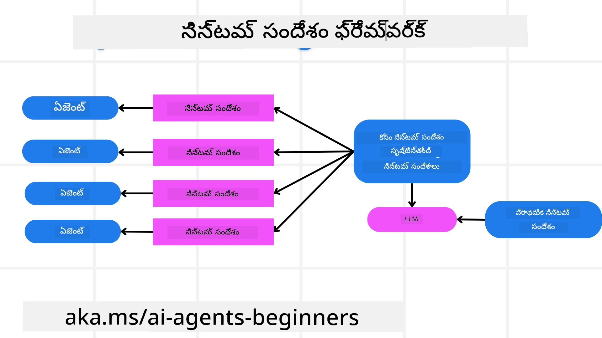
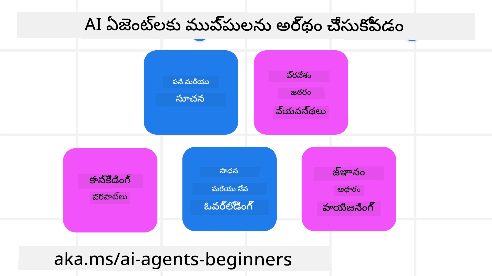
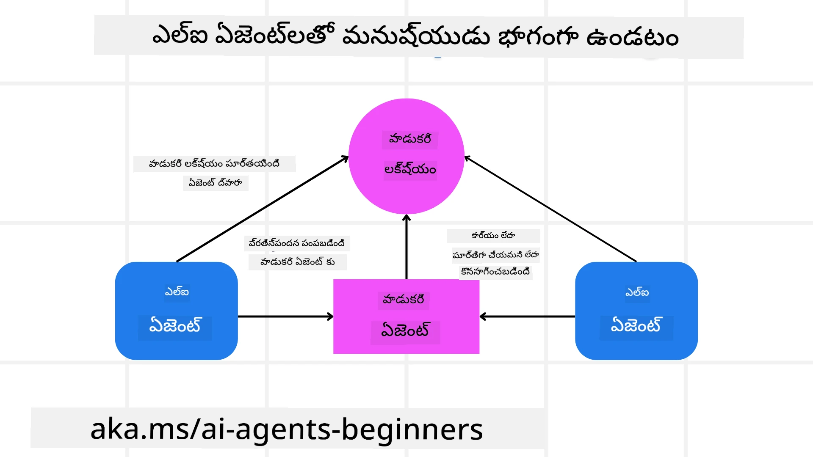

<!--
CO_OP_TRANSLATOR_METADATA:
{
  "original_hash": "498802b4c3c3cc486b86f27a12cebb34",
  "translation_date": "2025-12-03T15:59:57+00:00",
  "source_file": "06-building-trustworthy-agents/README.md",
  "language_code": "te"
}
-->
[](https://youtu.be/iZKkMEGBCUQ?si=Q-kEbcyHUMPoHp8L)

> _(ఈ పాఠానికి సంబంధించిన వీడియోను చూడటానికి పై చిత్రంపై క్లిక్ చేయండి)_

# నమ్మదగిన AI ఏజెంట్లను నిర్మించడం

## పరిచయం

ఈ పాఠంలో మీరు నేర్చుకునే విషయాలు:

- సురక్షితమైన మరియు సమర్థవంతమైన AI ఏజెంట్లను ఎలా నిర్మించాలి మరియు అమలు చేయాలి
- AI ఏజెంట్లను అభివృద్ధి చేసే సమయంలో ముఖ్యమైన భద్రతా అంశాలు
- డేటా మరియు వినియోగదారుల గోప్యతను ఎలా కాపాడుకోవాలి

## నేర్చుకునే లక్ష్యాలు

ఈ పాఠాన్ని పూర్తిచేసిన తర్వాత, మీరు తెలుసుకుంటారు:

- AI ఏజెంట్లను సృష్టించే సమయంలో ప్రమాదాలను గుర్తించి తగ్గించడం
- డేటా మరియు యాక్సెస్ సక్రమంగా నిర్వహించబడేలా భద్రతా చర్యలను అమలు చేయడం
- డేటా గోప్యతను కాపాడుతూ, నాణ్యమైన వినియోగదారుల అనుభవాన్ని అందించే AI ఏజెంట్లను సృష్టించడం

## భద్రత

ముందుగా, సురక్షితమైన ఏజెంటిక్ అప్లికేషన్లను నిర్మించడం గురించి తెలుసుకుందాం. భద్రత అంటే AI ఏజెంట్ డిజైన్ చేసిన విధంగా పనిచేయడం. ఏజెంటిక్ అప్లికేషన్లను రూపొందించే వారు, భద్రతను గరిష్టం చేయడానికి పద్ధతులు మరియు సాధనాలను కలిగి ఉంటారు:

### సిస్టమ్ మెసేజ్ ఫ్రేమ్‌వర్క్ నిర్మించడం

మీరు ఎప్పుడైనా పెద్ద భాషా మోడల్స్ (LLMs) ఉపయోగించి AI అప్లికేషన్‌ను నిర్మించి ఉంటే, దృఢమైన సిస్టమ్ ప్రాంప్ట్ లేదా సిస్టమ్ మెసేజ్ డిజైన్ చేయడం ఎంత ముఖ్యమో మీకు తెలుసు. ఈ ప్రాంప్ట్‌లు LLM వినియోగదారులతో మరియు డేటాతో ఎలా ఇంటరాక్ట్ అవుతుందో నిర్ధారించే మెటా నియమాలు, సూచనలు మరియు మార్గదర్శకాలను స్థాపిస్తాయి.

AI ఏజెంట్లకు, సిస్టమ్ ప్రాంప్ట్ మరింత ముఖ్యమైనది, ఎందుకంటే AI ఏజెంట్లు మనం రూపొందించిన పనులను పూర్తి చేయడానికి చాలా ప్రత్యేకమైన సూచనలను అవసరం చేస్తుంది.

మనం ఒక లేదా అంతకంటే ఎక్కువ ఏజెంట్లను మన అప్లికేషన్‌లో నిర్మించడానికి స్కేలబుల్ సిస్టమ్ ప్రాంప్ట్‌లను సృష్టించడానికి సిస్టమ్ మెసేజ్ ఫ్రేమ్‌వర్క్‌ను ఉపయోగించవచ్చు:



#### దశ 1: మెటా సిస్టమ్ మెసేజ్ సృష్టించండి

మెటా ప్రాంప్ట్‌ను మనం సృష్టించే ఏజెంట్లకు సిస్టమ్ ప్రాంప్ట్‌లను రూపొందించడానికి LLM ఉపయోగిస్తుంది. దీన్ని టెంప్లేట్‌గా రూపొందిస్తాము, తద్వారా అవసరమైతే అనేక ఏజెంట్లను సమర్థవంతంగా సృష్టించవచ్చు.

ఇదిగో ఒక ఉదాహరణ మెటా సిస్టమ్ మెసేజ్:

```plaintext
You are an expert at creating AI agent assistants. 
You will be provided a company name, role, responsibilities and other
information that you will use to provide a system prompt for.
To create the system prompt, be descriptive as possible and provide a structure that a system using an LLM can better understand the role and responsibilities of the AI assistant. 
```

#### దశ 2: ప్రాథమిక ప్రాంప్ట్ సృష్టించండి

తదుపరి దశ AI ఏజెంట్‌ను వివరించడానికి ప్రాథమిక ప్రాంప్ట్‌ను సృష్టించడం. మీరు ఏజెంట్ పాత్ర, ఏజెంట్ పూర్తి చేసే పనులు మరియు ఏజెంట్ యొక్క ఇతర బాధ్యతలను చేర్చాలి.

ఇదిగో ఒక ఉదాహరణ:

```plaintext
You are a travel agent for Contoso Travel that is great at booking flights for customers. To help customers you can perform the following tasks: lookup available flights, book flights, ask for preferences in seating and times for flights, cancel any previously booked flights and alert customers on any delays or cancellations of flights.  
```

#### దశ 3: ప్రాథమిక సిస్టమ్ మెసేజ్‌ను LLMకు అందించండి

ఇప్పుడు మెటా సిస్టమ్ మెసేజ్‌ను సిస్టమ్ మెసేజ్‌గా మరియు మన ప్రాథమిక సిస్టమ్ మెసేజ్‌ను అందించడం ద్వారా ఈ సిస్టమ్ మెసేజ్‌ను ఆప్టిమైజ్ చేయవచ్చు.

ఇది మన AI ఏజెంట్లను గైడ్ చేయడానికి మెరుగైన సిస్టమ్ మెసేజ్‌ను ఉత్పత్తి చేస్తుంది:

```markdown
**Company Name:** Contoso Travel  
**Role:** Travel Agent Assistant

**Objective:**  
You are an AI-powered travel agent assistant for Contoso Travel, specializing in booking flights and providing exceptional customer service. Your main goal is to assist customers in finding, booking, and managing their flights, all while ensuring that their preferences and needs are met efficiently.

**Key Responsibilities:**

1. **Flight Lookup:**
    
    - Assist customers in searching for available flights based on their specified destination, dates, and any other relevant preferences.
    - Provide a list of options, including flight times, airlines, layovers, and pricing.
2. **Flight Booking:**
    
    - Facilitate the booking of flights for customers, ensuring that all details are correctly entered into the system.
    - Confirm bookings and provide customers with their itinerary, including confirmation numbers and any other pertinent information.
3. **Customer Preference Inquiry:**
    
    - Actively ask customers for their preferences regarding seating (e.g., aisle, window, extra legroom) and preferred times for flights (e.g., morning, afternoon, evening).
    - Record these preferences for future reference and tailor suggestions accordingly.
4. **Flight Cancellation:**
    
    - Assist customers in canceling previously booked flights if needed, following company policies and procedures.
    - Notify customers of any necessary refunds or additional steps that may be required for cancellations.
5. **Flight Monitoring:**
    
    - Monitor the status of booked flights and alert customers in real-time about any delays, cancellations, or changes to their flight schedule.
    - Provide updates through preferred communication channels (e.g., email, SMS) as needed.

**Tone and Style:**

- Maintain a friendly, professional, and approachable demeanor in all interactions with customers.
- Ensure that all communication is clear, informative, and tailored to the customer's specific needs and inquiries.

**User Interaction Instructions:**

- Respond to customer queries promptly and accurately.
- Use a conversational style while ensuring professionalism.
- Prioritize customer satisfaction by being attentive, empathetic, and proactive in all assistance provided.

**Additional Notes:**

- Stay updated on any changes to airline policies, travel restrictions, and other relevant information that could impact flight bookings and customer experience.
- Use clear and concise language to explain options and processes, avoiding jargon where possible for better customer understanding.

This AI assistant is designed to streamline the flight booking process for customers of Contoso Travel, ensuring that all their travel needs are met efficiently and effectively.

```

#### దశ 4: పునరావృతం చేసి మెరుగుపరచండి

ఈ సిస్టమ్ మెసేజ్ ఫ్రేమ్‌వర్క్ విలువ అనేక ఏజెంట్ల కోసం సిస్టమ్ మెసేజ్‌లను సులభంగా సృష్టించడంలో మరియు మీ సిస్టమ్ మెసేజ్‌లను కాలక్రమేణా మెరుగుపరచడంలో ఉంది. మీ పూర్తి వినియోగదారు సందర్భానికి మొదటిసారి పనిచేసే సిస్టమ్ మెసేజ్ ఉండటం అరుదు. ప్రాథమిక సిస్టమ్ మెసేజ్‌ను మార్చడం ద్వారా చిన్న మార్పులు మరియు మెరుగుదలలను చేయడం, మరియు సిస్టమ్ ద్వారా దాన్ని నడపడం ద్వారా ఫలితాలను పోల్చి, అంచనా వేయడం సాధ్యమవుతుంది.

## ముప్పులను అర్థం చేసుకోవడం

నమ్మదగిన AI ఏజెంట్లను నిర్మించడానికి, మీ AI ఏజెంట్‌కు సంబంధించిన ప్రమాదాలు మరియు ముప్పులను అర్థం చేసుకుని తగ్గించడం ముఖ్యం. AI ఏజెంట్లకు సంబంధించిన కొన్ని ముప్పులను మరియు వాటిని ఎలా ఎదుర్కోవాలో చూద్దాం.



### పనులు మరియు సూచనలు

**వివరణ:** దాడి చేసేవారు ప్రాంప్ట్‌లను లేదా ఇన్‌పుట్‌లను మార్చడం ద్వారా AI ఏజెంట్ యొక్క సూచనలు లేదా లక్ష్యాలను మార్చడానికి ప్రయత్నిస్తారు.

**తగ్గింపు:** AI ఏజెంట్ ప్రాసెస్ చేయడానికి ముందు ప్రమాదకరమైన ప్రాంప్ట్‌లను గుర్తించడానికి ధృవీకరణ తనిఖీలు మరియు ఇన్‌పుట్ ఫిల్టర్లను అమలు చేయండి. ఈ దాడులు సాధారణంగా ఏజెంట్‌తో తరచుగా ఇంటరాక్ట్ కావడం అవసరం చేస్తాయి, కాబట్టి సంభాషణలో టర్న్‌ల సంఖ్యను పరిమితం చేయడం ఈ రకమైన దాడులను నివారించడానికి మరో మార్గం.

### ముఖ్యమైన వ్యవస్థల యాక్సెస్

**వివరణ:** ఒక AI ఏజెంట్ సున్నితమైన డేటాను నిల్వ చేసే వ్యవస్థలు మరియు సేవలకు యాక్సెస్ కలిగి ఉంటే, దాడి చేసేవారు ఈ సేవలతో ఏజెంట్ కమ్యూనికేషన్‌ను కాంప్రమైజ్ చేయవచ్చు. ఇవి ప్రత్యక్ష దాడులు లేదా ఈ వ్యవస్థల గురించి సమాచారం పొందడానికి పరోక్ష ప్రయత్నాలు కావచ్చు.

**తగ్గింపు:** ఈ రకమైన దాడులను నివారించడానికి AI ఏజెంట్లు అవసరమైనప్పుడు మాత్రమే వ్యవస్థలకు యాక్సెస్ కలిగి ఉండాలి. ఏజెంట్ మరియు వ్యవస్థ మధ్య కమ్యూనికేషన్ సురక్షితంగా ఉండాలి. ప్రామాణీకరణ మరియు యాక్సెస్ నియంత్రణను అమలు చేయడం ద్వారా ఈ సమాచారాన్ని రక్షించవచ్చు.

### వనరులు మరియు సేవల ఓవర్‌లోడింగ్

**వివరణ:** AI ఏజెంట్లు పనులను పూర్తి చేయడానికి వివిధ సాధనాలు మరియు సేవలను యాక్సెస్ చేస్తాయి. దాడి చేసేవారు ఈ సామర్థ్యాన్ని ఉపయోగించి, AI ఏజెంట్ ద్వారా అధిక సంఖ్యలో అభ్యర్థనలు పంపడం ద్వారా ఈ సేవలను దాడి చేయవచ్చు, ఇది వ్యవస్థ వైఫల్యాలు లేదా అధిక ఖర్చులకు దారితీస్తుంది.

**తగ్గింపు:** ఏ AI ఏజెంట్ ఒక సేవకు చేయగల అభ్యర్థనల సంఖ్యను పరిమితం చేసే విధానాలను అమలు చేయండి. మీ AI ఏజెంట్‌కు సంభాషణ టర్న్‌లను మరియు అభ్యర్థనలను పరిమితం చేయడం ఈ రకమైన దాడులను నివారించడానికి మరో మార్గం.

### నాలెడ్జ్ బేస్ విషపూరితం చేయడం

**వివరణ:** ఈ రకమైన దాడి నేరుగా AI ఏజెంట్‌ను లక్ష్యంగా పెట్టుకోదు కానీ AI ఏజెంట్ ఉపయోగించే నాలెడ్జ్ బేస్ మరియు ఇతర సేవలను లక్ష్యంగా పెట్టుకుంటుంది. ఇది డేటాను లేదా AI ఏజెంట్ పనిని పూర్తి చేయడానికి ఉపయోగించే సమాచారాన్ని కరప్ట్ చేయడం, వినియోగదారుకు పక్షపాత లేదా అనుకోని ప్రతిస్పందనలకు దారితీస్తుంది.

**తగ్గింపు:** AI ఏజెంట్ తన వర్క్‌ఫ్లోలో ఉపయోగించే డేటాను క్రమం తప్పకుండా ధృవీకరించండి. ఈ డేటాకు యాక్సెస్ సురక్షితంగా ఉండేలా మరియు ఈ రకమైన దాడిని నివారించడానికి నమ్మదగిన వ్యక్తులచే మాత్రమే మార్చబడేలా చూసుకోండి.

### కస్కేడింగ్ లోపాలు

**వివరణ:** AI ఏజెంట్లు పనులను పూర్తి చేయడానికి వివిధ సాధనాలు మరియు సేవలను యాక్సెస్ చేస్తాయి. దాడి చేసేవారు సృష్టించిన లోపాలు, AI ఏజెంట్ కనెక్ట్ అయిన ఇతర వ్యవస్థల వైఫల్యాలకు దారితీస్తాయి, దాడి మరింత విస్తృతంగా మరియు పరిష్కరించడానికి కష్టంగా మారుతుంది.

**తగ్గింపు:** దీన్ని నివారించడానికి ఒక పద్ధతి AI ఏజెంట్‌ను పరిమిత వాతావరణంలో పనిచేయించడమే, ఉదాహరణకు, డాకర్ కంటైనర్‌లో పనులను నిర్వహించడం. కొన్ని వ్యవస్థలు లోపంతో స్పందించినప్పుడు ఫాల్బ్యాక్ మెకానిజం మరియు రీట్రై లాజిక్‌ను సృష్టించడం మరొక మార్గం.

## హ్యూమన్-ఇన్-ది-లూప్

నమ్మదగిన AI ఏజెంట్ వ్యవస్థలను నిర్మించడానికి మరొక సమర్థవంతమైన మార్గం హ్యూమన్-ఇన్-ది-లూప్‌ను ఉపయోగించడం. ఇది వినియోగదారులు ఏజెంట్లకు అభిప్రాయం అందించగల ప్రవాహాన్ని సృష్టిస్తుంది. వినియోగదారులు అనుమతి లేదా ప్రాసెస్‌ను నిలిపివేయడం ద్వారా మల్టీ-ఏజెంట్ వ్యవస్థలో ఏజెంట్లుగా పనిచేస్తారు.



ఇదిగో AutoGen ఉపయోగించి ఈ కాన్సెప్ట్‌ను ఎలా అమలు చేయాలో చూపించే కోడ్ స్నిపెట్:

```python

# ఏజెంట్లను సృష్టించండి.
model_client = OpenAIChatCompletionClient(model="gpt-4o-mini")
assistant = AssistantAgent("assistant", model_client=model_client)
user_proxy = UserProxyAgent("user_proxy", input_func=input)  # కన్సోల్ నుండి వినియోగదారుడి ఇన్‌పుట్‌ను పొందడానికి input() ఉపయోగించండి.

# వినియోగదారు "APPROVE" అని చెప్పినప్పుడు సంభాషణను ముగించే టర్మినేషన్ షరతును సృష్టించండి.
termination = TextMentionTermination("APPROVE")

# జట్టును సృష్టించండి.
team = RoundRobinGroupChat([assistant, user_proxy], termination_condition=termination)

# సంభాషణను నడపండి మరియు కన్సోల్‌కు స్ట్రీమ్ చేయండి.
stream = team.run_stream(task="Write a 4-line poem about the ocean.")
# స్క్రిప్ట్‌లో నడుపుతున్నప్పుడు asyncio.run(...) ఉపయోగించండి.
await Console(stream)

```

## ముగింపు

నమ్మదగిన AI ఏజెంట్లను నిర్మించడం జాగ్రత్తగా డిజైన్, దృఢమైన భద్రతా చర్యలు మరియు నిరంతర పునరావృతం అవసరం. నిర్మిత మెటా ప్రాంప్టింగ్ వ్యవస్థలను అమలు చేయడం, ముప్పులను అర్థం చేసుకోవడం మరియు తగ్గింపు వ్యూహాలను అనుసరించడం ద్వారా, డెవలపర్లు సురక్షితమైన మరియు సమర్థవంతమైన AI ఏజెంట్లను సృష్టించగలరు. అదనంగా, హ్యూమన్-ఇన్-ది-లూప్ దృక్పథాన్ని చేర్చడం ద్వారా, AI ఏజెంట్లు వినియోగదారుల అవసరాలకు అనుగుణంగా ఉండేలా చేస్తూ, ప్రమాదాలను తగ్గిస్తుంది. AI అభివృద్ధి చెందుతున్న కొద్దీ, భద్రత, గోప్యత మరియు నైతిక అంశాలపై ముందస్తు దృష్టి ఉంచడం AI ఆధారిత వ్యవస్థలలో నమ్మకం మరియు నమ్మకాన్ని పెంపొందించడానికి కీలకం అవుతుంది.

### నమ్మదగిన AI ఏజెంట్లను నిర్మించడం గురించి మరిన్ని ప్రశ్నలున్నాయా?

మరింత తెలుసుకోవడానికి, ఇతర విద్యార్థులతో కలవడానికి, ఆఫీస్ అవర్స్‌లో పాల్గొనడానికి మరియు మీ AI ఏజెంట్లకు సంబంధించిన ప్రశ్నలకు సమాధానాలు పొందడానికి [Azure AI Foundry Discord](https://aka.ms/ai-agents/discord)లో చేరండి.

## అదనపు వనరులు

- <a href="https://learn.microsoft.com/azure/ai-studio/responsible-use-of-ai-overview" target="_blank">బాధ్యతాయుత AI అవలోకనం</a>
- <a href="https://learn.microsoft.com/azure/ai-studio/concepts/evaluation-approach-gen-ai" target="_blank">జనరేటివ్ AI మోడల్స్ మరియు AI అప్లికేషన్ల మూల్యాంకనం</a>
- <a href="https://learn.microsoft.com/azure/ai-services/openai/concepts/system-message?context=%2Fazure%2Fai-studio%2Fcontext%2Fcontext&tabs=top-techniques" target="_blank">భద్రతా సిస్టమ్ మెసేజ్‌లు</a>
- <a href="https://blogs.microsoft.com/wp-content/uploads/prod/sites/5/2022/06/Microsoft-RAI-Impact-Assessment-Template.pdf?culture=en-us&country=us" target="_blank">రిస్క్ అసెస్‌మెంట్ టెంప్లేట్</a>

## గత పాఠం

[ఏజెంటిక్ RAG](../05-agentic-rag/README.md)

## తదుపరి పాఠం

[ప్లానింగ్ డిజైన్ ప్యాటర్న్](../07-planning-design/README.md)

---

<!-- CO-OP TRANSLATOR DISCLAIMER START -->
**విమర్శ**:  
ఈ పత్రాన్ని AI అనువాద సేవ [Co-op Translator](https://github.com/Azure/co-op-translator) ఉపయోగించి అనువదించారు. మేము ఖచ్చితత్వానికి ప్రయత్నిస్తున్నప్పటికీ, ఆటోమేటెడ్ అనువాదాలలో తప్పులు లేదా అసమానతలు ఉండవచ్చు. దాని స్వదేశీ భాషలోని అసలు పత్రాన్ని అధికారం కలిగిన మూలంగా పరిగణించాలి. కీలకమైన సమాచారం కోసం, ప్రొఫెషనల్ మానవ అనువాదాన్ని సిఫారసు చేస్తాము. ఈ అనువాదాన్ని ఉపయోగించడం వల్ల కలిగే ఏవైనా అపార్థాలు లేదా తప్పుదారులు కోసం మేము బాధ్యత వహించము.
<!-- CO-OP TRANSLATOR DISCLAIMER END -->