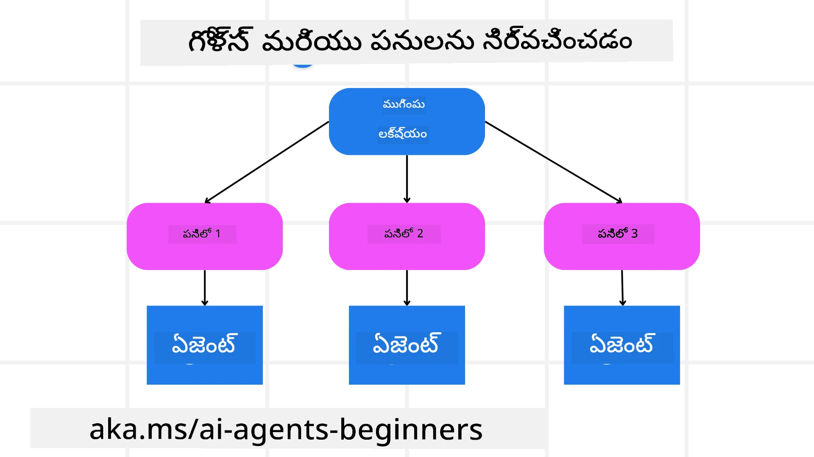

<!--
CO_OP_TRANSLATOR_METADATA:
{
  "original_hash": "43069833a0412210ad5c3cc93d9c2146",
  "translation_date": "2025-12-03T17:19:51+00:00",
  "source_file": "07-planning-design/README.md",
  "language_code": "te"
}
-->
[](https://youtu.be/kPfJ2BrBCMY?si=9pYpPXp0sSbK91Dr)

> _(ఈ పాఠం వీడియోను చూడటానికి పై చిత్రంపై క్లిక్ చేయండి)_

# ప్లానింగ్ డిజైన్

## పరిచయం

ఈ పాఠంలో మీరు నేర్చుకునే విషయాలు:

* స్పష్టమైన మొత్తం లక్ష్యాన్ని నిర్వచించడం మరియు క్లిష్టమైన పనిని నిర్వహించగల పనులుగా విభజించడం.
* నిర్మిత అవుట్‌పుట్‌ను ఉపయోగించి మరింత నమ్మదగిన మరియు యంత్ర-పఠనీయ ప్రతిస్పందనలను పొందడం.
* డైనమిక్ పనులు మరియు అనూహ్య ఇన్‌పుట్‌లను నిర్వహించడానికి ఈవెంట్-డ్రైవన్ విధానాన్ని అనుసరించడం.

## నేర్చుకునే లక్ష్యాలు

ఈ పాఠం పూర్తిచేసిన తర్వాత, మీరు ఈ విషయాలను అర్థం చేసుకుంటారు:

* AI ఏజెంట్ కోసం మొత్తం లక్ష్యాన్ని గుర్తించడం మరియు సెట్ చేయడం, అది సాధించాల్సినది స్పష్టంగా తెలుసుకోవడం.
* క్లిష్టమైన పనిని నిర్వహించగల ఉపపనులుగా విభజించడం మరియు వాటిని తార్కిక క్రమంలో ఏర్పాటు చేయడం.
* ఏజెంట్లకు సరైన సాధనాలను (ఉదా: సెర్చ్ టూల్స్ లేదా డేటా అనలిటిక్స్ టూల్స్) అందించడం, అవి ఎప్పుడు మరియు ఎలా ఉపయోగించాలో నిర్ణయించడం, మరియు ఎదురయ్యే అనూహ్య పరిస్థితులను నిర్వహించడం.
* ఉపపనుల ఫలితాలను అంచనా వేయడం, పనితీరును కొలవడం, మరియు తుది అవుట్‌పుట్‌ను మెరుగుపరచడానికి చర్యలపై పునరావృతం చేయడం.

## మొత్తం లక్ష్యాన్ని నిర్వచించడం మరియు పనిని విభజించడం



చాలా రియల్-వరల్డ్ పనులు ఒకే దశలో పరిష్కరించడానికి చాలా క్లిష్టంగా ఉంటాయి. AI ఏజెంట్ తన ప్లానింగ్ మరియు చర్యలను మార్గనిర్దేశం చేయడానికి సంక్షిప్త లక్ష్యాన్ని అవసరం. ఉదాహరణకు, ఈ లక్ష్యాన్ని పరిగణించండి:

    "3-రోజుల ప్రయాణ షెడ్యూల్ రూపొందించండి."

ఇది చెప్పడం సులభం అయినప్పటికీ, ఇంకా మెరుగుదల అవసరం. లక్ష్యం ఎంత స్పష్టంగా ఉంటే, ఏజెంట్ (మరియు ఏదైనా మానవ సహకారులు) సరైన ఫలితాన్ని సాధించడంపై మరింత దృష్టి పెట్టగలరు, ఉదా: విమాన ఎంపికలు, హోటల్ సిఫారసులు, మరియు కార్యకలాపాల సూచనలతో సమగ్ర షెడ్యూల్ రూపొందించడం.

### పనిని విభజించడం

పెద్ద లేదా క్లిష్టమైన పనులు చిన్న, లక్ష్య-ఆధారిత ఉపపనులుగా విభజించినప్పుడు నిర్వహించగలవు.
ప్రయాణ షెడ్యూల్ ఉదాహరణకు, మీరు లక్ష్యాన్ని ఈ విధంగా విభజించవచ్చు:

* విమాన బుకింగ్
* హోటల్ బుకింగ్
* కార్ రెంటల్
* వ్యక్తిగతీకరణ

ప్రతి ఉపపనిని ప్రత్యేక ఏజెంట్లు లేదా ప్రక్రియలు నిర్వహించవచ్చు. ఒక ఏజెంట్ ఉత్తమ విమాన డీల్స్ కోసం శోధించడంలో ప్రత్యేకత కలిగి ఉండవచ్చు, మరొకటి హోటల్ బుకింగ్‌లపై దృష్టి పెట్టవచ్చు, మరియు తదితరాలు. ఒక సమన్వయ లేదా “డౌన్‌స్ట్రీమ్” ఏజెంట్ ఈ ఫలితాలను ఒక సమగ్ర షెడ్యూల్‌గా చివరి వినియోగదారుని కోసం సంకలనం చేయవచ్చు.

ఈ మాడ్యులర్ విధానం క్రమంగా మెరుగుదలలను కూడా అనుమతిస్తుంది. ఉదాహరణకు, మీరు ఫుడ్ సిఫారసులు లేదా స్థానిక కార్యకలాపాల సూచనల కోసం ప్రత్యేక ఏజెంట్లను జోడించి, షెడ్యూల్‌ను కాలక్రమేణా మెరుగుపరచవచ్చు.

### నిర్మిత అవుట్‌పుట్

లార్జ్ లాంగ్వేజ్ మోడల్స్ (LLMs) నిర్మిత అవుట్‌పుట్ (ఉదా: JSON) రూపొందించగలవు, ఇది డౌన్‌స్ట్రీమ్ ఏజెంట్లు లేదా సేవలు పార్స్ చేయడానికి మరియు ప్రాసెస్ చేయడానికి సులభంగా ఉంటుంది. ఇది మల్టీ-ఏజెంట్ సందర్భంలో చాలా ఉపయోగకరంగా ఉంటుంది, అక్కడ ప్లానింగ్ అవుట్‌పుట్ అందుకున్న తర్వాత ఈ పనులను అమలు చేయవచ్చు. ఈ <a href="https://microsoft.github.io/autogen/stable/user-guide/core-user-guide/cookbook/structured-output-agent.html" target="_blank">బ్లాగ్‌పోస్ట్</a>ను త్వరగా అవగాహన కోసం చూడండి.

క్రింది Python కోడ్ స్నిపెట్ ఒక సాధారణ ప్లానింగ్ ఏజెంట్ లక్ష్యాన్ని ఉపపనులుగా విభజించి నిర్మిత ప్లాన్‌ను రూపొందించడం చూపిస్తుంది:

```python
from pydantic import BaseModel
from enum import Enum
from typing import List, Optional, Union
import json
import os
from typing import Optional
from pprint import pprint
from autogen_core.models import UserMessage, SystemMessage, AssistantMessage
from autogen_ext.models.azure import AzureAIChatCompletionClient
from azure.core.credentials import AzureKeyCredential

class AgentEnum(str, Enum):
    FlightBooking = "flight_booking"
    HotelBooking = "hotel_booking"
    CarRental = "car_rental"
    ActivitiesBooking = "activities_booking"
    DestinationInfo = "destination_info"
    DefaultAgent = "default_agent"
    GroupChatManager = "group_chat_manager"

# ట్రావెల్ సబ్‌టాస్క్ మోడల్
class TravelSubTask(BaseModel):
    task_details: str
    assigned_agent: AgentEnum  # మేము టాస్క్‌ను ఏజెంట్‌కు కేటాయించాలనుకుంటున్నాము

class TravelPlan(BaseModel):
    main_task: str
    subtasks: List[TravelSubTask]
    is_greeting: bool

client = AzureAIChatCompletionClient(
    model="gpt-4o-mini",
    endpoint="https://models.inference.ai.azure.com",
    # మోడల్‌తో ప్రామాణీకరించడానికి మీరు మీ GitHub సెట్టింగుల్లో వ్యక్తిగత యాక్సెస్ టోకెన్ (PAT)ని రూపొందించాలి.
    # PAT టోకెన్‌ను రూపొందించడానికి ఇక్కడ ఇచ్చిన సూచనలను అనుసరించండి: https://docs.github.com/en/authentication/keeping-your-account-and-data-secure/managing-your-personal-access-tokens
    credential=AzureKeyCredential(os.environ["GITHUB_TOKEN"]),
    model_info={
        "json_output": False,
        "function_calling": True,
        "vision": True,
        "family": "unknown",
    },
)

# యూజర్ సందేశాన్ని నిర్వచించండి
messages = [
    SystemMessage(content="""You are an planner agent.
    Your job is to decide which agents to run based on the user's request.
                      Provide your response in JSON format with the following structure:
{'main_task': 'Plan a family trip from Singapore to Melbourne.',
 'subtasks': [{'assigned_agent': 'flight_booking',
               'task_details': 'Book round-trip flights from Singapore to '
                               'Melbourne.'}
    Below are the available agents specialised in different tasks:
    - FlightBooking: For booking flights and providing flight information
    - HotelBooking: For booking hotels and providing hotel information
    - CarRental: For booking cars and providing car rental information
    - ActivitiesBooking: For booking activities and providing activity information
    - DestinationInfo: For providing information about destinations
    - DefaultAgent: For handling general requests""", source="system"),
    UserMessage(
        content="Create a travel plan for a family of 2 kids from Singapore to Melboune", source="user"),
]

response = await client.create(messages=messages, extra_create_args={"response_format": 'json_object'})

response_content: Optional[str] = response.content if isinstance(
    response.content, str) else None
if response_content is None:
    raise ValueError("Response content is not a valid JSON string" )

pprint(json.loads(response_content))

# # లోడ్ చేయడానికి ముందు ప్రతిస్పందన కంటెంట్ చెల్లుబాటు అయ్యే JSON స్ట్రింగ్ అని నిర్ధారించండి
# response_content: Optional[str] = response.content if isinstance(
#     response.content, str) else None
# response_content None అయితే:
#     ValueError("Response content is not a valid JSON string")ని విసిరేయండి

# # JSONగా లోడ్ చేసిన తర్వాత ప్రతిస్పందన కంటెంట్‌ను ప్రింట్ చేయండి
# pprint(json.loads(response_content))

# MathReasoning మోడల్‌తో ప్రతిస్పందన కంటెంట్‌ను ధృవీకరించండి
# TravelPlan.model_validate(json.loads(response_content))
```

### మల్టీ-ఏజెంట్ ఆర్కెస్ట్రేషన్‌తో ప్లానింగ్ ఏజెంట్

ఈ ఉదాహరణలో, ఒక సెమాంటిక్ రౌటర్ ఏజెంట్ వినియోగదారు అభ్యర్థనను స్వీకరిస్తుంది (ఉదా: "నా ప్రయాణానికి హోటల్ ప్లాన్ కావాలి.").

ప్లానర్ ఈ విధంగా చేస్తుంది:

* హోటల్ ప్లాన్ స్వీకరించడం: ప్లానర్ వినియోగదారు సందేశాన్ని తీసుకుని, సిస్టమ్ ప్రాంప్ట్ (అందుబాటులో ఉన్న ఏజెంట్ వివరాలు సహా) ఆధారంగా నిర్మిత ప్రయాణ ప్లాన్‌ను రూపొందిస్తుంది.
* ఏజెంట్లు మరియు వారి సాధనాలను జాబితా చేయడం: ఏజెంట్ రిజిస్ట్రీ ఏజెంట్ల జాబితాను (ఉదా: విమానం, హోటల్, కార్ రెంటల్, మరియు కార్యకలాపాలు) మరియు వారు అందించే ఫంక్షన్లు లేదా సాధనాలను కలిగి ఉంటుంది.
* ప్లాన్‌ను సంబంధిత ఏజెంట్లకు రూట్ చేయడం: ఉపపనుల సంఖ్యపై ఆధారపడి, ప్లానర్ సందేశాన్ని ఒక ప్రత్యేక ఏజెంట్‌కు (ఒకే పనుల సందర్భాల్లో) నేరుగా పంపుతుంది లేదా మల్టీ-ఏజెంట్ సహకారం కోసం గ్రూప్ చాట్ మేనేజర్ ద్వారా సమన్వయం చేస్తుంది.
* ఫలితాన్ని సారాంశం చేయడం: చివరగా, ప్లానర్ రూపొందించిన ప్లాన్‌ను స్పష్టత కోసం సారాంశం చేస్తుంది.
క్రింది Python కోడ్ ఉదాహరణ ఈ దశలను వివరంగా చూపిస్తుంది:

```python

from pydantic import BaseModel

from enum import Enum
from typing import List, Optional, Union

class AgentEnum(str, Enum):
    FlightBooking = "flight_booking"
    HotelBooking = "hotel_booking"
    CarRental = "car_rental"
    ActivitiesBooking = "activities_booking"
    DestinationInfo = "destination_info"
    DefaultAgent = "default_agent"
    GroupChatManager = "group_chat_manager"

# ప్రయాణ ఉపకార్య మోడల్

class TravelSubTask(BaseModel):
    task_details: str
    assigned_agent: AgentEnum # మేము పనిని ఏజెంట్‌కు కేటాయించాలనుకుంటున్నాము

class TravelPlan(BaseModel):
    main_task: str
    subtasks: List[TravelSubTask]
    is_greeting: bool
import json
import os
from typing import Optional

from autogen_core.models import UserMessage, SystemMessage, AssistantMessage
from autogen_ext.models.openai import AzureOpenAIChatCompletionClient

# రకాలు తనిఖీ చేయబడిన పర్యావరణ వేరియబుల్స్‌తో క్లయింట్‌ను సృష్టించండి

client = AzureOpenAIChatCompletionClient(
    azure_deployment=os.getenv("AZURE_OPENAI_DEPLOYMENT_NAME"),
    model=os.getenv("AZURE_OPENAI_DEPLOYMENT_NAME"),
    api_version=os.getenv("AZURE_OPENAI_API_VERSION"),
    azure_endpoint=os.getenv("AZURE_OPENAI_ENDPOINT"),
    api_key=os.getenv("AZURE_OPENAI_API_KEY"),
)

from pprint import pprint

# వినియోగదారు సందేశాన్ని నిర్వచించండి

messages = [
    SystemMessage(content="""You are an planner agent.
    Your job is to decide which agents to run based on the user's request.
    Below are the available agents specialized in different tasks:
    - FlightBooking: For booking flights and providing flight information
    - HotelBooking: For booking hotels and providing hotel information
    - CarRental: For booking cars and providing car rental information
    - ActivitiesBooking: For booking activities and providing activity information
    - DestinationInfo: For providing information about destinations
    - DefaultAgent: For handling general requests""", source="system"),
    UserMessage(content="Create a travel plan for a family of 2 kids from Singapore to Melbourne", source="user"),
]

response = await client.create(messages=messages, extra_create_args={"response_format": TravelPlan})

# లోడ్ చేయడానికి ముందు ప్రతిస్పందన కంటెంట్ చెల్లుబాటు అయ్యే JSON స్ట్రింగ్ అని నిర్ధారించండి

response_content: Optional[str] = response.content if isinstance(response.content, str) else None
if response_content is None:
    raise ValueError("Response content is not a valid JSON string")

# JSON గా లోడ్ చేసిన తర్వాత ప్రతిస్పందన కంటెంట్‌ను ముద్రించండి

pprint(json.loads(response_content))
```

మునుపటి కోడ్ అవుట్‌పుట్‌ను ఉపయోగించి `assigned_agent`కు రూట్ చేయవచ్చు మరియు చివరి వినియోగదారుని కోసం ప్రయాణ ప్లాన్‌ను సారాంశం చేయవచ్చు.

```json
{
    "is_greeting": "False",
    "main_task": "Plan a family trip from Singapore to Melbourne.",
    "subtasks": [
        {
            "assigned_agent": "flight_booking",
            "task_details": "Book round-trip flights from Singapore to Melbourne."
        },
        {
            "assigned_agent": "hotel_booking",
            "task_details": "Find family-friendly hotels in Melbourne."
        },
        {
            "assigned_agent": "car_rental",
            "task_details": "Arrange a car rental suitable for a family of four in Melbourne."
        },
        {
            "assigned_agent": "activities_booking",
            "task_details": "List family-friendly activities in Melbourne."
        },
        {
            "assigned_agent": "destination_info",
            "task_details": "Provide information about Melbourne as a travel destination."
        }
    ]
}
```

మునుపటి కోడ్ ఉదాహరణతో ఒక నోట్‌బుక్ [ఇక్కడ](07-autogen.ipynb) అందుబాటులో ఉంది.

### పునరావృత ప్లానింగ్

కొన్ని పనులు వెనుకకు-ముందుకు లేదా పునరావృత ప్లానింగ్ అవసరం, ఒక ఉపపన ఫలితం తదుపరి పనిని ప్రభావితం చేసే సందర్భంలో. ఉదాహరణకు, ఏజెంట్ విమానాలను బుక్ చేస్తూ అనూహ్య డేటా ఫార్మాట్‌ను కనుగొంటే, హోటల్ బుకింగ్‌లకు ముందుగా తన వ్యూహాన్ని అనుసరించాల్సి ఉంటుంది.

అదనంగా, వినియోగదారు అభిప్రాయం (ఉదా: ఒక మానవుడు ముందుగా విమానం కావాలని నిర్ణయించుకోవడం) ఒక భాగం పునరావృత ప్లాన్‌ను ప్రారంభించవచ్చు. ఈ డైనమిక్, పునరావృత విధానం తుది పరిష్కారం రియల్-వరల్డ్ పరిమితులు మరియు అభివృద్ధి చెందుతున్న వినియోగదారు ప్రాధాన్యతలకు అనుగుణంగా ఉండేలా చేస్తుంది.

ఉదా: నమూనా కోడ్

```python
from autogen_core.models import UserMessage, SystemMessage, AssistantMessage
#.. గత కోడ్ మాదిరిగానే మరియు వినియోగదారుని చరిత్ర, ప్రస్తుత ప్రణాళికను పంపండి
messages = [
    SystemMessage(content="""You are a planner agent to optimize the
    Your job is to decide which agents to run based on the user's request.
    Below are the available agents specialized in different tasks:
    - FlightBooking: For booking flights and providing flight information
    - HotelBooking: For booking hotels and providing hotel information
    - CarRental: For booking cars and providing car rental information
    - ActivitiesBooking: For booking activities and providing activity information
    - DestinationInfo: For providing information about destinations
    - DefaultAgent: For handling general requests""", source="system"),
    UserMessage(content="Create a travel plan for a family of 2 kids from Singapore to Melbourne", source="user"),
    AssistantMessage(content=f"Previous travel plan - {TravelPlan}", source="assistant")
]
# .. పునః ప్రణాళిక చేసి పనులను సంబంధిత ఏజెంట్లకు పంపండి
```

మరింత సమగ్ర ప్లానింగ్ కోసం Magnetic One <a href="https://www.microsoft.com/research/articles/magentic-one-a-generalist-multi-agent-system-for-solving-complex-tasks" target="_blank">బ్లాగ్‌పోస్ట్</a>ను చూడండి, ఇది క్లిష్టమైన పనులను పరిష్కరించడానికి ఉపయోగపడుతుంది.

## సారాంశం

ఈ వ్యాసంలో, అందుబాటులో ఉన్న ఏజెంట్లను డైనమిక్‌గా ఎంచుకునే ప్లానర్‌ను ఎలా రూపొందించవచ్చో ఉదాహరణను చూశాము. ప్లానర్ అవుట్‌పుట్ పనులను విభజించి ఏజెంట్లకు కేటాయిస్తుంది, తద్వారా అవి అమలు చేయబడతాయి. ఏజెంట్లు పనిని నిర్వహించడానికి అవసరమైన ఫంక్షన్లు/సాధనాలకు ప్రాప్యత కలిగి ఉంటారని భావించబడుతుంది. ఏజెంట్లకు అదనంగా, మీరు రిఫ్లెక్షన్, సారాంశం, మరియు రౌండ్ రాబిన్ చాట్ వంటి ఇతర ప్యాటర్న్‌లను చేర్చవచ్చు.

## అదనపు వనరులు

AutoGen Magnetic One - క్లిష్టమైన పనులను పరిష్కరించడానికి జనరలిస్ట్ మల్టీ-ఏజెంట్ సిస్టమ్ మరియు అనేక సవాలుతో కూడిన ఏజెంటిక్ బెంచ్‌మార్క్‌లపై అద్భుతమైన ఫలితాలను సాధించింది. రిఫరెన్స్: <a href="https://github.com/microsoft/autogen/tree/main/python/packages/autogen-magentic-one" target="_blank">autogen-magentic-one</a>. ఈ అమలులో ఆర్కెస్ట్రేటర్ పనికి ప్రత్యేకమైన ప్లాన్‌ను రూపొందించి ఈ పనులను అందుబాటులో ఉన్న ఏజెంట్లకు కేటాయిస్తుంది. ప్లానింగ్‌కు అదనంగా, ఆర్కెస్ట్రేటర్ పనుల పురోగతిని పర్యవేక్షించడానికి ట్రాకింగ్ మెకానిజాన్ని కూడా ఉపయోగిస్తుంది మరియు అవసరమైతే పునరావృత ప్లాన్ చేస్తుంది.

### ప్లానింగ్ డిజైన్ ప్యాటర్న్ గురించి మరిన్ని ప్రశ్నలున్నాయా?

మరింత నేర్చుకునేందుకు, ఆఫీస్ అవర్స్‌లో పాల్గొనడానికి మరియు మీ AI ఏజెంట్ల ప్రశ్నలకు సమాధానం పొందడానికి [Azure AI Foundry Discord](https://aka.ms/ai-agents/discord)లో చేరండి.

## మునుపటి పాఠం

[నమ్మదగిన AI ఏజెంట్లను నిర్మించడం](../06-building-trustworthy-agents/README.md)

## తదుపరి పాఠం

[మల్టీ-ఏజెంట్ డిజైన్ ప్యాటర్న్](../08-multi-agent/README.md)

---

<!-- CO-OP TRANSLATOR DISCLAIMER START -->
**విమర్శ**:  
ఈ పత్రాన్ని AI అనువాద సేవ [Co-op Translator](https://github.com/Azure/co-op-translator) ఉపయోగించి అనువదించారు. మేము ఖచ్చితత్వానికి ప్రయత్నిస్తున్నప్పటికీ, ఆటోమేటెడ్ అనువాదాలలో తప్పులు లేదా అసమానతలు ఉండవచ్చు. దయచేసి, మూల భాషలో ఉన్న అసలు పత్రాన్ని అధికారం కలిగిన మూలంగా పరిగణించండి. కీలకమైన సమాచారం కోసం, ప్రొఫెషనల్ మానవ అనువాదాన్ని సిఫారసు చేస్తాము. ఈ అనువాదాన్ని ఉపయోగించడం వల్ల కలిగే ఏవైనా అపార్థాలు లేదా తప్పుదారులు కోసం మేము బాధ్యత వహించము.
<!-- CO-OP TRANSLATOR DISCLAIMER END -->