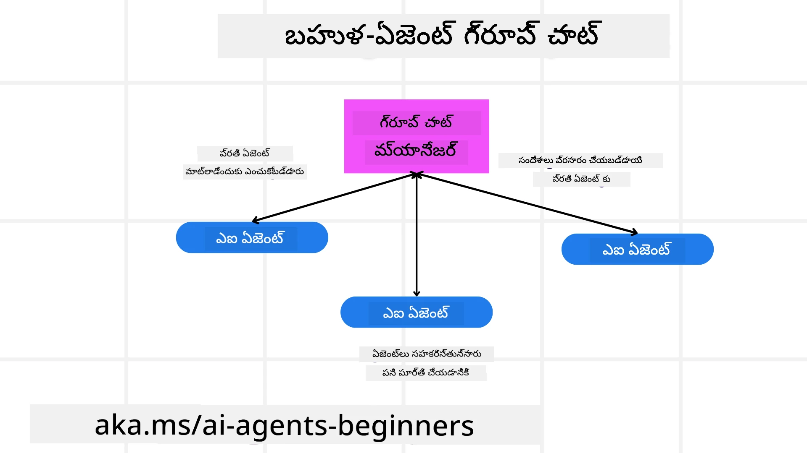
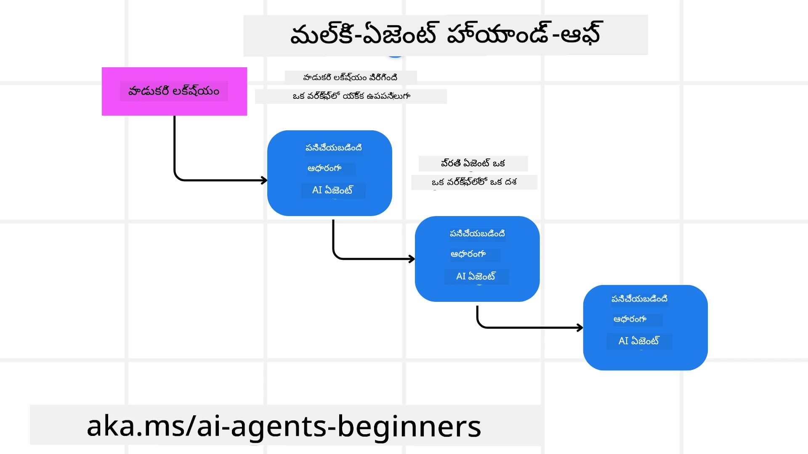

<!--
CO_OP_TRANSLATOR_METADATA:
{
  "original_hash": "1a008c204051cba8d0e253b75f261c41",
  "translation_date": "2025-12-03T16:04:51+00:00",
  "source_file": "08-multi-agent/README.md",
  "language_code": "te"
}
-->

> _(ఈ పాఠం వీడియోను చూడటానికి పై చిత్రంపై క్లిక్ చేయండి)_

# మల్టీ-ఏజెంట్ డిజైన్ ప్యాటర్న్స్

మీరు బహుళ ఏజెంట్లను కలిగి ఉన్న ప్రాజెక్టుపై పని చేయడం ప్రారంభించిన వెంటనే, మల్టీ-ఏజెంట్ డిజైన్ ప్యాటర్న్‌ను పరిగణించాల్సి ఉంటుంది. అయితే, మల్టీ-ఏజెంట్లకు మార్పు ఎప్పుడు చేయాలో మరియు దాని ప్రయోజనాలు ఏమిటో వెంటనే స్పష్టంగా ఉండకపోవచ్చు.

## పరిచయం

ఈ పాఠంలో, మేము ఈ ప్రశ్నలకు సమాధానం ఇవ్వడానికి ప్రయత్నిస్తున్నాము:

- మల్టీ-ఏజెంట్లు వర్తించే పరిస్థితులు ఏమిటి?
- ఒకే ఏజెంట్ బహుళ పనులను చేయడం కంటే మల్టీ-ఏజెంట్లను ఉపయోగించడం వల్ల కలిగే ప్రయోజనాలు ఏమిటి?
- మల్టీ-ఏజెంట్ డిజైన్ ప్యాటర్న్ అమలు చేయడానికి అవసరమైన నిర్మాణ బ్లాక్స్ ఏమిటి?
- బహుళ ఏజెంట్లు ఒకదానితో ఒకటి ఎలా పరస్పర చర్యలు చేస్తున్నాయో ఎలా చూడగలము?

## అభ్యాస లక్ష్యాలు

ఈ పాఠం తర్వాత, మీరు చేయగలరు:

- మల్టీ-ఏజెంట్లు వర్తించే పరిస్థితులను గుర్తించండి
- ఒకే ఏజెంట్ కంటే మల్టీ-ఏజెంట్లను ఉపయోగించడం వల్ల కలిగే ప్రయోజనాలను గుర్తించండి
- మల్టీ-ఏజెంట్ డిజైన్ ప్యాటర్న్ అమలు చేయడానికి అవసరమైన నిర్మాణ బ్లాక్స్‌ను అర్థం చేసుకోండి

మొత్తం దృశ్యం ఏమిటి?

*మల్టీ-ఏజెంట్లు అనేది బహుళ ఏజెంట్లు ఒకే లక్ష్యాన్ని సాధించడానికి కలిసి పనిచేయడానికి అనుమతించే డిజైన్ ప్యాటర్న్.*

ఈ ప్యాటర్న్ రోబోటిక్స్, స్వయంచాలిత వ్యవస్థలు మరియు పంపిణీ కంప్యూటింగ్ వంటి వివిధ రంగాలలో విస్తృతంగా ఉపయోగించబడుతుంది.

## మల్టీ-ఏజెంట్లు వర్తించే పరిస్థితులు

మల్టీ-ఏజెంట్లను ఉపయోగించడానికి మంచి సందర్భాలు ఏమిటి? సమాధానం ఏమిటంటే, బహుళ ఏజెంట్లను ఉపయోగించడం ప్రయోజనకరమైన అనేక సందర్భాలు ఉన్నాయి, ముఖ్యంగా ఈ క్రింది సందర్భాల్లో:

- **పెద్ద పనిభారం**: పెద్ద పనిభారాన్ని చిన్న పనులుగా విభజించి, వివిధ ఏజెంట్లకు కేటాయించవచ్చు, తద్వారా సమాంతర ప్రాసెసింగ్ మరియు వేగవంతమైన పూర్తి చేయడం సాధ్యమవుతుంది. దీని ఉదాహరణ పెద్ద డేటా ప్రాసెసింగ్ పనిలో కనిపిస్తుంది.
- **సంక్లిష్టమైన పనులు**: పెద్ద పనిభారంలా, సంక్లిష్టమైన పనులను చిన్న ఉపపనులుగా విభజించి, ప్రతి ఏజెంట్ పనిలో ప్రత్యేకత కలిగి ఉండే విధంగా కేటాయించవచ్చు. దీని మంచి ఉదాహరణ స్వయంచాలిత వాహనాలు, అక్కడ వివిధ ఏజెంట్లు నావిగేషన్, అడ్డంకుల గుర్తింపు మరియు ఇతర వాహనాలతో కమ్యూనికేషన్ నిర్వహిస్తాయి.
- **వివిధ నైపుణ్యం**: వివిధ ఏజెంట్లు వివిధ నైపుణ్యాలను కలిగి ఉండవచ్చు, తద్వారా ఒకే ఏజెంట్ కంటే పనుల యొక్క వివిధ అంశాలను మరింత సమర్థవంతంగా నిర్వహించగలరు. దీని ఉదాహరణ ఆరోగ్య సంరక్షణలో కనిపిస్తుంది, అక్కడ ఏజెంట్లు డయాగ్నోస్టిక్స్, చికిత్స ప్రణాళికలు మరియు రోగి పర్యవేక్షణ నిర్వహిస్తారు.

## ఒకే ఏజెంట్ కంటే మల్టీ-ఏజెంట్లను ఉపయోగించడం వల్ల కలిగే ప్రయోజనాలు

సాధారణ పనుల కోసం ఒకే ఏజెంట్ వ్యవస్థ బాగా పనిచేయవచ్చు, కానీ మరింత సంక్లిష్టమైన పనుల కోసం, బహుళ ఏజెంట్లను ఉపయోగించడం అనేక ప్రయోజనాలను అందిస్తుంది:

- **ప్రత్యేకత**: ప్రతి ఏజెంట్ ఒక నిర్దిష్ట పనిలో ప్రత్యేకత కలిగి ఉండవచ్చు. ఒకే ఏజెంట్‌లో ప్రత్యేకత లేకపోవడం అంటే, అది అన్ని పనులను చేయగలదు కానీ సంక్లిష్టమైన పనిని ఎదుర్కొన్నప్పుడు ఏమి చేయాలో గందరగోళానికి గురవుతుంది. ఉదాహరణకు, అది తగిన పనిని చేయకుండా, తగిన పనికి అనుకూలంగా ఉండని పనిని చేయవచ్చు.
- **విస్తరణ సామర్థ్యం**: ఒకే ఏజెంట్‌ను అధికంగా లోడ్ చేయడం కంటే, మరిన్ని ఏజెంట్లను జోడించడం ద్వారా వ్యవస్థలను విస్తరించడం సులభం.
- **లోప నిరోధకత**: ఒక ఏజెంట్ విఫలమైతే, ఇతరులు పనిచేయడం కొనసాగించగలరు, వ్యవస్థ నమ్మకాన్ని నిర్ధారించగలరు.

ఒక ఉదాహరణ తీసుకుందాం, ఒక వినియోగదారుని కోసం ట్రిప్ బుక్ చేయడం. ఒకే ఏజెంట్ వ్యవస్థ ట్రిప్ బుకింగ్ ప్రక్రియ యొక్క అన్ని అంశాలను నిర్వహించాలి, విమానాలను కనుగొనడం నుండి హోటళ్లు మరియు అద్దె కార్లను బుక్ చేయడం వరకు. ఒకే ఏజెంట్‌తో ఇది సాధించడానికి, అన్ని పనులను నిర్వహించడానికి సాధనాలను కలిగి ఉండాలి. ఇది నిర్వహించడానికి మరియు విస్తరించడానికి కష్టమైన మరియు మోనోలిథిక్ వ్యవస్థకు దారితీస్తుంది. మల్టీ-ఏజెంట్ వ్యవస్థ, మరోవైపు, విమానాలను కనుగొనడం, హోటళ్లు బుక్ చేయడం మరియు అద్దె కార్లను బుక్ చేయడంలో ప్రత్యేకత కలిగిన వివిధ ఏజెంట్లను కలిగి ఉంటుంది. ఇది వ్యవస్థను మరింత మాడ్యులర్‌గా, నిర్వహించడానికి సులభంగా మరియు విస్తరించగలిగేలా చేస్తుంది.

దీన్ని ఒక చిన్న స్థాయి ట్రావెల్ బ్యూరోతో పోలిస్తే, ఒక ఫ్రాంచైజ్‌గా నడిచే ట్రావెల్ బ్యూరోతో పోల్చండి. చిన్న స్థాయి ట్రావెల్ బ్యూరో ట్రిప్ బుకింగ్ ప్రక్రియ యొక్క అన్ని అంశాలను నిర్వహించే ఒకే ఏజెంట్‌ను కలిగి ఉంటుంది, అయితే ఫ్రాంచైజ్ ట్రిప్ బుకింగ్ ప్రక్రియ యొక్క వివిధ అంశాలను నిర్వహించే వివిధ ఏజెంట్లను కలిగి ఉంటుంది.

## మల్టీ-ఏజెంట్ డిజైన్ ప్యాటర్న్ అమలు చేయడానికి నిర్మాణ బ్లాక్స్

మల్టీ-ఏజెంట్ డిజైన్ ప్యాటర్న్‌ను అమలు చేయడానికి ముందు, మీరు ప్యాటర్న్‌ను రూపొందించే నిర్మాణ బ్లాక్స్‌ను అర్థం చేసుకోవాలి.

మరొకసారి వినియోగదారుని కోసం ట్రిప్ బుక్ చేయడం ఉదాహరణను తీసుకుని దీన్ని మరింత స్పష్టంగా చేద్దాం. ఈ సందర్భంలో, నిర్మాణ బ్లాక్స్‌లో ఉంటాయి:

- **ఏజెంట్ కమ్యూనికేషన్**: విమానాలను కనుగొనడం, హోటళ్లు బుక్ చేయడం మరియు అద్దె కార్లను బుక్ చేయడం కోసం ఏజెంట్లు వినియోగదారుని ప్రాధాన్యతలు మరియు పరిమితుల గురించి సమాచారాన్ని పంచుకోవాలి. ఈ కమ్యూనికేషన్ కోసం ప్రోటోకాల్‌లు మరియు పద్ధతులను నిర్ణయించాలి. దీని అర్థం ఏమిటంటే, విమానాలను కనుగొనడం కోసం ఏజెంట్ హోటళ్లు బుక్ చేయడం కోసం ఏజెంట్‌తో కమ్యూనికేట్ చేయాలి, తద్వారా హోటల్ విమాన తేదీలకు అనుగుణంగా బుక్ చేయబడుతుంది. అంటే ఏజెంట్లు వినియోగదారుని ప్రయాణ తేదీల గురించి సమాచారాన్ని పంచుకోవాలి, అంటే *ఏ ఏజెంట్లు సమాచారాన్ని పంచుకుంటున్నారో మరియు వారు ఎలా పంచుకుంటున్నారో* నిర్ణయించాలి.
- **సమన్వయ యంత్రాలు**: ఏజెంట్లు వినియోగదారుని ప్రాధాన్యతలు మరియు పరిమితులను తీర్చడానికి తమ చర్యలను సమన్వయపరచుకోవాలి. వినియోగదారుని ప్రాధాన్యత అంటే వారు విమానాశ్రయానికి దగ్గరగా ఉన్న హోటల్‌ను కోరుకోవడం, అయితే పరిమితి అంటే అద్దె కార్లు విమానాశ్రయంలో మాత్రమే అందుబాటులో ఉండడం. దీని అర్థం ఏమిటంటే, హోటళ్లు బుక్ చేయడం కోసం ఏజెంట్ అద్దె కార్లను బుక్ చేయడం కోసం ఏజెంట్‌తో సమన్వయం చేయాలి, తద్వారా వినియోగదారుని ప్రాధాన్యతలు మరియు పరిమితులు తీర్చబడతాయి. అంటే *ఏజెంట్లు తమ చర్యలను ఎలా సమన్వయపరచుకుంటున్నారో* నిర్ణయించాలి.
- **ఏజెంట్ ఆర్కిటెక్చర్**: ఏజెంట్లు వినియోగదారుని పరస్పర చర్యల నుండి నిర్ణయాలు తీసుకోవడానికి మరియు నేర్చుకోవడానికి అంతర్గత నిర్మాణాన్ని కలిగి ఉండాలి. దీని అర్థం ఏమిటంటే, విమానాలను కనుగొనడం కోసం ఏజెంట్ వినియోగదారుని కోసం ఏ విమానాలను సిఫారసు చేయాలో నిర్ణయించడానికి అంతర్గత నిర్మాణాన్ని కలిగి ఉండాలి. అంటే *ఏజెంట్లు వినియోగదారుని పరస్పర చర్యల నుండి ఎలా నిర్ణయాలు తీసుకుంటున్నారో మరియు నేర్చుకుంటున్నారో* నిర్ణయించాలి. ఏజెంట్ ఎలా నేర్చుకుంటుందో మరియు మెరుగుపరుస్తుందో ఉదాహరణలు ఏమిటంటే, విమానాలను కనుగొనడం కోసం ఏజెంట్ గత ప్రాధాన్యతల ఆధారంగా వినియోగదారుని కోసం విమానాలను సిఫారసు చేయడానికి మెషిన్ లెర్నింగ్ మోడల్‌ను ఉపయోగించవచ్చు.
- **మల్టీ-ఏజెంట్ పరస్పర చర్యలలో స్పష్టత**: బహుళ ఏజెంట్లు ఒకదానితో ఒకటి ఎలా పరస్పర చర్యలు చేస్తున్నాయో మీకు స్పష్టత ఉండాలి. దీని అర్థం ఏమిటంటే, ఏజెంట్ కార్యకలాపాలు మరియు పరస్పర చర్యలను ట్రాక్ చేయడానికి మీకు సాధనాలు మరియు పద్ధతులు ఉండాలి. ఇది లాగింగ్ మరియు మానిటరింగ్ సాధనాలు, విజువలైజేషన్ సాధనాలు మరియు పనితీరు మెట్రిక్స్ రూపంలో ఉండవచ్చు.
- **మల్టీ-ఏజెంట్ ప్యాటర్న్స్**: మల్టీ-ఏజెంట్ వ్యవస్థలను అమలు చేయడానికి వివిధ ప్యాటర్న్లు ఉన్నాయి, ఉదాహరణకు కేంద్రీకృత, వికేంద్రీకృత మరియు హైబ్రిడ్ ఆర్కిటెక్చర్లు. మీ వినియోగ సందర్భానికి సరిపోయే ప్యాటర్న్‌ను నిర్ణయించాలి.
- **హ్యూమన్ ఇన్ ది లూప్**: చాలా సందర్భాల్లో, మీకు మానవుడు లూప్‌లో ఉంటాడు మరియు ఏజెంట్లు మానవ జోక్యం కోరాల్సినప్పుడు వారికి సూచనలు ఇవ్వాలి. ఇది ఏజెంట్లు సిఫారసు చేయని నిర్దిష్ట హోటల్ లేదా విమానాన్ని వినియోగదారు కోరడం లేదా విమానాన్ని లేదా హోటల్‌ను బుక్ చేయడానికి ముందు నిర్ధారణ కోరడం రూపంలో ఉండవచ్చు.

## మల్టీ-ఏజెంట్ పరస్పర చర్యలలో స్పష్టత

బహుళ ఏజెంట్లు ఒకదానితో ఒకటి ఎలా పరస్పర చర్యలు చేస్తున్నాయో మీకు స్పష్టత ఉండటం చాలా ముఖ్యం. ఈ స్పష్టత డీబగ్గింగ్, ఆప్టిమైజింగ్ మరియు మొత్తం వ్యవస్థ యొక్క ప్రభావాన్ని నిర్ధారించడానికి అవసరం. దీన్ని సాధించడానికి, ఏజెంట్ కార్యకలాపాలు మరియు పరస్పర చర్యలను ట్రాక్ చేయడానికి మీకు సాధనాలు మరియు పద్ధతులు ఉండాలి. ఇది లాగింగ్ మరియు మానిటరింగ్ సాధనాలు, విజువలైజేషన్ సాధనాలు మరియు పనితీరు మెట్రిక్స్ రూపంలో ఉండవచ్చు.

ఉదాహరణకు, వినియోగదారుని కోసం ట్రిప్ బుక్ చేయడం సందర్భంలో, ప్రతి ఏజెంట్ స్థితి, వినియోగదారుని ప్రాధాన్యతలు మరియు పరిమితులు, మరియు ఏజెంట్ల మధ్య పరస్పర చర్యలను చూపించే డాష్‌బోర్డ్‌ను కలిగి ఉండవచ్చు. ఈ డాష్‌బోర్డ్ వినియోగదారుని ప్రయాణ తేదీలను, విమాన ఏజెంట్ సిఫారసు చేసిన విమానాలను, హోటల్ ఏజెంట్ సిఫారసు చేసిన హోటళ్లను మరియు అద్దె కార్ ఏజెంట్ సిఫారసు చేసిన అద్దె కార్లను చూపవచ్చు. ఇది ఏజెంట్లు ఒకదానితో ఒకటి ఎలా పరస్పర చర్యలు చేస్తున్నాయో మరియు వినియోగదారుని ప్రాధాన్యతలు మరియు పరిమితులు తీర్చబడుతున్నాయో మీకు స్పష్టమైన దృశ్యాన్ని ఇస్తుంది.

ఈ అంశాలను మరింత వివరంగా చూద్దాం.

- **లాగింగ్ మరియు మానిటరింగ్ సాధనాలు**: ఏజెంట్ తీసుకున్న ప్రతి చర్య కోసం లాగింగ్ చేయడం కావాలి. లాగ్ ఎంట్రీ ఏజెంట్ తీసుకున్న చర్య, తీసుకున్న చర్య, చర్య తీసుకున్న సమయం మరియు చర్య ఫలితంపై సమాచారం నిల్వ చేయవచ్చు. ఈ సమాచారం డీబగ్గింగ్, ఆప్టిమైజింగ్ మరియు మరిన్ని కోసం ఉపయోగించవచ్చు.

- **విజువలైజేషన్ సాధనాలు**: విజువలైజేషన్ సాధనాలు ఏజెంట్ల మధ్య పరస్పర చర్యలను మరింత సహజమైన మార్గంలో చూడటానికి సహాయపడతాయి. ఉదాహరణకు, ఏజెంట్ల మధ్య సమాచార ప్రవాహాన్ని చూపించే గ్రాఫ్‌ను కలిగి ఉండవచ్చు. ఇది వ్యవస్థలో బాటిల్‌నెక్స్, సమర్థతలేమి మరియు ఇతర సమస్యలను గుర్తించడంలో మీకు సహాయపడుతుంది.

- **పనితీరు మెట్రిక్స్**: పనితీరు మెట్రిక్స్ మల్టీ-ఏజెంట్ వ్యవస్థ యొక్క ప్రభావాన్ని ట్రాక్ చేయడంలో సహాయపడతాయి. ఉదాహరణకు, పని పూర్తి చేయడానికి తీసుకున్న సమయం, యూనిట్ సమయానికి పూర్తి చేసిన పనుల సంఖ్య మరియు ఏజెంట్లు చేసిన సిఫారసుల ఖచ్చితత్వాన్ని ట్రాక్ చేయవచ్చు. ఈ సమాచారం మెరుగుదల కోసం ప్రాంతాలను గుర్తించడంలో మరియు వ్యవస్థను ఆప్టిమైజ్ చేయడంలో మీకు సహాయపడుతుంది.

## మల్టీ-ఏజెంట్ ప్యాటర్న్స్

మల్టీ-ఏజెంట్ యాప్స్‌ను సృష్టించడానికి ఉపయోగించగల కొన్ని కాంక్రీటు ప్యాటర్న్లలోకి వెళ్దాం. ఇక్కడ పరిగణించదగిన కొన్ని ఆసక్తికరమైన ప్యాటర్న్లు ఉన్నాయి:

### గ్రూప్ చాట్

ఈ ప్యాటర్న్ బహుళ ఏజెంట్లు ఒకదానితో ఒకటి కమ్యూనికేట్ చేయగల గ్రూప్ చాట్ అప్లికేషన్‌ను సృష్టించడానికి ఉపయోగకరంగా ఉంటుంది. ఈ ప్యాటర్న్ కోసం సాధారణ వినియోగ సందర్భాలు టీమ్ సహకారం, కస్టమర్ సపోర్ట్ మరియు సోషల్ నెట్‌వర్కింగ్.

ఈ ప్యాటర్న్‌లో, ప్రతి ఏజెంట్ గ్రూప్ చాట్‌లో ఒక వినియోగదారుని ప్రాతినిధ్యం వహిస్తుంది, మరియు సందేశాలు ఏజెంట్ల మధ్య మెసేజింగ్ ప్రోటోకాల్‌ను ఉపయోగించి మార్పిడి చేయబడతాయి. ఏజెంట్లు గ్రూప్ చాట్‌కు సందేశాలను పంపవచ్చు, గ్రూప్ చాట్ నుండి సందేశాలను స్వీకరించవచ్చు మరియు ఇతర ఏజెంట్ల నుండి సందేశాలకు ప్రతిస్పందించవచ్చు.

ఈ ప్యాటర్న్‌ను అన్ని సందేశాలు కేంద్ర సర్వర్ ద్వారా రూట్ చేయబడే కేంద్రీకృత ఆర్కిటెక్చర్‌ను ఉపయోగించి లేదా సందేశాలు నేరుగా మార్పిడి చేయబడే వికేంద్రీకృత ఆర్కిటెక్చర్‌ను ఉపయోగించి అమలు చేయవచ్చు.

### హ్యాండ్-ఆఫ్

ఈ ప్యాటర్న్ బహుళ ఏజెంట్లు ఒకదానితో ఒకటి పనులను హ్యాండ్-ఆఫ్ చేయగల అప్లికేషన్‌ను సృష్టించడానికి ఉపయోగకరంగా ఉంటుంది.

ఈ ప్యాటర్న్ కోసం సాధారణ వినియోగ సందర్భాలు కస్టమర్ సపోర్ట్, టాస్క్ మేనేజ్‌మెంట్ మరియు వర్క్‌ఫ్లో ఆటోమేషన్.

ఈ ప్యాటర్న్‌లో, ప్రతి ఏజెంట్ ఒక పని లేదా వర్క్‌ఫ్లోలో ఒక దశను ప్రాతినిధ్యం వహిస్తుంది, మరియు ఏజెంట్లు ముందుగా నిర్వచించిన నియమాల ఆధారంగా ఇతర ఏజెంట్లకు పనులను హ్యాండ్-ఆఫ్ చేయవచ్చు.

### సహకార ఫిల్టరింగ్

ఈ ప్యాటర్న్ బహుళ ఏజెంట్లు వినియోగదారులకు సిఫారసులు చేయడానికి కలిసి పనిచేయగల అప్లికేషన్‌ను సృష్టించడానికి ఉపయోగకరంగా ఉంటుంది.

బహుళ ఏజెంట్లు కలిసి పనిచేయడానికి మీరు ఎందుకు కోరుకుంటారంటే, ప్రతి ఏజెంట్ వివిధ నైపుణ్యాలను కలిగి ఉండవచ్చు మరియు సిఫారసు ప్రక్రియకు వివిధ మార్గాల్లో సహకరించగలదు.

ఒక వినియోగదారు స్టాక్ మార్కెట్‌లో కొనుగోలు చేయడానికి ఉత్తమ స్టాక్‌పై సిఫారసును కోరుతున్న ఉదాహరణను తీసుకుందాం.

- **ఇండస్ట్రీ నిపుణుడు**: ఒక ఏజెంట్ ఒక నిర్దిష
బహుళ-ఏజెంట్ వ్యవస్థను కస్టమర్ సపోర్ట్ ప్రక్రియ కోసం రూపొందించండి. ఈ ప్రక్రియలో పాల్గొనే ఏజెంట్లను, వారి పాత్రలు మరియు బాధ్యతలను గుర్తించండి, అలాగే వారు ఒకరితో ఒకరు ఎలా పరస్పర చర్యలు చేస్తారు. కస్టమర్ సపోర్ట్ ప్రక్రియకు ప్రత్యేకమైన ఏజెంట్లను మాత్రమే కాకుండా, మీ వ్యాపారంలోని ఇతర భాగాల్లో ఉపయోగించగల సాధారణ ఏజెంట్లను కూడా పరిగణించండి.

> మీరు క్రింది పరిష్కారాన్ని చదివే ముందు ఆలోచించండి, మీకు అవసరమైన ఏజెంట్లు మీరు అనుకున్నదానికంటే ఎక్కువగా ఉండవచ్చు.

> TIP: కస్టమర్ సపోర్ట్ ప్రక్రియలోని వివిధ దశలను మరియు ఏదైనా వ్యవస్థకు అవసరమైన ఏజెంట్లను పరిగణించండి.

## పరిష్కారం

[పరిష్కారం](./solution/solution.md)

## జ్ఞాన పరీక్షలు

ప్రశ్న: మీరు బహుళ-ఏజెంట్లను ఎప్పుడు పరిగణించాలి?

- [ ] A1: చిన్న పని భారంతో మరియు సులభమైన పనితో ఉన్నప్పుడు.
- [ ] A2: పెద్ద పని భారంతో ఉన్నప్పుడు.
- [ ] A3: సులభమైన పనితో ఉన్నప్పుడు.

[పరిష్కారం క్విజ్](./solution/solution-quiz.md)

## సారాంశం

ఈ పాఠంలో, మేము బహుళ-ఏజెంట్ డిజైన్ ప్యాటర్న్‌ను పరిశీలించాము, బహుళ-ఏజెంట్లు వర్తించే పరిస్థితులు, ఒకే ఏజెంట్‌తో పోలిస్తే బహుళ-ఏజెంట్ల ఉపయోగం యొక్క ప్రయోజనాలు, బహుళ-ఏజెంట్ డిజైన్ ప్యాటర్న్ అమలు యొక్క నిర్మాణ బ్లాక్స్, మరియు బహుళ ఏజెంట్లు ఒకరితో ఒకరు ఎలా పరస్పర చర్యలు చేస్తున్నారో తెలుసుకోవడం గురించి.

### బహుళ-ఏజెంట్ డిజైన్ ప్యాటర్న్ గురించి మరిన్ని ప్రశ్నలున్నాయా?

ఇతర విద్యార్థులతో కలవడానికి, ఆఫీస్ అవర్స్‌లో పాల్గొనడానికి మరియు మీ AI ఏజెంట్ల ప్రశ్నలకు సమాధానం పొందడానికి [Azure AI Foundry Discord](https://aka.ms/ai-agents/discord)లో చేరండి.

## అదనపు వనరులు

- <a href="https://microsoft.github.io/autogen/stable/user-guide/core-user-guide/design-patterns/intro.html" target="_blank">AutoGen డిజైన్ ప్యాటర్న్స్</a>
- <a href="https://www.analyticsvidhya.com/blog/2024/10/agentic-design-patterns/" target="_blank">Agentic డిజైన్ ప్యాటర్న్స్</a>

## గత పాఠం

[ప్లానింగ్ డిజైన్](../07-planning-design/README.md)

## తదుపరి పాఠం

[AI ఏజెంట్లలో మెటాకాగ్నిషన్](../09-metacognition/README.md)

---

<!-- CO-OP TRANSLATOR DISCLAIMER START -->
**విమర్శ**:  
ఈ పత్రాన్ని AI అనువాద సేవ [Co-op Translator](https://github.com/Azure/co-op-translator) ఉపయోగించి అనువదించబడింది. మేము ఖచ్చితత్వానికి ప్రయత్నిస్తున్నప్పటికీ, ఆటోమేటెడ్ అనువాదాలలో తప్పులు లేదా అసమానతలు ఉండవచ్చు. దాని స్వదేశీ భాషలోని అసలు పత్రాన్ని అధికారం కలిగిన మూలంగా పరిగణించాలి. కీలకమైన సమాచారం కోసం, ప్రొఫెషనల్ మానవ అనువాదాన్ని సిఫారసు చేస్తాము. ఈ అనువాదాన్ని ఉపయోగించడం వల్ల కలిగే ఏవైనా అపార్థాలు లేదా తప్పుదారులు కోసం మేము బాధ్యత వహించము.
<!-- CO-OP TRANSLATOR DISCLAIMER END -->