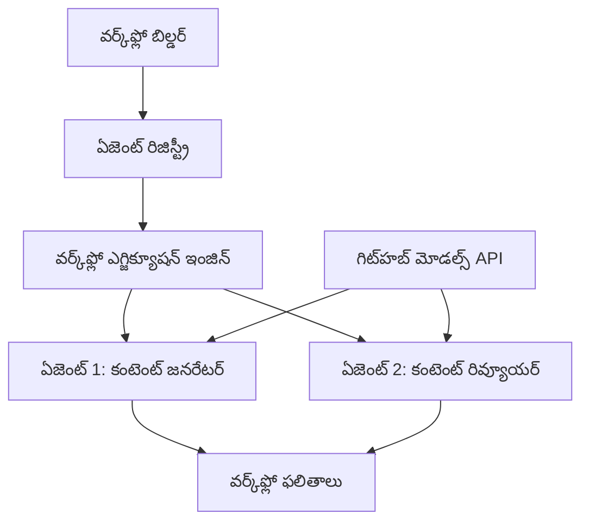

<!--
CO_OP_TRANSLATOR_METADATA:
{
  "original_hash": "034158688d0a45aae06dcbb21b0da5ae",
  "translation_date": "2025-12-03T16:23:08+00:00",
  "source_file": "08-multi-agent/code_samples/workflows-agent-framework/dotNET/01.dotnet-agent-framework-workflow-ghmodel-basic.md",
  "language_code": "te"
}
-->
# 🔄 GitHub మోడల్స్ (.NET) తో ప్రాథమిక ఏజెంట్ వర్క్‌ఫ్లోలు

## 📋 వర్క్‌ఫ్లో ఆర్కెస్ట్రేషన్ ట్యుటోరియల్

ఈ నోట్‌బుక్ Microsoft Agent Framework కోసం .NET మరియు GitHub మోడల్స్ ఉపయోగించి అధునాతన **ఏజెంట్ వర్క్‌ఫ్లోలు** ఎలా నిర్మించాలో చూపిస్తుంది. మీరు బహుళ దశల వ్యాపార ప్రక్రియలను సృష్టించడం నేర్చుకుంటారు, అక్కడ AI ఏజెంట్లు సమన్వయంతో పనిచేసి నిర్మిత ఆర్కెస్ట్రేషన్ నమూనాల ద్వారా సంక్లిష్టమైన పనులను పూర్తి చేస్తారు.

## 🎯 నేర్చుకునే లక్ష్యాలు

### 🏗️ **వర్క్‌ఫ్లో ఆర్కిటెక్చర్ ప్రాథమికాలు**
- **వర్క్‌ఫ్లో బిల్డర్**: సంక్లిష్టమైన బహుళ దశల AI ప్రక్రియలను డిజైన్ చేయడం మరియు ఆర్కెస్ట్రేట్ చేయడం
- **ఏజెంట్ సమన్వయం**: వర్క్‌ఫ్లోలలో బహుళ ప్రత్యేకత కలిగిన ఏజెంట్లను సమన్వయం చేయడం
- **GitHub మోడల్స్ ఇంటిగ్రేషన్**: వర్క్‌ఫ్లోలలో GitHub యొక్క AI మోడల్ ఇన్ఫరెన్స్ సేవను ఉపయోగించడం
- **విజువల్ వర్క్‌ఫ్లో డిజైన్**: మెరుగైన అవగాహన కోసం వర్క్‌ఫ్లో నిర్మాణాలను సృష్టించడం మరియు వీక్షించడం

### 🔄 **ప్రక్రియ ఆర్కెస్ట్రేషన్ నమూనాలు**
- **సీక్వెన్షియల్ ప్రాసెసింగ్**: అనేక ఏజెంట్ పనులను తార్కిక క్రమంలో చేర్చడం
- **స్టేట్ మేనేజ్‌మెంట్**: వర్క్‌ఫ్లో దశల మధ్య కంటెక్స్ట్ మరియు డేటా ప్రవాహాన్ని నిర్వహించడం
- **ఎర్రర్ హ్యాండ్లింగ్**: దృఢమైన లోపాల రికవరీ మరియు వర్క్‌ఫ్లో రిజిలియెన్స్ అమలు చేయడం
- **పర్ఫార్మెన్స్ ఆప్టిమైజేషన్**: ఎంటర్‌ప్రైజ్-స్థాయి ఆపరేషన్ల కోసం సమర్థవంతమైన వర్క్‌ఫ్లోలను డిజైన్ చేయడం

### 🏢 **ఎంటర్‌ప్రైజ్ వర్క్‌ఫ్లో అప్లికేషన్లు**
- **బిజినెస్ ప్రాసెస్ ఆటోమేషన్**: సంక్లిష్టమైన సంస్థాగత వర్క్‌ఫ్లోలను ఆటోమేట్ చేయడం
- **కంటెంట్ ప్రొడక్షన్ పైప్‌లైన్**: సమీక్ష మరియు ఆమోద దశలతో ఎడిటోరియల్ వర్క్‌ఫ్లోలు
- **కస్టమర్ సర్వీస్ ఆటోమేషన్**: బహుళ దశల కస్టమర్ విచారణ పరిష్కారం
- **డేటా ప్రాసెసింగ్ వర్క్‌ఫ్లోలు**: AI ఆధారిత ట్రాన్స్‌ఫార్మేషన్‌తో ETL వర్క్‌ఫ్లోలు

## ⚙️ అవసరాలు & సెటప్

### 📦 **అవసరమైన NuGet ప్యాకేజీలు**

ఈ వర్క్‌ఫ్లో డెమోలో కొన్ని ముఖ్యమైన .NET ప్యాకేజీలు ఉపయోగించబడ్డాయి:

```xml
<!-- Core AI Framework -->
<PackageReference Include="Microsoft.Extensions.AI" Version="9.9.0" />

<!-- Agent Framework (Local Development) -->
<!-- Microsoft.Agents.AI.dll - Core agent abstractions -->
<!-- Microsoft.Agents.AI.OpenAI.dll - OpenAI/GitHub Models integration -->

<!-- Configuration and Environment -->
<PackageReference Include="DotNetEnv" Version="3.1.1" />
```

### 🔑 **GitHub మోడల్స్ కాన్ఫిగరేషన్**

**పర్యావరణం సెటప్ (.env ఫైల్):**
```env
GITHUB_TOKEN=your_github_personal_access_token
GITHUB_ENDPOINT=https://models.inference.ai.azure.com
GITHUB_MODEL_ID=gpt-4o-mini
```

**GitHub మోడల్స్ యాక్సెస్:**
1. GitHub మోడల్స్ కోసం సైన్ అప్ చేయండి (ప్రస్తుతం ప్రివ్యూ లో ఉంది)
2. మోడల్ యాక్సెస్ అనుమతులతో పర్సనల్ యాక్సెస్ టోకెన్ జనరేట్ చేయండి
3. పై చూపినట్లుగా పర్యావరణ వేరియబుల్స్‌ను కాన్ఫిగర్ చేయండి

### 🏗️ **వర్క్‌ఫ్లో ఆర్కిటెక్చర్ అవలోకనం**


**ముఖ్యమైన భాగాలు:**
- **WorkflowBuilder**: వర్క్‌ఫ్లోలను డిజైన్ చేయడానికి ప్రధాన ఆర్కెస్ట్రేషన్ ఇంజిన్
- **AIAgent**: ప్రత్యేక సామర్థ్యాలతో వ్యక్తిగత ఏజెంట్లు
- **GitHub Models Client**: AI మోడల్ ఇన్ఫరెన్స్ సేవ ఇంటిగ్రేషన్
- **Execution Context**: వర్క్‌ఫ్లో దశల మధ్య స్టేట్ మరియు డేటా ప్రవాహాన్ని నిర్వహిస్తుంది

## 🎨 **ఎంటర్‌ప్రైజ్ వర్క్‌ఫ్లో డిజైన్ నమూనాలు**

### 📝 **కంటెంట్ ప్రొడక్షన్ వర్క్‌ఫ్లో**
```
User Request → Content Generation → Quality Review → Final Output
```

### 🔍 **డాక్యుమెంట్ ప్రాసెసింగ్ పైప్‌లైన్**
```
Document Input → Analysis → Extraction → Validation → Structured Output
```

### 💼 **బిజినెస్ ఇంటెలిజెన్స్ వర్క్‌ఫ్లో**
```
Data Collection → Processing → Analysis → Report Generation → Distribution
```

### 🤝 **కస్టమర్ సర్వీస్ ఆటోమేషన్**
```
Customer Inquiry → Classification → Processing → Response Generation → Follow-up
```

## 🏢 **ఎంటర్‌ప్రైజ్ ప్రయోజనాలు**

### 🎯 **నమ్మకదర్త & స్కేలబిలిటీ**
- **డిటర్మినిస్టిక్ ఎగ్జిక్యూషన్**: స్థిరమైన, పునరావృత వర్క్‌ఫ్లో ఫలితాలు
- **ఎర్రర్ రికవరీ**: ఏ వర్క్‌ఫ్లో దశలోనైనా వైఫల్యాలను సులభంగా నిర్వహించడం
- **పర్ఫార్మెన్స్ మానిటరింగ్**: ఎగ్జిక్యూషన్ మెట్రిక్స్‌ను ట్రాక్ చేయడం మరియు ఆప్టిమైజేషన్ అవకాశాలను గుర్తించడం
- **రిసోర్స్ మేనేజ్‌మెంట్**: AI మోడల్ వనరుల సమర్థవంతమైన కేటాయింపు మరియు వినియోగం

### 🔒 **సెక్యూరిటీ & కంప్లయన్స్**
- **సురక్షిత ప్రామాణీకరణ**: API యాక్సెస్ కోసం GitHub టోకెన్ ఆధారిత ప్రామాణీకరణ
- **ఆడిట్ ట్రైల్స్**: వర్క్‌ఫ్లో ఎగ్జిక్యూషన్ మరియు నిర్ణయ పాయింట్ల పూర్తి లాగింగ్
- **యాక్సెస్ కంట్రోల్**: వర్క్‌ఫ్లో ఎగ్జిక్యూషన్ మరియు మానిటరింగ్ కోసం గ్రాన్యులర్ అనుమతులు
- **డేటా ప్రైవసీ**: వర్క్‌ఫ్లోలలో సున్నితమైన సమాచారాన్ని సురక్షితంగా నిర్వహించడం

### 📊 **ఆబ్జర్వబిలిటీ & మేనేజ్‌మెంట్**
- **విజువల్ వర్క్‌ఫ్లో డిజైన్**: ప్రక్రియ ప్రవాహాలు మరియు ఆధారితాలను స్పష్టంగా ప్రదర్శించడం
- **ఎగ్జిక్యూషన్ మానిటరింగ్**: వర్క్‌ఫ్లో పురోగతి మరియు పనితీరును రియల్-టైమ్‌లో ట్రాక్ చేయడం
- **ఎర్రర్ రిపోర్టింగ్**: లోపాల విశ్లేషణ మరియు డీబగింగ్ సామర్థ్యాలు
- **పర్ఫార్మెన్స్ అనలిటిక్స్**: ఆప్టిమైజేషన్ మరియు సామర్థ్య ప్రణాళిక కోసం మెట్రిక్స్

మీ మొదటి ఎంటర్‌ప్రైజ్-రెడీ AI వర్క్‌ఫ్లోను నిర్మిద్దాం! 🚀

## 💻 కోడ్ నడపడం

పూర్తి అమలు `01.dotnet-agent-framework-workflow-ghmodel-basic.cs` లో అందుబాటులో ఉంది. ఈ ఫైల్ చూపిస్తుంది:

1. **పర్యావరణం కాన్ఫిగరేషన్** - `.env` ఫైల్ నుండి GitHub మోడల్స్ క్రెడెన్షియల్స్ లోడ్ చేయడం
2. **OpenAI క్లయింట్ సెటప్** - GitHub మోడల్స్ ఎండ్‌పాయింట్ ఉపయోగించడానికి క్లయింట్‌ను కాన్ఫిగర్ చేయడం
3. **ఏజెంట్ క్రియేషన్** - ప్రత్యేక ఏజెంట్లను నిర్వచించడం (ఫ్రంట్ డెస్క్ మరియు కాన్సియర్జ్)
4. **వర్క్‌ఫ్లో బిల్డర్** - సీక్వెన్షియల్ ప్రాసెసింగ్‌తో బహుళ ఏజెంట్ వర్క్‌ఫ్లో సృష్టించడం
5. **వర్క్‌ఫ్లో ఎగ్జిక్యూషన్** - స్ట్రీమింగ్ ఫలితాలతో వర్క్‌ఫ్లో నడపడం

### 🚀 ఉదాహరణ నడపడం

```bash
# స్క్రిప్ట్‌ను అమలు చేయగలిగేలా చేయండి (యూనిక్స్/లినక్స్/మ్యాక్‌ఓఎస్)
chmod +x 01.dotnet-agent-framework-workflow-ghmodel-basic.cs

# వర్క్‌ఫ్లోను అమలు చేయండి
./01.dotnet-agent-framework-workflow-ghmodel-basic.cs
```

లేదా Windows లో:
```powershell
dotnet run 01.dotnet-agent-framework-workflow-ghmodel-basic.cs
```

### 📝 ఆశించిన ఫలితం

వర్క్‌ఫ్లో:
1. మీ ప్రయాణ గమ్యం అభ్యర్థనను స్వీకరిస్తుంది ("నేను పారిస్‌కు వెళ్లాలనుకుంటున్నాను")
2. ఫ్రంట్ డెస్క్ ఏజెంట్ ప్రారంభ సిఫారసును అందిస్తుంది
3. కాన్సియర్జ్ ఏజెంట్ సిఫారసును సమీక్షించి మెరుగుపరుస్తుంది
4. తుది ఫలితంగా పూర్తి సంభాషణ స్ట్రీమ్ ప్రదర్శించబడుతుంది

### 🔧 అనుకూలీకరణ

మీరు వర్క్‌ఫ్లోను అనుకూలీకరించవచ్చు:
- ఏజెంట్ సూచనలను మార్చడం ద్వారా వారి ప్రవర్తనను మార్చడం
- మరిన్ని ఏజెంట్లను చేర్చి సంక్లిష్టమైన బహుళ దశల వర్క్‌ఫ్లోలను సృష్టించడం
- వినియోగదారు సందేశాన్ని మార్చి వివిధ పరిస్థితులను పరీక్షించడం
- వర్క్‌ఫ్లో ఎడ్జ్‌లను సర్దుబాటు చేసి వివిధ ఎగ్జిక్యూషన్ నమూనాలను సృష్టించడం

---

<!-- CO-OP TRANSLATOR DISCLAIMER START -->
**విమర్శ**:  
ఈ పత్రాన్ని AI అనువాద సేవ [Co-op Translator](https://github.com/Azure/co-op-translator) ఉపయోగించి అనువదించారు. మేము ఖచ్చితత్వానికి ప్రయత్నిస్తున్నప్పటికీ, ఆటోమేటెడ్ అనువాదాలలో తప్పులు లేదా అసమానతలు ఉండవచ్చు. దయచేసి, మూల భాషలోని అసలు పత్రాన్ని అధికారం కలిగిన మూలంగా పరిగణించండి. ముఖ్యమైన సమాచారం కోసం, ప్రొఫెషనల్ మానవ అనువాదాన్ని సిఫారసు చేస్తాము. ఈ అనువాదాన్ని ఉపయోగించడం వల్ల కలిగే ఏవైనా అపార్థాలు లేదా తప్పుదారులు కోసం మేము బాధ్యత వహించము.
<!-- CO-OP TRANSLATOR DISCLAIMER END -->