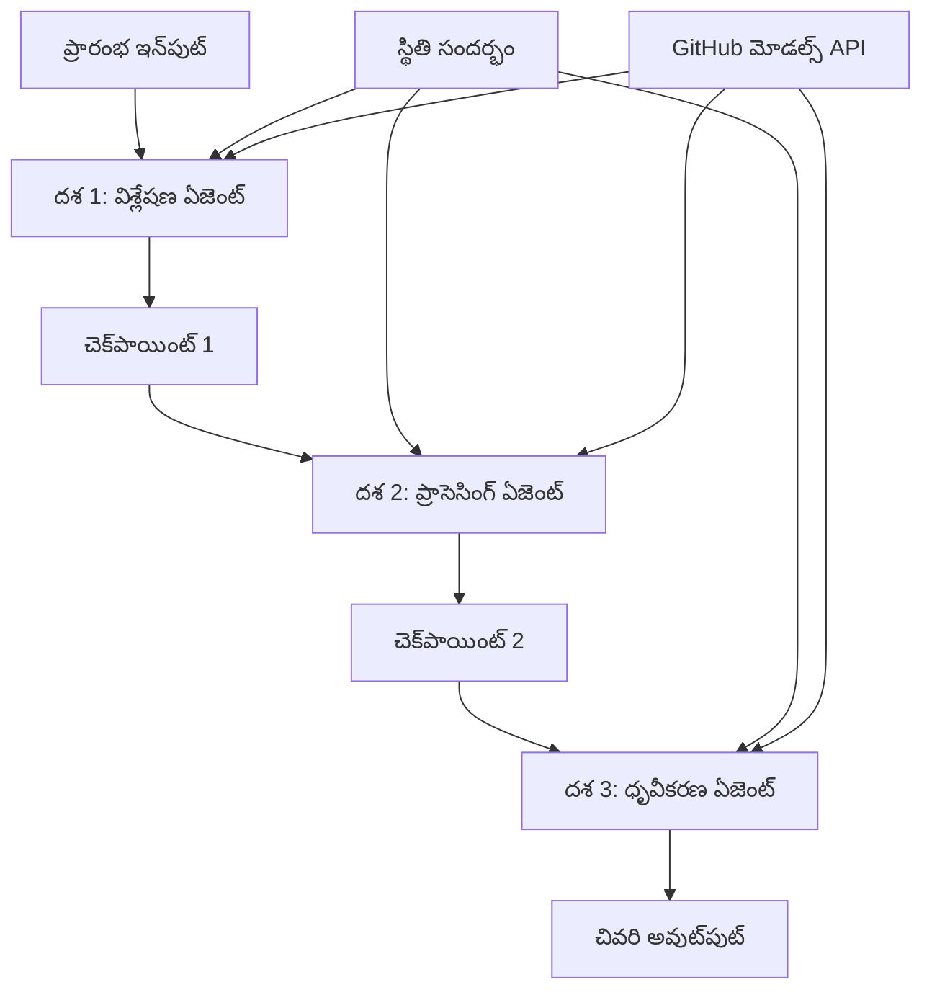

<!--
CO_OP_TRANSLATOR_METADATA:
{
  "original_hash": "1be9c8dcbd79a02d33d2c138684c1394",
  "translation_date": "2025-12-03T16:27:32+00:00",
  "source_file": "08-multi-agent/code_samples/workflows-agent-framework/dotNET/02.dotnet-agent-framework-workflow-ghmodel-sequential.md",
  "language_code": "te"
}
-->
# ⏩ GitHub మోడల్స్ (.NET) తో క్రమబద్ధమైన ఏజెంట్ వర్క్‌ఫ్లోలు

## 📋 అధునాతన క్రమబద్ధమైన ప్రాసెసింగ్ ట్యుటోరియల్

ఈ నోట్‌బుక్ Microsoft Agent Framework కోసం .NET మరియు GitHub మోడల్స్ ఉపయోగించి **క్రమబద్ధమైన వర్క్‌ఫ్లో నమూనాలను** ప్రదర్శిస్తుంది. ఏజెంట్లు నిర్దిష్ట క్రమంలో అమలు చేయబడే, ప్రతి దశ గత దశ ఫలితాలపై ఆధారపడే అధునాతన, దశలవారీ ప్రాసెసింగ్ పైప్‌లైన్లను ఎలా నిర్మించాలో మీరు నేర్చుకుంటారు.

## 🎯 అభ్యాస లక్ష్యాలు

### 🔄 **క్రమబద్ధమైన ప్రాసెసింగ్ ఆర్కిటెక్చర్**
- **లీనియర్ వర్క్‌ఫ్లో డిజైన్**: స్పష్టమైన ఆధారాలతో దశలవారీ ప్రాసెసింగ్ పైప్‌లైన్లను సృష్టించండి
- **స్టేట్ మేనేజ్‌మెంట్**: క్రమబద్ధమైన వర్క్‌ఫ్లో దశలలో కంటెక్స్ట్ మరియు డేటా ఫ్లోను నిర్వహించండి
- **GitHub మోడల్స్ ఇంటిగ్రేషన్**: బహుళ దశల .NET వర్క్‌ఫ్లోలలో GitHub యొక్క AI మోడల్స్‌ను ఉపయోగించండి
- **ఎంటర్‌ప్రైజ్ పైప్‌లైన్ నమూనాలు**: ఉత్పత్తి-సిద్ధమైన క్రమబద్ధమైన ప్రాసెసింగ్ వ్యవస్థలను నిర్మించండి

### 🏗️ **అధునాతన క్రమబద్ధమైన నమూనాలు**
- **స్టేజ్-గేట్ ప్రాసెసింగ్**: వర్క్‌ఫ్లో దశల మధ్య ధృవీకరణ చెక్‌పాయింట్లను అమలు చేయండి
- **కంటెక్స్ట్ ప్రిజర్వేషన్**: అన్ని దశలలో స్టేట్ మరియు సేకరించిన జ్ఞానాన్ని నిర్వహించండి
- **ఎర్రర్ ప్రొపగేషన్**: క్రమబద్ధమైన ప్రాసెసింగ్ చైన్‌లలో వైఫల్యాలను సున్నితంగా నిర్వహించండి
- **పర్ఫార్మెన్స్ ఆప్టిమైజేషన్**: తక్కువ ఓవర్‌హెడ్‌తో సమర్థవంతమైన క్రమబద్ధమైన అమలు

### 🏢 **ఎంటర్‌ప్రైజ్ క్రమబద్ధమైన అప్లికేషన్లు**
- **డాక్యుమెంట్ ప్రాసెసింగ్ పైప్‌లైన్**: బహుళ దశల డాక్యుమెంట్ విశ్లేషణ, మార్పు, మరియు ధృవీకరణ
- **క్వాలిటీ అష్యూరెన్స్ వర్క్‌ఫ్లోలు**: క్రమబద్ధమైన సమీక్ష, ధృవీకరణ, మరియు ఆమోద ప్రక్రియలు
- **కంటెంట్ ప్రొడక్షన్ పైప్‌లైన్**: పరిశోధన → రచన → ఎడిటింగ్ → సమీక్ష → ప్రచురణ
- **బిజినెస్ ప్రాసెస్ ఆటోమేషన్**: స్పష్టమైన దశ ఆధారాలతో బహుళ దశల వ్యాపార వర్క్‌ఫ్లోలు

## ⚙️ అవసరాలు & సెటప్

### 📦 **అవసరమైన NuGet ప్యాకేజీలు**

.NET క్రమబద్ధమైన వర్క్‌ఫ్లోల కోసం అవసరమైన ప్యాకేజీలు:

```xml
<!-- Core AI Framework -->
<PackageReference Include="Microsoft.Extensions.AI" Version="9.9.0" />

<!-- Client Model Abstractions -->
<PackageReference Include="System.ClientModel" Version="1.6.1.0" />

<!-- Azure Identity and Async LINQ Support -->
<PackageReference Include="Azure.Identity" Version="1.15.0" />
<PackageReference Include="System.Linq.Async" Version="6.0.3" />

<!-- Local Agent Framework References -->
<!-- Microsoft.Agents.AI.dll - Core agent abstractions -->
<!-- Microsoft.Agents.AI.OpenAI.dll - GitHub Models integration -->
```

### 🔑 **GitHub మోడల్స్ కాన్ఫిగరేషన్**

**ఎన్విరాన్‌మెంట్ సెటప్ (.env ఫైల్):**
```env
GITHUB_TOKEN=your_github_personal_access_token
GITHUB_ENDPOINT=https://models.inference.ai.azure.com
GITHUB_MODEL_ID=gpt-4o-mini
```

**కాన్ఫిగరేషన్ మేనేజ్‌మెంట్:**
```csharp
// Load environment variables securely
Env.Load("../../../.env");
var githubToken = Environment.GetEnvironmentVariable("GITHUB_TOKEN");
var githubEndpoint = Environment.GetEnvironmentVariable("GITHUB_ENDPOINT");
var modelId = Environment.GetEnvironmentVariable("GITHUB_MODEL_ID");
```

### 🏗️ **క్రమబద్ధమైన వర్క్‌ఫ్లో ఆర్కిటెక్చర్**


**ముఖ్యమైన భాగాలు:**
- **క్రమబద్ధమైన ఏజెంట్లు**: ప్రతి ప్రాసెసింగ్ దశకు ప్రత్యేక ఏజెంట్లు
- **స్టేట్ కంటెక్స్ట్**: దశలలో సేకరించిన డేటా మరియు నిర్ణయాలను నిర్వహిస్తుంది
- **చెక్‌పాయింట్లు**: ప్రతి దశలో నాణ్యత మరియు స్థిరత్వాన్ని నిర్ధారించడానికి ధృవీకరణ పాయింట్లు
- **GitHub మోడల్స్ క్లయింట్**: అన్ని వర్క్‌ఫ్లో దశలలో AI మోడల్ యాక్సెస్‌ను స్థిరంగా నిర్వహిస్తుంది

## 🎨 **క్రమబద్ధమైన వర్క్‌ఫ్లో డిజైన్ నమూనాలు**

### 📝 **డాక్యుమెంట్ ప్రాసెసింగ్ పైప్‌లైన్**
```
Raw Document → Content Extraction → Analysis → Validation → Structured Output
```

### 🎯 **కంటెంట్ క్రియేషన్ వర్క్‌ఫ్లో**
```
Brief/Requirements → Research → Content Creation → Review → Final Polish
```

### 🔍 **క్వాలిటీ అష్యూరెన్స్ పైప్‌లైన్**
```
Initial Review → Technical Validation → Compliance Check → Final Approval
```

### 💼 **బిజినెస్ ఇంటెలిజెన్స్ వర్క్‌ఫ్లో**
```
Data Collection → Processing → Analysis → Report Generation → Distribution
```

## 🏢 **ఎంటర్‌ప్రైజ్ క్రమబద్ధమైన ప్రయోజనాలు**

### 🎯 **నిర్ధారితత & నాణ్యత**
- **డిటర్మినిస్టిక్ ప్రాసెసింగ్**: నిర్మాణబద్ధమైన దశల ద్వారా స్థిరమైన, పునరావృత ఫలితాలు
- **నాణ్యత గేట్లు**: ప్రతి దశలో ధృవీకరణ చెక్‌పాయింట్లు నాణ్యతను నిర్ధారిస్తాయి
- **ఎర్రర్ ఐసోలేషన్**: ఒక దశలో సమస్యలు తరువాతి దశలకు వ్యాపించవు
- **ఆడిట్ ట్రైల్స్**: ప్రతి దశలో నిర్ణయాలు మరియు మార్పుల పూర్తి ట్రాకింగ్

### 📈 **స్కేలబిలిటీ & పనితీరు**
- **మాడ్యులర్ డిజైన్**: ప్రతి దశను స్వతంత్రంగా ఆప్టిమైజ్ చేయవచ్చు
- **రిసోర్స్ మేనేజ్‌మెంట్**: దశలలో AI మోడల్ వనరుల సమర్థవంతమైన కేటాయింపు
- **స్టేట్ ఆప్టిమైజేషన్**: ఉత్తమ పనితీరు కోసం దశల మధ్య కనీస స్టేట్ ట్రాన్స్‌ఫర్
- **పారలల్ స్టేజ్ గ్రూప్స్**: బహుళ క్రమబద్ధమైన వర్క్‌ఫ్లోలు సమాంతరంగా అమలు చేయవచ్చు

### 🔒 **సెక్యూరిటీ & కంప్లయన్స్**
- **స్టేజ్-లెవల్ సెక్యూరిటీ**: వివిధ ప్రాసెసింగ్ దశల కోసం భిన్నమైన భద్రతా విధానాలు
- **డేటా ధృవీకరణ**: ప్రతి చెక్‌పాయింట్‌లో డేటా సమగ్రత మరియు కంప్లయన్స్‌ను నిర్ధారించండి
- **యాక్సెస్ కంట్రోల్**: వివిధ వర్క్‌ఫ్లో దశల కోసం గ్రాన్యులర్ అనుమతులు
- **రెగ్యులేటరీ కంప్లయన్స్**: నిర్మాణబద్ధమైన ప్రాసెసింగ్ ద్వారా నియంత్రణ అవసరాలను తీర్చండి

### 📊 **మానిటరింగ్ & అనలిటిక్స్**
- **స్టేజ్-లెవల్ మెట్రిక్స్**: ప్రతి వర్క్‌ఫ్లో దశకు పనితీరు మానిటరింగ్
- **బాటిల్‌నెక్ ఐడెంటిఫికేషన్**: నెమ్మదిగా ఉన్న దశలను గుర్తించి ఆప్టిమైజ్ చేయండి
- **నాణ్యత మెట్రిక్స్**: ప్రతి దశలో నాణ్యత మరియు విజయ రేట్లను ట్రాక్ చేయండి
- **ప్రాసెస్ ఆప్టిమైజేషన్**: స్టేజ్-లెవల్ అనలిటిక్స్ ఆధారంగా నిరంతర మెరుగుదల

మजबుతమైన క్రమబద్ధమైన AI ప్రాసెసింగ్ పైప్‌లైన్లను నిర్మిద్దాం! 🚀

## 💻 కోడ్ అమలు

**మూడు దశల ఫర్నిచర్ విశ్లేషణ వర్క్‌ఫ్లో**ను ప్రదర్శించే పూర్తి అమలు `02.dotnet-agent-framework-workflow-ghmodel-sequential.cs` లో అందుబాటులో ఉంది:

1. **దశ 1 - సేల్స్ ఏజెంట్**: ఫర్నిచర్ చిత్రాలను విశ్లేషించి కొనుగోలు సూచనలను అందిస్తుంది
2. **దశ 2 - ప్రైస్ ఏజెంట్**: వివరమైన ధరల విశ్లేషణ మరియు బడ్జెట్ ఎంపికలను అందిస్తుంది
3. **దశ 3 - కోట్ ఏజెంట్**: Markdown ఫార్మాట్‌లో ప్రొఫెషనల్ కోట్ డాక్యుమెంట్‌ను రూపొందిస్తుంది

### 🏗️ **వర్క్‌ఫ్లో ఆర్కిటెక్చర్**

```
Image Input → Sales Analysis → Price Estimation → Quote Generation → Final Output
```

ప్రతి ఏజెంట్:
- గత దశ నుండి అవుట్‌పుట్‌ను కంటెక్స్ట్‌గా స్వీకరిస్తుంది
- గత విశ్లేషణపై ప్రత్యేక నైపుణ్యంతో నిర్మిస్తుంది
- స్టేట్ మేనేజ్‌మెంట్ ద్వారా వర్క్‌ఫ్లో నిరంతరతను నిర్వహిస్తుంది

### 🚀 ఉదాహరణ అమలు

**అవసరాలు:**
- `../imgs/home.png` వద్ద ఫర్నిచర్ చిత్రం ఉంచండి (లేదా `imgPath` వేరియబుల్‌ను అప్‌డేట్ చేయండి)
- GitHub మోడల్స్ క్రెడెన్షియల్స్‌తో మీ `.env` ఫైల్‌ను కాన్ఫిగర్ చేయండి

```bash
# స్క్రిప్ట్‌ను అమలు చేయగలిగేలా చేయండి (యూనిక్స్/లినక్స్/మ్యాక్‌ఓఎస్)
chmod +x 02.dotnet-agent-framework-workflow-ghmodel-sequential.cs

# అనుక్రమ వర్క్‌ఫ్లోను అమలు చేయండి
./02.dotnet-agent-framework-workflow-ghmodel-sequential.cs
```

Windows లో:
```powershell
dotnet run 02.dotnet-agent-framework-workflow-ghmodel-sequential.cs
```

### 📝 ఆశించిన అవుట్‌పుట్

వర్క్‌ఫ్లో:
1. **సేల్స్ ఏజెంట్**: చిత్రంలో ఫర్నిచర్ అంశాలను గుర్తించి సిఫారసులు అందిస్తుంది
2. **ప్రైస్ ఏజెంట్**: బడ్జెట్ స్థాయిలు మరియు షాపింగ్ సిఫారసులతో వివరమైన ధరల విశ్లేషణను జోడిస్తుంది
3. **కోట్ ఏజెంట్**: అన్ని సమాచారం సింథసైజ్ చేయబడిన ఫార్మాట్ చేసిన కోట్ డాక్యుమెంట్‌ను రూపొందిస్తుంది

చిత్ర విశ్లేషణ ఆధారంగా చివరి అవుట్‌పుట్ సమగ్ర, ప్రొఫెషనల్ ఫర్నిచర్ కోట్ అవుతుంది.

### 🔧 అనుకూలీకరణ ఎంపికలు

**ఏజెంట్ ప్రవర్తనను మార్చండి:**
```csharp
// Adjust agent instructions to change their focus
const string SalesAgentInstructions = "Your custom instructions...";
```

**క్రమబద్ధమైన ఫ్లోను మార్చండి:**
```csharp
// Add or reorder workflow stages
var workflow = new WorkflowBuilder(salesagent)
    .AddEdge(salesagent, priceagent)
    .AddEdge(priceagent, quoteagent)
    .AddEdge(quoteagent, newAgent)  // Add another stage
    .Build();
```

**విభిన్న ఇన్‌పుట్‌ను ఉపయోగించండి:**
```csharp
// Process text instead of images
ChatMessage userMessage = new ChatMessage(ChatRole.User, [
    new TextContent("Analyze pricing for a modern living room set")
]);
```

### 🎯 వాస్తవ ప్రపంచ అప్లికేషన్లు

ఈ క్రమబద్ధమైన నమూనా అనుకూలంగా ఉంటుంది:
- **ఈ-కామర్స్**: ఉత్పత్తి విశ్లేషణ → ధరలు → కోట్ జనరేషన్
- **రియల్ ఎస్టేట్**: ప్రాపర్టీ విశ్లేషణ → విలువ → లిస్టింగ్ క్రియేషన్
- **ఇన్సూరెన్స్**: క్లెయిమ్ విశ్లేషణ → అంచనా → కోట్ జనరేషన్
- **కంటెంట్ క్రియేషన్**: పరిశోధన → రచన → ఎడిటింగ్ → ప్రచురణ

### 🔍 స్టేట్ ఫ్లోను అర్థం చేసుకోవడం

క్రమంలో ప్రతి ఏజెంట్ స్వీకరిస్తుంది:
- **మూల ఇన్‌పుట్**: ప్రారంభ వినియోగదారు సందేశం (చిత్రం + టెక్స్ట్)
- **గత ఏజెంట్ అవుట్‌పుట్‌లు**: సంభాషణ చరిత్రలోని అన్ని గత ఏజెంట్ ప్రతిస్పందనలు
- **సేకరించిన కంటెక్స్ట్**: వర్క్‌ఫ్లో అంతటా నిర్వహించబడే పూర్తి స్టేట్

ఇది ప్రతి ఏజెంట్ గత దశల నుండి సమగ్ర కంటెక్స్ట్‌పై నిర్మించే అధునాతన బహుళ దశల ప్రాసెసింగ్‌ను సాధ్యమవుతుంది.

---

<!-- CO-OP TRANSLATOR DISCLAIMER START -->
**అస్వీకరణ**:  
ఈ పత్రం AI అనువాద సేవ [Co-op Translator](https://github.com/Azure/co-op-translator) ఉపయోగించి అనువదించబడింది. మేము ఖచ్చితత్వానికి ప్రయత్నిస్తున్నప్పటికీ, ఆటోమేటెడ్ అనువాదాలు తప్పులు లేదా అసమగ్రతలను కలిగి ఉండవచ్చు. దాని స్వదేశ భాషలో ఉన్న అసలు పత్రాన్ని అధికారం కలిగిన మూలంగా పరిగణించాలి. కీలకమైన సమాచారం కోసం, ప్రొఫెషనల్ మానవ అనువాదాన్ని సిఫారసు చేస్తాము. ఈ అనువాదాన్ని ఉపయోగించడం వల్ల కలిగే ఏవైనా అపార్థాలు లేదా తప్పుదారులు కోసం మేము బాధ్యత వహించము.
<!-- CO-OP TRANSLATOR DISCLAIMER END -->